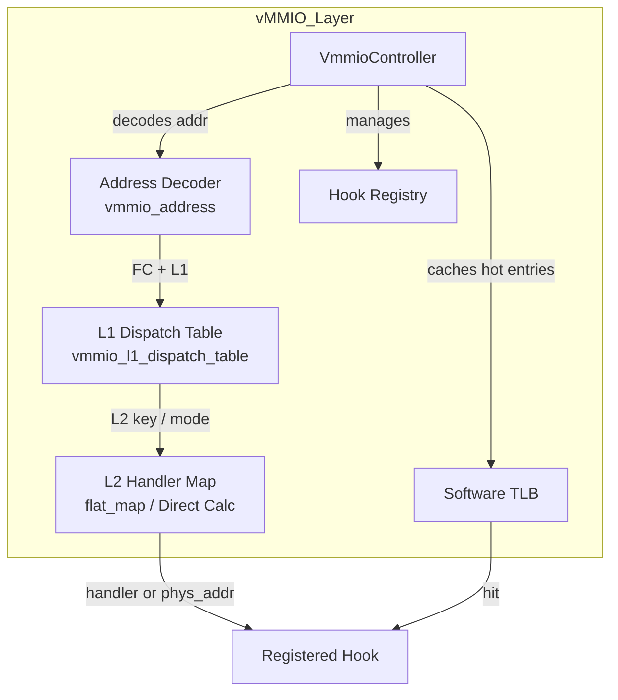
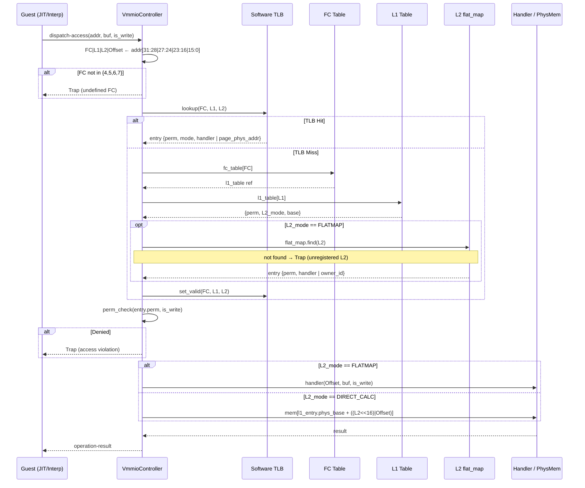
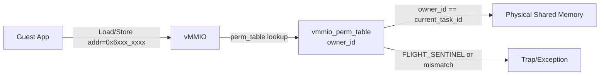

# vMMIO コンポーネント設計書 (改訂版)

## 1. コンセプト
vMMIO (Virtual Memory-Mapped I/O) は、WASMゲストとホスト間の**すべてのデータ交換**を仲介する統一的なアクセス層である。物理レジスタ（GPIO等）、共有メモリ、システムコール用バッファなど、ホスト-ゲスト間境界を横切るアクセスはすべてvMMIO空間を経由する。WASMの仕様に基づき、**割り当て単位は1ページ（64KB）**とし、各デバイス領域は64KB境界に配置される。 `{RestrictedPhysicalAccess}` `{vMMIO_TrapAndEmulate}` `{PhysicalPassthrough}` `{WasmPageAlignment}` `{DynamicMmap}` `{UnifiedAccessModel}`

32ビットアドレスを **Function Code / L1 Index / L2 Index / Offset** の4フィールドに分割する**階層型アドレスデコード**を採用する。これにより、Function Code によるサブシステム単位の即時ルーティングと、L1/L2 による高速なデバイス解決を両立する。 `{HierarchicalAddressDecode}`

セキュリティモデルは**エントリに埋め込まれた権限フィールドが唯一のゲート**である。アクセス権限は flatmap エントリ（L2_FLATMAP）または L1 テーブルエントリ（L2_DIRECT_CALC）に保持され、ルックアップと権限チェックを1パスで完結させる。動的な性能向上のため、セキュリティゲートを以下の3層に階層化する。 `{RoleBasedAccessControl}`

1. **Tier 1 (ゲストRAM)**: ゲスト専用RAM領域。コンパイル時または実行時の単純な境界チェック（加算/比較）のみで処理。
2. **Tier 2 (静的vMMIO, FC=4)**: コンパイル時にアドレスが確定するコアデバイス（SYSCTL, IPCR, VDMA等）。JIT生成時に許可チェックを行い、許可済みならネイティブコードに直接物理アドレスを埋め込む。
3. **Tier 3 (動的vMMIO, FC=5-7 / Syscall)**: DYNAMIC・SHM・PASSTHROUGH領域や `fireball_call` 経由のアクセス。実行時にL1/L2テーブルを経由して解決し、エントリの権限フィールドで可否を判定する。

IPC経由のデータ交換は行わない — GPIOのようなsub-µs応答が必要な周辺機器はIPCレイテンシに耐えられないため、このダイレクトアクセスモデルが採用されている。 `{Fast_Path_GPIO}`

## 2. アーキテクチャ分類
本コンポーネントは **Tier 3 (実装ドメイン)** に属する。仮想的なレジスタアクセスとDMA転送に特化した単一責務のモジュールとして設計する。 `{3TierSeparation}`

## 3. 静的モデル

### 3.1 データ構造

リソース制約上、構造体は **ROM（不変）** と **RAM（可変）** に明確に分離する。

| 配置 | 構造体 | 概要 |
| :--- | :--- | :--- |
| ROM | `vmmio_address` | アドレスビットフィールド定義（コード上の型のみ、実体なし） |
| ROM | FC ディスパッチテーブル | FC → L1テーブル参照の定数配列 |
| ROM | `vmmio_l1_dispatch_table` | L2_mode・phys_base・L2 flatmap 参照（init後不変） |
| ROM | `vmmio_l2_static_table` | FC=4/7 向け L2→ハンドラ の定数 flatmap（ハンドラポインタは init後不変） |
| RAM | `vmmio_perm_table` | L2 flatmap エントリごとの perm フラグと FC=6 の owner_id（実行時に変化） |
| RAM | `vmmio_dynamic_region` | FC=5 DYNAMIC の実行時エントリ（全体が可変） |
| RAM | TLB valid ビット列 | TLB スロットの有効フラグのみ（ルーティングデータは ROM 参照） |

- **`VmmioController`**: アドレスデコード、L1ディスパッチ、ハンドラ解決、動的マッピング管理を担う主要クラス。
- **`vmmio_config`**: 静的な領域定義 (`vmmio_static_region`) の不変なテーブル。 `{Static_Resolution}`

### 3.2 内部ブロック図


### 3.3 主要なクラス・構造体・配列・定数

#### `vmmio_address` (アドレスフィールド定義)
32ビットゲストアドレスを4つのフィールドに分割するビットフィールド構造体。`VmmioController` はアドレスを本構造体にキャストしてデコードする。

| 項目名 | 機能と役割 | 備考（制約、型など） |
| :--- | :--- | :--- |
| Function Code | デバイス分類やサブシステム種別を示す最上位ルーティングキー。FC単位で即時にディスパッチ先が決定される。 | ビット31:28（4 bits）、16種別 |
| L1 Index | Function Code内でプライマリハンドラテーブルを選択するインデックス。 | ビット27:24（4 bits）、16エントリ |
| L2 Index | ハンドラの詳細解決に使用するセカンダリキー。`flat_map` によるルックアップか、物理アドレス計算への直接連結かを Function Code の要件に応じて切り替える。 | ビット23:16（8 bits）、256エントリ |
| ページ内オフセット | 64KBページ内でのバイトオフセット。各ハンドラに渡される。 | ビット15:0（16 bits）、64KB |

**アドレス分解の対応関係（vMMIO_BASE = `0x4000_0000`）**

| アドレス範囲 | FC | 割り当て用途 |
| :--- | :--- | :--- |
| `0x4000_0000` – `0x4FFF_FFFF` | 4 | コアデバイス（SYSCTL, IPCR, VDMA）および予約固定デバイス |
| `0x5000_0000` – `0x5FFF_FFFF` | 5 | DYNAMIC（動的マッピング領域） |
| `0x6000_0000` – `0x6FFF_FFFF` | 6 | SHM（共有メモリ領域） |
| `0x7000_0000` – `0x7FFF_FFFF` | 7 | PASSTHROUGH（物理アドレス直結領域） |

#### `VmmioController` クラス
アドレスデコード・L1/L2ディスパッチ・フック管理をカプセル化する。

| 項目名 | 機能と役割 | 備考（制約、型など） |
| :--- | :--- | :--- |
| L1ディスパッチテーブル群 | FC毎の `vmmio_l1_dispatch_table` への参照。FCを添字として O(1) でアクセスする。 | `vmmio_l1_dispatch_table[16]`（FC数分） |
| フックレジストリ | 実行時に登録されたハンドラ群の保持。`hook_id` で引く。 | `vmmio_hook_registry` |
| ソフトウェアTLB | 直近にヒットしたL1+L2エントリをキャッシュする小テーブル。Tier 3 アクセスの高速化に使用する。 | `vmmio_tlb_entry[N]`（定数N はコンパイル時固定） |
| 動的領域数 | 現在使用中の DYNAMIC 領域のスロット数 | エントリ数 |

#### `vmmio_l1_dispatch_table` (ROM — L1ディスパッチテーブル)
Function Codeひとつに対応するL1テーブル。init 後は不変のため ROM 配置。各エントリはL2の解決方式と、L2_DIRECT_CALC時のベースアドレスを保持する。権限フラグは RAM 側の `vmmio_perm_table` が担うため本テーブルには含まない。

| 項目名 | 機能と役割 | 備考（制約、型など） |
| :--- | :--- | :--- |
| L2静的テーブル参照 | L2_FLATMAPモード時に参照する `vmmio_l2_static_table` へのポインタ。 | `const vmmio_l2_static_table*` |
| L2解決モード | `flat_map` ルックアップか物理アドレス直接計算かを示すフラグ。 | 列挙値（`L2_FLATMAP` / `L2_DIRECT_CALC`） |
| パススルーベースアドレス | `L2_DIRECT_CALC` モード時、当該リージョンの物理ベースアドレス。L1がリージョン選択に対応する。 | `uint32_t`（`vsoc_config` から注入） |

#### `vmmio_l2_static_table` (ROM — L2静的ディスパッチテーブル)
FC=4/7 向けの L2 → ルーティング情報の定数テーブル。init 後は不変。FC=5/6 はこのテーブルを持たない（DYNAMIC は全体 RAM、SHM の物理ベースは後述 `vmmio_perm_table` に含む）。

| 項目名 | 機能と役割 | 備考（制約、型など） |
| :--- | :--- | :--- |
| L2 キー | flatmap のキー。L2 Index 値。 | `uint8_t` |
| ハンドラ | アクセス時に呼び出す関数へのポインタ。FC=4 向け。 | `const vmmio_handler*` |

#### `vmmio_perm_table` (RAM — 実行時権限テーブル)
L2 flatmap エントリごとの可変状態。ROM のルーティングテーブルとは分離して保持する。FC=6 のみ `owner_id` と `phys_page_base` を使用する。**FC=6 エントリへの書き込みは IPCルータのみが行う。vMMIO は読み取り・執行のみ。**

`owner_id` の状態定義（型・予約値の正規定義は [system_config_details.md §2.7](system_config_details.md#27-型定義予約値) 参照）：

| 値 | 状態 | 意味 |
| :--- | :--- | :--- |
| `FB_TASK_ID_INVALID` (= `0`) | 未割り当て | アクセス不可 |
| `FB_TASK_ID_FLIGHT` (= `0xFF`, FLIGHT_SENTINEL) | In-flight | 所有権移譲中。送受信タスク双方アクセス不可 |
| `task_id` (`1`〜`FB_CONF_MAX_TASKS`) | 所有 | 当該タスクのみアクセス可 |

| 項目名 | 機能と役割 | 備考（制約、型など） |
| :--- | :--- | :--- |
| 権限フラグ | 読み取り・書き込みの可否。アクセスごとにチェックする。 | R/W ビット |
| 所有者ID | FC=6 (SHM) 専用。IPCルータが所有権遷移に合わせて更新する。 | `task_id`（FC≠6では未使用） |
| 物理ページ基底アドレス | FC=6 (SHM) 専用。ハンドラを経由せず直接アクセスに使用する。 | `uint32_t`（FC≠6では未使用） |

#### `vmmio_handler` (ハンドラ定義)
読み書きアクセス発生時に呼び出される関数の共通インターフェイス。

| 項目名 | 機能と役割 | 備考（制約、型など） |
| :--- | :--- | :--- |
| アクセス形式定義 | 相対オフセットとデータ列（可変バイナリビュー）を引数に取る関数の形式 | `status(offset, span, is_write)` |

## 4. 動的モデル

### 4.1 アルゴリズム: アクセスディスパッチ

ゲストのアドレスアクセスは以下のロジックで解決される。

```
1. [アドレスデコード]
   vmmio_address フィールドへキャストし、FC / L1 / L2 / Offset を抽出する。

2. [Tier 判定]
   - アドレスが vmmio_base 未満 → Tier 1 (ゲストRAM): 境界チェックのみ。
   - FC が定義済み範囲（{4,5,6,7}）外 → 即時トラップ（未定義FC）。
   - FC=4（コアデバイス）→ Tier 2: JIT実行パスでは許可済みネイティブコードへ直接進む。
     インタプリタ実行パスでは Tier 3 と同一フロー（手順3以降）を経る。
   - FC=5/6/7 → Tier 3: 手順3へ進む。

3. [TLB ルックアップ]
   - TLB ヒット → キャッシュ済みエントリを取得し、手順5へ。
   - TLB ミス → 手順4（テーブルウォーク）へ進み、TLBを更新。

4. [テーブルウォーク (TLBミス時のみ)]
   a. FC を添字に L1 テーブルを O(1) 参照し、L1 Index でエントリを選択する。
   b. L2解決モード が L2_FLATMAP の場合: `flat_map.find(L2)` で `vmmio_entry` を取得する。
      エントリが存在しない（未登録L2）場合は即時トラップ（アクセス違反）。
      L2解決モード が L2_DIRECT_CALC の場合: L1 エントリの権限・ベースアドレスをそのまま使用。
   c. 取得したエントリを TLB に登録する。

5. [権限チェック]
   エントリの権限フラグを is_write と照合する。
   - FC=6 (SHM) かつ所有者IDフィールドが有効な場合: entry.owner_id == current_task_id も検証する。
   - 権限なし → メモリアクセス違反トラップ。

6. [アクセス実行]
   a. L2_FLATMAP: エントリのハンドラに Offset と span を渡して呼び出す。
   b. L2_DIRECT_CALC: L1テーブルエントリの `phys_base` を取得し、`phys_base + ((L2 << 16) | Offset)` に対して直接ロード/ストアを実行する。L1はオフセットには含めず、リージョン選択のみに使用する。
```

**ディスパッチシーケンス**


### 4.2 アルゴリズム: 仮想DMA (VDMA)
ゲストリニアメモリと vMMIO 空間（または他のメモリ領域）間の高速転送を実現する。 `{VDMA}`

**アクセス方式**: 純粋MMIOトラップ。直接vMMIOアドレスにアクセス可能なゲストはVDMAレジスタへ直接書き込み、アクセス不可なゲスト言語は `fireball_call(VDMA_START)` 経由でホストが代理実行。

1. **転送設定**: ゲストが `REG_VDMA_SRC`, `REG_VDMA_DST`, `REG_VDMA_COUNT` にパラメータを書き込む。
2. **トリガー**: `REG_VDMA_CTRL` の `START` ビットを `1` に書き込む。
3. **実行**: 
   - vMMIO ハンドラが物理アドレスを解決（境界チェック含む）。
   - `std::memcpy` または HAL経由のDMAを用いて一括転送を実行。
4. **完了**: 転送完了後、必要に応じてゲストに仮想割り込み（`IRQ_VDMA_DONE`）を通知する。

TODO(Phase 0.8): vMMIO TLA+ Verification - ソフトウェアTLBのキャッシュ整合性と、階層化されたアドレスデコードの正当性を検証する。

### 4.3 仮想デバイスマップ
各領域は 64KB (WASM 1 page) 単位で割り当てられる。`vMMIO_BASE = 0x4000_0000`。Function Code が領域種別を決定し、L1/L2 がページを識別する。

| アドレス範囲 | FC | L2_mode | L1 | L2 | デバイス名 | 説明 |
| :--- | :--- | :--- | :--- | :--- | :--- | :--- |
| `0x4000_0000` | `4` | FLATMAP | `0` | `0` | **SYSCTL** | システム制御（Yield, Halt, Syscall等） |
| `0x4001_0000` | `4` | FLATMAP | `0` | `1` | **IPCR** | IPCルータ連携レジスタ |
| `0x4002_0000` | `4` | FLATMAP | `0` | `2` | **VDMA** `{VDMA}` | 仮想DMA（バルク転送） |
| `0x5000_0000` – `0x5FFF_FFFF` | `5` | FLATMAP | `0x0`–`0xF` | `0x00`–`0xFF` | **DYNAMIC** | 動的マッピング領域 |
| `0x6000_0000` – `0x6FFF_FFFF` | `6` | FLATMAP | `0x0`–`0xF` | `0x00`–`0xFF` | **SHM** | 共有メモリ（1領域=1ページ） |
| `0x7000_0000` – `0x7FFF_FFFF` | `7` | DIRECT_CALC | `0x0`–`0xF` | `0x00`–`0xFF` | **PASSTHROUGH** | 物理アドレス直結 |

PASSTHROUGH アドレス変換（`L2_DIRECT_CALC` モード）:
`物理アドレス = l1_table[L1].phys_base + ((L2 << 16) | Offset)`
L1 はリージョン選択のみに使用し、オフセット計算には含めない。これにより L1 ごとに異なる物理ベースアドレスを持つ複数のパススルー領域（異なるペリフェラルバス等）を独立して定義できる。各エントリの `phys_base` は `vsoc_config` から注入される。

### 4.4 SYSCTL レジスタ詳細 (FC=4, L1=0, L2=0)
| オフセット | レジスタ名 | R/W | 説明 |
| :--- | :--- | :--- | :--- |
| `0x00` | `REG_SYS_CONTROL` | W | `1`: Reset, `2`: Yield, `3`: Halt, `4`: Syscall |
| `0x04` | `REG_SYS_STATUS` | R | システム状態フラグ |
| `0x08` | `REG_IRQ_FLAGS` | R/W | 仮想割り込みフラグ |
| `0x10` | `REG_SYSCALL_ID` | R/W | サービスID |
| `0x14` | `REG_SYSCALL_CMD` | R/W | コマンドID |
| `0x18` | `REG_SYSCALL_ARG0` | R/W | 第1引数 / 戻り値 |
| `0x1C` | `REG_SYSCALL_ARG1` | R/W | 第2引数 |
| `0x20` | `REG_SYSCALL_ARG2` | R/W | 第3引数 |
| `0x24` | `REG_SYSCALL_ARG3` | R/W | 第4引数 |
| `0x28` | `REG_SYSCALL_ARG4` | R/W | 第5引数 |
| `0x2C` | `REG_SYSCALL_ARG5` | R/W | 第6引数 |

### 4.5 VDMA レジスタ詳細 (FC=4, L1=0, L2=2)
| オフセット | レジスタ名 | R/W | 説明 |
| :--- | :--- | :--- | :--- |
| `0x00` | `REG_VDMA_SRC` | R/W | 転送元アドレス |
| `0x04` | `REG_VDMA_DST` | R/W | 転送先アドレス |
| `0x08` | `REG_VDMA_COUNT` | R/W | 転送バイト数 |
| `0x0C` | `REG_VDMA_CTRL` | W | 制御（Bit0: START） |

`REG_VDMA_SRC` / `REG_VDMA_DST` に指定できるアドレスはゲストRAM（Tier 1）および vMMIO空間（FC=5/6/7）。SHMアドレス（FC=6）を転送先/元に指定した場合、VDMAハンドラが `dispatch-access` と同一の権限チェック（`owner_id` 検証を含む）を実施する。

### 4.6 共有メモリマッピング (FC=6)
SHM へのアクセスは **IPCルータ経由でのみ許可される**。ゲストは IPCルータからハンドルを受け取ることによってのみ FC=6 アドレス空間にアクセスできる。SHM の所有権状態は IPCルータが一元管理し（`ipc_router.md` §4.1 所有権移譲モデル準拠）、vMMIO はその状態を執行するのみ。 `{OwnershipTransfer}`

- **SHMハンドル**: `(L1 << 8) | L2` の 12bit 値。L1 ≤ 15、L2 ≤ 255 を IPCルータが生成時に保証する。
- **アクセスアドレス**: `0x6000_0000 | (L1 << 20) | (L2 << 16) | offset_in_page`。



#### ライフサイクル（ipc_router.md §4.1 に従属）

1. **Alloc**: COOS が SHM 物理ページを確保し、IPCルータに登録する。`owner_id` = 送信タスクID。
2. **Revoke**: IPCルータが送信タスクの権限を無効化する。`owner_id` を `FLIGHT_SENTINEL` にセットし、TLB の該当エントリを無効化する。
3. **Enqueue**: IPCルータが受信チャネルへハンドルを含むメッセージを Push する。キュー満杯時は Rollback し、`owner_id` を送信タスクIDに復元する。
4. **Grant**: 受信タスクがデキューした瞬間、IPCルータが `owner_id` を受信タスクIDにセットする。
5. **Drop**: 受信先が Kill された場合、Drop Handler が IPCルータに通知し、`owner_id` をクリアしてリソースを回収する。

### 4.7 仮想割り込みマッピング
物理割り込みから仮想割り込みIDへのマッピングは**静的1:1**とし、別コンフィグ（`irq_mapping_config`）で定義される。 `{ConfigurableSystem}`

- **マッピング方式**: 物理IRQ 1: 仮想IRQ 1。集約しない。
- **ゲスト側確認方式**: ポーリング。ゲストがstep再開時に `REG_IRQ_FLAGS` をチェック。
- **コールバック登録**: Phase1+で検討。
- **設定ファイル**: `vsoc_config` とは分離。`irq_mapping_config` として独立管理。

@see `system_syscall.md` §8.1

### 4.8 静的予約
DYNAMIC 領域（FC=5）の一部を、システムの初期化時に特定のデバイス用として永続的に予約する。これにより、実行時の動的確保のオーバーヘッドを排除する。 `{Static_Resolution}`
予約された領域は、ゲストからは通常の DYNAMIC 領域の一部として見えるが、vSoC内部では固定されたマッピングとして扱われる。

### 4.9 ソフトウェアTLB `{vMMIO_TLB}`
Tier 3 アクセスにおいて、毎回テーブルウォークするのは低速であるため、直近に解決した (FC, L1, L2) → `vmmio_entry` のマッピングをキャッシュする静的配列TLBを導入する。

- **配置の分離**: TLB は ROM 部と RAM 部に分離する。
  - **ROM**: スロット配列本体。ルーティング結果（ハンドラポインタ・phys_base・L2_mode）を保持する定数配列。エントリ数 `N` はコンパイル時定数。init 時に静的デバイス（FC=4/7）のエントリを事前充填し、以降不変とする。
  - **RAM**: valid ビット列のみ（`uint8_t valid[N]` 相当）。FC=6 の `owner_id` 変更時に対象スロットの valid ビットをクリアして無効化する。
- **構造**: direct-mapped。スロットインデックス = `(FC ^ L1 ^ L2) % N`。衝突時は ROM エントリを上書きできないため、ミスとして扱いテーブルウォークへフォールバックする。
- **権限チェック**: TLB はルーティングのみをキャッシュする。perm フラグと owner_id は毎回 `vmmio_perm_table`（RAM）から読み取る。TLB ヒットが権限チェックをバイパスすることはない。

## 5. インターフェイス定義

### 5.1 公開API
外部から利用可能なオブジェクト指向APIを定義する。

TODO(Phase 1): ATCの抽出 - フック登録や静的予約が可能なライフサイクルの制約（初期化フェーズ中のみ等）を事前・不変条件として定義すること。

#### フック登録 (`register-hook`)

| 項目 | 内容 |
| :--- | :--- |
| 機能概要 | 既に定義（ROM）されている領域に対して、ホスト側のハンドラの実装アドレスを紐づける。 |
| シグネチャ | `register-hook(hook-id: hook-category, handler-addr: mem-address) -> operation-result` |
| 引数と役割 | `hook-id`: 対象の領域カテゴリ（FC/L1/L2の組み合わせを識別）<br>`handler-addr`: ハンドラ関数の物理アドレス |
| 事前条件 | `hook-id` が `vsoc.wit` で定義された有効なIDであること。未登録であること。 |
| 事後条件 | フックレジストリにエントリが追加される。 |
| 不変条件 | アドレスマップ定義（L1テーブル構造）自体は変更されない。 |
| エラー時の挙動 | 無効なIDの場合はエラーを返す。二重登録は拒否する。 |
| 期待する結果 | 正常：フックが登録され、以降のアクセスで呼び出される。 |

#### 静的領域の予約 (`reserve-static-regions`)

| 項目 | 内容 |
| :--- | :--- |
| 機能概要 | DYNAMIC 領域（FC=5）の先頭から指定されたページ数を静的に予約する。システム初期化時に一度だけ呼び出されることを想定する。 |
| シグネチャ | `reserve-static-regions(pages-count: u32) -> void` |
| 引数と役割 | `pages-count`: 予約する総ページ数 |
| 事前条件 | システム初期化フェーズであること。動的領域に十分な空きがあること。 |
| 事後条件 | FC=5 空間の管理情報が更新され、領域が確保される。 |
| 不変条件 | 予約済みページは実行中に再割り当てされない。 |
| エラー時の挙動 | 空きページ不足の場合はアボート。 |
| 期待する結果 | 正常：FC=5 の管理情報が更新され、予約済み領域としてマークされる。 |

#### アクセスディスパッチ (`dispatch-access`)

| 項目 | 内容 |
| :--- | :--- |
| 機能概要 | vSoC 実行エンジンからトラップされたメモリアクセスをアドレスのFC/L1/L2/Offsetに分解し、flatmapエントリの権限フィールドで検証した上で適切なハンドラへ振り分ける。 |
| シグネチャ | `dispatch-access(addr: mem-address, buffer: list<u8>, is-write: bool) -> operation-result` |
| 引数と役割 | `addr`: アクセス先アドレス（vmmio_address として分解）<br>`buffer`: データバッファ (read時out, write時in)<br>`is-write`: 書き込みフラグ |
| 事前条件 | `addr >= vmmio_base && addr < vmmio_base + vmmio_size` |
| 事後条件 | 許可アドレス：ハンドラ実行完了。非許可アドレス：アクセス違反トラップ。 |
| 不変条件 | アドレスデコードの結果は決定論的である（同一アドレスは常に同一のFC/L1/L2に解決される）。 |
| エラー時の挙動 | 非許可アドレス、未登録ハンドラへのアクセスはトラップを発生させる。 |
| 期待する結果 | 正常：エントリの権限チェックを通過し、登録されたハンドラが実行され、レジスタ操作の結果がゲストに反映される。 |
| 補足 | Software TLB ヒット時はフルスキャンを省略する。PASSスルーはL2_DIRECT_CALCで物理アドレスに直結し、追加ハンドラ呼び出しを行わない。 |

## 6. 制約達成の方策

### 6.1 性能制約と方策
- **目標**: MMIOアクセスのオーバーヘッドを最小化する。
- **方策1**: `{ConfigurableSystem}` コアデバイス（SYSCTL等）をFC=4/L1=0/L2=0に配置し、L1テーブルの先頭エントリで即時解決できるようにする。
- **方策2**: `{HierarchicalAddressDecode}` Function Code による最上位ルーティングで、ディスパッチの探索空間をFC単位に分割し、ホットパスでのルックアップコストを削減する。
- **方策3**: `{vMMIO_TLB}` Software TLB により Tier 3 の繰り返しアクセスを高速化する。

### 6.2 メモリ制約と方策
- **目標**: マップ管理用のメモリを最小化する。
- **方策**: `{ConfigurableSystem}` L1テーブルのエントリ数・Software TLBのエントリ数・最大登録フック数をコンパイル時に固定し、静的配列として確保する。

### 6.3 安全性制約と方策
- **目標**: ゲストが許可されていない物理アドレスにアクセスできないことを保証する。
- **方策**: `{RoleBasedAccessControl}` `{OwnershipTransfer}` 権限チェックを `vmmio_perm_table` に集約し、TLBヒット時も含むすべてのアクセスパスで必ず実行する。TLBはテーブルウォークのスキップのみを担い、権限チェックをバイパスしない。FC=6 (SHM) の所有権は IPCルータが唯一の書き込み権限を持ち、Revoke 時に TLB エントリを即時無効化する。vMMIO は執行のみ行い、所有権の判断を行わない。
