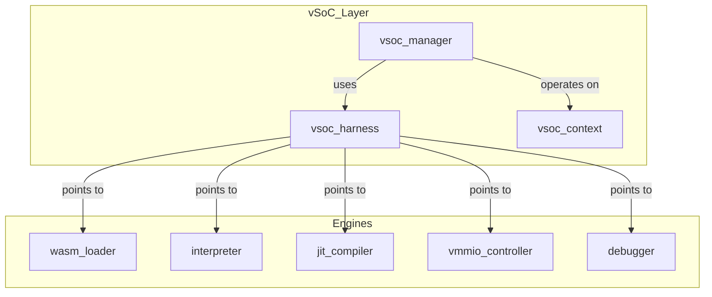
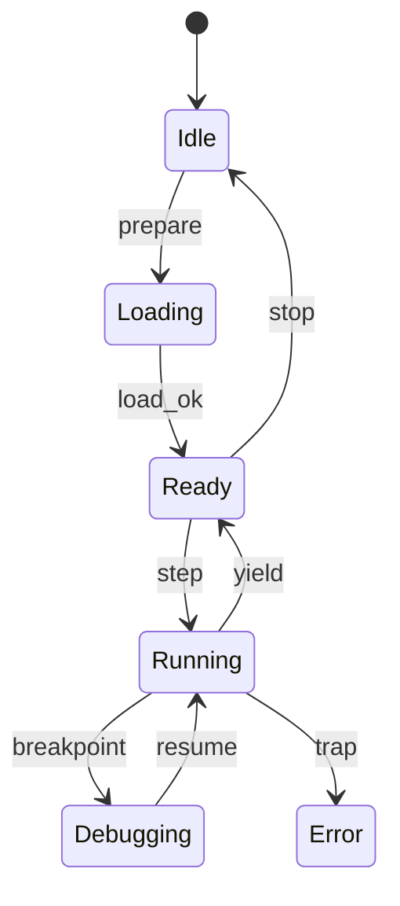
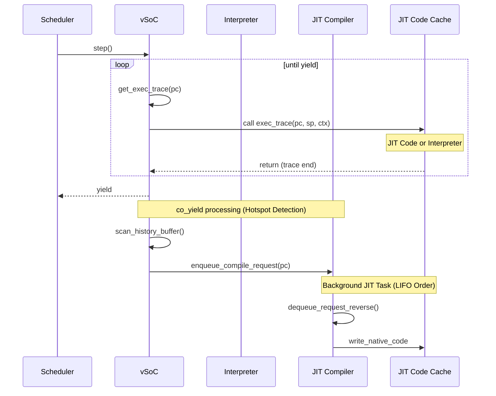
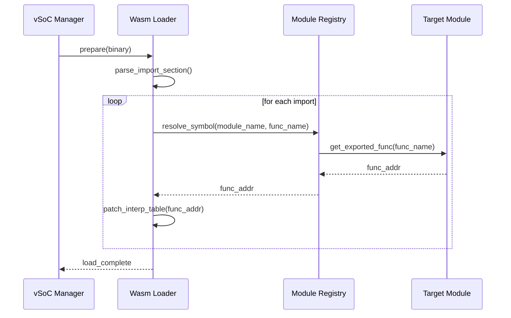

# vSoC コンポーネント設計書

## 1. コンセプト
<!-- traceability: {LowLatencyJIT} {MemoryIsolation} {FaultIsolation} {EnvironmentPointer} -->
vSoC (Virtual System-on-Chip) は、WASM実行環境の統合マネージャであり、Loader、Interpreter、JIT、vMMIO、Debugger を統括して実行制御を行う。各サブコンポーネントを統合する「環境」としての役割を持ち、`vsoc_runtime` を `execution_context` から参照される Environment として提供する。 `{LowLatencyJIT}` `{MemoryIsolation}` `{FaultIsolation}` `{EnvironmentPointer}`

## 2. アーキテクチャ分類
<!-- traceability: {3TierSeparation} {ComponentHarness} -->
本コンポーネントは **Tier 2 (サブシステムドメイン)** に属し、Stateless Interface と Harness パターンを用いて構造化される。 `{3TierSeparation}` `{ComponentHarness}`

## 3. 静的モデル

### 3.1 データ構造
<!-- traceability: {StaticDI} -->
- **`vsoc_harness`**: vSoCが依存する各種エンジン（Loader, Interpreter, JIT等）のインターフェイスを集約した構造体。 `{StaticDI}`
- **`vsoc_context`**: 現在の実行状態、仮想割り込み、JITキャッシュの管理状態など、可変なランタイム状態。
- **`vsoc_config`**: メモリ割り当てやJIT有効化フラグなどの不変な構成情報。

### 3.2 内部ブロック図
<!-- traceability: {StaticDI} -->

### 3.3 主要なクラス・構造体・配列・定数
<!-- traceability: {StaticDI} -->

#### vSoCハーネス（vsoc_harness）
各エンジンへのインターフェイスを集約する。PODとして扱い、メンバに末尾アンダースコアは付与しない。

| 項目名 | 機能と役割 | 備考（制約、型など） |
| :--- | :--- | :--- |
| WASMローダ | WASMモジュールのロードと解析を担うコンポーネントへの参照。 | `WasmLoader*` |
| インタープリタ | WASMバイトコードを逐次実行するエンジンへの参照。 | `Interpreter*` |
| JITコンパイラ | ホットスポットをネイティブコードに変換するエンジンへの参照。 | `JitCompiler*` |
| デバッガ | RSPプロトコルを介したデバッグ機能を提供するコンポーネントへの参照。 | `Debugger*` |
| vMMIO | 仮想的なメモリマップドI/Oを制御するコンポーネントへの参照。 | `VmmioController*` |

#### vSoCコンテキスト（vsoc_context）
可変な実行状態を保持する。

| 項目名 | 機能と役割 | 備考（制約、型など） |
| :--- | :--- | :--- |
| 割り込みフラグ | ゲストに通知された仮想割り込みの状態を保持する。 | 32bitフラグ |
| モジュールビュー | ロード済みWASMモジュールの索引情報への参照。 | `wasm_module_view*` |
| プログラムカウンタ | ゲストの現在のプログラム実行位置（WASMオフセット）。 | `uint32_t` |

#### vSoC構成（vsoc_config）
<!-- traceability: {ConfigurableSystem} -->
vSoCの動作パラメータを定義する。 `{ConfigurableSystem}`

| 項目名 | 機能と役割 | 備考（制約、型など） |
| :--- | :--- | :--- |
| JIT有効化フラグ | システム全体でJITコンパイル機能を有効にするかどうかを決定する。 | ブール値 |
| コードキャッシュサイズ | 生成されたネイティブコードを保存するためのメモリ領域の大きさ。 | バイト数 |
| RAM開始アドレス | ゲストから見たRAMの仮想アドレス空間上の開始位置。 | 通常 0x0 |
| RAM容量 | ゲストに割り当てられるRAMの総バイト数。 | バイト数 |
| vMMIO基点アドレス | 仮想デバイスレジスタが配置されるアドレス空間の開始位置。 | 通常 0x4000_0000 |
| パススルー基点アドレス | PASSTHROUGH領域が参照する物理アドレス空間の開始位置。`物理addr = passthrough_base + offset` | ARM Cortex-M: 0x4000_0000 |

## 4. 動的モデル

### 4.1 アルゴリズム
<!-- traceability: {ThreadedInterpreter} {JIT_CopyAndPatch} {Challenge_ApproximateYield} {JIT_Safepoint} {Debugger_Jit_Flush} -->
- **実行エンジン委譲 (exec_trace)**: vSoCは `step()` で現在のPCに対応する `exec_trace` を呼び出す。 `exec_trace` はインタープリタのディスパッチャまたはJITコードを指し、呼び出し側は実行エンジンを意識する必要がない。 `{ThreadedInterpreter}` `{JIT_CopyAndPatch}`
- **概算Yield**: 監視対象の `yield_threshold` を基準に `co_yield` を発行する。 `{Challenge_ApproximateYield}`
- **デバッグ連携**: `step()` 前後で Debugger を呼び出し、HAL層からのコマンドを処理する。
- **JIT Safepoint (非同期割込対応)**: `{JIT_Safepoint}`
    - JIT生成されるネイティブコードのループバック点（バックエッジ）に、ソフトウェアフラグ（またはタイマ割込状況）をチェックし、必要に応じて `executor_loop` へ強制フォールバックするフック（Safepoint）を埋め込む。これにより、JIT実行中の非同期ブレークポイント（Ctrl+C等）への応答性を担保する。
- **デバッガ介入時キャッシュ一貫性 (Cache Flush)**: `{Debugger_Jit_Flush}`
    - デバッガがメモリ上の変数を書き換えた場合、該当タスクに関連するJITキャッシュ（Active/Old）をすべて無効化（Flush）し、インタープリタ実行からやり直すことで整合性を維持する。

TODO(Phase 0.8): vSoC Interpreter / JIT / Debugger TLA+ Verification - JIT実行中の Safepoint フォールバックと、デバッガ介入時の状態整合性を形式検証する。

### 4.2 状態遷移図
<!-- traceability: {ThreadedInterpreter} {JIT_CopyAndPatch} {Challenge_ApproximateYield} {JIT_Safepoint} {Debugger_Jit_Flush} -->

### 4.3 内部シーケンス
<!-- traceability: {ThreadedInterpreter} {JIT_CopyAndPatch} {Challenge_ApproximateYield} {JIT_Safepoint} {Debugger_Jit_Flush} -->
#### WASM実行およびJIT遷移シーケンス

<!-- traceability: {JIT_CopyAndPatch} {Interpreter_LazyJITSwitch} {Challenge_JITCacheEfficiency} -->

#### マルチモジュール動的リンクシーケンス
<!-- traceability: {MultiModule_Support} -->
複数学のWASMモジュール間の依存関係を解決し、関数ポインタを接続する。 `{MultiModule_Support}`

## 5. インターフェイス定義

### 5.1 公開API
外部から利用可能なオブジェクト指向APIを定義する。

TODO(Phase 1): ATC抽出 - JITキャッシュ有効時やエラー時の実行リカバリ戦略を含む、厳格な事前/事後/不変条件を各APIに定義すること。

#### 準備（prepare）
| 項目 | 内容 |
| :--- | :--- |
| 機能概要 | 指定されたWASMバイナリデータを読み込み、実行準備を完了させる。 |
| シグネチャ | `prepare(wasm: binary-view) -> result<wasm-module-view, sys-recovery-strategy>` |
| 引数 | `ctx`: vsoc_context, `wasm`: バイナリデータとサイズ |
| 期待する結果 | 正常：モジュールがロードされ、内部状態がReadyになる。異常：検証失敗時等のエラー。 |
| 事前条件 | システムが初期化済みであること。 |
| 事後条件 | `ctx->module_view` が構築され、実行可能状態になる。 |
| 不変条件 | 既存の実行コンテキストが破壊されないこと。 |
| エラー時の挙動 | 不正なバイナリの場合はロードを中断し、エラー値を返す。 |
| 補足 | ROM上のデータを直接参照するため、RAMへのコピーは発生しない。 |

#### ステップ実行（step）
<!-- traceability: {RecoveryStrategy} -->
| 項目 | 内容 |
| :--- | :--- |
| 機能概要 | ゲストのプログラム実行を再開し、コルーチンの `yield` またはトラップが発生するまで継続する。 |
| シグネチャ | `step() -> result<execution-state-category, sys-recovery-strategy>` |
| 引数 | `ctx`: vsoc_context, `harness`: vsoc_harness |
| 期待する結果 | 正常：一定期間の実行後に制御が戻る。異常：トラップ発生。 |
| 事前条件 | 状態が Ready であること。 |
| 事後条件 | PCやレジスタ状態が更新されていること。 |
| 不変条件 | ゲストRAMの境界外へのアクセスが発生しないこと。 |
| エラー時の挙動 | トラップ（例外）発生時は、トラップ要因を保持してエラーを返す。 `{RecoveryStrategy}` |
| 補足 | 内部的にはインタープリタとJITコードを透過的に切り替えて実行する。 |

#### `notify-interrupt`
<!-- traceability: {RecoveryStrategy} -->
| 項目 | 内容 |
| :--- | :--- |
| 機能概要 | 物理割り込み等の外部イベントをゲストOS/アプリに通知するための仮想フラグを設定する。 |
| シグネチャ | `notify-interrupt(irq-id: u32) -> void` |
| 引数 | `ctx`: vsoc_context, `irq-id`: 識別子 |
| 期待する結果 | 特定位のアドレス（SYSCTLレジスタ）にフラグが反映される。 |
| 事前条件 | なし。 |
| 事後条件 | `ctx->interrupt_flags` が更新される。 |
| 不変条件 | 他の実行状態に副作用を及ぼさないこと。 |
| エラー時の挙動 | 無効なIDの場合は無視される。 |
| 補足 | ISRから呼び出されることを想定し、排他制御を考慮する。 |

#### `register-hook`
<!-- traceability: {vMMIO_TrapAndEmulate} -->
| 項目 | 内容 |
| :--- | :--- |
| 機能概要 | ゲストの特定のメモリ範囲（hook_idで識別）へのアクセスに対し、ホスト側の関数をプラガブルに登録する。 |
| シグネチャ | `register-hook(hook-id: hook-category, handler-addr: mem-address) -> operation-result` |
| 引数 | `harness`: vsoc_harness, `hook-id`: 領域識別子, `handler-addr`: ハンドラアドレス |
| 期待する結果 | 指定範囲へのアクセス時に登録したコールバックが実行されるようになる。 |
| 事前条件 | 指定された `hook-id` が定義済みであること。 |
| 事後条件 | vMMIOレジストリにエントリが追加される。 |
| 不変条件 | アドレスマップ定義自体は変更されない。 |
| エラー時の挙動 | 無効なIDの場合はエラーを返す。 |
| 補足 | デバイスドライバのエミュレーションを動的に差し替えるために使用される。 `{vMMIO_TrapAndEmulate}` |

### 5.2 ネイティブAPI エクスポート
<!-- traceability: {NativeAPI_Export} -->

TODO(Phase 1): シングル・トラップ方式における sys-call 引数定義（サービスIDとコマンドIDの一覧、及び引数の型）の厳密な仕様化を行うこと。

WASMゲストからホストサービスを呼び出すための最小限のインターフェイスを提供する。 `{NativeAPI_Export}`

Fireballでは、ホスト側のコードサイズを極限まで削減するため、標準的なWASIの実装をホストから排除し、単一のトラップ命令とvMMIOレジスタによるサービス提供を行う。

- **トラップ命令**: `uint32_t fireball_call(uint32_t service_id, uint32_t command_id, uint32_t arg0, uint32_t arg1, ... uint32_t arg5)`
  - ゲストはこの関数をインポートし、サービスIDを指定して呼び出す。
  - 引数および戻り値の受け渡しは vMMIO レジスタ（`REG_SYSCALL_ARG0`等）を介して行う。
- **WASI互換性**: ゲスト側で `wasi-libc` と Fireball専用の Shim ライブラリをリンクすることで実現する。

### 5.3 マルチモジュール対応
<!-- traceability: {MultiModule_Support} -->
複数のWASMモジュール間の依存関係を解決し、動的にリンクする。 `{MultiModule_Support}`

- **Module Registry**: ロード済みのモジュールを名前で管理する。
- **Dynamic Linking**: インポートセクションに基づき、他モジュールのエクスポートを解決する。

### 5.4 URI/IPCインターフェイス
<!-- traceability: {RecoveryStrategy} {vMMIO_TrapAndEmulate} {NativeAPI_Export} {MultiModule_Support} -->
- **URI**: `fireball://vsoc/control/<instance_id>`
- **メッセージ形式**: 実行制御、状態取得用のKey-Valueプロトコル。詳細定義は IPCルータの仕様に準ずる。

### 5.5 関連コンポーネントとの連携
<!-- traceability: {RecoveryStrategy} {vMMIO_TrapAndEmulate} {NativeAPI_Export} {MultiModule_Support} -->
| コンポーネント | 連携内容 | 参照データ構造 |
| :--- | :--- | :--- |
| **Interpreter** | インタープリタ実行の委譲とホットスポット履歴の取得 | `interpreter`, 履歴バッファ |
| **JIT Compiler** | トレース単位のコンパイル要求とJITコードキャッシュ管理 | `jit_compiler`, `JIT Code Cache` |
| **Wasm Loader** | モジュールロードと `module_view` の管理 | `loader`, `module_view` |
| **Debugger** | デバッグコマンドの処理と実行状態の同期 | `debugger`, `debug_command_queue` |

## 6. 制約達成の方策

### 6.1 性能制約と方策
<!-- traceability: {LowLatencyJIT} {ThreadedInterpreter} -->
- **目標**: WAMRインタープリタを上回る実行速度を実現する。
- **方策**: `{LowLatencyJIT}` `{ThreadedInterpreter}` コピーアンドパッチJITによるネイティブ実行と、スレッドインタープリタによる高速フォールバックを組み合わせる。

### 6.2 メモリ制約と方策
<!-- traceability: {JIT_DoubleBuffer_Cache} {IndependentHeap} {WasmPageAlignment} -->
- **目標**: 64KB RAM環境で動作させる。
- **方策**: `{JIT_DoubleBuffer_Cache}` `{IndependentHeap}` ダブルバッファによる効率的なキャッシュ管理と、厳密なヒープ分離によりメモリ使用量を制御する。JITキャッシュは `FB_CONF_JIT_CACHE_SIZE`（デフォルト4096バイト、`docs/components/core/system_config_details.md`）を Active/Old の2領域に均等分割して使用し、各領域の容量は `code_cache_size / 2`（デフォルト2048バイト）となる。
- **高速アドレス判定**: ゲストRAMを `0x0` から配置し、単一の比較命令でRAMアクセスを判定することで、インタープリタおよびJITのオーバーヘッドを最小化する。 `{WasmPageAlignment}`

### 6.3 安全性制約と方策
<!-- traceability: {MemoryBoundaryCheck} {RestrictedPhysicalAccess} -->
- **目標**: ゲストアプリケーションの暴走を完全に隔離する。
- **方策**: `{MemoryBoundaryCheck}` `{RestrictedPhysicalAccess}` JITコードへの境界チェック埋め込みと、vMMIOによる物理アクセスの制限を行う。物理アドレスアクセスの許可範囲は `FB_CONF_VMMIO_ALLOWED_ADDRS`（`docs/components/core/system_config_details.md`）に `constexpr` 定義されたテーブルに基づき、vMMIOが検証する。
