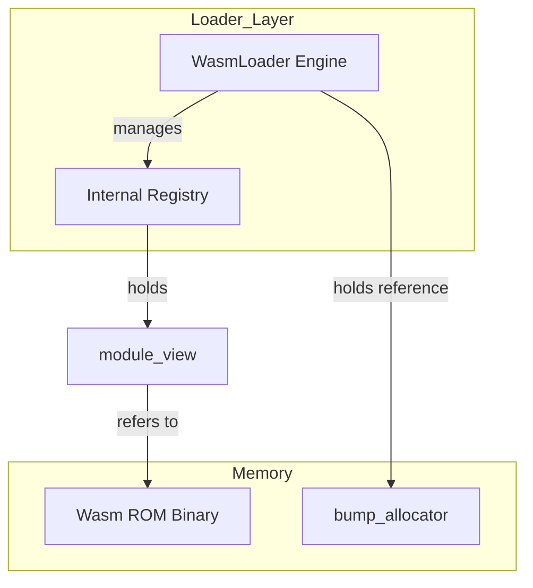
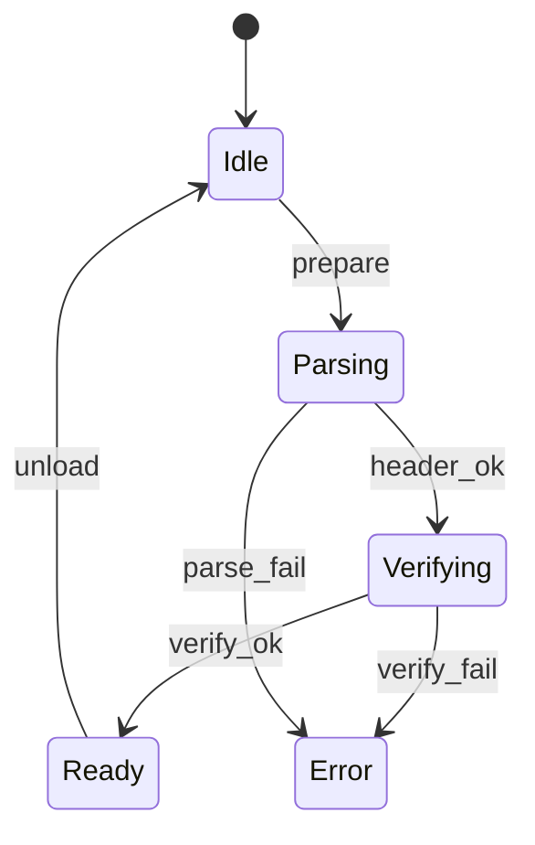
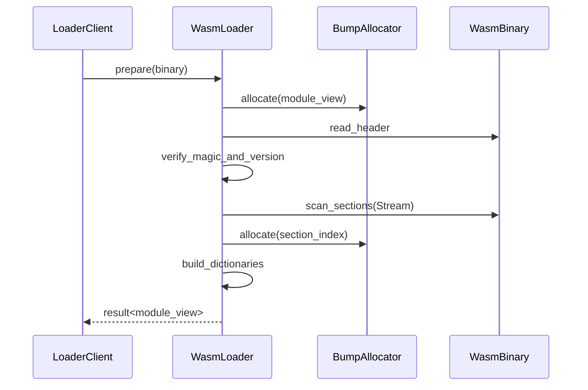

# WASMローダ コンポーネント設計書

## 1. コンセプト
WASMローダは、ROM上のWASM32バイナリをパースし、実行環境が参照しやすい索引構造（ModuleView）を生成する。RAMへの全展開を避け、ROM上のデータを直接参照することでメモリ消費を極小化する。 `{ROMParsing}` `{AccessDictionary}` `{BumpAllocator}`

## 2. アーキテクチャ分類
本コンポーネントは **Tier 3 (実装ドメイン)** に属する。WASMバイナリの解析と索引構築に特化した単一責務のモジュールとして設計する。 `{3TierSeparation}`

## 3. 静的モデル

### 3.1 データ構造
- **`WasmLoader`**: WASMバイナリのパース、検証、およびロード済みモジュールの管理を一括して行う主要クラス。
- **`module_view`**: ROM上のバイナリデータへの参照と、構築された索引群を保持する読み取り専用の構造体。
- **`module_registry`**: ロード済みの `module_view` を名前で管理するための内部リスト。 `{MultiModule_Support}`

### 3.2 内部ブロック図

### 3.3 主要なクラス・構造体・配列・定数

#### `WasmLoader` クラス
依存関係（アロケータ等）と内部レジストリをカプセル化する。

| 項目名 | 機能と役割 | 型分類 | サイズ・制約 |
| :--- | :--- | :--- | :--- |
| 作業用アロケータ | 索引構築時のメモリ割り当てに使用する（プライベートメンバ） | 構造体への参照 | [`bump_allocator`](runtime_stdlib.md) (非所有) |
| モジュール索引 | ロード済みモジュールを名前で引くための内部管理リスト | アクセス辞書 | `module_registry` |

#### `module_view` (モジュールビュー)
ROM上のバイナリデータに対する「窓」として機能し、WIT上では `wasm-module-view` リソースとして定義される。
データをRAM上に展開するのではなく、必要な時に必要な情報（セクション、関数ボディ、グローバル）へアクセスするためのアクセサを提供する。
これにより、RAM消費を最小限に抑えつつ、クライアントに対しては型安全なインターフェイスを提供する。 `{ROMParsing}`

- **セクション索引**: WASM標準セクション（Type, Import, Code等）のオフセットとサイズをキャッシュする。
- **シンボル検索**: エクスポート名からインデックスへの高速な引き当てを提供する。

#### `BinaryStream`
ROM上のデータストリームを管理し、LEB128可変長整数やプリミティブ型の読み出しを提供するユーティリティクラス。
`std::span` をラップし、カレントポインタ（カーソル）管理と境界チェックを行う。

| 機能 | 説明 |
| :--- | :--- |
| `read_u8/u16/u32/u64` | 固定長符号なし整数の読み出し（カーソルが進む） |
| `read_s8/s16/s32/s64` | 固定長符号あり整数の読み出し |
| `read_leb128_u32/s32/u64/s64` | 可変長整数 (LEB128) のデコード |
| `read_bytes` | 指定バイト数の参照（`std::span`）を返す |
| `remaining` | ストリームの残量チェック |

#### `function_accessor` (関数アクセサ)
関数の詳細情報へアクセスするための一時的なプロキシオブジェクト。WIT上では `wasm-function-accessor` リソースとして定義される。
メソッド呼び出し時にROM上のデータをデコードして値を返す。

| 項目名（プロパティ） | 機能と役割 | 型分類 |
| :--- | :--- | :--- |
| `get_type_index` | 関数の型定義へのインデックス | デコードメソッド |
| `get_locals_stream` | 関数のローカル変数定義のイテレータ（ストリーム） | デコードメソッド |
| `get_code_stream` | 関数の実行本体（バイトコード）のストリーム | デコードメソッド |

#### `global_accessor` (グローバルアクセサ)
グローバル変数の定義情報へアクセスするための一時的なプロキシオブジェクト。WIT上では `wasm-global-accessor` リソースとして定義される。

| 項目名（プロパティ） | 機能と役割 | 型分類 |
| :--- | :--- | :--- |
| `get_metadata` | グローバル変数の値の種類（i32/i64等）と書き込み可否 | デコードメソッド |
| `get_init_expr_stream` | 初期化定数式のバイトコードストリーム | デコードメソッド |

#### `verification_result`
バイナリ検証の結果と、不備があった場合の情報を保持する。 `{LightweightVerifier}`

| 項目名 | 機能と役割 | 型分類 | サイズ・制約 |
| :--- | :--- | :--- | :--- |
| 検証成功フラグ | すべての形式・意味検証をパスしたか | ブール値 | - |
| 異常箇所特定 | 検証失敗時のバイナリ内オフセットと範囲 | データ範囲 | `BinaryStream` |

## 4. 動的モデル

### 4.1 アルゴリズム
- **バイナリパース**: ROM上のデータを `BinaryStream` でラップし、`read_leb128` 等を用いて境界チェックを行いながら順次読み取る。
- **module_view 構築**: 関数ボディやエクスポート名を抽出し、ソート済みインデックス付き配列として構築する。検索には二分探索を用いる。 `{AccessDictionary}`
- **依存関係解決**: インポートセクションをスキャンし、必要なモジュール名とエクスポート名（関数ID/グローバルID等）を抽出し、`module_registry` を介して他モジュールの `lookup_export` とリンクする。未解決のインポートがある場合、モジュールはロード済みだが実行不可状態となる。
- **アンロード**: `unload` はmodule_registryからモジュールを削除する。bump_allocatorのLIFO制約により、メモリの完全な回収はロード逆順のアンロード時のみ。

### 4.2 メモリ制約
`module_view` と関連構造の最大サイズ。すべてコンパイル時固定。 `{ConfigurableSystem}`

| 項目 | 定数名 | 既定値 | 根拠 |
| :--- | :--- | :--- | :--- |
| 最大モジュール数 | `FB_CONF_MAX_MODULES` | 4 | 単一アプリ + 3ライブラリ |
| 最大関数数/モジュール | `FB_CONF_MAX_FUNCTIONS` | 256 | 典型的な組み込みWASMアプリ |
| 最大エクスポート数/モジュール | `FB_CONF_MAX_EXPORTS` | 64 | エクスポート名ソート済み配列 |
| 最大グローバル数/モジュール | `FB_CONF_MAX_GLOBALS` | 32 | グローバルアクセサ配列 |
| 最大インポート数/モジュール | `FB_CONF_MAX_IMPORTS` | 32 | インポート解決テーブル |

### 4.3 軽量検証スコープ `{LightweightVerifier}`
以下の項目をロード時に検証する。これ以上の検証（型システムの完全検証、命令の妥当性検証等）はPhase1+で検討。

| # | 検証項目 | 判定基準 | 失敗時 |
| :--- | :--- | :--- | :--- |
| V1 | マジックナンバー | `\0asm` (4bytes) | reject |
| V2 | バージョン | `1` (u32, WASM 1.0) | reject |
| V3 | セクション境界 | 各セクションのsizeがバイナリ末尾を超えない | reject |
| V4 | セクション順 | Customセクション以外はID昇順 | reject |
| V5 | インポート/エクスポート型整合 | 型インデックスがTypeセクション範囲内 | reject |

### 4.4 状態遷移図

### 4.5 内部シーケンス
#### モジュールロードシーケンス

## 5. インターフェイス定義

### 5.1 公開API
外部から利用可能なオブジェクト指向APIを定義する。

TODO(Phase 1): ATC抽出 - BumpAllocator使用時のメモリ解放や順序依存性、異常バイナリ時のロールバック処理に関する事前/事後/不変条件を明確化すること。

#### `prepare`

| 項目 | 内容 |
| :--- | :--- |
| 機能概要 | ROM上のWASMバイナリをパースし、内部レジストリに登録してビューを取得する。 |
| シグネチャ | `prepare(wasm: binary-view) -> result<wasm-module-view, sys-recovery-strategy>` |
| 引数 | `wasm`: WASMバイナリデータ (ROM直接参照) |
| 戻り値 | 成功時は `wasm-module-view` リソース、失敗時はリカバリ戦略 |
| 事前条件 | システムが初期化済みであること。 |
| 事後条件 | 成功時、内部レジストリにモジュールが登録される。 |

#### `load`

| 項目 | 内容 |
| :--- | :--- |
| 機能概要 | モジュールの線形メモリをゲストRAMに展開し、初期化する。 |
| シグネチャ | `load(module: wasm-module-view) -> operation-result` |
| 引数 | `module`: 展開対象のモジュールビュー |
| 事前条件 | モジュールが `prepare` によりハースネスに登録済みであること。 |
| 事後条件 | モジュールのリニアメモリおよびテーブル領域がゲストRAMに確保・初期化される。 |

#### `resolve-imports`

| 項目 | 内容 |
| :--- | :--- |
| 機能概要 | モジュールのインポートセクションをスキャンし、レジストリ内の他モジュールとリンクする。 |
| シグネチャ | `resolve-imports(module: wasm-module-view) -> operation-result` |
| 事前条件 | 依存するすべてのモジュールが既にロード（リポジトリに登録）されていること。 |
| 事後条件 | 成功時、モジュールが実行可能状態になる。 |

#### `unload`

| 項目 | 内容 |
| :--- | :--- |
| 機能概要 | モジュールをレジストリから削除し、関連リソースを解放する。 |
| シグネチャ | `unload(module: wasm-module-view) -> operation-result` |
| 事前条件 | 対象モジュールがロード済みであること。 |
| 事後条件 | モジュールに関連するすべての管理リソースが解放される。 |
| 補足 | バンプアロケータを使用しているため、完全なメモリ回収はロードの逆順で行う必要がある。 |

#### `lookup`

| 項目 | 内容 |
| :--- | :--- |
| 機能概要 | 登録済みのモジュールを名前で検索し、そのビューを取得する。 |
| シグネチャ | `lookup(name: 文字列ビュー) -> オプショナル値` |
| 引数 | `name`: 検索するモジュール名 |
| 戻り値 | オプショナル値 (成功時は `module_view` への参照、失敗時は空) |

#### `get-section`

| 項目 | 内容 |
| :--- | :--- |
| 機能概要 | 指定されたモジュール内の特定のWASMセクションのオフセットとサイズ（`wasm-section-view`）を取得する。 |
| シグネチャ | `get-section(stype: section-category) -> result<wasm-section-view, bool>` |
| 引数 | `stype`: 取得対象のセクション定数 |
| 戻り値 | `wasm-section-view` (オフセットとサイズ) |
| 事前条件 | モジュールが `prepare` 済みであること。 |

#### `lookup-export-func`

| 項目 | 内容 |
| :--- | :--- |
| 機能概要 | モジュールが公開している関数を名前で検索し、そのインデックスを取得する。 |
| シグネチャ | `lookup-export-func(name: string) -> result<u32, bool>` |
| 戻り値 | 成功時はWASM関数インデックス、失敗時は `false` |
| 不変条件 | 検索は二分探索により O(log N) で行われること。 |

#### `get-function`

| 項目 | 内容 |
| :--- | :--- |
| 機能概要 | 指定されたインデックスの関数アクセサ（`wasm-function-accessor`）を生成する。 |
| シグネチャ | `get-function(func-idx: u32) -> result<function-accessor, bool>` |
| 事前条件 | `func-idx` がモジュールの定義範囲内であること。 |
| 事後条件 | 有効なアクセサ、または範囲外エラーを返す。 |

#### `get-global`

| 項目 | 内容 |
| :--- | :--- |
| 機能概要 | 指定されたインデックスのグローバルアクセサ（`wasm-global-accessor`）を生成する。 |
| シグネチャ | `get-global(global-idx: u32) -> result<global-accessor, bool>` |
| 事前条件 | `global-idx` がモジュールの定義範囲内であること。 |
| 事後条件 | 有効なアクセサ、または範囲外エラーを返す。 |

### 5.2 URI/IPCインターフェイス
本コンポーネントは vSoC 内部で使用されるライブラリであり、直接のIPCインターフェイスは持たない。

## 6. 制約達成の方策

### 6.1 性能制約と方策
- **目標**: モジュールロード時間を最小化する。
- **方策**: `{ROMParsing}` `{AccessDictionary}` RAMへのコピーを排除し、主要な要素を索引化することで、実行時の探索コストを抑える。

### 6.2 メモリ制約と方策
- **目標**: ロード時のRAM消費を極小化する。
- **方策**: `{BumpAllocator}` `{NoStdVector}` バンプアロケータを使用し、断片化を防止しつつ、固定長配列による索引管理を行う。

### 6.3 安全性制約と方策
- **目標**: 不正なWASMバイナリによるクラッシュを防止する。
- **方策**: `{LightweightVerifier}` `{Wasm32Only}` ロード時にマジック値、バージョン、セクション境界の整合性を検証し、不正なバイナリを拒否する。

## 7. 設計完了チェックリスト
- [x] Tier 3 (Implementation Domain) に基づき設計となっているか
- [x] ローダの責務が明確に定義されているか
- [x] コンポーネントの責務が明確に定義されているか
- [x] 内部設計（データ構造、ブロック図、クラス、アルゴリズム）が適切に定義されているか
- [x] 内部ブロック図（静的）とシーケンス/状態遷移図（動的）がセットで定義されているか
- [x] 公開APIのメソッド名が英語で記述され、事前/事後条件が明確か
- [x] 非機能制約（性能、メモリ、安全性）に対する具体的な方策が明示されているか
- [x] 設計の交差点（トレードオフ）が解消されているか
- [x] 上位の要求 `{Keyword}` とのトレーサビリティが確保されているか
