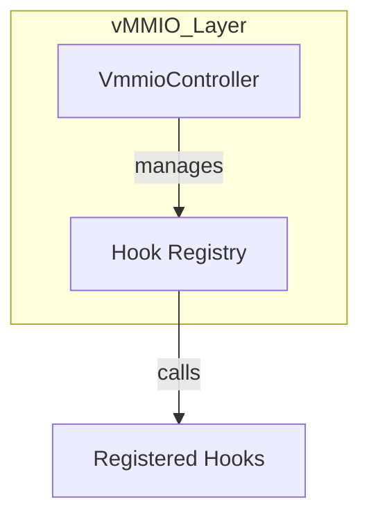
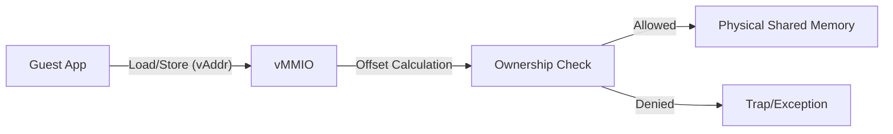

# vMMIO コンポーネント設計書

## 1. コンセプト
vMMIO (Virtual Memory-Mapped I/O) は、WASMゲストとホスト間の**すべてのデータ交換**を仲介する統一的なアクセス層である。物理レジスタ（GPIO等）、共有メモリ、システムコール用バッファなど、ホスト-ゲスト間境界を横切るアクセスはすべてvMMIO空間を経由する。WASMの仕様に基づき、**割り当て単位は1ページ（64KB）**とし、各デバイス領域は64KB境界に配置される。 `{RestrictedPhysicalAccess}` `{vMMIO_TrapAndEmulate}` `{PhysicalPassthrough}` `{WasmPageAlignment}` `{DynamicMmap}` `{UnifiedAccessModel}`

セキュリティモデルは**許可テーブル（permission table）が唯一のゲート**である。動的な性能向上のため、セキュリティゲートを以下の3層に階層化する。 `{RoleBasedAccessControl}`

1. **Tier 1 (ゲストRAM)**: ゲスト専用RAM領域。コンパイル時または実行時の単純な境界チェック（加算/比較）のみで処理。
2. **Tier 2 (静的vMMIO)**: コンパイル時にアドレスが確定する定数I/O（GPIO, UART等）。JIT生成時に許可チェックを行い、許可済みならネイティブコードに直接物理アドレスを埋め込む。
3. **Tier 3 (動的vMMIO/Syscall)**: 実行時に解決される動的マッピングや、`fireball_call` 経由のアクセス。

ゲストのアクセスは許可テーブルで検証され、許可されたアドレスへは直接物理アクセスが行われる。許可されていないアドレスへのアクセスは拒否（トラップ）される。IPC経由のデータ交換は行わない — GPIOのようなsub-µs応答が必要な周辺機器はIPCレイテンシに耐えられないため、このダイレクトアクセスモデルが採用されている。 `{Fast_Path_GPIO}`

## 2. アーキテクチャ分類
本コンポーネントは **Tier 3 (実装ドメイン)** に属する。仮想的なレジスタアクセスとDMA転送に特化した単一責務のモジュールとして設計する。 `{3TierSeparation}`

## 3. 静的モデル

### 3.1 データ構造
- **`VmmioController`**: 仮想アドレスのデコード、ハンドラへのディスパッチ、および動的マッピングを管理する主要クラス。
- **`vmmio_config`**: 静的な領域定義 (`vmmio_static_region`) の不変なテーブル。 `{Static_Resolution}`
- **`vmmio_dynamic_region`**: 実行時に追加された動的マッピング情報のリスト（プライベートメンバ）。初期化時に予約された静的領域もここで管理される。

### 3.2 内部ブロック図

#### `VmmioController` クラス
アドレス空間定義（静的）とフック管理（動的）をカプセル化する。

| 項目名 | 機能と役割 | 型分類 | サイズ・制約 |
| :--- | :--- | :--- | :--- |
| 静的マップ参照 | ROM上のデバイスマップ定義への参照 | 構造体への参照 | `const vmmio_static_region` |
| フックレジストリ | 実行時に登録されたハンドラ群の保持 | アクセス辞書 | `vmmio_hook_registry` |
| 動的領域数 | 現在使用中の DYNAMIC 領域のスロット数 | エントリ数 | - |

#### `vmmio_handler` (ハンドラ定義)
読み書きアクセス発生時に呼び出される関数の共通インターフェイス。

| 項目名 | 機能と役割 | 型分類 | サイズ・制約 |
| :--- | :--- | :--- | :--- |
| アクセス形式定義 | 相対オフセットとデータ列（可変バイナリビュー）を引数に取る関数の形式 | 関数ポインタ | `status(offset, span, is_write)` |

## 4. 動的モデル

- **ディスパッチ**:
    1. ゲストのアドレスが `vmmio_base` 以降である場合、**許可テーブル**でアクセス許可を検証する。
    2. 許可されたアドレスの場合、ROM上の `VMMIO_STATIC_MAP` を二分探索し、該当エントリの `hook_id` を用いて `vmmio_handler` を取得する。 `{SortedIndexedArray}`
    3. ハンドラが登録されていれば、指定された `std::span` （バイト/ハーフワード/ワード/連番アクセスを包含）を渡して呼び出す。
    4. 許可されたアドレスが物理レジスタ/共有メモリ領域に該当する場合、ハンドラ内で直接物理アクセスが行われる（追加の境界チェックは行わない）。
- **拒否**: 許可テーブルに含まれないアドレスへのアクセスは、メモリアクセス違反としてトラップを発生させる。
- **統一アクセスモデル**: GPIO・共有メモリバッファ・システムコール引数のすべてが同一のディスパッチパスを通る。セキュリティゲートは許可テーブルの1箇所のみ。
- **ソフトウェアTLB (Software TLB)**: `{vMMIO_TLB}`
    - Tier 3 アクセスにおいて、毎回巨大な許可テーブルを走査するのは低速であるため、最近許可されたページ/領域をキャッシュする数エントリのテーブル（TLB）を導入する。
    - JIT/インタプリタ実行前にTLBヒット判定を行い、ミス時のみ許可テーブルのフルスキャン（ページウォーク相当）を行う。

TODO(Phase 0.8): vMMIO TLA+ Verification - ソフトウェアTLBのキャッシュ整合性と、階層化された境界チェックの正当性を検証する。

### 4.1 アルゴリズム: 仮想DMA (VDMA)
ゲストリニアメモリと vMMIO 空間（または他のメモリ領域）間の高速転送を実現する。 `{VDMA}`

**アクセス方式**: 純粋MMIOトラップ。直接vMMIOアドレスにアクセス可能なゲストはVDMAレジスタへ直接書き込み、アクセス不可なゲスト言語は `fireball_call(VDMA_START)` 経由でホストが代理実行。

1. **転送設定**: ゲストが `REG_VDMA_SRC`, `REG_VDMA_DST`, `REG_VDMA_COUNT` にパラメータを書き込む。
2. **トリガー**: `REG_VDMA_CTRL` の `START` ビットを `1` に書き込む。
3. **実行**: 
   - vMMIO ハンドラが物理アドレスを解決（境界チェック含む）。
   - `std::memcpy` または HAL経由のDMAを用いて一括転送を実行。
4. **完了**: 転送完了後、必要に応じてゲストに仮想割り込み（`IRQ_VDMA_DONE`）を通知する。

### 4.2 仮想デバイスマップ (Default Map)
各領域は 64KB (WASM 1 page) 単位で割り当てられる。 `vMMIO_BASE = 0x4000_0000` とする。

| ページ番号 | ページ数 | デバイス名 | 説明 |
| :--- | :--- | :--- | :--- |
| `0` | `1` | **SYSCTL** | システム制御（Yield, Halt, etc.） |
| `1` | `1` | **IPCR** | IPCルータ連携レジスタ |
| `2` | `1` | `{VDMA}` | 仮想DMA（バルク転送） |
| `4096` | `4096` | **DYNAMIC** | 動的マッピング領域 |
| `8192` | `4096` | **SHM** | 共有メモリ領域 |
| `12288` | `4096` | **PASSTHROUGH** | 物理アドレス領域（`passthrough_base` + オフセット） |

PASSTHROUGH領域のアドレス変換: `物理アドレス = passthrough_base + (guest_addr - passthrough_region_start)`。`passthrough_base` は `vsoc_config` で設定される（ARM Cortex-Mの場合、通常 `0x4000_0000`）。

### 4.3 SYSCTL レジスタ詳細
| オフセット | レジスタ名 | R/W | 説明 |
| :--- | :--- | :--- | :--- |
| `0x00` | `REG_SYS_CONTROL` | W | `1`: Reset, `2`: Yield, `3`: Halt, `4`: Syscall |
| `0x04` | `REG_SYS_STATUS` | R | システム状態フラグ |
| `0x08` | `REG_IRQ_FLAGS` | R/W | 仮想割り込みフラグ |
| `0x10` | `REG_SYSCALL_ID` | R/W | サービスID |
| `0x14` | `REG_SYSCALL_CMD` | R/W | コマンドID |
| `0x18` | `REG_SYSCALL_ARG0` | R/W | 第1引数 / 戻り値 |
| `0x1C` | `REG_SYSCALL_ARG1` | R/W | 第2引数 |
| `0x20` | `REG_SYSCALL_ARG2` | R/W | 第3引数 |
| `0x24` | `REG_SYSCALL_ARG3` | R/W | 第4引数 |
| `0x28` | `REG_SYSCALL_ARG4` | R/W | 第5引数 |
| `0x2C` | `REG_SYSCALL_ARG5` | R/W | 第6引数 |

### 4.4 VDMA レジスタ詳細
| オフセット | レジスタ名 | R/W | 説明 |
| :--- | :--- | :--- | :--- |
| `0x00` | `REG_VDMA_SRC` | R/W | 転送元アドレス |
| `0x04` | `REG_VDMA_DST` | R/W | 転送先アドレス |
| `0x08` | `REG_VDMA_COUNT` | R/W | 転送バイト数 |
| `0x0C` | `REG_VDMA_CTRL` | W | 制御（Bit0: START） |

### 4.5 静的共有メモリマッピング
ゲストとホスト（または他のノード）間のデータ共有は、vMMIO空間に固定的にマッピングされた共有メモリ領域を通じて行われる。 `{Static_Resolution}`

- **構成**: `vsoc_config` の `shm_base` および `shm_size` によって定義される。
- **アクセス**: ゲストは `shm_base + shm_handle` (ハンドルはオフセットとして機能) のアドレスに対してロード/ストアを行う。
- **保護**: 領域へのアクセスは、COOSのメモリ保護機能（所有権チェック）によって検証される。不正なアクセス（所有していないハンドルへのアクセス等）はトラップされる。

#### ライフサイクル
1. **Config**: システム初期化時に共有メモリ領域全域が vMMIO 空間にマッピングされる。
2. **Transfer**: HAL等のインターフェイスを通じて `shm-handle` (オフセット) がゲストに渡される。
3. **Access**: ゲストはハンドルをオフセットとして加算し、該当データを直接操作する。
4. **Release**: 使用完了後、ハンドルを破棄（または返却）する。明示的なアンマップ操作は不要。

### 4.6 仮想割り込みマッピング
物理割り込みから仮想割り込みIDへのマッピングは**静的1:1**とし、別コンフィグ（`irq_mapping_config`）で定義される。 `{ConfigurableSystem}`

- **マッピング方式**: 物理IRQ 1: 仮想IRQ 1。集約しない。
- **ゲスト側確認方式**: ポーリング。ゲストがstep再開時に `REG_IRQ_FLAGS` をチェック。
- **コールバック登録**: Phase1+で検討。
- **設定ファイル**: `vsoc_config` とは分離。`irq_mapping_config` として独立管理。

@see `system_syscall.md` §8.1

### 4.7 静的予約
`DYNAMIC` 領域の一部を、システムの初期化時に特定のデバイス用として永続的に予約する。これにより、実行時の動的確保のオーバーヘッドを排除する。 `{Static_Resolution}`
予約された領域は、ゲストからは通常の `DYNAMIC` 領域の一部として見えるが、vSoC内部では固定されたマッピングとして扱われる。

## 5. インターフェイス定義

### 5.1 公開API
外部から利用可能なオブジェクト指向APIを定義する。

TODO(Phase 1): ATCの抽出 - フック登録や静的予約が可能なライフサイクルの制約（初期化フェーズ中のみ等）を事前・不変条件として定義すること。

#### フック登録 (`register-hook`)

| 項目 | 内容 |
| :--- | :--- |
| 機能概要 | 既に定義（ROM）されている領域に対して、ホスト側のハンドラの実装アドレスを紐づける。 |
| シグネチャ | `register-hook(hook-id: hook-category, handler-addr: mem-address) -> operation-result` |
| 引数 | `hook-id`: 対象の領域カテゴリ `handler-addr`: ハンドラ関数の物理アドレス |
| 事前条件 | `hook-id` が `vsoc.wit` で定義された有効なIDであること。未登録であること。 |
| 事後条件 | フックレジストリにエントリが追加される。 |
| 戻り値 | 操作結果 |
| 期待する結果 | 正常：フックが登録され、以降のアクセスで呼び出される。 |

#### 静的領域の予約 (`reserve-static-regions`)

| 項目 | 内容 |
| :--- | :--- |
| 機能概要 | `DYNAMIC` 領域の先頭から指定されたページ数を静的に予約する。システム初期化時に一度だけ呼び出されることを想定する。 |
| シグネチャ | `reserve-static-regions(pages-count: u32) -> void` |
| 引数 | `pages-count`: 予約する総ページ数 |
| 事前条件 | システム初期化フェーズであること。動的領域に十分な空きがあること。 |
| 事後条件 | `DYNAMIC` 領域の管理情報が更新され、領域が確保される。 |
| 戻り値 | なし (失敗時はアボート) |
| 期待する結果 | 正常：`DYNAMIC` 領域の管理情報が更新され、予約済み領域としてマークされる。 |

#### アクセスディスパッチ (`dispatch-access`)

| 項目 | 内容 |
| :--- | :--- |
| 機能概要 | vSoC 実行エンジンからトラップされたメモリアクセスを**許可テーブルで検証**し、適切なハンドラへ振り分ける。 |
| シグネチャ | `dispatch-access(addr: mem-address, buffer: list<u8>, is-write: bool) -> operation-result` |
| 引数 | `addr`: アクセス先アドレス `buffer`: データバッファ (read時out, write時in) `is-write`: 書き込みフラグ |
| 戻り値 | 操作結果 |
| 事前条件 | `addr >= vmmio_base && addr < vmmio_base + vmmio_size` |
| 事後条件 | 許可アドレス：ハンドラ実行完了。非許可アドレス：アクセス違反トラップ。 |
| 期待する結果 | 正常：許可テーブルを通過し、登録されたハンドラが実行され、レジスタ操作の結果がゲストに反映される。 |

## 6. 制約達成の方策

### 6.1 性能制約と方策
- **目標**: MMIOアクセスのオーバーヘッドを最小化する。
- **方策**: `{ConfigurableSystem}` 頻繁にアクセスされるデバイス（SYSCTL等）をマップの先頭に配置し、探索コストを削減する。

### 6.2 メモリ制約と方策
- **目標**: マップ管理用のメモリを最小化する。
- **方策**: `{ConfigurableSystem}` 最大登録数をコンパイル時に固定し、静的配列として確保する。

## 7. 設計完了チェックリスト
- [x] Tier 3 (Implementation Domain) に基づき設計となっているか
- [x] vMMIOの責務が明確に定義されているか
- [x] コンポーネントの責務が明確に定義されているか
- [x] 内部設計（データ構造、ブロック図、クラス、アルゴリズム）が適切に定義されているか
- [x] 仮想デバイスマップが具体的に定義されているか
- [x] 公開APIのメソッド名が英語で記述され、事前/事後条件が明確か
- [x] 非機能制約（性能、メモリ）に対する具体的な方策が明示されているか
- [x] 設計の交差点（トレードオフ）が解消されているか
- [x] 上位の要求 `{Keyword}` とのトレーサビリティが確保されているか
