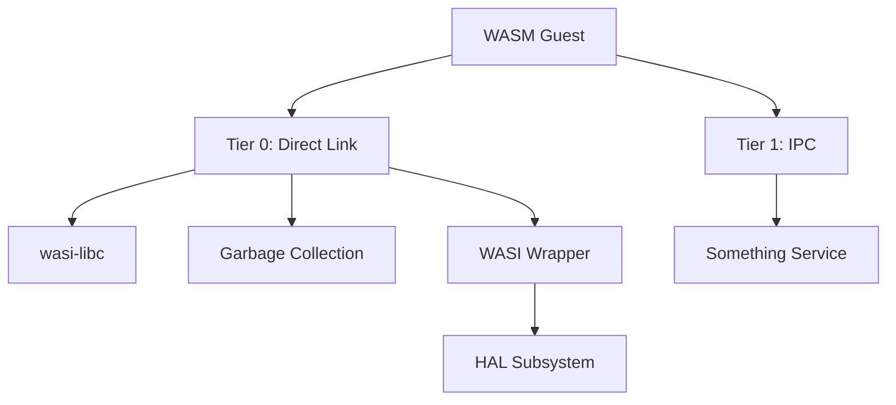
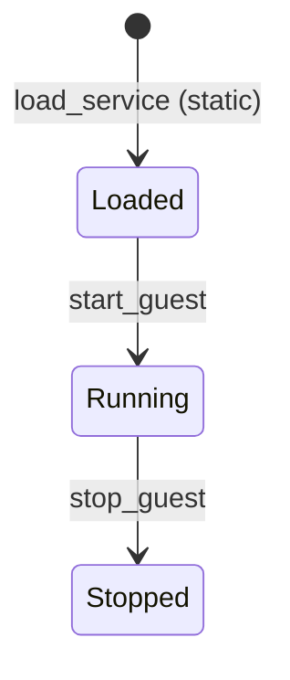
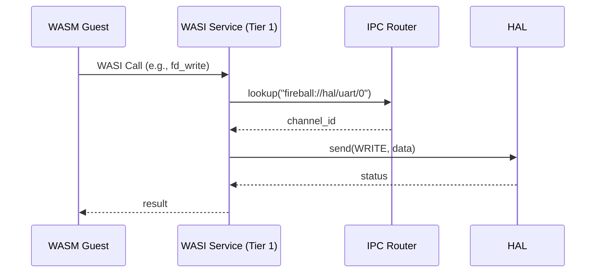

# サービス コンポーネント設計書

## 1. コンセプト
サービスは、WASMゲストに対して共有ライブラリ機能（WASI, libc, GC等）を提供するコンポーネントである。信頼度と通信方式に応じてTierで分離し、障害隔離とメモリ安全性を確保する。 `{FaultIsolation}` `{MemoryIsolation}` `{IPCRouter}`

## 2. アーキテクチャ分類 (Tier 1: Architecture Domain)
本コンポーネントは **Tier 1 (アーキテクチャドメイン)** に属する。ゲストWASMに対する抽象化されたサービスレイヤを提供し、IoC (Inversion of Control) と URIベースのDIを用いて、機能拡張性と隔離性を担保する。 `{3TierSeparation}` `{IPCRouter}` `{URIAbstraction}`

## 3. 静的モデル

### 3.1 データ構造
- **service_registry**: ロードされているサービスの情報（URI、Tier、エントリポイント）を管理する。

### 3.2 内部ブロック図

### 3.3 主要なクラス・構造体・配列・定数

#### `service` (サービス定義)
システムが管理する個別のサービスの属性。

| 項目名 | 機能と役割 | 型分類 | サイズ・制約 |
| :--- | :--- | :--- | :--- |
| サービス名称 | サービスを識別するための共通のシステム名 | 文字列ビュー | - |
| 隔離階層 | サービスが実行されるドメイン（0: ゲスト内、1: 独立プロセス） | uint8_t | Tier |
| 識別URI | ルータを介して公開される、サービスを指し示す唯一の正規名称 | 文字列ビュー | - |

#### `service_config` (サービス構成)
特定のゲストインスタンスに適用されるサービスのロード設定。 `{ConfigurableSystem}`

| 項目名 | 機能と役割 | 型分類 | サイズ・制約 |
| :--- | :--- | :--- | :--- |
| ゲスト識別子 | 構成設定が適用されるWASMゲストの管理ID | ID値 | 32bit |
| ロード対象リスト | ゲスト起動時に自動的に接続・初期化されるサービスのURI一覧 | 文字列ビュー | 文字列配列へのポインタ |

## 4. 動的モデル

### 4.1 アルゴリズム
- **サービス分離**: Tier 0 サービスはゲストのWASMモジュールとして直接リンクされ、Tier 1 サービスは独立したタスクとして動作し、IPCルータを介して通信する。 `{FaultIsolation}`
- **WASI呼び出し**: ゲストからのWASIシステムコールを、HALのIPCコマンドへ変換して転送する。 `{IPCRouter}`

### 4.2 状態遷移図

### 4.3 内部シーケンス
#### WASI呼び出しシーケンス

## 5. インターフェイス定義

### 5.1 エラーハンドリング戦略

本コンポーネントでは、エラーコードではなくリカバリー戦略を返すことで、呼び出し側が具体的なアクションを取れるようにする。 `{RecoveryStrategy}`

#### リカバリー戦略の種類
- **retryable**: 一時的な失敗。同じパラメータでリトライすることで成功する可能性がある（例: リソース一時的に使用不可、タイムアウト）
- **fatal**: 恒久的な失敗。現在のパラメータでは成功しない（例: 不正なURI、サービスが存在しない、既に登録済み）

#### 設計判断
失敗の詳細理由（hardware-error、timeout等）は実装詳細であり、クリーンアーキテクチャの内側が知るべきではない。デバッグ情報はログシステムで確認する。

### 5.2 公開API
外部から利用可能なオブジェクト指向APIを定義する。

#### `load_service`

| 項目 | 内容 |
| :--- | :--- |
| 機能概要 | 指定されたURIに対応するサービスを初期化し、システムから利用可能な状態にする。 |
| シグネチャ | `load_service(uri: 文字列ビュー) -> service_load_result` |
| 引数 | `uri`: サービスの識別子 |
| 戻り値 | service_load_result (`retryable`: メモリ不足等、`fatal`: サービス未発見、既にロード済み) |
| 期待する結果 | 正常：サービスが初期化（またはリンク）され、Ready状態になる。 |
| 補足 | サービスは静的にロードされ、システムライフタイム全体で維持される。Tier 1 の場合は、バックグラウンドタスクとして spawn される。 |

### 5.3 URI/IPCインターフェイス
- **URI**: `fireball://services/<service_name>/<instance_id>`
- **メッセージ形式**: サービス固有のKey-Valueプロトコル。詳細なDTO定義は各サービス仕様書に準ずる。

## 6. 制約達成の方策

### 6.1 性能制約と方策
- **目標**: システムコールのオーバーヘッドを最小化する。
- **方策**: `{IPCRouter}` 高頻度な呼び出し（libc等）は Tier 0 として直接リンクし、IPCオーバーヘッドを回避する。

### 6.2 メモリ制約と方策
- **目標**: サービスによるメモリ消費を隔離する。
- **方策**: `{IndependentHeap}` `{MemoryIsolation}` Tier 1 サービスに対して独立したヒープパーティションを割り当てる。

### 6.3 安全性制約と方策
- **目標**: サービスの障害が他へ波及するのを防止する。
- **方策**: `{FaultIsolation}` サービスを独立した実行コンテキスト（タスク）で実行し、不正アクセスやクラッシュを隔離する。

## 7. 設計完了チェックリスト（網羅性確認）
- [x] Tier 1 (Architecture Domain) に基づき設計となっているか
- [x] コンポーネントの責務が明確に定義されているか
- [x] 内部設計（データ構造、ブロック図、クラス、アルゴリズム）が適切に定義されているか
- [x] 内部ブロック図（静前）とシーケンス/状態遷移図（動的）がセットで定義されているか
- [x] 公開APIのメソッド名が英語で記述され、事前/事後条件が明確か
- [x] 非機能制約（性能、メモリ、安全性）に対する具体的な方策が明示されているか
- [x] 設計の交差点（トレードオフ）が解消されているか
- [x] 上位の要求 `{Keyword}` とのトレーサビリティが確保されているか
