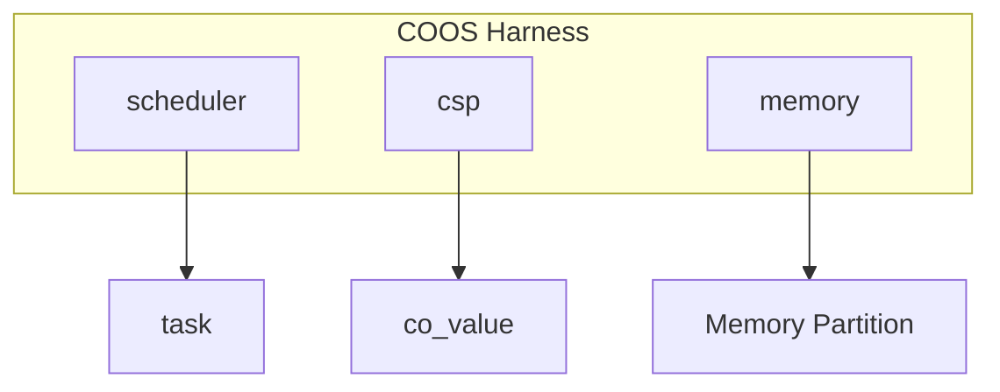
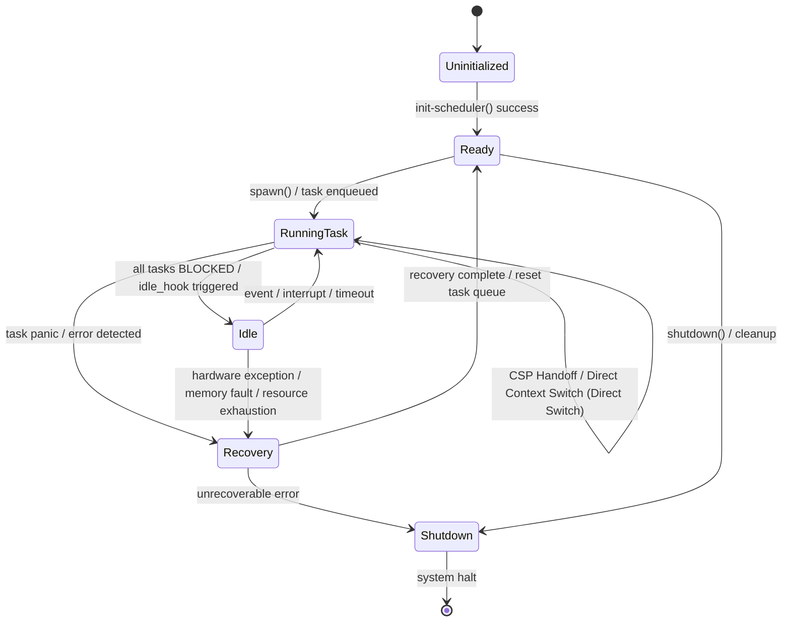
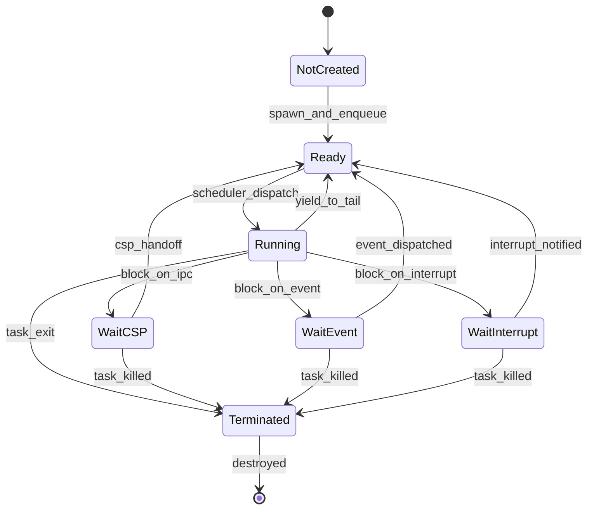

# 協調型OS COOS コンポーネント設計書 {VERIFY_FORMAL} {VERIFY_LLM} {VERIFY_BENCHMARK}
<!-- evidence:
     formal: formal/coos_channel_model.py
     benchmark: benchmarks/direct_context_switch_bench.py
     concept: concepts/coos_concept.py
-->

## 1. コンセプト
<!-- traceability: {CooperativeMultitasking} {GLOBAL_UseCpp23Library} {GLOBAL_UseCpp20Coroutine} {CSPCommunication} {EliminateDataRace} {GLOBAL_PeriodicTask} {GLOBAL_IdleDetection} {GLOBAL_InterruptWakeup} {NotRTOS} -->
COOSは、シングルスレッド環境向けのホーアCSPベースのグリーンスレッドOSである。C++23コルーチン（および静的配列と `fireball::flat_map_view` 等、静的確保に適合させたコンテナ語彙）を活用し、スタックレスで低オーバーヘッドなタスク切り替えを実現する。また、ホーアCSPに基づき、所有権移譲によるゼロコピーメッセージパッシングを行うことで、データ競合を原理的に排除する。 `{CooperativeMultitasking}` `{GLOBAL_UseCpp23Library}` `{GLOBAL_UseCpp20Coroutine}` `{CSPCommunication}` `{EliminateDataRace}` `{GLOBAL_PeriodicTask}` `{GLOBAL_IdleDetection}` `{GLOBAL_InterruptWakeup}` `{NotRTOS}`

## 2. アーキテクチャ分類
<!-- traceability: {META_3TierSeparation} {GLOBAL_ComponentHarness} -->
本コンポーネントは **Tier 1 (主要システムコンポーネント: Primary Component)** に属し、システム要求定義（`requires/`）を受けて協調型タスク実行基盤およびCSPチャネル通信を提供する。 `{META_3TierSeparation}` `{GLOBAL_ComponentHarness}`

### 2.1 構成要素
<!-- traceability: {META_3TierSeparation} {GLOBAL_ComponentHarness} -->
- **[`co_sched`](os_scheduler.md)**: スケジューラ。タスクのライフサイクル、READYキュー管理、実行順序制御（詳細は [`os_scheduler.md`](os_scheduler.md) を正本とする）。
- **`co_csp`**: 通信エンジン。チャネルベースの同期と所有権移譲（本設計書が正本）。
- **`co_mem`**: メモリマネージャ。タスク独立な静的メモリバッファプール（メモリパーティション）の管理。

ロギングは COOS の構成要素ではなく、独立した Tier 1 コンポーネント [`system_logging`](system_logging.md) が担う。COOS は `set_idle_hook` によりアイドル時のフラッシュ契機のみを提供する。 `{BufferedLogging}` `{GLOBAL_IdleDetection}`

## 3. 静的モデル

### 3.1 データ構造
<!-- traceability: {GLOBAL_Policy_Memory} {ADR_RendezvousChannel} -->
- **`channel`**: **バッファを持たない**純粋同期ランデブーオブジェクト。値はチャネルに滞留せず、送信側タスクから受信側タスクへランデブー成立の瞬間に直接移譲される。 `{ADR_RendezvousChannel}`
- **`co_value`**: 独自の所有権管理構造体。`{GLOBAL_Policy_Memory}` に基づき、コンパイル時に固定サイズで確保された静的メモリ領域またはスタック上のみで動作する。
- **`coos_context`**: スケジューラ、CSP状態、メモリ情報を集約したグローバルコンテキスト。

### 3.2 内部ブロック図
<!-- traceability: {GLOBAL_Policy_Memory} -->


各サブコンポーネントおよび通信バッファ（VAL）は、動的メモリ確保（`malloc`/`new`）を排除するため、静的アロケータによって領域制限されたメモリ領域（MPUパーティション）に完全に配置される。 `{GLOBAL_Policy_Memory}`

### 3.3 主要なデータ定義
<!-- traceability: {GLOBAL_Policy_Memory} -->

#### CSPチャネル（channel）
<!-- traceability: {CSPCommunication} {GLOBAL_Policy_Memory} {ADR_RendezvousChannel} -->
タスク間の同期と通信を仲介するデータ構造。ホーアCSPの定義どおり **チャネル自身は値を保持しない**（`{ADR_RendezvousChannel}`）。送信側は相手が現れるまで自身のフレーム上で `CoValue` を保持したまま待機し、ランデブー成立の瞬間に所有権が受信側へ移る。動的メモリ確保を排除した `{GLOBAL_Policy_Memory}` に従い、`CoValue` は静的プールから事前割り当てされた実体の参照またはインデックスの受け渡しのみで移譲される（ゼロコピー所有権移譲）。 `{CSPCommunication}` `{GLOBAL_Policy_Memory}` `{ADR_RendezvousChannel}`

| 項目名 | 機能と役割 | 型分類 | サイズ・制約 |
| :--- | :--- | :--- | :--- |
| 待機タスク参照 | このチャネルで待機している単一タスクへの参照。空・送信待機・受信待機の3状態を取る | タスク参照 | `task_id`（無効値で「待機なし」を表す） |
| 待機方向 | 待機タスクが送信側か受信側かの区別 | 列挙 | `NONE` / `SEND` / `RECV` |

**チャネルがバッファも待機列も持たない理由 (`{ADR_RendezvousChannel}`)**:
値を保持しないため、チャネル満杯（overflow）という状態が原理的に存在せず、送信失敗時のロールバック処理も、チャネルが所有権を握っている期間に発生する二重所有の検討も不要になる。待機タスクを単一参照に限定するのは、同一チャネルに複数タスクが群がる設計を `{URIAbstraction}` によるサービス単位のチャネル分割で回避しているためであり、固定長待機列分の RAM を全チャネルに払う必要をなくす。複数の待機者が必要な場合はチャネルを分割する。

##### チャネル送受信動作の挙動定義
チャネルを通じたCSPメッセージ通信の基本的な制御ロジックを以下に示す。 `{CSPCommunication}`
直接コンテキストスイッチ（CSP Handoff）は、呼び出しスタックの再帰的な蓄積を防ぐため、C++20 コルーチンの**対称遷移（Symmetric Transfer: `await_suspend` から `coroutine_handle` を返却）** を採用し、スタック深度を定数 $O(1)$ に保つ。

連続ハンドオフは `FB_CONF_MAX_CONSECUTIVE_HANDOFFS` で有界化する。この上限は §6.1「メインループ復帰保証」の形式証明が依拠する前提であり、実装は必ずこのカウンタを備えなければならない。

```python
# CSPチャネルの送受信処理 (概念コード: 純粋同期ランデブー + Symmetric Transfer 規約)
# チャネルは値を保持しない。待機者は最大1タスク（ADR_RendezvousChannel）。

def channel_send(channel: Channel, sender_task: Task, value: CoValue) -> CoroutineHandle:
    if channel.waiter_dir == RECV:
        # 受信側が待機中: 値を直接移譲してランデブー成立
        receiver = channel.take_waiter()
        receiver.value = value              # 所有権はここで sender -> receiver へ移る
        sender_task.state = READY
        receiver.state = READY
        return handoff_or_yield(receiver)   # CSP Handoff (スタックレス対称遷移)
    else:
        # 相手不在: 値は sender_task のフレーム上に留めたまま待機する。
        # チャネルはバッファを持たないため overflow もロールバックも存在しない。
        assert channel.waiter_dir != SEND, "1チャネル1待機者: 送信待機の重複はチャネル分割で回避する"
        channel.set_waiter(sender_task, SEND)
        sender_task.state = SUSPENDED_CSP
        return scheduler_handle

def channel_recv(channel: Channel, receiver_task: Task) -> CoroutineHandle:
    if channel.waiter_dir == SEND:
        # 送信側が待機中: 送信側フレームから値を引き取ってランデブー成立
        sender = channel.take_waiter()
        receiver_task.value = sender.value  # 所有権はここで sender -> receiver へ移る
        sender.value = None                 # 二重所有を作らない
        sender.state = READY
        receiver_task.state = READY
        return handoff_or_yield(sender)
    else:
        assert channel.waiter_dir != RECV, "1チャネル1待機者: 受信待機の重複はチャネル分割で回避する"
        channel.set_waiter(receiver_task, RECV)
        receiver_task.state = SUSPENDED_CSP
        return scheduler_handle

def handoff_or_yield(target: Task) -> CoroutineHandle:
    """連続ハンドオフを有界化し、必ずスケジューラへ復帰する経路を残す。
    この上限が §6.1 のメインループ復帰保証（AF(main_loop)）の根拠である。"""
    if sched.consecutive_handoffs < FB_CONF_MAX_CONSECUTIVE_HANDOFFS:
        sched.consecutive_handoffs += 1
        return target.coroutine_handle      # 直接対称遷移
    sched.consecutive_handoffs = 0
    sched.ready_queue.append(target)        # 上限到達: スケジューラへ返す
    return scheduler_handle
```

## 4. 動的モデル

### 4.1 アルゴリズム
<!-- traceability: {CSP_Handoff} {DirectContextSwitch} {GLOBAL_IdleDetection} {GLOBAL_StrictMemoryLimit} {GLOBAL_IndependentHeap} {GLOBAL_InterruptWakeup} -->
- **CSP Handoff (直接スイッチ)**: `send`/`recv` 時に相手タスクが既に待機状態であった場合、スケジューラを介さず即座に相手タスクへ実行権を移譲する。 `{CSP_Handoff}`
- **直接コンテキストスイッチ (Direct Context Switch)**: コルーチンの対称遷移（Symmetric Transfer）により、コールスタックを消費せずに相手タスクのコルーチンハンドルへ直接ジャンプする。OSスケジューラのキュー処理オーバーヘッドを完全にバイパスし、極小スタック（2KB）環境下でもスタックオーバーフローを起こさない決定論的 $O(1)$ スイッチを実現する。実測は [`benchmarks/direct_context_switch_bench.py`](benchmarks/direct_context_switch_bench.py) を参照。 `{DirectContextSwitch}`
- **割り込みウェイクアップ (Interrupt Wakeup)**: 外部割り込みが発生した際、割り込みサービスルーチン（ISR）から `notify_interrupt` が呼び出され、INT イベントを有界キューに投函する。スケジューラが yield 点でこれをドレインし、特定の割り込みベクトル（`irq_id`）に登録されて待機しているタスクを READY 状態に遷移させて実行可能キュー末尾に投入する。 `{GLOBAL_InterruptWakeup}`
- **Idle Detection**: 全ての実行中タスクがブロック状態にあり、かつイベントキューが空（割り込みや外部イベントによる起床待ちのみ）の場合にアイドル状態と判定する。この条件を `idle_hook` のトリガーとし、イベントキューが空かつ全タスクがブロック状態の時のみ、リングバッファ内の未出力ログが1件以上存在する、あるいはイベント待機開始から10ミリ秒以上経過した際に、バックグラウンド処理（リングバッファからロガーを介した物理ストレージや非揮発性メモリへのログ書き出し・フラッシュ処理）をREADYリング外の専用Idleタスクとして呼び出す。 `{GLOBAL_IdleDetection}`
- **Memory Management**: タスク生成時に独立したメモリパーティションを割り当てる。 `{GLOBAL_StrictMemoryLimit}` `{GLOBAL_IndependentHeap}`

#### COOS フルセット・コンセプトコード (`concepts/coos_concept.py`)
```python
class TaskState:
    READY = "READY"
    RUNNING = "RUNNING"
    BLOCKED = "BLOCKED"
    SUSPENDED_CSP = "SUSPENDED_CSP"
    TERMINATED = "TERMINATED"


class WaitDir:
    NONE = "NONE"
    SEND = "SEND"
    RECV = "RECV"


class Channel:
    """Bufferless synchronous CSP rendezvous channel (ADR_RendezvousChannel).

    The channel never holds a value: a sender that arrives first keeps it in its
    own frame, so overflow and rollback cannot occur and the value always has
    exactly one owner. At most one waiter per channel.
    """
    def __init__(self, channel_id: str):
        self.channel_id = channel_id
        self.waiter_task = None
        self.waiter_dir = WaitDir.NONE


class COOSKernel:
    def __init__(self, max_consecutive_handoffs: int = 4):
        self.tasks = {}
        self.ready_queue = []
        self.current_task = None
        self.channels = {}
        self.interrupt_event_queue = []
        self.irq_waiters = {}
        self.max_consecutive_handoffs = max_consecutive_handoffs
        self.consecutive_handoffs = 0
        self.idle_hook_called = False

    def channel_send(self, channel_id: str, data) -> tuple[str, str | None]:
        """Synchronous CSP send with direct symmetric context switch."""
        ch = self.channels[channel_id]
        sender = self.current_task
        assert sender is not None

        if ch.waiter_dir == WaitDir.RECV:
            # Rendezvous matched: ownership moves sender -> receiver right here
            receiver = ch.waiter_task
            ch.waiter_task, ch.waiter_dir = None, WaitDir.NONE

            self.tasks[receiver]["received_val"] = data
            self.tasks[receiver]["state"] = TaskState.READY
            self.tasks[sender]["state"] = TaskState.READY
            return self._handoff_or_yield(receiver)

        # No peer yet: the value stays in the sender's own frame. The channel holds
        # nothing, so there is no buffer to overflow and no send to roll back.
        assert ch.waiter_dir != WaitDir.SEND, \
            "one waiter per channel: concurrent senders must use separate channels"
        ch.waiter_task, ch.waiter_dir = sender, WaitDir.SEND
        self.tasks[sender]["pending_val"] = data
        self.tasks[sender]["state"] = TaskState.SUSPENDED_CSP
        return ("BLOCK", None)

    def channel_recv(self, channel_id: str) -> tuple[str, str | None]:
        """Synchronous CSP recv with direct symmetric context switch."""
        ch = self.channels[channel_id]
        receiver = self.current_task
        assert receiver is not None

        if ch.waiter_dir == WaitDir.SEND:
            # Take the value out of the sender's frame: never two owners at once
            sender = ch.waiter_task
            ch.waiter_task, ch.waiter_dir = None, WaitDir.NONE
            data = self.tasks[sender].pop("pending_val")

            self.tasks[receiver]["received_val"] = data
            self.tasks[sender]["state"] = TaskState.READY
            self.tasks[receiver]["state"] = TaskState.READY
            return self._handoff_or_yield(sender)

        assert ch.waiter_dir != WaitDir.RECV, \
            "one waiter per channel: concurrent receivers must use separate channels"
        ch.waiter_task, ch.waiter_dir = receiver, WaitDir.RECV
        self.tasks[receiver]["state"] = TaskState.SUSPENDED_CSP
        return ("BLOCK", None)

    def _handoff_or_yield(self, target: str) -> tuple[str, str | None]:
        """Bounds the handoff chain so the scheduler main loop stays reachable.
        This bound is what 6.1 'main loop return guarantee' formally proves."""
        if self.consecutive_handoffs < self.max_consecutive_handoffs:
            self.consecutive_handoffs += 1
            return ("DIRECT_SWITCH", target)
        self.consecutive_handoffs = 0
        self.ready_queue.append(target)
        return ("YIELD", None)

    def notify_interrupt(self, irq_id: int):
        """Non-blocking ISR notification into bounded event queue."""
        self.interrupt_event_queue.append(irq_id)

    def drain_interrupts(self):
        """Wake tasks waiting on received IRQs."""
        while self.interrupt_event_queue:
            irq_id = self.interrupt_event_queue.pop(0)
            waiters = self.irq_waiters.pop(irq_id, [])
            for t_id in waiters:
                if self.tasks[t_id]["state"] in (TaskState.BLOCKED, TaskState.SUSPENDED_CSP):
                    self.tasks[t_id]["state"] = TaskState.READY
                    self.ready_queue.append(t_id)

    def run_step(self) -> bool:
        """Executes one cooperative dispatch step with idle detection."""
        self.drain_interrupts()
        active = [t for t in self.tasks.values() if t["state"] != TaskState.TERMINATED]
        if not active:
            return False

        if not self.ready_queue:
            self.idle_hook_called = True
            return True

        task_id = self.ready_queue.pop(0)
        self.current_task = task_id
        task_entry = self.tasks[task_id]
        task_entry["state"] = TaskState.RUNNING

        try:
            action, target = task_entry["coro"].send(None)
            if action == "YIELD":
                task_entry["state"] = TaskState.READY
                self.ready_queue.append(task_id)
            elif action == "DIRECT_SWITCH":
                task_entry["state"] = TaskState.READY
                self.ready_queue.append(task_id)
                if target in self.ready_queue:
                    self.ready_queue.remove(target)
                self.ready_queue.insert(0, target)
        except StopIteration:
            task_entry["state"] = TaskState.TERMINATED

        self.current_task = None
        return True
```

### 4.2 状態遷移図 (SMD: COOS システムレベル)
<!-- traceability: {CSP_Handoff} {DirectContextSwitch} {GLOBAL_IdleDetection} {GLOBAL_StrictMemoryLimit} {GLOBAL_IndependentHeap} -->

COOS 全体のシステムレベル状態遷移を以下に示す。各タスクの状態遷移については **[os_scheduler.md](os_scheduler.md#42-状態遷移図-sysml-smd-scheduler-視点)** を参照。



**システム状態の説明:**
- **Uninitialized**: COOS 初期化前
- **Ready**: 正常稼働。RUNNING または IDLE の どちらかの状態
  - **Running Task**: 1つ以上のタスクが実行中。各タスクは独立メモリプール（`GLOBAL_IndependentHeap`）から論理的に切り出された固定サイズメモリ内に完全に隔離され、実行が保護される。 `{GLOBAL_StrictMemoryLimit}` `{GLOBAL_IndependentHeap}`
  - **Idle**: 全タスクが BLOCKED で、イベント待ちの状態。アイドルフック実行時は追加のメモリ消費は発生しない。
- **Recovery**: タスク障害（panic、メモリ保護例外等）が発生し、安全な状態への復旧処理中
- **Shutdown**: システム終了処理中。リソースの静的解放。

### 4.3 タスク状態遷移図 (SMD: Task ライフサイクル)

個別タスクの詳細な状態遷移を以下に示す。



**タスク状態の説明:**
- **Not Created**: タスク未生成の状態。
- **Ready**: 実行可能であり、スケジューラのREADYキューに登録されている状態。
- **Running**: 現在CPUを占有して実行中のコルーチンタスク。
- **Blocked**: 以下のいずれかの要因により実行を中断し、待機中キューに登録されている状態。
  - **Wait CSP**: チャネル通信（Send/Recv）の相手タスクが到着するのを待機。
  - **Wait Event**: 非同期イベント（システムコールやIPC応答）の到着を待機。
  - **Wait Interrupt**: ハードウェアからの仮想割り込み（ISRによる `notify_interrupt`）を待機。
- **Terminated**: タスクの実行が終了し、静的に確保されたTCBスロットおよびパーティションメモリが再利用可能（解放）となった状態。

## 5. インターフェイス設計
<!-- traceability: {META_StaticDI} -->
各コンポーネントの公開仕様を定義する。 `{META_StaticDI}`

### 5.1 `coos_harness` (システムハーネス)
<!-- traceability: {META_StaticDI} {GLOBAL_ComponentHarness} -->
コンポーネント間の依存関係を集約する構造体。テストの容易性と依存性の分離を実現する。 `{GLOBAL_ComponentHarness}` `{META_StaticDI}`

| 項目名 | 機能と役割 | 型分類 | サイズ・制約 |
| :--- | :--- | :--- | :--- |
| スケジューラ | タスクの実行順序を管理するコンポーネントへの参照 | 構造体への参照 | [`scheduler`](os_scheduler.md) |
| 通信エンジン | タスク間のCSP通信を制御するコンポーネントへの参照 | 構造体への参照 | `co_csp` |
| メモリ管理 | タスク固有の静的パーティションを貸与・返却するコンポーネントへの参照 | 構造体への参照 | `co_mem` |

##### ハーネスによる依存性注入パターン
システムハーネスは以下のようにコンポーネントへの参照を集約し、静的に注入される。 `{GLOBAL_ComponentHarness}`

```python
# システムハーネスによる依存性注入パターン
class CoosHarness:
    def __init__(self, scheduler: "Scheduler", csp: "CspEngine", memory: "MemoryManager"):
        # 各サブコンポーネントへの参照を保持し、結合テストやモックの差し替えを容易にする
        self.scheduler = scheduler
        self.csp = csp
        self.memory = memory
```

### 5.2 サブコンポーネント・インターフェイス (C++23)
<!-- traceability: {META_StaticDI} -->

C++23/20 コルーチンおよび静的アロケーションを前提とした、サブコンポーネントのC++ API定義を示す。

#### 1. 所有権管理 `CoValue`
`CoValue` は、動的ヒープを使用せず、ムーブ専用（Move-only）の所有権移譲を保証する構造体である。コピーコンストラクタは削除され、データ競合を防止する。

```text
struct CoValue {
  // ムーブセマンティクスのみを許可
  CoValue() = default;
  CoValue(const CoValue&) = delete;
  CoValue& operator=(const CoValue&) = delete;
  CoValue(CoValue&&) noexcept = default;
  CoValue& operator=(CoValue&&) noexcept = default;

  uint64_t key;
  uint64_t value;
  uint32_t type_id;
};
```

#### 2. 公開 API インターフェイス

| コンポーネント | C++ API プロトタイプ定義 | 説明 |
| :--- | :--- | :--- |
| `scheduler` | `auto spawn(void(*task_entry)(void*), void* arg) -> result<task_id_t, scheduler_error>;`<br>`auto yield() -> void;`<br>`auto exit() -> void;`<br>`auto set_idle_hook(void(*hook)()) -> void;`<br>`auto wake_up_direct(task_id_t task) -> void;`<br>`auto notify_interrupt(uint32_t irq_id) -> void;` | タスクの生成・一時譲渡・終了およびアイドル時コールバックの設定。`wake_up_direct` はCSP Handoffによる即時起床用、`notify_interrupt` はISRコンテキストから割り込み通知をイベントキューに投函する用。動的確保は行わず、静的プールからTCBスロットを割り当てる。 |
| `csp` | `auto send(channel_id_t chan, CoValue&& val) -> coos::task_coroutine;`<br>`auto receive(channel_id_t chan) -> coos::task_coroutine_recv;` | チャネル経由の同期メッセージ送受信。ムーブセマンティクスによるゼロコピー所有権移譲を行う。 |
| `memory` | `auto acquire_partition(task_id_t owner) -> result<partition_view, memory_error>;`<br>`auto release_partition(task_id_t owner) noexcept -> void;`<br>`template <class T> auto acquire_slot() -> result<pool_ref<T>, memory_error>;`<br>`template <class T> auto release_slot(pool_ref<T> ref) noexcept -> void;` | タスク固有の静的メモリパーティションの貸与・返却。**汎用ヒープ API ではない**: `size_t` 指定の任意サイズ確保も `void*` も提供せず、コンパイル時に確定した固定長パーティションと型付きプールスロットのみを扱う。`partition_view` は `std::span<std::byte>` 相当、`pool_ref<T>` は静的プール内スロットへの型付きハンドルである。 `{GLOBAL_Policy_Memory}` `{META_NoStdVector}` |

## 6. 形式検証（pyModelChecking / 直交表）

### 6.1 検証対象の不変条件

<!-- traceability: {CSP_Handoff} {GLOBAL_UseCpp20Coroutine} {Challenge_CspHandoffStarvation} -->

| 不変条件 | 説明 | 検証方法 |
| :--- | :--- | :--- |
| **デッドロック不在** | 同期ランデブー通信において、クライアント・サーバ規律（非循環チャネル依存）および有界ハンドオフにより循環待ちデッドロックに陥らないこと。`{Challenge_CspHandoffStarvation}` | `formal/coos_channel_model.py` CTL 安全性検証 (`AG(Not(deadlock))` ➔ True) |
| **二重所有不在** | 所有権アトミック移譲により、同一チャネルを複数タスクが同時に所有しないこと。 | `formal/coos_channel_model.py` CTL 安全性検証 (`AG(Not(double_owned))` ➔ True) |
| **メインループ復帰保証** | 連続ハンドオフ上限 `FB_CONF_MAX_CONSECUTIVE_HANDOFFS` により、ハンドオフ連鎖から必ずスケジューラへ復帰すること。 | `formal/coos_channel_model.py` CTL 進行性検証 (`AG(at_max_limit -> AF(main_loop))` ➔ True) |
| **状態一貫性** | タスク状態 (READY/BLOCKED/SUSPENDED) が各操作後も整合していること。 | 直交表（ケース1-7） |

### 6.2 直交表: CSP通信と状態遷移
<!-- traceability: {CSP_Handoff} {ADR_RendezvousChannel} {GLOBAL_InterruptWakeup} -->

チャネル通信時のタスク状態とスケジューラの挙動を検証する。チャネルは値を保持しないため（`{ADR_RendezvousChannel}`）、状態は「待機者なし / 送信待機 / 受信待機」の3値のみを取り、バッファ満杯（Full）ケースは存在しない。割り込み通知はイベント駆動型として扱われる。

| ケース | 自タスク要求 | チャネル待機者 | 相手状態 | 期待される動作 (自) | 期待される動作 (他) |
| :--- | :--- | :--- | :--- | :--- | :--- |
| 1 | SEND | なし | - | `SUSPENDED_CSP` へ遷移。値は自フレームに保持したまま | (なし) |
| 2 | SEND | 受信待機 (RECV) | `SUSPENDED_CSP` | **READY へ遷移** | **READY へ遷移し、値の所有権を取得** |
| 3 | RECV | なし | - | `SUSPENDED_CSP` へ遷移 | (なし) |
| 4 | RECV | 送信待機 (SEND) | `SUSPENDED_CSP` | **READY へ遷移し、値の所有権を取得** | **READY へ遷移。自フレームの値は無効化** |
| 5 | SEND | 送信待機 (SEND) | `SUSPENDED_CSP` | **設計上到達不能**（1チャネル1待機者。複数送信者はチャネル分割で表現する） | - |
| 6 | RECV | 受信待機 (RECV) | `SUSPENDED_CSP` | **設計上到達不能**（同上） | - |
| 7 | ハンドオフ上限到達 | 受信/送信待機 | `SUSPENDED_CSP` | **READY へ遷移し、対称遷移せずスケジューラへ復帰** | **READY へ遷移し READY キュー末尾へ** |
| 8 | ISR通知 | - | `SUSPENDED_CSP`/`READY` | (継続) | **INT イベント投入 → EventLoop で処理 → 待機中なら READY へ遷移** |

**注1**: ケース5・6は仕様上の不可能ケースであり、実装では `assert` により検出する。到達した場合は「1チャネルに複数の同方向待機者を作った」という設計違反を意味する。

**注2**: ケース7は `FB_CONF_MAX_CONSECUTIVE_HANDOFFS` 到達時の挙動であり、§6.1「メインループ復帰保証」が形式検証している性質そのものに対応する。

**注3**: ケース8では、割り込みハンドラ（ISR）がタスク状態を直接変更せず、代わりに INT イベントをイベントキューに投入する。スケジューラ/イベントループが INT イベントを取り出し、対象タスクを READY へ遷移させる。 `{GLOBAL_InterruptWakeup}`
