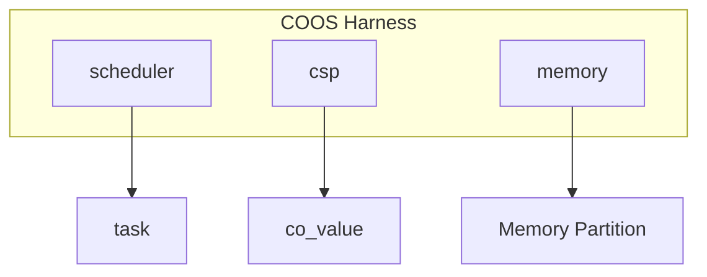
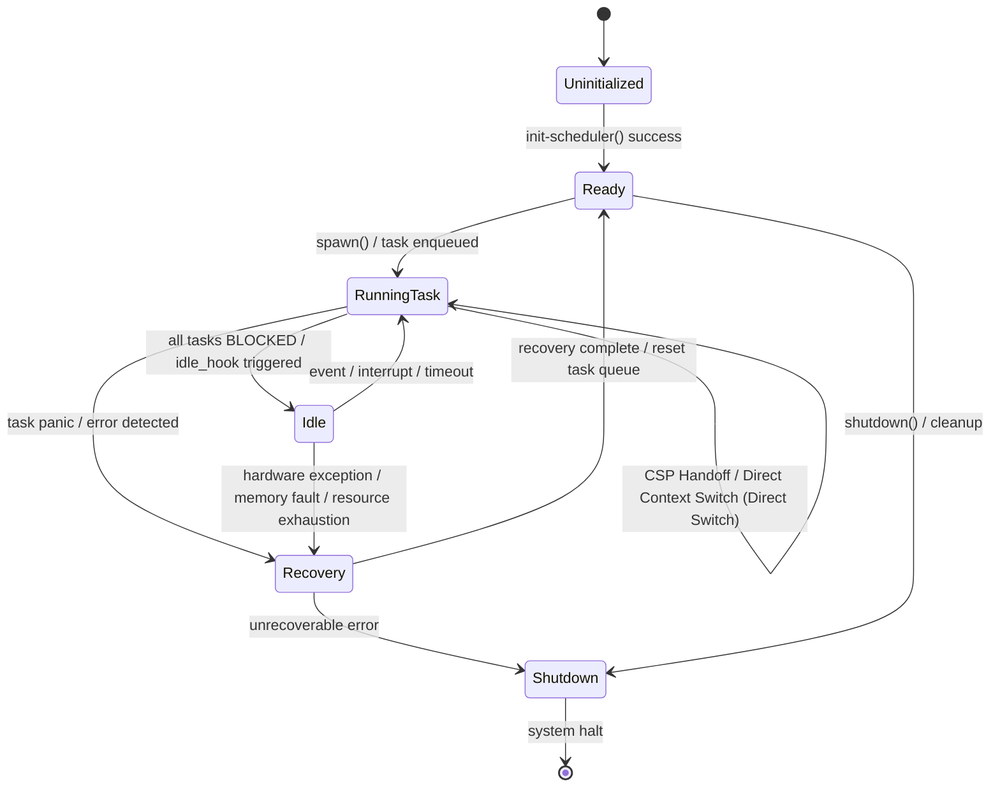
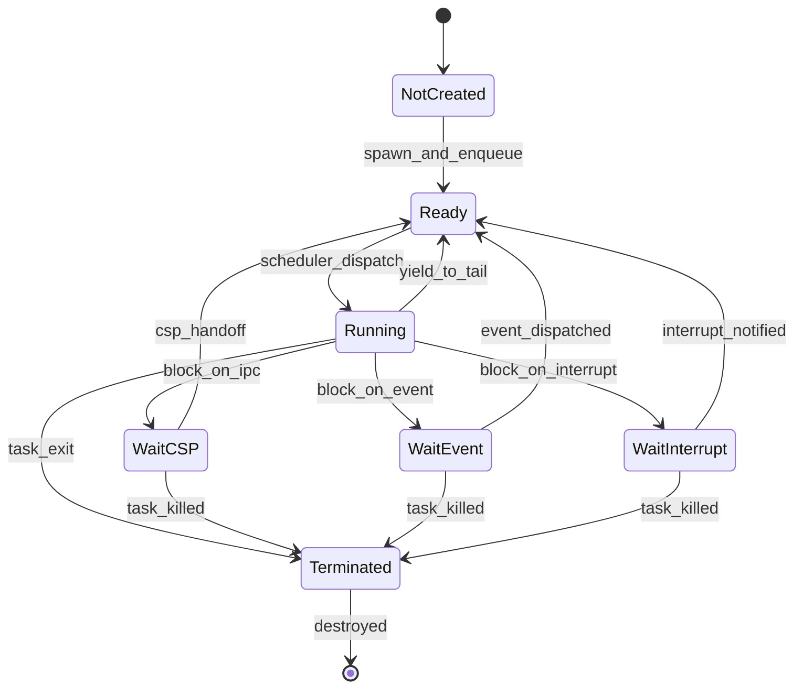

# 協調型OS COOS コンポーネント設計書

## 1. コンセプト
<!-- traceability: {CooperativeMultitasking} {GLOBAL_UseCpp23Library} {GLOBAL_UseCpp20Coroutine} {CSPCommunication} {EliminateDataRace} {GLOBAL_PeriodicTask} {GLOBAL_IdleDetection} {GLOBAL_InterruptWakeup} {NotRTOS} -->
COOSは、シングルスレッド環境向けのホーアCSPベースのグリーンスレッドOSである。C++23コルーチン（および std::flat_map 等の標準コンテナ）を活用し、スタックレスで低オーバーヘッドなタスク切り替えを実現する。また、ホーアCSPに基づき、所有権移譲によるゼロコピーメッセージパッシングを行うことで、データ競合を原理的に排除する。 `{CooperativeMultitasking}` `{GLOBAL_UseCpp23Library}` `{GLOBAL_UseCpp20Coroutine}` `{CSPCommunication}` `{EliminateDataRace}` `{GLOBAL_PeriodicTask}` `{GLOBAL_IdleDetection}` `{GLOBAL_InterruptWakeup}` `{NotRTOS}`

## 2. アーキテクチャ分類
<!-- traceability: {META_3TierSeparation} {GLOBAL_ComponentHarness} -->
本コンポーネントは **Tier 1 (主要システムコンポーネント: Primary Component)** に属し、システム要求 (Tier 0) を受けて協調型タスク実行基盤およびCSPチャネル通信を提供する。 `{META_3TierSeparation}` `{GLOBAL_ComponentHarness}`

### 2.1 構成要素
<!-- traceability: {META_3TierSeparation} {GLOBAL_ComponentHarness} -->
- **[`co_sched`](os_scheduler.md)**: スケジューラ。タスクのライフサイクルと実行順序の管理。
- **`co_csp`**: 通信エンジン。チャネルベースの同期と所有権移譲。
- **`co_mem`**: メモリマネージャ。タスク独立な静的メモリバッファプール（メモリパーティション）の管理。
- **`co_log`**: ロギングマネージャ。 `{BufferedLogging}`

## 3. 静的モデル

### 3.1 データ構造
<!-- traceability: {GLOBAL_Policy_Memory} -->
- **`channel`**: 1エントリのバッファを持つ同期オブジェクト。
- **`co_value`**: 独自の所有権管理構造体。`{GLOBAL_Policy_Memory}` に基づき、コンパイル時に固定サイズで確保された静的メモリ領域またはスタック上のみで動作する。
- **`coos_context`**: スケジューラ、CSP状態、メモリ情報を集約したグローバルコンテキスト。

### 3.2 内部ブロック図
<!-- traceability: {GLOBAL_Policy_Memory} -->


各サブコンポーネントおよび通信バッファ（VAL）は、動的メモリ確保（`malloc`/`new`）を排除するため、静的アロケータによって領域制限されたメモリ領域（MPUパーティション）に完全に配置される。 `{GLOBAL_Policy_Memory}`

### 3.3 主要なデータ定義
<!-- traceability: {GLOBAL_Policy_Memory} -->

#### CSPチャネル（channel）
タスク間の同期と通信を仲介するデータ構造。
通信バッファのやり取りは、動的メモリ確保を排除した `{GLOBAL_Policy_Memory}` に従い、静的プールから事前割り当てされた `CoValue` 構造体の参照またはインデックスの受け渡しのみで実現される（ゼロコピー所有権移譲）。 `{CSPCommunication}` `{GLOBAL_Policy_Memory}`

| 項目名 | 機能と役割 | 型分類 | サイズ・制約 |
| :--- | :--- | :--- | :--- |
| 通信バッファ | 通信データを一時的に保持する領域。所有権移譲を伴う。動的確保は行わず、静的固定領域として配置 | 構造体 (CoValue) | 固定サイズ |
| 送信待機列 | 受信側が準備できるまで送信を待機しているタスクのキュー | 静的固定長キュー | `std::array` 基盤の固定長タスク参照キュー |
| 受信待機列 | データが到着するまで受信を待機しているタスクのキュー | 静的固定長キュー | `std::array` 基盤の固定長タスク参照キュー |

##### チャネル送受信動作の挙動定義
チャネルを通じたCSPメッセージ通信の基本的な制御ロジックを以下に示す。 `{CSPCommunication}`

```python
# CSPチャネルの送受信処理 (概念コード)
def channel_send(channel: Channel, sender_task: Task, value: CoValue):
    # 受信待機中のタスクが存在する場合、直接値を渡して実行権を移譲する
    if channel.receive_queue:
        receiver = channel.receive_queue.pop(0)
        receiver.value = value
        scheduler.wake_up_direct(receiver) # CSP Handoff (直接コンテキストスイッチ)
    else:
        # 待機タスクがいなければ、送信キューにデータを積んでブロックする
        channel.send_queue.append((sender_task, value))
        scheduler.block_current_task()

def channel_recv(channel: Channel, receiver_task: Task) -> CoValue:
    # 送信待機中のタスクが存在する場合、データを受け取り送信タスクを起床する
    if channel.send_queue:
        sender, value = channel.send_queue.pop(0)
        scheduler.wake_up(sender)
        return value
    else:
        # 送信タスクがいなければ、受信キューに入ってブロックする
        channel.receive_queue.append(receiver_task)
        scheduler.block_current_task()
```

## 4. 動的モデル

### 4.1 アルゴリズム
<!-- traceability: {CSP_Handoff} {DirectContextSwitch} {GLOBAL_IdleDetection} {GLOBAL_StrictMemoryLimit} {GLOBAL_IndependentHeap} {GLOBAL_InterruptWakeup} -->
- **CSP Handoff (直接スイッチ)**: `send`/`recv` 時に相手タスクが既に待機状態であった場合、スケジューラを介さず即座に相手タスクへ実行権を移譲する。 `{CSP_Handoff}`
- **直接コンテキストスイッチ (Direct Context Switch)**: コルーチンの `handle.resume()` を直接呼び出すことで、OSスケジューラのキュー処理やディスパッチ判断などのオーバーヘッドを介さず、超低レイテンシで実行権を宛先タスクにスイッチする。 `{DirectContextSwitch}`
- **割り込みウェイクアップ (Interrupt Wakeup)**: 外部割り込みが発生した際、割り込みサービスルーチン（ISR）から `notify_interrupt` が呼び出され、特定のチャネルIDまたは割り込みベクトル（`irq_id`）に登録されて待機しているタスク（待機中タスク）を即座に起床させる（READY状態に遷移して実行可能キューに投入する）。 `{GLOBAL_InterruptWakeup}`
- **Idle Detection**: 全ての実行中タスクがブロック状態にあり、かつイベントキューが空（割り込みや外部イベントによる起床待ちのみ）の場合にアイドル状態と判定する。この条件を `idle_hook` のトリガーとし、イベントキューが空かつ全タスクがブロック状態の時のみ、リングバッファ内の未出力ログが1件以上存在する、あるいはイベント待機開始から10ミリ秒以上経過した際に、バックグラウンド処理（リングバッファからロガーを介した物理ストレージや非揮発性メモリへのログ書き出し・フラッシュ処理）を最低優先度のバックグラウンドタスク（Idle優先度）として呼び出す。 `{GLOBAL_IdleDetection}`
- **Memory Management**: タスク生成時に独立したメモリパーティションを割り当てる。 `{GLOBAL_StrictMemoryLimit}` `{GLOBAL_IndependentHeap}`

#### COOS 内部 API シグネチャ
```python
# 外部割り込みハンドラ（ISR）から呼び出され、特定の割り込みIDにバインドされたタスクを起床する。
# - irq_id: 0〜255の範囲を持つシステム定義の物理割り込みベクトル番号。
# - 割り込みコンテキスト（ISR）内からアトミックかつノンブロッキングで直接実行される。
def notify_interrupt(irq_id: uint32) -> void

# システムがアイドル状態（全タスクがブロックかつ起床イベント待ち）の時に呼び出されるコールバック。
# - 最低優先度の専用Idleタスクの実行コンテキスト内でのみ実行される。
# - リングバッファからロガーへの物理フラッシュ処理のみを行い、他のタスク実行をブロックしない。
def idle_hook() -> void
```

### 4.2 状態遷移図 (SMD: COOS システムレベル)
<!-- traceability: {CSP_Handoff} {DirectContextSwitch} {GLOBAL_IdleDetection} {GLOBAL_StrictMemoryLimit} {GLOBAL_IndependentHeap} -->

COOS 全体のシステムレベル状態遷移を以下に示す。各タスクの状態遷移については **[os_scheduler.md](os_scheduler.md#42-状態遷移図-sysml-smd-scheduler-視点)** を参照。



**システム状態の説明:**
- **Uninitialized**: COOS 初期化前
- **Ready**: 正常稼働。RUNNING または IDLE の どちらかの状態
  - **Running Task**: 1つ以上のタスクが実行中。各タスクは独立メモリプール（`GLOBAL_IndependentHeap`）から論理的に切り出された固定サイズメモリ内に完全に隔離され、実行が保護される。 `{GLOBAL_StrictMemoryLimit}` `{GLOBAL_IndependentHeap}`
  - **Idle**: 全タスクが BLOCKED で、イベント待ちの状態。アイドルフック実行時は追加のメモリ消費は発生しない。
- **Recovery**: タスク障害（panic、メモリ保護例外等）が発生し、安全な状態への復旧処理中
- **Shutdown**: システム終了処理中。リソースの静的解放。

### 4.3 タスク状態遷移図 (SMD: Task ライフサイクル)

個別タスクの詳細な状態遷移を以下に示す。



**タスク状態の説明:**
- **Not Created**: タスク未生成の状態。
- **Ready**: 実行可能であり、スケジューラのREADYキューに登録されている状態。
- **Running**: 現在CPUを占有して実行中のコルーチンタスク。
- **Blocked**: 以下のいずれかの要因により実行を中断し、待機中キューに登録されている状態。
  - **Wait CSP**: チャネル通信（Send/Recv）の相手タスクが到着するのを待機。
  - **Wait Event**: 非同期イベント（システムコールやIPC応答）の到着を待機。
  - **Wait Interrupt**: ハードウェアからの仮想割り込み（ISRによる `notify_interrupt`）を待機。
- **Terminated**: タスクの実行が終了し、静的に確保されたTCBスロットおよびパーティションメモリが再利用可能（解放）となった状態。

## 5. インターフェイス設計
<!-- traceability: {META_StaticDI} -->
各コンポーネントの公開仕様を定義する。 `{META_StaticDI}`

### 5.1 `coos_harness` (システムハーネス)
<!-- traceability: {META_StaticDI} {GLOBAL_ComponentHarness} -->
コンポーネント間の依存関係を集約する構造体。テストの容易性と依存性の分離を実現する。 `{GLOBAL_ComponentHarness}` `{META_StaticDI}`

| 項目名 | 機能と役割 | 型分類 | サイズ・制約 |
| :--- | :--- | :--- | :--- |
| スケジューラ | タスクの実行順序を管理するコンポーネントへの参照 | 構造体への参照 | [`scheduler`](os_scheduler.md) |
| 通信エンジン | タスク間のCSP通信を制御するコンポーネントへの参照 | 構造体への参照 | `co_csp` |
| メモリ管理 | タスク固有のメモリ領域を管理するコンポーネントへの参照 | 構造体への参照 | `co_mem` |

##### ハーネスによる依存性注入パターン
システムハーネスは以下のようにコンポーネントへの参照を集約し、静的に注入される。 `{GLOBAL_ComponentHarness}`

```python
# システムハーネスによる依存性注入パターン
class CoosHarness:
    def __init__(self, scheduler: "Scheduler", csp: "CspEngine", memory: "MemoryManager"):
        # 各サブコンポーネントへの参照を保持し、結合テストやモックの差し替えを容易にする
        self.scheduler = scheduler
        self.csp = csp
        self.memory = memory
```

### 5.2 サブコンポーネント・インターフェイス (C++23)
<!-- traceability: {META_StaticDI} -->

C++23/20 コルーチンおよび静的アロケーションを前提とした、サブコンポーネントのC++ API定義を示す。

#### 1. 所有権管理 `CoValue`
`CoValue` は、動的ヒープを使用せず、ムーブ専用（Move-only）の所有権移譲を保証する構造体である。コピーコンストラクタは削除され、データ競合を防止する。

```text
struct CoValue {
  // ムーブセマンティクスのみを許可
  CoValue() = default;
  CoValue(const CoValue&) = delete;
  CoValue& operator=(const CoValue&) = delete;
  CoValue(CoValue&&) noexcept = default;
  CoValue& operator=(CoValue&&) noexcept = default;

  uint64_t key;
  uint64_t value;
  uint32_t type_id;
};
```

#### 2. 公開 API インターフェイス

| コンポーネント | C++ API プロトタイプ定義 | 説明 |
| :--- | :--- | :--- |
| `scheduler` | `auto spawn(void(*task_entry)(void*), void* arg) -> result<task_id_t, scheduler_error>;`<br>`auto yield() -> void;`<br>`auto exit() -> void;`<br>`auto set_idle_hook(void(*hook)()) -> void;`<br>`auto wake_up_direct(task_id_t task) -> void;`<br>`auto notify_interrupt(task_id_t task) -> void;` | タスクの生成・一時譲渡・終了およびアイドル時コールバックの設定。`wake_up_direct` はCSP Handoffによる即時起床用、`notify_interrupt` はISRコンテキストからタスクを起床する用。動的確保は行わず、静的プールからTCBスロットを割り当てる。 |
| `csp` | `auto send(channel_id_t chan, CoValue&& val) -> coos::task_coroutine;`<br>`auto receive(channel_id_t chan) -> coos::task_coroutine_recv;` | チャネル経由の同期メッセージ送受信。ムーブセマンティクスによるゼロコピー所有権移譲を行う。 |
| `memory` | `auto allocate(size_t size) -> result<void*, memory_error>;`<br>`auto free(void* ptr) -> void;` | タスク固有の静的メモリパーティション内でのメモリ管理。 |

## 6. 形式検証（TLA+ / 直交表）

### 6.1 検証対象の不変条件

<!-- traceability: {CSP_Handoff} {GLOBAL_UseCpp20Coroutine} {Challenge_CspHandoffStarvation} -->

| 不変条件 | 説明 | 検証方法 |
| :--- | :--- | :--- |
| **デッドロック不在** | Send と Recv がブロックされた状態で互いに待つサイクルが存在しないこと。`{Challenge_CspHandoffStarvation}` | 直交表 + TLA+ リーチャビリティ |
| **状態一貫性** | タスク状態 (READY/BLOCKED/SUSPENDED) が各操作後も整合していること。 | 直交表（ケース1-7） |
| **チャネルFIFO** | 同一チャネル上のメッセージ/通知は FIFO 順で処理されること。 | TLA+ 順序付け不変式 |
| **co_yield 有界性** | co_yield は有限時間内に達成されるか、または明示的に中断することが保証されること。`{GLOBAL_UseCpp20Coroutine}` | TLA+ 活性検証 |

### 6.2 直交表: CSP通信と状態遷移

チャネル通信時のタスク状態とスケジューラの挙動を検証する。割り込み通知はイベント駆動型として扱われる。

| ケース | 自タスク要求 | チャネル状態 | 相手状態 | 期待される動作 (自) | 期待される動作 (他) |
| :--- | :--- | :--- | :--- | :--- | :--- |
| 1 | SEND | Empty | - | BLOCKEDへ遷移、IPC_REQUEST イベント投入 | (なし) |
| 2 | SEND | Full | - | BLOCKEDへ遷移、IPC_REQUEST イベント投入 | (なし) |
| 3 | SEND | (待機RXあり) | BLOCKED | **READYへ遷移(直接)** | **READYへ遷移(直接)** |
| 4 | RECV | Full | - | **READYへ遷移、IPC_REPLY イベント投入** | (チャネル空へ) |
| 5 | RECV | Empty | - | BLOCKEDへ遷移 | (なし) |
| 6 | RECV | (待機TXあり) | BLOCKED | **READYへ遷移(直接)** | **READYへ遷移(直接)** |
| 7 | ISR通知 | - | BLOCKED/READY | (継続) | **INT イベント投入 → EventLoop で処理 → BLOCKED なら READY へ遷移** |

**注**: ケース7では、割り込みハンドラ（ISR）がタスク状態を直接変更せず、代わりに INT イベントをイベントキューに投入する（`docs/components/os_event_driven.md` 参照）。イベントループが INT イベントを取り出し、対象タスクを BLOCKED から READY へ遷移させる。
