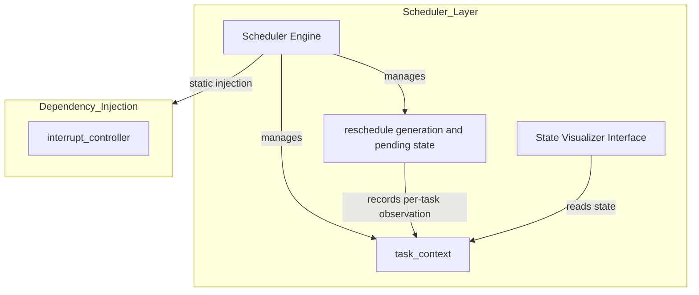
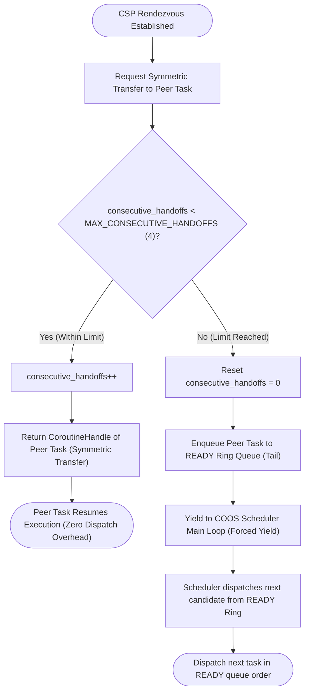
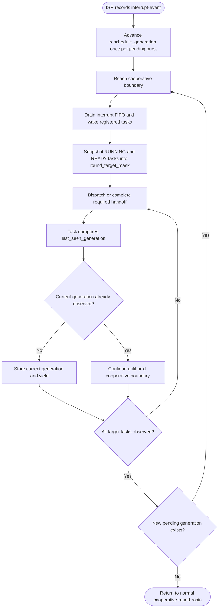
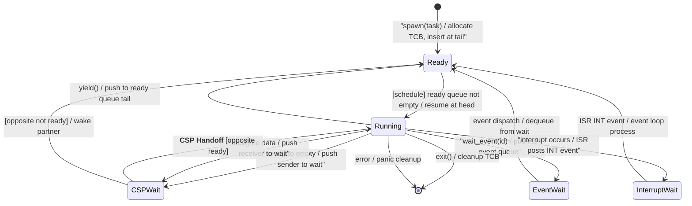

# COOS スケジューラ コンポーネント設計書 {VERIFY_FORMAL} {VERIFY_LLM} {VERIFY_BENCHMARK}
<!-- evidence:
     formal: formal/coos_channel_model.py
     benchmark: benchmarks/direct_context_switch_bench.py
     concept: concepts/scheduler_concept.py
     test: docs/qa/tier1_core/os_scheduler_test_spec.md
-->

## 1. コンセプト
<!-- traceability: {CooperativeMultitasking} {GLOBAL_UseCpp23Library} {GLOBAL_UseCpp20Coroutine} {COOS_Deterministic} {CSPCommunication} {LowOverheadSwitch} -->
COOSスケジューラは、協調型OS COOS（[`os_coos.md`](docs/components/tier1_core/os_coos.md)）におけるタスクディスパッチとREADYキューの制御を司る実行制御モジュールである。タスクの実行、一時停止(yield)、および割り込みによる再開を管理し、極小リソース環境での決定論的な実行を提供する。タスク間のCSPチャネル通信に伴うサスペンド・再開制御と連動し、コンテキストスイッチには C++20 コルーチンの**対称遷移（Symmetric Transfer）** を採用する。全汎用レジスタのメモリスタック退避・復帰を排除してフレームポインタとPCのみの交換に最小化することで、数サイクルでの極低オーバーヘッドなタスク遷移を達成する。

## 2. アーキテクチャ分類
<!-- traceability: {META_3TierSeparation} -->
本コンポーネントは **Tier 1 (主要システムコンポーネント: Primary Component)** に属する。コルーチンハンドルの管理とタスク実行順序の制御に特化した単一責務のモジュールとして設計する。

## 3. 静的モデル

### 3.1 データ構造
<!-- traceability: {COOS_Transparent} {ADR_InterruptRescheduleGeneration} -->
- **`Scheduler`**: タスクのREADYキュー管理、実行順序制御、およびコルーチン実行をカプセル化した主要クラス。各タスクの実行状態を外部から可視化・検査するための監査用インターフェースを提供する。
- **`task_context`**: 各タスクの実行状態（READY/BLOCKED/RUNNING等の待機状態）、スタック境界、コルーチンハンドル、および最後に観測した再スケジュール要求世代を集約したデータ構造。
- **`scheduler_config`**: 最大タスク数、タイムアウト閾値、および各タスクの割り当てリソース制限からなる不変の静的設定。
- **`reschedule_generation`**: 割り込み通知を契機に更新する単調増加の要求世代。要求が保留中の間に到着した追加イベントは同じ世代へ集約し、イベント本体は固定長FIFOで個別に保持する。
- **`reschedule_pending`**: 未完了の協調再スケジュール要求を示す原子的な状態。要求世代の一巡完了とFIFOの空を確認するまで解除しない。
- **`round_target_mask`**: 協調再スケジュール開始時点で実行対象となるRUNNINGおよびREADYタスクを示す固定長ビットマップ。新規生成タスクは現在の一巡の対象に含めない。

### 3.2 内部ブロック図
<!-- traceability: {COOS_Transparent} -->


### 3.3 主要なデータ定義
<!-- traceability: {COOS_Transparent} {ADR_InterruptRescheduleGeneration} -->

#### スケジューラクラス（Scheduler）
依存関係（割り込み制御等）とタスクキューをカプセル化する。

| 項目名 | 機能と役割 | 型分類 | サイズ・制約 |
| :--- | :--- | :--- | :--- |
| 割り込み制御機 | 物理ハードウェア（NVIC）の制御用 | 構造体への参照 | `interrupt_controller` |
| 実行可能列 | 次に実行すべきタスクのFIFO実行可能列（侵入型循環双方向リスト） | リスト構造 | `task_context` のリスト |
| 待機リスト | イベントや時間待ちを行っているタスクのリスト（侵入型） | リスト構造 | `task_context` のリスト |
| 現在のタスク | 現在CPUコアを占有しているタスク | 構造体への参照 | `task_context` (NULL許容) |
| 再スケジュール要求 | 割り込み通知の保留状態、要求世代、および一巡対象マスク | 原子状態と固定長ビットマップ | `reschedule_pending`, `reschedule_generation`, `round_target_mask` |
| 状態可視化API | 外部から全タスクの待機・実行状態を安全に監視するためのメソッド群。ロックフリーな読み取り専用構造（Double Buffering）を採用し、実行中タスクをブロックせずに O(1) で状態を即座に取得可能。 | 関数オブジェクト | `Scheduler::get_task_states` (読み取り専用) |

## 4. 動的モデル

### 4.1 アルゴリズム
<!-- traceability: {GLOBAL_IdleDetection} {GLOBAL_PeriodicTask} {GLOBAL_InterruptWakeup} {Challenge_CspHandoffStarvation} {CSP_Handoff} -->
- **スケジューリング**: ラウンドロビン方式。
    - スケジューラ・コンテキスト内の「実行可能タスク列」を固定容量の侵入型循環双方向リストで管理する。末尾・先頭への追加、先頭からの取り出し、既知タスクの除去を定数時間 $O(1)$ で行う。
- **連続直接ハンドオフ上限とメインループ復帰 (`GOTCHA-SCHED-01`)**:
    - CSP通信のランデブー成立時、呼び出し元と呼び出し先は C++20 コルーチンの対称遷移（Symmetric Transfer）によりスケジューラをバイパスして直接遷移（）を行う。
    - **背景**: 直接ハンドオフを無制限に許可すると、タスク間のピンポン通信がスケジューラへの復帰を遅らせ続ける可能性がある。
    - **動作**: スケジューラは連続直接遷移カウンタ（`consecutive_handoffs`）を保持する。上限（ビルド時定数 `FB_CONF_MAX_CONSECUTIVE_HANDOFFS`、既定値 `4` 回）到達後のランデブーでは、直接遷移を行わず相手タスクを READY キュー末尾へ投入する。その後 `YIELD` を返し、スケジューラのメイン巡回ループへ制御を戻す。
    - **保証範囲**: この上限は連続直接ハンドオフ回数と、上限到達後にスケジューラへ制御が戻ることを制限する。協調型スケジューラは実行中タスクを強制プリエンプトしないため、全タスクの公平性や有界な実時間応答は保証しない。
    - **検証範囲**: 形式検証モデル `formal/coos_channel_model.py` は、モデル内のスケジューラ復帰と他の READY タスクのディスパッチを検証する。 `{GOTCHA-SCHED-01}`
- **アイドル状態の検知**: 全ての管理タスクが「待機状態（BLOCKED/SUSPENDED_CSP）」となった場合にアイドル・ハンドラ（Periodic Task、ログフラッシュ、JITバッチコンパイル等）を実行する。
- **割り込み処理**: HALからの原因付き`interrupt-event`通知（`notify_interrupt(event)`）を受信し、固定長FIFOから回収して`vector_id`に対応する対象タスクをREADYキュー末尾に追加する。
- **割り込み時の協調再スケジュール (`ADR_InterruptRescheduleGeneration`)**:
    - ISRは`interrupt-event`を固定長FIFOへ投入し、要求が保留されていない場合だけ`reschedule_generation`を一世代進める。ISRはタスク状態、READYキュー、および`round_target_mask`を変更しない。
    - スケジューラは最初の協調境界でFIFOをドレインし、割り込みで起床したタスクをREADYキューへ追加した後、RUNNINGおよびREADYタスクを`round_target_mask`へ記録する。
    - タスクがディスパッチまたは許可された直接ハンドオフで実行を開始したとき、`task_context.last_seen_generation`が現在世代と異なる場合は現在世代へ更新し、直ちに協調的な`YIELD`へ遷移する。タスクごとの更新は一世代につき一回だけ行う。
    - `round_target_mask`に含まれる全タスクが現在世代を観測した時点で一巡を完了する。完了時に新しい割り込み要求が保留されている場合は、要求を消去せず次の世代の一巡へ移行する。要求を解除する場合は、対象世代と現在世代が一致し、かつFIFOが空であることを原子的に確認する。
    - BLOCKEDまたは終了したタスクは現在の対象から除外し、新規生成タスクは次の世代から対象とする。タスクが協調境界へ到達しない場合、この機構だけでは強制プリエンプションを行わない。


#### 連続直接ハンドオフ上限判定とメインループ復帰手順（手順アクティビティ図）
<!-- traceability: {GOTCHA-SCHED-01} {Challenge_CspHandoffStarvation} {CSP_Handoff} {ADR_InterruptRescheduleGeneration} -->
連続直接ハンドオフの上限到達後にスケジューラへ制御が戻る手順を示す。この上限は全タスクの公平性や実時間の応答上限を保証しない。



#### 割り込み要求世代の一巡手順（手順アクティビティ図）
<!-- traceability: {ADR_InterruptRescheduleGeneration} {GLOBAL_InterruptWakeup} {TaskPollInterruptEvent} -->
割り込み要求を検知した後、要求世代を対象タスクが一度ずつ観測するまで協調的に再スケジュールする手順を示す。



#### スケジューラ フルセット・コンセプトコード (`concepts/scheduler_concept.py`)
```python
class TaskState:
    READY = "READY"
    RUNNING = "RUNNING"
    BLOCKED = "BLOCKED"
    TERMINATED = "TERMINATED"


class RoundRobinScheduler:
    def __init__(self, max_tasks: int = 16):
        self.max_tasks = max_tasks
        self.tasks = {}
        self.ready_ring = collections.deque()
        self.current_task = None
        self.total_dispatches = 0

    def spawn(self, task_id: str, coroutine, priority: int = 0) -> bool:
        """Register a new task into the fixed task table and ready ring."""
        assert len(self.tasks) < self.max_tasks, "Max task capacity exceeded"
        assert task_id not in self.tasks, f"Task {task_id} already exists"

        self.tasks[task_id] = {
            "id": task_id,
            "coro": coroutine,
            "state": TaskState.READY,
            "priority": priority,
            "dispatches": 0,
        }
        self.ready_ring.append(task_id)
        return True

    def schedule_next(self) -> str | None:
        """Selects the next task from the ready ring.
        Note: deque.popleft() models an O(1) FIFO queue operation. The C++ implementation
        uses an intrusive circular list ({ADR_IntrusiveTcbList}); this Python example does not
        model the embedded memory layout.
        """
        if not self.ready_ring:
            return None

        task_id = self.ready_ring.popleft()
        self.current_task = task_id
        task_entry = self.tasks[task_id]
        task_entry["state"] = TaskState.RUNNING
        task_entry["dispatches"] += 1
        self.total_dispatches += 1
        return task_id

    def yield_current(self):
        """Cooperative yield: move current task to the tail of the ready ring."""
        assert self.current_task is not None, "No active task to yield"
        task_id = self.current_task
        task_entry = self.tasks[task_id]
        task_entry["state"] = TaskState.READY
        self.ready_ring.append(task_id)
        self.current_task = None

    def block_current(self, reason: str = "WAIT"):
        """Block current task on event/IPC: removed from ready ring."""
        assert self.current_task is not None, "No active task to block"
        task_id = self.current_task
        task_entry = self.tasks[task_id]
        task_entry["state"] = TaskState.BLOCKED
        task_entry["block_reason"] = reason
        self.current_task = None

    def unblock_task(self, task_id: str):
        """Unblock task on event arrival: append to ready ring."""
        assert task_id in self.tasks, f"Unknown task {task_id}"
        task_entry = self.tasks[task_id]
        if task_entry["state"] == TaskState.BLOCKED:
            task_entry["state"] = TaskState.READY
            task_entry["block_reason"] = None
            self.ready_ring.append(task_id)

    def run_cycle(self) -> bool:
        """Dispatches one ready task and advances it to its next scheduling action."""
        task_id = self.schedule_next()
        if task_id is None:
            return False  # All tasks blocked or completed

        task_entry = self.tasks[task_id]
        try:
            action = task_entry["coro"].send(None)
            if action == "YIELD":
                self.yield_current()
            elif action == "BLOCK":
                self.block_current()
        except StopIteration:
            self.tasks[task_id]["state"] = TaskState.TERMINATED
            self.current_task = None

        return True
```

### 4.2 状態遷移図 (SysML SMD: Scheduler 視点)
<!-- traceability: {GLOBAL_IdleDetection} {GLOBAL_PeriodicTask} {GLOBAL_InterruptWakeup} -->

スケジューラが管理するタスク状態とイベント駆動の遷移ロジックを以下に示す。



**状態遷移の詳細:**

| 遷移 | トリガー | 条件 | アクション | 次状態 |
| :--- | :--- | :--- | :--- | :--- |
| init → READY | spawn(task) | 静的TCBスロットの空きあり | 静的プールからTCBを割り当て、タスクコンテキスト初期化 | READY |
| READY → RUNNING | schedule() | READYキュー非空 | `head_task.resume()` 直接呼び出し | RUNNING |
| RUNNING → READY | yield() | (常に可) | 実行可能列末尾へ push、実行権をスケジューラに戻す | READY |
| RUNNING → CSPWait | send(ch) | 受信側未待機 (`{ADR_RendezvousChannel}`) | 送信側としてチャネルスロットに登録しサスペンド、実行権をスケジューラに戻す | CSPWait |
| RUNNING → CSPWait | recv(ch) | 送信側未待機 (`{ADR_RendezvousChannel}`) | 受信側としてチャネルスロットに登録しサスペンド、実行権をスケジューラに戻す | CSPWait |
| CSPWait → RUNNING | **CSP Handoff** | 相手タスク待機中 (Rendezvous成立) | **対称遷移スイッチ: `await_suspend` から `opposite_task.coroutine_handle` 返却（スケジューラ迂回 $O(1)$ スイッチ）** `{CSP_Handoff}` | RUNNING |
| CSPWait → READY | [opposite not ready] | 相手タスク未待機 (Rendezvous不成立) | 相手タスクを起床させREADYキュー末尾へ投入、自身もREADYキューへ復帰 | READY |
| RUNNING → EventWait | wait_event(id) | (常に可) | イベントID登録、スケジューラに制御戻す | EventWait |
| EventWait → READY | event dispatch | イベント受信 | イベントループがタスクをREADYへ遷移 | READY |
| RUNNING → InterruptWait | [ISR発生] | 割り込みハードウェア | ISRが INT イベントをキューに投入 | InterruptWait |
| InterruptWait → READY | event dispatch | INT イベント処理 | イベントループが対象タスクをREADYへ遷移 | READY |
| RUNNING → [*] | exit() / error | (常に可) | TCBスロットの返却（再利用化）、静的メモリパーティション回収 | [*] |

**注記:**
- 割り込みハンドラ（ISR）は直接タスク状態を変更しない。代わりに INT イベントをイベントキューに投入する。
- **CSP Handoff の特徴**: スケジューラを介さず、C++20 コルーチンの対称遷移（Symmetric Transfer）によりコールスタックを消費せずに相手タスクへ直接ジャンプする。超低レイテンシかつスタック深度 $O(1)$ を保証。

## 5. インターフェース設計

### 5.1 公開API
外部から利用可能なオブジェクト指向APIを定義する。依存関係は `initialize` メソッドで注入する。

#### 初期化 (`init-scheduler`)

<!-- traceability: {ConceptHarnessDI} -->

| 項目 | 内容 | 型分類 |
| :--- | :--- | :--- |
| 機能概要 | C++20/23 Conceptsを用いたコンパイル時テンプレート解決により、スケジューラに必要な依存コンポーネント（メモリプール等）を静的に注入する。 | 操作定義 |
| シグネチャ | `template<coos::memory_manager M> void init_scheduler() noexcept` | 関数プロトタイプ |
| 戻り値 | なし (コンパイル時に依存型と解決が検証され、失敗時はビルドエラーとなる) | 結果型 |
| 事前条件 | 静的メモリ管理ユニット（M）が初期化済みであること。 | 条件 |
| 事後条件 | スケジューラがアイドル状態で起動する。 | 状態変化 |
| 不変条件 | シングルトンであり、実行時の再初期化は不可。 | 制約 |

#### タスク生成 (`spawn`)

<!-- traceability: {COOS_Scheduling_Refine} -->

| 項目 | 内容 | 型分類 |
| :--- | :--- | :--- |
| 機能概要 | 新しいWASMタスクを生成し、実行可能キューの末尾に追加する。 | 操作定義 |
| シグネチャ | `auto spawn(const char* name, wasm_entry_t entry) -> result<os_task_id_t, os_result_t>` | 関数プロトタイプ |
| 引数 | - `name`: タスク名称。生存期間がプログラム起動から終了まで静的に保証されたヌル終端文字列（`const char*`）。動的ヒープ確保を避けるため、内部でのコピーは行わず、ポインタ参照のみを保持する。<br>- `entry`: WASMエントリポイントとなる関数ポインタ型 `wasm_entry_t`（C++での型エイリアス定義は `using wasm_entry_t = void(*)(void*);`。コルーチン生成時に初期コルーチンフレームの起動先として紐付けられる）。 | 引数定義 |
| 戻り値 | 成功時は静的に割り当てられたタスクIDである `os_task_id_t` を返し、失敗時はエラーコードを示す `os_result_t` （例：`ERR_NO_MEMORY` = TCBプール領域満杯でメモリ確保不可、`ERR_MAX_TASKS_REACHED` = 登録タスク数がシステム上限に到達、`ERR_INVALID_ARG` = 引数不正）を返す `result<os_task_id_t, os_result_t>` 型。動的ヒープ確保は一切行われず、静的メモリ内の固定長配列（`std::array<TCB, FB_CONF_MAX_TASKS>`）から空きスロットが割り当てられる。 | 結果型 |
| 事前条件 | スケジューラが初期化済みであること。管理タスク数上限（scheduler_config）に達していないこと。 | 条件 |
| 事後条件 | 新しいタスクが実行可能キューの末尾に追加される。 | 状態変化 |
| 不変条件 | 生成されたシステムタスクIDはシステム内で一意であること。 | 制約 |

#### タスク生成（spawn_task - ネイティブタスク用）
<!-- traceability: {CooperativeMultitasking} {GLOBAL_UseCpp20Coroutine} -->
既存のコルーチンオブジェクトを移動セマンティクスによって登録し、協調型マルチタスクとして動作させる。本APIは公開APIであり、`fireball` 名前空間の下に配置される。

| 項目 | 内容 | 型分類 |
| :--- | :--- | :--- |
| 機能概要 | 既存のコルーチンオブジェクトからネイティブタスクを生成し、READY キューに追加する。 | 操作定義 |
| シグネチャ | `auto fireball::spawn_task(task&& t) -> result<os_task_id_t, os_result_t>` | 関数プロトタイプ |
| 引数 | `t`: 移動セマンティクスによるムーブ専用のコルーチンタスクオブジェクト。<br>※ コルーチンフレームの有界性を担保するため、`t` の `promise_type` は `operator new`/`operator delete` をオーバーライドし、[`system_memory.md`](docs/components/tier1_interface/system_memory.md) §4.2 の型付きスロット貸与API（`acquire_slot<T>()`/`pool_ref<T>`、カーネルプール `FB_CONF_KERNEL_HEAP_SIZE` 内から確保）を介してコルーチンフレームを確保する（`malloc`/`new` を用いない）。`t` はこの静的スロット割り当てに適合するコンパイル時コンセプト `is_heap_less<task>` を満たす型でなければならない。 | 引数定義 |
| 戻り値 | 成功時は割り当てられたタスクID `os_task_id_t` を返し、失敗時はエラーコードを示す `os_result_t` （例：`ERR_MEM_FULL`, `ERR_INVALID_ARG`）を返す `result<os_task_id_t, os_result_t>` 型。 | 結果型 |
| 事前条件 | `t` が有効なコルーチンハンドルを保持していること。 | 条件 |
| 事後条件 | タスクが READY キューに追加される。 | 状態変化 |

#### 実行譲渡（yield）
<!-- traceability: {LowOverheadSwitch} -->
現在実行中のタスクを中断し、次のタスクへコンテキストを切り替える。C++20 コルーチンの対称遷移（Symmetric Transfer）により、全汎用レジスタ退避を伴わず数サイクルで高速遷移する。

| 項目 | 内容 |
| :--- | :--- |
| 機能概要 | 現在のタスクを実行可能キュー末尾に移動し、READY 先頭のタスクへ極低オーバーヘッドでコンテキストを切り替える。 |
| シグネチャ | `yield() -> void` |
| 事前条件 | タスク実行コンテキスト内から呼び出されること（ISRからの呼び出し不可）。 |
| 事後条件 | 現在のタスクが READY キューの末尾に移動し、次タスクに切り替わる。 |

#### 実行（run）
<!-- traceability: {LowOverheadSwitch} -->
メインスケジューリングループを開始し、READY キューのタスクを順次ディスパッチする。
| 事前条件 | `init-scheduler` が完了していること。 |
| 事後条件 | 通常、この関数は戻らない（電源断または致命的エラー時のみ）。 |

#### アイドルハンドラ設定（set_idle_handler）
| 項目 | 内容 |
| :--- | :--- |
| 機能概要 | READYキューが空になった際に呼び出されるアイドル時処理を登録する。 |
| シグネチャ | `set_idle_handler(handler: idle_handler) -> void` |
| 引数 | `handler`: 関数ポインタ (`void(*)()`) |

#### `notify-interrupt` (内部 API)
| 項目 | 内容 |
| :--- | :--- |
| 機能概要 | ISRから呼び出され、固定長FIFOへ汎用`interrupt-event`を投入する。 |
| シグネチャ | `notify_interrupt(event: interrupt_event) -> void` |
| 引数 | `event`: `vector_id`、`source_id`、`cause_code`、`payload0`、`payload1`からなる固定5ワードの原因レコード |
| 事前条件 | ISR コンテキスト内からのみ呼び出されること。 |
| 事後条件 | FIFOへの`interrupt-event`投入に成功した場合、FIFO満杯でなければ、要求が保留されていない場合に`reschedule_generation`を更新し、`reschedule_pending`を設定する。FIFO満杯の場合はイベントをドロップし、ドロップカウントだけをインクリメントする。ドレイン時に`vector_id`の待機先が未登録ならイベントをドロップし、登録済みの待機タスクだけをBLOCKEDからREADYへ遷移させてREADYキュー末尾へ挿入する。 |
| 設計注記 | 割り込み通知は原因情報を保持したままイベント化され、スケジューラのメインループで安全に処理される。ISRは軽量に、イベント投入、要求世代の更新、およびドロップカウンタの更新だけを行う。タスク状態とREADYキューは協調境界でだけ変更する。 |

#### 再スケジュール世代の観測（内部契約）
<!-- traceability: {ADR_InterruptRescheduleGeneration} {TaskPollInterruptEvent} -->

| 項目 | 内容 |
| :--- | :--- |
| 観測契機 | タスクのディスパッチ開始時、許可されたCSP直接ハンドオフの遷移先開始時、およびvSoCのトレース境界から復帰した時点 |
| 観測動作 | `task_context.last_seen_generation`と`reschedule_generation`を比較し、異なる場合は現在世代を記録して協調的な`YIELD`を返す |
| 一巡完了 | `round_target_mask`の全タスクが現在世代を記録した時点 |
| 解除条件 | 一巡完了、FIFO空、および解除対象世代と現在世代の一致を同一の原子的手順で確認した時点 |
| 禁止事項 | ISRからのタスク状態変更、タスク自身による要求世代の巻き戻し、協調境界を持たない強制プリエンプション |

#### タスク終了（terminate）
| 項目 | 内容 |
| :--- | :--- |
| 機能概要 | 指定したタスクを終了し、リソースを解放する。 |
| シグネチャ | `terminate(id: os-task-id) -> void` |
| 引数 | `id`: 終了対象のタスクID |
| 事前条件 | `id` が有効なタスクを指していること。 |
| 事後条件 | タスクに関連するメモリリソース（TCB等）が解放され、全キューから除外される。 |

#### タスク状態可視化（get_task_states）
| 項目 | 内容 | 型分類 |
| :--- | :--- | :--- |
| 機能概要 | 外部から全タスクの待機・実行状態を安全に監視するためのメソッド。ロックフリーな読み取り専用構造（Double Buffering）を採用し、実行中タスクをブロックせずに $O(1)$ で状態スナップショットを取得可能。 | 操作定義 |
| シグネチャ | `auto get_task_states() const noexcept -> task_state_snapshot_t` | 関数プロトタイプ |
| 戻り値 | 全タスクの状態スナップショット配列（`std::array<os_task_state_t, FB_CONF_MAX_TASKS>`） | 結果型 |
| 事前条件 | スケジューラが初期化済みであること。 | 条件 |
| 事後条件 | 実行中タスクの進行に影響を与えない。 | 状態変化 |

## 6. 設計判断 (ADR)
<!-- traceability: {ADR_IntrusiveTcbList} {ADR_CoosPureRoundRobin} {ADR_EventDrivenWakeQueue} -->

このコンポーネントの ADR は、全体アーキテクチャから `{ADR_*}` キーワードで参照される。詳細な背景・選択肢の比較検討は以下に記録する。

- **決定事項**:
  - **背景**: TCBの連結方式を決定する必要がある。`{GLOBAL_Policy_Memory}` の有界メモリ管理方針に基づき、スケジューラ内部での不要なメモリ確保やフラグメンテーションは極小化すべきである。
  - **選択肢と評価**:
    - 案1: `std::list` 等のノードベースコンテナで連結する。標準的で扱いやすいが、リスト操作ごとにノード確保のオーバーヘッドとフラグメンテーションのリスクが発生する。
    - 案2: TCB自体に `next` ポインタを持たせる侵入型リストで連結する。追加のノード確保が不要で、事前確保された TCB プール（`std::array<TCB, FB_CONF_MAX_TASKS>`）の要素をそのまま連結できる。
  - **結論**: 案2を採用する。
  - **理由**: 不要なノード確保や断片化を排除し、RAM 64KB環境での決定論的動作と生存を確実にするため。 `{GLOBAL_Policy_Memory}`
- **決定事項**:
  - **背景**: `{COOS_Scheduling_Refine}` はスケジューリングアルゴリズムの継続的な改善と最適化を要求している。RTOS的な優先度制御を導入するか、単純なラウンドロビンに留めるかを現時点のコアアルゴリズムとして決定する必要がある。
  - **選択肢と評価**:
    - 案1: 優先度付きマルチレベルキュー方式。タスクごとに絶対優先度を持たせ、最高優先度の READY タスクから実行する。柔軟な応答性制御は可能だが、優先度逆転対策（優先度継承等）が別途必要になり、`{NotRTOS}`（リアルタイム性よりメモリ効率・移植性を優先する方針）と衝突するオーバーヘッドと検証コストを持ち込む。
    - 案2: タイマ割り込みによるタイムスライス（時分割）ラウンドロビン。本プロジェクトは `{LowOverheadSwitch}` に基づく協調型（yield起点）切り替えを前提としており、強制プリエンプションはコンテキスト保存コストと非決定性を増やし、方針と相反する。
    - 案3: 侵入型循環リストによる純粋な協調型ラウンドロビン。優先度を持たず、ステートレスなインターフェース経由でアルゴリズム部分を分離し、低オーバーヘッドかつ $O(1)$ なディスパッチ性能を保証する。
  - **結論**: 案3を採用する。
  - **採用理由**: 本プロジェクトはRTOSではないため、優先度制御を設けない。これにより制御オーバーヘッドと優先度逆転を避ける。
  - **実行順序**: タスクが協調的にyieldしたとき、READYキュー順で次のタスクを実行する。yieldしないタスクを含む全タスクの公平性や応答時間は保証しない。
  - **変更容易性**: ステートレスなインターフェースを介して実装を分離する。将来スケジューリング方式を変更してもタスク側のコードに影響しない。
  - **適用範囲**: この決定は `{COOS_Scheduling_Refine}` が要求する継続的改善を妨げない。ここでは現時点のベースラインを定める。

- **決定事項**:
  - **背景**: `BLOCKED` タスクリストの管理コストとリアルタイム性のトレードオフ（`{Challenge_CoosBlockedList}`）が課題として提起されていた。起床待ちタスクの探索方式を決定する必要がある。
  - **選択肢と評価**:
    - 案1: 線形スキャン。毎スケジューリングサイクルで BLOCKED リスト全体を走査し、起床条件を満たすタスクを探す。実装は単純だが、タスク数の増加に対して走査コストが $O(n)$ となり、最悪応答時間の予測が困難になる。
    - 案2: タイムアウトホイール（階層化タイマ）。時間経過による起床（sleep等）には強いが、`notify_interrupt` のような非同期イベントによる起床には別経路が必要になり、二系統の起床経路を維持する複雑さを持ち込む。
    - 案3: イベントドリブンな起床キュー。`notify_interrupt` 等のイベント発生時にのみ対象タスクをキューへ投入し、通常サイクルでは走査を行わない。
  - **結論**: 案3を採用する。
  - **採用理由**: 待ちタスクを定期的にポーリングすると、組み込み環境のCPUサイクルを浪費する。ポーリング間隔によっては起床レイテンシも予測しにくくなる。
  - **動作特性**: `notify_interrupt` 等の通知を契機に対象タスクを起床キューへ追加する。通常のスケジューリングサイクルでは BLOCKED タスクを走査しない。
  - **性能特性**: READYリングキューのpush/popは、タスク数に依存しない $O(1)$ とする。割り込みイベントの待機者検索は配送経路に属し、計算量と応答時間を別途評価する。 `{Challenge_CoosBlockedList}`

- **決定事項**:
  - **背景**: 割り込み通知後に実行中タスクのCPU占有が続くと、READYタスクおよび割り込み起床タスクの実行開始が遅延する。強制プリエンプションを導入せず、協調型スケジューラの決定論を維持したまま再スケジュール要求を伝播する必要がある。
  - **選択肢と評価**:
    - 案1: 共有Booleanフラグを設定し、任意のタスクがフラグを解除する。実装は小さいが、複数割り込みの統合、要求の消失防止、および一巡完了の判定を表現できない。
    - 案2: 割り込みごとに全タスクへ要求状態を複製する。要求の観測は明確だが、固定TCBに不要な状態と更新処理を追加する。
    - 案3: COOS全体の要求世代と、TCBごとの最終観測世代を保持する。要求対象のスナップショットを固定長ビットマップで管理し、タスクごとの観測を一世代一回に制限する。
  - **結論**: 案3を採用する。 `{ADR_InterruptRescheduleGeneration}`
  - **採用理由**: ISR側の処理をイベント投函と世代更新に限定し、タスク側の観測を既存の協調境界へ統合できる。世代比較により、同一要求に対する重複yieldと要求の消失を防止する。
  - **制約**: 本方式は協調的再スケジュールであり、協調境界へ到達しないタスクを強制停止しない。IPCの直接ハンドオフは、ランデブー成立に必要な遷移だけを要求中に許可し、遷移先の世代観測後に追加連鎖を停止する。
