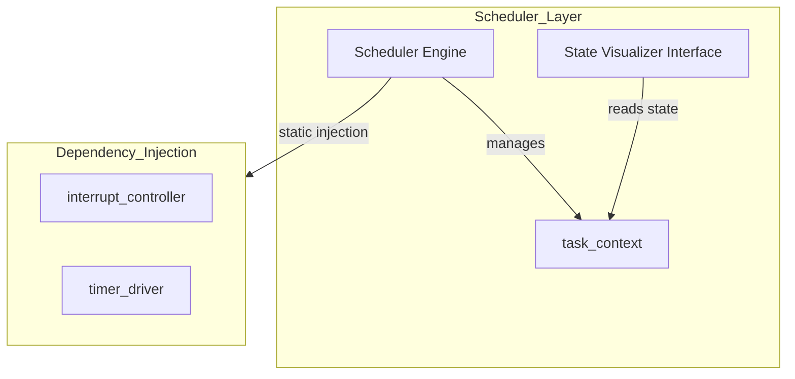
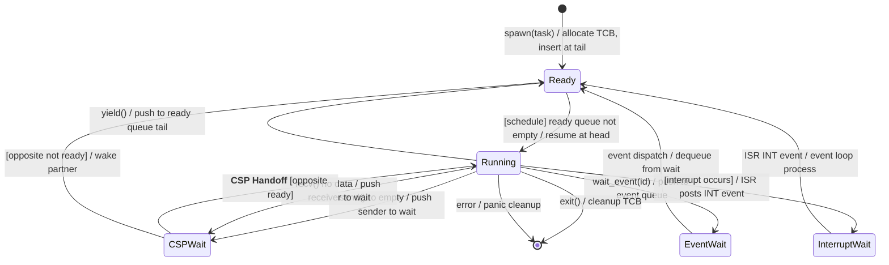

# COOS スケジューラ コンポーネント設計書 {VERIFY_FORMAL} {VERIFY_LLM}
<!-- evidence:
     formal: formal/coos_channel_model.py
     concept: concepts/scheduler_concept.py
-->

## 1. コンセプト
<!-- traceability: {CooperativeMultitasking} {GLOBAL_UseCpp23Library} {GLOBAL_UseCpp20Coroutine} {COOS_Deterministic} {CSPCommunication} {LowOverheadSwitch} -->
COOSスケジューラは、C++23コルーチン（および静的アロケーションを前提とした `fireball::flat_map_view`）を活用したスタックレスな協調型マルチタスクの核となるコンポーネントである。タスクの実行、一時停止(yield)、および割り込みによる再開を管理し、極小リソース環境での決定論的な実行を提供する。タスク間のメッセージパッシング（ゼロコピー）とスケジューラの連動によるコルーチンサスペンドにより、ホーアのCSPモデルを具現化する。コンテキストスイッチには C++20 コルーチンの**対称遷移（Symmetric Transfer）** を採用し、全汎用レジスタのメモリスタック退避・復帰を排除してフレームポインタとPCのみの交換に最小化することで、数サイクルでの極低オーバーヘッドなタスク遷移を達成する。 `{CooperativeMultitasking}` `{GLOBAL_UseCpp23Library}` `{GLOBAL_UseCpp20Coroutine}` `{COOS_Deterministic}` `{CSPCommunication}` `{LowOverheadSwitch}`

## 2. アーキテクチャ分類
<!-- traceability: {META_3TierSeparation} -->
本コンポーネントは **Tier 1 (主要システムコンポーネント: Primary Component)** に属する。コルーチンハンドルの管理とタスク実行順序の制御に特化した単一責務のモジュールとして設計する。 `{META_3TierSeparation}`

## 3. 静的モデル

### 3.1 データ構造
<!-- traceability: {COOS_Transparent} -->
- **`Scheduler`**: タスクのREADYキュー管理、実行順序制御、およびコルーチン実行をカプセル化した主要クラス。各タスクの実行状態を外部から可視化・検査するための監査用インターフェイスを提供する。 `{COOS_Transparent}`
- **`task_context`**: 各タスクの実行状態（READY/BLOCKED/RUNNING等の待機状態）、スタック境界、コルーチンハンドルを集約したデータ構造。
- **`scheduler_config`**: 最大タスク数、タイムアウト閾値、および各タスクの割り当てリソース制限からなる不変の静的設定。 `{COOS_Transparent}`

### 3.2 内部ブロック図
<!-- traceability: {COOS_Transparent} -->


### 3.3 主要なデータ定義
<!-- traceability: {COOS_Transparent} -->

#### スケジューラクラス（Scheduler）
依存関係（割り込み制御等）とタスクキューをカプセル化する。

| 項目名 | 機能と役割 | 型分類 | サイズ・制約 |
| :--- | :--- | :--- | :--- |
| 割り込み制御機 | 物理ハードウェア（NVIC）の制御用 | 構造体への参照 | `interrupt_controller` |
| 実行可能列 | 次に実行すべきタスクのFIFO実行可能リング（侵入型循環リスト） | リスト構造 | `task_context` のリスト |
| 待機リスト | イベントや時間待ちを行っているタスクのリスト（侵入型） | リスト構造 | `task_context` のリスト |
| 現在のタスク | 現在CPUコアを占有しているタスク | 構造体への参照 | `task_context` (NULL許容) |
| 状態可視化API | 外部から全タスクの待機・実行状態を安全に監視するためのメソッド群。ロックフリーな読み取り専用構造（Double Buffering）を採用し、実行中タスクをブロックせずに O(1) で状態を即座に取得可能。 | 関数オブジェクト | `Scheduler::get_task_states` (読み取り専用) |

## 4. 動的モデル

### 4.1 アルゴリズム
<!-- traceability: {GLOBAL_IdleDetection} {GLOBAL_PeriodicTask} {GLOBAL_InterruptWakeup} -->
- **スケジューリング**: ラウンドロビン方式。
    - スケジューラ・コンテキスト内の「実行可能タスク列」を固定長リングキューで管理し、定数時間 $O(1)$ でのタスク切り替えを実現する。
- **アイドル状態の検知**: 全ての管理タスクが「待機状態（BLOCKED）」となった場合にアイドル・ハンドラ（Periodic Task等）を実行する。 `{GLOBAL_IdleDetection}` `{GLOBAL_PeriodicTask}`
- **割り込み処理**: HALからの割り込み通知（`notify_interrupt(irq_id)`）を受信し、INTイベントキューから回収して対象タスクを READY キュー末尾に追加する。 `{GLOBAL_InterruptWakeup}`

#### スケジューラ フルセット・コンセプトコード (`concepts/scheduler_concept.py`)
```python
class TaskState:
    READY = "READY"
    RUNNING = "RUNNING"
    BLOCKED = "BLOCKED"
    TERMINATED = "TERMINATED"


class RoundRobinScheduler:
    def __init__(self, max_tasks: int = 16):
        self.max_tasks = max_tasks
        self.tasks = {}
        self.ready_ring = []
        self.current_task = None
        self.total_dispatches = 0

    def spawn(self, task_id: str, coroutine, priority: int = 0) -> bool:
        """Register a new task into the fixed task table and ready ring."""
        assert len(self.tasks) < self.max_tasks, "Max task capacity exceeded"
        assert task_id not in self.tasks, f"Task {task_id} already exists"

        self.tasks[task_id] = {
            "id": task_id,
            "coro": coroutine,
            "state": TaskState.READY,
            "priority": priority,
            "dispatches": 0,
        }
        self.ready_ring.append(task_id)
        return True

    def schedule_next(self) -> str | None:
        """Selects the next task in O(1) from the ready ring."""
        if not self.ready_ring:
            return None

        task_id = self.ready_ring.pop(0)
        self.current_task = task_id
        task_entry = self.tasks[task_id]
        task_entry["state"] = TaskState.RUNNING
        task_entry["dispatches"] += 1
        self.total_dispatches += 1
        return task_id

    def yield_current(self):
        """Cooperative yield: move current task to the tail of the ready ring."""
        assert self.current_task is not None, "No active task to yield"
        task_id = self.current_task
        task_entry = self.tasks[task_id]
        task_entry["state"] = TaskState.READY
        self.ready_ring.append(task_id)
        self.current_task = None

    def block_current(self, reason: str = "WAIT"):
        """Block current task on event/IPC: removed from ready ring."""
        assert self.current_task is not None, "No active task to block"
        task_id = self.current_task
        task_entry = self.tasks[task_id]
        task_entry["state"] = TaskState.BLOCKED
        task_entry["block_reason"] = reason
        self.current_task = None

    def unblock_task(self, task_id: str):
        """Unblock task on event arrival: append to ready ring."""
        assert task_id in self.tasks, f"Unknown task {task_id}"
        task_entry = self.tasks[task_id]
        if task_entry["state"] == TaskState.BLOCKED:
            task_entry["state"] = TaskState.READY
            task_entry["block_reason"] = None
            self.ready_ring.append(task_id)

    def run_cycle(self) -> bool:
        """Dispatches and advances one active task in deterministic O(1)."""
        task_id = self.schedule_next()
        if task_id is None:
            return False  # All tasks blocked or completed

        task_entry = self.tasks[task_id]
        try:
            action = task_entry["coro"].send(None)
            if action == "YIELD":
                self.yield_current()
            elif action == "BLOCK":
                self.block_current()
        except StopIteration:
            self.tasks[task_id]["state"] = TaskState.TERMINATED
            self.current_task = None

        return True
```

### 4.2 状態遷移図 (SysML SMD: Scheduler 視点)
<!-- traceability: {GLOBAL_IdleDetection} {GLOBAL_PeriodicTask} {GLOBAL_InterruptWakeup} -->

スケジューラが管理するタスク状態とイベント駆動の遷移ロジックを以下に示す。



**状態遷移の詳細:**

| 遷移 | トリガー | 条件 | アクション | 次状態 |
| :--- | :--- | :--- | :--- | :--- |
| init → READY | spawn(task) | 静的TCBスロットの空きあり | 静的プールからTCBを割り当て、タスクコンテキスト初期化 | READY |
| READY → RUNNING | schedule() | READYキュー非空 | `head_task.resume()` 直接呼び出し | RUNNING |
| RUNNING → CSP_WAIT | send(ch) | 受信側未待機 (`{ADR_RendezvousChannel}`) | 送信側としてチャネルスロットに登録しサスペンド、実行権をスケジューラに戻す | CSP_WAIT |
| RUNNING → CSP_WAIT | recv(ch) | 送信側未待機 (`{ADR_RendezvousChannel}`) | 受信側としてチャネルスロットに登録しサスペンド、実行権をスケジューラに戻す | CSP_WAIT |
| CSP_WAIT → RUNNING | **CSP Handoff** | 相手タスク待機中 (Rendezvous成立) | **対称遷移スイッチ: `await_suspend` から `opposite_task.coroutine_handle` 返却（スケジューラ迂回 $O(1)$ スイッチ）** `{CSP_Handoff}` | RUNNING |
| RUNNING → EVT_WAIT | wait_event(id) | (常に可) | イベントID登録、スケジューラに制御戻す | EVT_WAIT |
| EVT_WAIT → READY | event dispatch | イベント受信 | イベントループがタスクをREADYへ遷移 | READY |
| RUNNING → INT_WAIT | [ISR発生] | 割り込みハードウェア | ISRが INT イベントをキューに投入 | INT_WAIT |
| INT_WAIT → READY | event dispatch | INT イベント処理 | イベントループが対象タスクをREADYへ遷移 | READY |
| RUNNING → [*] | exit() / error | (常に可) | TCBスロットの返却（再利用化）、静的メモリパーティション回収 | [*] |

**注記:**
- 割り込みハンドラ（ISR）は直接タスク状態を変更しない。代わりに INT イベントをイベントキューに投入する。
- **CSP Handoff の特徴**: スケジューラを介さず、C++20 コルーチンの対称遷移（Symmetric Transfer）によりコールスタックを消費せずに相手タスクへ直接ジャンプする。超低レイテンシかつスタック深度 $O(1)$ を保証。

## 5. インターフェイス設計

### 5.1 公開API
外部から利用可能なオブジェクト指向APIを定義する。依存関係は `initialize` メソッドで注入する。

#### 初期化 (`init-scheduler`)

<!-- traceability: {ConceptHarnessDI} -->


| 項目 | 内容 | 型分類 |
| :--- | :--- | :--- |
| 機能概要 | C++20/23 Conceptsを用いたコンパイル時テンプレート解決により、スケジューラに必要な依存コンポーネント（メモリプール等）を静的に注入する。 | 操作定義 |
| シグネチャ | `template<coos::memory_manager M> void init_scheduler() noexcept` | 関数プロトタイプ |
| 戻り値 | なし (コンパイル時に依存型と解決が検証され、失敗時はビルドエラーとなる) | 結果型 |
| 事前条件 | 静的メモリ管理ユニット（M）が初期化済みであること。 | 条件 |
| 事後条件 | スケジューラがアイドル状態で起動する。 | 状態変化 |
| 不変条件 | シングルトンであり、実行時の再初期化は不可。 | 制約 |

#### タスク生成 (`spawn`)

<!-- traceability: {COOS_Scheduling_Refine} {Challenge_CoosBlockedList} -->


| 項目 | 内容 | 型分類 |
| :--- | :--- | :--- |
| 機能概要 | 新しいWASMタスクを生成し、実行可能キューの末尾に追加する。 | 操作定義 |
| シグネチャ | `auto spawn(const char* name, wasm_entry_t entry) -> result<os_task_id_t, os_result_t>` | 関数プロトタイプ |
| 引数 | - `name`: タスク名称。生存期間がプログラム起動から終了まで静的に保証されたヌル終端文字列（`const char*`）。動的ヒープ確保を避けるため、内部でのコピーは行わず、ポインタ参照のみを保持する。<br>- `entry`: WASMエントリポイントとなる関数ポインタ型 `wasm_entry_t`（C++での型エイリアス定義は `using wasm_entry_t = void(*)(void*);`。コルーチン生成時に初期コルーチンフレームの起動先として紐付けられる）。 | 引数定義 |
| 戻り値 | 成功時は静的に割り当てられたタスクIDである `os_task_id_t` を返し、失敗時はエラーコードを示す `os_result_t` （例：`ERR_NO_MEMORY` = TCBプール領域満杯でメモリ確保不可、`ERR_MAX_TASKS_REACHED` = 登録タスク数がシステム上限に到達、`ERR_INVALID_ARG` = 引数不正）を返す `result<os_task_id_t, os_result_t>` 型。動的ヒープ確保は一切行われず、静的メモリ内の固定長配列（`std::array<TCB, FB_CONF_MAX_TASKS>`）から空きスロットが割り当てられる。 | 結果型 |
| 事前条件 | スケジューラが初期化済みであること。管理タスク数上限（scheduler_config）に達していないこと。 | 条件 |
| 事後条件 | 新しいタスクが実行可能キューの末尾に追加される。 | 状態変化 |
| 不変条件 | 生成されたシステムタスクIDはシステム内で一意であること。 | 制約 |

#### タスク生成（spawn_task - ネイティブタスク用）
<!-- traceability: {CooperativeMultitasking} {GLOBAL_UseCpp20Coroutine} -->
既存のコルーチンオブジェクトを移動セマンティクスによって登録し、協調型マルチタスクとして動作させる。本APIは公開APIであり、`fireball` 名前空間の下に配置される。 `{CooperativeMultitasking}` `{GLOBAL_UseCpp20Coroutine}`

| 項目 | 内容 | 型分類 |
| :--- | :--- | :--- |
| 機能概要 | 既存のコルーチンオブジェクトからネイティブタスクを生成し、READY キューに追加する。 | 操作定義 |
| シグネチャ | `auto fireball::spawn_task(task&& t) -> result<os_task_id_t, os_result_t>` | 関数プロトタイプ |
| 引数 | `t`: 移動セマンティクスによるムーブ専用のコルーチンタスクオブジェクト。<br>※ 動的メモリ確保を完全に排除するため、`t` はコンパイル時コンセプト `is_heap_less<task>` を満たし、コルーチンフレームが静的領域（事前割り当てプール）に配置可能な静的レイアウトを持つ型でなければならない（`std::is_trivially_copyable` またはカスタムアロケータ要件に基づく）。 | 引数定義 |
| 戻り値 | 成功時は割り当てられたタスクID `os_task_id_t` を返し、失敗時はエラーコードを示す `os_result_t` （例：`ERR_MEM_FULL`, `ERR_INVALID_ARG`）を返す `result<os_task_id_t, os_result_t>` 型。 | 結果型 |
| 事前条件 | `t` が有効なコルーチンハンドルを保持していること。 | 条件 |
| 事後条件 | タスクが READY キューに追加される。 | 状態変化 |

#### 実行譲渡（yield）
<!-- traceability: {LowOverheadSwitch} -->
現在実行中のタスクを中断し、次のタスクへコンテキストを切り替える。C++20 コルーチンの対称遷移（Symmetric Transfer）により、全汎用レジスタ退避を伴わず数サイクルで高速遷移する。 `{LowOverheadSwitch}`

| 項目 | 内容 |
| :--- | :--- |
| 機能概要 | 現在のタスクを実行可能キュー末尾に移動し、READY 先頭のタスクへ極低オーバーヘッドでコンテキストを切り替える。 |
| シグネチャ | `yield() -> void` |
| 事前条件 | タスク実行コンテキスト内から呼び出されること（ISRからの呼び出し不可）。 |
| 事後条件 | 現在のタスクが READY キューの末尾に移動し、次タスクに切り替わる。 |

#### 実行（run）
<!-- traceability: {LowOverheadSwitch} -->
メインスケジューリングループを開始し、READY キューのタスクを順次ディスパッチする。 `{LowOverheadSwitch}`
| 事前条件 | `init-scheduler` が完了していること。 |
| 事後条件 | 通常、この関数は戻らない（電源断または致命的エラー時のみ）。 |

#### アイドルハンドラ設定（set_idle_handler）
| 項目 | 内容 |
| :--- | :--- |
| 機能概要 | READYキューが空になった際に呼び出されるアイドル時処理を登録する。 |
| シグネチャ | `set_idle_handler(handler: idle_handler) -> void` |
| 引数 | `handler`: 関数ポインタ (`void(*)()`) |

#### `notify-interrupt` (内部 API)
| 項目 | 内容 |
| :--- | :--- |
| 機能概要 | ハードウェア割り込みハンドラ（ISR）から呼び出され、Interrupt イベントをイベントキューに投入する。 |
| シグネチャ | `notify_interrupt(irq_id: uint32) -> void` |
| 引数 | `irq_id`: 発生した割り込みベクタ番号/IRQ ID |
| 事前条件 | ISR コンテキスト内からのみ呼び出されること。 |
| 事後条件 | Interrupt イベントがイベントキューに投入される。キュー満杯の場合はドロップされ、ドロップカウントがインクリメントされる。イベントループが Interrupt イベントを処理する際、irq_id に紐づく待機タスクは BLOCKED 状態から READY 状態へと遷移し、READYキューの末尾に挿入される。スケジューラは純粋な協調型ラウンドロビン（FIFO順）でタスクを巡回し、実行中のタスクが自発的に `yield` した際に次のタスクが実行を開始する。 |
| 設計注記 | 割り込み通知はイベント化され、スケジューラのメインループで安全に処理される。ISR は軽量に、イベント投入とログ用カウンタの更新のみを行う。 |

#### タスク終了（terminate）
| 項目 | 内容 |
| :--- | :--- |
| 機能概要 | 指定したタスクを終了し、リソースを解放する。 |
| シグネチャ | `terminate(id: os-task-id) -> void` |
| 引数 | `id`: 終了対象のタスクID |
| 事前条件 | `id` が有効なタスクを指していること。 |
| 事後条件 | タスクに関連するメモリリソース（TCB等）が解放され、全キューから除外される。 |

## 6. 設計判断 (ADR)

### ADR-SCHED-001: 侵入型リストによる管理
<!-- traceability: {GLOBAL_Policy_Memory} -->
- **決定事項**: TCBの連結には `std::list` 等を避け、TCB自体に `next` ポインタを持たせる侵入型リストを採用する。
- **理由**: 動的メモリ確保を排除し、RAM 64KB環境での生存を確実にするため. `{GLOBAL_Policy_Memory}`

### ADR-SCHED-002: アルゴリズムの継続的改善と最適化
<!-- traceability: {COOS_Scheduling_Refine} -->
- **決定事項**: 協調型マルチタスクスケジューラのコアアルゴリズムは、侵入型循環リストによる純粋な協調型ラウンドロビンとし、ステートレスなインターフェイス経由で分離することで、低オーバーヘッドかつ $O(1)$ なディスパッチ性能を保証する。 `{COOS_Scheduling_Refine}`
- **理由**: RTOS ではないため不要な優先度制御によるオーバーヘッドや優先度逆転を根本排除し、公平で決定論的な協調マルチタスクを実現するため。

### ADR-SCHED-003: BLOCKEDタスクリストの管理コストとリアルタイム性
<!-- traceability: {Challenge_CoosBlockedList} -->
- **決定事項**: `BLOCKED` タスクリストの管理において、起床待ちタスクを線形スキャンして探索するのを防ぐため、イベントドリブンな起床キュー構造を採用する。これにより、タスク数が増加した場合でも、リアルタイムでのコンテキストスイッチ時間 (O(1)) を維持し、管理コストとリアルタイム性の最善のトレードオフを実現する。 `{Challenge_CoosBlockedList}`
- **理由**: 組み込み環境において、待ちタスクの定期的なポーリングはCPUサイクルを著しく浪費し、最悪応答時間を予測困難にする。イベント駆動による起床通知モデル（`notify_interrupt` 等）を組み合わせることで、リアルタイム応答保証とメモリ消費量の最小化を両立するため。
