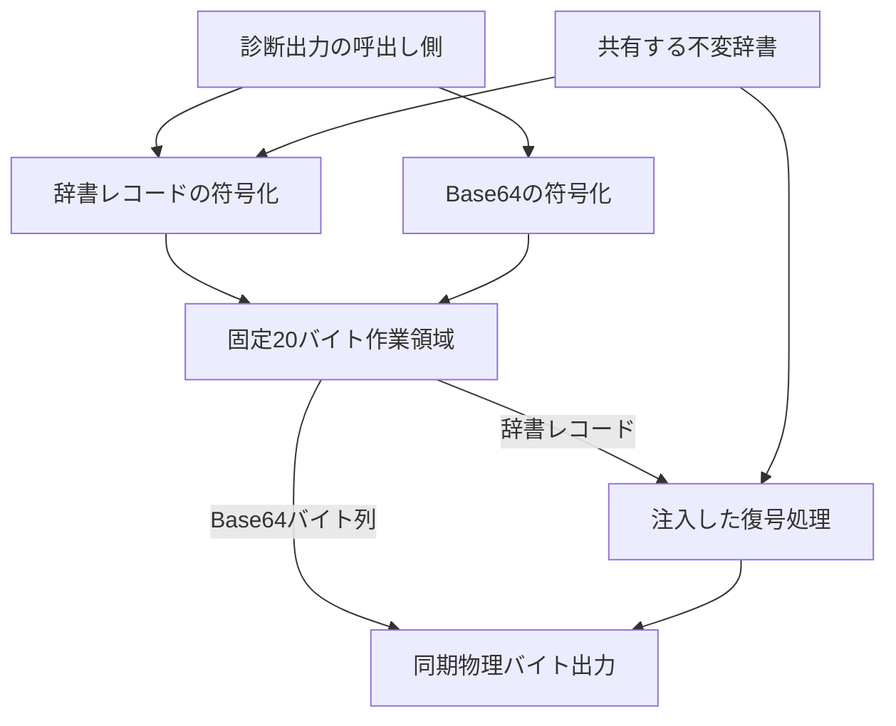
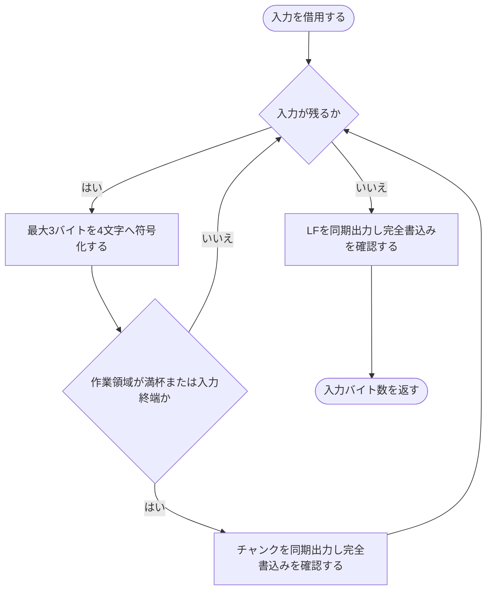
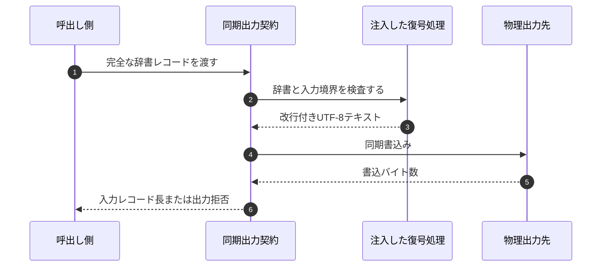

# printk 診断出力契約 {VERIFY_LLM}

<!-- evidence:
     contract-only: true
     implementation: experiments/pysim/tier1_core/printk.py
     implementation: experiments/pysim/native/tier1_core/printk/printk.hxx
     test: docs/qa/tier2_runtime/runtime_logging_test_spec.md
-->

## 1. コンセプト
<!-- traceability: {META_3TierSeparation} {BufferedLogging} -->

`printk`は、起動初期や障害時にも診断情報を同期出力するTier 1契約である。
COOS、IPC、Runtimeロガー、アイドルフック、動的メモリへ依存せず、物理出力先への同期書込みを提供する。
COOSとIPCの診断イベントは、利用側のログリングを通さず`write_event`から直接出力する。
利用側がログをバッファリングする場合も、物理出力には同じ契約を使う。

## 2. アーキテクチャ分類
<!-- traceability: {META_ContractImplSplit} -->

| 項目 | 内容 |
| :--- | :--- |
| Tier | Tier 1 Core |
| 役割 | 起動・障害診断に使う同期出力契約 |
| 依存先 | 構成時に注入する同期バイト出力と不変辞書。出力先と辞書は所有側が呼出し期間中保持する |
| 被依存側 | 診断出力または辞書レコード出力を必要とする利用側 |
| 正本 | 本書の同期出力・復号契約。実装と直接検証はevidenceのファイルへ結び付ける |

物理出力先の接続は、Tier 3 Platformのドライバが実装する。
利用側のスケジューリング、ログリング、計測状態の解釈を本契約へ持ち込まない。

## 3. 静的モデル

### 3.1 データ構造

printkイベントとTier 2ロガーからprintkへ渡す入力には、同じ辞書ID依存の可変長レコードを使う。物理出力は復号済みテキストとする。

| オフセット | フィールド | 符号化 |
| :--- | :--- | :--- |
| `0` | `level` | `u8` |
| `1..3` | `event_id` | `u24` little-endian |
| `4..7` | `arg0` | `u32` little-endian |
| `8..11` | `arg1` | `u32` little-endian |
| `12..15` | `arg2` | `u32` little-endian |
| `16..19` | `arg3` | `u32` little-endian |

レコード長は `4 + 4n` バイトとし、書式の数値指定子数 $n$（0〜4）をビルド時に確定する。表の引数フィールドは先頭 $n$ 個だけを転送する。引数数とレコード長のフィールドは送信しない。送受信側は同じIDと引数数の対応を共有する。Tier 1の送信側はTier 1辞書から生成した不変の引数数表を参照し、実行時に書式を走査しない。復号と拒否の契約は本書の動的モデルで定義する。

辞書の書式は、最大4個の`u32`引数を参照するprintfの数値部分集合に限る。
変換指定子は`d`、`i`、`o`、`u`、`x`、`X`とする。
フラグ`-+0 #`、数値で指定した幅、数字を伴う小数点精度を許可する。
`%%`は引数を消費しない。
`%s`、`%p`、`%c`、動的幅・精度、長さ修飾子、末尾の単独`%`、数字のない小数点精度、および4個を超える指定子は構成時に拒否する。

レコード内に文字列ポインタを含めない。printkは書込み時に静的辞書で復号し、`[LEVEL] message`に改行を付けたUTF-8テキストを物理出力先へ同期出力する。辞書は構成時に共有し、Tier 1からTier 2の実装へ依存しない。

### 3.2 内部ブロック図

符号化と復号は同一ビルドの辞書IDと引数数を共有する。辞書と作業領域を複製しない。

### 3.3 主要な構成要素と診断イベント

COOSとIPCは下表の異常系イベントのみを出力する。イベントIDと書式は [`printk.py`](experiments/pysim/tier1_core/printk.py) およびTier 3 Sinkと同期する。

| イベントID | 呼出し元 | レベル | 書式 | 引数 `arg0..arg3` |
| :--- | :--- | :--- | :--- | :--- |
| `0x0101` | COOS | `WARN` | `COOS: handoff limit reached (task=%d, count=%d)` | `task_id`, `handoff_count`, `0`, `0` |
| `0x0102` | COOS | `ERROR` | `COOS: task capacity exceeded (max=%d, attempted=%d)` | `max_tasks`, `attempted_count`, `0`, `0` |
| `0x0103` | COOS | `ERROR` | `COOS: duplicate task id rejected (task=%d)` | `task_id`, `0`, `0`, `0` |
| `0x0104` | COOS | `WARN` | `COOS: irq queue overflow dropped (vector=%d, dropped_total=%d)` | `vector_id`, `dropped_total`, `0`, `0` |
| `0x0201` | IPC | `WARN` | `IPC: rbac denied (sender_role=%d, target_role=%d)` | `sender_role`, `target_role`, `0`, `0` |
| `0x0202` | IPC | `WARN` | `IPC: unknown uri routing failed (uri_handle=%d)` | `uri_handle`, `0`, `0`, `0` |
| `0x0203` | IPC | `ERROR` | `IPC: message too large (kv_count=%d, max=%d)` | `kv_count`, `max_kv_pairs`, `0`, `0` |
| `0x0204` | IPC | `ERROR` | `IPC: invalid ownership state (current_state=%d, op=%d)` | `ownership_state`, `operation`, `0`, `0` |

## 4. 動的モデル

### 4.1 レコード復号と拒否

完全な1レコードを受け取り、辞書IDに対応する引数数から入力長を確認する。
レベル名と展開済みメッセージへ改行を付け、UTF-8テキストを同期出力する。
成功時は消費した入力レコードのバイト数を返す。出力先が受理しない場合は0を返す。
部分書込みは契約違反とする。pysimではassertで停止する。

辞書IDは`0..0xFFFFFF`、各引数は`u32`の範囲に限る。
未知ID、不正レベル、ヘッダ欠損、引数部欠損は契約違反として検出する。
pysimはこれらをassertで即時検出する。未知IDから次の境界を推測して復号を継続しない。
異なる引数数の辞書と旧20バイト固定形式は対象外である。

### 4.2 バイナリのBase64出力

バイナリ送信は`write_base64(data)`で明示する。辞書レコードとして解釈せず、標準Base64の`A..Z`、`a..z`、`0..9`、`+`、`/`を使って符号化する。末尾の不足バイトには`=`を付ける。符号化文字列の末尾にLFを1個付け、途中で改行しない。空データの出力はLFだけとする。

入力長を$n$バイトとすると、物理出力長は$4 \lceil n / 3 \rceil + 1$バイトとなる。入力は1次元の符号なしバイト列の借用ビューとする。入力は同期書込み中だけ借用し、辞書やリングバッファへ保存しない。作業領域は入力長によらず固定容量とし、診断レコード用の20バイト領域を再利用する。3入力バイトから4出力文字を生成し、領域が満杯になるか入力が終わった時点で同期書込みする。パディングは最終グループだけに付ける。

成功時は入力バイト数を返す。各チャンクと末尾LFの完全書込みを要求する。pysimでは出力拒否や部分書込みをassertで即時検出する。途中まで出力されたデータをロールバックせず、失敗後の自動再送を行わない。

### 4.3 状態と内部シーケンス

本契約はログ待ち状態やスケジューラ状態を持たないため、独立した状態機械は対象外である。
各呼出しは借用入力を同期処理し、完了するまでに入力参照を解放する。

## 5. インターフェース定義

### 5.1 公開API

| 操作 | 契約 |
| :--- | :--- |
| `write(data)` | 完全な1レコードを復号して物理出力へ書き込む。成功時は入力レコード長、出力拒否時は0を返す。辞書レコードの利用側はこの操作を使う。 |
| `write_base64(data)` | 任意のバイナリをBase64と末尾LFに変換して同期出力する。成功時は入力バイト数を返す。出力失敗はassertで停止する。 |
| `write_raw(data)` | ゲスト標準エラーの生バイトを同じ物理出力先へ書き込む。辞書復号や改行追加を行わず、書込バイト数を返す。 |
| `write_event(level, event, arg0..arg3)` | Tier 1診断イベントを辞書IDに対応する長さで同期出力する。リングバッファやSchedulerを介さない。 |

`write_event` は診断出力の失敗を処理継続条件にしない。出力先が利用できない場合も、元の状態遷移・拒否結果・契約アサーションを維持する。

PythonとC++は[`printk.hxx`](experiments/pysim/native/tier1_core/printk/printk.hxx)の同期バイト出力実装を共有する。イベントのレコード作成とBase64符号化はC++で行う。pysimの物理Sinkと辞書復号のアダプタはPythonで実装する。C++の任意計測構成は同じバイト出力へ`label=value`形式の64ビット数値を出力できる。計測状態の整形は計測を所有する側で行い、printkとPythonの物理Sinkは利用側固有の状態を解釈しない。

### 5.2 URI・IPC・WITインターフェース

URI、IPC、ゲスト公開WITは対象外である。同期バイト出力を構成時に注入する。

## 6. 制約達成の方策

### 6.1 性能制約と方策

スケジューラ、HAL、IPCを呼ばず、固定容量の同期処理で出力する。
実時間は物理出力先の書込み時間に依存する。サイクル数や応答期限は保証しない。

### 6.2 メモリ制約と方策

作業領域は20バイトの固定容量とし、診断イベントとBase64で共用する。
入力と辞書は呼出し期間だけ借用し、動的割当と入力長に比例する作業領域を持たない。

### 6.3 安全性・決定性制約と方策

復号前に辞書IDと入力境界を検査し、出力失敗後に自動再送しない。
診断出力の失敗で元の拒否結果や契約アサーションを変更しない。

## 7. 形式検証・テスト仕様との対応

### 7.1 検証対象の不変条件

辞書に従うレコード長、未知ID・欠損入力の拒否、復号済み物理出力を直接検証する。
Base64は既知入力の出力、借用範囲、20バイト上限、完全書込み、末尾LFを直接検証する。

### 7.2 検証モデルと反証可能性

契約のみのコンポーネントであり、独立コンセプト層と形式モデルは対象外である。
この選択は検証因子・成果物マトリクスのprintk行に従う。
物理出力境界の状態とバイト列は、参照実装に対するテストで確認する。

### 7.3 テスト仕様書との連携

[`runtime_logging_test_spec.md`](docs/qa/tier2_runtime/runtime_logging_test_spec.md)のTEST-LOG-14、17、18へ結び付ける。
実行テストは[`test_logging.py`](experiments/pysim/qa/tier2_runtime/test_logging.py)である。
この共有テスト仕様へのリンクは検証証拠であり、Tier 2ロガーへ動作契約を委譲するものではない。

### 7.4 既知の制限・対象外

ARMv8-Mの物理出力デバイス、実機レイテンシ、マルチコア同時呼出しは未検証である。
利用側のログ保持・アイドルフラッシュ・欠落方針は本契約の対象外である。

## 8. 設計判断と参考実装

同期出力をスケジューラから独立させ、起動初期と障害時にも同じ契約を使う。
参照実装はevidenceのPythonアダプタとC++同期バイト出力を用いる。
辞書と復号処理を構成時に共有し、出力経路ごとに辞書を複製しない。
