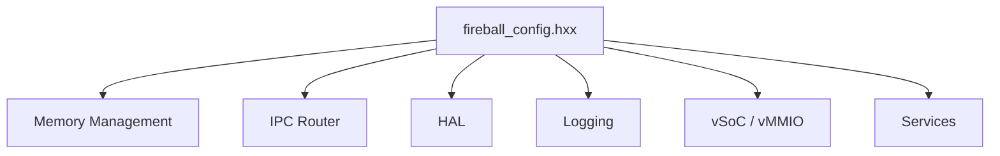

# システムコンフィグ コンポーネント設計書 {VERIFY_LLM}
<!-- evidence:
     test: tests/system_config_test_spec.md
-->

## 1. コンセプト
<!-- traceability: {META_ConfigurableSystem} {META_Static_Resolution} {GLOBAL_IndependentHeap} {GLOBAL_StrictMemoryLimit} {ConsolidatedHeap} {GLOBAL_StaticScalability} {RoleBasedAccessControl} {FastAddressCheck} {vMMIO_Isolation} {META_RestrictedPhysicalAccess} {BufferedLogging} {Challenge_DebuggerResource} {ZeroRuntimeOverhead} -->
Fireballハイパーバイザは、リソース制約の厳しい組み込み環境で動作するため、メモリサイズや最大リソース数をコンパイル時に固定する設計を採用する。設定はヘッダファイル形式のコンフィグファイル（`inc/fireball_config.hxx`）内のマクロ定義および `constexpr` 定数によって行われ、実行時オーバーヘッドを完全に排除する（ゼロコスト抽象化）。 `{META_ConfigurableSystem}` `{META_Static_Resolution}` `{ZeroRuntimeOverhead}`

## 2. アーキテクチャ分類
<!-- traceability: {META_3TierSeparation} {META_Static_Resolution} -->
本コンポーネントは **Tier 1 (主要システムコンポーネント: Primary Component)** に属し、システム全体の静的構成方針、メモリパーティション配分、および各サブシステムの設定定数を統括・提供する。 `{META_3TierSeparation}` `{META_Static_Resolution}`

## 3. 静的モデル

### 3.1 データ構造
<!-- traceability: {Resource_Estimation_Model} -->
コンフィグ項目は、実行時のオーバーヘッドを排除するため、主にプリプロセッサマクロおよび C++ `constexpr` 定数として定義される。設計段階でリソース使用量を概算し、制約適合性を検証するためのモデルを提供する。 `{Resource_Estimation_Model}`

### 3.2 内部ブロック図
<!-- traceability: {Resource_Estimation_Model} -->


### 3.3 コンフィグマクロ一覧・定義

#### 3.3.1 メモリ管理
<!-- traceability: {GLOBAL_IndependentHeap} {GLOBAL_StrictMemoryLimit} {ConsolidatedHeap} {ContextPointerRegister} {GLOBAL_StaticScalability} {IPC_ZeroCopy} -->
デフォルト値は **評価ターゲットである最小構成（RAM 32KB）** の予算配分に対応する。

| マクロ名 | 説明 | デフォルト値 | 導出元 |
| :--- | :--- | :--- | :--- |
| `FB_CONF_TASK_HEAP_SIZE` | 各VM/タスクに対してコンパイル時に固定された独立静的プールサイズ | `4096` | `{GLOBAL_IndependentHeap}` `{GLOBAL_StrictMemoryLimit}` |
| `FB_CONF_RUNTIME_HEAP_SIZE` | ホスト（WASMランタイム）実行専用の独立静的プールサイズ | `2048` | `{GLOBAL_IndependentHeap}` `{GLOBAL_StrictMemoryLimit}` |
| `FB_CONF_KERNEL_HEAP_SIZE` | COOSカーネル（スケジューラ、CSP、TCB、共有メモリ）用静的プールサイズ | `4096` | `{GLOBAL_IndependentHeap}` `{GLOBAL_StrictMemoryLimit}` |
| `FB_CONF_SUBSYS_HEAP_SIZE` | IPCルータ・HAL・ログバッファ用静的プールサイズ | `3072` | `{GLOBAL_IndependentHeap}` `{GLOBAL_StrictMemoryLimit}` |
| `FB_CONF_INTERP_STACK_SIZE` | インタープリタ統合スタック（`execution_context` + フレーム/オペランド）総容量 | `2048` | `{ContextPointerRegister}` `{GLOBAL_StrictMemoryLimit}` |
| `FB_CONF_JIT_CACHE_SIZE` | JITコードキャッシュ（2KB x 3面、統合プールからの割り当て） | `6144` | `{JIT_MultiBuffer_Cache}` `{GLOBAL_StrictMemoryLimit}` |
| `FB_CONF_MAX_GUEST_VMS` | 同時にロード可能なゲストVMの最大数 | `1` | `{GLOBAL_IndependentHeap}` `{GLOBAL_StaticScalability}` |
| `FB_CONF_SHM_SIZE` | ゼロコピーIPCで使用する静的共有メモリの総バイト数（カーネル用プールの内数） | `1024` | `{IPC_ZeroCopy}` `{GLOBAL_StrictMemoryLimit}` |
| `FB_CONF_MEMORY_POOL_SIZE` | 全パーティションを切り出す統合物理プールの総サイズ | `21504` | `{ConsolidatedHeap}` `{GLOBAL_StrictMemoryLimit}` |
| `FB_CONF_PHYSICAL_RAM_SIZE` | ターゲットの物理SRAM容量（最小構成 32KB / 想定構成 64KB） | `32768` | `{GLOBAL_StrictMemoryLimit}` |

##### メモリ総量と個別プールの依存関係
統合物理プール（`FB_CONF_MEMORY_POOL_SIZE` = 21,504 Bytes）は、以下の静的パーティションの総和として完全に一致する：
- カーネルプール (`FB_CONF_KERNEL_HEAP_SIZE`): 4,096 Bytes（共有メモリ `FB_CONF_SHM_SIZE` 1,024 Bytes を内包）
- ランタイムプール (`FB_CONF_RUNTIME_HEAP_SIZE`): 2,048 Bytes
- サブシステムプール (`FB_CONF_SUBSYS_HEAP_SIZE`): 3,072 Bytes
- JITコードキャッシュ (`FB_CONF_JIT_CACHE_SIZE`): 6,144 Bytes (2KB × 3面)
- インタープリタ統合スタック (`FB_CONF_INTERP_STACK_SIZE`): 2,048 Bytes
- ゲストタスクRAM (`FB_CONF_TASK_HEAP_SIZE` × `FB_CONF_MAX_GUEST_VMS`): 4,096 Bytes × 1 = 4,096 Bytes
- **合計**: 4,096 + 2,048 + 3,072 + 6,144 + 2,048 + 4,096 = **21,504 Bytes**

```text
static_assert(FB_CONF_KERNEL_HEAP_SIZE
            + FB_CONF_RUNTIME_HEAP_SIZE
            + FB_CONF_SUBSYS_HEAP_SIZE
            + FB_CONF_JIT_CACHE_SIZE
            + FB_CONF_INTERP_STACK_SIZE
            + FB_CONF_TASK_HEAP_SIZE * FB_CONF_MAX_GUEST_VMS
            == FB_CONF_MEMORY_POOL_SIZE);
static_assert(FB_CONF_MEMORY_POOL_SIZE <= FB_CONF_PHYSICAL_RAM_SIZE);
static_assert(FB_CONF_GUEST_RAM_SIZE == FB_CONF_TASK_HEAP_SIZE);
```

#### 3.3.2 IPCルータ
<!-- traceability: {META_ConfigurableSystem} {IPC_ZeroCopy} -->
| マクロ名 | 説明 | デフォルト値 | 導出元 |
| :--- | :--- | :--- | :--- |
| `FB_CONF_IPC_MAX_SERVICES` | 登録可能な最大サービス数 | `16` | `{META_ConfigurableSystem}` |
| `FB_CONF_IPC_MAX_QUEUED_MESSAGES` | 単一チャネルあたりの最大キューイングメッセージ数 | `8` | `{META_ConfigurableSystem}` |
| `FB_CONF_MAX_CONSECUTIVE_HANDOFFS` | スケジューラ復帰なしでの最大連続CSPハンドオフ回数 | `4` | `{Challenge_CspHandoffStarvation}` |

```cpp
namespace fireball::config {
    // ロール定義
    enum class router_role : uint8_t {
        CLIENT_APP = 0,
        CORE_SERVICE = 1,
        PLATFORM_HAL = 2,
        DEBUGGER = 3,
        COUNT = 4
    };

    // ロール間通信許可マトリクス (4x4 static bool table)
    inline constexpr std::array<std::array<bool, 4>, 4> FB_CONF_ROUTER_ROLE_MATRIX {{
        // Target:  CLIENT_APP, CORE_SERVICE, PLATFORM_HAL, DEBUGGER
        /* CLIENT_APP   */ {false, true,  true,  false},
        /* CORE_SERVICE */ {false, false, true,  false},
        /* PLATFORM_HAL */ {false, false, false, false},
        /* DEBUGGER     */ {false, true,  true,  false},
    }};
}
```

#### 3.3.3 HAL
<!-- traceability: {META_ConfigurableSystem} -->
| マクロ名 | 説明 | デフォルト値 | 導出元 |
| :--- | :--- | :--- | :--- |
| `FB_CONF_HAL_MAX_DEVICES` | 管理可能な最大デバイス数 | `8` | `{META_ConfigurableSystem}` |
| `FB_CONF_HAL_BUFFER_SIZE` | デバイス通信用バッファの最大サイズ (Bytes) | `256` | `{META_ConfigurableSystem}` |
| `FB_CONF_HAL_MAX_BUFFERS` | デバイス通信用バッファの最大数 | `4` | `{META_ConfigurableSystem}` |

#### 3.3.4 vSoC / vMMIO
<!-- traceability: {JIT_MultiBuffer_Cache} {FastAddressCheck} {GLOBAL_StrictMemoryLimit} {vMMIO_Isolation} {META_ConfigurableSystem} {META_RestrictedPhysicalAccess} {META_FlatMapIndexed} {GLOBAL_StaticScalability} -->
| マクロ名 | 説明 | デフォルト値 | 導出元 |
| :--- | :--- | :--- | :--- |
| `FB_CONF_JIT_ENABLED` | JITコンパイラ機能の有効化フラグ | `true` | `{META_ConfigurableSystem}` |
| `FB_CONF_WASM_PAGE_SIZE` | WASM標準論理ページサイズ (64KB, 65,536 Bytes) | `65536` | `{FastAddressCheck}` |
| `FB_CONF_MAX_WASM_PAGES` | システム物理予算上限としての最大WASMページ数（最小構成は1ページ/部分ページ） | `1` | `{GLOBAL_StrictMemoryLimit}` |
| `FB_CONF_JIT_CACHE_SIZE` | JITキャッシュサイズ (合計バイト数: 2KB x 3面) | `6144` | `{JIT_MultiBuffer_Cache}` |
| `FB_CONF_JIT_NUM_BUFFERS` | JITキャッシュバッファ面数 (3面) | `3` | `{JIT_MultiBuffer_Cache}` `{JIT_OldestOnly_Promote}` |
| `FB_CONF_JIT_MAX_INBOUND_CHAINS_PER_BANK` | 単一キャッシュバンクの最大被チェインエントリ数 | `32` | `{JIT_LazyChaining}` `{META_ConfigurableSystem}` |
| `FB_CONF_JIT_CARD_SHIFT` | JITカードテーブルのビットシフト数（関数ごと、8バイト単位 = 3） | `3` | `{META_ConfigurableSystem}` |
| `FB_CONF_JIT_ENTRY_GROUP_SHIFT` | JITエントリテーブルの粗粒度グループシフト数（64バイト単位 = 6） | `6` | `{META_ConfigurableSystem}` |
| `FB_CONF_GUEST_RAM_BASE` | ゲストRAMの開始アドレス（64KB境界配置） | `0x00000000` | `{FastAddressCheck}` |
| `FB_CONF_GUEST_RAM_SIZE` | ゲストRAMの物理割り当てサイズ（`FB_CONF_TASK_HEAP_SIZE` と同値、4KB部分ページ） | `4096` | `{GLOBAL_StrictMemoryLimit}` `{FastAddressCheck}` |
| `FB_CONF_VMMIO_BASE` | vMMIO領域の開始アドレス (Bit 31 == 1) | `0x80000000` | `{vMMIO_Isolation}` |
| `FB_CONF_VSOC_PASSTHROUGH_BASE` | ゲスト仮想PASSTHROUGH領域（FC=15）のホスト実ペリフェラル基底アドレス | `0x40000000` | `{META_RestrictedPhysicalAccess}` |
| `FB_CONF_VMMIO_MAX_REGIONS` | 登録可能な最大vMMIO領域数 | `8` | `{META_ConfigurableSystem}` |
| `FB_CONF_VMMIO_MAX_PTES` | FlatMap ページテーブルに保持可能な PTE の最大件数 | `32` | `{META_FlatMapIndexed}` `{GLOBAL_StaticScalability}` |
| `FB_CONF_VMMIO_ALLOWED_ADDRS` | ゲストからのアクセスを許可する物理アドレス範囲 | `constexpr`構造体配列 | `{META_RestrictedPhysicalAccess}` |

#### 3.3.5 ロギング・デバッガ
<!-- traceability: {BufferedLogging} {Challenge_DebuggerResource} -->
| マクロ名 | 説明 | デフォルト値 | 導出元 |
| :--- | :--- | :--- | :--- |
| `FB_CONF_LOG_BUFFER_SIZE` | ログメッセージ保持用のバッファサイズ (Bytes) | `512` | `{BufferedLogging}` |
| `FB_CONF_DEBUG_MAX_BREAKPOINTS` | 最大ブレークポイント数 | `8` | `{META_ConfigurableSystem}` |
| `FB_CONF_DEBUG_PACKET_SIZE` | RSPパケットバッファサイズ | `1024` | `{Challenge_DebuggerResource}` |

#### 3.3.6 タスクID型・予約値
<!-- traceability: {GLOBAL_StaticScalability} -->
| マクロ名 | 説明 | 値 | 備考 |
| :--- | :--- | :--- | :--- |
| `FB_TASK_ID_T` | タスクIDの基底型 | `uint8_t` | 有効値域 `1`〜`FB_CONF_MAX_TASKS` |
| `FB_TASK_ID_INVALID` | 未割り当て・無効を示す予約値 | `0` | 初期値。「誰も所有していない」を表す |
| `FB_TASK_ID_FLIGHT` | 所有権移譲中を示す予約値 (FLIGHT_SENTINEL) | `0xFF` | IPCルータ移譲中にセット |
| `FB_CONF_MAX_TASKS` | 同時実行可能な最大タスク数 | `16` | `≤ 254`（`FB_TASK_ID_FLIGHT` との衝突防止） |

```python
# コンパイル時検証
assert FB_CONF_MAX_TASKS <= 254, "FB_CONF_MAX_TASKS must be <= 254"
```

#### 3.3.7 リカバリー戦略
<!-- traceability: {META_RecoveryStrategy} {Errorcode_To_Strategy} -->
| マクロ名 | 説明 | デフォルト値 | 導出元 |
| :--- | :--- | :--- | :--- |
| `FB_CONF_RETRY_BACKOFF_MS` | `retry` 戦略の再試行間ウェイト（ミリ秒） | `10` | `{META_RecoveryStrategy}` |

`retry` の上限回数（3回、`{META_RecoveryStrategy}` の不変条件）とあわせ、`{META_RecoveryStrategy}` を実装するすべてのコンポーネントはこの2値を共有する。個別のコンポーネント文書で異なる待機時間・回数を独自に定義しないこと。

## 4. 動的モデル

### 4.1 アルゴリズム
<!-- traceability: {META_Static_Resolution} -->
本コンポーネントは静的な定義のみを提供し、すべての値はコンパイル時に確定する。 `{META_Static_Resolution}`

## 5. 制約達成の方策

### 5.1 性能・メモリ制約と方策
<!-- traceability: {META_Static_Resolution} {META_ConfigurableSystem} {GLOBAL_StaticScalability} -->
- **方策**: `{META_Static_Resolution}` `{META_ConfigurableSystem}` `{GLOBAL_StaticScalability}` すべてのパラメータをコンパイル時定数（`constexpr` / マクロ）とし、実行時の探索・計算コストおよび動的ヒープ（malloc/new）消費を完全排除する。

### 5.2 安全性制約と方策
<!-- traceability: {META_ConfigurableSystem} -->
- **方策**: `{META_ConfigurableSystem}` システム構成定数はすべて `constexpr` / `const` として ROM / Flash（`.rodata`）に静的配置され、実行時の不正な書き換えから保護される。

