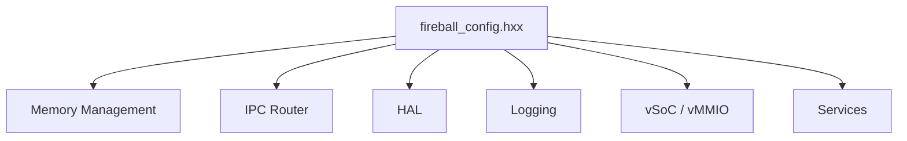

# システムコンフィグ コンポーネント設計書

## 1. コンセプト
<!-- traceability: {META_ConfigurableSystem} {META_Static_Resolution} -->
Fireballハイパーバイザは、リソース制約の厳しい組み込み環境で動作するため、メモリサイズや最大リソース数をコンパイル時に固定する設計を採用する。設定はヘッダファイル形式のコンフィグファイル（`inc/fireball_config.hxx`）内のマクロ定義および `constexpr` 定数によって行われる。 `{META_ConfigurableSystem}` `{META_Static_Resolution}`

## 2. アーキテクチャ分類
<!-- traceability: {META_3TierSeparation} {META_Static_Resolution} -->
本コンポーネントは **Tier 1 (主要システムコンポーネント: Primary Component)** に属し、システム全体の静的構成方針およびリソース概算モデルを統括する。具体的な定数・マクロパラメータの詳細は Tier 2 の `system_config_details.md` にデコンポジションされる。 `{META_3TierSeparation}` `{META_Static_Resolution}`

## 3. 静的モデル

### 3.1 データ構造
<!-- traceability: {Resource_Estimation_Model} -->
コンフィグ項目は、実行時のオーバーヘッドを排除するため、主にプリプロセッサマクロおよび C++ `constexpr` 定数として定義される。設計段階でリソース使用量を概算し、制約適合性を検証するためのモデルを提供する。 `{Resource_Estimation_Model}`

### 3.2 内部ブロック図
<!-- traceability: {Resource_Estimation_Model} -->


##### 静的リソース消費の概算モデル
<!-- traceability: {Resource_Estimation_Model} -->
コンパイル時に各マクロ定数から全体のメモリ（ROM/RAM）フットプリントが決定論的に算出され、ビルド時に以下の概算モデルに従って制約適合性が検証される。
* **RAM消費量 (概算値)**: `FB_CONF_MEMORY_POOL_SIZE`。その内訳は「メモリ総量と個別プールの依存関係」に示す `static_assert` を正本とする。ゲスト用プールに乗じるのは `FB_CONF_MAX_GUEST_VMS` であり `FB_CONF_MAX_TASKS` ではない（後者は TCB スロット数）。`FB_CONF_LOG_BUFFER_SIZE` と `FB_CONF_SHM_SIZE` はそれぞれサブシステム用・カーネル用プールの内数であり、別途加算しない。
* **適合性の静的アサート**: 上記総RAM消費量が、評価ターゲットである最小構成の物理SRAMサイズ `FB_CONF_PHYSICAL_RAM_SIZE`（32KB）以下であることを、コンパイル時に `static_assert` により検証しビルドを保護する。 `{META_ConfigurableSystem}` `{Resource_Estimation_Model}`

### 3.3 主要な構造体・クラス・定数
<!-- traceability: {Resource_Estimation_Model} -->
具体的なコンフィグマクロおよび定数の詳細一覧とアライメント要件については、[システムコンフィグマクロ一覧](system_config_details.md) を参照すること。主要パラメータは以下の制約・相互依存関係を持つ：
- **最大タスク数とID予約値の制約**: `FB_CONF_MAX_TASKS` の値は、予約済みの制御用Sentinel値である `FB_TASK_ID_FLIGHT=0xFF` や無効値 `FB_TASK_ID_INVALID=0` と重複しないよう、254 以下でなければならない。
- **メモリ総量と個別プールの依存関係**: ゲストVM個別の静的プール `FB_CONF_TASK_HEAP_SIZE` は `FB_CONF_MAX_GUEST_VMS` との積でRAM消費量を決める（`FB_CONF_MAX_TASKS` はTCBスロット数であり、この積には寄与しない）。これらのパラメータ変更時は、評価ターゲットである最小構成の SRAM 物理限界（32KB）を突破しない範囲で調整される必要があり、ビルド時に静的アサートにより自動検証される。検証される不等式は次のとおり:

```text
static_assert(FB_CONF_KERNEL_HEAP_SIZE
            + FB_CONF_RUNTIME_HEAP_SIZE
            + FB_CONF_SUBSYS_HEAP_SIZE
            + FB_CONF_JIT_CACHE_SIZE
            + FB_CONF_INTERP_STACK_SIZE
            + FB_CONF_TASK_HEAP_SIZE * FB_CONF_MAX_GUEST_VMS
            == FB_CONF_MEMORY_POOL_SIZE);
static_assert(FB_CONF_MEMORY_POOL_SIZE <= FB_CONF_PHYSICAL_RAM_SIZE);
```


##### 代表的な主要構成パラメータ

デフォルト値は評価ターゲットである最小構成（RAM 32KB）に対応する。**全マクロの網羅的な定義とデフォルト値は [`system_config_details.md`](system_config_details.md) を正本とし、本節はその抜粋である。**

* **`FB_CONF_MAX_TASKS`**: 静的に管理されるCOOSタスクの最大数（デフォルト値: 16、最大許容値: 254）。TCB スロットのみを消費し、ゲストリニアメモリは消費しない。
* **`FB_CONF_MAX_GUEST_VMS`**: 同時にロード可能なゲストVMの最大数（最小構成のデフォルト値: 1）。ゲスト用プールはVM単位で消費されるため、RAM消費量を決めるのはこの値である。
* **`FB_CONF_TASK_HEAP_SIZE`**: 各VMに個別に割り当てられる（共有されない）独立した静的メモリプールの容量（デフォルト値: 4096バイト、動的ヒープではない）。
* **`FB_CONF_RUNTIME_HEAP_SIZE`**: WASMホストランタイム用に割り当てられる静的メモリプールの容量（デフォルト値: 2048バイト、動的ヒープではない）。
* **`FB_CONF_LOG_BUFFER_SIZE`**: ログメッセージ保持用の循環バッファのサイズ（デフォルト値: 512バイト、動的メモリ確保を回避する固定バッファ）。サブシステム用プールの内数として配置される。
* **`FB_CONF_JIT_CACHE_SIZE`**: 生成されたネイティブコードを保存するための 3面キャッシュサイズ合計（デフォルト値: 6144バイト = 2KB x 3面）。
* **`FB_CONF_SHM_SIZE`**: ゼロコピーIPCデータ転送で使用される静的共有メモリの総バイト数（デフォルト値: 1024バイト）。カーネル用プールの内数として配置される。
* **`FB_CONF_VMMIO_MAX_REGIONS`**: 登録可能な最大仮想MMIO（vMMIO）領域数（デフォルト値: 8）。

各プールの容量マクロ（`FB_CONF_KERNEL_HEAP_SIZE`、`FB_CONF_SUBSYS_HEAP_SIZE`、`FB_CONF_INTERP_STACK_SIZE`、`FB_CONF_MEMORY_POOL_SIZE`）の値は [`system_config_details.md`](system_config_details.md) 2.1 を正本とし、本節では重複定義しない。


| 項目名 | 機能と役割 | 型分類 | サイズ・制約 |
| :--- | :--- | :--- | :--- |
| 最大管理タスク数 | システムが同時に保持可能なタスク制御ブロックの最大数 | エントリ数 | `FB_CONF_MAX_TASKS`（≤ 254。`FB_TASK_ID_FLIGHT=0xFF` との衝突を静的アサートで保証） |
| 共有メモリ容量 | タスク間共有やゼロコピー通信のために静的配置される共有領域の総バイト数 | バイト数 | `FB_CONF_SHM_SIZE` |
| JITキャッシュ容量 | 生成されたネイティブコードを保存するための静的メモリバッファサイズ | バイト数 | `FB_CONF_JIT_CACHE_SIZE` |
| タスクID型・予約値 | `task_id` の型定義と無効値・FLIGHT_SENTINEL 定義 | 型／定数 | `FB_TASK_ID_T`, `FB_TASK_ID_INVALID=0`, `FB_TASK_ID_FLIGHT=0xFF` |

## 4. 動的モデル

### 4.1 アルゴリズム
<!-- traceability: {META_Static_Resolution} -->
本コンポーネントは静的な定義のみを提供し、動的なアルゴリズムは持たない。すべての値はコンパイル時に確定する。 `{META_Static_Resolution}`

### 4.2 状態遷移図
<!-- traceability: {META_Static_Resolution} -->
静的構成のため、状態遷移は存在しない。

### 4.3 内部シーケンス
<!-- traceability: {META_Static_Resolution} -->
静的構成のため、内部シーケンスは存在しない。

## 5. インターフェイス定義

### 5.1 公開API
本コンポーネントは C++ ヘッダファイルとして不変な定数のみを提供する。振る舞いの契約 (Contract) としては以下の通り。


#### コンフィグ定数の参照

| 項目 | 内容 |
| :--- | :--- |
| 機能概要 | ビルド時に確定されたシステム構成値をプリプロセッサまたは定数として提供する。 |
| 識別子マクロ | 各種マクロ識別子 |
| 戻り値 | コンパイル時に即値として展開される。 |
| 補足 | すべてのコンポーネントは、サイズ指定等にこれらの定数を直接使用する。 |

### 5.2 URI/IPCインターフェイス
本コンポーネントはIPCインターフェイスを提供しない。

## 6. 制約達成の方策

### 6.1 性能制約と方策
<!-- traceability: {META_Static_Resolution} -->
- **目標**: 実行時のコンフィグ参照コストをゼロにする。
- **方策**: `{META_Static_Resolution}` すべての値をコンパイル時定数とし、実行時の探索や計算を排除する。

### 6.2 メモリ制約と方策
<!-- traceability: {META_ConfigurableSystem} {GLOBAL_StaticScalability} -->
- **目標**: コンフィグ保持のための動的メモリ消費をゼロにする。
- **方策**: `{META_ConfigurableSystem}` `{GLOBAL_StaticScalability}` 静的配列のサイズをコンパイル時に決定し、ヒープ消費を最小化する。

### 6.3 安全性制約と方策
<!-- traceability: {META_ConfigurableSystem} -->
- **目標**: 実行時におけるタスクや誤動作によるシステム構成値の不正な書き換えを防止する。
- **方策**: `{META_ConfigurableSystem}` システム構成定数はすべて `constexpr` / `const` として ROM / Flash（`.rodata` 読み取り専用セクション）に静的配置され、ソフトウェア実行時における誤書き込みや改ざんから確実に防護される。
