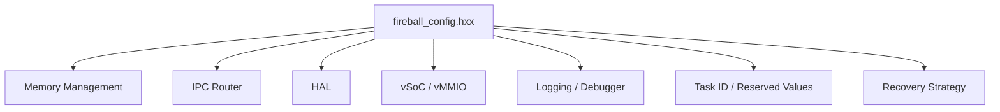

# システムコンフィグ コンポーネント設計書 {VERIFY_LLM}
<!-- evidence:
     test: tests/system_config_test_spec.md
-->

## 1. コンセプト
<!-- traceability: {META_ConfigurableSystem} {META_Static_Resolution} {GLOBAL_IndependentHeap} {GLOBAL_StrictMemoryLimit} {ConsolidatedHeap} {GLOBAL_StaticScalability} {RoleBasedAccessControl} {FastAddressCheck} {vMMIO_Isolation} {META_RestrictedPhysicalAccess} {BufferedLogging} {Challenge_DebuggerResource} {ZeroRuntimeOverhead} -->
Fireballハイパーバイザは、リソース制約の厳しい組み込み環境で動作するため、メモリサイズや最大リソース数をコンパイル時に固定する設計を採用する。設定はヘッダファイル形式のコンフィグファイル（`inc/fireball_config.hxx`）内のマクロ定義および `constexpr` 定数によって行われ、実行時オーバーヘッドを完全に排除する（ゼロコスト抽象化）。 `{META_ConfigurableSystem}` `{META_Static_Resolution}` `{ZeroRuntimeOverhead}`

## 2. アーキテクチャ分類
<!-- traceability: {META_3TierSeparation} {META_Static_Resolution} -->
本コンポーネントは **Tier 1 (主要システムコンポーネント: Primary Component)** に属し、システム全体の静的構成方針、メモリパーティション配分、および各サブシステムの設定定数を統括・提供する。 `{META_3TierSeparation}` `{META_Static_Resolution}`

## 3. 静的モデル

### 3.1 データ構造
<!-- traceability: {Resource_Estimation_Model} -->
コンフィグ項目は、実行時のオーバーヘッドを排除するため、主にプリプロセッサマクロおよび C++ `constexpr` 定数として定義される。設計段階でリソース使用量を概算し、制約適合性を検証するためのモデルを提供する。 `{Resource_Estimation_Model}`

### 3.2 内部ブロック図
<!-- traceability: {Resource_Estimation_Model} -->


### 3.3 コンフィグマクロ一覧・定義

#### 3.3.1 メモリ管理
<!-- traceability: {GLOBAL_IndependentHeap} {GLOBAL_StrictMemoryLimit} {ConsolidatedHeap} {ContextPointerRegister} {GLOBAL_StaticScalability} {IPC_ZeroCopy} -->
デフォルト値は **評価ターゲットである最小構成（RAM 32KB）** の予算配分に対応する。

| マクロ名 | 説明 | デフォルト値 | 導出元 |
| :--- | :--- | :--- | :--- |
| `FB_CONF_TASK_HEAP_SIZES` | ゲストVMスロットごとに個別設定するコンパイル時固定パーティションサイズのROM配列（要素数 `FB_CONF_MAX_GUEST_VMS`）。搭載予定WASMモジュールの規模に応じてスロットごとに異なる値を設定できる | `[4096]` | `{GLOBAL_IndependentHeap}` `{GLOBAL_StrictMemoryLimit}` |
| `FB_CONF_RUNTIME_HEAP_SIZE` | ホスト（WASMランタイム）実行専用の独立静的プールサイズ | `2048` | `{GLOBAL_IndependentHeap}` `{GLOBAL_StrictMemoryLimit}` |
| `FB_CONF_KERNEL_HEAP_SIZE` | COOSカーネル（スケジューラ、CSP、TCB、共有メモリ）用静的プールサイズ | `4096` | `{GLOBAL_IndependentHeap}` `{GLOBAL_StrictMemoryLimit}` |
| `FB_CONF_SUBSYS_HEAP_SIZE` | IPCルータ・HAL・ログバッファ用静的プールサイズ | `3072` | `{GLOBAL_IndependentHeap}` `{GLOBAL_StrictMemoryLimit}` |
| `FB_CONF_INTERP_STACK_SIZE` | インタープリタ統合スタック（`execution_context` + フレーム/オペランド）総容量 | `2048` | `{ContextPointerRegister}` `{GLOBAL_StrictMemoryLimit}` |
| `FB_CONF_JIT_CACHE_SIZE` | JITコードキャッシュ（2KB x 3面、統合プールからの割り当て） | `6144` | `{JIT_MultiBuffer_Cache}` `{GLOBAL_StrictMemoryLimit}` |
| `FB_CONF_MAX_GUEST_VMS` | 同時にロード可能なゲストVMの最大数 | `1` | `{GLOBAL_IndependentHeap}` `{GLOBAL_StaticScalability}` |
| `FB_CONF_SHM_SIZE` | ゼロコピーIPCで使用する静的共有メモリの総バイト数（カーネル用プールの内数） | `1024` | `{IPC_ZeroCopy}` `{GLOBAL_StrictMemoryLimit}` |
| `FB_CONF_MEMORY_POOL_SIZE` | 全パーティションを切り出す統合物理プールの総サイズ | `21504` | `{ConsolidatedHeap}` `{GLOBAL_StrictMemoryLimit}` |
| `FB_CONF_PHYSICAL_RAM_SIZE` | ターゲットの物理SRAM容量（最小構成 32KB / 想定構成 64KB） | `32768` | `{GLOBAL_StrictMemoryLimit}` |

##### メモリ総量と個別プールの依存関係
統合物理プール（`FB_CONF_MEMORY_POOL_SIZE` = 21,504 Bytes）は、以下の静的パーティションの総和として完全に一致する：
- カーネルプール (`FB_CONF_KERNEL_HEAP_SIZE`): 4,096 Bytes（共有メモリ `FB_CONF_SHM_SIZE` 1,024 Bytes を内包）
- ランタイムプール (`FB_CONF_RUNTIME_HEAP_SIZE`): 2,048 Bytes
- サブシステムプール (`FB_CONF_SUBSYS_HEAP_SIZE`): 3,072 Bytes
- JITコードキャッシュ (`FB_CONF_JIT_CACHE_SIZE`): 6,144 Bytes (2KB × 3面)
- インタープリタ統合スタック (`FB_CONF_INTERP_STACK_SIZE`): 2,048 Bytes
- ゲストタスクRAM (`sum(FB_CONF_TASK_HEAP_SIZES)`、スロット別ROM配列の総和): `[4096]` の総和 = 4,096 Bytes
- **合計**: 4,096 + 2,048 + 3,072 + 6,144 + 2,048 + 4,096 = **21,504 Bytes**

```text
static_assert(FB_CONF_KERNEL_HEAP_SIZE
            + FB_CONF_RUNTIME_HEAP_SIZE
            + FB_CONF_SUBSYS_HEAP_SIZE
            + FB_CONF_JIT_CACHE_SIZE
            + FB_CONF_INTERP_STACK_SIZE
            + sum(FB_CONF_TASK_HEAP_SIZES)
            == FB_CONF_MEMORY_POOL_SIZE);
static_assert(FB_CONF_TASK_HEAP_SIZES.size() == FB_CONF_MAX_GUEST_VMS);
static_assert(FB_CONF_MEMORY_POOL_SIZE <= FB_CONF_PHYSICAL_RAM_SIZE);
static_assert(FB_CONF_GUEST_RAM_SIZE == FB_CONF_TASK_HEAP_SIZES[0]);
```
各ゲストVMスロット `i` の実際の物理配置（領域）は、`FB_CONF_GUEST_RAM_BASE` を起点に先行スロットのサイズを累積したオフセット（`sum(FB_CONF_TASK_HEAP_SIZES[0..i))`）に配置される。スロットの基点アドレスを個別に設定するコンフィグ項目は持たず、サイズ配列のみから一意に導出することで、パーティション間の重複を静的に排除する。

##### PMSAv8 MPU 物理アドレスマップ
<!-- traceability: {META_FaultIsolation} {WasmPageAlignment} -->
以下は [`runtime_memory.md`](docs/components/tier2_runtime/runtime_memory.md) §7.1 の PMSAv8 MPU 8リージョン配分（`PMSAv8MPU`）が用いる静的ベースアドレスの正本である。Cortex-M33 の一般的な SRAM 配置慣行（`0x2000_0000` 起点）・ペリフェラル配置慣行（`0x4000_0000` 起点）に従う**想定実機ターゲットのアドレスマップ**であり、上記「メモリ総量」節が定義する評価用最小構成（`FB_CONF_MEMORY_POOL_SIZE` = 21,504 Bytes）とは異なるスケールを表す（実機の物理 SRAM 総容量は本表のリージョン間隔を確保できる規模を想定し、評価用最小構成はその一部を静的に占有するに過ぎない）。

| マクロ名 | 対象リージョン | 値 | 導出元 |
| :--- | :--- | :--- | :--- |
| `FB_CONF_MPU_R1_KERNEL_DATA_BASE` | Region 1: Kernel Data & BSS | `0x2000_0000` | Cortex-M33 SRAM 起点慣行 |
| `FB_CONF_MPU_R2_KERNEL_POOL_BASE` | Region 2: Kernel Pool / Heap (`system_allocator`) | `0x2000_8000` | `{System_Allocator}` |
| `FB_CONF_MPU_R4_JIT_CACHE_BASE` | Region 4: JIT Code Cache | `0x2004_0000` | `{JIT_MultiBuffer_Cache}` |
| `FB_CONF_MPU_R5_PERIPHERAL_MMIO_BASE` | Region 5: Peripheral MMIO | `0x4000_0000` | Cortex-M33 ペリフェラル起点慣行（`FB_CONF_VSOC_PASSTHROUGH_BASE`と同一値） |
| `FB_CONF_MPU_R6_SHARED_MEMORY_BASE` | Region 6: Shared Memory Buffers (`shm_allocator`) | `0x2008_0000` | `{Shm_Allocator}` |
| `FB_CONF_MPU_R7_STACK_GUARD_BASE` | Region 7: Stack Guard Band | `0x200C_0000` | スタックオーバーフロー検出用ガードバンド |

Region 0（Flash/Kernel Code, `0x0000_0000`）・Region 3（Guest WASM RAM, `pool_base` 実行時決定）は上記表に含まれない（それぞれ ROM 起点・`init_manager`の実行時引数のため）。

#### 3.3.2 IPCルータ
<!-- traceability: {META_ConfigurableSystem} {IPC_ZeroCopy} -->
| マクロ名 | 説明 | デフォルト値 | 導出元 |
| :--- | :--- | :--- | :--- |
| `FB_CONF_IPC_MAX_SERVICES` | 登録可能な最大サービス数 | `16` | `{META_ConfigurableSystem}` |
| `FB_CONF_ROUTER_MAX_KV_PAIRS` | 1メッセージが保持できるkv_pairの最大数（[`ipc_router.md`](docs/components/tier1_interface/ipc_router.md) の {IPC_ZeroCopy}） | `8` | {META_ConfigurableSystem} |
| `FB_CONF_MAX_CONSECUTIVE_HANDOFFS` | スケジューラ復帰なしでの最大連続CSPハンドオフ回数 | `4` | `{Challenge_CspHandoffStarvation}` |

```cpp
namespace fireball::config {
    // ロール定義: HAL_* の各ロールはデバイス/サービスインスタンス 1 つに専用のロール
    // （＝専用チャネル）を割り当てる。「1 チャネル 1 待機者」制約下で複数の同種デバイス
    // インスタンス（例: 物理UARTと、それとは別に登録されるコンソール出力ストリーム）を
    // 区別するために必要である（{ADR_RendezvousChannel}）。
    enum class router_role : uint8_t {
        RUNTIME = 0,
        CORE_SERVICE = 1,
        HAL_UART = 2,
        HAL_STDOUT = 3,
        HAL_GPIO = 4,
        HAL_TIMER = 5,
        HAL_I2C = 6,
        HAL_SPI = 7,
        DEBUGGER = 8,
        COUNT = 9
    };

    // ロール間通信許可マトリクス (9x9 static bool table)
    inline constexpr std::array<std::array<bool, 9>, 9> FB_CONF_ROUTER_ROLE_MATRIX {{
        // Target:            RUNTIME, CORE_SERVICE, HAL_UART, HAL_STDOUT, HAL_GPIO, HAL_TIMER, HAL_I2C, HAL_SPI, DEBUGGER
        /* RUNTIME         */ {false,  true,         true,     true,       true,     true,      true,    true,    false},
        /* CORE_SERVICE    */ {false,  false,        true,     true,       true,     true,      true,    true,    false},
        /* HAL_UART        */ {false,  false,        false,    false,      false,    false,     false,   false,   false},
        /* HAL_STDOUT      */ {false,  false,        false,    false,      false,    false,     false,   false,   false},
        /* HAL_GPIO        */ {false,  false,        false,    false,      false,    false,     false,   false,   false},
        /* HAL_TIMER       */ {false,  false,        false,    false,      false,    false,     false,   false,   false},
        /* HAL_I2C         */ {false,  false,        false,    false,      false,    false,     false,   false,   false},
        /* HAL_SPI         */ {false,  false,        false,    false,      false,    false,     false,   false,   false},
        /* DEBUGGER        */ {false,  true,         true,     true,       true,     true,      true,    true,    false},
    }};
}
```

#### 3.3.3 HAL
<!-- traceability: {META_ConfigurableSystem} -->
| マクロ名 | 説明 | デフォルト値 | 導出元 |
| :--- | :--- | :--- | :--- |
| `FB_CONF_HAL_MAX_DEVICES` | 管理可能な最大デバイス数 | `8` | `{META_ConfigurableSystem}` |
| `FB_CONF_HAL_BUFFER_SIZE` | デバイス通信用バッファの最大サイズ (Bytes) | `256` | `{META_ConfigurableSystem}` |
| `FB_CONF_HAL_MAX_BUFFERS` | デバイス通信用バッファの最大数 | `4` | `{META_ConfigurableSystem}` |

#### 3.3.4 vSoC / vMMIO
<!-- traceability: {JIT_MultiBuffer_Cache} {FastAddressCheck} {GLOBAL_StrictMemoryLimit} {vMMIO_Isolation} {META_ConfigurableSystem} {META_RestrictedPhysicalAccess} {META_FlatMapIndexed} {GLOBAL_StaticScalability} -->
| マクロ名 | 説明 | デフォルト値 | 導出元 |
| :--- | :--- | :--- | :--- |
| `FB_CONF_JIT_ENABLED` | JITコンパイラ機能の有効化フラグ | `true` | `{META_ConfigurableSystem}` |
| `FB_CONF_WASM_PAGE_SIZE` | WASM標準論理ページサイズ (64KB, 65,536 Bytes) | `65536` | `{FastAddressCheck}` |
| `FB_CONF_MAX_WASM_PAGES` | システム物理予算上限としての最大WASMページ数（最小構成は1ページ/部分ページ） | `1` | `{GLOBAL_StrictMemoryLimit}` |
| `FB_CONF_JIT_CACHE_SIZE` | JITキャッシュサイズ (合計バイト数: 2KB x 3面) | `6144` | `{JIT_MultiBuffer_Cache}` |
| `FB_CONF_JIT_NUM_BUFFERS` | JITキャッシュバッファ面数 (3面) | `3` | `{JIT_MultiBuffer_Cache}` `{JIT_OldestOnly_Promote}` |
| `FB_CONF_JIT_MAX_INBOUND_CHAINS_PER_BANK` | 単一キャッシュバンクの最大被チェインエントリ数 | `32` | `{JIT_LazyChaining}` `{META_ConfigurableSystem}` |
| `FB_CONF_JIT_CARD_SHIFT` | JITカードテーブルのビットシフト数（関数ごと、8バイト単位 = 3） | `3` | `{META_ConfigurableSystem}` |
| `FB_CONF_JIT_ENTRY_GROUP_SHIFT` | JITエントリテーブルの粗粒度グループシフト数（64バイト単位 = 6） | `6` | `{META_ConfigurableSystem}` |
| `FB_CONF_GUEST_RAM_BASE` | ゲストRAMの開始アドレス（64KB境界配置） | `0x00000000` | `{FastAddressCheck}` |
| `FB_CONF_GUEST_RAM_SIZE` | 単一ゲストVMインスタンスに割り当てられるRAMの物理サイズ（対応スロットの `FB_CONF_TASK_HEAP_SIZES[vm_index]` と同値、4KB部分ページ） | `4096` | `{GLOBAL_StrictMemoryLimit}` `{FastAddressCheck}` |
| `FB_CONF_VMMIO_BASE` | vMMIO領域の開始アドレス (Bit 31 == 1) | `0x80000000` | `{vMMIO_Isolation}` |
| `FB_CONF_VSOC_PASSTHROUGH_BASE` | ゲスト仮想PASSTHROUGH領域（FC=15）のホスト実ペリフェラル基底アドレス | `0x40000000` | `{META_RestrictedPhysicalAccess}` |
| `FB_CONF_VMMIO_MAX_REGIONS` | 登録可能な最大vMMIO領域数 | `8` | `{META_ConfigurableSystem}` |
| `FB_CONF_VMMIO_MAX_PTES` | FlatMap ページテーブルに保持可能な PTE の最大件数 | `32` | `{META_FlatMapIndexed}` `{GLOBAL_StaticScalability}` |
| `FB_CONF_VMMIO_ALLOWED_ADDRS` | ゲストからのアクセスを許可する物理アドレス範囲 | `constexpr`構造体配列 | `{META_RestrictedPhysicalAccess}` |
| `FB_CONF_VMMIO_VIRQ_BASE` | 原因付き仮想割り込みディスパッチャ（vIRQ）専用ページの基底アドレス | `0xC0003000` | `{META_ConfigurableSystem}` |
| `FB_CONF_VMMIO_VIRQ_PAGE_SIZE` | vIRQ専用ページの固定サイズ | `4096` | `{META_ConfigurableSystem}` |
| `FB_CONF_VIRQ_CATEGORY_COUNT` | vIRQの固定分類ノード数（DEVICE/SYSTEM/RUNTIME/FAULT） | `4` | `{META_ConfigurableSystem}` |
| `FB_CONF_VIRQ_MAX_NODES` | vIRQ静的ノード数（root + 4分類 + デバイスノード） | `1 + FB_CONF_VIRQ_CATEGORY_COUNT + FB_CONF_HAL_MAX_DEVICES` | `{META_ConfigurableSystem}` |
| `FB_CONF_VIRQ_MAX_SOURCES` | vIRQ静的原因源数（SYSTEM/RUNTIME/FAULT + デバイス源） | `3 + FB_CONF_HAL_MAX_DEVICES` | `{META_ConfigurableSystem}` |

#### 3.3.5 ロギング・デバッガ
<!-- traceability: {BufferedLogging} {Challenge_DebuggerResource} -->
| マクロ名 | 説明 | デフォルト値 | 導出元 |
| :--- | :--- | :--- | :--- |
| `FB_CONF_LOG_BUFFER_SIZE` | ログメッセージ保持用のバッファサイズ (Bytes) | `512` | `{BufferedLogging}` |
| `FB_CONF_DEBUG_MAX_BREAKPOINTS` | 最大ブレークポイント数 | `8` | `{META_ConfigurableSystem}` |
| `FB_CONF_DEBUG_PACKET_SIZE` | RSPパケットバッファサイズ | `1024` | `{Challenge_DebuggerResource}` |
| `FB_CONF_DEBUG_MAX_PC_SAMPLES` | プロファイラバッファに保持可能なPCサンプリングエントリの最大件数 | `64` | `{Debug_Integrated}` `{META_NoStdVector}` |

#### 3.3.6 タスクID型・予約値
<!-- traceability: {GLOBAL_StaticScalability} -->
| マクロ名 | 説明 | 値 | 備考 |
| :--- | :--- | :--- | :--- |
| `FB_TASK_ID_T` | タスクIDの基底型 | `uint8_t` | 有効値域 `1`〜`FB_CONF_MAX_TASKS` |
| `FB_TASK_ID_INVALID` | 未割り当て・無効を示す予約値 | `0` | 初期値。「誰も所有していない」を表す |
| `FB_TASK_ID_FLIGHT` | 所有権移譲中を示す予約値 (FLIGHT_SENTINEL) | `0xFF` | IPCルータ移譲中にセット |
| `FB_CONF_MAX_TASKS` | 同時実行可能な最大タスク数 | `16` | `≤ 254`（`FB_TASK_ID_FLIGHT` との衝突防止） |

#### 3.3.7 割り込みイベントFIFO
<!-- traceability: {GLOBAL_InterruptWakeup} -->
| マクロ名 | 説明 | デフォルト値 | 導出元 |
| :--- | :--- | :--- | :--- |
| `FB_CONF_INTERRUPT_QUEUE_SIZE` | COOSが所有する原因付き割り込みイベントFIFOの固定エントリ数 | `16` | `{GLOBAL_InterruptWakeup}` |

```python
# コンパイル時検証
assert FB_CONF_MAX_TASKS <= 254, "FB_CONF_MAX_TASKS must be <= 254"
```

#### 3.3.7 リカバリー戦略
<!-- traceability: {META_RecoveryStrategy} {Errorcode_To_Strategy} -->
| マクロ名 | 説明 | デフォルト値 | 導出元 |
| :--- | :--- | :--- | :--- |
| `FB_CONF_RETRY_BACKOFF_MS` | `retry` 戦略の再試行間ウェイト（ミリ秒） | `10` | `{META_RecoveryStrategy}` |

`retry` の上限回数（3回、`{META_RecoveryStrategy}` の不変条件）とあわせ、`{META_RecoveryStrategy}` を実装するすべてのコンポーネントはこの2値を共有する。個別のコンポーネント文書で異なる待機時間・回数を独自に定義しないこと。

## 4. 動的モデル

### 4.1 アルゴリズム
<!-- traceability: {META_Static_Resolution} -->
本コンポーネントは静的な定義のみを提供し、すべての値はコンパイル時に確定する。 `{META_Static_Resolution}`

## 5. 制約達成の方策

### 5.1 性能・メモリ制約と方策
<!-- traceability: {META_Static_Resolution} {META_ConfigurableSystem} {GLOBAL_StaticScalability} -->
- **方策**: `{META_Static_Resolution}` `{META_ConfigurableSystem}` `{GLOBAL_StaticScalability}` すべてのパラメータをコンパイル時定数（`constexpr` / マクロ）とし、実行時の探索・計算コストおよび動的ヒープ（malloc/new）消費を完全排除する。

### 5.2 安全性制約と方策
<!-- traceability: {META_ConfigurableSystem} -->
- **方策**: `{META_ConfigurableSystem}` システム構成定数はすべて `constexpr` / `const` として ROM / Flash（`.rodata`）に静的配置され、実行時の不正な書き換えから保護される。
