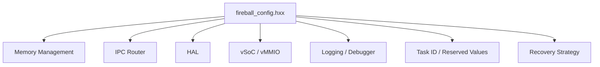

# システムコンフィグ コンポーネント設計書 {VERIFY_FORMAL} {VERIFY_LLM}
<!-- evidence:
     formal: formal/system_config_model.py
     test: docs/qa/tier1_core/system_config_test_spec.md
-->

## 1. コンセプト
<!-- traceability: {META_ConfigurableSystem} {META_Static_Resolution} {GLOBAL_IndependentHeap} {GLOBAL_StrictMemoryLimit} {ConsolidatedHeap} {GLOBAL_StaticScalability} {RoleBasedAccessControl} {FastAddressCheck} {vMMIO_Isolation} {META_RestrictedPhysicalAccess} {Challenge_DebuggerResource} {ZeroRuntimeOverhead} -->
Fireballハイパーバイザは、リソース制約の厳しい組み込み環境で動作するため、メモリサイズや最大リソース数をコンパイル時に固定する設計を採用する。設定はヘッダファイル形式のコンフィグファイル（`inc/fireball_config.hxx`）内のマクロ定義および `constexpr` 定数によって行われ、実行時オーバーヘッドを完全に排除する（ゼロコスト抽象化）。

## 2. アーキテクチャ分類
<!-- traceability: {META_3TierSeparation} {META_Static_Resolution} -->
本コンポーネントは **Tier 1 (主要システムコンポーネント: Primary Component)** に属し、システム全体の静的構成方針、メモリパーティション配分、および各サブシステムの設定定数を統括・提供する。

## 3. 静的モデル

### 3.1 データ構造
<!-- traceability: {Resource_Estimation_Model} -->
コンフィグ項目は、実行時のオーバーヘッドを排除するため、主にプリプロセッサマクロおよび C++ `constexpr` 定数として定義される。設計段階でリソース使用量を概算し、制約適合性を検証するためのモデルを提供する。

### 3.2 内部ブロック図
<!-- traceability: {Resource_Estimation_Model} -->

```mermaid
graph TD
    Config[fireball_config.hxx] --> Memory[Memory Management]
    Config --> IPCR[IPC Router]
    Config --> HAL[HAL]
    Config --> vSoC[vSoC / vMMIO]
    Config --> Log[Logging / Debugger]
    Config --> Task[Task ID / Reserved Values]
    Config --> Recovery[Recovery Strategy]
```

### 3.3 コンフィグマクロ一覧・定義

#### 3.3.1 メモリ管理
<!-- traceability: {GLOBAL_IndependentHeap} {GLOBAL_StrictMemoryLimit} {ConsolidatedHeap} {ContextPointerRegister} {GLOBAL_StaticScalability} {IPC_ZeroCopy} -->
本表は製品のネイティブ構成項目を定義する。要求で定まる制約は [`requirement_list.md`](docs/requires/requirement_list.md) を正本とし、対象構成で値が確定していない項目はTBDとする。シミュレータの初期値やメモリ集計を製品の既定値として扱わない。

| マクロ名 | 説明 | デフォルト値 | 導出元 |
| :--- | :--- | :--- | :--- |
| `FB_CONF_TASK_HEAP_SIZES` | ゲストVMスロットごとに個別設定する固定パーティションサイズの定数配列（要素数 `FB_CONF_MAX_GUEST_VMS`）。WASMリニアメモリのページ数とは別の設定である | 対象構成で定義 | |
| `FB_CONF_RUNTIME_HEAP_SIZE` | ホスト（WASMランタイム）実行専用の独立静的プールサイズ | 対象構成で定義 | |
| `FB_CONF_KERNEL_HEAP_SIZE` | COOSカーネル（スケジューラ、CSP、TCB、共有メモリ）用静的プールサイズ | 対象構成で定義 | |
| `FB_CONF_SUBSYS_HEAP_SIZE` | IPCルータ・HAL・ログバッファ用静的プールサイズ | 対象構成で定義 | |
| `FB_CONF_INTERP_STACK_SIZE` | インタープリタ統合スタック（`execution_context` + フレーム/オペランド）総容量 | 対象構成で定義 | |
| `FB_CONF_JIT_CACHE_SIZE` | x64参照構成のJITコードキャッシュ容量 | `8192` (x64参照構成) | `{JIT_MultiBuffer_Cache}` |
| `FB_CONF_MAX_GUEST_VMS` | 同時にロード可能なゲストVMの最大数 | `1` | |
| `FB_CONF_SHM_SIZE` | ゼロコピーIPCで使用する静的共有メモリの総バイト数（カーネル用プールの内数） | 対象構成で定義 | |
| `FB_CONF_MAX_SHM_PAGES` | FC=14で予約する仮想アドレススロット数。物理SHMバイト予算とは独立 | 対象構成で定義 | |
| `FB_CONF_MEMORY_POOL_SIZE` | 管理対象の静的メモリプール総量 | 要求と対象構成で定義 | |

`FB_CONF_TASK_HEAP_SIZES` の要素数は `FB_CONF_MAX_GUEST_VMS` と一致させる。各要素が表す物理配置と、各プールを要求上限内へ収める具体的な割当式は対象構成で定義する。

##### ARMv8-M 物理構成（TBD）

ARMv8-Mの対象ボード、SRAM/ROM/周辺アドレス、メモリ保護方式、領域数・属性・配置、JITコードキャッシュの物理配置と実装時の資源使用量はTBDとする。要求のRAM/ROM容量条件は [`requirement_list.md`](docs/requires/requirement_list.md) に従う。

#### 3.3.2 IPCルータ
<!-- traceability: {META_ConfigurableSystem} {IPC_ZeroCopy} {RoleBasedAccessControl} {WIT_First} {WIT_Common_Types} {Challenge_CspHandoffStarvation} -->
| マクロ名 | 説明 | デフォルト値 | 導出元 |
| :--- | :--- | :--- | :--- |
| `FB_CONF_IPC_MAX_SERVICES` | 登録可能な最大サービス数 | `16` | |
| `FB_CONF_ROUTER_MAX_KV_PAIRS` | 1メッセージが保持できるkv_pairの最大数（[`ipc_router.md`](docs/components/tier1_interface/ipc_router.md) §3.3） | `8` | |
| `FB_CONF_MAX_CONSECUTIVE_HANDOFFS` | スケジューラ復帰なしでの最大連続CSPハンドオフ回数 | `4` | [`os_scheduler.md`](docs/components/tier1_core/os_scheduler.md) の連続ハンドオフ上限 |

ロールの型と列挙値は [`ipc_router_contract.wit`](docs/components/tier1_interface/wit/ipc_router_contract.wit) の `types.role` を正本とする。ロール間の通信許可は [`ipc_router.md`](docs/components/tier1_interface/ipc_router.md) §4.1.1 の許可マトリクスを正本とする。

本コンポーネントは許可マトリクスをビルド時構成 `FB_CONF_ROUTER_ROLE_MATRIX` へ反映する。ロールの意味と許可セルを本書で再定義しない。

#### 3.3.3 HAL
<!-- traceability: {META_ConfigurableSystem} -->
| マクロ名 | 説明 | デフォルト値 | 導出元 |
| :--- | :--- | :--- | :--- |
| `FB_CONF_HAL_MAX_DEVICES` | 管理可能な最大デバイス数 | `8` | |
| `FB_CONF_HAL_BUFFER_SIZE` | デバイス通信用バッファの最大サイズ (Bytes) | `256` | |
| `FB_CONF_HAL_MAX_BUFFERS` | デバイス通信用バッファの最大数 | `4` | |

#### 3.3.4 vSoC / vMMIO
<!-- traceability: {JIT_MultiBuffer_Cache} {GLOBAL_StrictMemoryLimit} {vMMIO_Isolation} {META_ConfigurableSystem} {META_RestrictedPhysicalAccess} {META_FlatMapIndexed} {GLOBAL_StaticScalability} -->
| マクロ名 | 説明 | デフォルト値 | 導出元 |
| :--- | :--- | :--- | :--- |
| `FB_CONF_WASM_PAGE_SIZE` | WASM標準論理ページサイズ (64KB, 65,536 Bytes) | `65536` | |
| `FB_CONF_MAX_WASM_PAGES` | 初期WASMリニアメモリに許可する最大ページ数 | 対象構成で定義 | |
| `FB_CONF_JIT_CACHE_PAGE_SIZE` | x64参照構成で使用するJITコード領域のページ単位 | `4096` (x64参照構成) | |
| `FB_CONF_JIT_COMMON_CODE_SIZE` | 相対ジャンプ等の非エビクション共通コード領域 | `2048` | |
| `FB_CONF_JIT_BANK_SIZE` | 各エビクション対象バンクのサイズ | `2048` | |
| `FB_CONF_JIT_CACHE_SIZE` | 連続JIT領域（共通コード2KB + 3バンク×2KB） | `8192` | |
| `FB_CONF_JIT_NUM_BUFFERS` | JITキャッシュバッファ面数 (3面) | `3` | `{JIT_OldestOnly_Promote}` |
| `FB_CONF_JIT_MAX_INBOUND_CHAINS_PER_BANK` | 単一キャッシュバンクの最大被チェインエントリ数 | `32` | `{JIT_LazyChaining}` |
| `FB_CONF_JIT_CARD_SHIFT` | JITカードテーブルのビットシフト数（関数ごと、4バイト単位 = 2） | `2` | |
| `FB_CONF_RUNTIME_YIELD_THRESHOLD` | C++ InterpreterとHybrid JITがCOOSへyieldするまでの取得済み後方分岐数。`64`は100 MHz STM32 Cortex-M33で約300 µs（30,000サイクル / 約469サイクル/後方分岐）を狙う初期値であり、実機・実ワークロードで校正する | `64` | |
| `FB_CONF_JIT_AGING_STEP_UNITS` | 3面キャッシュのローテーション1回ごとに処理する関数更新表の非ゼロバイト数（1バイト = 8関数） | `2` | |
| `FB_CONF_JIT_AGING_STEP_SCAN_BYTES` | 3面キャッシュのローテーション1回ごとに走査する関数更新表のバイト数の上限（値が0のバイトも数える） | `8` | |

| `FB_CONF_GUEST_RAM_BASE` | ゲストRAMの開始アドレス（64KB境界配置） | `0x00000000` | |
| `FB_CONF_GUEST_RAM_SIZE` | vMMIO Stage 1アドレス窓の境界判定サイズ。WASMリニアメモリのページ数とは別の設定である | 対象構成で定義 | |
| `FB_CONF_VMMIO_BASE` | vMMIO領域の開始アドレス (Bit 31 == 1) | `0x80000000` | |
| `FB_CONF_VSOC_PASSTHROUGH_BASE` | ゲスト仮想PASSTHROUGH領域（FC=15）の開始アドレス。実デバイスへの物理対応付けは対象プラットフォームで設定する | 対象構成で定義 | |
| `FB_CONF_VMMIO_MAX_REGIONS` | 登録可能な最大vMMIO領域数 | `8` | |
| `FB_CONF_VMMIO_MAX_PTES` | FlatMap ページテーブルに保持可能な PTE の最大件数 | `64` | |
| `FB_CONF_VMMIO_ALLOWED_ADDRS` | ゲストからのアクセスを許可する物理アドレス範囲 | `constexpr`構造体配列 | |
| `FB_CONF_VMMIO_VIRQ_BASE` | 原因付き仮想割り込みディスパッチャ（vIRQ）専用ページの基底アドレス | `0xC0003000` | |
| `FB_CONF_VMMIO_VIRQ_PAGE_SIZE` | vIRQ専用ページの固定サイズ | `4096` | |
| `FB_CONF_VIRQ_CATEGORY_COUNT` | vIRQの固定分類ノード数（DEVICE/SYSTEM/RUNTIME/FAULT） | `4` | |
| `FB_CONF_VIRQ_MAX_NODES` | vIRQ静的ノード数（root + 4分類 + デバイスノード） | `1 + FB_CONF_VIRQ_CATEGORY_COUNT + FB_CONF_HAL_MAX_DEVICES` | |
| `FB_CONF_VIRQ_MAX_SOURCES` | vIRQ静的原因源数（SYSTEM/RUNTIME/FAULT + デバイス源） | `3 + FB_CONF_HAL_MAX_DEVICES` | |

実行経路の検査用カウンタと測定区間のリセットはQAの診断ハーネスが所有する。製品Runtimeは検査用API、累積カウンタ、集計分岐を保持しない。JITホットスポット観測はコンパイル候補を決定する製品機構として扱い、診断ハーネスとは独立して構成する。

JITの有効・無効も個別のビルド定義では切り替えない。Interpreter専用構成とJIT構成はRuntimeComposerがそれぞれの型で合成する。

vMMIO Stage 1アドレス窓へのアクセスは、有効サイズとの比較で保護する（`FastAddressCheck`）。境界外アドレスはトラップし、マスクで折り返して実行を継続しない。この判定は窓サイズが2の冪であることを要求しない。WASMリニアメモリは独立したページ数契約に従う。

#### 3.3.5 ロギング・デバッガ
<!-- traceability: {BufferedLogging} {Challenge_DebuggerResource} {Debug_Integrated} -->
| マクロ名 | 説明 | デフォルト値 | 導出元 |
| :--- | :--- | :--- | :--- |
| `FB_CONF_LOG_BUFFER_SIZE` | ログメッセージ保持用のバッファサイズ (Bytes) | `512` | |
| `FB_CONF_LOG_DICT_MAX_ENTRIES` | ROM上に保持する固定ログ辞書エントリの最大数 | `128` | `{DictionaryBasedIPC}` |
| `FB_CONF_DEBUG_MAX_BREAKPOINTS` | 最大ブレークポイント数 | `8` | `{META_ConfigurableSystem}` |
| `FB_CONF_DEBUG_PACKET_SIZE` | RSPパケットバッファサイズ | `1024` | |
| `FB_CONF_DEBUG_MAX_PC_SAMPLES` | プロファイラバッファに保持可能なPCサンプリングエントリの最大件数 | `64` | `Debug_Integrated` `{META_NoStdVector}` |

#### 3.3.6 タスクID型・予約値
<!-- traceability: {GLOBAL_StaticScalability} -->
| マクロ名 | 説明 | 値 | 備考 |
| :--- | :--- | :--- | :--- |
| `FB_TASK_ID_T` | タスクIDの基底型 | `uint8_t` | 有効値域 `1`〜`FB_CONF_MAX_TASKS` |
| `FB_TASK_ID_INVALID` | 未割り当て・無効を示す予約値 | `0` | 初期値。「誰も所有していない」を表す |
| `FB_TASK_ID_FLIGHT` | 所有権移譲中を示す予約値 (FLIGHT_SENTINEL) | `0xFF` | IPCルータ移譲中にセット |
| `FB_CONF_MAX_TASKS` | 同時実行可能な最大タスク数 | `16` | `≤ 254`（`FB_TASK_ID_FLIGHT` との衝突防止） |

#### 3.3.7 割り込みイベントFIFO
<!-- traceability: {GLOBAL_InterruptWakeup} -->
| マクロ名 | 説明 | デフォルト値 | 導出元 |
| :--- | :--- | :--- | :--- |
| `FB_CONF_INTERRUPT_QUEUE_SIZE` | COOSが所有する原因付き割り込みイベントFIFOの固定エントリ数。ISR producerとCOOS consumerのSPSCロックフリーリングで実装する | `16` | [`requirement_list.md`](docs/requires/requirement_list.md) |

```python
# コンパイル時検証
assert FB_CONF_MAX_TASKS <= 254, "FB_CONF_MAX_TASKS must be <= 254"
```

#### 3.3.8 リカバリー戦略
<!-- traceability: {META_RecoveryStrategy} {Errorcode_To_Strategy} -->
| マクロ名 | 説明 | デフォルト値 | 導出元 |
| :--- | :--- | :--- | :--- |
| `FB_CONF_RETRY_BACKOFF_MS` | `retry` 戦略の再試行間ウェイト（ミリ秒） | `10` | |
| `FB_CONF_RETRY_MAX_ATTEMPTS` | `retry` 戦略で再実行する最大回数 | `3` | |

`retry` を実装するすべてのコンポーネントはこの2値を共有する。個別のコンポーネント文書で異なる待機時間・回数を独自に定義しないこと。

## 4. 動的モデル

### 4.1 アルゴリズム
<!-- traceability: {META_Static_Resolution} -->
本コンポーネントは静的な定義のみを提供し、すべての値はコンパイル時に確定する。


## 5. インターフェース定義

実行時の公開APIは提供しない。構成値はコンパイル時定数として定義し、各コンポーネントの利用契約は本書の静的モデルと対応するコンポーネント仕様に従う。


## 6. 制約達成の方策

### 6.1 性能・メモリ制約と方策
<!-- traceability: {META_Static_Resolution} {META_ConfigurableSystem} {GLOBAL_StaticScalability} -->
- **方策**: すべてのパラメータをコンパイル時定数（`constexpr` / マクロ）とし、実行時の探索・計算コストおよび動的ヒープ（malloc/new）消費を完全排除する。

### 6.2 安全性制約と方策
<!-- traceability: {META_ConfigurableSystem} -->
- **方策**: システム構成定数はすべて `constexpr` / `const` として ROM / Flash（`.rodata`）に静的配置され、実行時の不正な書き換えから保護される。


## 7. 形式検証・テスト仕様との対応

### 7.1 形式検証との対応

[`system_config_model.py`](docs/components/tier1_core/formal/system_config_model.py) は、抽象化した構成状態での実行時変更禁止と`within_budget`分類をCTLで検証する。メモリ容量の数値計算や物理配置を証明するモデルではない。対象構成がTBDの値は未検証であり、数値予算は構成値が確定した後に静的検査で確認する。`guards=False` では実行時上書きおよび抽象的な予算超過の遷移を追加し、両特性が反証されることを確認する。

## 8. 設計判断と参考実装

<!-- traceability: {META_ConfigurableSystem} {META_Static_Resolution} {GLOBAL_StrictMemoryLimit} -->

特記すべき独立したADRはない。構成値をコンパイル時に固定する方針は本書のコンセプトと静的モデルで定義する。抽象状態の形式モデルは [`system_config_model.py`](docs/components/tier1_core/formal/system_config_model.py)、検証ケースは [`system_config_test_spec.md`](docs/qa/tier1_core/system_config_test_spec.md) に示す。
