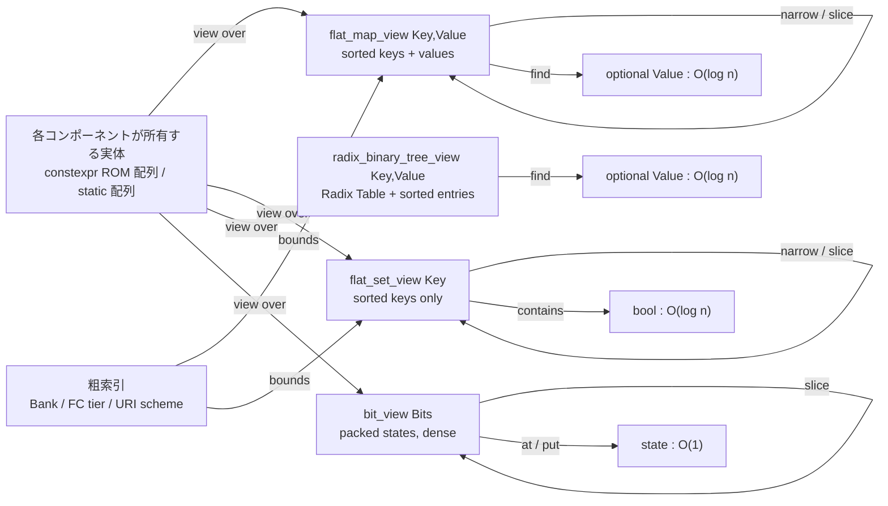
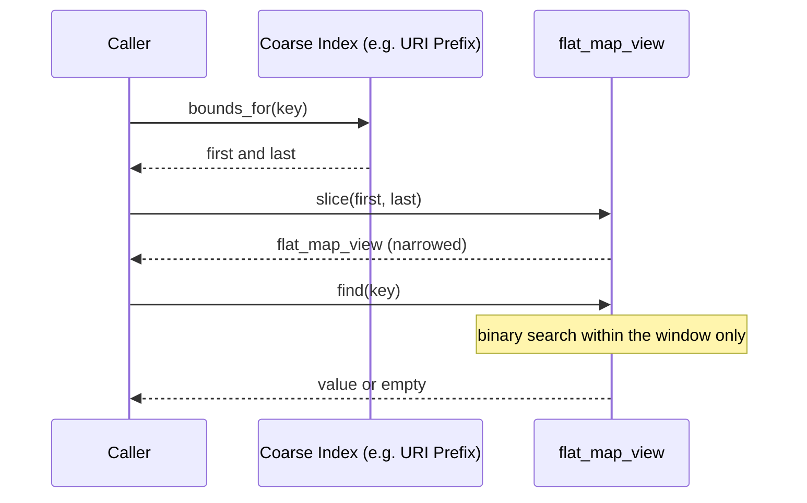

# 静的コンテナ語彙 コンポーネント設計書 {VERIFY_BENCHMARK} {VERIFY_LLM}
<!-- evidence:
     benchmark: ../tier1_interface/benchmarks/low_latency_lookup_bench.py
     concept: concepts/flat_view_concept.py
     test: tests/system_containers_test_spec.md
-->

## 1. コンセプト
<!-- traceability: {Type_Vocabulary} {META_FlatMapIndexed} {META_BinarySearch} {META_NoStdVector} {GLOBAL_Policy_Memory} {META_ZeroCostAbstraction} {GLOBAL_StaticScalability} {FlatViewNarrowing} {PackedBitView} -->
本コンポーネントは、Fireball 全体で共有されるコンテナ語彙を定義する。複数の Tier が同じ参照パターンを必要とするため、各所で個別に説明せず本書を型定義の正本とする。 `{Type_Vocabulary}`

語彙は **4 つの独立した型**からなる。それぞれ答える問いが異なるため、共通のテンプレートに統合しない。

| 型 | 答える問い | 参照方法 | 主な用途 |
| :--- | :--- | :--- | :--- |
| `fireball::flat_map_view<Key, Value>` | 「キー `K` に対応する値は何か」 | 絞り込み + **二分探索** $O(\log n)$ | vMMIO PTE表、IPCサービスレジストリ |
| `fireball::flat_set_view<Key>` | 「キー `K` は含まれるか」 | 絞り込み + **二分探索** $O(\log n)$ | ブレークポイントPC集合、vMMIO許可アドレス範囲 |
| `fireball::radix_binary_tree_view<Key, Value, RadixShift>` | 「キー `K` に対応する値は何か（基数＋二分探索）」 | **Radix Table** ($O(1)$) + **有界二分探索** $O(\log n)$ | JITエントリ索引（WASM PC $\to$ ネイティブコードオフセット） |
| `fireball::bit_view<Bits>` | 「添字 `i` の状態は何か」 | 添字による**直接参照** $O(1)$ | JITカードマーキング表、権限ニブル、フラグ列 |

**なぜ 4 つに分けるか**:
- **map と set を分ける**: 集合は値列を持たない。`Value` を `void` や擬似型で埋めた map として表現すると、存在しない値列に対する参照を型が持ち続けることになる。集合の問いは「含まれるか」であって「何が入っているか」ではないため、返すものも真偽であり値ではない。
- **純粋 flat_map と Radix Binary Tree を分ける**: `radix_binary_tree_view` は基数プレフィックスによる $O(1)$ 粗索引境界テーブル（Radix Table）と、境界内に有界化されたソート済みキー列の二分探索を統合した複合ビューである。手動の `slice().find()` を都度組み合わせる代わりに、型として不変条件（$O(1)$ 境界解決 + $O(\log n)$ 局所探索）をカプセル化する。
- **探索する型と探索しない型を分ける**: `bit_view` は疎なキー空間に対する探索構造ではなく、密な添字空間に対するビット詰め表である。キー列を持たない `flat_map_view` の特殊形として表現することは技術的には可能だが、「`flat_*_view` なら二分探索するもの」という読み手の期待を裏切り、カードマーキング表があたかも探索対象であるかのような誤解を生む。**カードマーキングは探索しない。添字がそのまま問いである。** `{Type_Vocabulary}`

**所有コンテナは定義しない。** 表の実体は既に各コンポーネントが持っている（IPCレジストリは ROM 上の `constexpr` 配列、PTE表・エントリ索引・カードマーキング表は静的に確保された配列である）。所有を担う汎用マップ型を別途設けると、実体の二重管理と余分なブックキーピングを生むだけになる。共有すべきは**それらをどう見るか**という語彙だけであり、本書は非所有ビューのみを定義する。 `{GLOBAL_Policy_Memory}` `{META_NoStdVector}`

標準の `std::flat_map` / `std::flat_set` を採用しない理由も同じ点にある。C++23 のこれらはコンテナアダプタであり、既定の下位コンテナが `std::vector` であるため `{META_NoStdVector}` および `{GLOBAL_Policy_Memory}`（`malloc` / `new` の使用禁止）に抵触する上、本プロジェクトが必要としない所有責務を持ち込む。 `{META_NoStdVector}` `{GLOBAL_Policy_Memory}` `{GLOBAL_StaticScalability}`

## 2. アーキテクチャ分類
<!-- traceability: {META_3TierSeparation} {Type_Vocabulary} -->
本コンポーネントは **Tier 1 (主要システムコンポーネント: Primary Component)** に属する。実行時の振る舞いも状態も持たないヘッダオンリーの型語彙（Vocabulary）であり、各 Tier（Tier 2 の vMMIO、Tier 3 の JIT エントリ索引・カードマーキング等）は本書で定義された非所有ビュー型（`flat_map_view`, `flat_set_view`, `radix_binary_tree_view`, `bit_view`）を利用して具象データを操作する。本書は下位 Tier の具象データ構造や内部ヘッダには一切依存せず、純粋な型語彙の提供に専念する。 `{META_3TierSeparation}` `{Type_Vocabulary}`

## 3. 静的モデル

### 3.1 データ構造
<!-- traceability: {META_FlatMapIndexed} {META_BinarySearch} {FlatViewNarrowing} {PackedBitView} {GLOBAL_StaticScalability} -->
- **`flat_map_view<Key, Value>`**: **AoS（Array of Structures）構造**を採用し、昇順ソート済みのエントリ配列（`std::span<const flat_map_entry<Key, Value>>`）の非所有ビューで構成される疎マップ。キーと値のペアを単一配列で連続保持し、C++ 標準の `std::sort`（`constexpr` 対応）や `std::lower_bound` をそのまま利用できる。保持メンバは単一スパン（ポインタと長さの計 2 ワード = 1組）のみであり、レジスタ渡しに最適化されている。 `{META_BinarySearch}` `{FlatViewNarrowing}` `{META_FlatMapIndexed}`
- **`flat_set_view<Key>`**: 昇順ソート済みのキー列のみを指す非所有ビュー。所属判定を行う。 `{META_BinarySearch}` `{FlatViewNarrowing}`
- **`radix_binary_tree_view<Key, Value, RadixShift>`**: 基数テーブル（Radix Table / $O(1)$ スカラー開始インデックス配列：サイズ $K+1$、バケット $p$ の区間は `[table[p], table[p+1]]`）とソート済みエントリ配列の局所二分探索をカプセル化した多段索引ビュー。 `{META_BinarySearch}` `{FlatViewNarrowing}`
- **`bit_view<Bits>`**: 1 要素が 1 バイト未満の密なビット詰め表を指す非所有ビュー。添字で直接読み書きする。 `{PackedBitView}`

### 3.2 内部ブロック図
<!-- traceability: {META_FlatMapIndexed} {META_BinarySearch} {FlatViewNarrowing} {PackedBitView} -->


### 3.3 主要なクラス・構造体・配列・定数

#### 疎マップビュー（flat_map_view）
<!-- traceability: {META_BinarySearch} {META_ZeroCostAbstraction} {FlatViewNarrowing} {META_FlatMapIndexed} -->
SoA（Structure of Arrays）構造に基づく、昇順ソート済みのキー配列と値配列に対する非所有ビュー。粗索引による範囲絞り込みと二分探索を合成し、$O(\log N)$ でキーを特定して対応する値を取り出す。二分探索パスではキー列のみがCPUキャッシュラインに高密度に載るため、値のメモリサイズにかかわらずキャッシュミスを最小化する。 `{META_BinarySearch}` `{FlatViewNarrowing}` `{META_FlatMapIndexed}`

| 項目名 | 機能と役割 | 型分類 | サイズ・制約 |
| :--- | :--- | :--- | :--- |
| エントリ配列区間 | 昇順ソート済みの (Key, Value) ペア配列への読み取り専用ビュー（二分探索対象） | データ範囲 | `std::span<const flat_map_entry<Key, Value>>` |

#### 疎集合ビュー（flat_set_view）
<!-- traceability: {META_BinarySearch} {META_ZeroCostAbstraction} {FlatViewNarrowing} -->
ソート済みキー列のみに対する非所有ビュー。値列を持たない。 `{META_BinarySearch}` `{FlatViewNarrowing}`

| 項目名 | 機能と役割 | 型分類 | サイズ・制約 |
| :--- | :--- | :--- | :--- |
| キー区間 | 対象区間のキーへの読み取り専用ビュー | データ範囲 | `std::span<const Key>` |

**共通の不変条件（map / set）**: キー区間の要素は狭義単調増加であり、重複キーは存在しない。この不変条件が二分探索の正当性を与える。ビューの生成元がこれを破った場合の挙動は未定義である。

**共通の設計上の性質（map / set）**:
- **ゼロコスト**: 実体はポインタと長さのみ（map も set も 1 組 = 2ワード）。所有も確保も行わず、AAPCS の引数レジスタに載る大きさに収まる。 `{META_ZeroCostAbstraction}`
- **合成可能**: 絞り込み操作は同じビュー型を返すため、粗索引による絞り込みを多段に重ねられる。
- **添字の取り違えを型で防ぐ**: 生の開始・終了インデックス対を返す設計では、呼び出し側が誤った配列と組み合わせても検出できない。ビューは区間を 1 つの値として束ねるため、この誤りが表現できない。

#### ビット詰めビュー（bit_view）
<!-- traceability: {PackedBitView} {GLOBAL_StrictMemoryLimit} {META_ZeroCostAbstraction} -->
1 要素が 1 バイト未満の密な状態表を指す非所有ビュー。**探索を行わない**——添字による直接参照のみであり、`{META_AccessDictionary}`（データの索引化に基づく検索最適化）の対象外である。 `{PackedBitView}`

| 項目名 | 機能と役割 | 型分類 | サイズ・制約 |
| :--- | :--- | :--- | :--- |
| 記憶域 | ビット詰めされた状態列の格納領域 | データ範囲 | `std::span<std::byte>` |
| ビット原点 | 記憶域先頭から論理要素 0 までのビットオフセット | ビット位置 | 32bit符号なし（`slice` の端数を吸収） |
| 要素数 | 区間が保持する論理要素数 | エントリ数 | 32bit符号なし |

RAM 32KB という制約下では、数値しか取らない状態表を 1 バイト/要素で持つのは無視できない浪費になるため、本語彙はビット幅を型の一部として扱う。 `{GLOBAL_StrictMemoryLimit}`

| `Bits` | 1バイトあたり要素数 | 本プロジェクトでの用途 |
| ---: | ---: | :--- |
| 1 | 8 | 真偽フラグ列 |
| 2 | 4 | **カードマーキング表**（`UNEXECUTED` / `EXECUTED` / `HOT` / `COMPILED`） |
| 4 | 2 | vMMIO PTE の権限ニブル |

**設計上の制約**:
- `Bits` は 1, 2, 4 のいずれかに限る。8 の約数のみを許すことで 1 要素が高々 1 バイトに収まり、読み出しが単一のロードとシフト・マスクで完結する（バイト跨ぎの結合処理が不要になる）。この制約は `static_assert` で強制する。8 ビット以上の密な表には本型を用いず、素の `std::span<T>` を使う。 `{META_CompileTimeValidation}`
- `slice()` の開始添字にバイト境界の制約を課さない。ビット原点フィールドが端数を吸収する。
- 読み出しは `(byte >> shift) & mask` に展開される。`Bits` がコンパイル時定数であるため `shift` と `mask` は即値となり、実行時の除算・剰余は発生しない。 `{META_ZeroCostAbstraction}`
- 書き込みは同一バイト内の読み出し・マスク・書き戻しで完結し、隣接要素のビットを破壊しない。

```text
// inc/fireball_containers.hxx での定義形式 (C++23)
namespace fireball {

template <class Key, class Value>
struct flat_map_entry {
  Key key;
  Value value;
  constexpr auto operator<=>(const flat_map_entry& other) const noexcept {
    return key <=> other.key;
  }
  constexpr auto operator==(const flat_map_entry& other) const noexcept -> bool {
    return key == other.key;
  }
};

// 疎マップ: ソート済みペア列（AoS）に対する絞り込みと二分探索。値を返す。
template <class Key, class Value>
class flat_map_view {
 public:
  constexpr explicit flat_map_view(
      std::span<const flat_map_entry<Key, Value>> entries) noexcept;
  constexpr auto narrow(const Key& lo, const Key& hi) const noexcept -> flat_map_view;
  constexpr auto slice(std::size_t first, std::size_t last) const noexcept -> flat_map_view;
  constexpr auto find(const Key& k) const noexcept -> std::optional<Value>;
  constexpr auto size() const noexcept -> std::size_t;
  constexpr auto empty() const noexcept -> bool;
};

// 疎集合: 値列を持たない。所属のみを答える。
template <class Key>
class flat_set_view {
 public:
  constexpr auto narrow(const Key& lo, const Key& hi) const noexcept -> flat_set_view;
  constexpr auto slice(std::size_t first, std::size_t last) const noexcept -> flat_set_view;
  constexpr auto contains(const Key& k) const noexcept -> bool;
  constexpr auto size() const noexcept -> std::size_t;
  constexpr auto empty() const noexcept -> bool;
};

// 基数二分探索木索引: O(1) Radix Table + O(log n) 有界二分探索 (KeyProjection 対応)
template <typename Key, typename Value, std::size_t RadixShift, typename KeyProjection = std::identity>
class radix_binary_tree_view {
 public:
  constexpr explicit radix_binary_tree_view(
      std::span<const Key> keys,
      std::span<const Value> values,
      std::span<const std::size_t> radix_table,
      KeyProjection proj = {}) noexcept;
  constexpr auto find(const Key& k) const noexcept -> std::optional<Value>;
  constexpr auto size() const noexcept -> std::size_t;
  constexpr auto empty() const noexcept -> bool;
};

// 密: 添字で直接引くビット詰め状態表。探索は提供しない。
template <std::size_t Bits>
class bit_view {
  static_assert(Bits == 1 || Bits == 2 || Bits == 4,
                "Bits must divide a byte; use std::span<T> for 8 bits or wider");
 public:
  constexpr auto at(std::size_t i) const noexcept -> std::uint8_t;
  constexpr void put(std::size_t i, std::uint8_t v) const noexcept;
  constexpr auto slice(std::size_t first, std::size_t last) const noexcept -> bit_view;
  constexpr auto size() const noexcept -> std::size_t;
};

// 固定容量 AoS 実体ストレージ: constexpr 標準ソート、ソート維持挿入・削除、非所有ビュー生成
template <class Key, class Value, std::size_t Capacity>
struct flat_map_storage {
  std::array<flat_map_entry<Key, Value>, Capacity> entries{};
  std::size_t count{0};

  // constexpr 標準ソート（std::sort で entries をキー昇順に並び替え）
  constexpr auto sort() noexcept -> flat_map_storage&;
  // ソート順序を維持したまま要素を挿入（既存キーなら値更新: false、新規キーなら挿入: true）
  constexpr auto insert(const Key& k, const Value& v) noexcept -> bool;
  // ソート順序を維持したまま要素を削除（存在すれば削除: true、なければ: false）
  constexpr auto erase(const Key& k) noexcept -> bool;
  constexpr auto is_sorted() const noexcept -> bool;
  constexpr auto view() const noexcept -> flat_map_view<Key, Value>;
  constexpr auto size() const noexcept -> std::size_t { return count; }
  constexpr auto capacity() const noexcept -> std::size_t { return Capacity; }
};

template <class Key, class Value, std::size_t N>
constexpr auto make_sorted_flat_map_storage(
    std::array<flat_map_entry<Key, Value>, N> entries) noexcept
    -> flat_map_storage<Key, Value, N>;

}  // namespace fireball
```

## 4. 動的モデル

### 4.1 アルゴリズム
<!-- traceability: {META_BinarySearch} {FlatViewNarrowing} {PackedBitView} {LowLatencyLookup} {GLOBAL_StrictMemoryLimit} -->
- **絞り込み後二分探索 (Narrow-then-Search)**: 粗い索引で対象区間を先に狭め、狭めた区間に対してのみ二分探索を行う。全体の件数を $N$、絞り込み後を $n$ とすると計算量は $O(\log n)$ となり、$n$ が $N$ より十分小さい限り全体探索より少ない比較回数で済む。加えて、走査するキーが連続した狭い範囲に収まるため参照局所性が改善する。map / set の双方に適用される。 `{FlatViewNarrowing}` `{META_BinarySearch}` `{LowLatencyLookup}`
- **絞り込みの合成**: 絞り込み操作の戻り値は同じビュー型であるため、複数段の索引を順に適用できる。各段は区間を単調に狭めるのみで、区間外の要素を再び含めることはない。
- **ビット詰めアクセス**: 論理添字 $i$ に対する物理位置は `bit = origin + i * Bits` として求まり、`byte = bit >> 3`、`shift = bit & 7` となる。`Bits` が 8 の約数であるため 1 要素がバイトを跨ぐことはなく、単一バイトのロードとシフト・マスクで読み出しが完結する。 `{PackedBitView}` `{GLOBAL_StrictMemoryLimit}`
- **AoS 標準ソートと二分探索 (Standard Sort & Binary Search)**: 自前のソート関数（連動ヒープソート等）の車輪の再発明を排し、C++ 標準の `std::sort`（C++20 `constexpr` 対応）および射影付き `std::lower_bound` をそのまま利用する。小規模組み込み（$N \le 64$）においてデータ全体が 1〜2 本のキャッシュライン（32〜64 バイト）に収まるため、AoS でキャッシュミスは発生せず、標準ライブラリの極限まで最適化されたアルゴリズムの恩恵を最大化できる。 `{META_ZeroCostAbstraction}` `{GLOBAL_StrictMemoryLimit}`

実行可能な参照実装と検証テストは [`concepts/flat_view_concept.py`](concepts/flat_view_concept.py) を参照。ビット詰めの近傍非破壊性、非バイト境界での `slice`、絞り込みの単調縮小性、集合の所属判定、JIT 検索経路をテストで固定している。

```python
# コンテナ語彙の概念コード (FlatViewNarrowing / PackedBitView)

import bisect

ALLOWED_BITS = (1, 2, 4)


class BitView:
    """bit_view<Bits>: a dense, index-addressed table of sub-byte states.

    Deliberately offers no search: this is the card marking shape, where the
    index *is* the question. Bits must divide 8 so one element never straddles a
    byte, which keeps a read down to a single load plus a shift and a mask.
    """

    def __init__(self, storage, bits: int, origin: int = 0, count: int = 0):
        assert bits in ALLOWED_BITS, "Bits must be 1, 2 or 4"
        self.storage = storage  # 外部所有バイト列（C++ std::span<uint8_t> 相当）
        self.bits = bits
        self.origin = origin  # bit offset of logical element 0
        self.count = count

    def size(self):
        return self.count

    def _bit_pos(self, i):
        assert 0 <= i < self.count, "index outside the view"
        return self.origin + i * self.bits

    def at(self, i):
        bit = self._bit_pos(i)
        mask = (1 << self.bits) - 1
        return (self.storage[bit >> 3] >> (bit & 7)) & mask

    def put(self, i, value):
        mask = (1 << self.bits) - 1
        assert 0 <= value <= mask, "value does not fit in Bits"
        bit = self._bit_pos(i)
        byte, shift = bit >> 3, bit & 7
        cleared = self.storage[byte] & ~(mask << shift) & 0xFF
        self.storage[byte] = cleared | (value << shift)

    def slice(self, first, last):
        """Narrow by index. The bit origin absorbs the remainder, so `first`
        does not have to land on a byte boundary."""
        assert 0 <= first <= last <= self.count, "a view may only ever shrink"
        return BitView(self.storage, self.bits, self.origin + first * self.bits, last - first)


class _SortedWindow:
    """Shared narrowing behaviour of the two sparse views."""

    def __init__(self, keys, first=0, last=None):
        self.keys = keys
        self.first = first
        self.last = len(keys) if last is None else last

    def size(self):
        return self.last - self.first

    def empty(self):
        return self.size() == 0

    def _bounds(self, lo, hi):
        return (
            bisect.bisect_left(self.keys, lo, self.first, self.last),
            bisect.bisect_right(self.keys, hi, self.first, self.last),
        )

    def _locate(self, key):
        i = bisect.bisect_left(self.keys, key, self.first, self.last)
        return i if i < self.last and self.keys[i] == key else None


class FlatMapView(_SortedWindow):
    """flat_map_view<Key, Value>: sorted keys, narrow-then-search, returns a value."""

    def __init__(self, keys, values, first=0, last=None):
        super().__init__(keys, first, last)
        self.values = values

    def slice(self, first, last):
        assert self.first <= first <= last <= self.last, "a view may only ever shrink"
        return FlatMapView(self.keys, self.values, first, last)

    def narrow(self, lo, hi):
        return FlatMapView(self.keys, self.values, *self._bounds(lo, hi))

    def find(self, key):
        """Binary search inside the current window only."""
        i = self._locate(key)
        return None if i is None else self.values[i]


class FlatSetView(_SortedWindow):
    """flat_set_view<Key>: sorted keys only, answers membership.

    Carries no value span at all -- the question is whether the key is present,
    not what is stored against it.
    """

    def slice(self, first, last):
        assert self.first <= first <= last <= self.last, "a view may only ever shrink"
        return FlatSetView(self.keys, first, last)

    def narrow(self, lo, hi):
        return FlatSetView(self.keys, *self._bounds(lo, hi))

    def contains(self, key):
        return self._locate(key) is not None


def bswap32(v: int) -> int:
    """32-bit byte-order reversal for maximizing Radix table distribution on UnifiedPC."""
    return ((v & 0xFF) << 24) | ((v & 0xFF00) << 8) | ((v >> 8) & 0xFF00) | ((v >> 24) & 0xFF)


class RadixBinaryTreeView:
    """fireball::radix_binary_tree_view<Key, Value, RadixShift, KeyProjection>:
    Container combining an O(1) Radix Table (pure scalar start-index array)
    with bounded binary search on a sorted key-value array.
    Bucket bounds are: first = radix_table[prefix], last = radix_table[prefix + 1].
    """

    def __init__(
        self,
        keys: Sequence[int],
        values,
        radix_table: Sequence[int],
        radix_shift: int,
        key_transform=None,
    ):
        self.map_view = FlatMapView(list(zip(keys, values)))
        self.radix_table = radix_table  # pure scalar offsets array [0, 3, 6, ...]
        self.radix_shift = radix_shift
        self.key_transform = key_transform

    def find(self, key: int):
        rk = self.key_transform(key) if self.key_transform is not None else key
        prefix = rk >> self.radix_shift
        if prefix < 0 or prefix + 1 >= len(self.radix_table):
            return None
        first = self.radix_table[prefix]
        last = self.radix_table[prefix + 1]
        if first >= last:
            return None
        return self.map_view.slice(first, last).find(key)


# --- 本プロジェクトでの用途 ---


def lookup_jit_entry(
    view: FlatMapView | RadixBinaryTreeView,
    card_table: BitView,
    entry_group_bounds: Sequence[int],
    pc: int,
    card_shift: int,
    group_shift: int,
):
    """JIT entry lookup:
    1. O(1) card marking pre-filter: verify card state == 3 (COMPILED).
    2. O(1) Radix Table prefix lookup: slice to group bounds [bounds[i], bounds[i+1]].
    3. Bounded local binary search on narrowed FlatMapView (RadixBinaryTree index model).
    """
    card_idx = pc >> card_shift
    if card_idx >= card_table.size() or card_table.at(card_idx) != 3:  # 3 = COMPILED
        return None
    if hasattr(view, "radix_table"):
        return view.find(pc)
    group_idx = pc >> group_shift
    if group_idx < 0 or group_idx + 1 >= len(entry_group_bounds):
        return None
    first = entry_group_bounds[group_idx]
    last = entry_group_bounds[group_idx + 1]
    if first >= last:
        return None
    return view.slice(first, last).find(pc)


def card_marking_table(storage, card_count: int) -> BitView:
    """The 2-bit per-card state table: 4 cards per byte instead of one.

    Note this returns a BitView, not a FlatMapView -- card marking is answered
    by the index, never searched for.
    """
    return BitView(storage, bits=2, origin=0, count=card_count)


def breakpoint_set(sorted_pcs) -> FlatSetView:
    """Debugger breakpoints: the interpreter asks 'is this PC a breakpoint?',
    which is membership, not a lookup."""
    return FlatSetView(sorted_pcs)
```

### 4.2 状態遷移図
<!-- traceability: {Type_Vocabulary} -->
本コンポーネントは値型の語彙であり、それ自体は状態遷移を持たない。ビューは区間に関して不変（immutable）であり、絞り込み操作は元のビューを変更せず新しいビューを返す。`bit_view` の `put()` は指す先の記憶域を更新するが、ビュー自身の区間は変化しない。

### 4.3 内部シーケンス
<!-- traceability: {FlatViewNarrowing} {META_BinarySearch} -->


## 5. インターフェース定義

### 5.1 公開API
外部コンポーネントから利用する型語彙の契約を定義する。

#### キー範囲による絞り込み（narrow）
<!-- traceability: {FlatViewNarrowing} {META_BinarySearch} -->

| 項目 | 内容 |
| :--- | :--- |
| 機能概要 | 疎ビュー（map / set）を、キーが指定範囲に収まる部分区間へ狭める。 |
| シグネチャ | `narrow(lo: Key, hi: Key) -> (同じビュー型)` |
| 引数 | `lo`: 下限キー（含む）<br>`hi`: 上限キー（含む） |
| 戻り値 | 狭められたビュー（該当なしの場合は空ビュー） |
| 事前条件 | 下限が上限以下であること |
| 事後条件 | 戻り値の区間は必ず元の区間の部分集合である |
| 不変条件 | ビューは決して広がらない。この単調性により多段絞り込みが安全に合成できる |

#### 添字区間による絞り込み（slice）
<!-- traceability: {FlatViewNarrowing} {PackedBitView} -->

| 項目 | 内容 |
| :--- | :--- |
| 機能概要 | 粗索引が区間の位置を既に知っている場合に、添字で直接ビューを狭める。3 型すべてが提供する。 |
| シグネチャ | `slice(first: index, last: index) -> (同じビュー型)` |
| 引数 | `first`: 開始添字（含む）<br>`last`: 終了添字（含まない） |
| 戻り値 | 狭められたビュー |
| 事前条件 | 開始が終了以下であり、両者が現在の区間内にあること（デバッグビルドでアサート） |
| 補足 | `bit_view` では開始添字にバイト境界の制約を課さない。ビット原点が端数を吸収する |
| エラー時の挙動 | 区間外指定はプログラミングエラーとして扱い、リリースビルドでは未定義動作を避けるため現在の区間へクランプする |

#### 区間内探索（find）
<!-- traceability: {META_BinarySearch} {LowLatencyLookup} -->

| 項目 | 内容 |
| :--- | :--- |
| 機能概要 | `flat_map_view` の現在区間に限定してキーを二分探索し、対応する値を返す。 |
| シグネチャ | `find(key: Key) -> optional<Value>` |
| 戻り値 | 一致する値。存在しない場合は空 |
| 期待する結果 | 区間長 $n$ に対し $O(\log n)$ の比較回数で完了する |
| 補足 | 区間外に同一キーが存在しても発見しない。絞り込みが正しいことは呼び出し側の責務である |

#### 所属判定（contains）
<!-- traceability: {META_BinarySearch} {LowLatencyLookup} -->

| 項目 | 内容 |
| :--- | :--- |
| 機能概要 | `flat_set_view` の現在区間に限定してキーの所属を二分探索で判定する。 |
| シグネチャ | `contains(key: Key) -> bool` |
| 戻り値 | 区間内に存在すれば真 |
| 期待する結果 | 区間長 $n$ に対し $O(\log n)$ の比較回数で完了する |
| 補足 | 値を返さないため、値列を持たない記憶域に対して使用できる。ブレークポイント判定のように「あるか否か」のみが問われる用途に用いる |

#### 添字による状態参照（at / put）
<!-- traceability: {PackedBitView} {GLOBAL_StrictMemoryLimit} -->

| 項目 | 内容 |
| :--- | :--- |
| 機能概要 | `bit_view` の論理添字に対して状態を読み書きする。 |
| シグネチャ | `at(i: index) -> state`<br>`put(i: index, v: state) -> void` |
| 引数 | `i`: 論理添字（ビュー区間の先頭を 0 とする） |
| 期待する結果 | 単一バイトのロードとシフト・マスクで完了する |
| 事前条件 | 添字が区間内であること。`put` の値が `Bits` に収まること（デバッグビルドでアサート） |
| 不変条件 | 隣接要素のビットを破壊しないこと。`put` は読み出し・マスク・書き戻しを 1 バイト内で完結させる |

### 5.2 URI/IPCインターフェース
<!-- traceability: {Type_Vocabulary} -->
本コンポーネントはヘッダオンリーの型語彙であり、IPCインターフェースを持たない。

### 5.3 利用箇所
<!-- traceability: {Type_Vocabulary} {META_FlatMapIndexed} {PackedBitView} {GLOBAL_StrictMemoryLimit} -->

| 利用コンポーネント | 型 | 用途 | 絞り込みに用いる粗索引 |
| :--- | :--- | :--- | :--- |
| JIT エントリ索引 (`jit_runtime_entry`) | `radix_binary_tree_view` | WASM PC からネイティブコードオフセットへの変換 | Radix Table (基数プレフィックス $O(1)$) |
| JIT カードマーキング (`jit_runtime_hotspot`) | `bit_view<2>` | 関数ごと 8バイト単位カードの 2-bit 実行状態 | なし ($O(1)$ 直接添字アクセス: `func_code_offset >> 3`) |
| vMMIO PTE表 (`runtime_vmmio`) | `flat_map_view` | 仮想ページ番号 (VPN) から PTE への変換 | ファンクションコード (FC) による Tier 区分 |
| vMMIO 許可アドレス (`system_config_details`) | `flat_set_view` | 物理アドレスが許可範囲に属するかの判定 | なし（`FB_CONF_VMMIO_ALLOWED_ADDRS` で有界） |
| IPCルータ (`ipc_router`) | `flat_map_view` | サービスURI からチャネルIDへの解決 | URI スキーマ・ドメインの前方一致 |
| デバッガ (`debug_manager`) | `flat_set_view` | 実行中PCがブレークポイントかの判定 | なし（件数が `FB_CONF_DEBUG_MAX_BREAKPOINTS` で有界） |

## 6. 制約達成の方策

### 6.1 性能制約と方策
<!-- traceability: {META_BinarySearch} {FlatViewNarrowing} {PackedBitView} {LowLatencyLookup} -->
- **目標**: クリティカルパス（インタープリタ実行ループ内の JIT エントリ検索、カード状態判定、ブレークポイント判定）での参照コストを最小化する。
- **方策**: `{FlatViewNarrowing}` により粗索引で区間を狭めてから二分探索を行い、比較回数を全件に対する $O(\log N)$ から区間長に対する $O(\log n)$ へ削減する。JIT エントリ検索では `radix_binary_tree_view` により $O(1)$ の Radix Table ルックアップと有界区間の二分探索 $O(\log n)$ を適用する。カード状態の判定は `{PackedBitView}` により探索を伴わず、単一のロードとシフト・マスクで完了する。 `{META_BinarySearch}` `{LowLatencyLookup}`

### 6.2 メモリ制約と方策
<!-- traceability: {GLOBAL_Policy_Memory} {META_NoStdVector} {GLOBAL_StrictMemoryLimit} {GLOBAL_StaticScalability} -->
- **目標**: 動的メモリ確保を排除し、状態表のメモリ密度を最大化する。
- **方策**: `{META_NoStdVector}` 所有型を定義せず、実体は各コンポーネントの静的配列または ROM 上の `constexpr` 配列に置く。ビューは非所有であり追加のメモリを消費しない。集合は値列を持たないため、所属判定のみが必要な表でキー列だけを確保できる。加えて `{PackedBitView}` により、2値・4値しか取らない状態表を 1/8〜1/4 のサイズで保持する。 `{GLOBAL_Policy_Memory}` `{GLOBAL_StrictMemoryLimit}` `{GLOBAL_StaticScalability}`

### 6.3 安全性制約と方策
<!-- traceability: {META_CompileTimeValidation} {META_ZeroCostAbstraction} -->
- **目標**: 索引の取り違え、区間外アクセス、隣接ビットの破壊を防止する。
- **方策**: `{META_CompileTimeValidation}` キー区間と値区間をビューとして束ねることで、両者を取り違えた組み合わせをそもそも表現できなくする。絞り込み操作の単調縮小性により、合成した絞り込みが区間外へ広がることはない。`Bits` を 8 の約数に `static_assert` で限定することで、1 要素がバイトを跨ぐ場合の部分書き込みを設計から排除する。探索を持つ型と持たない型、値を返す型と返さない型を分離することで、密な状態表を誤って探索対象として扱う設計や、存在しない値列への参照を型で阻む。 `{META_ZeroCostAbstraction}`

## 7. 参考実装リスト

| 名称 | 参照先URL/文献名 | 採用/考慮する理由 |
| :--- | :--- | :--- |
| Radix Tree & Static Binary Search Tree | アルゴリズム定石 (Knuth TAOCP Vol.3) | 基数プレフィックス粗索引＋ソート済み配列二分探索の合成モデルの参照元 |
| C++23 `std::flat_map` / `std::flat_set` | ISO/IEC 14882:2024 | 疎ビューのインターフェース設計の参照元。所有責務と下位コンテナ `std::vector` が本プロジェクトに不適合 |
| `std::span` | ISO/IEC 14882:2020 | 非所有ビューの設計定石として。8ビット以上の密な表には本型をそのまま用いる |
| `std::bitset` / `std::vector<bool>` | ISO/IEC 14882:2020 | ビット詰め表現の先行例。固定長・非所有・多値状態のいずれも満たさないため直接は採用しない |
