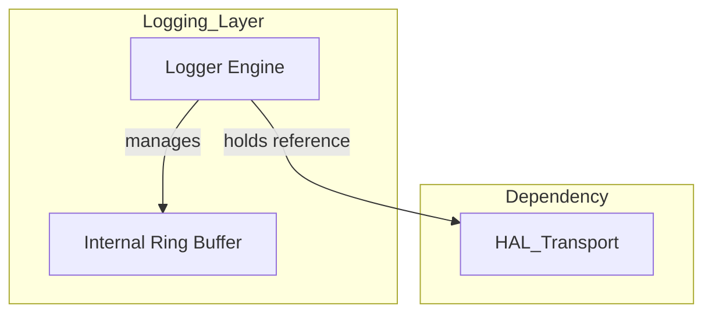
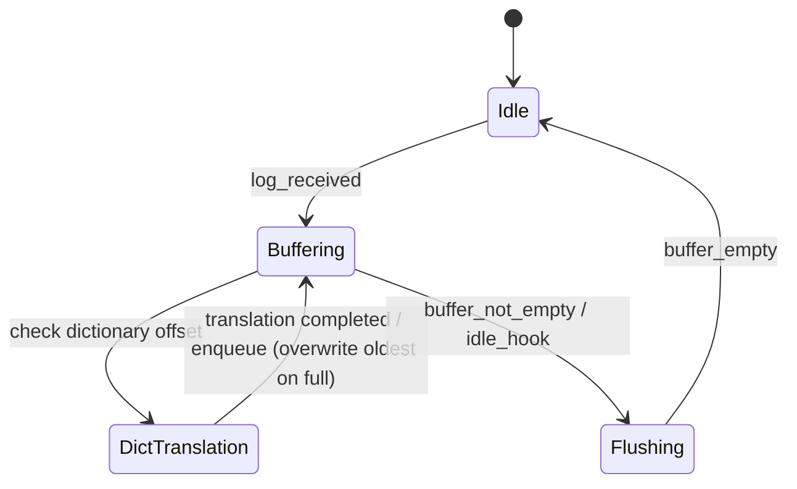
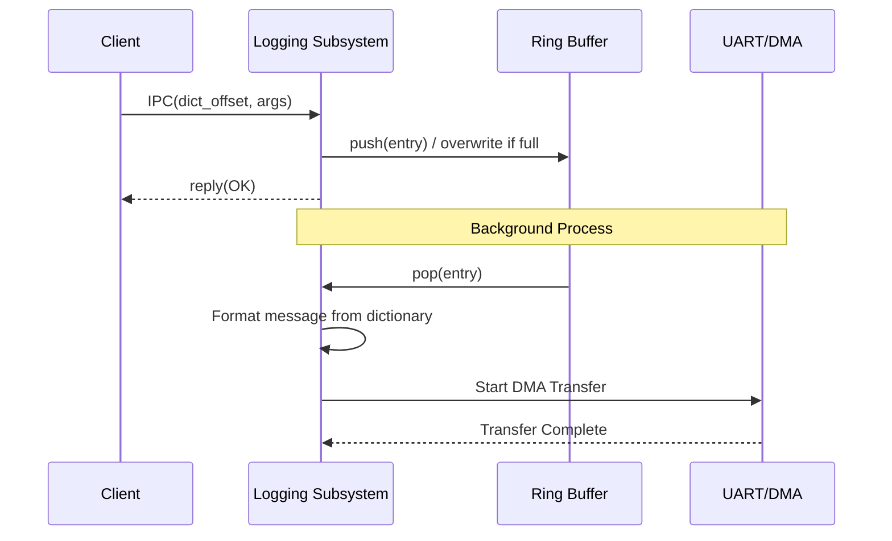

# ロギング コンポーネント設計書 {VERIFY_LLM} {VERIFY_FORMAL}
<!-- evidence:
     concept: concepts/logging_concept.py
     formal: formal/logging_flush_model.py
     test: tests/system_logging_test_spec.md
-->

## 1. コンセプト
<!-- traceability: {IPCRouter} {DictionaryBasedIPC} {BufferedLogging} {GLOBAL_IdleDetection} -->
ロギングコンポーネントは、ハイパーバイザ内部の状態を記録し、外部（UART/ITM等）へ出力する。システムコールはすべてIPCルータを経由して行われ、ログデータの転送もIPCルータを通過する。メモリ消費と通信負荷を抑えるため、辞書参照IPCと内部リングバッファによる遅延出力を採用する。また、COOSの **Idle Hook** を利用してシステム負荷が低い時に集中的に出力を行うことで、実行性能への影響を抑える。自己完結した参照実装は [`concepts/logging_concept.py`](concepts/logging_concept.py) を参照。 `{IPCRouter}` `{DictionaryBasedIPC}` `{BufferedLogging}` `{GLOBAL_IdleDetection}`

**適用範囲外**: 本コンポーネントが扱うのはビルド時に辞書登録された固定フォーマットの内部状態ログのみである。ゲストの `wasi:cli/stdout`/`stderr`（`print`/`eprint` による実行時生成の任意長文字列）はここでは表現できず、`console-output`（`{WASI_ConsoleRawOutput}`）という別経路で扱う。

## 2. アーキテクチャ分類
<!-- traceability: {META_3TierSeparation} -->
本コンポーネントは **Tier 1 (主要システムコンポーネント: Primary Component)** に属し、システム共通のリングバッファロギングおよびアイドル検知フックに基づく遅延出力を担当する。 `{META_3TierSeparation}`

## 3. 静的モデル

### 3.1 データ構造
- **`Logger`**: ログの収集、バッファリング、および物理出力への転送を一括して管理する主要クラス。
- **`logging_config`**: バッファサイズやデフォルトログレベルなどの不変な構成情報。
- **`log_entry`**: リングバッファに格納される単一のログデータ構造（辞書オフセット + 引数）。

### 3.2 内部ブロック図

### 3.3 主要なクラス・構造体・配列・定数

#### ロガー（Logger）クラス
依存関係（HALトランスポート）とバッファ状態をカプセル化する。

| 項目名 | 機能と役割 | 型分類 | サイズ・制約 |
| :--- | :--- | :--- | :--- |
| 出力トランスポート | HAL_Transport で定義された物理デバイス（UART等）への参照 | 構造体への参照 | `hal_transport` (非所有) |
| 循環バッファ | ログデータを一時的に保持する領域 | リングバッファ | 固定長配列 |
| 書き込み/読み出し索引 | バッファの現在の状態を示すポインタ | アトミック値 | 32bit |
| 出力閾値 | 現在出力対象としている最小のログレベル | uint8_t | `log_level` |

#### ログ構成（logging_config）
<!-- traceability: {META_ConfigurableSystem} -->
ロギングシステムの動作パラメータを定義する。 `{META_ConfigurableSystem}`

| 項目名 | 機能と役割 | 型分類 | サイズ・制約 |
| :--- | :--- | :--- | :--- |
| バッファ総容量 | 循環バッファの大きさを定義する | バイト数 | 2のべき乗 |
| 既定出力レベル | 起動時にフィルタリングされる最小の重要度 | uint8_t | 定数 |

## 4. 動的モデル

### 4.1 アルゴリズム
<!-- traceability: {DictionaryBasedIPC} {BufferedLogging} -->
- **辞書参照ロギング**: 送信側はメッセージ文字列ではなく、辞書内のオフセットと引数のみをIPCで送信する。 `{DictionaryBasedIPC}`
- **遅延出力**: IPC受信時はリングバッファへの格納のみを行い、実際の物理出力は `HAL_Transport` を介した抽象化された通信路によりバックグラウンドで行われる。具体的なトランスポート実装（UARTやITMなど）はシステム構成定義ファイル（`inc/fireball_config.hxx`）で指定される。出力完了割り込みやDMA完了割り込みをトリガーとし、DMA転送時は転送開始後はCPUを解放して低システム負荷で動作し、コンテキストスイッチや他タスクの処理（中断処理）を優先する。 `{BufferedLogging}`
- **バッファフル・ポリシー**: **FINALIZED: Overwrite**。リングバッファが満杯の場合、古いログを破棄して新しいログを書き込む。システムの状態継続を優先。

### 4.2 辞書構造
<!-- traceability: {DictionaryBasedIPC} -->
辞書はROM上に固定配置され、ホスト側ツールが `dict_offset + args` から可読テキストに展開する。 `{DictionaryBasedIPC}`

| 項目 | 値 |
| :--- | :--- |
| 配置場所 | ROM (実行時不変) |
| エントリフォーマット | `{ id: u32, format: null-terminated UTF-8 }` |
| 最大エントリ数 | `FB_CONF_LOG_DICT_MAX_ENTRIES` (コンパイル時固定) |
| フォーマット文字列 | printf形式。最大4個の `u32` 引数を参照可能。不許可指定子（`%s`, `%p`, `%c` 等のポインタ間接参照）はビルド時に静的拒絶 |
| 引数スライス規則 | フォーマット文字列に含まれる指定子数 $n$（$0 \le n \le 4$）に対し、渡された4引数タプルの先頭 $n$ 個（`args[0..n]`）のみが展開時に参照され、未使用スロットは安全に無視される |
| 登録時期 | ビルド時 (実行時の追加は不可) |

### 4.3 COOS Idle Hook 連携 (Flush Protocol)
<!-- traceability: {GLOBAL_IdleDetection} -->
COOSスケジューラの `set_idle_hook` で `logger.flush()` を登録する。 `{GLOBAL_IdleDetection}`

1. COOSスケジューラがREADYタスクがないことを検出
2. `idle_hook()` を呼び出し → `logger.flush()` が実行
3. リングバッファの全エントリを物理トランスポートへ転送
4. バッファ空になったら制御を返す

### 4.4 状態遷移図
<!-- traceability: {DictionaryBasedIPC} {BufferedLogging} {GLOBAL_IdleDetection} -->

### 4.5 内部シーケンス
<!-- traceability: {DictionaryBasedIPC} {BufferedLogging} {GLOBAL_IdleDetection} -->
#### ログ出力シーケンス

## 5. インターフェイス定義

### 5.1 公開API
外部から利用可能なオブジェクト指向APIを定義する。

#### ログイベント記録 (`log_event`)

<!-- traceability: {BufferedLogging} {META_ZeroOverhead} -->

| 項目 | 内容 |
| :--- | :--- |
| 機能概要 | 発生したイベントを、レベルと辞書オフセット形式で記録する。 |
| シグネチャ | `auto log_event(level: uint8_t, offset: uint32_t, args: std::span<const uint32_t, 4>) -> log_result_t` |
| 引数 | `level`: ログレベル重要度 `offset`: 辞書オフセット（API上は `uint32_t` で受け取るが、IPC送信時は下記 IPC 不変条件のとおり `kv_pair` の識別キー幅である24bitに収める） `args`: ログパラメータとなる数値配列（最大4要素の `std::span`） |
| 戻り値 | `log_result_t` (常に `SUCCESS` を返し、バッファ満杯時は最古ログを自動上書きしてシステムの実行継続性を最優先する) |
| 期待する結果 | 正常：ログ情報がリングバッファにキューイングされる。 |

#### バッファリング出力 (`flush`)

| 項目 | 内容 |
| :--- | :--- |
| 機能概要 | リングバッファに蓄積されたログを物理トランスポートへ一括出力する。 |
| シグネチャ | `auto flush() -> log_result_t` |
| 戻り値 | `log_result_t` (成功時は `SUCCESS`、物理トランスポートがDMA転送中かつ出力バッファが空でないといったハードウェアビジー状態の失敗時には `ERR_TRANSPORTER_BUSY` を返す) |
| 補足 | COOS の `set_idle_hook` により、システムアイドル時に呼び出される。物理転送中に割り込み（INTイベント、例：WASIタイマー等）が発生した場合は、現在のDMA転送の完了待機を中止してバックグラウンドDMAに任せ、次のログバッファのフラッシュ処理をスキップして速やかに制御をスケジューラに戻す。 |

### 5.2 URI/IPCインターフェイス
<!-- traceability: {DictionaryBasedIPC} -->
- **URI**: `fireball://logging/system/0`
- **メッセージ形式**: Key-Valueプロトコル。 `level`, `dict_offset`, `arg0`〜`arg3` を含む。 `{DictionaryBasedIPC}`
- **不変条件**: 辞書オフセットは `kv_pair`（`{DictionaryBasedIPC}`）の識別キー幅に合わせ 24bit、引数は各 32bit とする。24bit（最大16MB）は本プロジェクトの ROM 辞書サイズに対して十分な範囲である。

## 6. 制約達成の方策

### 6.1 性能制約と方策
<!-- traceability: {BufferedLogging} -->
- **目標**: ログ出力による呼び出し側のブロッキングを最小化する。
- **方策**: `{BufferedLogging}` 内部バッファリングと非同期出力により、IPCハンドラを即座に解放する。

### 6.2 メモリ制約と方策
<!-- traceability: {MemoryIsolation} {META_ConfigurableSystem} -->
- **目標**: ログ機能によるメモリ圧迫を防止する。
- **方策**: `{MemoryIsolation}` `{META_ConfigurableSystem}` 独立した静的メモリプールを使用し、バッファサイズをコンパイル時に固定する。動的メモリ確保（ヒープ）は一切使用しない。

### 6.3 安全性制約と方策
<!-- traceability: {BufferedLogging} {MemoryIsolation} {META_ConfigurableSystem} -->
- **目標**: ログ出力の失敗がシステム全体に波及しないようにする。
- **方策**: `{BufferedLogging}` `{MemoryIsolation}` `{META_ConfigurableSystem}` ログの蓄積はリングバッファでバッファリングを行い、メモリパーティションによってログ領域のクラッシュを他のコンポーネントから隔離する。また、バッファサイズ等の制限はコンパイル時マクロ定義で設定される。バッファフル時は古いログを破棄し、システムの継続実行を優先する。
