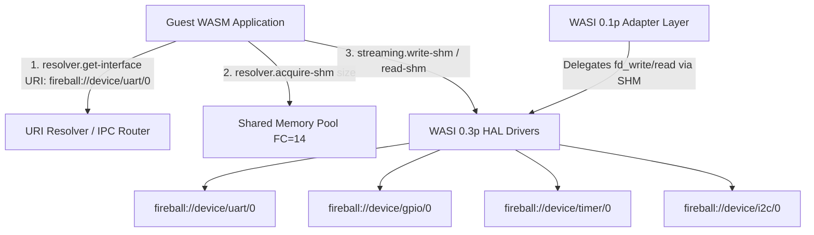

# WIT インターフェース仕様書 (WASI 準拠版) {VERIFY_WIT} {VERIFY_LLM} {VERIFY_FORMAL}
<!-- evidence:
     wit: wit/fireball.wit
     formal: formal/wit_resource_lifecycle_model.py
     test: tests/interface_wit_test_spec.md
-->

## 1. 目的

<!-- traceability: {WIT_Interface_Purpose} {WIT_First} {WIT_Common_Types} {URIAbstraction} -->
本ドキュメントは、Fireballプロジェクトにおいてゲスト（WASM）環境に公開されるシステムコールおよびハードウェア抽象化層（HAL）のインターフェース仕様を定義する。
HAL は WASI 0.3 Preview (WASI 0.3p / Component Model, Resources, Streams, Async) に準拠して提供され、URI からインターフェースを動的に取得する URI Resolver を備える。また、レガシーな WASI 0.1p (`wasi_snapshot_preview1`) ABI は、WASI 0.3p / HAL リソースを背後で呼び出す薄いアダプタ/ラッパーレイヤーとして完全サポートする。

## 2. アーキテクチャ原則

<!-- traceability: {CleanArchitecture} {META_SpecificationFirst} {META_Risk_Tiering} {URIAbstraction} -->
- **WASI 0.3p 準拠**: GPIO、タイマー、バス通信、ストリーム等のすべてのハードウェア・周辺入出力プリミティブを WASI 0.3p のリソース・ストリーム体系として定義・公開する。
- **URI Resolver メソッド**: `resolver.get-interface(uri: string)` により、URI 文字列からインターフェースハンドルを取得可能とする。
- **WASI 0.1p 互換ラッパー (Adapter Pattern)**: 既存の WASI Preview 1 (`fd_write`, `fd_read`, `clock_time_get`, `proc_exit` 等) は、WASI 0.3p の `output-stream` や `monotonic-clock` リソースを呼び出すラッパーとして機能する。
- **IPC 宛先 URI と階層命名規則**: WASI 0.3p でインターフェースを取得する URI は、`fireball://<domain>/<type>/<instance>`（例: `fireball://device/uart/0`, `fireball://device/gpio/0`, `fireball://device/timer/0`, `fireball://device/i2c/0`, `fireball://service/stdout/0`）の**階層型 URI 命名規則**に従い、**IPC ルータ（`ipc_router`）でデバイスやサービスと通信するための宛先 URI** として機能する。
- **共有メモリ（SHM）ゼロコピー I/O**: データのリード・ライトは、vMMIO FC=14 の共有メモリ領域（`shm-slice`）を通じてゼロコピー／極低レイテンシで実行される。 `{URIAbstraction}` `{META_RestrictedPhysicalAccess}`
- **Stateless Interface**: リソースハンドルを通じた操作を行い、ホスト側で状態を管理する。

## 3. 共通データ構造

### 3.1 基礎インターフェース & IPC URI Resolver
<!-- traceability: {CooperativeMultitasking} {Asynchronous_Notification} {URIAbstraction} {META_RestrictedPhysicalAccess} -->
WASI 0.3p の標準パターンに従い、以下の基礎コンポーネントを提供する。

- `resolver`: 階層型 IPC 宛先 URI（`fireball://device/<type>/<instance>`, `fireball://service/<type>/<instance>`）から通信チャネルハンドルおよび共有メモリ（`shm-slice`）を取得・管理するリゾルバ。 `{URIAbstraction}` `{META_RestrictedPhysicalAccess}`
- `pollable`: 非同期イベントの待機用リソース。 `{CooperativeMultitasking}` `{Asynchronous_Notification}`
- `streaming` / `bus`: 共有メモリ（`shm-slice`）を用いた高速な `read-shm` / `write-shm` / `transfer-data` を提供するストリーミング・バスリソース。



### 3.2 リカバリー戦略とエラーハンドリング
<!-- traceability: {META_RecoveryStrategy} {Errorcode_To_Strategy} -->

本プロジェクトでは、エラーコードではなくリカバリー戦略を返すことで、呼び出し側が具体的なアクション（リトライ/諦める）を取れるようにする。低レイヤー（Syscall）の `errno` は、Shim層でこの戦略に変換される。 `{META_RecoveryStrategy}` `{Errorcode_To_Strategy}`
※なお、ホスト内部で各デバイスドライバと通信する低レイヤーの IPC コマンドプロトコルおよび RSP デバッグ仕様は、HAL（Tier 3）コンポーネント設計書を正本とする。

```wit
/// Recovery strategy for operation failures.
enum recovery-strategy-category {
    /// Error can be ignored, continue operation.
    ignore,
    /// Retry with same parameters may succeed.
    retry,
    /// Module or system needs to be re-initialized.
    restart,
    /// Fatal error, halt the system and dump state.
    panic
}

// Domain-specific result types
type operation-result = result<_, recovery-strategy-category>;
type load-result = result<_, recovery-strategy-category>;
type registration-result = result<_, recovery-strategy-category>;
type routing-result = result<_, recovery-strategy-category>;
```

#### リカバリー戦略の事前・事後条件と不変条件
<!-- traceability: {META_RecoveryStrategy} {Errorcode_To_Strategy} -->

| 戦略カテゴリ | 選択基準（事前条件） | 事後条件 / システム状態 | 不変条件 |
| :--- | :--- | :--- | :--- |
| `ignore` | 一時的なバッファ空/満杯通知など、データ喪失を伴わず無視可能な事象 | 状態変化なし。呼び出し元は継続実行 | システム整合性は完全に維持される |
| `retry` | 一時的なリソース競合やタイムアウト。再試行により回復可能な場合 | 引数状態は維持。`FB_CONF_RETRY_BACKOFF_MS`（`{META_RecoveryStrategy}`）のバックオフ後に再実行 | 再試行上限回数（3回）を超えないこと |
| `restart` | サービスコンテキストやメモリ破損の疑い。モジュール単体の自己修復が必要な場合 | 該当タスク/サービスのTCB・ヒープを初期化し再起動 | 他サービスおよびカーネルのメモリ空間は隔離され保護される |
| `panic` | MPU違反、二重解放、デッドロック検知など、安全な継続が不可能な致命的障害 | 全タスク停止、クラッシュダンプを出力しフェイルセーフ停止 | ハードウェアおよび不揮発性領域への不正書き込みを即時遮断 |

#### 設計判断
<!-- traceability: {META_RecoveryStrategy} {Errorcode_To_Strategy} -->
- **実装詳細の分離**: `hardware-error`や`timeout`は実装の内部状態であり、クリーンアーキテクチャの内側が知るべきではない。
- **アクション指向**: リカバリー戦略により、呼び出し側は具体的なアクション（リトライ/エラーログ出力して諦める）を決定できる。
- **リトライ上限到達時の段階的エスカレーション (Retry Exhaustion Escalation)**: `retry` 戦略で `RETRY_MAX_ATTEMPTS`（3回）を超過した場合、呼び出し元は自動的に `restart`（タスクコンテキスト再初期化・再起動）へエスカレーションする。再起動後もエラーが回復不能な場合は最終的に `panic` へエスカレーションし、システム安全性を担保する。
- **IPC は所有権ロールバックを必要としない**: IPC ルータ（`ipc_router.md`）はバッファなし同期 CSP チャネル（`{ADR_RendezvousChannel}`）であり、宛先ごとの有界キューを持たない。したがって `ERR_QUEUE_FULL` のような一時的な資源競合は原理的に発生せず、`Revoke` 後の所有権ロールバックという回復処理も存在しない——送信は相手タスクの到達を待つのみで、失敗して差し戻る経路がない。
- **デバッグ情報の分離**: 失敗の詳細理由はログシステムで確認する。インターフェースには含めない。

## 4. 低レベル・トラップ・インターフェース
<!-- traceability: {Syscall_Mapping} -->
WASI標準には存在しない、Fireball固有の高速システムコール。実体は `../tier1_core/system_syscall.md` で定義される `fireball::fireball_call` である。このインターフェース設計を通じて、低レベルなシステムコールがWITの世界とマッピングされる（`{Syscall_Mapping}`）。

### 4.1. `fireball:host/trap` の定義
<!-- traceability: {Syscall_Mapping} -->
WIT内では `fireball-call` という kebab-case 名で定義されるが、C++バインディングおよび公開APIとしては名前空間 `fireball` 内に `fireball_call`（snake_case）としてマッピングされ公開される。

- `fireball-call(id: u32, arg0: u32, arg1: u32, arg2: u32, arg3: u32, arg4: u32, arg5: u32) -> u32`

### 4.2. 高応答トリガーインターフェース
<!-- traceability: {Syscall_Mapping} -->
Trigger (GPIO) は、割り込み応答性およびビットバンギング等の要求から、一般のリソースハンドルを介さず、`fireball-call` に直接マッピングされた ID を通じて操作するものとする。

- **理由**: ハンドルルックアップのオーバーヘッド排除、レジスタ直結に近いレイテンシの確保。
- **実装例**: `FB_SYSCALL_TRIGGER_SET_PIN` ID を直接指定（`{Syscall_Mapping}`）。

```wit
// インターフェースとしては定義するが、Shim層では直接トラップを叩く
interface trigger-controller {
    set-pin: func(pin: u32, value: bool) -> operation-result;
    get-pin: func(pin: u32) -> result<bool, recovery-strategy-category>;
}
```

## 5. HAL インターフェース

### 5.1 `fireball:host/timer` (wasi:clocks 準拠)
`wasi:clocks/monotonic-clock` のサブセットとして定義。

```wit
resource periodic-timer {
    get-now: func() -> u64; // ナノ秒単位
    subscribe-timer: func(nanos: u64) -> pollable; // タイマー割り込み相当
}
```

### 5.3 `fireball:host/bus` (Master/Slave Bus)
<!-- traceability: {WASI_Implementation} {IPC_ZeroCopy} {OwnershipTransfer} -->
バス通信も標準WASIにはないため、リソースパターンを適用。DMA等の物理転送に直接渡せるのは所有権管理された共有メモリ（SHM）ハンドルのみであり（`{OwnershipTransfer}` `{IPC_ZeroCopy}`）、ゲストのリニアメモリ上のポインタを直接渡すことはできない。ゲストは事前に `acquire_buffer()` 相当の操作で `shm-id`（ホスト実装の詳細は下位 Tier の設計文書を正本とする）を取得し、その範囲内のオフセットのみを指定できる。

```wit
// SHM上の範囲を指す。handle は acquire_buffer() が返す shm-id
// （`(page_idx << 8) | slot_idx`）であり、ゲストのリニアメモリを指すポインタではない。
record shm-slice {
    handle: u32,
    offset: u32,
    len: u32,
}

resource bus-master {
    // tx-bufのオフセット/サイズを渡し、受信データはrx-buf（事前に確保したSHMスロット）に直接書き込ませ、実際に転送したバイト数を返す
    transfer-data: func(tx-buf: shm-slice, rx-buf: shm-slice) -> result<u32, recovery-strategy-category>;
}

resource bus-slave {
    // 送信応答データを設定
    set-response: func(data: shm-slice) -> operation-result;
    // 受信データを指定したSHMスロットに読み出し、実際に取得したバイト数を返す
    get-received: func(dest-buf: shm-slice) -> result<u32, recovery-strategy-category>;
    subscribe: func() -> pollable; // マスタからのアクセス通知
}
```

### 5.4 `fireball:host/streaming` (wasi:io 準拠)
<!-- traceability: {WASI_Implementation} -->
一方的なデータ転送は標準のストリームとして扱う。

```wit
resource streaming-master {
    get-output-stream: func() -> output-stream;
}

resource streaming-slave {
    get-input-stream: func() -> input-stream;
}
```

### 5.5 `fireball:host/console` (`wasi:cli/stdout` / `stderr` 用の生バイト出力)
<!-- traceability: {WASI_ConsoleRawOutput} {DictionaryBasedIPC} -->
ゲストの `print`/`eprint` が書き込む文字列は実行時に組み立てられる任意長データであり、`system_logging.md` の内部ロガー（`{DictionaryBasedIPC}`、ビルド時登録の辞書オフセット＋固定4引数のみを扱い、実行時の辞書追加は不可）では表現できない。そのため、`wasi:cli/stdout`/`stderr` は内部ロガーとは独立した生バイト出力専用の経路として定義する。 `{WASI_ConsoleRawOutput}`

```wit
resource console-output {
    // 任意長の生バイト列をそのまま HAL_Transport (UART/ITM 等) へ渡す。辞書変換もリングバッファへの構造化格納も行わない。
    write: func(data: list<u8>) -> result<u32, recovery-strategy-category>;
}
```

物理トランスポート（`HAL_Transport`）は `system_logging.md` のロガーと共有するが、辞書・リングバッファは経由しない別経路であり、両者は排他的に出力順序が保証されるわけではない（インターリーブし得る）。

### 5.6. WASI標準APIの実装仕様 (WASI Standard API Implementation Specification)
<!-- traceability: {WASI_Implementation} -->
FireballにおけるWASI 0.2標準APIの具体的なマッピングと実装方針（`{WASI_Implementation}`）は以下の通りである。

1. **`wasi:clocks/monotonic-clock`**:
   - モノトニックタイマー要求は、HALの物理タイマー割り込みおよびカウンタレジスタに直結して処理される。
   - タイマーの周期呼び出しやタイムアウト機能は、`periodic-timer` リソースおよび `pollable` オブジェクトを通じて実装される。
2. **`wasi:io/streams` (input-stream / output-stream)**:
   - ストリームI/O操作（データの順次読み書き）は、COOSのIPCチャネルを用いたメッセージ通信として実装される。
   - ホスト側のメモリバッファとゲスト（WASM）側のリニアメモリ間で、ゼロコピーまたは最小限のオーバーヘッドでデータ転送を行う。
3. **`wasi:cli/stdout` / `wasi:cli/stderr`**:
   - コンソール出力（標準出力・標準エラー出力）は、`console-output` リソース経由で `HAL_Transport` へ直接転送される。`system_logging.md` の内部ロガー（辞書ベース）は経由しない。 `{WASI_ConsoleRawOutput}`
   - ゲスト内での `print` や `eprint` は、自動的にシステムコール経由で `console-output.write` にルーティングされる。
4. **`wasi:filesystem/types` / `wasi:filesystem/preopens`**:
   - Fireballは組み込み向け極小ハイパーバイザであるため、一般的な物理ディスク上のファイルシステムはサポートしない。
   - ただし、特定のメモリマップドI/O（VMMIO）領域や共有メモリ領域を「事前オープンされた仮想ファイル記述子」としてエミュレートする仕組みを提供する。

## 6. 非同期通知メカニズム

<!-- traceability: {Asynchronous_Notification} {WASI_Async_Bridge} -->
WASIでは割り込みを直接扱うのではなく、`pollable` を通じたイベント待機（`poll`）としてモデル化する。

- **Virtual Interrupts**: 物理割り込みはホストで処理され、対応するリソース（`trigger`, `timer`, `bus-slave` 等）の `pollable` が ready になることでゲストに通知される。

## 7. フィードバック：WASI 準拠における制約事項
WASI仕様と HAL の乖離および考慮点は以下の通り：

1. **GPIO/Bus の不在**: WASI (CLI/Cloud) には GPIO や I2C/SPI の標準インターフェースがない。これらは WASI リソースモデルに従った「Fireball 独自プロポーザル」として実装する必要がある。
2. **リアルタイム性**: WASI 0.2 の `poll` モデルは非同期イベントの集約には優れるが、極めて高速なリアルタイム応答が必要な場合、`fireball_call` (Trap) を併用する方が効率的である可能性がある。
3. **リソース管理のオーバーヘッド**: `resource` の生成・破棄（ハンドル管理）は、単純な `u32` ID渡しよりもホスト側のオーバーヘッドが増えるため、64KB RAM 環境ではハンドル数を制限するなどの対策が必要。

## 8. 命名規則 (Naming Conventions)

WIT識別子は WASI 標準および `wasm-tools` の制約により `kebab-case` (ハイフン区切り) が必須である。プロジェクトでは以下のセマンティクス規約を適用する。

| 対象カテゴリ | 命名規則 (Semantic) | 例 |
| :--- | :--- | :--- |
| **Object** (Record, Resource) | `性質-責務名` | `periodic-timer`, `ipc-message` |
| **Enum** (Type) | `性質-カテゴリ` | `sys-log-level`, `recovery-strategy-category` |
| **Method** (Function) | `動詞` または `動詞-機能` | `set-pin`, `get-now` |
| **Field / Enum Case** | `kebab-case` | `max-latency`, `retry` |

### 8.1 設計上の留意点
- **Kebab-Case Mandatory**: WIT定義内で `snake_case` (アンダースコア) は使用禁止。
- **C++ へのマッピング**: 生成される C++ コードではプロジェクト標準規約に従い、自動的に `snake_case` へ変換される。
- **名前の衝突回避**: ドメインプレフィックスを積極的に活用し、グローバルな名前空間での衝突を避ける。
