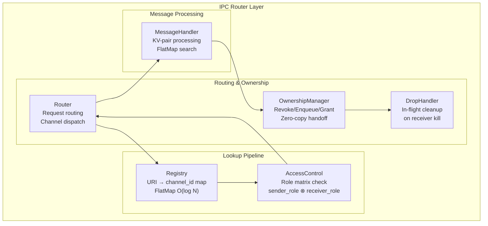
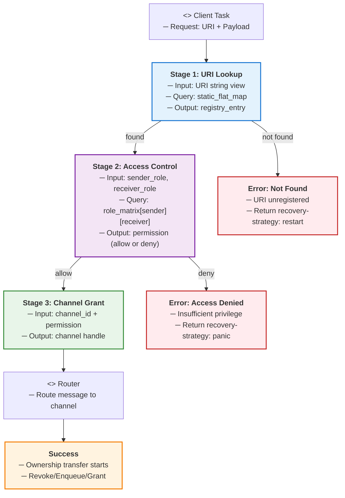
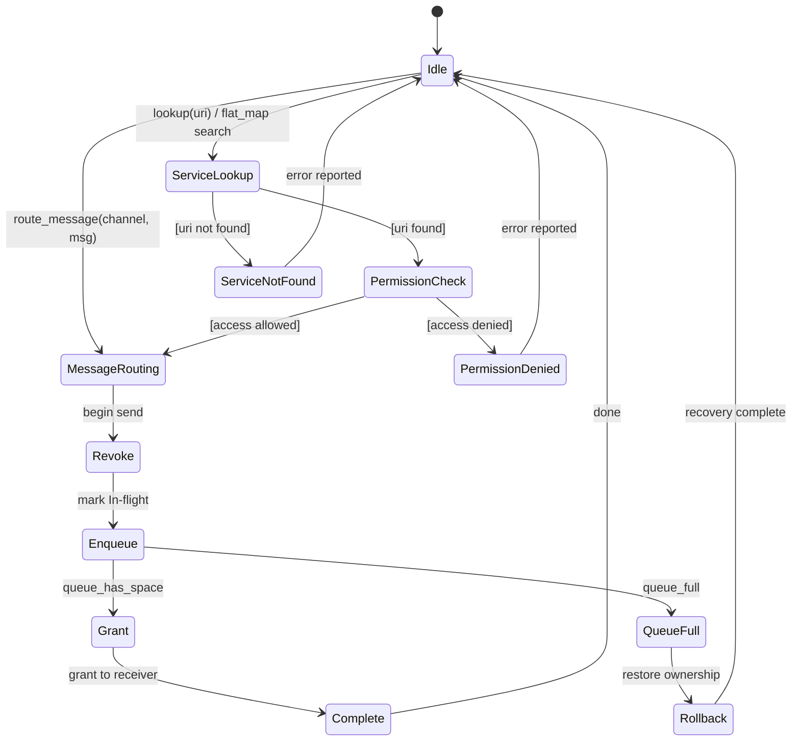
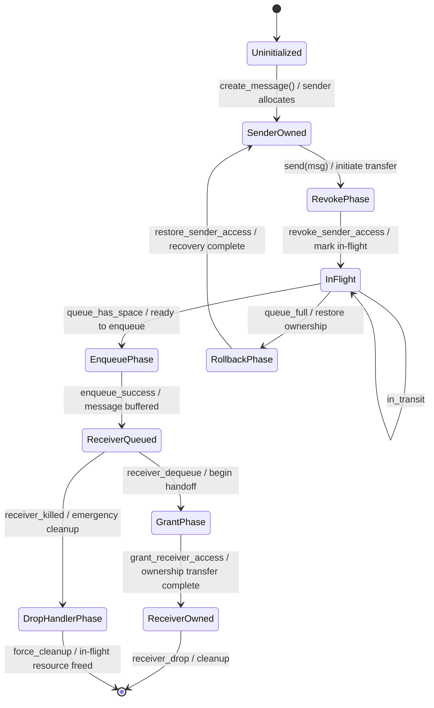
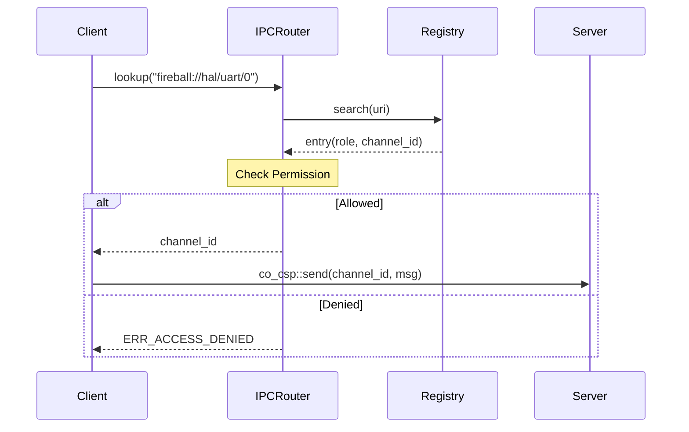
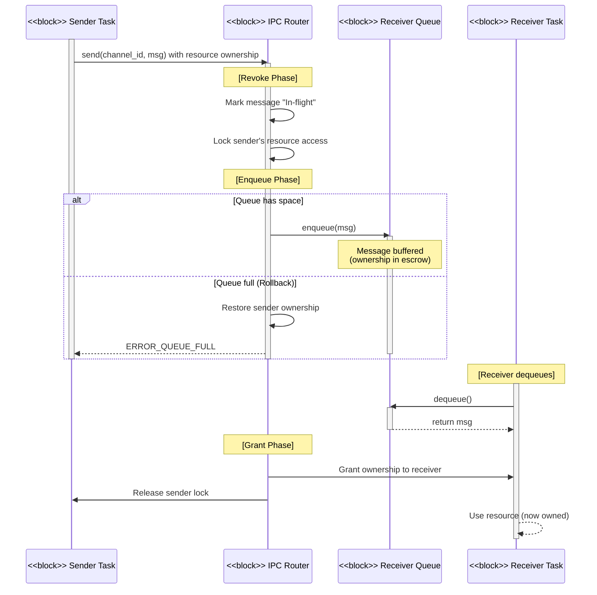

# IPCルータ コンポーネント設計書 {VERIFY_FORMAL}

## 1. コンセプト
<!-- traceability: {IPCRouter} {URIAbstraction} {RoleBasedAccessControl} {OwnershipTransfer} {IPCDI} -->
IPCルータは、URIベースのサービスディスカバリとロールベースのアクセス制御を備えたメッセージルーティング層である。コンポーネント間の依存性をURIで抽象化し、所有権移譲を伴う安全なデータ移動を実現する。 `{IPCRouter}` `{URIAbstraction}` `{RoleBasedAccessControl}` `{OwnershipTransfer}` `{IPCDI}`

## 2. アーキテクチャ分類
<!-- traceability: {META_3TierSeparation} {IPCRouter} {URIAbstraction} -->
本コンポーネントは **Tier 1 (主要システムコンポーネント: Primary Component)** に属する。システム全体の通信基盤として機能し、IoC (Inversion of Control) と URIベースのDIを用いて、コンポーネント間の疎結合性とゼロコピー所有権移譲を統括する。 `{META_3TierSeparation}` `{IPCRouter}` `{URIAbstraction}`

## 3. 静的モデル

### 3.1 データ構造
<!-- traceability: {IPCRegistry} {META_FlatMapIndexed} {RoleBasedAccessControl} -->
- **レジストリエントリ**: 登録されたサービスのURI、ロール、チャンネルIDを保持する。内部的には、動的メモリ確保を排除した静的バッファ上の二分探索による固定長コンテナである `fireball::static_flat_map<std::string_view, registry_entry, 16>` を用い、高速なディスパッチを実現する。 `{IPCRegistry}` `{META_FlatMapIndexed}`
- **ロールマトリックス**: コンパイル時に定義された、ロール間の通信許可を判定するマトリックス。 `{RoleBasedAccessControl}`

### 3.2 内部ブロック図
<!-- traceability: {IPCRegistry} {META_FlatMapIndexed} {RoleBasedAccessControl} -->


### 3.3 主要なクラス・構造体・配列・定数
<!-- traceability: {IPCRegistry} {META_FlatMapIndexed} {RoleBasedAccessControl} -->

#### Key-Valueペア（kv_pair）
<!-- traceability: {DictionaryBasedIPC} -->
IPC通信の最小単位。1つのメッセージで8個のペアを送信できる。

| 項目名 | 機能と役割 | 型分類 | サイズ・制約 |
| :--- | :--- | :--- | :--- |
| 型スコープ | 上位3ビットで種別、下位5ビットでデータの型（定数、ID等）を定義する | ビットフラグ | 8bit |

* **型スコープビット構成**:
  * **上位3ビット (種別)**:
    * `0b000`: 機能的 (Functional) - メソッド呼び出しやコマンド指示
    * `0b001`: 辞書参照 (Dictionary) - 静的オフセットによるログメッセージ参照
    * `0b010`: リソース (Resource) - vDMA や GPIO などの物理・仮想ハードウェア記述子
  * **下位5ビット (型)**:
    * `0b00000`: `void` / 未定義
    * `0b00001`: `uint32_t` / 32ビット即値
    * `0b00010`: `int32_t` / 32ビット符号付き整数
    * `0b00011`: `uint16_t` / 16ビット即値
    * `0b00100`: `fb_offset_t` / ゲストメモリ相対オフセット

| 識別キー | スコープ（Functional/Dictionary）内でデータの意味を一意に識別する | ID値 | 24bit |
| 属性値 | 実際のデータ本体、あるいはリソースを指すハンドルや即値。「型スコープ」のビットフラグに基づき、静的および動的に解釈される | 値 | 32bit |

##### スコープ定義
- **機能的IPC**: キーを、受信側が定義する関数やリクエスト種類を特定する識別子として使用する。
- **辞書参照IPC**: キーを、受信側が保持する静的な辞書内の文字列オフセットとして解釈する。 `{DictionaryBasedIPC}`

#### IPCメッセージ（message）
<!-- traceability: {TypeSafeMessaging} {META_FlatMapIndexed} -->
Key-Valueペアを複数集約した通信の基本単位。内部的に、動的メモリ確保を一切伴わない静的バッファ上の二分探索による固定長辞書構造（`fireball::static_flat_map` 相当）を採用し、メッセージ内のキー検索を $O(\log N)$ で行う。 `{TypeSafeMessaging}` `{META_FlatMapIndexed}`

| 項目名 | 機能と役割 | 型分類 | サイズ・制約 |
| :--- | :--- | :--- | :--- |
| KVマップ | メッセージ内容を構成するKey-Valueペアの集合 | `fireball::static_flat_map` | 8個固定（静的バッファ） |

#### レジストリエントリ（registry_entry）
<!-- traceability: {DictionaryBasedIPC} {TypeSafeMessaging} {META_FlatMapIndexed} -->
システム内で公開されているサービスの情報を管理する。

| 項目名 | 機能と役割 | 型分類 | サイズ・制約 |
| :--- | :--- | :--- | :--- |
| サービスURI | サービスを一意に特定するための正規化された文字列 | 文字列ビュー | - |
| セキュリティロール | サービスに割り当てられた権限レベル。アクセス制御に利用 | ビットフラグ | - |
| 待ち受けチャネル | サービスがメッセージを待機している通信路の識別子 | ID値 | `channel_id` |

## 4. 動的モデル

### 4.1 アルゴリズム
<!-- traceability: {LowLatencyLookup} {META_AccessDictionary} {META_FlatMapIndexed} {OwnershipTransfer} {IPC_ZeroCopy} {Challenge_CspHandoffStarvation} {IPC_DropHandler} -->
- **サービス検索**: `fireball::static_flat_map` を用いて、URI文字列からチャンネルIDを $O(\log N)$ で取得する。 `{LowLatencyLookup}`
- **メッセージ内検索**: メッセージ本体を `fireball::static_flat_map` 構造とすることで、受信側でのパラメータ検索を高速化する。 `{META_AccessDictionary}` `{META_FlatMapIndexed}`
- **所有権移譲 (Zero-Copy Handoff)**: `{OwnershipTransfer}` `{IPC_ZeroCopy}`
    1. **Revoke**: 送信側タスクの権限を無効化し、リソースを `In-flight` 状態にする。
    2. **Enqueue**: 受信側チャネルのキューへ Push。
        - **Rollback**: キュー満杯時は送信失敗とし、所有権を直ちに送信側に返却（Restore）する。 `{Challenge_CspHandoffStarvation}`
    3. **Grant**: 受信側タスクがメッセージをデキューした瞬間に権限を付与。
- **異常時リカバリ (Drop Handler)**: `{IPC_DropHandler}`
    - メッセージがキュー内で滞留中に送信先が Kill された場合、キューのデストラクタ（Dropハンドラ）が In-flight リソースを強制回収し、リークを防止する。

#### IPC ルータ フルセット・コンセプトコード (`concepts/ipc_router_concept.py`)
```python
class OwnershipState:
    SENDER_OWNS = "SENDER_OWNS"
    IN_FLIGHT = "IN_FLIGHT"
    RECEIVER_OWNS = "RECEIVER_OWNS"
    RECLAIMED_BY_DROP = "RECLAIMED_BY_DROP"


class IPCMessage:
    def __init__(self, resource_id: str, payload: dict):
        self.resource_id = resource_id
        self.payload = payload
        self.ownership = OwnershipState.SENDER_OWNS


class IPCRouter:
    def __init__(self):
        # Stage 1: Static Flat Map registry (URI -> Service Descriptor)
        self.registry = {
            "ipc://core/coos": {"role": "CORE_SERVICE", "channel_id": "ch_coos", "max_queue": 2},
            "ipc://hal/gpio": {"role": "PLATFORM_HAL", "channel_id": "ch_gpio", "max_queue": 2},
            "ipc://dbg/manager": {"role": "DEBUGGER", "channel_id": "ch_dbg", "max_queue": 1},
        }

        # Stage 2: Role-based Access Control Matrix (sender_role, target_role) -> bool
        self.role_matrix = {
            ("CLIENT_APP", "CORE_SERVICE"): True,
            ("CLIENT_APP", "PLATFORM_HAL"): True,
            ("CLIENT_APP", "DEBUGGER"): False,
            ("CORE_SERVICE", "PLATFORM_HAL"): True,
            ("DEBUGGER", "CORE_SERVICE"): True,
            ("DEBUGGER", "PLATFORM_HAL"): True,
        }

        self.queues = {"ch_coos": [], "ch_gpio": [], "ch_dbg": []}

    def route_message(self, sender_role: str, uri: str, message: IPCMessage) -> tuple[str, str]:
        """3-stage IPC routing pipeline with Zero-Copy Handoff & Rollback."""
        assert message.ownership == OwnershipState.SENDER_OWNS

        # Stage 1: URI Lookup
        entry = self.registry.get(uri)
        if not entry:
            return ("ERR_NOT_FOUND", f"URI not registered: {uri}")

        target_role = entry["role"]
        channel_id = entry["channel_id"]
        max_queue = entry["max_queue"]

        # Stage 2: Access Control
        if not self.role_matrix.get((sender_role, target_role), False):
            return ("ERR_PERMISSION_DENIED", f"Forbidden: {sender_role} -> {target_role}")

        # Stage 3: Zero-Copy Handoff
        target_queue = self.queues[channel_id]
        if len(target_queue) >= max_queue:
            # Rollback: restore ownership to sender immediately
            message.ownership = OwnershipState.SENDER_OWNS
            return ("ERR_QUEUE_FULL", "Queue full, rolled back to sender")

        # 1. Revoke sender ownership -> IN_FLIGHT
        message.ownership = OwnershipState.IN_FLIGHT
        # 2. Enqueue into target queue
        target_queue.append(message)
        return ("OK_ENQUEUED", f"Message in-flight on {channel_id}")

    def receive_message(self, channel_id: str) -> IPCMessage | None:
        """Target service dequeues message and acquires ownership (Grant)."""
        queue = self.queues.get(channel_id, [])
        if not queue:
            return None
        message = queue.pop(0)
        assert message.ownership == OwnershipState.IN_FLIGHT
        # 3. Grant receiver ownership
        message.ownership = OwnershipState.RECEIVER_OWNS
        return message

    def trigger_drop_handler(self, channel_id: str) -> list[str]:
        """Drop handler forcibly reclaims all in-flight resources upon target fault."""
        queue = self.queues.get(channel_id, [])
        reclaimed_ids = []
        while queue:
            msg = queue.pop(0)
            assert msg.ownership == OwnershipState.IN_FLIGHT
            msg.ownership = OwnershipState.RECLAIMED_BY_DROP
            reclaimed_ids.append(msg.resource_id)
        return reclaimed_ids
```

※ 所有権移譲プロトコルの二重所有不在および有限解決性は、`formal/csp_handoff_model.py` により変異検査付き形式モデルとして検証される。トポロジレベルのデッドロック不在は、非循環チャネル依存規律（クライアント・サーバ規律）に基づき `spec-integrator` Topology Gate (`TopologyVerifier`) により静的閉路検出検証される。


### 4.1.1 名前解決パイプラインとアクセス制御フロー
<!-- traceability: {LowLatencyLookup} {META_AccessDictionary} {META_FlatMapIndexed} {RoleBasedAccessControl} -->

IPC ルータの名前解決は、URI からサービスディスクリプタ（チャネルIDと権限情報）を導出するクリティカルパスである。以下の 3 段階パイプラインで実現される。



**各ステージの詳細:**

| ステージ | 処理 | 複雑度 | 制約 |
| :--- | :--- | :--- | :--- |
| **URI Lookup** | `fireball::static_flat_map<string_view, registry_entry, 16>` による二分探索 | O(log N) | N = サービス数（通常 ≤ 16）。動的確保なし。 |
| **Access Control** | ロールマトリックス参照 `role_matrix[sender][receiver]` | O(1) | 事前計算済みの2次元配列による静的検査。 |
| **Channel Grant** | サービスの待受チャネル ID を取得、準備完了判定 | O(1) | チャネル状態確認および送信権限の確定。 |

### 4.2 状態遷移図 (SysML SMD: IPC Router ルーティングフロー)
<!-- traceability: {LowLatencyLookup} {META_AccessDictionary} {META_FlatMapIndexed} {OwnershipTransfer} {IPC_ZeroCopy} {Challenge_CspHandoffStarvation} {IPC_DropHandler} -->

IPC ルータの各ルーティング操作における状態遷移を以下に示す。



**ルーティング状態の説明:**

| 状態 | 説明 | 主要アクション |
| :--- | :--- | :--- |
| **Idle** | 初期待機状態 | - |
| **Service Lookup** | URI文字列をレジストリで検索 | `fireball::static_flat_map` による $O(\log N)$ 二分探索 |
| **Permission Check** | 送信側ロールと受信側ロールのマトリックスで許可判定 | ロールマトリックス参照 |
| **Message Routing** | 送信メッセージの転送処理 | チャネルへの Enqueue |
| **Ownership Transfer** | ゼロコピーハンドオフの所有権移譲フロー | 3段階：Revoke → Enqueue → Grant |
| **Revoke** | 送信側の権限を無効化、In-flight 状態へ遷移 | リソースロック設定 |
| **Enqueue** | メッセージをキューに追加 | キュー容量チェック |
| **Grant** | 受信側にリソースの権限を付与 | 所有権ハンドシェイク完了 |
| **Complete** | ルーティング完了 | メッセージ処理の次ステップへ |
| **Service Not Found** | 指定 URI が未登録 | エラー応答を呼び出し側に返却 |
| **Permission Denied** | アクセス権限不足 | エラー応答を呼び出し側に返却 |
| **Queue Full** | 受信側のメッセージキューが満杯 | **Rollback**: 送信側に所有権を返却、再試行 |
| **Rollback & Recovery** | キュー満杯からの復帰処理 | 送信側へ所有権を復元、Idle へ戻す |

### 4.2.1 所有権移譲状態機械 (Ownership Transfer State Machine)
<!-- traceability: {OwnershipTransfer} {IPC_ZeroCopy} {Challenge_CspHandoffStarvation} {IPC_DropHandler} -->

メッセージの所有権は、送信側 → ルータ → 受信側という 3 段階で遷移する。以下の状態機械は、所有権の状態を形式的に定義する。



**所有権状態の説明:**

| 状態 | 所有者 | アクセス権 | リソース状態 | 説明 |
| :--- | :--- | :--- | :--- | :--- |
| **SenderOwned** | Sender | Full (R/W) | 安定 | 送信側が完全な制御を持つ |
| **RevokePhase** | (移譲中) | Sender ロック中 | 遷移中 | 所有権を剥奪（Revoke）中 |
| **InFlight** | Router | Read-Only | 仲介中 | ルータが一時保管、送受信側いずれもアクセス禁止 |
| **EnqueuePhase** | (移譲中) | In-flight 継続 | 遷移中 | キュー追加準備、成功/失敗の分岐点 |
| **RollbackPhase** | (復帰中) | Sender リリース中 | 遷移中 | キュー満杯時に所有権を送信側へ返却 |
| **ReceiverQueued** | Router | Read-Only | キュー中 | メッセージがキューで待機、受信側未処理 |
| **GrantPhase** | (移譲中) | Receiver 取得中 | 遷移中 | 受信側にアクセス権を付与 |
| **ReceiverOwned** | Receiver | Full (R/W) | 安定 | 受信側が完全な制御を持つ |
| **DropHandlerPhase** | (緊急処理) | Router 強制管理 | リカバリ | 受信側キル時に In-flight リソース強制回収 |

### 4.3 メッセージライフサイクルと所有権管理 (SysML Parametric Diagram 相当)

メッセージが IPC ルータを通じて送信されてから受信されるまでの各段階と、所有権の状態遷移を以下の表で定義する。

| フェーズ | メッセージ状態 | 所有権 | 送信側 | 受信側 | リソース保護 |
| :--- | :--- | :--- | :--- | :--- | :--- |
| **初期** | 送信側で生成 | 送信側が所有 | RUNNING | BLOCKED/READY | なし |
| **Revoke** | ルータへ到達 | In-flight に昇格 | **ロック（アクセス禁止）** | 待機中 | リソースロック |
| **Enqueue** | キューに追加 | In-flight 継続 | **ロック継続** | 待機中 | キュー管理 |
| **Grant（成功）** | キューから取得 | 受信側へ移譲 | リリース | **所有権取得** | ハンドシェイク完了 |
| **Rollback（失敗）** | キュー削除 | 送信側へ復帰 | リリース → **復帰** | 戻す | 復帰メカニズム |

**注記:**
- **In-flight 状態**: メッセージがルータで処理中で、送信側は操作できない状態。ダングリング参照を防止。
- **所有権移譲とゼロコピー (`IPC_ZeroCopy`)**: チャネルの所有権移譲（Grant）が行われる際、メモリデータの物理コピーは一切発生せず、ゲストRAM上のメッセージバッファを指す相対オフセットポインタの所有権（TCB所有フラグ）を送信側から受信側へ移転させることで、極小レイテンシかつゼロコピーのデータ転送を実現する。 `{IPC_ZeroCopy}`
- **Drop Handler によるリーク防止 (`IPC_DropHandler`)**: 送信中（In-flight状態）に受信側タスクが Kill された場合、キューのデストラクタである `IPC_DropHandler` が作動し、キュー内の未受領メッセージが参照するすべてのリソースハンドルや一時バッファを安全に強制回収・解放し、メモリリークを防止する。 `{IPC_DropHandler}`

### 4.3.1 二分探索による O(log N) 低遅延ルックアップ
<!-- traceability: {LowLatencyLookup} {META_AccessDictionary} {META_FlatMapIndexed} -->
* **サービス検索**: サービスレジストリ（URI から channel_id への解決）は、コンパイル時にソートされた URI 文字列スパンに対して二分探索を行うことで、動的なアロケーションを行うことなく $O(\log N)$ の低遅延名前解決を達成する。 `{LowLatencyLookup}`
* **メッセージ内検索**: メッセージの引数（KVマップ）は、キー値を昇順にソートした固定長配列（静的 flat_map 構造）として実装され、受信側でのパラメータ探索に $O(\log N)$ の二分探索を適用し、ゼロコスト抽象化を保証する。 `{META_AccessDictionary}` `{META_FlatMapIndexed}`

### 4.3.2 CSP Handoff スターベーション防止対策
<!-- traceability: {Challenge_CspHandoffStarvation} -->
CSP Handoff による直接のコンテキストスイッチを伴うメッセージ移譲において、特定の送受信タスクのペアが CPU 実行時間を占有して他のタスクがスターベーション（実行飢餓）に陥るのを防ぐため、以下のガード条件を適用する。
1. **最大連続ハンドオフ回数の制限**: 直接の実行権移譲（Handoff）が連続して `FB_CONF_MAX_CONSECUTIVE_HANDOFFS` 回に達した場合、強制的に READY キュー末尾へ自タスクを yield させ、一度スケジューラによるラウンドロビン巡回（メインループ復帰）をトリガーする。
2. **タイムスライス閾値監視**: タイマードライバの Tick カウントに基づき、前回のスケジュールから一定時間（例: 10ms）以上経過している場合は、直接スイッチを拒否し通常のキューイング転送へとフォールバックする。 `{Challenge_CspHandoffStarvation}`

### 4.4 内部シーケンス図
<!-- traceability: {LowLatencyLookup} {META_AccessDictionary} {META_FlatMapIndexed} {OwnershipTransfer} {IPC_ZeroCopy} {Challenge_CspHandoffStarvation} {IPC_DropHandler} -->

#### サービス検索と接続フロー
<!-- traceability: {LowLatencyLookup} {META_AccessDictionary} {RoleBasedAccessControl} {IPCRouter} -->


#### 所有権移譲フロー (Zero-Copy Handoff)


**フロー説明:**
1. **Revoke**: メッセージをルータが接収した瞬間に、メッセージ状態を「In-flight」に変更し、送信側からのアクセス権（読み書き権限）を無効化（ロック）する。これにより、送信側からのダングリング参照や二重操作を防ぐ。
2. **Enqueue**: メッセージが受信キューに追加される。所有権はカーネルのキュー管理下に置かれ、仲介状態（In-flight状態を維持）となる。
   - キューが満杯の場合は **Rollback** が発生する：メッセージをキューから削除し、送信側に所有権を返却して In-flight 状態を解除（アクセス権を復元）する。
3. **Grant**: 受信側がメッセージを取得（デキュー）した瞬間に、受信側に対して所有権（アクセス権）を付与（有効化）し、メッセージの In-flight 状態を解除して送信側ロックを物理的にリリースする。

## 5. インターフェイス定義

### 5.1 公開API
外部から利用可能なオブジェクト指向APIを定義する。

#### サービス登録（register_service）

| 項目 | 内容 |
| :--- | :--- |
| 機能概要 | サービス固有のURIと、それを処理するチャネルおよびロールを関連付けて登録する。 |
| シグネチャ | `register_service(uri: 文字列ビュー, role: ビットフラグ, channel: ID値) -> 結果型` |
| 引数 | `uri`: サービスURI<br>`role`: アクセス権限<br>`channel`: 通信チャネル |
| 戻り値 | 結果型 (成功時は空、失敗時はエラー) |
| 事前条件 | レジストリに空きがあること。URIが重複していないこと。 |
| 事後条件 | レジストリがURI順に維持され、高速検索が保証される。 |

#### サービス検索（lookup_service）
<!-- traceability: {IPC_HandleBased} -->

| 項目 | 内容 |
| :--- | :--- |
| 機能概要 | 指定されたURIに対応する通信用チャネルIDを取得する。同時に送信側の権限チェックを行う。 |
| シグネチャ | `lookup_service(uri: 文字列ビュー) -> オプショナル値` |
| 引数 | `uri`: 検索対象のサービスURI |
| 戻り値 | オプショナル値 (成功時は `channel_id`, 失敗時は空) |
| エラー時の挙動 | 見つからない場合はエラーを、権限がない場合は拒否を通知する。 |
| 補足 | `{IPC_HandleBased}` のため、クライアントはこのIDをキャッシュして利用することが推奨される。 |

#### メッセージルーティング（route_message）
<!-- traceability: {CSP_Handoff} -->

| 項目 | 内容 |
| :--- | :--- |
| 機能概要 | 送信先チャネルに対してメッセージを転送し、必要に応じてリソースの所有権を移譲する。待機中の相手には即時スイッチを行う。 `{CSP_Handoff}` |
| シグネチャ | `route_message(channel: ID値, msg: ipc-message) -> operation-result` |
| 引数 | `channel`: 送信先ID<br>`msg`: 送信メッセージ (`ipc-message`) |
| 戻り値 | 操作結果を示す `operation-result`（成功時は `SUCCESS` を返し、メッセージのKey-Valueペア数が8個の静的制限を超えている場合は `ERR_MSG_TOO_LARGE`、送信先チャネルが存在しない場合は `ERR_INVALID_CHANNEL`、キュー満杯時は `ERR_QUEUE_FULL` を返す） |
| エラー時の挙動 | 送信失敗時は上記のエラーコードを返し、所有権の移譲を即座に中止（Rollback）して、送信元のメッセージ所有権を維持（アクセスロックを解除）する。 |

### 5.2 URI/IPCインターフェイス
<!-- traceability: {TypeSafeMessaging} -->
- **URI形式**: `fireball://<subsystem_id>/<stream>/<instance_id>`
- **メッセージ形式**: `fireball::static_flat_map<uint64_t, uint64_t, 8>` を用いた、最大8要素の型安全なKey-Value構造。定数や識別キーの型安全なパッキングをサポートし、動的なアロケーションを行うことなく動作する。 `{TypeSafeMessaging}`

### 5.3 サービスファサード
<!-- traceability: {ServiceFacade} {IoC} -->
IPCのプリミティブ性を隠蔽し、依存性の逆転 (IoC) を実現するため、サービスの利用側（内側の層）がファサードクラスを定義する。 `{ServiceFacade}` `{IoC}`

## 6. 形式検証（pyModelChecking / 直交表）

### 6.1 検証対象の不変条件

<!-- traceability: {IPC_ZeroCopy} {Challenge_CspHandoffStarvation} {IPC_DropHandler} -->

| 不変条件 | 説明 | 検証方法 |
| :--- | :--- | :--- |
| **所有権単調性** | リソース所有権が Sender → In-flight → Receiver と一方向に移譲され、二重所有が発生しないこと。`{OwnershipTransfer}` `{IPC_ZeroCopy}` | `formal/csp_handoff_model.py` CTL 安全性検証 (`AG(Not(sender_owns & receiver_owns))` ➔ True) |
| **デッドロック不在** | クライアント・サーバ規律（非循環チャネル依存）により、Send/Recv の循環待ちデッドロックが発生しないこと。`{Challenge_CspHandoffStarvation}` | `spec-integrator` Topology Gate (`TopologyVerifier` 閉路検査) |
| **In-flight 有限解決性** | In-flight 状態のリソースは、Grant / Drop回収 / Rollback のいずれかにより必ず有限ステップで解決すること。`{IPC_DropHandler}` | `formal/csp_handoff_model.py` CTL 進行性検証 (`AG(in_flight -> AF(not in_flight))` ➔ True) |
| **メッセージ順序** | 同一チャネル上のメッセージは FIFO 順で処理されること。 | 静的 FIFO SPSC キュー構造 |

### 6.2 検証対象のプロパティ

- **Safety**: 
  - 二重所有不在（所有権競合不在）`{IPC_ZeroCopy}`
  - メモリリーク不在（Drop Handler による In-flight 回収）`{IPC_DropHandler}`

- **Liveness**: 
  - In-flight 状態の有限解決性（Revoke/Enqueue/Grant または Drop/Rollback）

### 6.3 検証モデル概要

**状態変数:**
```
sender_ownership: {OWNED, REVOKED, IN_FLIGHT}
receiver_ownership: {NOTOWNED, IN_FLIGHT, OWNED}
channel_queue: sequence[message]
interrupt_flags: bitmask
```

**初期状態:** sender_ownership=OWNED, receiver_ownership=NOTOWNED, channel_queue=<>, interrupt_flags=0

**遷移:** Send → Revoke → Enqueue → Grant または Drop / Rollback

**不変式:** 
- `sender_ownership != OWNED ∨ receiver_ownership != OWNED` (二重所有不在)
- `len(channel_queue) ≤ QUEUE_SIZE` (キュー有界性)

※ CSP 所有権移譲プロトコルの二重所有不在および有限解決性は `formal/csp_handoff_model.py` により変異検査付きモデル検査を実施する。


### 6.4 既知の制限

- **マルチプロセッサ同期**: 現在、シングルプロセッサを仮定。マルチコア環境ではメモリバリア追加が必要。
- **タイムアウト機構**: キューイング時のタイムアウトは非形式検証（手動テスト）に依存。

## 7. 制約達成の方策

### 6.1 性能制約と方策
<!-- traceability: {LowLatencyLookup} -->
- **目標**: サービス検索のレイテンシを最小化する。
- **方策**: `{LowLatencyLookup}` ソート済み配列の二分探索を採用する。

### 6.2 メモリ制約と方策
<!-- traceability: {META_BumpAllocator} {GLOBAL_StaticScalability} -->
- **目標**: レジストリ管理によるメモリ断片化を防止する。
- **方策**: `{META_BumpAllocator}` `{GLOBAL_StaticScalability}` バンプアロケータを使用し、最大サービス数をコンパイル時に固定する。

### 6.3 安全性制約と方策
<!-- traceability: {RoleBasedAccessControl} {OwnershipTransfer} -->
- **目標**: 不正なタスク間通信を防止する。
- **方策**: `{RoleBasedAccessControl}` `{OwnershipTransfer}` ロールベースの認可と、厳密な所有権管理により、データ競合と不正アクセスを排除する。
