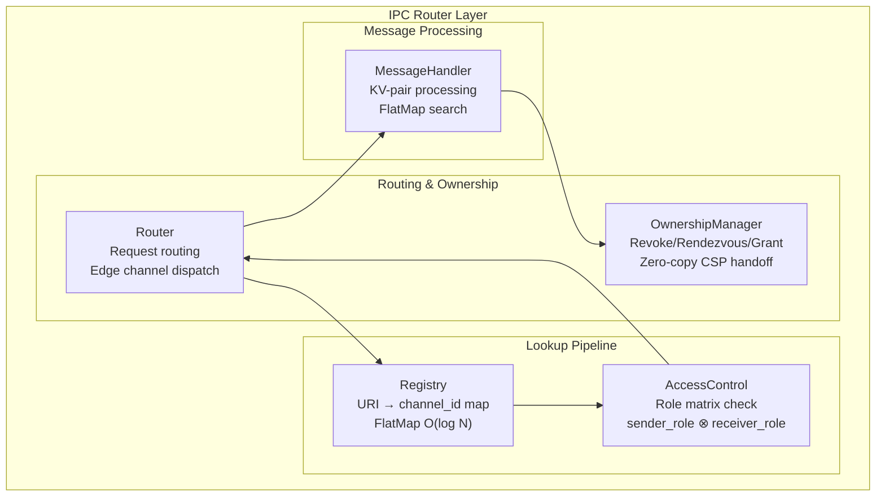
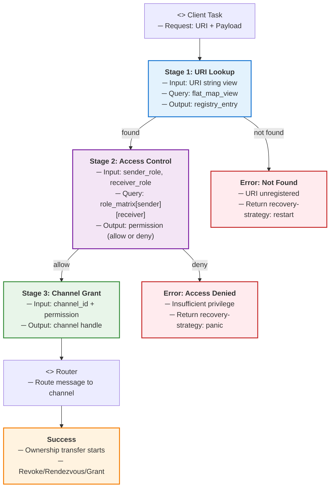
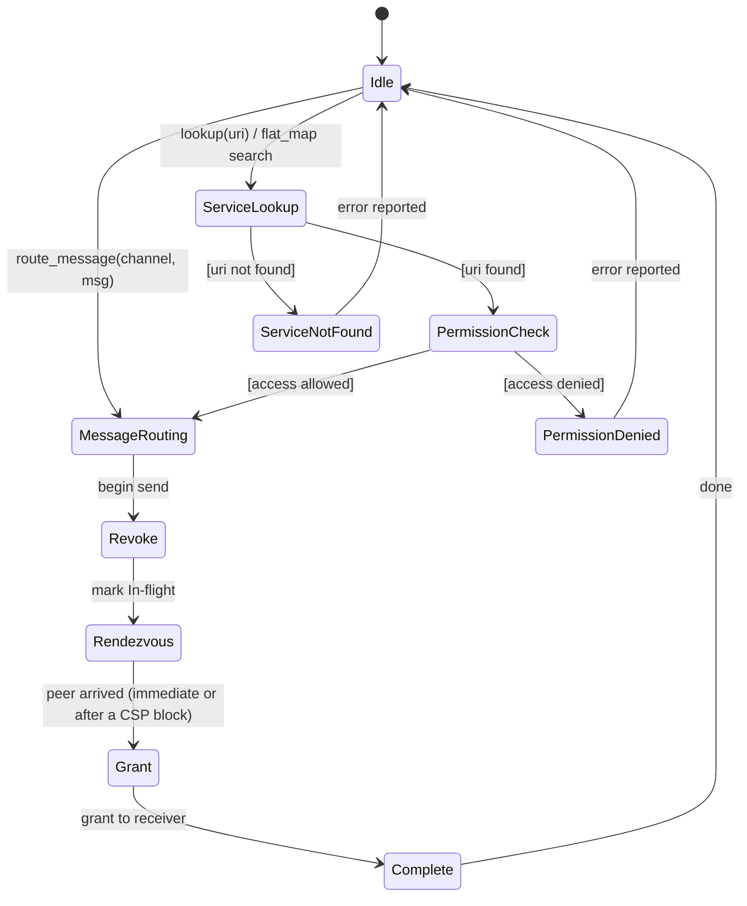
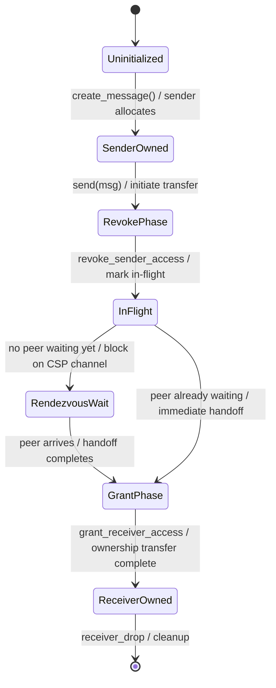
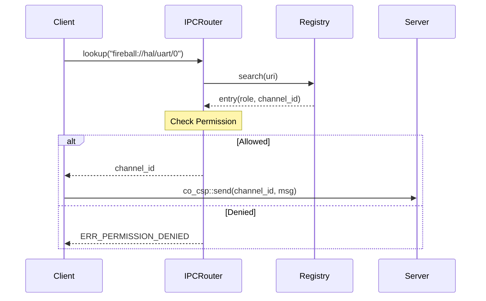
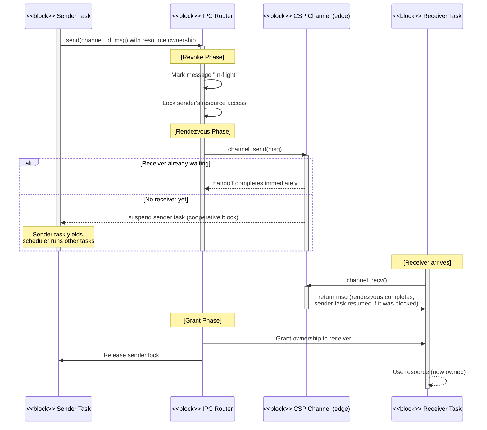

# IPCルータ コンポーネント設計書 {VERIFY_FORMAL} {VERIFY_LLM} {VERIFY_BENCHMARK}
<!-- evidence:
     formal: formal/csp_handoff_model.py
     benchmark: benchmarks/low_latency_lookup_bench.py
     concept: concepts/ipc_router_concept.py
     test: tests/ipc_router_test_spec.md
-->

## 1. コンセプト
<!-- traceability: {IPCRouter} {URIAbstraction} {RoleBasedAccessControl} {OwnershipTransfer} {IPCDI} {IPC_Resource_Isolation} -->
IPCルータは、URIベースのサービスディスカバリとロールベースのアクセス制御を備えたメッセージルーティング層である。コンポーネント間の依存性をURIで抽象化し、所有権移譲を伴う安全なデータ移動とリソースの完全分離を実現する。 `{IPCRouter}` `{URIAbstraction}` `{RoleBasedAccessControl}` `{OwnershipTransfer}` `{IPCDI}` `{IPC_Resource_Isolation}`

## 2. アーキテクチャ分類
<!-- traceability: {META_3TierSeparation} {IPCRouter} {URIAbstraction} -->
本コンポーネントは **Tier 1 (主要システムコンポーネント: Primary Component)** に属する。システム全体の通信基盤として機能し、IoC (Inversion of Control) と URIベースのDIを用いて、コンポーネント間の疎結合性とゼロコピー所有権移譲を統括する。 `{META_3TierSeparation}` `{IPCRouter}` `{URIAbstraction}`

## 3. 静的モデル

### 3.1 データ構造
<!-- traceability: {IPCRegistry} {META_FlatMapIndexed} {RoleBasedAccessControl} -->
- **レジストリエントリ**: 登録されたサービスのURI、ロール、チャンネルIDを保持する。内部的には、ROM 上の `constexpr` ソート済み配列（`FB_CONF_ROUTER_MAX_SERVICES` 件）に対する `fireball::flat_map_view<std::string_view, registry_entry>` を用い、高速なディスパッチを実現する。 `{IPCRegistry}` `{META_FlatMapIndexed}`
- **ロールマトリックス**: コンパイル時に定義された、ロール間の通信許可を判定するマトリックス。 `{RoleBasedAccessControl}`

### 3.2 内部ブロック図
<!-- traceability: {IPCRegistry} {META_FlatMapIndexed} {RoleBasedAccessControl} -->


### 3.3 主要なクラス・構造体・配列・定数
<!-- traceability: {IPCRegistry} {META_FlatMapIndexed} {RoleBasedAccessControl} -->

#### Key-Valueペア（kv_pair）
<!-- traceability: {DictionaryBasedIPC} -->
IPC通信の最小単位。1つのメッセージで8個のペアを送信できる。

| 項目名 | 機能と役割 | 型分類 | サイズ・制約 |
| :--- | :--- | :--- | :--- |
| 型スコープ | 上位3ビットで種別、下位5ビットでデータの型（定数、ID等）を定義する | ビットフラグ | 8bit |
| 識別キー | スコープ（Functional/Dictionary）内でデータの意味を一意に識別する | ID値 | 24bit |
| 属性値 | 実際のデータ本体、あるいはリソースを指すハンドルや即値。「型スコープ」のビットフラグに基づき、静的および動的に解釈される | 値 | 32bit |

**型スコープのビット構成:**

| ビット範囲 | 値 | 意味 |
| :--- | :--- | :--- |
| 上位3ビット（種別） | `0b000` | 機能的 (Functional) — メソッド呼び出しやコマンド指示 |
| | `0b001` | 辞書参照 (Dictionary) — 静的オフセットによるログメッセージ参照 |
| | `0b010` | リソース (Resource) — vDMA や GPIO などの物理・仮想ハードウェア記述子 |
| 下位5ビット（型） | `0b00000` | `void` / 未定義 |
| | `0b00001` | `uint32_t` / 32ビット即値（オフセット等の数値を含む） |
| | `0b00100` | `int32_t` / 32ビット符号付き整数 |
| | `0b00011` | `uint16_t` / 16ビット即値 |

##### スコープ定義
- **機能的IPC**: キーを、受信側が定義する関数やリクエスト種類（WASI 0.3p ドライバ通信コマンド `CMD_STREAM_*`, `CMD_CLOCK_*`, `CMD_GPIO_*`, `CMD_BUS_*` 等）を特定する識別子として使用する。 `{TypeSafeMessaging}`
- **辞書参照IPC**: キーを、受信側が保持する静的な辞書内の文字列オフセットとして解釈する。 `{DictionaryBasedIPC}`
- **階層URIルーティング**: 各デバイスおよびサービスは `fireball://<domain>/<type>/<instance>`（例: `fireball://device/uart/0`, `fireball://device/gpio/0`, `fireball://device/timer/0`, `fireball://device/i2c/0`）の正規化されたURIで登録され、IPCルータを介して $O(\log N)$ でディスパッチされる。 `{URIAbstraction}`

#### IPCメッセージ（message）
<!-- traceability: {TypeSafeMessaging} {META_FlatMapIndexed} {OwnershipTransfer} {ADR_SharedBlockRaii} -->
Key-Valueペアを複数集約した通信の基本単位。メッセージ自身が共有メモリ（`fireball::shared_block`）上に実体化され、内部の `uint64_t` 配列（`uint64_t[]`）をストレージとして直接利用する。動的メモリ確保を一切伴わない物理メモリ上のAoS（Key-Valueペアの `uint64_t` エントリ配列：上位32ビットがキー、下位32ビットが値）と `fireball::flat_map_view` による二分探索を採用し、メッセージ内のキー検索を $O(\log N)$ で行う。エントリやペイロードへのアクセス時には所有権（`SENDER_OWNS` または `RECEIVER_OWNS`）を強制検証する（`IN_FLIGHT` 中のアクセスは禁止）。また、タスクを跨ぐ大きなバルクデータは別の共有メモリ（`fireball::shared_block`）の `shm_id` をエントリの値（`ScopeKind.RESOURCE`）に格納して伝送でき、IPCルータのランデブー完了時に自動で vMMIO PTE の権限付け替え（`grant_shared`）が行われる。 `{TypeSafeMessaging}` `{META_FlatMapIndexed}` `{ADR_SharedBlockRaii}`

| 項目名 | 機能と役割 | 型分類 | サイズ・制約 |
| :--- | :--- | :--- | :--- |
| メッセージ本体ブロック | メッセージ自身を格納する共有メモリブロック。内部は `uint64_t` 配列 | `fireball::shared_block` | 1個（固定長） |
| KVマップ (AoS) | 共有メモリ上に配置されるKey-Valueペアの `uint64_t` 配列。自前で所有しアクセス時に所有権検証 | ソート済み固定長 `uint64_t` 配列 + `fireball::flat_map_view` | 最大8個固定（1エントリ `uint64_t` 1要素） |
| リソース共有メモリ | エントリ値（`ScopeKind.RESOURCE`）に埋め込まれるタスク間バルク転送用RAII共有メモリ。チャネルが所有権を自動Grant | `fireball::shared_block` (オプション) | 任意個数（エントリの値） |

#### レジストリエントリ（registry_entry）
<!-- traceability: {DictionaryBasedIPC} {TypeSafeMessaging} {META_FlatMapIndexed} -->
システム内で公開されているサービスの情報を管理する。

| 項目名 | 機能と役割 | 型分類 | サイズ・制約 |
| :--- | :--- | :--- | :--- |
| サービスURI | サービスを一意に特定するための正規化された文字列 | 文字列ビュー | - |
| セキュリティロール | サービスに割り当てられた権限レベル。アクセス制御と CSP チャネル選択の両方に利用 | ビットフラグ | - |

※ 待ち受けチャネルはレジストリエントリに個別の ID として保持しない。`FB_CONF_ROUTER_ROLE_MATRIX`（4x4）の ALLOW セル 1 つにつき、専用の CSP チャネル（`fireball::channel<ipc_message>`、バッファなし・単一送受信ペアのランデブー）が 1 本ずつ静的に対応付けられ、`(sender_role, target_role)` の組から一意に導出される。1 本のチャネルは 1 対の送受信方向にしか使えないため（`{ADR_RendezvousChannel}`）、同一の受信ロールへ複数の送信ロールから送る場合でも、エッジごとに別々のチャネルを持つ。

## 4. 動的モデル

### 4.1 アルゴリズム
<!-- traceability: {LowLatencyLookup} {META_AccessDictionary} {META_FlatMapIndexed} {OwnershipTransfer} {IPC_ZeroCopy} -->
- **サービス検索**: `fireball::flat_map_view` を用いて、URI文字列からチャンネルIDを $O(\log N)$ で取得する。 `{LowLatencyLookup}`
- **メッセージ内検索**: メッセージ本体をソート済み配列とし `fireball::flat_map_view` で引くことで、受信側でのパラメータ検索を高速化する。 `{META_AccessDictionary}` `{META_FlatMapIndexed}`
- **所有権移譲 (Zero-Copy CSP Handoff)**: `{OwnershipTransfer}` `{IPC_ZeroCopy}` `{ADR_RendezvousChannel}`
    1. **Revoke**: URI 検索・RBAC 判定・サイズ制限チェックをすべて通過した後、送信側タスクの権限を無効化し、リソースを `IN_FLIGHT` 状態にする。この時点で送信は完了確約状態（committed）となる——キューがないため「満杯で差し戻す」という失敗状態は原理的に存在しない。共有メモリ（SHM）転送時は、送信側物理操作 `shm.release()` と連動して対応する vMMIO PTE の `owner_id` が `FB_TASK_ID_FLIGHT`（`0xFF`）に更新され、双方がアクセス禁止となる。
    2. **Rendezvous**: 送信側は `(sender_role, target_role)` エッジ専用の CSP チャネル 1 本上でバッファなし同期ハンドオフを行う。受信側は自らのロールへの ALLOW エッジ全てを同時に待ち受けるガード付き外部選択（select、§5.1「receive_message」参照）であり、`sender_role` 1 つに事前コミットしない。相手側が既に待機していれば即座に、まだ到達していなければ協調スケジューラ上でブロックし、相手が到達した瞬間にハンドオフが成立する。バッファに値を保持しないため、キュー満杯 (`ERR_QUEUE_FULL`) に相当する状態はそもそも発生しない。
    3. **Grant**: ランデブー成立の瞬間に受信側タスクへ権限を付与し、状態を `RECEIVER_OWNS` へ遷移させる。共有メモリ転送時は PTE `owner_id` が受信タスクIDへアトミックに更新され、受信側での `claim(shm-id)` 物理操作が解禁される。
- **送信前チェックの失敗とロールバック境界**: URI 未登録 (`ERR_NOT_FOUND`)、RBAC 拒否 (`ERR_PERMISSION_DENIED`)、KV ペア数超過 (`ERR_MSG_TOO_LARGE`) はいずれも Revoke より前段の静的チェックであり、これらで失敗した場合メッセージの所有権は最初から一度も送信側から動いていない（`SENDER_OWNS` のまま保持され、回復処理を必要としない）。なお、IPC メッセージパッシング自体は CSP ランデブーのためロールバック経路を持たないが、共有メモリ等の物理リソース転送中に相手タスクが異常終了した場合は、物理メモリ層の回復機構（`rollback_transfer()`、§`platform_memory.md`）が連動して PTE `owner_id` を送信元タスクIDへ復元する。

#### IPC ルータ フルセット・コンセプトコード (`concepts/ipc_router_concept.py`)
```python
class Role:
    RUNTIME = 0
    CORE_SERVICE = 1
    PLATFORM_HAL = 2
    DEBUGGER = 3


_ROLE_NAMES = ("RUNTIME", "CORE_SERVICE", "PLATFORM_HAL", "DEBUGGER")


class OwnershipState(IntEnum):
    SENDER_OWNS = 1
    IN_FLIGHT = 2
    RECEIVER_OWNS = 3


class IPCMessage:
    """A message owns its sorted (key, value) entries (AoS) and presents
    them via non-owning FlatMapView (§3.3) -- no resource_id,
    no free-form dict payload."""

    def __init__(
        self,
        entries: Sequence[tuple[Any, Any]] | None = None,
    ):
        self._entries = sorted(entries, key=lambda e: e[0]) if entries is not None else []
        self.ownership = OwnershipState.SENDER_OWNS

    def _check_ownership(self) -> None:
        assert self.ownership in (
            OwnershipState.SENDER_OWNS,
            OwnershipState.RECEIVER_OWNS,
        ), f"Cannot access IPCMessage entries while ownership is {self.ownership.name}!"

    @property
    def entries(self) -> list[tuple[Any, Any]]:
        self._check_ownership()
        return self._entries

    @property
    def payload(self) -> FlatMapView:
        self._check_ownership()
        return FlatMapView(self._entries)

    def __len__(self) -> int:
        self._check_ownership()
        return len(self._entries)


class Channel:
    """Bufferless synchronous CSP rendezvous (`{ADR_RendezvousChannel}`): a
    single in-flight slot, never a bounded queue, so there is no "queue
    full" state to roll back from. (A real cooperative scheduler
    additionally suspends the caller here until the counterpart arrives;
    this concept stays a plain sequential demonstration of the rendezvous
    result.)"""

    def __init__(self):
        self._in_flight: IPCMessage | None = None

    def send(self, message: IPCMessage) -> None:
        assert self._in_flight is None, (
            "one waiter per channel: a second sender must wait for the first handoff"
        )
        self._in_flight = message

    def recv(self) -> IPCMessage | None:
        message = self._in_flight
        self._in_flight = None
        return message


# Stage 1: registry (URI -> role), a sorted array searched via flat_map_view.
_REGISTRY_ENTRIES = sorted(
    [
        ("fireball://core/coos/0", Role.CORE_SERVICE),
        ("fireball://hal/gpio/0", Role.PLATFORM_HAL),
        ("fireball://dbg/manager/0", Role.DEBUGGER),
    ]
)
_REGISTRY = FlatMapView(
    [uri for uri, _ in _REGISTRY_ENTRIES], [role for _, role in _REGISTRY_ENTRIES]
)

# Stage 2: FB_CONF_ROUTER_ROLE_MATRIX (4x4, rows=sender, cols=target); every
# DENY cell is listed explicitly, matching the C++ constexpr array exactly.
_ROLE_MATRIX = (
    (False, True, True, False),  # from RUNTIME
    (False, False, True, False),  # from CORE_SERVICE
    (False, False, False, False),  # from PLATFORM_HAL
    (False, True, True, False),  # from DEBUGGER
)


class IPCRouter:
    def __init__(self, scheduler=None):
        self.scheduler = scheduler
        # Stage 3: one dedicated CSP channel per ALLOW edge of the RBAC matrix.
        self._channels: tuple[tuple["Channel | None", ...], ...] = tuple(
            tuple(Channel() if allowed else None for allowed in row) for row in _ROLE_MATRIX
        )

    def create_channel(
        self, destination: str | int, sender_role: int | None = None
    ) -> "Channel | None":
        """
        Binds current task, resolves destination role via FlatMapView,
        authorizes access via RBAC matrix, and returns dedicated Channel.
        """
        if sender_role is None:
            current = getattr(self.scheduler, "current_task", None)
            sender_role = getattr(current, "role", Role.RUNTIME)

        handle = destination if isinstance(destination, int) else _REGISTRY.find_index(destination)
        if handle < 0:
            return None
        target_role = _SERVICE_DESCRIPTORS[handle].role

        if not _ROLE_MATRIX[sender_role][target_role]:
            return None
        return self._channels[sender_role][target_role]

    def send(self, sender_role: int, uri: str, message: IPCMessage) -> tuple[IpcStatus, str]:
        """3-stage IPC send: URI lookup -> RBAC -> CSP rendezvous handoff."""
        assert message.ownership == OwnershipState.SENDER_OWNS

        channel = self.create_channel(uri, sender_role=sender_role)
        if channel is None:
            handle = _REGISTRY.find_index(uri)
            if handle < 0:
                return (IpcStatus.ERR_NOT_FOUND, f"URI not registered: {uri}")
            target_role = _SERVICE_DESCRIPTORS[handle].role
            return (
                IpcStatus.ERR_PERMISSION_DENIED,
                f"Forbidden: {_ROLE_NAMES[sender_role]} -> {_ROLE_NAMES[target_role]}",
            )

        # Stage 3: Zero-Copy CSP Handoff directly on authorized Channel
        message.ownership = OwnershipState.IN_FLIGHT
        channel.send(message)
        return (
            IpcStatus.COMPLETED,
            f"{_ROLE_NAMES[sender_role]}: in-flight",
        )

    def receive(self, target_role: int) -> IPCMessage | None:
        """
        Guarded external choice (select): checks every ALLOW edge into
        target_role in order and returns the first one with a message
        ready, never committing to one sender_role upfront -- CORE_SERVICE,
        for example, may legitimately be sent to by both RUNTIME and
        DEBUGGER. Grant happens on whichever edge actually has a message.
        """
        for sender_role in range(len(_ROLE_MATRIX)):
            channel = self._channels[sender_role][target_role]
            if channel is None:
                continue
            message = channel.recv()
            if message is not None:
                message.ownership = OwnershipState.RECEIVER_OWNS
                return message
        return None
```

※ 所有権移譲プロトコルの二重所有不在および有限解決性は、`formal/csp_handoff_model.py` により変異検査付き形式モデルとして検証される。トポロジレベルのデッドロック不在は、非循環チャネル依存規律（クライアント・サーバ規律）により設計上保証される（自動検証ツールでの機械的な閉路検査は行っておらず、設計レビューによる担保）。

### 4.1.1 名前解決パイプラインとアクセス制御フロー
<!-- traceability: {LowLatencyLookup} {META_AccessDictionary} {META_FlatMapIndexed} {RoleBasedAccessControl} -->

IPC ルータの名前解決は、URI からサービスディスクリプタ（チャネルIDと権限情報）を導出するクリティカルパスである。以下の 3 段階パイプラインで実現される。



**各ステージの詳細:**

| ステージ | 処理 | 複雑度 | 制約 |
| :--- | :--- | :--- | :--- |
| **URI Lookup** | `fireball::flat_map_view` による二分探索 | O(log N) | N = サービス数（通常 ≤ 16）。動的確保なし。 |
| **Access Control** | ロールマトリックス参照 `role_matrix[sender][receiver]` | O(1) | 事前計算済みの2次元配列による静的検査。 |
| **Channel Grant** | `(sender_role, target_role)` エッジに対応する専用 CSP チャネルを選択 | O(1) | チャネルはロールの組から直接導出（4x4 配列参照）、レジストリに個別保存しない。 |

#### ロール間通信許可マトリクス (FB_CONF_ROUTER_ROLE_MATRIX)
<!-- traceability: {RoleBasedAccessControl} -->

本表は `{META_ConfigurableSystem}` の `FB_CONF_ROUTER_ROLE_MATRIX` (4x4 `constexpr` 配列) を**そのまま**表現したものであり、全 DENY の行・列も省略しない。省略すると「そのロールの権限が未定義」と読めてしまい、C++ 定義との差分が生じるためである。

| 送信元ロール (Sender) \ 送信先ロール (Target) | RUNTIME | CORE_SERVICE | PLATFORM_HAL | DEBUGGER |
| :--- | :---: | :---: | :---: | :---: |
| **RUNTIME** | DENY | ALLOW | ALLOW | DENY |
| **CORE_SERVICE** | DENY | DENY | ALLOW | DENY |
| **PLATFORM_HAL** | DENY | DENY | DENY | DENY |
| **DEBUGGER** | DENY | ALLOW | ALLOW | DENY |

**全 DENY 行・列の意味**:
- **PLATFORM_HAL 行が全 DENY**: HAL は通信グラフの葉であり、自発的な送信を一切行わない。デバイス側の事象は ISR による割り込み通知（`{GLOBAL_InterruptWakeup}`）として上位へ伝わり、IPC の送信としては表現されない。
- **RUNTIME 列が全 DENY**: RUNTIME（ゲスト実行をホストするランタイムタスク。ゲスト自身のコードが直接 IPC に触れるわけではない）を宛先とする IPC は存在しない。RUNTIME への応答は、RUNTIME 自身が発した要求に対する返信としてのみ返る。

※ 送信許可（ALLOW）の関係から構築される通信有向グラフ（`RUNTIME -> CORE_SERVICE`, `RUNTIME -> PLATFORM_HAL`, `CORE_SERVICE -> PLATFORM_HAL`, `DEBUGGER -> CORE_SERVICE`, `DEBUGGER -> PLATFORM_HAL`）は非循環（DAG）であり、循環通信待機（Circular Wait）によるデッドロックがトポロジ層で原理的に排除される。

### 4.2 状態遷移図 (SysML SMD: IPC Router ルーティングフロー)
<!-- traceability: {LowLatencyLookup} {META_AccessDictionary} {META_FlatMapIndexed} {OwnershipTransfer} {IPC_ZeroCopy} -->

IPC ルータの各ルーティング操作における状態遷移を以下に示す。



**ルーティング状態の説明:**

| 状態 | 説明 | 主要アクション |
| :--- | :--- | :--- |
| **Idle** | 初期待機状態 | - |
| **Service Lookup** | URI文字列をレジストリで検索 | `fireball::flat_map_view` による $O(\log N)$ 二分探索 |
| **Permission Check** | 送信側ロールと受信側ロールのマトリックスで許可判定 | ロールマトリックス参照 |
| **Message Routing** | 送信メッセージの転送処理 | エッジ専用 CSP チャネルへのディスパッチ |
| **Ownership Transfer** | ゼロコピー CSP ハンドオフの所有権移譲フロー | 3段階：Revoke → Rendezvous → Grant |
| **Revoke** | 送信側の権限を無効化、In-flight 状態へ遷移 | リソースロック設定（この時点で送信は完了確約） |
| **Rendezvous** | バッファなし同期ハンドオフ。相手が既に待機していれば即座に、いなければ協調スケジューラ上でブロックして待つ | CSP チャネル上での 1 対 1 ハンドオフ（キューは存在しないため満杯状態も存在しない） |
| **Grant** | 受信側にリソースの権限を付与 | 所有権ハンドシェイク完了 |
| **Complete** | ルーティング完了 | メッセージ処理の次ステップへ |
| **Service Not Found** | 指定 URI が未登録 | エラー応答を呼び出し側に返却 |

### 4.2.1 所有権移譲状態機械 (Ownership Transfer State Machine)
<!-- traceability: {OwnershipTransfer} {IPC_ZeroCopy} -->

メッセージの所有権は、送信側 → ルータ → 受信側という 3 段階で遷移する。以下の状態機械は、所有権の状態を形式的に定義する。



**所有権状態の説明:**

| 状態 (State) | 所有者 (Owner) | アクセス権 | リソース状態 | 説明（共有メモリ連携含む） |
| :--- | :--- | :--- | :--- | :--- |
| **SenderOwned** (`SENDER_OWNS`) | Sender | Full (R/W) | 安定 | 送信側が完全な制御を持つ。SHM: PTE `owner_id = sender_id` |
| **RevokePhase** | (移譲中) | Sender ロック中 | 遷移中 | 所有権を剥奪（Revoke）中。この時点で送信は完了確約（committed）となる。SHM: `shm.release()` 実行中 |
| **InFlight** (`IN_FLIGHT`) | Router / チャネル | いずれもアクセス禁止 | 仲介中 | チャネルが一時保管、送受信側いずれもアクセス禁止。SHM: PTE `owner_id = FB_TASK_ID_FLIGHT` (0xFF) |
| **RendezvousWait** | (移譲中) | In-flight 継続 | 協調ブロック中 | 相手側タスクがまだ到達しておらず、協調スケジューラ上でブロック中。タイムアウトや失敗はなく、相手の到達を待つのみ |
| **GrantPhase** | (移譲中) | Receiver 取得中 | 遷移中 | 受信側にアクセス権を付与中。SHM: PTE `owner_id = receiver_id` へのアトミック更新中 |
| **ReceiverOwned** (`RECEIVER_OWNS`) | Receiver | Full (R/W) | 安定 | 受信側が完全な制御を持つ。SHM: 受信側で `claim(shm-id)` 完了 |

### 4.3 メッセージライフサイクルと所有権管理 (SysML Parametric Diagram 相当)

メッセージが IPC ルータを通じて送信されてから受信されるまでの各段階と、所有権の状態遷移を以下の表で定義する。

| フェーズ | メッセージ状態 | 所有権 (Ownership) | 送信側タスク | 受信側タスク | リソース保護（SHM連動） |
| :--- | :--- | :--- | :--- | :--- | :--- |
| **初期** | 送信側で生成 | 送信側所有 (`SENDER_OWNS`) | RUNNING | BLOCKED/READY | PTE `owner_id = sender_id` |
| **Revoke** | チャネルへ到達、送信確約 | 移譲中 (`IN_FLIGHT`) へ遷移 | **アクセス権剥奪（送信ロック）** | 待機中または未到達 | `shm.release()` 連動、PTE `owner_id = FB_TASK_ID_FLIGHT` |
| **Rendezvous** | 相手の到達を待機（即座または協調ブロック） | 移譲中 (`IN_FLIGHT`) 継続 | **送信ロック継続** | 到達済みなら即完了、未到達ならブロック中 | 単一スロットのハンドオフ管理（キューなし、両者アクセス禁止） |
| **Grant（成功）** | ランデブー成立 | 受信側へ移譲 (`RECEIVER_OWNS`) | **送信ロック解除（手放し完了）** | **所有権付与（受信完了）** | PTE `owner_id = receiver_id`、受信側 `claim()` 解禁 |

**注記:**
- **In-flight 状態**: メッセージがチャネル上でランデブー成立待ちの状態で、送信側は操作できない状態。ダングリング参照を防止。
- **所有権移譲とゼロコピー (`IPC_ZeroCopy`)**: チャネルの所有権移譲（Grant）が行われる際、メモリデータの物理コピーは一切発生せず、ゲストRAM上のメッセージバッファを指す相対オフセットポインタの所有権（TCB所有フラグ）を送信側から受信側へ移転させることで、極小レイテンシかつゼロコピーのデータ転送を実現する。 `{IPC_ZeroCopy}`
- **キューが存在しないことの帰結**: 本 API はバッファなし同期ランデブー（`{ADR_RendezvousChannel}`）であるため、受信側が Kill された場合に回収すべき「キュー内の未受領メッセージ」は存在しない——In-flight 状態のメッセージは常に送信側タスク自身のスタック上（ブロック中のコルーチン）に留まり、送信側タスクの終了処理がそのまま資源回収を兼ねる。受信側が永久に到達しない場合、送信側タスクはブロックし続ける（協調スケジューラのタスクキル/タイムアウト機構による救済は本コンポーネントの範囲外）。

### 4.3.1 二分探索による O(log N) 低遅延ルックアップ
<!-- traceability: {LowLatencyLookup} {META_AccessDictionary} {META_FlatMapIndexed} -->
* **サービス検索**: サービスレジストリ（URI から channel_id への解決）は、コンパイル時にソートされた URI 文字列スパンに対して二分探索を行うことで、動的なアロケーションを行うことなく $O(\log N)$ の低遅延名前解決を達成する。`ipc_router_concept.py` の `IPCRouter.registry` は `fireball::flat_map_view`（`{META_FlatMapIndexed}` の `FlatMapView`）そのものであり、`find()` による二分探索でルックアップする——辞書ベース実装からの移行は完了している。実測は [`benchmarks/low_latency_lookup_bench.py`](benchmarks/low_latency_lookup_bench.py)（同一の `FlatMapView` を直接計測、線形探索比較付き）を参照。この計測は IPC ルータの実サービス数（通常 ≤ 16）ではなく $O(\log N)$ の漸近的な成長特性そのものを N=1,000〜1,000,000 の範囲で検証するものであり、キー数を1000倍にしても `flat_map_view` のルックアップ時間は約2.0倍（$\log_2(10^6)/\log_2(10^3) = 2$、線形探索は約1,100倍）の増加に留まり、二分探索の理論的計算量と完全に合致することを実測している。 `{LowLatencyLookup}`
* **メッセージ内検索**: メッセージの引数（KVマップ）は、キー値を昇順にソートした固定長配列（静的 flat_map 構造）として実装され、受信側でのパラメータ探索に $O(\log N)$ の二分探索を適用し、ゼロコスト抽象化を保証する。 `{META_AccessDictionary}` `{META_FlatMapIndexed}`

### 4.3.2 CSP Handoff スターベーション防止対策
<!-- traceability: {Challenge_CspHandoffStarvation} -->
CSP Handoff による直接のコンテキストスイッチを伴うメッセージ移譲において、特定の送受信タスクのペアが CPU 実行時間を占有して他のタスクがスターベーション（実行飢餓）に陥るのを防ぐため、以下のガード条件を適用する。
1. **最大連続ハンドオフ回数の制限**: 直接の実行権移譲（Handoff）が連続して `FB_CONF_MAX_CONSECUTIVE_HANDOFFS` 回に達した場合、強制的に READY キュー末尾へ自タスクを yield させ、一度スケジューラによるラウンドロビン巡回（メインループ復帰）をトリガーする。
2. **タイムスライス閾値監視**: タイマードライバの Tick カウントに基づき、前回のスケジュールから一定時間（例: 10ms）以上経過している場合は、直接スイッチを行わず、いったんスケジューラの通常のラウンドロビン巡回に自タスクを戻す。CSP チャネル自体にはキューが存在しないため、これは「別経路（キュー）へのフォールバック」ではなく、同じランデブーを次の巡回で改めて試みるだけの単純な yield である。 `{Challenge_CspHandoffStarvation}`

### 4.4 内部シーケンス図
<!-- traceability: {LowLatencyLookup} {META_AccessDictionary} {META_FlatMapIndexed} {OwnershipTransfer} {IPC_ZeroCopy} -->

#### サービス検索と接続フロー
<!-- traceability: {LowLatencyLookup} {META_AccessDictionary} {RoleBasedAccessControl} {IPCRouter} -->


#### 所有権移譲フロー (Zero-Copy CSP Handoff)


**フロー説明:**
1. **Revoke**: 送信側がルータへ到達した瞬間（URI 検索・RBAC・サイズチェックをすべて通過した後）に、メッセージ状態を「In-flight」に変更し、送信側からのアクセス権（読み書き権限）を無効化（ロック）する。これにより送信は完了確約状態となり、キュー満杯のような事後的な失敗は原理的に存在しない。
2. **Rendezvous**: `(sender_role, target_role)` エッジ専用の CSP チャネル上でバッファなしの同期ハンドオフを試みる。受信側タスクが既に待機していれば即座に完了し、まだ到達していなければ送信側タスクは協調スケジューラ上でブロックし、受信側が到達した瞬間にランデブーが成立する。メッセージはバッファに滞留しない——値を保持するのは「相手が既に待っているか」という 1 ビットの状態のみである。
3. **Grant**: ランデブーが成立した瞬間に、受信側に対して所有権（アクセス権）を付与（有効化）し、メッセージの In-flight 状態を解除して送信側ロックを物理的にリリースする。

## 5. インターフェース定義

### 5.1 公開API
外部から利用可能なオブジェクト指向APIを定義する。

#### サービス登録（register_service）

| 項目 | 内容 |
| :--- | :--- |
| 機能概要 | サービス固有のURIと、それを処理するチャネルおよびロールを関連付けて登録する。 |
| シグネチャ | `register_service(uri: 文字列ビュー, role: ビットフラグ, channel: ID値) -> 結果型` |
| 引数 | `uri`: サービスURI<br>`role`: アクセス権限<br>`channel`: 通信チャネル |
| 戻り値 | 結果型 (成功時は空、失敗時はエラー) |
| 事前条件 | レジストリに空きがあること。URIが重複していないこと。 |
| 事後条件 | レジストリがURI順に維持され、高速検索が保証される。 |

#### サービス検索（lookup_service）
<!-- traceability: {IPC_HandleBased} -->

| 項目 | 内容 |
| :--- | :--- |
| 機能概要 | 指定されたURIに対応する通信用チャネルIDを取得する。同時に送信側の権限チェックを行う。 |
| シグネチャ | `lookup_service(uri: 文字列ビュー) -> オプショナル値` |
| 引数 | `uri`: 検索対象のサービスURI |
| 戻り値 | オプショナル値 (成功時は `channel_id`, 失敗時は空) |
| エラー時の挙動 | 見つからない場合はエラーを、権限がない場合は拒否を通知する。 |
| 補足 | `{IPC_HandleBased}` のため、クライアントはこのIDをキャッシュして利用することが推奨される。 |

#### メッセージルーティング（route_message）
<!-- traceability: {OwnershipTransfer} {IPC_ZeroCopy} {ADR_RendezvousChannel} -->

**COOS の CSP チャネルと同一の機構**: 本 API は `{ADR_RendezvousChannel}` が定めるバッファなし同期ランデブーそのものであり、`(sender_role, target_role)` の RBAC エッジ 1 本につき専用の CSP チャネルを持つ。値を保持するバッファが存在しないため、有界キューにおける「満杯」状態は原理的に発生しない。本 API は `{CSP_Handoff}` を主張する。

| 項目 | 内容 |
| :--- | :--- |
| 機能概要 | 送信先サービスの `(sender_role, target_role)` エッジ専用 CSP チャネル上で、リソースの所有権を Revoke/Rendezvous/Grant の順で移譲する。相手が未到達の場合は協調スケジューラ上でブロックし、相手到達時に必ず完了する（キューが存在しないため失敗して差し戻る経路はない）。 `{OwnershipTransfer}` `{IPC_ZeroCopy}` `{ADR_RendezvousChannel}` |
| シグネチャ | `route_message(channel: ID値, msg: ipc-message) -> operation-result` |
| 引数 | `channel`: 送信先ID<br>`msg`: 送信メッセージ (`ipc-message`) |
| 戻り値 | 操作結果を示す `operation-result`（成功時は `COMPLETED` を返し、メッセージのKey-Valueペア数が8個の静的制限を超えている場合は `ERR_MSG_TOO_LARGE`、送信先URIが未登録の場合は `ERR_NOT_FOUND`、RBAC で拒否された場合は `ERR_PERMISSION_DENIED` を返す） |
| エラー時の挙動 | `ERR_MSG_TOO_LARGE`/`ERR_NOT_FOUND`/`ERR_PERMISSION_DENIED` はいずれも Revoke より前段の静的チェックであり、これらで失敗した場合メッセージの所有権は送信側から一度も動いていない（Rollback のような事後的な回復処理を必要としない）。Revoke 後は失敗経路が存在せず、相手の到達を待つのみである。 |

#### メッセージ受信（receive_message）
<!-- traceability: {OwnershipTransfer} {IPC_ZeroCopy} {ADR_RendezvousChannel} -->

**ガード付き外部選択（Guarded External Choice / Select）**: 受信側は自らの URI が持つロールへの全 ALLOW エッジ（RBAC マトリックスの該当列）を同時に待ち受け、最初に到達した送信側とランデブーする。1 つの `sender_role` に事前にコミットしない——例えば `CORE_SERVICE` は `RUNTIME` と `DEBUGGER` の双方から正当に送信され得るため、受信側がどちらか一方だけを待つ設計は現実のサービスとして機能しない。複数チャネルへの同時登録は、成立した瞬間に他の全チャネルから解除される（`experiments/pysim/core/scheduler.py` の `channel_select_recv` / `SelectGroup` 参照）ため、1 チャネル 1 待機者の不変条件は破られない。

| 項目 | 内容 |
| :--- | :--- |
| 機能概要 | 呼び出し元自身の URI が解決するロールへの、RBAC で許可された全エッジの専用 CSP チャネルに対してガード付き外部選択を行い、最初に到達した送信側とランデブーする（Grant）。相手がまだ誰も到達していなければ協調スケジューラ上でブロックし、いずれかの送信側到達時に必ず完了する。 `{OwnershipTransfer}` `{IPC_ZeroCopy}` `{ADR_RendezvousChannel}` |
| シグネチャ | `receive_message(uri: 文字列ビュー) -> result<ipc-message, operation-result>` |
| 引数 | `uri`: 自らが提供するサービスの URI（送信元は指定しない——許可された送信元のいずれからでも受信できる） |
| 戻り値 | 成功時は受信した `ipc-message`（所有権は呼び出し元に移譲済み）。失敗時は `operation-result`（送信先URIが未登録の場合は `ERR_NOT_FOUND`、RBAC 上どの送信元からも許可されていない場合は `ERR_PERMISSION_DENIED`） |
| エラー時の挙動 | `ERR_NOT_FOUND`/`ERR_PERMISSION_DENIED` はチャネル選択より前段の静的チェックであり、これらで失敗した場合はブロックすら発生しない。 |

### 5.2 URI/IPCインターフェース
<!-- traceability: {TypeSafeMessaging} -->
- **URI形式**: `fireball://<subsystem_id>/<stream>/<instance_id>`
- **メッセージ形式**: `fireball::flat_map_view` を用いた、最大8要素の型安全なKey-Value構造。定数や識別キーの型安全なパッキングをサポートし、動的なアロケーションを行うことなく動作する。 `{TypeSafeMessaging}`

### 5.3 サービスファサード
<!-- traceability: {ServiceFacade} {IoC} -->
IPCのプリミティブ性を隠蔽し、依存性の逆転 (IoC) を実現するため、サービスの利用側（内側の層）がファサードクラスを定義する。ファサードの各メソッドは、KVマップへの生のパッキング/アンパッキングを外部に露出せず、引数・戻り値の型をシグネチャとして静的に固定した型安全なメソッドとして提供する（内部変換は `{TypeSafeMessaging}` の型安全な Key-Value 構造を利用する）。呼び出し側は `kv_pair` の型スコープやビットフラグを直接扱わない。 `{ServiceFacade}` `{IoC}`

## 6. 形式検証（pyModelChecking / 直交表）

### 6.1 検証対象の不変条件

<!-- traceability: {IPC_ZeroCopy} -->

| 不変条件 | 説明 | 検証方法 |
| :--- | :--- | :--- |
| **所有権単調性** | リソース所有権が Sender → In-flight → Receiver と一方向に移譲され、二重所有が発生しないこと。`{OwnershipTransfer}` `{IPC_ZeroCopy}` | `formal/csp_handoff_model.py` CTL 安全性検証 (`AG(Not(sender_owns & receiver_owns))` ➔ True) |
| **デッドロック不在** | クライアント・サーバ規律（非循環チャネル依存）により、Send/Recv の循環待ちデッドロックが発生しないこと。`{RoleBasedAccessControl}` | 設計レビュー（自動の機械的閉路検査ツールは無し） |
| **In-flight 有限解決性** | In-flight 状態のリソースは、相手タスクが到達し Rendezvous/Grant が成立することで必ず解決すること（相手が永久に到達しない場合を除く——本コンポーネントはタスクの生存を保証しない）。`{ADR_RendezvousChannel}` | `formal/csp_handoff_model.py` CTL 進行性検証 (`AG(in_flight -> AF(not in_flight))` ➔ True、相手タスクが有限時間内に到達するという公正性仮定の下で) |
| **単一待機者制約** | 1 本の CSP チャネルは同時に高々 1 つの送信待機または受信待機しか保持しない（キューではない）こと。 | `formal/csp_handoff_model.py` 不変式検証（二重待機の禁止） |

### 6.2 検証対象のプロパティ

- **Safety**: 
  - 二重所有不在（所有権競合不在）`{IPC_ZeroCopy}`
  - 単一待機者制約（1 チャネルにつき送信待機・受信待機のいずれか高々 1 つ、キュー化されない）
- **Liveness**: 
  - In-flight 状態の有限解決性（相手タスクの到達による Rendezvous/Grant）

### 6.3 検証モデル概要

**状態変数:**
```
sender_ownership: {OWNED, REVOKED, IN_FLIGHT}
receiver_ownership: {NOTOWNED, IN_FLIGHT, OWNED}
channel_slot: message | None       # 高々1件、キューではない
waiter_dir: {NONE, SEND, RECV}     # そのチャネルで待機中の方向
interrupt_flags: bitmask
```

**初期状態:** sender_ownership=OWNED, receiver_ownership=NOTOWNED, channel_slot=None, waiter_dir=NONE, interrupt_flags=0

**遷移:** Send → Revoke → Rendezvous（相手待機中なら即時 Grant、未到達ならブロックして相手の Recv/Send 到達を待つ）→ Grant

**不変式:** 
- `sender_ownership != OWNED ∨ receiver_ownership != OWNED` (二重所有不在)
- `waiter_dir != SEND ∨ waiter_dir != RECV`（同時に両方向の待機者を持たない。値は排他的な列挙のため常に真——ある瞬間のチャネルは NONE/SEND/RECV のいずれか一状態のみ）

※ CSP 所有権移譲プロトコルの二重所有不在および有限解決性は `formal/csp_handoff_model.py` により変異検査付きモデル検査を実施する。

### 6.4 既知の制限

- **マルチプロセッサ同期**: 現在、シングルプロセッサを仮定。マルチコア環境ではメモリバリア追加が必要。
- **相手タスクの生存**: 受信側（または送信側）タスクが永久に到達しない場合、相手はブロックし続ける。本コンポーネントはタスクの生存監視やタイムアウトによる強制解除を提供しない——必要であれば呼び出し側の上位レイヤ（ウォッチドッグ等）が担う。

## 7. 制約達成の方策

### 7.1 性能制約と方策
<!-- traceability: {LowLatencyLookup} -->
- **目標**: サービス検索のレイテンシを最小化する。
- **方策**: `{LowLatencyLookup}` ソート済み配列の二分探索を採用する。

### 7.2 メモリ制約と方策
<!-- traceability: {META_BumpAllocator} {GLOBAL_StaticScalability} -->
- **目標**: レジストリ管理によるメモリ断片化を防止する。
- **方策**: `{META_BumpAllocator}` `{GLOBAL_StaticScalability}` バンプアロケータを使用し、最大サービス数をコンパイル時に固定する。

### 7.3 安全性制約と方策
<!-- traceability: {RoleBasedAccessControl} {OwnershipTransfer} -->
- **目標**: 不正なタスク間通信を防止する。
- **方策**: `{RoleBasedAccessControl}` `{OwnershipTransfer}` ロールベースの認可と、厳密な所有権管理により、データ競合と不正アクセスを排除する。
