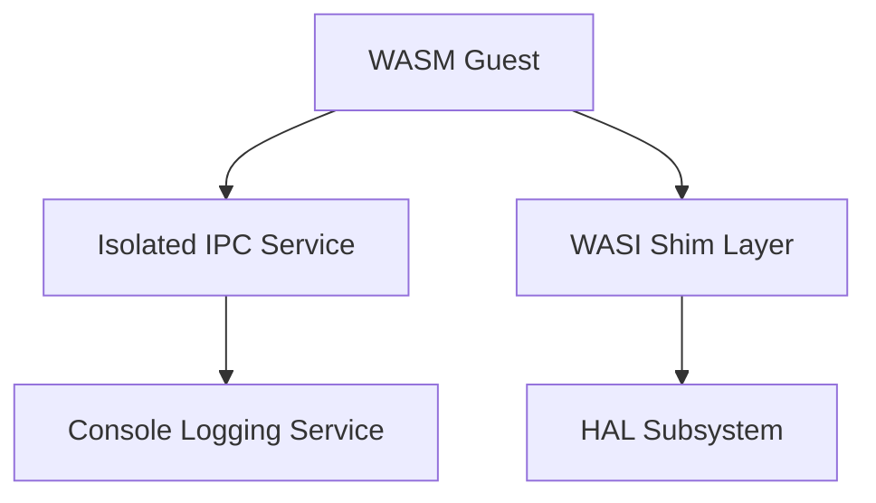
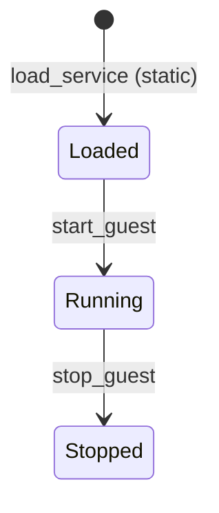
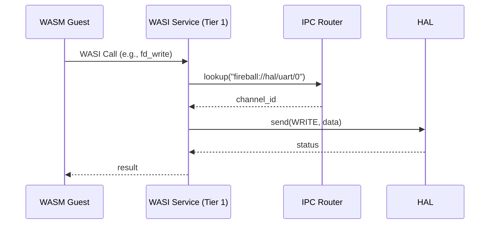

# サービス コンポーネント設計書 {VERIFY_LLM} {VERIFY_FORMAL}
<!-- evidence:
     formal: formal/service_fault_isolation_model.py
     test: tests/system_service_test_spec.md
-->

## 1. コンセプト
<!-- traceability: {META_FaultIsolation} {MemoryIsolation} {IPCRouter} -->
サービスは、WASMゲストに対してシステム機能（WASI、ロギング、HALデバイス等）を提供するコンポーネントである。IPCルータを経由したゼロコピー通信によってタスク分離を行い、障害隔離とメモリ安全性を確保する。 `{META_FaultIsolation}` `{MemoryIsolation}` `{IPCRouter}`

## 2. アーキテクチャ分類
<!-- traceability: {META_3TierSeparation} {IPCRouter} {URIAbstraction} -->
本コンポーネントは **Tier 1 (主要システムコンポーネント: Primary Component)** に属する。ゲストWASMに対する抽象化されたサービスレイヤを提供し、IoC (Inversion of Control) と URIベースのDIを用いて、機能拡張性と隔離性を統括する。 `{META_3TierSeparation}` `{IPCRouter}` `{URIAbstraction}`

## 3. 静的モデル

### 3.1 データ構造
- **サービスレジストリ**: システム起動時に構成ファイルから静的に構築され、ロードされているサービスの情報（URI、Tier、エントリポイント）のインデックスを管理する不変の構造体。

### 3.2 内部ブロック図


### 3.3 主要なクラス・構造体・配列・定数

#### サービス定義（service）
システムが管理する個別のサービスの属性。

| 項目名 | 機能と役割 | 型分類 | サイズ・制約 |
| :--- | :--- | :--- | :--- |
| サービス名称 | サービスを識別するための共通のシステム名 | 文字列ビュー | - |
| 識別URI | ルータを介して公開される、サービスを指し示す唯一の正規名称 | 文字列ビュー | - |

#### サービス構成（service_config）
<!-- traceability: {META_ConfigurableSystem} -->
ヘッダファイルのマクロ定義によりシステム全体のパラメータおよび初期ロード構成をコンパイル時に固定する設定。 `{META_ConfigurableSystem}`

| 項目名 | 機能と役割 | 型分類 | サイズ・制約 |
| :--- | :--- | :--- | :--- |
| ゲスト識別子 | 構成設定が適用されるWASMゲストの管理ID | ID値 | 32bit |
| ロード対象リスト | ゲスト起動時に自動的に接続・初期化されるサービスのURI一覧 | `std::span<const std::string_view>` | 固定長配列へのスパン |

## 4. 動的モデル

### 4.1 アルゴリズム
<!-- traceability: {META_FaultIsolation} {IPCRouter} {SelfReboot_via_Event} {ServiceSelfReboot} {FaultTolerant} -->
- **サービス分離**: 各サービスは独立したタスクとして動作し、IPCルータを介してゼロコピーで通信する。タスク単位の障害局所化（`{META_FaultIsolation}`）と自己再起動（`{SelfReboot_via_Event}`）を組み合わせることで、単一サービスの異常終了が他サービスへ波及せず、かつ自律的に復旧するフォールトトレラント設計を実現する。 `{META_FaultIsolation}` `{FaultTolerant}`
- **WASI呼び出し**: ゲストからのWASIシステムコールを、HALのIPCコマンドへ変換して転送する。 `{IPCRouter}`
- **自己再起動**: 異常終了したサービスは、IPCルータまたは上位マネージャからの障害イベント通知を契機として自律的に初期化・再起動される。TCBスロットの状態をリセットし、当該サービスのみを再初期化する（他サービスやシステム全体への波及はない）。 `{SelfReboot_via_Event}` `{ServiceSelfReboot}`

### 4.2 状態遷移図
<!-- traceability: {META_FaultIsolation} {IPCRouter} -->


WASIおよび独立アイソレーション・サービスは、起動時にそれぞれ独立した物理メモリパーティションを割り当てられ、メモリのハードウェア境界が確立される（障害伝播防止）。すべてのサービスへのアクセスおよびシステムコール呼び出しは、必ずIPCルータ（`IPCRouter`）のルックアップおよびアクセス制御チェックを経由してのみ開始される。 `{META_FaultIsolation}` `{IPCRouter}`

※ `load_service (static)` における `static` とは、システムビルド時にコンフィグによって登録されたサービス一覧に基づき、実行時の動的なURI追加を行わずに、起動時に固定配列からサービスをロードする静的ロード処理を意味する。

### 4.3 内部シーケンス
<!-- traceability: {META_FaultIsolation} {IPCRouter} -->
#### WASI呼び出しシーケンス


ゲストWASMタスクとWASIサービス、およびHAL間は、メモリ空間がメモリパーティションによって相互に保護されている。WASIサービスがゲストメモリ上のデータ（例: `fd_write` で書き込むバッファ）にアクセスする際は、ホストが提供するメモリ境界検証ロジックを通過した上で、IPCルータ（`IPCRouter`）が仲介する所有権移譲ベースのゼロコピー通信（Handoff）によって安全にデータが HAL に引き渡される。 `{META_FaultIsolation}` `{IPCRouter}`

### 4.4 WASI API から HAL への変換ラッパー (コンセプトコード)
<!-- traceability: {META_FaultIsolation} {IPCRouter} -->

WASMゲストが呼び出す同期的な標準インターフェース (WASI) を、非同期でロールベースな基盤である「HAL（IPCコマンド）」へ変換・中継する Tier 0 ラッパーのコア構造。
この擬似コードは、同期I/O要求と非同期実行基盤のインピーダンスミスマッチを解消するプロトコルを示す。

```python
# API プロトタイプおよび擬似型定義:
# struct Context: タスクの実行コンテキスト情報を保持する構造体
# struct ChannelID: 通信チャネルを一意に特定するID値
# def get_current_execution_context() -> Context: 実行中のタスクコンテキストを取得する
# def resolve_wasi_fd_to_channel(ctx: Context, fd: int) -> ChannelID: FDからチャネルIDを解決する

# wasi_service.py (Tier 0: 直接リンクされるシステム関数)

# WASI fd_write のシグネチャ (WASMから直接呼ばれるネイティブ関数)
def wasi_fd_write(fd: int, iovs: std.span[WasiIov], iovs_len: int, nwritten_ptr: int) -> int:
    # 1. 環境ポインタ（Context）の取得
    ctx = get_current_execution_context()
    
    # 2. FDからIPCチャネルへの解決 (Virtual File System Lookup)
    target_channel = resolve_wasi_fd_to_channel(ctx, fd)
    if target_channel == INVALID_CHANNEL:
        return WASI_ERRNO_BADF
    
    # 3. メモリ境界チェック (Tier 1 セキュリティゲートへの事前検証)
    if not ctx.memory_bounds_check(iovs, sizeof(WasiIov) * iovs_len):
        return WASI_ERRNO_FAULT

    total_written = 0

    # 4. I/O処理ループ (Scatter/Gather をシリアルなIPCメッセージに変換)
    for i in range(iovs_len):
        current_iov = iovs[i]
        if not ctx.memory_bounds_check(current_iov.buf, current_iov.buf_len):
            return WASI_ERRNO_FAULT

        # --- IPC Handoff (所有権転送) ---
        msg = ipc_message()
        msg.pairs[0] = make_kv(SCOPE_FUNCTIONAL, KEY_COMMAND, CMD_HAL_WRITE)
        msg.pairs[1] = make_kv(SCOPE_VALUE, KEY_SIZE, current_iov.buf_len)
        # データのポインタを共有メモリハンドルとして付与 (Zero-copy)
        msg.pairs[2] = make_kv(SCOPE_GUEST_MEM_PTR, KEY_BUFFER_ADDR, current_iov.buf)

        # 5. IPCルータを経由してHAL（または上位レイヤ）へ送信 (ノンブロッキング)
        res = ipc_router.route_message(ctx.task, target_channel, msg)
        if res == ERROR_QUEUE_FULL || res == ERR_ACCESS_DENIED:
            return WASI_ERRNO_IO # 中断
        
        # 6. 完了待機 (COOS yield)
        # 実質的な同期I/Oの模倣。HALが完了通知を返すまでタスクをサスペンドする。
        wait_for_ipc_response(ctx.task, target_channel)
        
        total_written += ctx.task.last_response_message.get_value(KEY_WRITTEN_SIZE)

    # 7. 書き戻しと終了
    if ctx.memory_bounds_check(nwritten_ptr, sizeof(int)):
        write_guest_memory(nwritten_ptr, total_written)
        
    return WASI_ERRNO_SUCCESS
```

#### 検証対象となる制約事項 (形式検証 pyModelChecking モデリングポイント)
- **非同期サスペンドの整合性**: `wait_for_ipc_response` 内部で `co_yield()` した場合、実行エンジン（Interpreter/JIT）側がそのタスクのサスペンド状態を正しく認識し、別タスクへスイッチできること。
- **共有メモリアクセスのセキュリティ境界**: `SCOPE_GUEST_MEM_PTR` で送ったゲストメモリ上のポインタを、HAL側（UARTドライバ等）が読み書きする際の境界チェック責任（ラッパー側での事前検証への依存性）。
- **仮想FDテーブルの所有権**: WebAssembly仕様の `wasi_fd_t` から内部チャネルへのマッピング状態（VFS）に、タスク間で競合が発生しないこと。

## 5. インターフェイス定義

### 5.1 エラーハンドリング戦略
<!-- traceability: {META_RecoveryStrategy} -->

本コンポーネントでは、エラーコードではなくリカバリー戦略を返すことで、呼び出し側が具体的なアクションを取れるようにする。 `{META_RecoveryStrategy}`

#### リカバリー戦略の種類と具体的ポリシー
<!-- traceability: {META_RecoveryStrategy} -->
- **ignore**: エラーを無視し、処理を継続する。一時的な軽微なエラーに適用され、呼び出し側は特に対処を行わずそのまま継続する。
- **retry**: 一時的な失敗。再試行により成功する可能性がある。I/Oビジーなどの一時的エラーに適用され、呼び出し側は `FB_CONF_RETRY_BACKOFF_MS`（[system_config.md §3.3.7](../tier1_core/system_config.md#337-リカバリー戦略)）のウェイトを挟んで最大 3 回まで再試行を行う。
- **restart**: モジュールまたはシステムの再初期化が必要な失敗。内部状態矛盾などの復旧可能エラーに適用され、サービスマネージャに対してサービスの再初期化（Restart）を要求し、TCBスロットの状態をリセットして再起動する。
- **panic**: システムを即座に停止し、ダンプを出力する。カーネルパニックに適用され、システムを即座に停止（Halt）し、デバッグポートへ状態ダンプを出力する。

#### 設計判断
<!-- traceability: {META_RecoveryStrategy} -->
失敗の詳細理由は実装詳細であり、クリーンアーキテクチャの内側が知るべきではない。デバッグ情報はログシステムで確認する。 `{META_RecoveryStrategy}`

### 5.2 公開API
外部から利用可能なオブジェクト指向APIを定義する。

#### サービスロード（load_service）

| 項目 | 内容 |
| :--- | :--- |
| 機能概要 | 指定されたURIに対応するサービスを初期化し、システムから利用可能な状態にする。 |
| シグネチャ | `load_service(std::string_view uri) -> service_load_result_t` |
| 引数 | `uri`: サービスの識別子を示す `std::string_view` |
| 戻り値 | `service_load_result_t` (成功時は `SUCCESS`、失敗時は `RETRY`/`RESTART`/`PANIC` のいずれかを示す列挙型) |
| 期待する結果 | 正常：サービスが初期化（またはリンク）され、Ready状態になる。 |
| 補足 | 戻り値となる `service_load_result_t` は、呼び出し元のリカバリー戦略（META_RecoveryStrategy）の決定に使用される。 |

##### service_load_result_t の定義
```text
enum class service_load_result_t : uint32_t {
    SUCCESS = 0,
    RETRY = 1,     // 一時的障害に対する再ロード試行
    RESTART = 2,   // モジュール/サービスの再初期化・TCBスロットリセット
    PANIC = 3      // 起動不可、システム停止
};
```
サービスロード処理において `IGNORE` は非適用（ロード失敗を無視して未初期化のまま続行することは許容されない）であり、`SUCCESS` または 3 つのエラーリカバリー戦略（`RETRY`, `RESTART`, `PANIC`）のいずれかを返却する。各ステータスに応じて、呼び出し側（システムマネージャなど）は 5.1節 で定義したリカバリーアクションを決定し、実行する。 `{META_RecoveryStrategy}`

### 5.3 URI/IPCインターフェイス
<!-- traceability: {META_RecoveryStrategy} -->
- **URI規則**: `fireball://<subsystem_id>/<service_name>/<instance_id>` に準拠する（例: `fireball://services/wasi/0`）。
- **メッセージ形式**: 64ビットのKey-Value値を最大8個含むパケット。
  * **ヘッダ部**: `arg0` にコマンドID、`arg1` にリカバリー戦略カテゴリ `{META_RecoveryStrategy}`（`recovery-strategy-category` 値）を格納。
  * **ペイロード部**: `arg2`〜`arg5` にコマンド固有引数（または共有メモリハンドル等）を格納。

## 6. 制約達成の方策

### 6.1 性能制約と方策
<!-- traceability: {IPCRouter} -->
- **目標**: システムコールのオーバーヘッドを最小化する。
- **方策**: `{IPCRouter}` メッセージ通信自体はIPCルータを経由するが、高頻度な呼び出し（libc等）におけるオーバーヘッドを低減するため、コンテキストスイッチのオーバーヘッドを回避するダイレクトな実行権移譲（スケジューラを介さないHandoff）を使用する。ダイレクトな実行権移譲を用いる場合であっても、呼び出しの起点となる制御フローは必ずIPCルータを通過し、アクセス制御ルーティングが行われる。

### 6.2 メモリ制約と方策
<!-- traceability: {ConsolidatedHeap} {MemoryIsolation} -->
- **目標**: サービスによるメモリ消費を隔離する。
- **方策**: `{ConsolidatedHeap}` `{MemoryIsolation}` システム全体の物理メモリ総領域（ConsolidatedHeap）を静的に一括確保し、そこから各サービスに対して固定サイズの独立したメモリプール（GLOBAL_IndependentHeap）をメモリパーティションとして切り出すことで、動的確保を排除しつつメモリの論理的・物理的な隔離（MemoryIsolation）を実現する。 `{ConsolidatedHeap}` `{MemoryIsolation}`

### 6.3 安全性制約と方策
<!-- traceability: {META_FaultIsolation} -->
- **目標**: サービスの障害が他へ波及するのを防止する。
- **方策**: `{META_FaultIsolation}` サービスを独立した実行コンテキスト（タスク）で実行し、メモリパーティションを用いて不正アクセスやクラッシュを領域的に隔離する。
