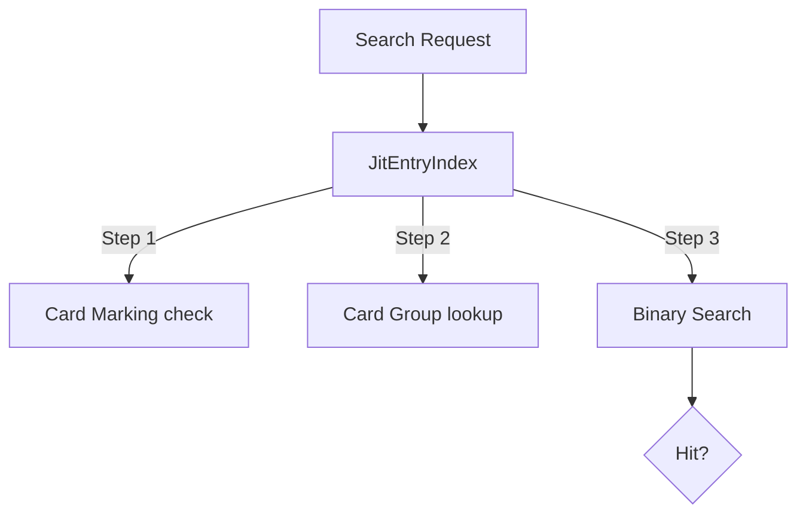
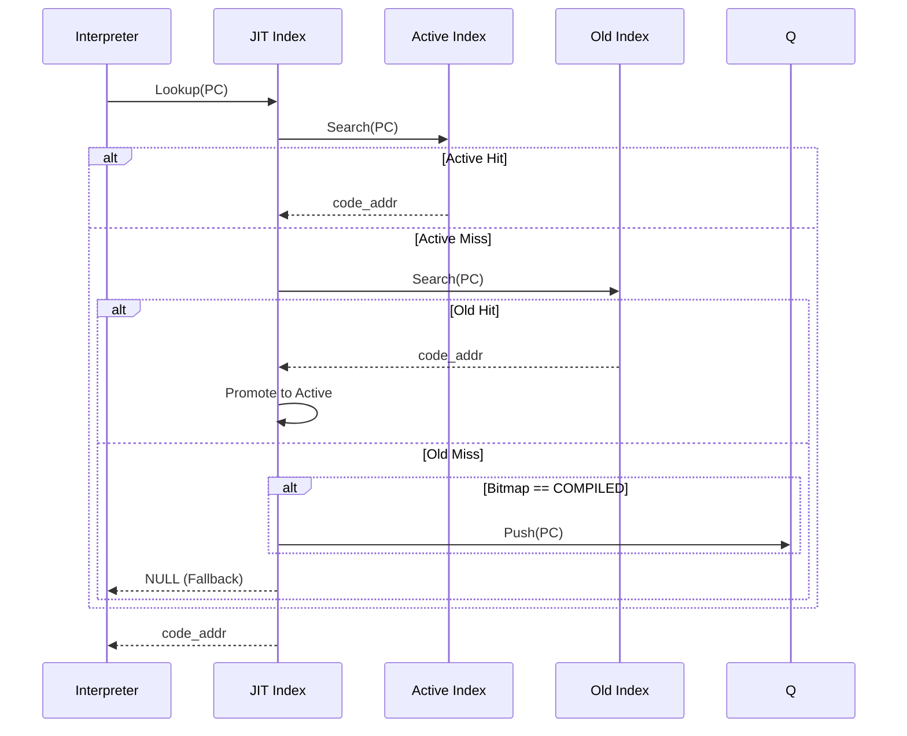

# JIT Entry Index コンポーネント設計書

## 1. コンセプト
<!-- traceability: {SimpleJITArchitecture} {JIT_DoubleBuffer_Cache} {META_FlatMapIndexed} {META_BinarySearch} -->
JIT Entry Index は、WASM 命令オフセット とそれに対応するネイティブコードのアドレスの紐付けを管理する。
インタープリタの実行ループ内という極めてクリティカルなパスで呼び出されるため、**カードマーキング**（コンパイル状態の高速判定）と**カードグループ索引**（二分探索の範囲絞り込み）を組み合わせた高速な検索アルゴリズムを提供する。内部的には C++23 `std::flat_map` 相当の構造を用い、限られたメモリ内での動的キャッシュ代謝を実現する。 `{SimpleJITArchitecture}` `{JIT_DoubleBuffer_Cache}` `{META_FlatMapIndexed}` `{META_BinarySearch}`

## 2. アーキテクチャ分類
<!-- traceability: {META_3TierSeparation} {SimpleJITArchitecture} -->
本コンポーネントは **Tier 3 (詳細リーフコンポーネント: Leaf Component)** に属し、JIT コンパイラ (`jit_compiler.md`) から分解された JIT エントリインデックス管理およびカードマーキング二分探索を担当する。 `{META_3TierSeparation}` `{SimpleJITArchitecture}`

## 3. 静的モデル

### 3.1 データ構造
- **`JitEntryIndex`**: WASMオフセットとネイティブコードの対応付け、および高速な検索ロジックをカプセル化した主要クラス。
- **JITエントリ表**: 命令オフセットと生成コード位置のペアを管理する内部配列（プライベートメンバ）。
- **カードグループ索引**: 二分探索の範囲を絞り込むための補助的なインデックス（プライベートメンバ）。

### 3.2 内部ブロック図

#### JITエントリインデックス（JitEntryIndex）クラス
検索最適化のためのデータ構造とアルゴリズムをカプセル化する。

| 項目名 | 機能と役割 | 型分類 | サイズ・制約 |
| :--- | :--- | :--- | :--- |
| エントリ配列 | ソート済みの `jit_entry` 群を保持する | ソート済み配列 | - |
| グループ索引 | カードグループごとの開始インデックス | 固定長配列 | `entry_index` の配列 |
| エントリ数 | 現在登録されているエントリ数 | エントリ数 | - |

## 4. 動的モデル

### 4.1 アルゴリズム

#### 高速検索
1. **カードマーキング確認**: カード単位でコンパイル状態を保持する「実行履歴マップ（ホットスポット・ビットマップ）」を確認し、状態が「コンパイル完了」でなければ即座に終了する。
    - ※ カード単位の管理であるため、コンパイルされていないオフセットでも同じカード内の他オフセットの影響でパスする場合がある（後に二分探索で厳密にチェックされる）。
2. **カードグループ検索**: 検索対象の命令オフセットを右シフトし、対応するカードグループ索引を取得する。これにより二分探索の範囲 `[low, high]` を限定する。
3. **二分探索**: `jit_entry` 配列の限定された範囲から対象の命令オフセットを検索する。
4. **オンデマンド・キューイング**: アクティブ・バックアップ領域の両キャッシュでミスし、かつ実行履歴マップの状態が「コンパイル完了」である場合は、対象の命令オフセットを「コンパイル待ち列」へ登録し、インタープリタ実行を継続する。

### 4.2 状態遷移図
本コンポーネントは管理情報の更新と検索を行うため、明確な内部状態（ステートマシン）は持たないが、エントリの `Valid/Invalid` を管理する。

### 4.3 内部シーケンス

## 5. インターフェイス定義

### 5.1 公開API

#### 検索（lookup）

| 項目 | 内容 |
| :--- | :--- |
| 機能概要 | 命令オフセットに対応するネイティブコードアドレスを返す。 |
| シグネチャ | `lookup(pc: オフセット) -> オプショナル値` |
| 引数 | `pc`: WASM 命令オフセット |
| 戻り値 | オプショナル値 (成功時はネイティブアドレス、失敗時は空) |

#### エントリ登録（register_entry）

| 項目 | 内容 |
| :--- | :--- |
| 機能概要 | 新しい命令オフセットとコードアドレスのペアを登録する。 |
| シグネチャ | `register_entry(pc: オフセット, offset: オフセット) -> void` |
| 引数 | `pc`: WASM 命令オフセット (Key) `offset`: コードキャッシュ内の相対位置 (Value) |
| 戻り値 | void |

## 6. 制約達成の方策

### 6.1 性能制約
- **方策**: カードグループインデックスによる範囲絞り込みと、二分探索の組み合わせにより、多数のトレースが存在しても高速な検索を維持する。

### 6.2 メモリ制約
<!-- traceability: {JIT_DoubleBuffer_Cache} -->
- **方策**: `{JIT_DoubleBuffer_Cache}` による Copy-GC 方式により、断片化を防ぎつつ、実行頻度の低いコードを自然に破棄（代謝）させる。
