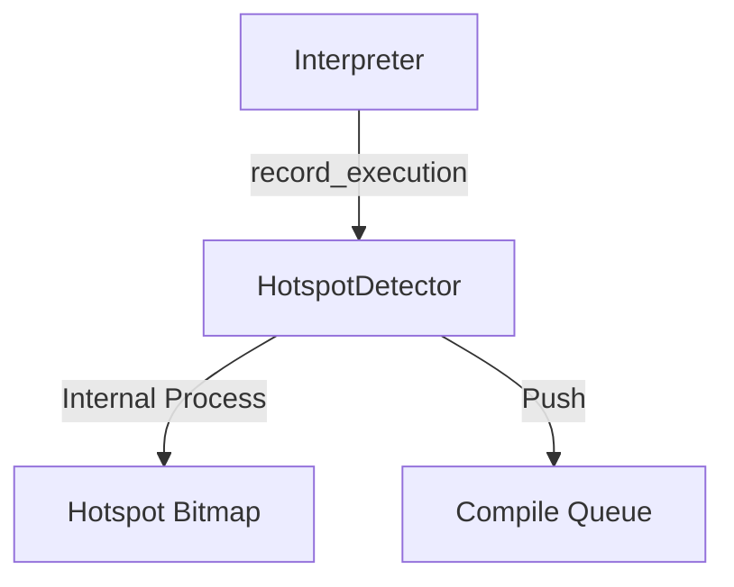
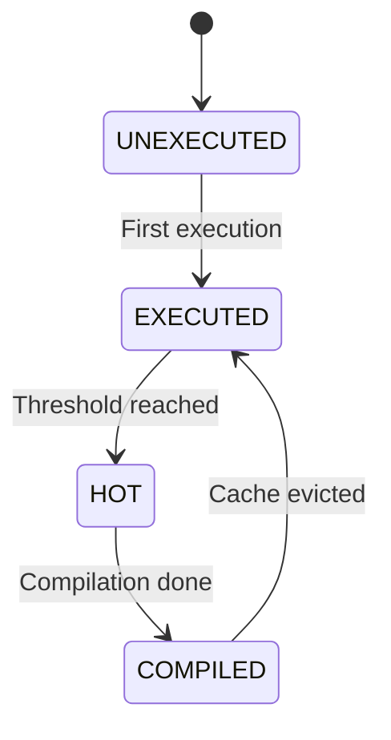

# JIT Hotspot Detector コンポーネント設計書

## 1. コンセプト
<!-- traceability: {LowLatencyJIT} {SimpleJITArchitecture} {HistoryBuffer} {GLOBAL_PeriodicTask} -->
JIT Hotspot Detector は、インタープリタが実行したWASM命令の頻度を監視し、ネイティブコードへの転送（コンパイル）が必要な「ホットスポット」を特定する役割を担う。リソース制約の厳しい環境において、JITコンパイル対象を絞り込むことで、キャッシュ効率とコンパイルオーバーヘッドのバランスを最適化する。 `{LowLatencyJIT}` `{SimpleJITArchitecture}` `{HistoryBuffer}` `{GLOBAL_PeriodicTask}`

## 2. アーキテクチャ分類
<!-- traceability: {META_3TierSeparation} {SimpleJITArchitecture} -->
本コンポーネントは **Tier 3 (詳細リーフコンポーネント: Leaf Component)** に属し、JIT コンパイラ (`jit_compiler.md`) から分解されたホットスポット検出・ビットマップ管理およびコンパイルキュー制御を担当する。 `{META_3TierSeparation}` `{SimpleJITArchitecture}`

## 3. 静的モデル

### 3.1 データ構造
- **`HotspotDetector`**: 実行頻度の監視、状態管理、およびコンパイル対象の特定を一括して行う主要クラス。
- **ホットスポット・ビットマップ**: WASMコード領域を分割管理する2ビットの状態配列（プライベートメンバ）。
- **実行履歴バッファ**: 短期間の実行履歴を一時的に保持するスタックまたはリングバッファ。

### 3.2 内部ブロック図

#### ホットスポット検出器（HotspotDetector）クラス
統計情報の管理と判定ロジックをカプセル化する。

| 項目名 | 機能と役割 | 型分類 | サイズ・制約 |
| :--- | :--- | :--- | :--- |
| ビットマップ | WASM カードごとの実行状態（未実行/実行済/頻出/完了） | 固定長配列 | 2bit / card |
| 履歴バッファ | 判定契機（yield等）までの一時的な実行記録 | リングバッファ | `offset` の配列 |

## 4. 動的モデル

### 4.1 アルゴリズム

#### ホットスポット判定
1. 実行権放棄（`yield`）時、または例外発生時に呼び出される。
2. 実行履歴バッファに蓄積された各命令オフセット（PC）を走査する。
3. 命令オフセットを右シフトして対応する「カード」を特定し、実行履歴マップ（ビットマップ）の状態を更新する：
   - 「未実行」 -> 「実行済」
   - 「実行済」 -> 「頻出」
4. 状態が「頻出」に遷移したカード（およびその契機となったオフセット）を「コンパイル待ち列」へ登録し、状態を「コンパイル完了」に更新する。
   - ※ 以降、このカード内の他オフセットが実行された際は、JITエントリ索引（検索側）がコンパイル済みであることを検知する。

### 4.2 状態遷移図

## 5. インターフェイス定義

### 5.1 公開API

#### 実行記録（record_execution）

| 項目 | 内容 |
| :--- | :--- |
| 機能概要 | 命令オフセット（PC）を履歴バッファに追記する。 |
| シグネチャ | `record_execution(pc: オフセット) -> void` |
| 引数 | `pc`: WASM 命令オフセット |
| 戻り値 | void |

#### 履歴処理（process_history）

| 項目 | 内容 |
| :--- | :--- |
| 機能概要 | 蓄積された履歴を基にビットマップの状態を更新し、ホットスポットを特定する。 |
| シグネチャ | `process_history() -> void` |
| 補足 | 実行権放棄（`yield`）時に呼び出す。 |

## 6. 制約達成の方策

### 6.1 性能制約
<!-- traceability: {LowLatencyJIT} {SimpleJITArchitecture} -->
- **コンパイルレイテンシの最小化 (Low Latency JIT)**: ホットスポットの早期特定とコンパイル対象の絞り込みにより、実行頻度の低いコードに対する無駄なコンパイル処理を回避し、JITの起動・コンパイルオーバーヘッドを最小化（レイテンシの最小化）する。 `{LowLatencyJIT}`
- **小規模JITキャッシュ管理 (Simple JIT Architecture)**: メモリ制約の厳しい64KB RAM環境でJITキャッシュ効率を最大化するため、ホットスポットと判定された高頻度実行領域（WASMカード単位）のみを選択的にコンパイルし、フットプリントを極限まで小さく抑えつつ、キャッシュ溢れ（Eviction）の頻度を最小化する。 `{SimpleJITArchitecture}`
- **2-bitビットマップによる最適化**: 2-bitのカード状態ビットマップを用いることで、超高速な状態遷移判定とメモリ節約を両立する。
