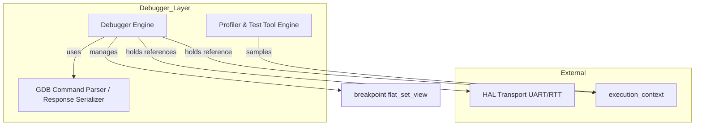
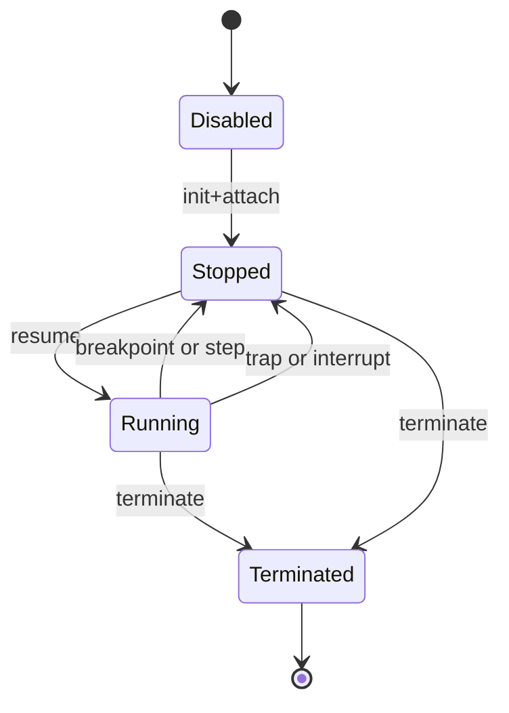
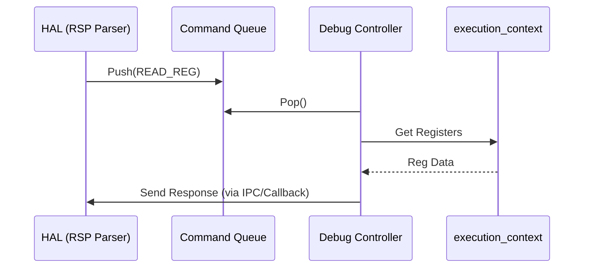

# Debug Manager コンポーネント設計書 {VERIFY_FORMAL} {VERIFY_LLM}
<!-- evidence:
     formal: formal/vsoc_state_model.py
     concept: concepts/debugger_concept.py
     test: tests/debug_manager_test_spec.md
-->

## 1. コンセプト
<!-- traceability: {RSPMinimalSet} {DebuggerLabelTableSwitch} {MemoryIsolation} {Debug_Standard_Env} {RSP_Transport_Selectable} {Debug_Integrated} {Debugger_Jit_Flush} -->
デバッガは、VSCode等の外部ツールからのデバッグを可能にするため、GDB Remote Serial Protocol (RSP) に基づく実行制御を行う。標準環境として VSCode, UART, J-Link をサポートする。また `{Debug_Integrated}` に準拠し、GDB RSP制御に加えて、**実行時プロファイラ機能（ホットスポットサンプリングや実行頻度計測）** および **動的テストツール機能（命令トレース・実行時メモリ/レジスタアサーション）** を内蔵する。RSPパケットのフレーミング・チェックサム検証はHAL層で行われ、デバッガはHALから供給される`debug_command`キューを消費し、GDBコマンドの構文解析・実行制御・レスポンス生成を行う。JITキャッシュの無効化はアタッチ中常時ではなく、デバッガがメモリを書き換えた場合にのみ発生する（[runtime_vsoc.md §4.2.1](runtime_vsoc.md#421-safepoint-と-jit-キャッシュ協調モデル) の `{Debugger_Jit_Flush}` を正本とする）。 `{RSPMinimalSet}` `{DebuggerLabelTableSwitch}` `{MemoryIsolation}` `{Debug_Standard_Env}` `{RSP_Transport_Selectable}` `{Debug_Integrated}` `{Debugger_Jit_Flush}`

## 2. アーキテクチャ分類
<!-- traceability: {META_3TierSeparation} {RSPMinimalSet} -->
本コンポーネントは **Tier 2 (分解されたサブコンポーネント: Decomposed Subcomponent)** に属し、vSoC (`runtime_vsoc.md`) から分解されたデバッグ状態制御、プロファイラ集計、ブレークポイント管理、および HAL からフレーミング済みで供給される GDB RSP コマンドの構文解析・レスポンス生成を担当する（パケットのフレーミング・チェックサム検証自体は HAL 層の責務）。具象的なプロトコル仕様は [GDB RSP 物理仕様書 (`docs/specs/gdb_rsp_protocol.md`)](../../specs/gdb_rsp_protocol.md) を正本とする。 `{META_3TierSeparation}` `{RSPMinimalSet}`

## 3. 静的モデル

### 3.1 データ構造
- **`Debugger`**: GDB RSPプロプライエタリな制御ロジック、デバッグ状態、およびブレークポイント管理をカプセル化した主要クラス。
- **`RspParser` / `RspSerializer`**: HAL層でフレーミング・チェックサム検証済みの `debug_command` を受け取り、GDBコマンドの構文解析（例: `g`, `m addr,len`, `Z0,addr,kind`）およびレスポンスペイロードの生成を行うクラス。パケットの生バイト受信・フレーミング・チェックサム計算自体は HAL 層 (`platform_hal.md`) の責務であり、本クラスはその対象外である。
- **`Profiler` / `DynamicTestTool`**: 命令実行サンプリングカウンタ、PC実行頻度マップ、および動的アサーションフックテーブル。 `{Debug_Integrated}`
- **`debug_config`**: 最大ブレークポイント数やポート番号などの不変の設定。

### 3.2 内部ブロック図

### 3.3 主要なクラス・構造体・配列・定数

#### デバッガ（Debugger）クラス
<!-- traceability: {META_NoStdVector} {Debug_Integrated} {RSPMinimalSet} -->
依存関係（実行コンテキスト、HAL）と内部状態（ブレークポイント、プロファイラサンプリング、現在状態）をカプセル化する。

| 項目名 | 機能と役割 | 型分類 | サイズ・制約 |
| :--- | :--- | :--- | :--- |
| 実行コンテキスト | 操作対象となるWASM実行状態への参照（プライベートメンバ）。 | 構造体への参照 | `execution_context` (非所有) |
| HALトランスポート | RSPパケットの送受信を担うHAL抽象化レイヤへの参照。 | 構造体への参照 | `hal_transport` (非所有) |
| `cmd_queue` | HALから供給されるコマンドキュー。 | 構造体への参照 | `debug_command_queue` |
| デバッグ状態 | デバッガの現在の動作モード（実行中、中断中など）。 | 列挙型 | `debug_state` |
| ブレークポイントリスト | 設定されているブレークポイントのアドレス一覧。昇順ソート済みの固定長配列（`FB_CONF_DEBUG_MAX_BREAKPOINTS` 件）として保持し、実行時の判定は `fireball::flat_set_view<address>` の `contains()` で行う。 | 固定長配列 + 集合ビュー | `{META_NoStdVector}` `{FlatViewNarrowing}` |
| RSPパケットバッファ | フレーミングされた 1 パケットの ASCII ペイロード | 固定長配列 | 256 Bytes (`FB_CONF_RSP_PACKET_MAX`) |
| プロファイラバッファ | サンプリングされたPC頻度とホットスポット統計。PCの昇順ソート済み固定長配列（`FB_CONF_DEBUG_MAX_PC_SAMPLES` 件）として保持し、`fireball::flat_map_view<address, count>` で参照する。 | 固定長配列 + マップビュー | `FB_CONF_DEBUG_MAX_PC_SAMPLES` `{Debug_Integrated}` `{META_NoStdVector}` |
| `last_stop_reason` | 直近の停止要因。 | ID値 | 信号番号等 |

#### 仮想レジスタセット（virtual_register_set）
<!-- traceability: {RSPMinimalSet} -->
GDB等の外部クライアントに提示する WASM 仮想レジスタ番号マッピング（`0: pc`, `1: sp`, `2: fp`, `3: tos`, `4..19: local0..15`）は `{RSPMinimalSet}` を正本とする。 `{RSPMinimalSet}`

## 4. 動的モデル

### 4.1 アルゴリズム
<!-- traceability: {DebuggerLabelTableSwitch} {RSPMinimalSet} {Debug_Integrated} -->
1. **コマンド取得**:
   - HAL層が `$`〜`#`のパケットフレーミングとチェックサム検証（一致時 ACK (`+`)、不一致時 NAK (`-`)）を完了させた上で供給する `debug_command` を、コマンドキューから取得する。
2. **コマンドディスパッチ**:
   - 取得したコマンド（`?`, `g/G`, `m/M`, `c`, `s`, `Z0/z0` 等）の GDB コマンド構文を解析し、ディスパッチする。
3. **インタープリタ・フォールバック実行**:
   - デバッガアタッチ中は命令粒度の実行制御のためインタープリタのハンドラテーブルをデバッグ用テーブル（`debug_handler_table`）へ切り替えて 1 命令ずつステップ実行またはブレークポイントまで連続実行する。既存の JIT キャッシュ自体はこの切り替えだけでは破棄されない（無効化はメモリ書き換え時のみ、`{Debugger_Jit_Flush}`）。 `{DebuggerLabelTableSwitch}` `{Debugger_Jit_Flush}`
4. **ステップ実行**:
   - インタープリタを「1命令実行」モードで呼び出し、実行後に `Stopped` 状態へ遷移して停止理由（SIGTRAP）を通知。 `{RSPMinimalSet}`
5. **プロファイリング & 動的テスト**:
   - 実行中 PC をサンプリング記録し、外部ツールへプロファイルサマリを出力。メモリアサーションを検証。 `{Debug_Integrated}`

#### デバッガ・インタープリタ結合コンセプトコード (`concepts/debugger_concept.py`)
デバッガとインタープリタの結合、GDB RSP パケット処理、統一スタック検査、プロファイラサンプリングの参照実装：
[`concepts/debugger_concept.py`](concepts/debugger_concept.py)

### 4.2 状態遷移図

### 4.3 内部シーケンス
#### デバッグコマンド処理シーケンス

## 5. インターフェイス定義

### 5.1 公開API
外部から利用可能なオブジェクト指向APIを定義する。

#### デバッガ接続 (`attach`)

<!-- traceability: {Debug_Standard_Env} -->

| 項目 | 内容 |
| :--- | :--- |
| 機能概要 | 実行中のWASMエンジンに対してデバッグ機能を有効化し、初期停止状態（Halt）へ移行させる。 |
| シグネチャ | `attach(exec_ctx: 可変参照, transport: 構造体への参照) -> 結果型` |
| 引数 | `exec_ctx`: 操作対象コンテキスト `transport`: HAL通信路 |
| 戻り値 | 結果型 |
| 期待する結果 | 正常：デバッガがコンテキストを掌握し、GDB等のツールによる操作が可能になる。 |

#### コマンド処理 (`poll_commands`)

<!-- traceability: {RSPMinimalSet} -->

| 項目 | 内容 |
| :--- | :--- |
| 機能概要 | HAL層から供給されたデバッグコマンドを一つ処理し、実行コンテキストを制御する。 |
| シグネチャ | `poll_commands() -> 結果型` |
| 戻り値 | 結果型 |
| 期待する結果 | 正常：保留中のコマンドが処理され、必要に応じて停止/継続が切り替わる。 |

#### 命令ステップ実行 (`step_instruction`)

| 項目 | 内容 |
| :--- | :--- |
| 機能概要 | 現在の停止位置からちょうど一命令だけをゲストに進ませる。 |
| シグネチャ | `step_instruction() -> void` |
| 期待する結果 | 正常：一命令実行後に再び `Stopped` 状態になる。 |

### 5.2 URI/IPCインターフェイス
- **コマンド入力**: HAL層からの内部関数呼び出し、または共有メモリ上のキュー経由。
- **レスポンス出力**: HAL層のRSPトランスポートへ解析結果を返却。

## 6. 制約達成の方策

### 6.1 性能制約と方策
<!-- traceability: {DebuggerLabelTableSwitch} -->
- **目標**: デバッグ無効時のオーバーヘッドをゼロにする。
- **方策**: `{DebuggerLabelTableSwitch}` デバッガ無効時はインタープリタのハンドラテーブルを切り替えず、通常の高速実行を維持する。

### 6.2 メモリ制約と方策
<!-- traceability: {MemoryIsolation} {META_NoStdVector} -->
- **目標**: 最小限のRAMでデバッグ機能を提供する。
- **方策**: `{MemoryIsolation}` `{META_NoStdVector}` デバッガ専用の固定長バッファと配列を使用し、動的メモリ確保を排除する。

### 6.3 安全性制約と方策
<!-- traceability: {MemoryBoundaryCheck} -->
- **目標**: デバッガによる不正なメモリアクセスを防止する。
- **方策**: `{MemoryBoundaryCheck}` デバッグコマンドによるメモリアクセスに対し、WASMリニアメモリの境界チェックを強制する。
