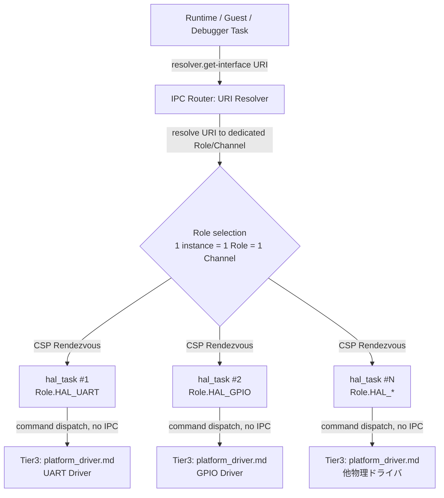

# HAL 抽象化層（URI Resolver / トランスポート抽象） コンポーネント設計書 {VERIFY_LLM}
<!-- evidence:
     test: tests/hal_dispatch_test_spec.md
-->

本コンポーネントは、Tier 3 の物理ドライバ実装 [`platform_driver.md`](docs/components/tier3_platform/platform_driver.md)（UART/SEGGER RTT 物理レジスタ操作、RSPパケットのバイト列エンコード/デコード）が実現すべき抽象契約（URI Resolver、コマンドプロトコル、ゼロコピー転送インターフェース）を定義する（`{META_ContractImplSplit}` 契約/実装分割パターン）。

## 1. コンセプト
<!-- traceability: {IPCRouter} {URIAbstraction} {TypeSafeMessaging} {IPC_ZeroCopy} -->
HAL (Hardware Abstraction Layer) は、COOS 上で稼働する独立したタスク（`hal_task`）として常駐し、物理ハードウェアおよび仮想ペリフェラルへのアクセスを抽象化して提供する。**デバイス/サービスインスタンス 1 つにつき `hal_task` インスタンス 1 つが専用に対応する**（1 タスクは正確に 1 つの物理ドライバのみを所有する）。これは IPC ルータの「1 チャネル 1 待機者」制約（`{ADR_RendezvousChannel}`）に由来する契約であり、単一の共有タスクが複数の同種デバイスインスタンス（例: 物理 UART と、別登録されたコンソール出力ストリーム）を URI 単位で振り分けることはできない——受信側チャネルの選択はロール（IPC ルータの `Role`）でのみ行われ、メッセージ内の URI 情報では行われないためである。上位層（Runtime, Debugger, Guest 等）からの直接関数呼び出しは行わず、通信はすべて IPC ルータ（`ipc_router`）を介した CSP rendezvous メッセージパッシングによって行われる。ペリフェラル・ストリーム・GPIO 等は階層型 URI（`fireball://device/<driver-type>/<instance-id>`）経由で動的にバインド・解決され、解決されたインスタンスごとに専用ロール・専用チャネル・専用 `hal_task` が対応付けられる。

各 `hal_task` インスタンスは IPC ルータ（`ipc_router`）から自身が担当する 1 インスタンス宛ての WASI 0.3p ドライバ通信コマンド（`CMD_STREAM_*`, `CMD_CLOCK_*`, `CMD_GPIO_*`, `CMD_BUS_*`）を受信し、HALバッファプール（物理実体は Tier 3 の vMMIO/DYNAMIC 領域）のバッファスライス（`hal-buffer-slice`、本コンポーネントから見た不透明ハンドル）を介してゼロコピーで高速データ転送を実行する。 `{IPCRouter}` `{URIAbstraction}` `{TypeSafeMessaging}` `{IPC_ZeroCopy}`

## 2. アーキテクチャ分類
<!-- traceability: {META_3TierSeparation} {IPCRouter} {URIAbstraction} {META_StaticDI} -->
本コンポーネントは **Tier 2 (分解されたサブコンポーネント: Decomposed Subcomponent)** に属し、HAL の URI Resolver・コマンドプロトコル・ゼロコピー転送インターフェースという抽象化層を担当する。物理ドライバ実装（UART/SEGGER RTT 物理層、RSPパケット処理）は Tier 3 の [`platform_driver.md`](docs/components/tier3_platform/platform_driver.md) が担う。 `{META_3TierSeparation}` `{IPCRouter}` `{URIAbstraction}` `{META_StaticDI}`

## 3. 静的モデル

### 3.1 データ構造
- **デバイスレジストリ（契約）**: 階層 URI からドライバインスタンスへの解決契約。物理的なデバイス情報配列の実体は Tier 3 を正本とする。
- **HALバッファプール（契約）**: `acquire_buffer`/`release_buffer` によって貸与される不透明ハンドル（`hal-buf-id` / `hal-buffer-slice`）の契約。物理的な固定長バッファプールの配置（vMMIO DYNAMIC 領域）は Tier 3 を正本とする。

### 3.2 内部ブロック図

### 3.3 主要なクラス・構造体・配列・定数

#### HAL サーバタスク（hal_task）
<!-- traceability: {META_3TierSeparation} {IPCRouter} -->
COOS 上で独立して実行される協調タスク。**1 タスクインスタンスにつき 1 物理ドライバインスタンスのみを所有する**契約であり、複数デバイスをまたぐ URI ベースのディスパッチテーブルを内部に持たない。上位層からの直接関数呼び出しを禁止し、IPC ルータ（自身に割り当てられた専用ロール宛てのチャネル）経由で CSP rendezvous 受信ループ（`ipc.recv`）を実行してコマンドをディスパッチする契約。ドライバから物理ハードウェアへのアクセスは通常のメソッド呼び出しであり、二段目の IPC は発生しない。

| 項目名 | 機能と役割 | 型分類 | サイズ・制約 |
| :--- | :--- | :--- | :--- |
| タスクコルーチン | COOS スケジューラ上で、自インスタンス宛ての IPC 受信を待機・処理する実行体 | コルーチン | 1 デバイス/サービスインスタンスにつき 1 タスクスロット |
| 所有ドライバ | このタスクが専有する単一の物理ドライバインスタンス（Tier 3 の [`platform_driver.md`](docs/components/tier3_platform/platform_driver.md) を正本とする） | ドライバインスタンス | 1 タスク = 1 ドライバ（1:1） |
| セキュリティロール | IPC ルータで検証される、このインスタンス専用の権限ロール | ロール | `Role.HAL_*`（デバイス/サービスインスタンスごとに個別のロール値。例: `Role.HAL_UART`, `Role.HAL_GPIO`） |

#### HAL構成（hal_config、契約レベル定数）
<!-- traceability: {META_ConfigurableSystem} -->
HAL全体の制限値を定義する。物理値は Tier 3 で確定される。 `{META_ConfigurableSystem}`

| 項目名 | 機能と役割 | 型分類 |
| :--- | :--- | :--- |
| 最大登録デバイス数 | システムが同時に管理可能なデバイスの総数を規定する契約上限（`FB_CONF_HAL_MAX_DEVICES`） | エントリ数 |
| 最大バッファ数 | 通信に使用する内部バッファの予約数契約（`FB_CONF_HAL_MAX_BUFFERS`） | エントリ数 |
| `buffer_size` | 単一バッファに割り当てられる固定バイト数契約（`FB_CONF_HAL_BUFFER_SIZE`） | バイト数 |

## 4. 動的モデル

### 4.1 コマンドルーティング（契約）
<!-- traceability: {TaskPollInterruptEvent} {GLOBAL_InterruptWakeup} -->
デバイスインスタンスへの振り分けは、本コンポーネントの内部ディスパッチではなく IPC ルータの Stage 1（URI 解決）で完結する契約とする——`resolver.get-interface(uri)` が URI を専用ロールへ解決し、専用チャネル経由で対応する `hal_task` インスタンスへ直接ランデブーするため、`hal_task` 自身がコマンドに埋め込まれたデバイス ID を見て複数ドライバから振り分ける処理を持つ必要はない。`hal_task` が担うのは、受信した `read`/`write`/`control` コマンドを自身が専有する単一の物理ドライバへそのまま委譲する契約のみである。物理ドライバへの委譲実装は Tier 3 を正本とする。

割り込み通知の責務分担（ISR → 固定5ワードの`notify_interrupt` → COOS FIFO → vSoC Safepoint配送）の抽象契約は `{TaskPollInterruptEvent}` `{GLOBAL_InterruptWakeup}` を正本とする。WASIの`poll-check`/`poll-wait`は操作完了待機の別経路であり、vIRQの原因イベントを表さない。物理割り込みハンドラの実装は Tier 3 [`platform_driver.md`](docs/components/tier3_platform/platform_driver.md) を参照。

## 5. インターフェース定義

### 5.1 公開 API（WASI親和性のある契約）
<!-- traceability: {HAL_Interface} {IPC_ZeroCopy} -->

HAL の公開境界は、WASI 0.3p の interface / stream / pollable に対応しやすい汎用操作で構成する。ゲスト側の Preview1 API への変換は Tier 3 のゲストアダプタが担当し、HAL はその変換後の契約だけを受け取る。

| 操作 | シグネチャ | 役割 |
| :--- | :--- | :--- |
| `get-interface` | `get-interface(uri: string) -> result<u32, recovery-strategy-category>` | URI からデバイスまたはサービスのインターフェースハンドルを取得する |
| `acquire-buffer` | `acquire-buffer(size-bytes: u32) -> result<hal-buffer-slice, recovery-strategy-category>` | ゼロコピー転送用の HAL バッファスライスを確保する |
| `release-buffer` | `release-buffer(slice: hal-buffer-slice) -> operation-result` | HAL バッファスライスの所有権を返却する |
| `stream-read` | `stream-read(handle: u32, buffer: hal-buffer-slice) -> operation-result` | ストリームから HAL バッファへ読み込む |
| `stream-write` | `stream-write(handle: u32, buffer: hal-buffer-slice) -> operation-result` | HAL バッファからストリームへ書き込む |
| `stream-flush` | `stream-flush(handle: u32) -> operation-result` | ストリームの保留データを送出する |
| `stream-close` | `stream-close(handle: u32) -> operation-result` | ストリームハンドルを閉じる |
| `clock-get-now` | `clock-get-now(handle: u32) -> result<u64, recovery-strategy-category>` | 単調クロックの現在値を取得する |
| `clock-get-resolution` | `clock-get-resolution(handle: u32) -> result<u64, recovery-strategy-category>` | クロック分解能を取得する |
| `poll-check` | `poll-check(handle: u32) -> result<bool, recovery-strategy-category>` | 操作完了または入力準備の状態を確認する |
| `poll-wait` | `poll-wait(handle: u32) -> operation-result` | 準備完了まで待機する |

GPIO、I2C、SPI 等の WASI 標準外機能も、`get-interface` で得たハンドルと同じバッファ／コマンド境界を使う拡張操作として定義する。個別デバイスの WIT resource 型やゲスト向け Preview1 ラッパーは定義しない。物理配置と境界検査は Tier 3 を正本とする。

### 5.2 階層型 URI 命名規則 & WASI 0.3p IPC コマンド仕様
<!-- traceability: {URIAbstraction} {IPCRouter} {TypeSafeMessaging} {IPC_ZeroCopy} {HAL_Interface} -->
HAL が管轄するすべてのハードウェアドライバおよびコンソール出力は、以下の階層型 URI で IPC レジストリへ登録される：

- `fireball://device/uart/0`: UART シリアル入出力ドライバ（ストリーム）
- `fireball://device/gpio/0`: GPIO ポートドライバ（ピン入出力・エッジトリガ）
- `fireball://device/timer/0`: ハードウェアタイマードライバ（単調増加時刻・非同期イベント）
- `fireball://device/i2c/0`: I2C バスマスタ／スレーブドライバ
- `fireball://device/spi/0`: SPI バスマスタ／スレーブドライバ
- `fireball://device/rtt/0`: SEGGER RTT デバッグ通信ドライバ
- `fireball://service/stdout/0`: 標準出力コンソールストリーム

各ドライバは IPC ルータ経由で以下の `kv_pair` コマンドを受信し、HALバッファプール（`hal-buffer-slice`、不透明ハンドル）と連携してハードウェア処理を実行する：

| 分類 | コマンド名 | コマンド ID | 引数 (`kv_pair` / Buffer) | 戻り値 | 説明 |
| :--- | :--- | :--- | :--- | :--- | :--- |
| **共通 (Capability)** | `CMD_QUERY_CAPS` | `0x00` | `query_cmd_id` (16bit) | `is_supported` (1=対応, 0=非対応) | ドライバが指定コマンドをサポートしているか確認 |
| **Stream (UART/Stdout)** | `CMD_STREAM_WRITE_BUFFER` | `0x01` | `buffer_handle`, `offset`, `len` | `written_bytes` | HALバッファプール上のデータをデバイスへ送信 |
| | `CMD_STREAM_READ_BUFFER` | `0x02` | `buffer_handle`, `offset`, `max_len` | `read_bytes` | デバイスからHALバッファプールへデータを読み込み |
| | `CMD_STREAM_FLUSH` | `0x03` | なし | `0` (SUCCESS) | デバイス送信バッファのフラッシュ |
| | `CMD_STREAM_CLOSE` | `0x04` | なし | `0` (SUCCESS) | ストリームチャネルのクローズ |
| **Clock/Timer** | `CMD_CLOCK_GET_NOW` | `0x10` | なし | `now_ns` (64bit) | 単調増加時刻（SysTick/Timer ナノ秒）を取得 |
| | `CMD_CLOCK_SUBSCRIBE` | `0x11` | `nanos` (64bit) | `pollable_handle` | 指定ナノ秒後に発火する非同期イベントを予約 |
| | `CMD_CLOCK_GET_RES` | `0x12` | なし | `resolution_ns` | クロック分解能（ナノ秒）を取得 |
| **GPIO/Trigger** | `CMD_GPIO_SET_PIN` | `0x20` | `pin_no`, `val` (0/1) | `0` (SUCCESS) | GPIO ピンの出力レベルを設定 |
| | `CMD_GPIO_GET_PIN` | `0x21` | `pin_no` | `pin_val` (0/1) | GPIO ピンの入力レベルを取得 |
| | `CMD_GPIO_CONFIG_PIN`| `0x22` | `pin_no`, `mode` (In/Out/Pull) | `0` (SUCCESS) | GPIO ピンの方向・プル構成を設定 |
| | `CMD_GPIO_SUBSCRIBE_EDGE` | `0x23` | `pin_no`, `edge_type` | `pollable_handle` | エッジ検出時に発火するイベントを登録 |
| **Bus (I2C/SPI)** | `CMD_BUS_TRANSFER_BUFFER` | `0x30` | `tx_buf_handle`, `rx_buf_handle`, `len` | `transferred_bytes` | TX/RX HALバッファ間の全二重/半二重転送 |
| | `CMD_BUS_CONFIG` | `0x31` | `clock_hz`, `slave_addr`, `mode` | `0` (SUCCESS) | 通信速度・スレーブアドレス・転送モード設定 |

### 5.3 WASI サポート体系（WASI 0.3p とゲストアダプタの境界）
<!-- traceability: {WASI_Implementation} {URIAbstraction} {TypeSafeMessaging} {META_ZeroCostAbstraction} -->

#### HAL の公開契約
Fireball の HAL は、WASI 0.3p と親和性のある汎用インターフェースとして URI 解決、バッファ所有権、ストリーム、クロック、ポーリングを提供する。`resolver` WIT の型と関数は [`interface_wit.md`](docs/components/tier1_interface/interface_wit.md) の契約に従う。

#### ゲスト側アダプタ
既存の WASI Preview1 バイナリとの互換性を提供する `fd_write` 等の変換は、Tier 3 のゲストアダプタが担当する。`hal_dispatch` は Preview1 ABI、ゲスト iovec の走査、errno 変換の順序を定義せず、変換後の HAL 操作だけを処理する。ホスト側の参照実装 `experiments/pysim` は将来のリファクタリング対象であり、この境界変更では移動しない。

## 6. 制約達成の方策

### 6.1 性能制約と方策
<!-- traceability: {META_ConfigurableSystem} -->
- **目標**: ハードウェアアクセスのレイテンシを最小化する。
- **方策**: `{META_ConfigurableSystem}` デバイス構成をコンパイル時に固定し、実行時の動的な探索オーバーヘッドを排除する契約とする。物理的な実現は Tier 3 を正本とする。

### 6.2 安全性制約と方策
- **目標**: ゼロコピー転送における境界安全性を契約として保証する。
- **方策**: HALバッファハンドル（`hal-buf-id`）経由のみでデータを受け渡し、生ポインタの直接受け渡し経路を契約上排除する。物理的な境界検査（`GOTCHA-HAL-01`）は Tier 3 を正本とする。

## 7. 形式検証・テスト仕様との対応

### 7.1 検証対象の不変条件
- **ゼロコピー転送安全性**: 生ポインタ渡しを行わず、HALバッファハンドル（`hal-buf-id` / `hal-buffer-slice`）による境界検証を経由すること（`TEST-HAL-02`, `TEST-HAL-06`）。物理検証は Tier 3 を正本とする。

### 7.2 テスト仕様書との連携
本コンポーネントのテストケースは、[`hal_dispatch_test_spec.md`](docs/components/tier2_runtime/tests/hal_dispatch_test_spec.md) を正本として定義する。物理ドライバ実装のテストケース（TEST-HAL-01〜TEST-HAL-10, GOTCHA-HAL-01〜03）は [`platform_driver_test_spec.md`](docs/components/tier3_platform/tests/platform_driver_test_spec.md) を参照。
