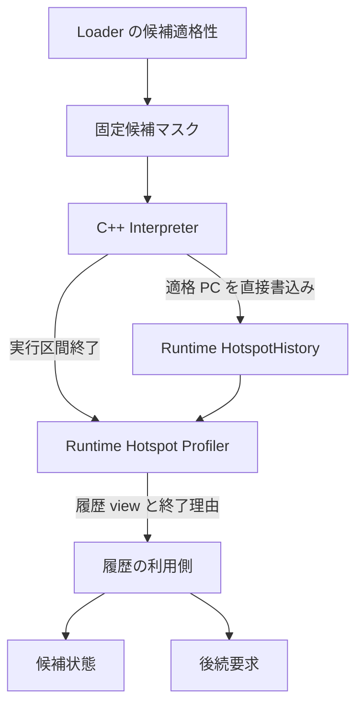
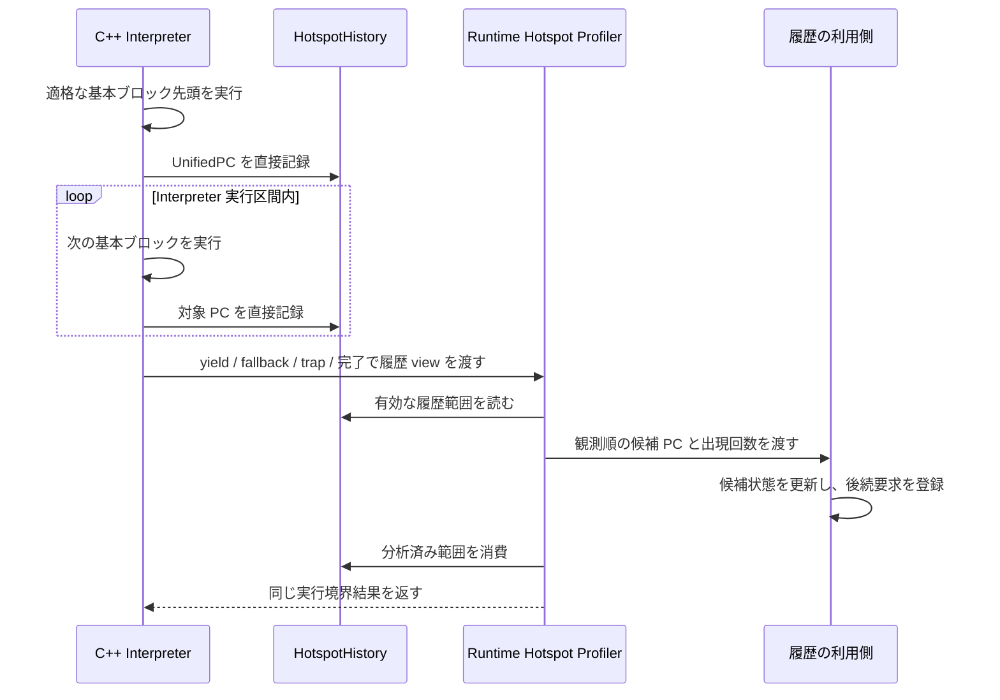

# Runtime ホットスポットプロファイラ契約 コンポーネント設計書
<!-- evidence:
     formal: formal/runtime_hotspot_profiler_model.py
     test: docs/qa/tier2_runtime/runtime_hotspot_profiler_test_spec.md
-->

## 1. コンセプト
<!-- traceability: {META_3TierSeparation} {META_ContractImplSplit} {RuntimeHotspotProfiler} {HistoryBuffer} {LowLatencyJIT} -->

本契約は、Runtime 内蔵ホットスポットプロファイラの C++ 境界を定める。
ゲスト実行全体の関数時間やコールグラフを扱う Guest Profiler、および意味上の境界を記録する
[`runtime_observability.md`](docs/components/tier2_runtime/runtime_observability.md) の Runtime Event Sink とは独立する。

ホットスポット履歴は C++ Interpreter が対象基本ブロックの module ID と UnifiedPC を固定容量履歴へ
直接記録する。
Interpreter の実行区間を抜けるときに履歴を分析してカード状態を更新する。JIT 実行中はホットスポット
履歴を記録せず、ホットスポット分析も行わない。Runtime Event Sink、外部コールバック、イベント種別の
ディスパッチを基本ブロックの実行経路へ追加しない。

## 2. アーキテクチャ分類
<!-- traceability: {META_3TierSeparation} {META_ContractImplSplit} {RuntimeHotspotProfiler} -->

本契約は Tier 2 Runtime が所有する内部サービス契約である。Interpreter が生成する PC 履歴を保持し、
実行区間の終了時に履歴を分析側へ引き渡す境界を定める。履歴の利用側は、候補状態の更新と後続処理を担う。

| 項目 | 内容 |
| :--- | :--- |
| Tier | Tier 2 Runtime |
| 役割 | Runtime の固定履歴と実行境界での履歴引渡しを定める C++ 契約 |
| 依存先 | Runtime 実行境界、Runtime メモリアリーナ |
| 使用側 | Interpreter の実行経路、履歴の利用側 |
| 正本 | 本書、[`runtime_plugin_architecture.md`](docs/components/tier2_runtime/runtime_plugin_architecture.md) |

## 3. 静的モデル

### 3.1 所有要素
<!-- traceability: {GLOBAL_ComponentHarness} {ConceptHarnessDI} {GLOBAL_Policy_Memory} -->

| 要素 | 所有者 | 内容 | 寿命 |
| :--- | :--- | :--- | :--- |
| `HotspotHistory` | Runtime | Runtime 構成で容量を受ける固定履歴。Interpreter には非所有 view を渡す | Runtime と同じ |
| 履歴書込み経路 | Runtime が提供する履歴 view | 適格な基本ブロック PC を実行順に記録する | Interpreter の呼出し中 |
| 履歴分析境界 | Runtime | Interpreter の終了境界で履歴を利用側へ渡す | Runtime と同じ |

Runtime 構成は Runtime 起動時に履歴容量を確定し、Runtime が専用アリーナから領域を確保する。
具体的なアロケータ型は既存 Runtime メモリ契約に従う。

モジュールは Runtime の寿命中に登録されたままとする。個別モジュールのアンロードや、プロファイラ状態の
モジュール単位解放を要求しない。Runtime を破棄すると履歴とカード状態をまとめて破棄する。

<!-- traceability: {WasmCodeSectionPC} -->
### 3.2 履歴レコード

履歴レコードは 32 ビットの module ID と 32 ビットのUnifiedPCを保持する。UnifiedPCはCode section payload先頭から基本ブロック先頭命令までのバイトオフセットである。異なるモジュール間で同じPC値を取り得るため、基本ブロックの識別キーは
`(module_id, unified_pc)`とする。時刻、イベント種別、関数ポインタ、ゲストメモリポインタなどを
含めない。基本ブロックの候補適格性はロード時に確定し、対象外のブロックは履歴へ記録しない。

| 項目 | 契約 |
| :--- | :--- |
| レコード幅 | 8 バイト |
| フィールド | `module_id: uint32`、`unified_pc: uint32` |
| キー | `(module_id, unified_pc)` |
| 容量 | Runtime 構成で指定する固定要素数 `N` |
| 記録回数 | C++ Interpreter が適格基本ブロックを実行するたび 1 件 |
| JIT 経路 | 履歴記録なし |
| Runtime Event Sink | 使用しない |

### 3.3 内部ブロック図

### 3.4 構成選択
<!-- traceability: {GLOBAL_ComponentHarness} {ConceptHarnessDI} -->

Runtime Hotspot Profiler は Runtime の具象型構成で選択する。JIT が有効でホットスポット検出を使う構成だけが
`HotspotHistory` と分析処理を持つ。ホットスポット機能を無効にした構成および JIT を持たない構成には履歴、
書込み処理、分析処理を含めない。

Runtime Event Sink と Runtime Hotspot Profiler は別の型スロット・別状態・別の呼出境界にする。一方の有効・
無効が他方の生成や実行経路に影響しない。どちらもテンプレート構成から個別に選び、プロセス全体のマクロで
切り替えない。

## 4. 動的モデル

### 4.1 記録と分析の手順
<!-- traceability: {RuntimeHotspotProfiler} {HistoryBuffer} -->

Interpreter は基本ブロック先頭で候補マスクを参照し、候補なら実行コンテキストの非所有 view を通して
`(module_id, unified_pc)` を `HotspotHistory` に直接書く。
この記録は Runtime Event Sink の `RuntimeEvent` を構築せず、汎用イベント callback や時刻 source を呼ばない。

Interpreter が実行区間を抜けて Runtime 実行境界へ戻る前に、Hotspot Profiler は保存済み履歴 view を
履歴の利用側へ一度渡す。利用側は候補状態と後続処理を履歴順に更新する。分析後、処理した履歴範囲を消費済みにする。

JIT trace の実行・chain 中は履歴への書込みと Hotspot Profiler の呼出しを行わない。JIT から Interpreter に
戻った後の未コンパイル領域は、次の Interpreter 実行区間で記録対象となる。

### 4.2 履歴容量超過

`HotspotHistory` は固定容量の循環履歴とし、満杯時は最古の履歴を上書きして直近 `N` 件を保持する。上書き数は
`overwritten_count` として保持し、分析結果に履歴欠落フラグを付ける。履歴が上書きされた区間のホットネス値は
近似値として扱う。履歴の確保や拡張のために実行時動的メモリを使わない。

### 4.3 状態遷移

| 状態 | 遷移契機 | 動作 |
| :--- | :--- | :--- |
| `collecting` | Interpreter の適格ブロック実行 | PC 履歴を追記する |
| `analyzing` | Interpreter が Runtime 実行境界へ戻る | 履歴を読み、利用側へ PC と回数を渡す |
| `ready` | 履歴分析が完了する | 分析済み履歴を消費し、次の Interpreter 実行を待つ |

Profiler は一つの Runtime 内で `collecting → analyzing → ready` の順に遷移する。JIT 実行中は `ready` のまま
である。Runtime が破棄されると状態全体が解放される。

## 5. インターフェース定義

### 5.1 Interpreter の履歴書込み

| 項目 | 内容 |
| :--- | :--- |
| 機能概要 | Interpreter の適格基本ブロック実行 PC を Runtime の履歴領域へ記録する |
| 書込み値 | 32 ビット module ID と 32 ビット UnifiedPC |
| 書込み場所 | C++ Interpreter の基本ブロック開始処理 |
| 事前条件 | JIT 有効かつホットスポット検出有効な具象 Runtime。PC は候補マスクで適格 |
| 事後条件 | 1 件の PC が履歴へ追加される。ゲスト状態・PC・スタックは変更しない |
| 不変条件 | Runtime Event Sink、時計、実行時動的メモリ確保を経由しない |

### 5.2 実行区間終了時の履歴分析

| 項目 | 内容 |
| :--- | :--- |
| 機能概要 | Interpreter が Runtime 実行境界へ戻る直前に、未分析履歴を一括分析する |
| 呼出回数 | Interpreter の実行区間ごとに 1 回。基本ブロックごとには呼ばない |
| 入力 | 直近の未分析範囲を示す読取り専用 `HotspotHistoryView` と終了理由 |
| 事後条件 | 利用側へ履歴と終了理由が渡り、利用側の状態更新が履歴順に反映される |
| 実行結果 | 元の yield、fallback、trap、完了理由を変えない |

終了理由は `yield`、`fallback`、`trap`、`function_complete` のいずれかとする。すべての理由で履歴を処理してから
Runtime 実行境界へ戻る。JIT 実行からの終了では本APIを呼ばない。

### 5.3 Runtime Event Sink との境界

本契約は Runtime 内部の履歴収集と利用側への引渡しを定義する。Runtime Event Sink に PC ごとの通知を追加せず、
イベント購読やイベント種別の選択を履歴記録経路へ含めない。

## 6. 制約達成の方策
<!-- traceability: {LowLatencyJIT} {GLOBAL_Policy_Memory} {ZeroRuntimeOverhead} -->

### 6.1 性能制約と方策

- Interpreter は既存の候補マスクに従って適格な基本ブロックを判定し、固定幅履歴レコードを記録する。Runtime Event Sink と時計読出しは呼び出さない。
- 同じ PC の集計、カード更新、閾値判定は Interpreter の基本ブロック経路から外し、実行区間終了時に行う。
- JIT trace と chain 経路には hotspot 記録・分析処理を含めない。
- 無効構成には履歴領域と記録処理を残さない。
- 計測では「JIT無効」「JIT有効・ホットスポット無効」「JIT有効・ホットスポット有効」を同じ実行ファイルへ
  インスタンス化し、Interpreter cycles/命令、履歴書込みコスト、終了時分析コスト、ROM/RAM 増分を別々に報告する。

### 6.2 メモリ制約と方策

- 履歴容量 `N` は Runtime 構成で固定し、容量分の履歴レコード配列を Runtime と同寿命で確保する。
- 履歴レコードにモジュール名、関数名、時刻、ポインタを含めない。モジュール識別は `module_id` で行い、モジュール内 PC は UnifiedPC で表す。
- 履歴を Runtime 破棄まで保持する必要はなく、各 Interpreter 区間の分析後に消費する。

### 6.3 安全性・決定性制約と方策

- PC は候補マスクと Loader が確定した基本ブロック境界に限る。
- 履歴範囲は `count <= capacity` を満たし、循環位置を含む有効区間だけを走査する。
- 履歴分析は Interpreter が Runtime に返す制御理由とゲスト可視状態を変更しない。
- 上書きが発生した場合は履歴欠落を明示し、厳密なホットネス値として報告しない。

## 7. 形式検証・テスト仕様との対応

履歴書込み順序、実行境界での分析、容量超過時の欠落表示、および JIT 実行中に記録・分析しない不変条件を、対応する形式モデルとテスト仕様で検証する。

### 7.1 検証対象の不変条件

| 不変条件 | 検証方法 |
| :--- | :--- |
| Interpreter の記録順序 | 同一ブロック列の履歴レコードが実行順と一致することを比較する |
| 分析の境界 | Interpreter 実行区間の終了時に一度分析し、JIT 実行では分析しないことを確認する |
| 利用側更新の順序 | 履歴の module ID と UnifiedPC が利用側の更新順と一致することを比較する |
| 履歴上書きの可視性 | 容量超過で直近 `N` 件と欠落フラグが一致することを確認する |
| 実行意味の非干渉 | 有効・無効構成で戻り値、trap、yield、ゲスト状態が一致することを確認する |
| 無効構成の除去 | 型構成、生成コード、ROM/RAM と Interpreter ベースラインを比較する |

### 7.2 既知の制限・対象外

- 履歴容量 `N` と候補マスク容量は SystemConfig / Runtime のリソース予算から決める。
- 候補状態と後続要求の具体的な遷移、閾値、待ち行列は履歴の利用側契約で定める。
- JIT 実行中のサンプリングプロファイル、命令単位 trace、時間ベースの hotspot sampling は対象外とする。

## 8. 設計判断

本契約では、ホットスポット計測を汎用イベント配送ではなく、Interpreter の PC 履歴と実行区間終了時の
バッチ分析として定義する。これにより Runtime Event Sink の関数・実行境界イベントと状態・呼出頻度を分け、
JIT 実行経路に不要なホットネス分析を加えない。

以下の設計判断を本契約で固定する。

1. Runtime Hotspot Profiler は Guest Profiler と Runtime Event Sink から独立した Runtime 契約とする。
2. 履歴 producer は C++ Interpreter とし、JIT 実行中は記録も分析もしない。
3. `(module_id, unified_pc)` を保持する固定容量循環履歴を用い、Runtime Event Sink を経由しない。
4. Interpreter が Runtime へ戻る各境界で履歴を一度だけ分析し、利用側の状態更新を履歴順に反映する。
5. 履歴満杯では最古を上書きし、欠落フラグ付き近似値として扱う。
