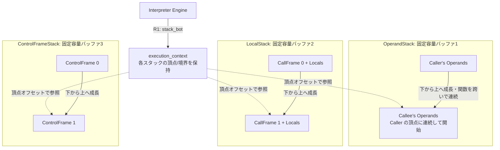
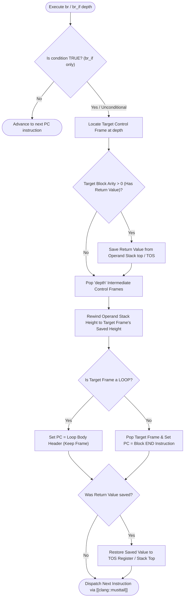
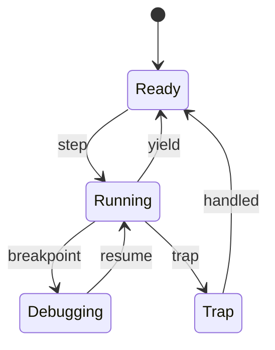
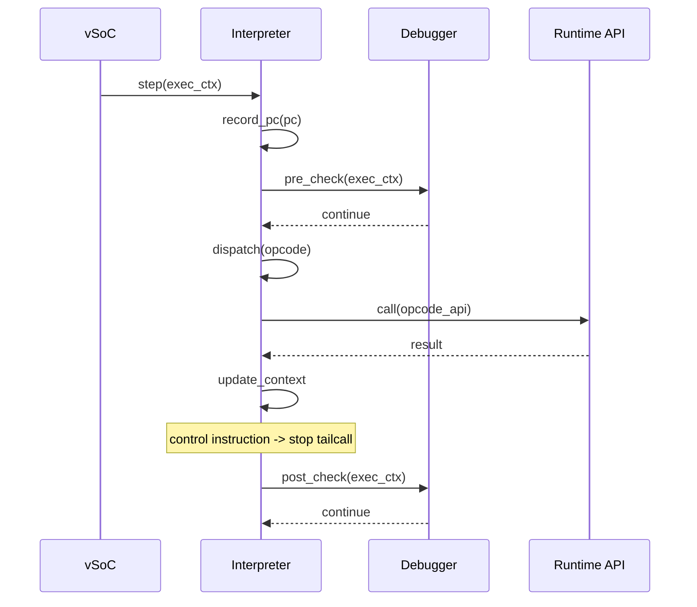

どきゅめんと# Interpreter コンポーネント設計書 {VERIFY_FORMAL} {VERIFY_LLM}
<!-- evidence:
     formal: formal/vsoc_state_model.py
     concept: concepts/interpreter_concept.py
     test: tests/runtime_interpreter_test_spec.md
-->

## 1. コンセプト
<!-- traceability: {ThreadedInterpreter} {LowLatencyJIT} {InterpreterContextStackless} {EnvironmentPointer} {DirectBytecodeExecution} -->
Interpreter は、WASM命令をスレッドインタープリタ方式で実行し、低レイテンシかつ小フットプリントでゲストを動作させる。Execution Engine (`executor`) の一部として設計され、JITと実行状態を完全に共有する。周辺コンポーネントへの参照は Environment Pointer (`vsoc_runtime* env`) を介して型安全に行う。また、組み込み環境の極小メモリ制約（`{GLOBAL_Policy_Memory}`）を遵守し、WASM命令は Flash / ROM 上のバイト列（`const uint8_t* ip`）から直接フェッチ（`*ip++`）され、中間命令オブジェクト（`Instr`）や命令ごとの二分探索マップ（`FlatMapView`）を一切生成・使用しない。即値（LEB128 等）はその場でポインタから直接デコードされ、次の命令アドレスは単なるポインタ加算（`ip += len`）で決定される。制御構文（`block`, `loop`, `if`）の飛び先はモジュールロード時に一度だけ静的解決された軽量制御表（`control_map`）を参照する。これにより、命令実行に伴うヒープ確保および探索オーバーヘッドを完全ゼロ（$O(1)$）とする（`INTP-GOTCHA-05`, `{DirectBytecodeExecution}`）。 `{ThreadedInterpreter}` `{LowLatencyJIT}` `{InterpreterContextStackless}` `{EnvironmentPointer}` `{DirectBytecodeExecution}`

## 2. アーキテクチャ分類
<!-- traceability: {META_3TierSeparation} -->
本コンポーネントは **Tier 2 (分解されたサブコンポーネント: Decomposed Subcomponent)** に属し、vSoC (`runtime_vsoc.md`) から分解された WASM バイトコードの逐次実行および JIT との共用実行コンテキスト管理を担当する。 `{META_3TierSeparation}`

## 3. 静的モデル

### 3.1 データ構造
- **`Interpreter`**: WASM命令の実行、コンテキスト管理、および外部環境（vSoC）との連携をカプセル化した主要クラス。
- **`execution_context`**: 仮想CPUレジスタ、下記3本のスタックそれぞれの頂点オフセット・境界、リニアメモリ情報等を保持する固定サイズの構造体。
- **`OperandStack`（オペランドスタック）**: WASM のオペランド値のみを保持する、コールチェーン全体を貫く1本の固定容量スタック。呼び出しごとに区切られたり作り直されたりはせず、呼び出しは「現在の頂点からどれだけ積んだか」を1つ記憶するだけで、関数を跨いでも連続している。
- **`LocalStack`（ローカル変数スタック）**: 関数呼び出しごとに `call_frame`（戻り先PC・関数インデックス等の呼び出しメタデータ）とその関数のローカル変数配列をひとまとめにした1ブロックを push し、関数復帰時に pop する、コールチェーン全体を貫く1本の固定容量スタック。個々の呼び出しの中では固定サイズだが、呼び出し全体で見れば `OperandStack`・`control_frame` スタックと同じ LIFO の伸び縮みをする。
- **`control_frame` スタック**: `block`/`loop`/`if` の入れ子を管理する固定容量スタック。
- **`interpreter_config`**: 3本それぞれのスタック容量やyield閾値などの不変な構成情報。

### 3.2 内部ブロック図

3本は互いに完全に独立した固定容量バッファであり、それぞれ自分の容量に対してのみオーバーフローを検知する（他の2本の空き状況とは無関係）。`OperandStack` が関数呼び出しを跨いで連続していることにより、戻り値の受け渡しは単純になる——呼び出し先の頂点は、呼び出し元の頂点のちょうど続きから始まり、両者の間に `LocalStack` のフレームが挟まらないため、結果値をコピーする必要がない。

### 3.3 主要なクラス・構造体・配列・定数

#### インタープリタ（Interpreter）クラス
依存関係（vSoC環境等）と実行に必要なテーブルをカプセル化する。

| 項目名 | 機能と役割 | 型分類 | サイズ・制約 |
| :--- | :--- | :--- | :--- |
| 統合コンテキスト | 実行コンテキストおよびリニアメモリ情報（stack_bot） | 構造体への参照 | `execution_context` (非所有) |
| ハンドラテーブル | 命令ハンドラへのジャンプテーブル | テーブルポインタ | 関数ポインタの配列 |

#### 実行コンテキスト（execution_context）
<!-- traceability: {PositionIndependentCode} {ContextPointerRegister} {MemoryBoundaryCheck} {EnvironmentPointer} -->
WASMゲストの全実行状態を管理する。JIT/Interpreter 共通の仮想CPUレジスタ群として設計する。 `{PositionIndependentCode}` `{ContextPointerRegister}`

**独立した固定構造体としての配置 (`{ContextPointerRegister}`)**:
`execution_context` は、`OperandStack`・`LocalStack`・`control_frame` スタック（いずれも互いに独立した固定容量バッファ）のいずれにもインライン配置されない、単体の固定サイズ構造体である。ハンドラ呼び出しの第2引数（`R1: stack_bot`）として渡される。`R2` はカレントの `call_frame`（`LocalStack` 内）のローカル変数配列先頭を指す `local_base`（第3引数）として、`R3` はオペランドスタックのスタックトップ値 `tos`（第4引数）として直接引き回す。3本のスタックそれぞれの現在位置は `execution_context` 内のオフセットフィールドとして保持し、各バッファ自体の物理ベースアドレスはビルド時に固定される静的配列であるため、追加のベースポインタレジスタを消費しない。 `{ContextPointerRegister}` `{JIT_RegisterMapping}` `{AAPCS_FastCall}`

##### CPS 4引数 仮想CPUレジスタ（ディスパッチ境界での引数受渡し）

| 項目名 | 機能と役割 | 型分類 | 物理レジスタ |
| :--- | :--- | :--- | :--- |
| プログラムカウンタ | 現在実行中の命令を指し示す統一プログラムカウンタ（UnifiedPC: `(func_index << 16) \| bytecode_offset`） | 統一オフセット | `R0: ip` |
| スタックボトム基底 | `execution_context` 自身へのポインタ | 物理レジスタ | `R1: stack_bot` `{ContextPointerRegister}` |
| ローカル変数基底 | カレントコールフレームのローカル変数配列基底ポインタ | 物理レジスタ | `R2: local_base` (`{AAPCS_FastCall}` 準拠) |
| スタックトップ (TOS) | `OperandStack` 最上位値（スタックトップ）を直接保持するレジスタ | 物理レジスタ | `R3: tos` (`{AAPCS_FastCall}` 準拠) |

##### `execution_context` 物理メモリレイアウト（11フィールド / 計44バイト）

`[R1, #0x00]`〜`[R1, #0x2B]` に配置される固定構造体メモリフィールド：

| 項目名 | 機能と役割 | 型分類 | サイズ・オフセット |
| :--- | :--- | :--- | :--- |
| オペランドスタック頂点オフセット | `OperandStack` バッファ先頭からの現在の頂点オフセット。コール境界を跨いでも連続しており、関数呼び出しのたびにリセットされない | 長さ/オフセット | 4バイト (`[R1, #0x00]`) |
| オペランドスタック境界上限 | `OperandStack` バッファ自体のオーバーフロー検知用上限オフセット | 長さ/オフセット | 4バイト (`[R1, #0x04]`) |
| ローカルスタック頂点オフセット | `LocalStack` バッファ先頭からの、次に `call_frame`+ローカル変数ブロックを push する位置のオフセット | オフセット | 4バイト (`[R1, #0x08]`) |
| カレントフレームオフセット | 現在アクティブな `call_frame` の `LocalStack` バッファ先頭からの開始オフセット | オフセット | 4バイト (`[R1, #0x0C]`) |
| ローカルスタック境界上限 | `LocalStack` バッファ自体のオーバーフロー検知用上限オフセット | 長さ/オフセット | 4バイト (`[R1, #0x10]`) |
| 制御フレームスタック頂点オフセット | `control_frame` バッファ先頭からの現在の頂点オフセット/深さ。上記2本とは完全に独立して管理される（ADR-INTERP-03） | 長さ/オフセット | 4バイト (`[R1, #0x14]`) |
| 制御フレームスタック境界上限 | `control_frame` バッファ自体のオーバーフロー検知用上限オフセット | 長さ/オフセット | 4バイト (`[R1, #0x18]`) |
| 有効命令ハンドラ | 現在使用されているハンドラ（通常用/デバッグ用）への参照 | テーブルポインタ | 4バイト (`[R1, #0x1C]`) |
| ゲストメモリ基底 (mem_base) | ゲストリニアメモリの開始アドレス | メモリアドレス | 4バイト (`[R1, #0x20]`) |
| ゲストメモリサイズ (mem_size) | ゲストリニアメモリの有効バイト数（境界チェック比較用） | メモリサイズ | 4バイト (`[R1, #0x24]`) |
| グローバル配列基底 (globals_base) | WASM global 配列の開始アドレス | メモリアドレス | 4バイト (`[R1, #0x28]`) |

`execution_context` 構造体実体は上記 11 フィールド（すべて 32bit / 4バイト）から構成され、計44バイト（`[R1, #0x00]`〜`[R1, #0x2B]`）である。3本のスタックそれぞれの頂点・境界を独立したフィールドとして持つことで、いずれか1本の伸び縮みが他の記録位置へ影響することは物理的にあり得ない。バイトオフセットの物理配置は `{ExecutionContext_Layout}` に記載する。

**TOS レジスタキャッシングとスタック同期不変条件 (`INTP-GOTCHA-01`)**:
オペランドスタックの最上位要素（Top-of-Stack: TOS）を常に物理レジスタ `R3: tos` に常駐させることで、メモリアクセス回数を半減させ、スタック操作命令（`i32.add`, `local.get` 等）の実行性能を最大化する。各命令ハンドラの入口において、直前の演算結果は `R3` に保持されており、必要に応じて第2オペランドのみをスタックバッファからポップする。ハンドラを脱出して関数呼び出しや外部システムコール、JIT 遷移を行う境界においては、TOS レジスタの値をメインスタック配列へ書き戻して（フラッシュ）同期させる。

**統一プログラムカウンタによる複数モジュール線形化 (`INTP-GOTCHA-04`)**:
モジュール間を跨ぐ相互関数呼び出しにおいて、モジュール相対オフセットではなくシステム全体で一意に決定される統一 PC（Unified PC: `(func_index << 16) | bytecode_offset`）を採用する。これにより、複数モジュールが共存する環境下でも PC の単一比較のみで分岐先コードブロックを特定でき、JIT トレースのモジュール横断インライン化を極低オーバーヘッドで実現する。

#### コールフレーム（call_frame @ LocalStack）
<!-- traceability: {PositionIndependentCode} {ContextPointerRegister} {MemoryBoundaryCheck} {EnvironmentPointer} -->
関数呼び出し時に `LocalStack` へ push される、戻り先情報を保持するメタデータヘッダ。このヘッダの直後（`+0x0C`）から、その関数のローカル変数配列（引数を含む）が連続して並ぶ——ローカル変数配列自身の開始オフセットは常に「このフレーム自身のオフセット `+ 0x0C`」という静的な関係であるため、別途フィールドとして持つ必要がない。オペランドスタックの高さもここでは保持しない——`OperandStack` はコール境界を跨いで連続しているため、呼び出し時点の高さを退避・復元する必要自体がない。`call`/`call_indirect`/関数復帰は常にインタープリタへ制御が戻る境界であり（`{TraceBoundaryInvariant}`）、JIT トレースが `call_frame` の push/pop を代行することは決してない。

| 項目名 | 機能と役割 | 型分類 | サイズ・制約 |
| :--- | :--- | :--- | :--- |
| 親フレームオフセット | 呼び出し元（親）のコールフレームの `LocalStack` 先頭からの相対オフセット | オフセット | 32bit符号なし (フレーム先頭 `+0x00`) |
| 戻り先PC | 関数終了後に戻るべきWASMバイトコードのオフセット | オフセット | 32bit符号なし (`+0x04`) |
| 関数インデックス | 現在実行中の関数の管理番号 | 関数インデックス | 32bit符号なし (`+0x08`) |

`call_frame` ヘッダは計12バイト（`+0x00`〜`+0x0B`）、直後にローカル変数配列（`+0x0C`〜）が続く。物理配置は `{CallFrame_Layout}`。

#### 制御フレーム（control_frame）
<!-- traceability: {PositionIndependentCode} {ContextPointerRegister} {MemoryBoundaryCheck} {EnvironmentPointer} -->
`block/loop/if` 命令によるネスト構造とジャンプ先を管理する、独自の固定容量バッファへ積まれる。`loop`/`block`/`if` の分岐だけは JIT トレースが `next_pc`/分岐先アドレスとしてインタープリタを介さずに直接解決できてしまうため（`{TraceBoundaryInvariant}`、pysim 参照実装は `{JIT_RuntimeAPI_Fallback}`）、この構文の開始・終了に対応するフレームの積み下ろしを JIT が代行しない場面が生まれる。`control_frame` が `OperandStack`/`LocalStack` と物理的に完全に独立したバッファであることにより、この積み下ろし漏れが生じても、他の2本のスタックの記録位置が物理的に乱れることは絶対にない。

| 項目名 | 機能と役割 | 型分類 | サイズ・制約 |
| :--- | :--- | :--- | :--- |
| ラベルPC | ブロックを抜ける際、またはループ先頭に戻る際のジャンプ先 | オフセット | 32bit符号なし (フレーム先頭 `+0x00`) |
| 実行トレース | ジャンプ先のエントリポイント（JITコードまたはハンドラ） | 関数ポインタ | `exec_trace` シグネチャ (`+0x04`) |
| 保存済みスタック長 | ブロック開始時点の `OperandStack` の高さ。純粋インタープリタ実行（JIT 境界を跨がない経路）でのみ脱出時の復元に使用し、JIT トレースとの境界を跨ぐ経路では信用しない（`INTP-GOTCHA-06`） | 長さ | 32bit符号なし (`+0x08`) |
| 結果アリティ | このブロックが戻す値の数（スタック Pruning に使用） | 整数 | 16bit符号なし (`+0x0C`) |
| ループフラグ | 現在の構造が `loop` かどうかを示す | ブール値 | 8bit (`+0x0E`)。`+0x0F` は4バイトアライメントのための予約バイト |

`control_frame` は計16バイト（`+0x00`〜`+0x0F`）。物理配置は `{ControlFrame_Layout}`。

#### 制御フレーム整合性とリーク防止不変条件 (Control Frame Integrity Invariant)
<!-- traceability: {InterpreterContextStackless} {PositionIndependentCode} -->
`block`, `loop`, `if-else` によるネスト制御構造において、フレームスタックの不整合（フレームリークや未ポップ）を完全に防止するため、以下の不変条件を厳格に保持する：

1. **`IF` 条件不成立時のフレーム整合性とリーク防止 (`INTP-GOTCHA-03`)**:
   - `if` 命令でスタック条件が偽（`cond == 0`）かつ `else` 節が存在しない場合、制御フレームスタックに無駄なブロックフレームを積んではならない。条件偽判定の瞬間に直ちに対応する `END` 命令の直後へ PC をスキップさせることで、未ポップのゴミフレームがスタックに残留・蓄積してスタックオーバーフローを引き起こすバグ（フレームリーク）を完全に防止する。
2. **分岐脱出時のフレーム Pruning と TOS 復元 (`INTP-GOTCHA-02`)**:
   - `br / br_if / br_table` で `depth` 個のフレームを脱出する際、対象フレームより外側のフレームを確実にポップし、オペランドスタック長を対象フレームの開始時スタック高（`stack_height`）に厳格に巻き戻す。
   - **設計理由と不変条件**: ブロックが戻り値を持つ場合、分岐命令実行時にオペランドスタック最上位に積まれていた戻り値のみを退避し、プルーニング完了後に正確にスタック頂点（TOS レジスタ）へ復元しなければならない。脱出先が `loop` の場合はループ本体先頭へ巻き戻してフレームを維持し、`block / if` の場合はフレームをポップしてブロック終端直後へ遷移する。
3. **JIT が代行した分岐脱出でのフレーム内容不正利用防止 (`INTP-GOTCHA-06`, ADR-INTERP-03)**:
   - `loop`/`block`/`if` の脱出条件を JIT トレースがインタープリタを介さずに直接解決した場合、その脱出に対応するフレームの積み下ろしは一切行われない。以前インタープリタが直接その構文を実行していた際に積まれたフレームが、回収されないまま残留することがある。フレームスタックの深さを本来あるべき値まで巻き戻す（切り詰める）だけでは、この残留分だけを取り除けても、逆に本来もっと積まれているべき場面（JIT がまたいだ側で構文に「入った」ケース）までは復元できず、深さ・中身どちらの方向にも食い違いが起こり得る。
   - **設計理由と不変条件**: したがって `br` / `br_if` / `else` の分岐先解決は、フレームスタックの中身（`kind`/ラベルPC/結果アリティ/保存済みスタック長）を一切信用しない。BLOCK/LOOP/IF の入れ子構造はバイトオフセットだけで決まる静的な性質であるため、ベーシックブロック抽出時（モジュールロード時、一度きり）に各ベーシックブロックの静的な分岐先（`next_pc` / `loops_to`）としてあらかじめ解決しておき、実行時はその値を直接使う——フレームスタックを都度たどって解決し直すことはしない。フレームスタック自体の深さ切り詰めは行うが、これは正しさを保証するためではなく、JIT が `END` の通過を代行し続けることでスタックが際限なく伸びるのを防ぐためだけの安全策である。制御構造専用の領域を独立させておくこと（本節冒頭、ADR-INTERP-03）は、この残留が生じてもオペランドスタック側の記録位置を物理的に一切乱さないための前提条件である。


#### 分岐脱出時のフレームプルーニングと TOS 復元手順（手順アクティビティ図）
<!-- traceability: {INTP-GOTCHA-01} {INTP-GOTCHA-02} {INTP-GOTCHA-03} {CallFrame_Layout} -->
`br / br_if` 命令によるネスト脱出時に、中間フレームを確実に破棄しつつ戻り値を TOS レジスタへ正確に復元する決定論的手順を示す。ここでの「Locate Target Control Frame at depth」は、フレームスタック自体が信頼できる場合（JIT を介さない純粋なインタープリタ実行、または該当ベーシックブロックの静的解析結果が利用できない場合のフォールバック経路）の手順である。JIT トレースとの境界を跨ぐ場面（`INTP-GOTCHA-06`）では、この深さ相対のフレーム探索そのものを行わず、ベーシックブロック単位で事前解決済みのラベルPC/`exec_trace`を直接使う——両者は排他的な経路であり、後者が使える場面で前者へフォールバックすることはない。



#### インタープリタ構成（interpreter_config）
<!-- traceability: {META_ConfigurableSystem} -->
インタープリタの動作パラメータを定義する。 `{META_ConfigurableSystem}`

| 項目名 | 機能と役割 | 型分類 | サイズ・制約 |
| :--- | :--- | :--- | :--- |
| `OperandStack` 容量 | `OperandStack` バッファの総バイト数 | バイト数 | 32bit符号なし (`FB_CONF_INTERP_OPSTACK_SIZE`) |
| `LocalStack` 容量 | `LocalStack` バッファの総バイト数 | バイト数 | 32bit符号なし (`FB_CONF_INTERP_LOCALSTACK_SIZE`) |
| `control_frame` スタック容量 | `control_frame` バッファの総バイト数 | バイト数 | 32bit符号なし (`FB_CONF_INTERP_CTRLSTACK_SIZE`) |
| Yield 閾値 | 次の yield までに実行を許可する命令（トレース）数 | 回数 | 32bit符号なし |

#### オプコードハンドラ / トレース実行（opcode_handler / exec_trace）
<!-- traceability: {JIT_RuntimeAPI_Fallback} {ContextPointerRegister} {EnvironmentPointer} {JIT_RegisterMapping} {ADR_TosCacheAsymmetry} -->
命令ハンドラおよびJITトレースの共通実行シグネチャ。継続渡し（Continuation Passing Style: CPS）と `__fastcall` 呼び出し規約により、ホットな実行変数を物理レジスタに直接載せてハンドラ間で引き継ぐ。スタックボトム渡し（`stack_bot`）および第4引数ローカル変数基底（`local_base`）渡しにより、4引数シグネチャに統一している。 `{JIT_RuntimeAPI_Fallback}` `{ContextPointerRegister}` `{EnvironmentPointer}` `{JIT_RegisterMapping}`

| 項目名 | 機能と役割 | 型分類 | サイズ・制約 |
| :--- | :--- | :--- | :--- |
| 実行シグネチャ | `__fastcall` による継続渡し（CPS）4引数シグネチャ | 関数ポインタ | `void (__fastcall *)(const uint8_t* __restrict__ ip, execution_context* __restrict__ stack_bot, uint32_t* __restrict__ local_base, uint32_t tos) noexcept` |
| レジスタ割り当て | ARM AAPCS / `__fastcall` 引数レジスタマッピング | 物理レジスタ | `R0`: `ip`, `R1`: `stack_bot`, `R2`: `local_base`, `R3`: `tos` (`{AAPCS_FastCall}` 準拠) |

WASM オプコードごとのスタック遷移およびハンドラ実装マトリクスは `{ThreadedInterpreter}` を参照。

**スタックトップキャッシュ (`R3: tos`) のレジスタ受け渡しと対称性 (`{ADR_TosCacheAsymmetry}`)**:
`env` は `execution_context`（`R1`）に内包され、独立した引数レジスタを消費しない。空いた **CPS 第4引数 `R3` はスタックトップ値（`tos`）を直接引き渡す**。これにより、インタープリタと JIT はトレース境界において `R3: tos` でスタックトップ値を対称に直接引き渡せ、トレース境界でのメモリ PUSH/POP アクセスを最小化する。JIT トレース内では `R4` が NOS（スタック次段キャッシュ）、`R5` が NNOS（スタック第3段キャッシュ）として割り当てられる。 `{ADR_TosCacheAsymmetry}` `{JIT_RegisterMapping}` `{AAPCS_FastCall}`

## 4. 動的モデル

### 4.1 アルゴリズム
<!-- traceability: {ThreadedInterpreter} {JIT_RuntimeAPI_Fallback} {Interpreter_LazyJITSwitch} {LowLatencyJIT} {SimpleJITArchitecture} {Challenge_ApproximateYield} {Debug_Integrated} {ContextPointerRegister} {ADR_TosCacheAsymmetry} -->
- **Threaded Dispatch with Continuation Passing Style (CPS)**: 命令ハンドラを連鎖させるテーブルディスパッチ方式で分岐コストを極小化する。
  - ハンドラ関数型を `void __fastcall(const uint8_t* ip, execution_context* stack_bot, uint32_t* local_base, uint32_t tos) noexcept` に統一。
  - `ip` (R0), `stack_bot` (R1 `{ContextPointerRegister}`), `local_base` (R2 `{ContextPointerRegister}` `{JIT_RegisterMapping}`), `tos` (R3 `{AAPCS_FastCall}`) のホットな変数を `__fastcall` 引数レジスタ上で保持・更新。
  - `OperandStack`・`LocalStack`・`control_frame` それぞれの頂点/境界オフセット、およびリニアメモリ情報（`mem_base`, `mem_size`, `globals_base`）を `execution_context`（計44バイト）内で直接管理する。3本は互いに独立した固定容量バッファであり、`call_frame` は `LocalStack` へ、`control_frame` はその専用バッファへ、それぞれ独自に構築する。`R2` をローカル変数基底ポインタ `local_base`、`R3` をスタックトップ値 `tos` として直接引き回す。 `{ContextPointerRegister}` `{JIT_RegisterMapping}` `{AAPCS_FastCall}`
  - 非制御命令では `[[clang::musttail]]` による直接末尾ジャンプ（Direct-Threaded Code）を行い、レジスタ上の引数をそのまま次のハンドラへ継続渡し（CPS）する。 `{ThreadedInterpreter}`
- **JIT コードとの完全な呼び出し規約整合 (Low-Overhead Interop)**:
  - JIT コンパイラが生成するネイティブトレース（`exec_trace`）も、インタープリタと全く同一の `__fastcall` CPS 4引数シグネチャ（R0=IP, R1=stack_bot, R2=local_base, R3=tos）に従う。
  - **インタープリタ $\to$ JIT 遷移**: インタープリタから JIT コードへ移行する際、レジスタ上の `(ip, stack_bot, local_base, tos)` をそのまま渡して `exec_trace` へ直接ジャンプする。インタープリタと JIT は `R3: tos` を共有するため、スタックトップのメモリ経由ロード・ストアが不要化される。JIT 側は必要に応じて次段オペランド（NOS: `R4`）のみをスタックメモリからロードする（`{ADR_TosCacheAsymmetry}`）。
  - **JIT $\to$ インタープリタ フォールバック (OSR / Exit)**: JIT トレース内で未サポート命令、トラップ、またはトレース終端に達した場合、レジスタ上の `(ip, stack_bot, local_base, tos)` をそのまま次のオプコードハンドラに渡して末尾ジャンプ（`BX`）する。**コンテキストの再構築（構造体への退避・復元、レジスタ再配置）は一切発生しない**。JIT 側が保持するスタック次段キャッシュ `R4`（NOS: ダーティな場合）および更新された `sp_offset` のみを統合スタック／コンテキスト構造体へ書き戻す。これが JIT ↔ インタープリタ遷移の唯一の極小コストである。 `{JIT_RuntimeAPI_Fallback}` `{LowLatencyJIT}` `{ADR_TosCacheAsymmetry}`
- **WASM命令とRuntime API / Libgcc ヘルパー連携 (`{Libgcc_Runtime_Helper}`)**: 各命令ハンドラはスタックボトム相対でオペランド/スタック長を更新する。特に 32-bit MCU でハードウェア支援がない 64-bit 整数演算（除算・剰余・シフト）や単精度/倍精度浮動小数点（`f32`/`f64`）演算は、`libgcc` ヘルパー関数（`__divdi3`, `__adddf3` 等）を呼び出す専用ランタイムヘルパー（`fireball_rt_*`）経由で実行し、FPU の有無や soft-float 差異を透過的に吸収する。 `{Libgcc_Runtime_Helper}` `{JIT_RuntimeAPI_Fallback}`
- **ジャンプの高速化 (exec_trace)**: 制御命令（`br`, `br_if` 等）によるジャンプ先を `control_frame` 内の `exec_trace` に保持する。この値は、その `control_frame` が実際に積まれた時点（`block`/`loop`/`if` 命令自体は JIT トレースへ絶対に含まれないため、必ずインタープリタ経由で積まれる）でベーシックブロック単位の静的解析結果から書き込まれるものであり、深さ相対の分岐命令はその都度フレームを辿り直して分岐先を再計算するのではなく、この事前計算済みの値をそのまま使う（`INTP-GOTCHA-06`）。
- **スタック Pruning (Label Arity対応)**: `br` 命令等の実行時、ジャンプ先の `control_frame` に記録された `結果アリティ` に基づき、スタック上のオペランドを残してスタック長を `保存済みスタック長` まで巻き戻す。これにより、Wasm 規定のスタック整合性を保証する。
- **JIT更新戦略（判定主体は常に vSoC、インタープリタはJITキャッシュを一切持たない）**:
  - `block`/`loop`/`if`/`call`/`call_indirect` および関数復帰は、インタープリタにとって単なる「制御を vSoC へ返す（return）」境界である。インタープリタの命令ハンドラは `exec_trace` を自分で取得・保持せず、次に実行すべき WASM PC を返すだけであり、JIT 済みかどうかの判断・キャッシュ参照は一切行わない。
  - vSoC の `step()`（実行エンジン委譲、`{ThreadedInterpreter}` `{JIT_CopyAndPatch}`）が、インタープリタから制御が戻るたびに現在の PC に対応する `exec_trace` を JIT キャッシュから引き直し、JIT 済みであればネイティブコードへ、未コンパイルであればインタープリタへディスパッチする。ループ先頭への分岐（`br` 等）で戻ってきた PC が新たに JIT 済みになっていた場合も、この同じ再判定によってネイティブ実行への切り替えが起こる——インタープリタ自身が「JIT キャッシュを再確認する」ことは決してない。 `{Interpreter_LazyJITSwitch}`
- **Hotspot検知（記録主体は vSoC）**: インタープリタはトレース開始時の PC を戻り値としてのみ vSoC に伝える。その PC を履歴バッファに記録し、`yield_threshold` に基づいて HOT 判定を行うのは vSoC 側の責務であり、インタープリタ自身は履歴バッファを持たない。 `{LowLatencyJIT}` `{SimpleJITArchitecture}`
- **トレース境界での協調的Yield (`{ADR_TraceBoundaryYield}`)**: インタープリタは命令ごとに精密なステップカウンタや割り込みフラグを評価・中断したりしない——**トレースの切れ目（基本ブロック末尾、ループ境界、関数呼出/復帰、または JIT トレース脱出境界）でのみ、インタープリタの命令ハンドラが呼び出し元（vSoC）へ制御を返す**。`yield_threshold` の判定と `co_yield` の発行は、この戻り値を受け取った vSoC 自身が行う（概算Yield、`{Challenge_ApproximateYield}`）——インタープリタは `co_yield` を発行するコルーチンではなく、ただの `__fastcall` 関数である。命令単位の検査オーバーヘッドを完全排除して `[[clang::musttail]]` 直結ディスパッチを最速化しつつ、トレース境界でレジスタとスタックが自然に整合するためステート退避を極小化する。 `{ADR_TraceBoundaryYield}` `{Challenge_ApproximateYield}`
- **デバッグ・プロファイラフック**: 命令実行前後でブレークポイント判定、実行時PC頻度サンプリング（プロファイラ統合）、およびメモリ/レジスタの動的アサーション検証を行い、Debugger/Profiler に制御を委譲する。 `{Debug_Integrated}`

#### WASM インタープリタ フルセット・コンセプトコード (`concepts/interpreter_concept.py`)
```python
class WASMTrap(Exception):
    pass


class WASMInterpreter:
    MAX_STACK_DEPTH = 64

    def __init__(self, memory_size: int = 65536):
        self.stack: list[int] = []
        self.locals: list[int] = []
        self.memory: list[int] = [0] * (
            memory_size // 8
        )  # std::span<uint64_t> (linear memory backing array)
        self.safepoint_pending: bool = False
        self.safepoints_hit: int = 0

    def push(self, val: int) -> None:
        if len(self.stack) >= self.MAX_STACK_DEPTH:
            raise WASMTrap("STACK_OVERFLOW")
        self.stack.append(val & 0xFFFF_FFFF)

    def pop(self) -> int:
        if not self.stack:
            raise WASMTrap("STACK_UNDERFLOW")
        return self.stack.pop()

    def check_safepoint(self) -> bool:
        """Cooperative safepoint polling at loop headers."""
        if self.safepoint_pending:
            self.safepoints_hit += 1
            return True
        return False

    def execute_block(self, instructions: list[tuple[str, int]]) -> str:
        """Executes WASM bytecode with stack bounds & safepoint checking."""
        pc = 0
        while pc < len(instructions):
            op, arg = instructions[pc]
            if op == "i32.const":
                self.push(arg)
            elif op == "i32.add":
                b, a = self.pop(), self.pop()
                self.push(a + b)
            elif op == "i32.sub":
                b, a = self.pop(), self.pop()
                self.push(a - b)
            elif op == "i32.mul":
                b, a = self.pop(), self.pop()
                self.push(a * b)
            elif op == "local.get":
                self.push(self.locals[arg])
            elif op == "local.set":
                self.locals[arg] = self.pop()
            elif op == "br_if_loop_header":
                if self.pop() != 0:
                    if self.check_safepoint():
                        return "SAFEPOINT_YIELD"
                    pc = arg
                    continue
            elif op == "return":
                return "COMPLETED"
            pc += 1
        return "COMPLETED"
```

#### 統合 Tiered ランタイムエンジン・コンセプトコード (`concepts/runtime_engine_concept.py`)
インタープリタ実行、2-bit Hotspot 検出、Copy-and-Patch JIT コンパイル、3面マルチバッファキャッシュ（Active/Warm/Oldest）、および MPU W^X 保護プロトコルを統合した自己完結実行シミュレーションは [`runtime_engine_concept.py`](docs/components/tier2_runtime/concepts/runtime_engine_concept.py) を参照。

### 4.2 状態遷移図
<!-- traceability: {ThreadedInterpreter} {JIT_RuntimeAPI_Fallback} {Interpreter_LazyJITSwitch} {LowLatencyJIT} {SimpleJITArchitecture} {Challenge_ApproximateYield} {Debug_Integrated} -->


### 4.3 内部シーケンス
<!-- traceability: {ThreadedInterpreter} {JIT_RuntimeAPI_Fallback} {Interpreter_LazyJITSwitch} {LowLatencyJIT} {SimpleJITArchitecture} {Challenge_ApproximateYield} {Debug_Integrated} -->
#### Interpreter 実行シーケンス


## 5. インターフェース定義

### 5.1 公開API
外部から利用可能なオブジェクト指向APIを定義する。

#### 初期化（initialize）

| 項目 | 内容 |
| :--- | :--- |
| 機能概要 | 命令ハンドラテーブルのセットアップやスタック領域の確保等、実行エンジンの初期状態を構築する。 |
| シグネチャ | `initialize(config: const参照) -> 結果型` |
| 引数 | `config`: インタープリタ構成 (`interpreter_config`) への読取専用参照 |
| 戻り値 | 結果型 (成功時は空、失敗時はエラー情報) |
| 事前条件 | 設定値がシステム制限（メモリサイズ等）に適合していること。 |
| 事後条件 | `opcode_handler_table` が正しく配置される。 |
| 不変条件 | 初期化後に設定値を変更できないこと。 |
| エラー時の挙動 | メモリ確保失敗時は初期化を中断し、エラー値を返す。 |
| 補足 | デバッグモードが指定された場合は `debug_handler_table` を使用するように構成する。 |

#### 実行ステップ (`run_step`)
<!-- traceability: {META_RecoveryStrategy} -->

| 項目 | 内容 |
| :--- | :--- |
| 機能概要 | WASM命令を1トレース分実行し、実行コンテキストを更新する。 |
| シグネチャ | `run_step(ctx: 可変参照) -> 結果型` |
| 引数 | `ctx`: 実行コンテキスト (`execution_context`) への可変参照 |
| 戻り値 | 結果型 (正常終了時は SUCCESS、トラップ発生時はリカバリー戦略カテゴリ `recovery-strategy-category` `{META_RecoveryStrategy}`) |
| 補足 | 必要に応じて内部的に JIT コードへのジャンプを行い、JIT/Interpreter を透過的に切り替える。 |

#### 割り込み同期 (`sync_interrupts`)
<!-- traceability: {META_RecoveryStrategy} -->

| 項目 | 内容 |
| :--- | :--- |
| 機能概要 | 外部から通知された割り込みフラグを、実行コンテキストの仮想レジスタに反映する。 |
| シグネチャ | `sync_interrupts(ctx: 可変参照, irq_id: アドレス値) -> void` |
| 引数 | `ctx`: 実行コンテキスト (`execution_context`) への可変参照<br>`irq_id`: 割り込み識別子 (32bit) |
| 戻り値 | void (なし) |
| 期待する結果 | `ctx` 内の `interrupt_flags` が更新され、次回のyield機会で反映される。 |
| 事前条件 | `ctx` が有効な `execution_context` を指していること。 |
| 事後条件 | フラグがアトミックに書き込まれる。 |
| 不変条件 | 実行中の命令ハンドラから安全に参照可能であること。 |
| エラー時の挙動 | 未登録の `irq_id` やキュー満杯時は `recovery-strategy: ignore`（またはログ出力してドロップ）とし、ゲスト実行コンテキストの破壊を防ぐ。 `{META_RecoveryStrategy}` |
| 補足 | vSoC からの通知を仲介する役割を持つ。 |

### 5.2 URI/IPCインターフェース
<!-- traceability: {META_RecoveryStrategy} -->
本コンポーネントは vSoC の内部ライブラリとして利用され、直接のIPCインターフェースは持たない。

### 5.3 関連コンポーネントとの連携
<!-- traceability: {META_RecoveryStrategy} -->
| コンポーネント | 連携内容 | 参照データ構造 |
| :--- | :--- | :--- |
| **WASM Loader** | WASMバイナリの索引情報（関数、命令、即値）の提供 | [`runtime_loader.md`](docs/components/tier2_runtime/runtime_loader.md#モジュールビューmodule_view) |
| **JIT Compiler** | ホットスポット情報の共有と実行エンジンの切り替え | `execution_context`, 履歴バッファ |
| **Debugger** | ブレークポイント判定と実行状態の可視化 | `debug_handler_table`, `execution_context` |
| **vSoC** | 実行制御（step）と協調型マルチタスク（yield）の管理 | `execution_context` |

## 6. 制約達成の方策

### 6.1 性能制約と方策
<!-- traceability: {ThreadedInterpreter} -->
- **目標**: WAMRインタープリタを上回る実行速度。
- **方策**: `{ThreadedInterpreter}` による分岐削減と、ホットスポット検出による JIT 移行を組み合わせる。

### 6.2 メモリ制約と方策
<!-- traceability: {ThreadedInterpreter} -->
- **目標**: 64KB RAM環境で動作。
- **方策**: `execution_context` と `call_frame` を最小化し、スタック領域を固定サイズ化する。

### 6.3 安全性制約と方策
<!-- traceability: {META_FaultIsolation} {MemoryBoundaryCheck} -->
- **目標**: ゲストの暴走を隔離。 `{META_FaultIsolation}`
- **方策**: `sp_boundary` と `memory_size`（WASM 64KB ページまたは部分ページ実サイズ）による境界チェック `{MemoryBoundaryCheck}`、`interrupt_flags` による安全な割り込み処理。

## 7. 参考実装リスト

| 名称 | 参照先URL/文献名 | 採用/考慮する理由 |
| :--- | :--- | :--- |
| WAMR Fast Interpreter | github.com/bytecodealliance/wasm-micro-runtime | ロード時ルックアップによる直接ジャンプの定石として |
| WASM3 Interpreter | github.com/wasm3/wasm3 | 最適化されたバイトコードディスパッチャの参考 |

---

## 8. 設計判断 (ADR)

### ADR-INTERP-01: トレース境界での協調的 Yield (`{ADR_TraceBoundaryYield}`)

- **ステータス**: 承認 (Approved)
- **コンテキスト**:
  COOS 協調型マルチタスク環境において、ゲスト WASM のインタープリタ実行を中断する粒度と Safepoint ポーリング頻度の設計。インタープリタ自身をコルーチン（`co_yield` を発行する主体）にはしない——インタープリタは vSoC から呼ばれ、値を返して終わる普通の `__fastcall` 関数のままとし、実際にいつ協調的に中断するか（`co_yield`）を判断・発行するのは常に呼び出し元の vSoC である。この境界の置き方を決めるのが本 ADR の主題である。
- **決定事項**:
  インタープリタの命令ハンドラは命令ごとの精密な割り込みフラグチェックや命令数カウンタデクリメントを行わず、**「トレースの切れ目（基本ブロック末尾、ループバックエッジ、関数呼出/復帰、IPC/システムコール、または JIT トレース脱出境界）」でのみ vSoC へ制御を返す**。vSoC はこの戻り値を受け取るたびに Yield 判定（`yield_threshold` の評価）および JIT キャッシュの再判定（`{Interpreter_LazyJITSwitch}`）を行い、必要であれば `co_yield` を発行する。インタープリタ自身が Yield 判定や JIT キャッシュ参照を行うことはない。
- **根拠とトレードオフ**:
  1. **ディスパッチ性能の最大化**: 命令ハンドラ（CPS 4引数）内での条件分岐を完全排除し、`[[clang::musttail]]` による最高速のダイレクトスレッド実行を維持する。
  2. **レジスタ・スタック整合性の保証**: トレース境界では TOS/NOS レジスタと統合スタック（`execution_context`）が規約通り自然に整合しているため、中途半端なステート退避・OSR ハンドラが不要となる。
  3. **有界レイテンシ**: 組み込み WASM の基本ブロック長は通常数命令〜数十命令（サブマイクロ秒〜数マイクロ秒）であり、トレース境界での yield であってもリアルタイム応答性の要件を十分に満たす。
  4. **責務の分離**: インタープリタは実行のみを担当し、JIT キャッシュ・ホットスポット追跡・スケジューリング判断は一切持たない。これらはすべて vSoC（`runtime_vsoc.md`）の責務であり、ネストした WASM 関数呼び出し（`call`/`call_indirect`）を経由しても JIT ティアリングの適用に差が出ない。
- **影響範囲**:
  - `runtime_interpreter.md`, `runtime_vsoc.md`, `os_coos.md`, `jit_compiler.md`

### ADR-INTERP-02: i64 / f32 / f64 の Libgcc ランタイムヘルパー連携 (`{Libgcc_Runtime_Helper}`)

- **ステータス**: 承認 (Approved)
- **コンテキスト**:
  32-bit 組み込み CPU（Cortex-M33 / M4 / M0+ 等）において、64-bit 整数演算（乗除算・剰余・ビットシフト）および浮動小数点（`f32`/`f64`）演算を実行する際、FPU 非搭載環境での soft-float や 64-bit 算術のためにコンパイラ組み込みランタイムライブラリ（`libgcc`）のヘルパー関数（`__divdi3`, `__udivdi3`, `__adddf3`, `__muldf3`, `__fixdfsi` 等）を呼び出す必要がある。
- **決定事項**:
  `i64`, `f32`, `f64` 演算命令は、インタープリタおよび JIT の双方において、**独立したランタイムヘルパー関数 / 専用ハンドラ（`fireball_rt_*`）経由で実行（`{Libgcc_Runtime_Helper}`）** する。
- **根拠とトレードオフ**:
  1. **JIT ステンシルの軽量化**: 複雑な 64-bit 除算や soft-float ルーチンを JIT ステンシル内にインライン展開せず、ランタイムヘルパースタブ呼び出し（`{JIT_RuntimeAPI_Fallback}`）に委譲することで、JIT ROM サイズ予算（8KB）を厳格に維持する。
  2. **ターゲット FPU 差異の完全隠蔽**: FPU 搭載時（ハードウェア単精度/倍精度）と非搭載時（soft-float）のビルド切り替えをランタイムヘルパーの実装内に局所化し、インタープリタおよび JIT のディスパッチャ本体をハードウェア差異から完全に疎結合にする。
  3. **保守性と検証容易性**: `libgcc` との ABI 境界（レジスタ・スタックアライメント）がハンドラ単位で隔離され、単体テストおよび形式検証が容易になる。
- **影響範囲**:
  - `runtime_interpreter.md`, `jit_compiler.md`, `wasm_instruction_set.md`, `jit_stencil_catalog.md`

### ADR-INTERP-03: 制御フレームを専用スタックへ分離（オペランドスタックと同居させない）

- **ステータス**: 承認 (Approved)
- **コンテキスト**:
  当初の設計では、`call_frame`・ローカル変数・オペランドスタック・`control_frame` のすべてを、ひとつの統合スタックバッファへインラインで、実行順に混ぜて積む Android ART ShadowFrame スタイルを採用していた。ところが `loop`/`block`/`if` の分岐は、JIT トレースが `{JIT_RuntimeAPI_Fallback}` の仕組みでインタープリタを一切介さずに解決できてしまう（`{TraceBoundaryInvariant}` が定める、制御命令をトレースへ含めない不変条件そのものの帰結）。このとき、その分岐に対応するフレームの積み下ろしは代行されない。もし control_frame がオペランドスタックと同じ領域に同居していれば、JIT が代行しなかった積み下ろしの分だけ、その領域の中身とオペランドスタックが本来占めるべき位置との対応がずれ、後から見たオペランドスタックの値そのものを巻き込んで壊しかねない。
- **決定事項**:
  `control_frame` を、`call_frame`・ローカル変数・オペランドスタックの領域とは完全に切り離した、専用の伸び縮みをする領域へ移す。ひとつの固定サイズバッファを、底から上へ伸びる呼び出し・値の領域と、天井から下へ伸びる制御構造専用の領域とで、互いに向かい合う形で共有する。両者の伸び縮みを示す値は独立して管理し、どちらか一方の変化がもう一方の記録位置に影響することは絶対にない。
- **根拠とトレードオフ**:
  1. **JIT の無関心を安全にする**: JIT トレースは元々 `control_frame` の存在を一切知らずに動作する設計であり、それ自体は変えない。変えるのは、その無関心さが物理的な事故につながらないようにすることである。専用領域へ分離すれば、JIT がどれだけオペランドスタックを伸び縮みさせようと、`control_frame` の記録位置は物理的に一切揺るがない。
  2. **論理的な整合はなお別途必要**: 専用領域への分離は「オペランドスタックの値が壊れない」ことは保証するが、「JIT が代行しなかった積み下ろし分のフレームが残留する」こと自体は防がない。フレームスタックを本来あるべき深さへ巻き戻す（切り詰める）だけでは、この残留分は取り除けても、逆方向（JIT がまたいだ側で構文に「入った」場面）のズレは直せない。したがって後続の深さ相対な分岐命令が誤った階層を指し示してしまう論理的な不整合は、フレームスタックの巻き戻しだけでは防げない——分岐先解決そのものを、フレームスタックの中身に頼らず、モジュールロード時に一度きり静的に決まるベーシックブロック単位の分岐先（ラベルPC / `exec_trace`）から直接行うことで防ぐ（`INTP-GOTCHA-06`）。この設計は pysim 参照実装で実際に検証されている（`{JIT_RuntimeAPI_Fallback}`, `JITR-GOTCHA-06`）——C++ 実装でも、深さ相対の `control_frame` スタック走査だけに頼った分岐先解決は同じ不整合を再現し得るため、同じ「静的解決を直接使う」方針を踏襲する必要がある。
  3. **メモリオーバーヘッドは増えない**: 追加のバッファは不要で、ひとつの固定サイズバッファの両端を使うだけである。オーバーフロー検知も、両側の頂点が出会う一点を監視するだけでよい。
  4. **`call_frame` はこの分離の対象外**: `call`/`call_indirect`/関数復帰は常にインタープリタへ制御が戻る境界であり、JIT が `call_frame` の積み下ろしを代行することは決してない。本 ADR が扱うリスクは `control_frame`（`loop`/`block`/`if`）に固有のものである（`call_frame` を独自の `LocalStack` へ分離する判断そのものは、別の動機に基づく ADR-INTERP-04 を参照）。
- **影響範囲**:
  - `runtime_interpreter.md`（データ構造・execution_context・制御フレーム）, `jit_runtime.md`（pysim 参照実装、`{JIT_RuntimeAPI_Fallback}`）, `experiments/pysim`（参照実装での論理的整合の検証）

### ADR-INTERP-04: オペランドスタックを LocalStack から分離し、コール境界を跨いで連続させる

- **ステータス**: 承認 (Approved)
- **コンテキスト**:
  ADR-INTERP-03 の時点でも、`call_frame`・ローカル変数・オペランドスタックは依然として1つの領域へ呼び出しごとにまとめてインライン構築されていた。関数呼び出しでは、引数をオペランドスタックからポップした後、呼び出し先の `call_frame` + ローカル変数ブロックがその領域へ新たに積まれ、続けて呼び出し先自身のオペランドが積まれる。関数復帰時、結果値は呼び出し先のオペランド位置に残っているが、呼び出し元が継続すべき位置は、それより手前（呼び出し先の `call_frame` + ローカル変数ブロックを飛び越えた位置）にある。結果値をそこへ移すコピーが、呼び出しのたびに必要になる。
- **決定事項**:
  オペランドスタックを、`call_frame` + ローカル変数の領域（`LocalStack`）とは別の、独立した固定容量バッファ（`OperandStack`）へ分離する。`OperandStack` は個々の呼び出しに閉じず、コールチェーン全体を1本の連続したスタックとして貫く。`LocalStack` は `call_frame` + ローカル変数を1ブロックとして呼び出しごとに push / 復帰ごとに pop する、これもコールチェーン全体を貫く独立した固定容量スタックとする。`control_frame`（ADR-INTERP-03）は変わらず3本目の独立バッファのままとする。
- **根拠とトレードオフ**:
  1. **戻り値のコピー除去**: `OperandStack` に `LocalStack` のフレームが挟まらないため、呼び出し先の頂点は呼び出し元の頂点のちょうど続きから始まる。関数復帰時、結果値はすでに呼び出し元が継続すべき位置に乗っており、コピーする必要がない。
  2. **`call_frame` の縮小**: ローカル変数配列の開始オフセットは「`call_frame` 自身のオフセット `+ 0x0C`」という静的な関係になり、フィールドとして持つ必要がなくなる。呼び出し時点のオペランドスタック高さも、`OperandStack` 自体がコール境界を跨いで連続しているため保存不要になる。`call_frame` は5フィールド・20バイトから3フィールド・12バイトへ縮小する。
  3. **オーバーフロー検知の独立性**: 3本のバッファはそれぞれ固定容量を持ち、独立にオーバーフローを検知する。いずれか1本の伸び縮みが他の記録位置に影響することは物理的にあり得ない——ADR-INTERP-03 が `control_frame` について確立した不変条件を、残る2本の間にも拡張する。
  4. **メモリ予算はトレードオフ**: 1本の共有バッファを2方向から使う ADR-INTERP-03 のモデルと異なり、3本の固定容量バッファはそれぞれ個別に予算を持つため、いずれか1本が深く使われても他の未使用領域を融通できない。合計での無駄（予約されているが使われない容量）が生じやすい点は許容する。
- **影響範囲**:
  - `runtime_interpreter.md`（データ構造・execution_context・call_frame・control_frame）
