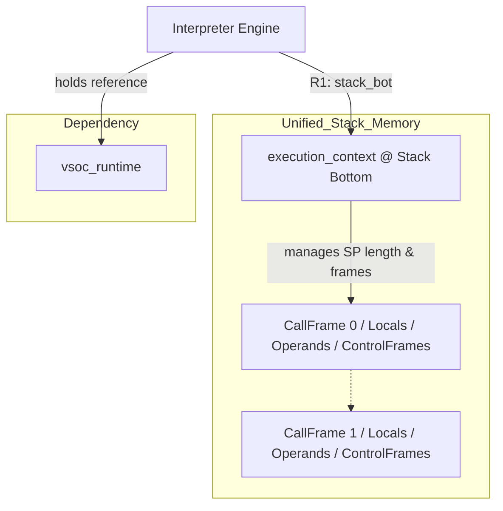
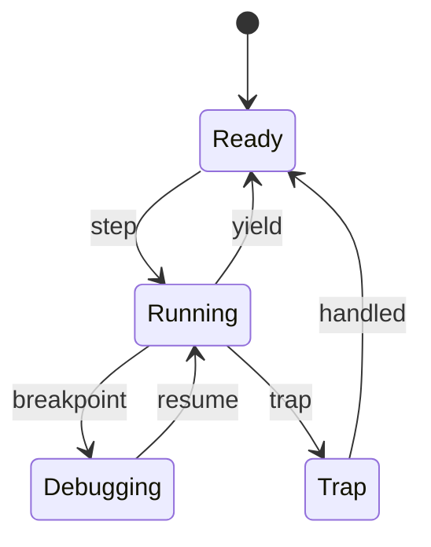
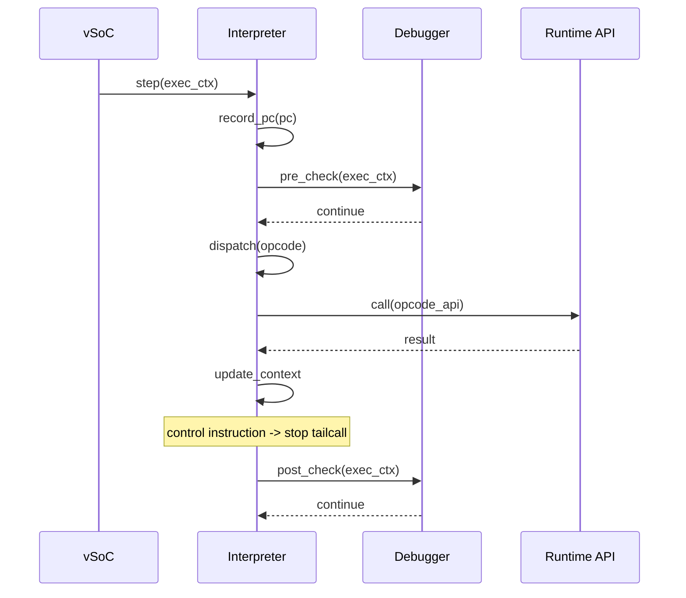

# Interpreter コンポーネント設計書 {VERIFY_FORMAL} {VERIFY_LLM}
<!-- evidence:
     formal: formal/vsoc_state_model.py
     wit: wit/execution_context.wit
     concept: concepts/interpreter_concept.py
     test: tests/runtime_interpreter_test_spec.md
-->

## 1. コンセプト
<!-- traceability: {ThreadedInterpreter} {LowLatencyJIT} {InterpreterContextStackless} {EnvironmentPointer} -->
Interpreter は、WASM命令をスレッドインタープリタ方式で実行し、低レイテンシかつ小フットプリントでゲストを動作させる。Execution Engine (`executor`) の一部として設計され、JITと実行状態を完全に共有する。周辺コンポーネントへの参照は Environment Pointer (`vsoc_runtime* env`) を介して型安全に行う。 `{ThreadedInterpreter}` `{LowLatencyJIT}` `{InterpreterContextStackless}` `{EnvironmentPointer}`

## 2. アーキテクチャ分類
<!-- traceability: {META_3TierSeparation} -->
本コンポーネントは **Tier 2 (分解されたサブコンポーネント: Decomposed Subcomponent)** に属し、vSoC (`runtime_vsoc.md`) から分解された WASM バイトコードの逐次実行および JIT との共用実行コンテキスト管理を担当する。 `{META_3TierSeparation}`

## 3. 静的モデル

### 3.1 データ構造
- **`Interpreter`**: WASM命令の実行、コンテキスト管理、および外部環境（vSoC）との連携をカプセル化した主要クラス。
- **`execution_context` (スタックボトムコンテキスト)**: スタックバッファの最下部（Bottom）に常駐し、仮想CPUレジスタ、スタックの成長長（`stack_depth` / `sp_offset`）、リニアメモリ情報等を保持する。
- **`UnifiedStack` (統合スタック)**: 単一のスタックバッファ上に、コンテキスト、`call_frame`、ローカル変数、オペランドスタック、`control_frame` をすべてインラインで積む統合スタックモデル（Android ART の ShadowFrame / ManagedStack スタイル）。
- **`interpreter_config`**: スタック総容量やyield閾値などの不変な構成情報。

### 3.2 内部ブロック図


### 3.3 主要なクラス・構造体・配列・定数

#### インタプリタ（Interpreter）クラス
依存関係（vSoC環境等）と実行に必要なテーブルをカプセル化する。

| 項目名 | 機能と役割 | 型分類 | サイズ・制約 |
| :--- | :--- | :--- | :--- |
| ランタイム環境 | vSoCランタイム環境への参照（プライベートメンバ） | 構造体への参照 | [`vsoc_runtime`](runtime_vsoc.md) (非所有) |
| ハンドラテーブル | 命令ハンドラへのジャンプテーブル | テーブルポインタ | 関数ポインタの配列 |

#### 実行コンテキスト（execution_context @ スタックボトム）
<!-- traceability: {PositionIndependentCode} {ContextPointerRegister} {MemoryBoundaryCheck} {EnvironmentPointer} -->
WASMゲストの全実行状態を管理する。JIT/Interpreter 共通の仮想CPUレジスタ群として設計する。 `{PositionIndependentCode}` `{ContextPointerRegister}`

**スタックボトム配置と統一スタックフレーム (`{ContextPointerRegister}`)**:
ARM Cortex-M ターゲットにおいて、`execution_context` は **WASM スタックバッファ（2KB 境界アライン）の最下部（Bottom: offset 0）にインライン配置** され、ハンドラ呼び出しの第2引数（`R1: stack_bot`）として渡される。スタックの成長した長さ（`stack_depth` / `sp_offset`）はコンテキスト内で管理され、`call_frame` や `control_frame`、ローカル変数、オペランドスタックはすべてこの単一スタックバッファ上にインラインで積まれる（Android ART ShadowFrame スタイル）。これにより、`sp` ではなく固定の `stack_bot` をレジスタ渡しすることで、ベース相対ロード（`LDR R0, [R1, #offset]`）による高速アクセスを維持しつつ、**`R3` をローカル変数基底ポインタ `local_base`（第4引数）として直接引き回す**。 `{ContextPointerRegister}` `{JIT_RegisterMapping}`

| 項目名 | 機能と役割 | 型分類 | サイズ・制約 |
| :--- | :--- | :--- | :--- |
| スタックボトム基底 | スタックバッファ最下部に常駐する `execution_context` 基底ポインタ | 物理レジスタ | `R1: stack_bot` `{ContextPointerRegister}` |
| プログラムカウンタ | 現在実行中の命令を指し示すプログラムカウンタ（WASMバイトコードオフセット） | オフセット | 32bit符号なし (`ip`: R0) |
| スタック成長長 (SPオフセット) | スタックボトムからの現在のオペランドスタック頂点オフセット/深さ | 長さ/オフセット | 32bit符号なし (`[R1, #0x00]`) |
| カレントフレームオフセット | 現在アクティブな `call_frame` のスタックボトムからの開始オフセット | オフセット | 32bit符号なし (`[R1, #0x04]`) |
| スタック境界上限 (sp_boundary) | スタックオーバーフロー検知用の上限オフセット | 長さ/オフセット | 32bit符号なし (`[R1, #0x08]`) |
| 有効命令ハンドラ | 現在使用されているハンドラ（通常用/デバッグ用）への参照 | テーブルポインタ | `opcode_handler` の配列 (`[R1, #0x0C]`) |
| 環境ポインタ | 実行に必要な環境（vSoC等）への参照 `{EnvironmentPointer}` | 構造体への参照 | [`vsoc_runtime`](runtime_vsoc.md) (`env`: R2) |

`execution_context` は `sp_offset` / `frame_offset` / `sp_boundary` / `handler_table` の4フィールド（計16バイト、`[R1, #0x00]`〜`[R1, #0x0F]`）のみを保持する。リニアメモリ基底・サイズは `execution_context` ではなく **`vsoc_runtime`（`env`: R2）が所有** する——`memory.grow` によって動的に伸長するメモリの実体は複数モジュールにまたがる「環境」側の責務であり、`execution_context` はトレース／ハンドラ呼び出しごとに軽量な統一スタックフレーム情報のみを保持する設計とする。完全な構造体定義（フィールド型と並び順）は正本として [`wit/execution_context.wit`](wit/execution_context.wit) に、バイトオフセットの物理配置は [アーキテクチャ概要書 §3.1](../../architecture/architecture_overview.md) に記載する。

#### コールフレーム（call_frame @ 統合スタックインライン）
<!-- traceability: {PositionIndependentCode} {ContextPointerRegister} {MemoryBoundaryCheck} {EnvironmentPointer} -->
関数呼び出し時に統合スタック上にプッシュされ、ローカル変数や戻り先情報を保持する。

| 項目名 | 機能と役割 | 型分類 | サイズ・制約 |
| :--- | :--- | :--- | :--- |
| 親フレームオフセット | 呼び出し元（親）のコールフレームのスタックボトム相対オフセット | オフセット | 32bit符号なし (フレーム先頭 `+0x00`) |
| 戻り先PC | 関数終了後に戻るべきWASMバイトコードのオフセット | オフセット | 32bit符号なし (`+0x04`) |
| ローカル変数オフセット | このフレームのローカル変数配列の開始オフセット | オフセット | 32bit符号なし (`+0x08`) |
| 関数インデックス | 現在実行中の関数の管理番号 | 関数インデックス | 32bit符号なし (`+0x0C`) |
| 保存済みスタック長 | 関数呼び出し時点のスタック長（復元用） | 長さ | 32bit符号なし (`+0x10`) |

`call_frame` は計20バイト（`+0x00`〜`+0x13`）で、統合スタック上の各フレーム先頭からの相対オフセットを持つ（絶対オフセットは呼び出し深さごとに異なる——{ADR_TosCacheAsymmetry} 参照）。正本は [`wit/execution_context.wit`](wit/execution_context.wit)、物理配置は [アーキテクチャ概要書 §3.1](../../architecture/architecture_overview.md)。

#### 制御フレーム（control_frame @ 統合スタックインライン）
<!-- traceability: {PositionIndependentCode} {ContextPointerRegister} {MemoryBoundaryCheck} {EnvironmentPointer} -->
`block/loop/if` 命令によるネスト構造とジャンプ先を管理するため、スタック上にインラインで積まれる。

| 項目名 | 機能と役割 | 型分類 | サイズ・制約 |
| :--- | :--- | :--- | :--- |
| ラベルPC | ブロックを抜ける際、またはループ先頭に戻る際のジャンプ先 | オフセット | 32bit符号なし (フレーム先頭 `+0x00`) |
| 実行トレース | ジャンプ先のエントリポイント（JITコードまたはハンドラ） | 関数ポインタ | `exec_trace` シグネチャ (`+0x04`) |
| 保存済みスタック長 | ブロック開始時点のスタック長。脱出時の復元に使用 | 長さ | 32bit符号なし (`+0x08`) |
| 結果アリティ | このブロックが戻す値の数（スタック Pruning に使用） | 整数 | 16bit符号なし (`+0x0C`) |
| ループフラグ | 現在の構造が `loop` かどうかを示す | ブール値 | 8bit (`+0x0E`)。`+0x0F` は4バイトアライメントのための予約バイト |

`control_frame` は計16バイト（`+0x00`〜`+0x0F`）。正本は [`wit/execution_context.wit`](wit/execution_context.wit)、物理配置は [アーキテクチャ概要書 §3.1](../../architecture/architecture_overview.md)。

#### インタプリタ構成（interpreter_config）
<!-- traceability: {META_ConfigurableSystem} -->
インタープリタの動作パラメータを定義する。 `{META_ConfigurableSystem}`

| 項目名 | 機能と役割 | 型分類 | サイズ・制約 |
| :--- | :--- | :--- | :--- |
| 統合スタック総容量 | コンテキスト・フレーム・ローカル・オペランドを共用する総バイト数 | バイト数 | 32bit符号なし (`FB_CONF_INTERP_STACK_SIZE`、最小構成 2048) |
| Yield 閾値 | 次の yield までに実行を許可する命令（トレース）数 | 回数 | 32bit符号なし |

#### オプコードハンドラ / トレース実行（opcode_handler / exec_trace）
<!-- traceability: {JIT_RuntimeAPI_Fallback} {ContextPointerRegister} {EnvironmentPointer} {JIT_RegisterMapping} {ADR_TosCacheAsymmetry} -->
命令ハンドラおよびJITトレースの共通実行シグネチャ。継続渡し（Continuation Passing Style: CPS）と `__fastcall` 呼び出し規約により、ホットな実行変数を物理レジスタに直接載せてハンドラ間で引き継ぐ。スタックボトム渡し（`stack_bot`）および第4引数ローカル変数基底（`local_base`）渡しにより、4引数シグネチャに統一している。 `{JIT_RuntimeAPI_Fallback}` `{ContextPointerRegister}` `{EnvironmentPointer}` `{JIT_RegisterMapping}`

| 項目名 | 機能と役割 | 型分類 | サイズ・制約 |
| :--- | :--- | :--- | :--- |
| 実行シグネチャ | `__fastcall` による継続渡し（CPS）4引数シグネチャ | 関数ポインタ | `void (__fastcall *)(const uint8_t* __restrict__ ip, execution_context* __restrict__ stack_bot, vsoc_runtime* __restrict__ env, uint32_t* __restrict__ local_base) noexcept` |
| レジスタ割り当て | ARM AAPCS / `__fastcall` 引数レジスタマッピング | 物理レジスタ | `R0`: `ip`, `R1`: `stack_bot`, `R2`: `env`, `R3`: `local_base` ([アーキテクチャ概要書 §4](../../architecture/architecture_overview.md) 準拠) |

WASM オプコードごとのスタック遷移およびハンドラ実装マトリクスは [WASM 命令セット物理仕様書 (`docs/specs/wasm_instruction_set.md`)](../../specs/wasm_instruction_set.md) を参照。

**スタックトップキャッシュ (`R4`/`R5`) を持たない理由 (`{ADR_TosCacheAsymmetry}`)**:
インタープリタのオプコードハンドラは、オペランドを常に統合スタック上（`[R1, #sp_offset]` 相対）で読み書きし、`R4`/`R5` に TOS/NOS をキャッシュ **しない**。AAPCS の引数レジスタは `R0`〜`R3` の 4 本しかなく、`(ip, stack_bot, env, local_base)` で使い切っており、TOS を保持する余地がないためである。一方 JIT トレースは単一トレース内で `R4`/`R5` を TOS/NOS として占有してよい。この非対称性は、JIT トレース脱出時の `STR` × 2 という有界なコストとして精算される。 `{ADR_TosCacheAsymmetry}` `{JIT_RegisterMapping}`

## 4. 動的モデル

### 4.1 アルゴリズム
<!-- traceability: {ThreadedInterpreter} {JIT_RuntimeAPI_Fallback} {Interpreter_LazyJITSwitch} {LowLatencyJIT} {SimpleJITArchitecture} {Challenge_ApproximateYield} {Debug_Integrated} {ContextPointerRegister} {ADR_TosCacheAsymmetry} -->
- **Threaded Dispatch with Continuation Passing Style (CPS)**: 命令ハンドラを連鎖させるテーブルディスパッチ方式で分岐コストを極小化する。
  - ハンドラ関数型を `void __fastcall(const uint8_t* ip, execution_context* stack_bot, vsoc_runtime* env, uint32_t* local_base) noexcept` に統一。
  - `ip` (R0), `stack_bot` (R1 `{ContextPointerRegister}`), `env` (R2 `{EnvironmentPointer}`), `local_base` (R3 `{ContextPointerRegister}` `{JIT_RegisterMapping}`) のホットな変数を `__fastcall` 引数レジスタ上で保持・更新。
  - スタックの成長長（SP長）を `stack_bot` 内で管理し、`call_frame` / `control_frame` も単一スタック上にインライン構築（Android ART スタイル）し、`R3` をローカル変数基底ポインタ `local_base` として直接引き回す。 `{ContextPointerRegister}` `{JIT_RegisterMapping}`
  - 非制御命令では `[[clang::musttail]]` による直接末尾ジャンプ（Direct-Threaded Code）を行い、レジスタ上の引数をそのまま次のハンドラへ継続渡し（CPS）する。 `{ThreadedInterpreter}`
- **JIT コードとの完全な呼び出し規約整合 (Low-Overhead Interop)**:
  - JIT コンパイラが生成するネイティブトレース（`exec_trace`）も、インタープリタと全く同一の `__fastcall` CPS 4引数シグネチャ（R0=IP, R1=stack_bot, R2=ENV, R3=local_base）に従う。
  - **インタープリタ $\to$ JIT 遷移**: インタープリタから JIT コードへ移行する際、レジスタ上の `(ip, stack_bot, env, local_base)` をそのまま渡して `exec_trace` へ直接ジャンプする。インタープリタは TOS/NOS をレジスタに保持しないため、JIT 側が入口でスタックメモリから `R4`/`R5` をロードする（`{ADR_TosCacheAsymmetry}`）。
  - **JIT $\to$ インタープリタ フォールバック (OSR / Exit)**: JIT トレース内で未サポート命令、トラップ、またはトレース終端に達した場合、レジスタ上の `(ip, stack_bot, env, local_base)` をそのまま次のオプコードハンドラに渡して末尾ジャンプ（`BX`）する。**コンテキストの再構築（構造体への退避・復元、レジスタ再配置）は一切発生しない**。ただし JIT 側のみが保持するスタックトップキャッシュ `R4`/`R5`（ダーティな場合）および更新された `sp_offset` については、統合スタック／コンテキスト構造体へ 2〜3 命令（`STR`）で書き戻す。これが JIT ↔ インタープリタ遷移の唯一の極小コストである。 `{JIT_RuntimeAPI_Fallback}` `{LowLatencyJIT}` `{ADR_TosCacheAsymmetry}`
- **WASM命令とRuntime APIの1対1対応**: 各命令ハンドラはスタックボトム相対でオペランド/スタック長を更新し、必要に応じてランタイムAPIを呼び出す。 `{JIT_RuntimeAPI_Fallback}`
- **ジャンプの高速化 (exec_trace)**: 制御命令（`br`, `br_if` 等）によるジャンプ先を `control_frame` 内の `exec_trace` に保持する。
- **スタック Pruning (Label Arity対応)**: `br` 命令等の実行時、ジャンプ先の `control_frame` に記録された `結果アリティ` に基づき、スタック上のオペランドを残してスタック長を `保存済みスタック長` まで巻き戻す。これにより、Wasm 規定のスタック整合性を保証する。
- **JIT更新戦略**: 
  - 新しく `block`/`loop`/`if` 命令を実行して制御フレームを積む際に、最新の `exec_trace`（JIT済みならそのアドレス、未ならインタープリタ）を取得して保持する。
  - ループの先頭に戻る（`br` 等の）ジャンプ時、現在の `exec_trace` がインタープリタを指している場合は JIT キャッシュを再確認する。最新の JIT トレースが存在すれば、`control_frame` を更新し、ネイティブ実行へ切り替える。 `{Interpreter_LazyJITSwitch}`
- **Hotspot検知**: トレース開始時のPCを履歴バッファに記録する。このバッファは `step` 実行中にのみスタック等に一時保持される揮発的なデータであり、判定終了とともに自動的に破棄される。 `{LowLatencyJIT}` `{SimpleJITArchitecture}`
- **概算Yield**: トレース実行数ベースで `co_yield` を発行し、協調型マルチタスクに整合させる。基本の閾値方式（`yield_threshold`）のみを実装し、Yield精度のキャリブレーションおよびスターベーション対策は `{Challenge_ApproximateYield}` の定義どおり「検討中」ステータスの未解決課題として明示的に据え置く。 `{Challenge_ApproximateYield}`
- **デバッグ・プロファイラフック**: 命令実行前後でブレークポイント判定、実行時PC頻度サンプリング（プロファイラ統合）、およびメモリ/レジスタの動的アサーション検証を行い、Debugger/Profiler に制御を委譲する。 `{Debug_Integrated}`

#### WASM インタプリタ フルセット・コンセプトコード (`concepts/interpreter_concept.py`)
```python
class WASMTrap(Exception):
    pass


class WASMInterpreter:
    MAX_STACK_DEPTH = 64

    def __init__(self, memory_size: int = 65536):
        self.stack = []
        self.locals = []
        self.memory = bytearray(memory_size)
        self.safepoint_pending = False
        self.safepoints_hit = 0

    def push(self, val: int):
        if len(self.stack) >= self.MAX_STACK_DEPTH:
            raise WASMTrap("STACK_OVERFLOW")
        self.stack.append(val & 0xFFFF_FFFF)

    def pop(self) -> int:
        if not self.stack:
            raise WASMTrap("STACK_UNDERFLOW")
        return self.stack.pop()

    def check_safepoint(self) -> bool:
        """Cooperative safepoint polling at loop headers."""
        if self.safepoint_pending:
            self.safepoints_hit += 1
            return True
        return False

    def execute_block(self, instructions: list[tuple[str, object]]) -> str:
        """Executes WASM bytecode with stack bounds & safepoint checking."""
        pc = 0
        while pc < len(instructions):
            op, arg = instructions[pc]
            if op == "i32.const":
                self.push(arg)
            elif op == "i32.add":
                b, a = self.pop(), self.pop()
                self.push(a + b)
            elif op == "i32.sub":
                b, a = self.pop(), self.pop()
                self.push(a - b)
            elif op == "i32.mul":
                b, a = self.pop(), self.pop()
                self.push(a * b)
            elif op == "local.get":
                self.push(self.locals[arg])
            elif op == "local.set":
                self.locals[arg] = self.pop()
            elif op == "br_if_loop_header":
                if self.pop() != 0:
                    if self.check_safepoint():
                        return "SAFEPOINT_YIELD"
                    pc = arg
                    continue
            elif op == "return":
                return "COMPLETED"
            pc += 1
        return "COMPLETED"
```

#### 統合 Tiered ランタイムエンジン・コンセプトコード (`concepts/runtime_engine_concept.py`)
インタープリタ実行、2-bit Hotspot 検出、Copy-and-Patch JIT コンパイル、3面マルチバッファキャッシュ（Active/Warm/Oldest）、および MPU W^X 保護プロトコルを統合した自己完結実行シミュレーションは [`concepts/runtime_engine_concept.py`](concepts/runtime_engine_concept.py) を参照。

### 4.2 状態遷移図
<!-- traceability: {ThreadedInterpreter} {JIT_RuntimeAPI_Fallback} {Interpreter_LazyJITSwitch} {LowLatencyJIT} {SimpleJITArchitecture} {Challenge_ApproximateYield} {Debug_Integrated} -->


### 4.3 内部シーケンス
<!-- traceability: {ThreadedInterpreter} {JIT_RuntimeAPI_Fallback} {Interpreter_LazyJITSwitch} {LowLatencyJIT} {SimpleJITArchitecture} {Challenge_ApproximateYield} {Debug_Integrated} -->
#### Interpreter 実行シーケンス


## 5. インターフェイス定義

### 5.1 公開API
外部から利用可能なオブジェクト指向APIを定義する。

#### 初期化（initialize）

| 項目 | 内容 |
| :--- | :--- |
| 機能概要 | 命令ハンドラテーブルのセットアップやスタック領域の確保等、実行エンジンの初期状態を構築する。 |
| シグネチャ | `initialize(config: const参照) -> 結果型` |
| 引数 | `config`: インタープリタ構成 (`interpreter_config`) への読取専用参照 |
| 戻り値 | 結果型 (成功時は空、失敗時はエラー情報) |
| 事前条件 | 設定値がシステム制限（メモリサイズ等）に適合していること。 |
| 事後条件 | `opcode_handler_table` が正しく配置される。 |
| 不変条件 | 初期化後に設定値を変更できないこと。 |
| エラー時の挙動 | メモリ確保失敗時は初期化を中断し、エラー値を返す。 |
| 補足 | デバッグモードが指定された場合は `debug_handler_table` を使用するように構成する。 |

#### 実行ステップ (`run_step`)
<!-- traceability: {META_RecoveryStrategy} -->

| 項目 | 内容 |
| :--- | :--- |
| 機能概要 | WASM命令を1トレース分実行し、実行コンテキストを更新する。 |
| シグネチャ | `run_step(ctx: 可変参照) -> 結果型` |
| 引数 | `ctx`: 実行コンテキスト (`execution_context`) への可変参照 |
| 戻り値 | 結果型 (正常終了時は SUCCESS、トラップ発生時はリカバリー戦略カテゴリ `recovery-strategy-category` `{META_RecoveryStrategy}`) |
| 補足 | 必要に応じて内部的に JIT コードへのジャンプを行い、JIT/Interpreter を透過的に切り替える。 |

#### 割り込み同期 (`sync_interrupts`)
<!-- traceability: {META_RecoveryStrategy} -->

| 項目 | 内容 |
| :--- | :--- |
| 機能概要 | 外部から通知された割り込みフラグを、実行コンテキストの仮想レジスタに反映する。 |
| シグネチャ | `sync_interrupts(ctx: 可変参照, irq_id: アドレス値) -> void` |
| 引数 | `ctx`: 実行コンテキスト (`execution_context`) への可変参照<br>`irq_id`: 割り込み識別子 (32bit) |
| 戻り値 | void (なし) |
| 期待する結果 | `ctx` 内の `interrupt_flags` が更新され、次回のyield機会で反映される。 |
| 事前条件 | `ctx` が有効な `execution_context` を指していること。 |
| 事後条件 | フラグがアトミックに書き込まれる。 |
| 不変条件 | 実行中の命令ハンドラから安全に参照可能であること。 |
| エラー時の挙動 | 未登録の `irq_id` やキュー満杯時は `recovery-strategy: ignore`（またはログ出力してドロップ）とし、ゲスト実行コンテキストの破壊を防ぐ。 `{META_RecoveryStrategy}` |
| 補足 | vSoC からの通知を仲介する役割を持つ。 |

### 5.2 URI/IPCインターフェイス
<!-- traceability: {META_RecoveryStrategy} -->
本コンポーネントは vSoC の内部ライブラリとして利用され、直接のIPCインターフェイスは持たない。

### 5.3 関連コンポーネントとの連携
<!-- traceability: {META_RecoveryStrategy} -->
| コンポーネント | 連携内容 | 参照データ構造 |
| :--- | :--- | :--- |
| **WASM Loader** | WASMバイナリの索引情報（関数、命令、即値）の提供 | [`module_view`](runtime_loader.md#モジュールビューmodule_view) |
| **JIT Compiler** | ホットスポット情報の共有と実行エンジンの切り替え | `execution_context`, 履歴バッファ |
| **Debugger** | ブレークポイント判定と実行状態の可視化 | `debug_handler_table`, `execution_context` |
| **vSoC** | 実行制御（step）と協調型マルチタスク（yield）の管理 | `execution_context` |

## 6. 制約達成の方策

### 6.1 性能制約と方策
<!-- traceability: {ThreadedInterpreter} -->
- **目標**: WAMRインタープリタを上回る実行速度。
- **方策**: `{ThreadedInterpreter}` による分岐削減と、ホットスポット検知による JIT 移行を組み合わせる。

### 6.2 メモリ制約と方策
<!-- traceability: {ThreadedInterpreter} -->
- **目標**: 64KB RAM環境で動作。
- **方策**: `execution_context` と `call_frame` を最小化し、スタック領域を固定サイズ化する。

### 6.3 安全性制約と方策
<!-- traceability: {META_FaultIsolation} {MemoryBoundaryCheck} -->
- **目標**: ゲストの暴走を隔離。 `{META_FaultIsolation}`
- **方策**: `sp_boundary` と `memory_size`（WASM 64KB ページまたは部分ページ実サイズ）による境界チェック `{MemoryBoundaryCheck}`、`interrupt_flags` による安全な割り込み処理。

## 7. 参考実装リスト

| 名称 | 参照先URL/文献名 | 採用/考慮する理由 |
| :--- | :--- | :--- |
| WAMR Fast Interpreter | github.com/bytecodealliance/wasm-micro-runtime | ロード時ルックアップによる直接ジャンプの定石として |
| WASM3 Interpreter | github.com/wasm3/wasm3 | 最適化されたバイトコードディスパッチャの参考 |
