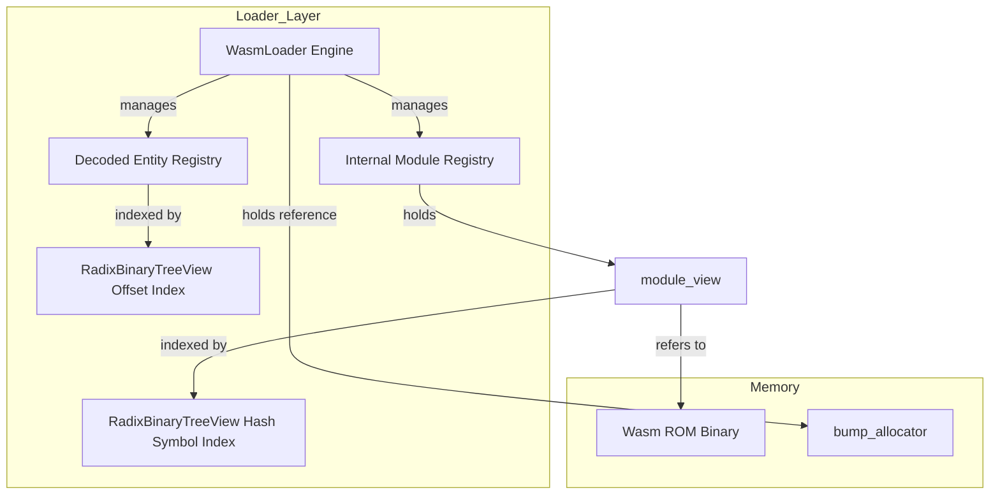
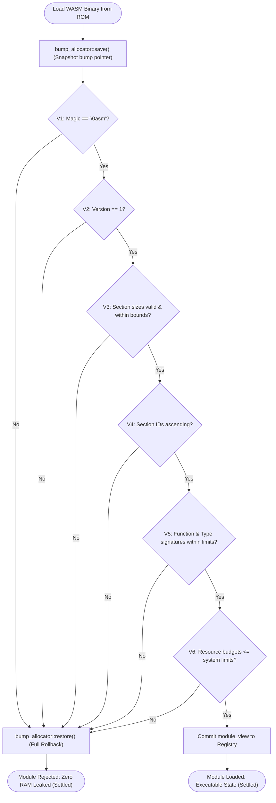
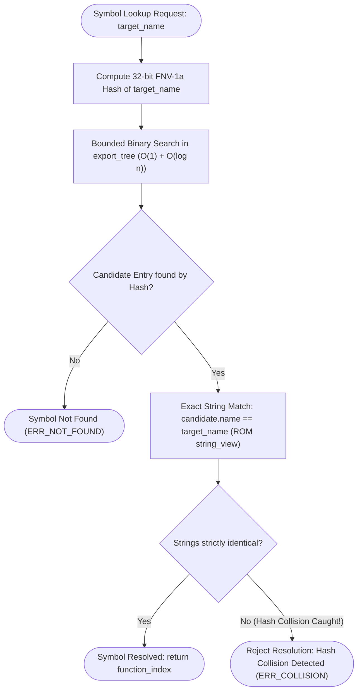
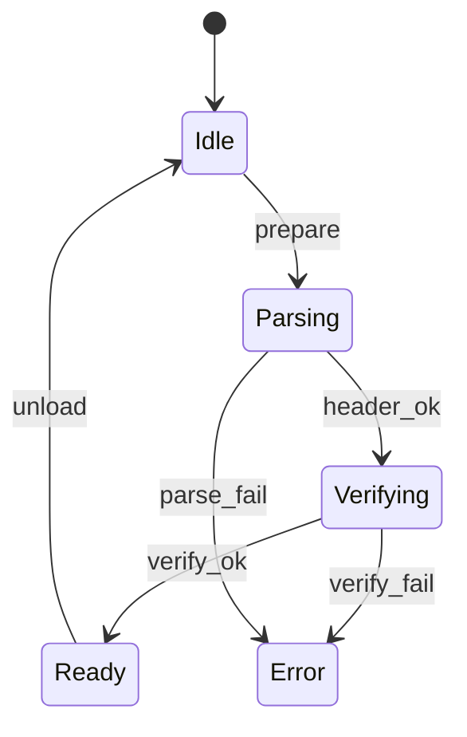
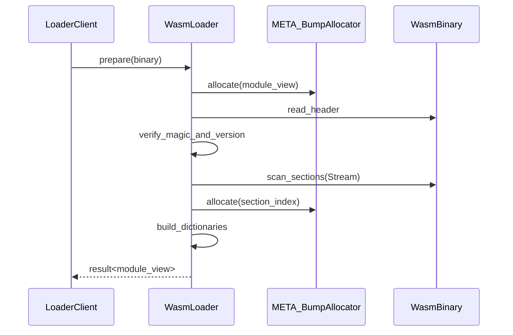

# WASMローダ コンポーネント設計書 {VERIFY_LLM} {VERIFY_FORMAL}
<!-- evidence:
     concept: concepts/loader_concept.py
     formal: formal/loader_verification_model.py
     test: tests/runtime_loader_test_spec.md
-->

## 1. コンセプト
<!-- traceability: {ROMParsing} {META_AccessDictionary} {META_BumpAllocator} {META_BinarySearch} -->
WASMローダは、ROM上のWASM32バイナリをパースし、実行環境が参照しやすい索引構造（ModuleView）を生成する。RAMへの全展開を避け、ROM上のデータを直接参照することでメモリ消費を極小化する。デコードされた各種メタデータ・要素（セクション、関数コード、グローバル、データセグメント）は内部レジストリ（`decoded_entity_registry`）に格納され、**WASMファイル内のバイト位置（データオフセット）をキーとして `RadixBinaryTreeView`（`fireball::radix_binary_tree_view`）により粗粒度インデックス $O(1)$ ＋ 狭域2分探索 $O(\log n)$（全体で $O(\log N)$ 確定時間）で高速検索** できる。さらに、**インポートテーブルおよびエクスポートシンボルの検索も、文字列比較ではなくシンボル名ハッシュ（FNV-1a 32-bit）をキーとした `RadixBinaryTreeView` により $O(1) + O(\log n)$ で瞬時に解決・引き当てる**。 `{ROMParsing}` `{META_AccessDictionary}` `{META_BumpAllocator}` `{META_BinarySearch}`
本設計の動作モデルおよび軽量検証スコープ（V1〜V6）、ハッシュ＋RadixBinaryTreeView によるシンボル・インポート検索、RadixBinaryTreeView によるファイル位置逆引き、バンプアロケータによるトランザクション保護（`save`/`restore`）は、コンセプトコード（[`concepts/loader_concept.py`](concepts/loader_concept.py)）によって動作検証されている。

## 2. アーキテクチャ分類
<!-- traceability: {META_3TierSeparation} -->
本コンポーネントは **Tier 2 (分解されたサブコンポーネント: Decomposed Subcomponent)** に属し、vSoC (`runtime_vsoc.md`) から分解された WASM バイナリのパース・検証、デコード値レジストリ管理、ファイル内データ位置およびインポート/エクスポートハッシュからの RadixBinaryTreeView 索引構築、および ROM 上の索引構築（ModuleView）を担当する。 `{META_3TierSeparation}`

## 3. 静的モデル

### 3.1 データ構造
<!-- traceability: {MultiModule_Support} {META_AccessDictionary} -->
- **`WasmLoader`**: WASMバイナリのパース、検証、およびロード済みモジュールの管理を一括して行う主要クラス。
- **`module_view`**: ROM上のバイナリデータへの参照と、構築された索引群を保持する読み取り専用の構造体。
- **`module_registry`**: ロード済みの `module_view` を名前で管理するための内部リスト。 `{MultiModule_Support}`
- **`decoded_entity_registry`**: デコードされた各エンティティ（セクション、関数コード、グローバル、データセグメント）を保持するレジストリ。
- **`entity_offset_tree` (`radix_binary_tree_view`)**: ファイル内のバイト位置（開始オフセット）をキーとしてデコード済みエンティティへ $O(1) + O(\log n)$ でマッピングする基数2進木索引。
- **`import_tree` / `export_tree` (`radix_binary_tree_view`)**: シンボル名（インポート名・エクスポート名）のハッシュ値をキーとして各エントリへ $O(1) + O(\log n)$ でマッピングする基数2進木索引。
- **`basic_block_tree` (`radix_binary_tree_view`)**: モジュール内の全基本ブロックメタ情報（`BasicBlock`: `head_pc`, `next_pc`, `loops_to`, `frame_depth`, `byte_span`）へ UnifiedPC（`bswap32(pc)`）でアクセスする基数2進木索引。`BasicBlock` はPCレンジと制御フローメタ情報のみを保持し、デコード済み命令列は持たない――命令列はブロックが実際にコンパイル・実行される瞬間にのみ、バイトコードから都度ストリーミングで導出する（`TraceBlock`）。ランタイムや JIT コンパイラがブロック探索・メタ情報を再生成することなく、ローダ側の不変（ReadOnly）索引構造から直接 $O(1) + O(\log n)$ でブロック解決する。 `{Loader_BasicBlockIndex}`
- **`control_skip_tree` (`radix_binary_tree_view`)**: デリミタPCからフォールスルー先ブロック先頭PCへの基数2進木索引。制御フロー終端のジャンプ解決をローダ側で保持・提供する。

### 3.2 内部ブロック図
<!-- traceability: {MultiModule_Support} -->

### 3.3 主要なクラス・構造体・配列・定数
<!-- traceability: {MultiModule_Support} -->

#### WASMローダ（WasmLoader）クラス
依存関係（アロケータ等）と内部レジストリをカプセル化する。

| 項目名 | 機能と役割 | 型分類 | サイズ・制約 |
| :--- | :--- | :--- | :--- |
| 作業用アロケータ | 索引構築時のメモリ割り当てに使用する（プライベートメンバ） | 構造体への参照 | `bump_allocator` (非所有) |
| モジュール索引 | ロード済みモジュールを名前で引くための内部管理リスト | アクセス辞書 | `module_registry` |

#### モジュールビュー（module_view）
<!-- traceability: {ROMParsing} -->
ROM上のバイナリデータに対する「窓」として機能し、WIT上では `wasm-module-view` リソースとして定義される。
データをRAM上に展開するのではなく、必要な時に必要な情報（セクション、関数ボディ、グローバル）へアクセスするためのアクセサを提供する。
これにより、RAM消費を最小限に抑えつつ、クライアントに対しては型安全なインターフェースを提供する。 `{ROMParsing}`

- **セクション索引**: WASM標準セクション（Type, Import, Code等）のオフセットとサイズをキャッシュする。
- **シンボル検索**: エクスポート名ハッシュからインデックスへの高速な引き当て（`export_tree`）を提供する。

#### バイナリストリーム（BinaryStream）
<!-- traceability: {ROMParsing} -->
ROM上のデータストリームを管理し、LEB128可変長整数やプリミティブ型の読み出しを提供するユーティリティクラス。
`std::span<const uint8_t>` をラップし、カレントポインタ（カーソル）管理と厳格な境界チェックを行う。

| 機能 | 説明 |
| :--- | :--- |
| `read_u8/u16/u32/u64` | 固定長符号なし整数の読み出し（カーソルが進む） |
| `read_s8/s16/s32/s64` | 固定長符号あり整数の読み出し |
| `read_leb128_u32/s32` | 可変長整数 (LEB128) のデコード（最大 5 バイト制限。超過時またはストリーム終端時は即時パースエラー） |
| `read_leb128_u64/s64` | 64bit 可変長整数 (LEB128) のデコード（最大 10 バイト制限。超過時は即時パースエラー） |
| `read_bytes` | 指定バイト数の参照（`std::span<const uint8_t>`）を返す |
| `remaining` | ストリームの残量チェック |

#### 関数アクセサ（function_accessor）
<!-- traceability: {ROMParsing} -->
関数の詳細情報へアクセスするための一時的なプロキシオブジェクト。WIT上では `wasm-function-accessor` リソースとして定義される。
メソッド呼び出し時にROM上のデータをデコードして値を返す。

| 項目名（プロパティ） | 機能と役割 | 型分類 |
| :--- | :--- | :--- |
| `get_type_index` | 関数の型定義へのインデックス | デコードメソッド |
| `get_locals_stream` | 関数のローカル変数定義のイテレータ（ストリーム） | デコードメソッド |
| `get_code_stream` | 関数の実行本体（バイトコード）のストリーム | デコードメソッド |

#### グローバルアクセサ（global_accessor）
<!-- traceability: {ROMParsing} -->
グローバル変数の定義情報へアクセスするための一時的なプロキシオブジェクト。WIT上では `wasm-global-accessor` リソースとして定義される。

| 項目名（プロパティ） | 機能と役割 | 型分類 |
| :--- | :--- | :--- |
| `get_metadata` | グローバル変数の値の種類（i32/i64等）と書き込み可否 | デコードメソッド |
| `get_init_expr_stream` | 初期化定数式のバイトコードストリーム | デコードメソッド |

#### 検証結果（verification_result）
<!-- traceability: {LightweightVerifier} -->
バイナリ検証の結果と、不備があった場合の情報を保持する。 `{LightweightVerifier}`

| 項目名 | 機能と役割 | 型分類 | サイズ・制約 |
| :--- | :--- | :--- | :--- |
| 検証成功フラグ | すべての形式・意味検証をパスしたか | ブール値 | - |
| 異常箇所特定 | 検証失敗時のバイナリ内オフセットと範囲 | データ範囲 | `BinaryStream` |

## 4. 動的モデル

### 4.1 アルゴリズム
<!-- traceability: {ZeroCopyIndexing} {META_AccessDictionary} {META_BumpAllocator} -->
- **バイナリパース & トランザクション保護 (`LOAD-GOTCHA-02`, `{META_BumpAllocator}`)**:
  ROM上のデータを `BinaryStream` でラップし、`read_leb128`（最大 5/10 バイトガード）等を用いて境界チェックを行いながら順次読み取る。パース開始前に `bump_allocator::save()` でアロケータ位置を記憶し、パースや検証が失敗した場合は `bump_allocator::restore()` により確保途中の RAM 領域を完全にロールバックする。
  **設計理由と不変条件**: WASM バイナリの検証エラー（セクション長不整合、未定義型参照、リソース上限超過等）が発生した際、途中まで確保した内部メタデータやインデックス領域が残留すると、静的バンプアロケータの物理メモリが永久に枯渇・リークする。そのため、検証失敗時は例外なくアロケータ位置を開始前のスナップショットへ完全に巻き戻し、不正バイナリによるリソース断片化をゼロにする。
- **module_view 構築 & デコード値レジストリ登録 (Zero-Copy & Radix-Indexed)**: `{ZeroCopyIndexing}` `{META_BinarySearch}`
    - セクションスキャン時に内容をRAMにコピーせず、ROM上の開始オフセットとサイズを索引化する。
    - 各セクション、関数コードブロック、グローバル変数、データセグメント等のデコード済みエントリを `decoded_entity_registry` に登録する。
    - 各エントリの開始ファイルオフセット `file_offset` をキーとして、基数2進探索木ビュー（`fireball::radix_binary_tree_view`）を構築する。粗い Radix Table で区間を特定後、有界二分探索により $O(1) + O(\log n)$ でファイル内の任意バイト位置から該当するデコード済みエンティティ（関数メタデータ、セクション、データ定義）を高速逆引きできるようにする。
    - エクスポートおよびインポートエントリをパースし、シンボル名の 32-bit ハッシュ値（FNV-1a）を算出。名前文字列は ROM 上のポインタ（`std::string_view`）として RAM コピーゼロで保持しつつ、ハッシュ値をキーとした `export_tree` / `import_tree`（`fireball::radix_binary_tree_view`）を構築する。
- **シンボル検索とハッシュ衝突完全排除 (`LOAD-GOTCHA-01`, `{META_AccessDictionary}`, `{META_BinarySearch}`)**:
  文字列比較ループを行わず、シンボル名ハッシュ（FNV-1a 32-bit）をキーとして `export_tree`（`radix_binary_tree_view`）を $O(1) + O(\log n)$ で探索。
  **設計理由と不変条件**: 32-bit ハッシュ値による探索のみで関数解決を完了させると、万一のハッシュ衝突発生時に誤った関数がディスパッチされ、壊滅的な誤動作を引き起こす。そのため、ハッシュ探索で候補エントリがヒットした際は必ず ROM 上の元のシンボル名文字列と 1 回完全一致照合を行い、ハッシュ衝突によるシンボル誤認を完全に排除する。
- **インポートテーブル検索と依存関係解決 (resolve_imports)**: インポートテーブルの各エントリに対し、インポート先モジュール名・フィールド名のハッシュ値を用いて対象モジュールの `export_tree`（`radix_binary_tree_view`）を $O(1) + O(\log n)$ で直接引き当てる。文字列走査を行わずに $O(1) + O(\log n)$ で依存関係を解決し、モジュールを実行可能状態へ遷移させる。 `{MultiModule_Support}` `{META_BinarySearch}`
- **ファイル位置逆引き (lookup_by_file_offset)**: 任意のファイル内バイトオフセットから `entity_offset_tree`（`radix_binary_tree_view`）を検索し、そのオフセットを包含するデコード済みエンティティ（セクション、関数、データ等）を即座に特定・返却する。
- **メモリセクション検証**: Memory Section をパースし、論理ページサイズ（64KB単位）および初期要求ページ数を取得。物理割当が部分ページ（例: 8KB）の場合や複数ページ（`N * 64KB`）の場合でも、モジュール初期ページ要求とシステム物理予算（`FB_CONF_MAX_WASM_PAGES`）を照合し、実行時境界判定へ引き渡す。
- **アンロードと LIFO メモリ回収制約 (`LOAD-GOTCHA-03`)**:
  `unload` は module_registry からモジュールを削除する。
  **設計理由と不変条件**: 本システムは動的フリーリスト管理によるメモリ断片化や管理オーバーヘッドを完全に排除するため、決定論的静的バンプアロケータを採用している。したがって、モジュールが使用していた物理 RAM を完全に回収して再利用可能とするためには、モジュールのアンロードは「ロード順の厳格な逆順（LIFO: Last-In First-Out）」で実行されなければならない。途中のモジュールをアンロードした場合はレジストリからの論理削除のみが行われ、最上位のモジュールがアンロードされた時点で初めてバンプポインタが安全に巻き戻される。

#### トランザクション的パース & ロールバック手順（手順アクティビティ図）
<!-- traceability: {LOAD-GOTCHA-02} {LightweightVerifier} {META_BumpAllocator} -->
WASM バイナリパース中の軽量検証（V1-V6）判定と、エラー発生時のバンプアロケータ完全ロールバックによるメモリリーク防止手順を示す。

#### FNV-1a シンボル検索 & 生文字列完全一致照合（手順アクティビティ図）
<!-- traceability: {LOAD-GOTCHA-01} {META_AccessDictionary} {META_BinarySearch} -->
32-bit FNV-1a ハッシュ探索の高速性と、万一のハッシュ衝突によるシンボル誤認を完全に排除する照合手順を示す。

### 4.2 メモリ制約
<!-- traceability: {META_ConfigurableSystem} -->
`module_view` と関連構造の最大サイズ。すべてコンパイル時固定。 `{META_ConfigurableSystem}`

| 項目 | 定数名 | 既定値 | 根拠 |
| :--- | :--- | :--- | :--- |
| 最大モジュール数 | `FB_CONF_MAX_MODULES` | 4 | 単一アプリ + 3ライブラリ |
| 最大関数数/モジュール | `FB_CONF_MAX_FUNCTIONS` | 256 | 典型的な組み込みWASMアプリ |
| 最大エクスポート数/モジュール | `FB_CONF_MAX_EXPORTS` | 64 | エクスポート名ソート済み配列 |
| 最大グローバル数/モジュール | `FB_CONF_MAX_GLOBALS` | 32 | グローバルアクセサ配列 |
| 最大インポート数/モジュール | `FB_CONF_MAX_IMPORTS` | 32 | インポート解決テーブル |

### 4.3 軽量検証スコープ
<!-- traceability: {ZeroCopyIndexing} {META_AccessDictionary} {META_ConfigurableSystem} -->
以下の項目をロード時に検証する。これ以上の検証（型システムの完全検証、命令の妥当性検証等）はPhase1+で検討。

| # | 検証項目 | 判定基準 | 失敗時 |
| :--- | :--- | :--- | :--- |
| V1 | マジックナンバー | `\0asm` (4bytes) | reject |
| V2 | バージョン | `1` (u32, WASM 1.0) | reject |
| V3 | セクション境界 | 各セクションのsizeがバイナリ末尾を超えない | reject |
| V4 | セクション順 | Customセクション以外はID昇順 | reject |
| V5 | インポート/エクスポート型整合 | 型インデックスがTypeセクション範囲内 | reject |
| V6 | メモリセクション境界 | 初期要求メモリサイズ（初期ページ数 × 64KB、または部分ページ構成時は初期バイト数）がゲストRAM物理割り当て予算（`FB_CONF_GUEST_RAM_SIZE`）以下であること | reject |

### 4.4 状態遷移図
<!-- traceability: {ZeroCopyIndexing} {META_AccessDictionary} {META_ConfigurableSystem} {LightweightVerifier} -->

### 4.5 内部シーケンス
<!-- traceability: {ZeroCopyIndexing} {META_AccessDictionary} {META_ConfigurableSystem} {LightweightVerifier} -->
#### モジュールロードシーケンス

## 5. インターフェース定義

### 5.1 公開API
外部から利用可能なオブジェクト指向APIを定義する。

#### 準備（prepare）

| 項目 | 内容 |
| :--- | :--- |
| 機能概要 | ROM上のWASMバイナリをパースし、内部レジストリに登録してビューを取得する。 |
| シグネチャ | `prepare(wasm: binary-view) -> result<wasm-module-view, sys-recovery-strategy>` |
| 引数 | `wasm`: WASMバイナリデータ (ROM直接参照) |
| 戻り値 | 成功時は `wasm-module-view` リソース、失敗時はリカバリ戦略 |
| 事前条件 | システムが初期化済みであること。 |
| 事後条件 | 成功時、内部レジストリにモジュールが登録される。 |

#### ロード（load）

| 項目 | 内容 |
| :--- | :--- |
| 機能概要 | モジュールの線形メモリをゲストRAMに展開し、初期化する。 |
| シグネチャ | `load(module: wasm-module-view) -> operation-result` |
| 引数 | `module`: 展開対象のモジュールビュー |
| 事前条件 | モジュールが `prepare` によりハースネスに登録済みであること。 |
| 事後条件 | モジュールのリニアメモリおよびテーブル領域がゲストRAMに確保・初期化される。 |

#### `resolve-imports`

| 項目 | 内容 |
| :--- | :--- |
| 機能概要 | モジュールのインポートセクションをスキャンし、レジストリ内の他モジュールとリンクする。 |
| シグネチャ | `resolve-imports(module: wasm-module-view) -> operation-result` |
| 事前条件 | 依存するすべてのモジュールが既にロード（リポジトリに登録）されていること。 |
| 事後条件 | 成功時、モジュールが実行可能状態になる。 |

#### アンロード（unload）

| 項目 | 内容 |
| :--- | :--- |
| 機能概要 | モジュールをレジストリから削除し、関連リソースを解放する。 |
| シグネチャ | `unload(module: wasm-module-view) -> operation-result` |
| 事前条件 | 対象モジュールがロード済みであること。 |
| 事後条件 | モジュールに関連するすべての管理リソースが解放される。 |
| 補足 | バンプアロケータを使用しているため、完全なメモリ回収はロードの逆順で行う必要がある。 |

#### 検索（lookup）

| 項目 | 内容 |
| :--- | :--- |
| 機能概要 | 登録済みのモジュールを名前で検索し、そのビューを取得する。 |
| シグネチャ | `lookup(name: 文字列ビュー) -> オプショナル値` |
| 引数 | `name`: 検索するモジュール名 |
| 戻り値 | オプショナル値 (成功時は `module_view` への参照、失敗時は空) |

#### `get-section`

| 項目 | 内容 |
| :--- | :--- |
| 機能概要 | 指定されたモジュール内の特定のWASMセクションのオフセットとサイズ（`wasm-section-view`）を取得する。 |
| シグネチャ | `get-section(stype: section-category) -> result<wasm-section-view, bool>` |
| 引数 | `stype`: 取得対象のセクション定数 |
| 戻り値 | `wasm-section-view` (オフセットとサイズ) |
| 事前条件 | モジュールが `prepare` 済みであること。 |

#### `lookup-export-func`

| 項目 | 内容 |
| :--- | :--- |
| 機能概要 | モジュールが公開している関数を名前で検索し、そのインデックスを取得する。 |
| シグネチャ | `lookup-export-func(name: string) -> result<u32, bool>` |
| 戻り値 | 成功時はWASM関数インデックス、失敗時は `false` |
| 不変条件 | 検索は二分探索により O(log N) で行われること。 |

#### `get-function`

| 項目 | 内容 |
| :--- | :--- |
| 機能概要 | 指定されたインデックスの関数アクセサ（`wasm-function-accessor`）を生成する。 |
| シグネチャ | `get-function(func-idx: u32) -> result<function-accessor, bool>` |
| 事前条件 | `func-idx` がモジュールの定義範囲内であること。 |
| 事後条件 | 有効なアクセサ、または範囲外エラーを返す。 |

#### `get-global`

| 項目 | 内容 |
| :--- | :--- |
| 機能概要 | 指定されたインデックスのグローバルアクセサ（`wasm-global-accessor`）を生成する。 |
| シグネチャ | `get-global(global-idx: u32) -> result<global-accessor, bool>` |
| 事前条件 | `global-idx` がモジュールの定義範囲内であること。 |
| 事後条件 | 有効なアクセサ、または範囲外エラーを返す。 |

#### `lookup-by-file-offset`
<!-- traceability: {META_BinarySearch} {META_AccessDictionary} -->
| 項目 | 内容 |
| :--- | :--- |
| 機能概要 | WASMバイナリ内のファイルバイト位置（オフセット）から、該当するデコード済みエンティティ（セクション、関数コード、グローバル、データ等）を `RadixBinaryTree` 索引により高速検索・特定する。 |
| シグネチャ | `lookup-by-file-offset(file-offset: u32) -> result<decoded-entity-view, bool>` |
| 引数 | `file-offset`: WASMバイナリ内のバイト位置 |
| 戻り値 | 成功時はデコード済みエンティティへのビュー、該当なし時は `false` |
| 不変条件 | 検索は `radix_binary_tree_view` による基数表＋有界二分探索（$O(1) + O(\log n)$）で行われること。 |

### 5.2 URI/IPCインターフェース
本コンポーネントは vSoC 内部で使用されるライブラリであり、直接のIPCインターフェースは持たない。

## 6. 制約達成の方策

### 6.1 性能制約と方策
<!-- traceability: {ROMParsing} {META_AccessDictionary} -->
- **目標**: モジュールロード時間を最小化する。
- **方策**: `{ROMParsing}` `{META_AccessDictionary}` RAMへのコピーを排除し、主要な要素を索引化することで、実行時の探索コストを抑える。

### 6.2 メモリ制約と方策
<!-- traceability: {META_BumpAllocator} {META_NoStdVector} -->
- **目標**: ロード時のRAM消費を極小化する。
- **方策**: `{META_BumpAllocator}` `{META_NoStdVector}` バンプアロケータを使用し、断片化を防止しつつ、固定長配列による索引管理を行う。

### 6.3 安全性制約と方策
<!-- traceability: {LightweightVerifier} {Wasm32Only} -->
- **目標**: 不正なWASMバイナリによるクラッシュを防止する。
- **方策**: `{LightweightVerifier}` `{Wasm32Only}` ロード時にマジック値、バージョン、セクション境界の整合性を検証し、不正なバイナリを拒否する。
