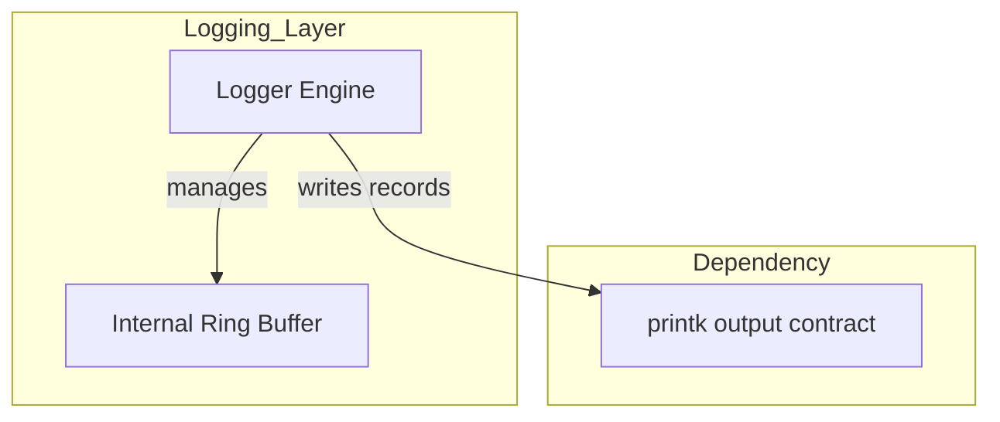
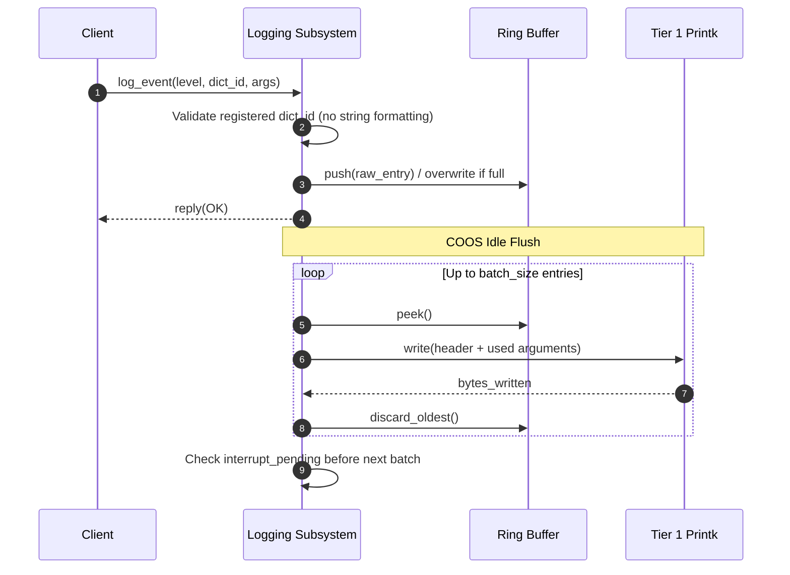

# ロギング コンポーネント設計書 {VERIFY_LLM} {VERIFY_FORMAL}
<!-- evidence:
     concept: concepts/logging_concept.py
     formal: formal/logging_flush_model.py
     test: docs/qa/tier2_runtime/runtime_logging_test_spec.md
-->

## 1. コンセプト
<!-- traceability: {BufferedLogging} {GLOBAL_IdleDetection} -->
ロギングコンポーネントは、Tier 2 RuntimeとTier 3プラグインの状態を固定辞書オフセットとスカラー引数で記録し、固定長リングバッファへ格納する。COOSの **Idle Hook** は低負荷時にバッファをTier 1 [`printk.md`](docs/components/tier1_core/printk.md) の出力契約へ転送する。Tier 1のCOOSとIPCは本ロガーを利用せず、OS診断を同じprintk契約へ直接出力する。ゲスト標準出力は本コンポーネントの対象外である。自己完結した参照実装は [`logging_concept.py`](docs/components/tier2_runtime/concepts/logging_concept.py) を参照。

**適用範囲外**: 本コンポーネントが扱うのはビルド時に辞書登録された固定フォーマットの内部状態ログのみである。ゲストの `wasi:cli/stdout`/`stderr`（`print`/`eprint` による実行時生成の任意長文字列）はここでは表現できず、コンソール生バイト出力経路（`interface_wit.md` の `console-output` の位置づけ節）という別経路で扱う。

## 2. アーキテクチャ分類
<!-- traceability: {META_3TierSeparation} -->
本コンポーネントは **Tier 2 (分解されたサブコンポーネント: Decomposed Subcomponent)** に属する。ロギングはネイティブ常駐タスクとして COOS 上で動作するサブシステムである。COOS のタスクスケジューリング（Tier 1）に依存するため、COOS 自身と同じ Tier には置かない。

## 3. 静的モデル

### 3.1 データ構造
- **`Logger`**: ログの収集、バッファリング、および物理出力への転送を一括して管理する主要クラス。
- **`logging_config`**: バッファサイズやデフォルトログレベルなどの不変な構成情報。
- **`log_entry`**: リングバッファに格納される単一のログデータ構造（辞書オフセット + 引数）。

### 3.2 内部ブロック図

### 3.3 主要なクラス・構造体・配列・定数

#### ロガー（Logger）クラス
依存関係（Tier 1 printk出力契約）とバッファ状態をカプセル化する。

| 項目名 | 機能と役割 | 型分類 | サイズ・制約 |
| :--- | :--- | :--- | :--- |
| 出力トランスポート | `printk` の物理出力Sinkへの参照 | 構造体への参照 | `printk` (非所有) |
| 循環バッファ | ログデータを一時的に保持する領域 | リングバッファ | 固定長配列 |
| 書き込み/読み出し索引 | バッファの現在の状態を示すポインタ | アトミック値 | 32bit |
| 出力閾値 | 現在出力対象としている最小のログレベル | 8bit整数 | `log_level` |

#### ログ構成（logging_config）
<!-- traceability: {META_ConfigurableSystem} -->
ロギングシステムの動作パラメータを定義する。

| 項目名 | 機能と役割 | 型分類 | サイズ・制約 |
| :--- | :--- | :--- | :--- |
| バッファ総容量 | 循環バッファの大きさを定義する | バイト数 | 2のべき乗 |
#### ログ辞書（LogDictionary）
<!-- traceability: {META_FlatMapIndexed} -->
ROM上に固定配置されたフォーマット文字列配列の非所有アクセスを担う。

| 項目名 | 機能と役割 | 型分類 | サイズ・制約 |
| :--- | :--- | :--- | :--- |
| 辞書ストレージ参照 | ROM上のソート済み固定長エントリ配列（`flat_map_storage`）への参照（所有権分離） | 非所有参照 | `flat_map_storage` |
| ペイロードビュー | $O(\log N)$ 二分探索を行う非所有スパン | 非所有ビュー | `fireball::flat_map_view` |

## 4. 動的モデル

### 4.1 アルゴリズム
<!-- traceability: {BufferedLogging} {WasmCodeSectionPC} -->
- **辞書参照ロギング (`GOTCHA-LOG-01`)**: {GOTCHA-LOG-01} <!-- definition: {GOTCHA-LOG-01} -->
  呼出し側はメッセージ文字列ではなく、辞書内のオフセットと引数のみを`log_event`へ渡す。
  **設計理由と不変条件**: ログ API は任意長文字列ポインタ（`%s`、`%p` 等）を直接受け付けない。実行時に構築した文字列ポインタをログエントリに格納すると、ログ出力元タスクの終了後にロガーが無効なメモリを参照するおそれがある。Use-After-Free を防ぐため、ログメッセージは静的辞書オフセットとスカラー引数（u32）に限定する。これによりメモリ安全性を保証する。
- **遅延出力と割り込み応答性 (`GOTCHA-LOG-03`)**: {GOTCHA-LOG-03} <!-- definition: {GOTCHA-LOG-03} -->
  `log_event`はリングバッファへの格納のみを行い、実際の出力はCOOSアイドルフックからTier 1 `printk` のバイト出力へ行う。ロガーはHALやIPCの稼働を必要としない。具体的な物理出力先（UARTやITMなど）はTier 3 Platformで指定する。
  **設計理由と不変条件**: ログフラッシュは各エントリを辞書の引数数に従って符号化し、Tier 1 `printk`の同期バイト出力へ渡す。`batch_size`件までの出力後に`interrupt_pending()`を確認する。RuntimeロガーはDMA開始や完了割り込みを管理しない。
  割り込みを検出した場合は次のバッチを開始しない。残りのエントリをバッファに残し、スケジューラへ制御を戻す。割り込み確認までの件数は1バッチ以内である。実時間は物理出力先の同期書込み時間に依存し、応答時間の上限は保証しない。
- **バッファフル・ポリシー (`GOTCHA-LOG-02`)**: **FINALIZED: Overwrite** {DeterministicRingBuffer}。 <!-- definition: {DeterministicRingBuffer} --> {GOTCHA-LOG-02} <!-- definition: {GOTCHA-LOG-02} -->
  リングバッファが満杯の場合、古いログを破棄して新しいログを書き込む。システムの稼働継続を優先する。
  **設計理由と不変条件**: ログバッファ満杯時に呼び出し元をブロックしたり、動的に再確保したりしてはならない。高負荷時や異常フォールト時に、ログ処理がシステム全体のデッドロックやメモリ枯渇を招くためである。満杯時は最も古いエントリを非ブロッキングで上書きし、ドロップカウンタを増やす。直近の診断情報を残し、システムの稼働を継続する。
- **トラップ発生箇所での診断情報捕捉 (`GOTCHA-LOG-04`)**: {GOTCHA-LOG-04} <!-- definition: {GOTCHA-LOG-04} -->
  インタープリタは、トラップによって呼出しフレームを解体する直前に `unified_pc` とトラップ原因コードを確定し、ロガーへ引き渡す。
  **設計理由と不変条件**: フレーム解体後は現在のモジュールと命令PCを復元できない。解体前にPCを捕捉しなければ、診断ログに発生位置を記録できない。イベント ID をトラップ原因コードから機械的に算出する（4.2.1）。これにより、ログ辞書エントリの登録漏れも防ぐ。

### 4.2 辞書構造
<!-- traceability: {BufferedLogging} -->
辞書はROM上に固定配置され、ホスト側ツールが `dict_offset + args` から可読テキストに展開する。

| 項目 | 値 |
| :--- | :--- |
| 配置場所 | ROM (実行時不変) |
| エントリフォーマット | `{ id: u32, format: null-terminated UTF-8 }` (AoS) |
| 最大エントリ数 | `FB_CONF_LOG_DICT_MAX_ENTRIES` (コンパイル時固定) |
| 所有権モデル | ストレージ所有権分離。ROM上のソート済みAoS固定長配列（`flat_map_storage`）に実体を配置し、`LogDictionary` および `Logger` は非所有スパン（`flat_map_view`）を介して二分探索を行う。ロガー本体が辞書配列を複製・所有することはない |
| フォーマット文字列 | printf形式。最大4個の `u32` 引数を参照可能。不許可指定子（`%s`, `%p`, `%c` 等のポインタ間接参照）はビルド時に静的拒絶 |
| 引数数メタデータ | 数値指定子数 $n$（$0 \le n \le 4$）をビルド時に確定する。`%%`は引数を消費しない。ソート済み辞書の各エントリに対応する不変の1バイト表を生成し、送受信側で同じIDと引数数の対応を共有する。ID索引と文字列は複製しない |
| 引数スライス規則 | 固定容量の4引数スロットの先頭 $n$ 個のみを転送・展開する。未使用スロットの値は転送しない |
| 登録時期 | ビルド時 (実行時の追加は不可) |

デバイス上のロガーはフォーマット文字列を走査・展開しない。`printk` へ送る1レコードは `4 + 4n` バイトである。先頭に `level:u8` と `dict_offset:u24 little-endian` を格納し、辞書IDに対応する引数数 $n$ 個の `u32 little-endian` を順に続ける。引数数やレコード長のフィールドは送信しない。引数0〜4個の転送長は、それぞれ4、8、12、16、20バイトとなる。リングバッファの各スロットと送信作業領域は最大4引数の固定容量を維持する。

ロガーとprintkは同一ビルドの辞書IDと引数数を共有する。printkは書込み時に完全な1レコードを復号し、レベル名と展開済みメッセージに改行を付けてUTF-8で出力する。書込み成功時の戻り値は消費した入力レコードのバイト数とする。出力先が受理しない場合は0を返し、ロガーは未送信エントリを保持してassertで停止する。ホスト側ツールで内部レコードを復号する場合は4バイトのヘッダを読み、辞書の引数数から次のレコード位置を決める。引数数が異なる辞書や旧20バイト固定形式とは互換性を持たない。未知IDからレコード境界を推測して復号を継続しない。

辞書IDは `0..0xFFFFFF`、各引数は `u32` の範囲でなければならない。送信側は未登録IDをリングへの投入前に拒否する。受信側は未知ID、不正レベル、ヘッダまたは引数部の欠損を契約違反として検出する。pysimではこれらを `assert` で即時検出する。Tier 1 printkイベントの辞書エントリと引数数も同じホスト側展開用辞書へ含める。

バイナリを同期送信する場合は、[`printk.md`](docs/components/tier1_core/printk.md)の`write_base64`を使う。Base64送信は辞書ログのリングバッファを介さず、固定作業領域で符号化する。形式モデルは途中のグループにパディングが混入しない境界条件を検査し、符号化内容と出力失敗はTEST-LOG-18で直接検査する。

### 4.2.1 インタープリタ診断ログイベント仕様
<!-- traceability: {BufferedLogging} {WasmCodeSectionPC} -->
インタープリタ実行時トラップを診断するイベントを定義する。COOSとIPCのTier 1診断イベントは [`printk.md`](docs/components/tier1_core/printk.md) を正本とし、`Logger.log_event` を呼び出さない。Tier 2ロガーは異常系・境界到達時に限ってイベントを発行する。

| イベントID | 分類 | レベル | フォーマット文字列 | 引数構成 (args[0..3]) | 発生条件 |
| :--- | :--- | :--- | :--- | :--- | :--- |
| `0x0301` | インタープリタ | `ERROR` | `TRAP: local stack capacity exceeded (pc=0x%08X)` | `unified_pc`, 0, 0, 0 | ローカル値領域の固定容量超過（詳細は `interpreter.md` 正本） |
| `0x0302` | インタープリタ | `ERROR` | `TRAP: call frame capacity exceeded (pc=0x%08X)` | `unified_pc`, 0, 0, 0 | 呼出しフレーム記述子領域の固定容量超過 |
| `0x0303` | インタープリタ | `ERROR` | `TRAP: call stack capacity exceeded (pc=0x%08X)` | `unified_pc`, 0, 0, 0 | 呼出しネスト深さ上限（`FB_CONF_MAX_NESTING_DEPTH`、`system_config.md` 正本）超過 |
| `0x0304` | インタープリタ | `ERROR` | `TRAP: operand stack capacity exceeded (pc=0x%08X)` | `unified_pc`, 0, 0, 0 | オペランドスタック領域の固定容量超過 |
| `0x0305` | インタープリタ | `ERROR` | `TRAP: import has no bound host handler (pc=0x%08X, func=%d)` | `unified_pc`, `callee_func_index`, 0, 0 | インポート関数呼出し先にホストハンドラが未結合 |
| `0x0306` | インタープリタ | `ERROR` | `TRAP: table index out of bounds (pc=0x%08X, slot=%d)` | `unified_pc`, `table_slot`, 0, 0 | `call_indirect` のテーブル索引が範囲外 |
| `0x0307` | インタープリタ | `ERROR` | `TRAP: table slot uninitialized (pc=0x%08X, slot=%d)` | `unified_pc`, `table_slot`, 0, 0 | `call_indirect` が未初期化テーブルスロットを参照 |
| `0x0308` | インタープリタ | `ERROR` | `TRAP: indirect call type mismatch (pc=0x%08X, slot=%d)` | `unified_pc`, `table_slot`, 0, 0 | `call_indirect` の実関数シグネチャが期待型と不一致 |
| `0x0309` | インタープリタ | `ERROR` | `TRAP: unreachable instruction executed (pc=0x%08X)` | `unified_pc`, 0, 0, 0 | `unreachable` 命令の実行 |
| `0x030A` | インタープリタ | `ERROR` | `TRAP: control frame capacity exceeded (pc=0x%08X)` | `unified_pc`, 0, 0, 0 | `block`/`loop`/`if` 制御ブロック復帰情報領域の固定容量超過 |
| `0x030B` | インタープリタ | `ERROR` | `TRAP: vMMIO region not configured (pc=0x%08X, addr=0x%08X)` | `unified_pc`, `guest_addr`, 0, 0 | 未登録の vMMIO アドレス領域へのアクセス（詳細は `runtime_vmmio.md` 正本） |
| `0x030C` | インタープリタ | `ERROR` | `TRAP: vMMIO access rejected (pc=0x%08X, status=%d)` | `unified_pc`, `vmmio_status`, 0, 0 | vMMIO ハンドラによるアクセス拒否 |
| `0x030D` | インタープリタ | `ERROR` | `TRAP: linear memory access out of bounds (pc=0x%08X, addr=0x%08X)` | `unified_pc`, `guest_addr`, 0, 0 | リニアメモリ境界外アクセス（`{MemoryBoundaryCheck}`） |
| `0x030E` | インタープリタ | `ERROR` | `TRAP: memory access without a declared memory section (pc=0x%08X)` | `unified_pc`, 0, 0, 0 | メモリセクション未宣言モジュールでのメモリ命令実行 |
| `0x030F` | インタープリタ | `ERROR` | `TRAP: integer divide by zero (pc=0x%08X)` | `unified_pc`, 0, 0, 0 | `div` / `rem` 系命令の除数ゼロ |
| `0x0310` | インタープリタ | `ERROR` | `TRAP: integer division overflow (pc=0x%08X)` | `unified_pc`, 0, 0, 0 | `INT_MIN / -1` 相当の符号付き除算オーバーフロー |
| `0x0311` | インタープリタ | `ERROR` | `TRAP: invalid float-to-integer conversion (pc=0x%08X)` | `unified_pc`, 0, 0, 0 | NaN・範囲外浮動小数点数の整数変換 (`trunc`) |

`0x03xx` 帯はインタープリタ実行時トラップ専用である。イベント ID は、トラップ原因コード（`interpreter.md` の `trap_code`）に `0x0300` を加算した値とする（`GOTCHA-LOG-04`）。トラップ原因コードとログ辞書エントリは機械的に1対1で対応する。原因コードを追加しても、ログ辞書エントリの登録漏れは生じない。

`unified_pc` はCode section payload先頭からトラップ命令先頭までの32ビットオフセットである。関数インデックスは符号化しないため、PC値だけではモジュールを特定しない。ログレコードはmodule IDを含まないため、複数モジュールを含む診断では、出力側が別途Runtimeまたはモジュール文脈を保持する必要がある。

### 4.3 COOS Idle Hook 連携 (Flush Protocol)
<!-- traceability: {GLOBAL_IdleDetection} -->
COOSスケジューラの `set_idle_hook` で `logger.flush()` を登録する。

1. COOSスケジューラがREADYタスクがないことを検出
2. `idle_hook()` を呼び出し → `logger.flush()` が実行
3. 各ログを符号化し、Tier 1 `printk`へ同期書込みする。1バッチは`batch_size`件以内とする
4. バッチ完了時に割り込みを確認する。保留中なら残りを保持して制御を返し、保留なしなら次のバッチを処理する

### 4.4 状態遷移図

```mermaid
stateDiagram-v2
    [*] --> Idle
    Idle --> Validating: "log_received(dict_id, args)"
    Validating --> Enqueuing: "registered_id / store raw entry; overwrite oldest on full"
    Enqueuing --> Idle: enqueued
    Idle --> Flushing: "buffer_not_empty / idle_hook"
    Flushing --> DrainingBatch: "start_write_batch"
    DrainingBatch --> Flushing: "batch_written / buffer_not_empty and not interrupt_pending"
    DrainingBatch --> Idle: "batch_written and interrupt_pending / defer next batch"
    DrainingBatch --> Idle: "buffer_empty"
```

<!-- traceability: {BufferedLogging} {GLOBAL_IdleDetection} -->

形式検証モデルの状態との対応は、`Idle` = `s_idle_empty`、`Validating`/`Enqueuing` = `s_active_partial` または `s_active_full`、`Flushing`/`DrainingBatch` = `s_idle_flushing`、同期書込み完了 = `s_flush_done`、割り込み確認後の復帰経路 = `s_irq_preempt`/`s_irq_handled` である。`s_blocked_caller`、`s_never_flushed`、`s_irq_blocked` は `guards=False` でのみ到達する違反状態である。

### 4.5 内部シーケンス
<!-- traceability: {BufferedLogging} {GLOBAL_IdleDetection} -->
#### ログ出力シーケンス

## 5. インターフェース定義

### 5.1 内部API
ネイティブ内部コンポーネントが利用する型付きAPIを定義する。これは公開IPCサービスではない。

#### ログイベント記録 (`log_event`)

<!-- traceability: {BufferedLogging} {META_ZeroOverhead} -->

| 項目 | 内容 |
| :--- | :--- |
| 機能概要 | 発生したイベントを、レベルと辞書オフセット形式で記録する。 |
| シグネチャ | `log_event(level: log-level, offset: dictionary-offset, args: scalar-argument-view<4>) -> log-result` |
| 引数 | `level`: ログレベル重要度 `offset`: 辞書オフセット（24bit） `args`: ログパラメータとなる最大4個のスカラー引数ビュー |
| 戻り値 | `log-result`（概念実装では `SUCCESS`、レベル除外時は `FILTERED`、満杯時に上書きした場合は `OVERWRITTEN`） |
| 期待する結果 | 正常：ログ情報がリングバッファにキューイングされる。 |

#### バッファリング出力 (`flush`)

| 項目 | 内容 |
| :--- | :--- |
| 機能概要 | リングバッファに蓄積されたログを物理トランスポートへ一括出力する。 |
| シグネチャ | `flush(batch_size: u32, interrupt_pending: optional<callback>) -> u32` |
| 戻り値 | 同期書込みが完了したログ件数。各書込みの返却バイト数は符号化長と一致しなければならない。 |
| 補足 | COOSの`set_idle_hook`で登録する。同期書込みを`batch_size`件以内でまとめ、その完了後に割り込みを確認する。保留中なら次バッチを開始せず、残余エントリを保持してスケジューラへ戻る。{InterruptibleFlush} <!-- definition: {InterruptibleFlush} --> |

### 5.2 内部呼出し境界
LoggerはTier 2 RuntimeとTier 3プラグインが利用する診断APIであり、公開IPCサービスではない。Tier 1のSchedulerとIPCルータは`LoggerPort`を参照せず、`printk` の同期診断APIを使う。インタープリタとRuntime Event LoggerなどTier 2以上のコンポーネントは型付き`log_event` APIを呼び出す。ゲストの標準出力はWASI/HALの別経路を使い、標準エラーはTier 2ロガーへ渡す。

## 6. 制約達成の方策

### 6.1 性能制約と方策
<!-- traceability: {BufferedLogging} -->
- **目標**: ログ出力による呼び出し側のブロッキングを最小化する。
- **方策**: 内部バッファリングにより`log_event`を短時間で返し、物理出力をアイドルフックへ遅延する。

### 6.2 メモリ制約と方策
<!-- traceability: {MemoryIsolation} {META_ConfigurableSystem} -->
- **目標**: ログ機能によるメモリ圧迫を防止する。
- **方策**: 独立したログ専用バッファプールを使用し、バッファサイズをコンパイル時に固定する。バッファフル時は古いログを安全に破棄し、メモリ肥大化を防止する。

### 6.3 安全性制約と方策
<!-- traceability: {BufferedLogging} {MemoryIsolation} {META_ConfigurableSystem} -->
- **目標**: ログ出力の失敗がシステム全体に波及しないようにする。
- **方策**: ログの蓄積はリングバッファでバッファリングを行い、メモリパーティションによってログ領域のクラッシュを他のコンポーネントから隔離する。また、バッファサイズ等の制限はコンパイル時マクロ定義で設定される。バッファフル時は古いログを破棄し、システムの継続実行を優先する。

## 7. 形式検証・テスト仕様との対応

### 7.1 検証対象の不変条件
本書で定めた状態、境界、所有権、およびエラー処理を検証対象とする。同一辞書を共有する前提で、転送長 `4 + 4n` と次レコード位置の一致を引数数0〜4で検証する。未知IDと欠損入力は拒否状態へ遷移する。形式モデルは境界を抽象化し、具体的なバイト列と混在レコードの復号はTEST-LOG-15/16で検査する。

### 7.2 検証モデルと反証可能性
形式検証モデルは[logging_flush_model.py](docs/components/tier2_runtime/formal/logging_flush_model.py)である。各モデルの正常系と`guards=False`変異で、保護条件が反証されることを確認する。

### 7.3 テスト仕様書との連携
対応するテスト仕様は[runtime_logging_test_spec.md](docs/qa/tier2_runtime/runtime_logging_test_spec.md)である。テストケースIDと実行可能テストは同仕様を正本とする。

### 7.4 既知の制限・対象外
ホスト実機依存の挙動、未実装アーキテクチャ、およびテスト仕様が明示する対象外条件は未検証として扱う。

形式モデルのフラッシュと割り込み経路は、同期書込み完了後の協調復帰を抽象化する。書込み途中の中断や実時間応答上限を検証しない。概念コードの`MockHALTransport`にあるDMA・busyの記述は、Tier 1 `printk`の同期出力境界へ未追従である。現行の出力経路の証拠はpysimの`Logger.flush`と対応するTEST-LOGに置く。

## 8. 設計判断と参考実装

特記すべき独立したADRはない。採用方針は本書の各契約節に記載する。
