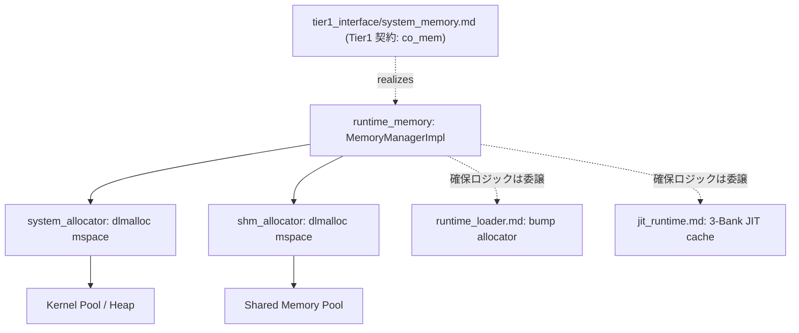

# メモリマネージャ 実装（system_allocator / shm_allocator） コンポーネント設計書 {VERIFY_FORMAL} {VERIFY_LLM}
<!-- evidence:
     formal: formal/runtime_memory_model.py
     test: docs/qa/tier2_runtime/runtime_memory_test_spec.md
     concept: concepts/runtime_memory_concept.py
-->

本コンポーネントは、Tier 1 Interface の抽象契約 [`system_memory.md`](docs/components/tier1_interface/system_memory.md)（`co_mem` インターフェース、パーティション貸与ポリシー、独立ヒープ不変条件）の物理実装である。契約と実装の記述に食い違いがあれば `system_memory.md` を正とする（`{META_ContractImplSplit}` 契約/実装分割パターン）。

## 1. コンセプト
<!-- traceability: {System_Allocator} {Shm_Allocator} {ConsolidatedHeap} {Runtime_BumpAllocator} {JIT_MultiBuffer_Cache} -->
[`system_memory.md`](docs/components/tier1_interface/system_memory.md) が定義する5プール契約のうち、ホスト用ヒープ、タスクヒープ、共有メモリ用ヒープの3プールを直接実装する。システム用アロケータ（`system_allocator`）は、システムコンテナの動的確保・個別解放を担当する。タスク起動時には固定長パーティションを貸与する。SHM用アロケータ（`shm_allocator`）は、共有メモリ用の固定長プールから可変長バッファを切り出す。両アロケータは dlmalloc（`create_mspace_with_base`）により運用する。残る2プール（ランタイム用バンプアロケータ、JITキャッシュアロケータ）は、[`runtime_loader.md`](docs/components/tier2_runtime/runtime_loader.md) および [`jit_runtime.md`](docs/components/tier3_executer/jit_runtime.md) が実現する。本書が定義するのはソフトウェア上の割当・所有権契約であり、ARMv8-Mの物理メモリ配置と保護方式はTBDとする。

## 2. アーキテクチャ分類
<!-- traceability: {META_3TierSeparation} -->
本コンポーネントは **Tier 2 (分解されたサブコンポーネント: Decomposed Subcomponent)** に属し、Tier 1 Interface の `system_memory.md` 契約を dlmalloc ベースのアロケータ群として物理実装する。

## 3. 静的モデル

### 3.1 データ構造
- **`system_allocator`**: dlmalloc（`create_mspace_with_base`）を基盤とする固定長システムヒープアリーナ管理アロケータである。システムコンテナストレージの動的割り当てと個別解放を担当する。
- **`shm_allocator`**: dlmalloc（`create_mspace_with_base`）を基盤とする共有メモリ用アリーナ管理アロケータである。可変長共有ブロック（`shared_block`）の切り出しと、RAII 解放時の自動合体を担当する。

### 3.2 内部ブロック図

## 4. インターフェース実装
[`system_memory.md`](docs/components/tier1_interface/system_memory.md) のインターフェース設計節で定義された公開APIを、以下のアロケータ群を用いて実現する。

- 起動時初期化: `system_allocator`/`shm_allocator` それぞれに対応する `create_mspace_with_base` を実行する（`system_config.md` の `FB_CONF_*` 静的構成に基づく）。
- `host-alloc`/`host-free`: `system_allocator` の mspace 上で有界レイテンシの動的確保・個別解放を行う（ホスト用ヒープ）。
- `acquire-task-heap`/`release-task-heap`/`acquire_slot`/`release_slot`: `system_allocator` の mspace 上で固定長パーティション・型付きスロットを貸与・返却する（タスクヒープ）。
- `allocate-shared`/`claim`/`release`: `shm_allocator` の mspace 上で可変長 `shared_block` を切り出し、RAII 解放時に `mspace_free` へ返却・自動合体する（共有メモリ用ヒープ）。
- `acquire-runtime-arena`/`bump-alloc`/`reset-runtime-arena`/`release-runtime-arena`: `{Runtime_BumpAllocator}`（[`runtime_loader.md`](docs/components/tier2_runtime/runtime_loader.md) 正本）へ委譲する（ランタイム用バンプアロケータ）。
- `acquire-jit-cache`: 対象プラットフォームのコードキャッシュ領域へ対応する固定長ハンドル（ARMv8-Mの物理割当とMPU方式はTBD）を返す。バンク分割・世代交代は `{JIT_MultiBuffer_Cache}`（[`jit_runtime.md`](docs/components/tier3_executer/jit_runtime.md) 正本）が管轄する（JITキャッシュアロケータ）。

## 5. 制約達成の方策
<!-- traceability: {GLOBAL_Policy_Memory} {GLOBAL_StrictMemoryLimit} {WasmPageAlignment} {META_BumpAllocator} {META_FaultIsolation} {OneRuntimeOneGuest} {Runtime_BumpAllocator} {System_Allocator} {Shm_Allocator} -->

### 5.1 性能制約と不変条件
<!-- traceability: {META_BumpAllocator} {WasmPageAlignment} -->
- **目標**: `system_memory.md` が要求する決定論的 $O(1)$ または有界 $O(\log n)$ のメモリ割り当て・解放および高速な境界判定を実現する。
- **方策**:
  - `META_BumpAllocator`: 固定長パーティションおよび型付きプールスロットによる断片化なき高速貸与。
  - `{Runtime_BumpAllocator}`: 1ランタイム1ゲストのモデルにおいて、各ランタイムに固定長データパーティションを一括貸与する。コンテナストレージはこのアリーナから順次切り出す。アンロード時は個別破棄なしに $O(1)$ でアリーナ全体を回収する。JIT コードキャッシュ（3-Bank）の物理分離・保護方式はARMv8-MでTBDとする。
  - `{System_Allocator}`: システム層のコンテナストレージ向けに、固定長システムヒープアリーナを dlmalloc で運用する。動的な登録・破棄に対応し、$O(\log n)$ の有界レイテンシで個別解放と自動合体を提供する。
  - `{Shm_Allocator}`: 共有メモリ用の固定長アリーナを dlmalloc で運用する。RAII 解放時の自動合体により、長時間の通信下でも断片化を最小化する。
  - `WasmPageAlignment`: ゲスト線形メモリの境界検査はWASMページ意味論に従う。ARMv8-Mの物理配置とMPU境界との整合方法はTBDとする。

### 5.2 メモリ制約と方策
<!-- traceability: {GLOBAL_StrictMemoryLimit} {GLOBAL_IndependentHeap} {OneRuntimeOneGuest} {System_Allocator} {Shm_Allocator} -->
- **目標**: 総メモリ消費を有界化し、タスク間のヒープ干渉を完全に防止。
- **方策**:
  - : システム全体の総割当量をコンパイル時定数 `FB_CONF_MEMORY_POOL_SIZE` 以内に厳格制限。
  - : 各タスク・各ランタイムに独立した静的パーティション（アリーナ）を割り当て、ヒープ干渉を物理的に排除する。共有メモリは4KB仮想予約スロット単位で所有者を分離し、物理バック領域は要求バイト数だけ消費する。
  - : システムヒープおよび共有メモリヒープの容量を `FB_CONF_SYSTEM_HEAP_SIZE` および `FB_CONF_SHM_POOL_SIZE` でコンパイル時静的確定し、無制限な動的拡張（OS からの再確保）を禁止。

### 5.3 安全性制約と方策
<!-- traceability: {META_FaultIsolation} {PageGranularPermissionIsolation} -->
- **目標**: 所有権契約および仮想マッピングの検査による不正アクセス・二重解放の検出。
- **方策**:
  - : FC=14の4KB仮想予約スロット単位で所有権を分離し、異種タスクの同一スロット共有を禁止する。物理バック領域は要求バイト数だけを消費する。
  - : 非所有タスクからの操作をソフトウェア契約で拒絶する。物理的なアクセス遮断機構はプラットフォーム仕様が確定するまで定めない。

## 6. 仮想予約と物理バック領域のマッピング、および共有メモリライフサイクル
<!-- traceability: {GLOBAL_Policy_Memory} {META_FaultIsolation} {OwnershipTransfer} {PageGranularPermissionIsolation} {VmmioShmDelegation} -->

[`system_memory.md`](docs/components/tier1_interface/system_memory.md) の 契約（所有権追跡・イベント通知インターフェース・ライフサイクルフェーズ）を、以下のとおり物理実装する。

### 6.1 所有権追跡の物理実装
各メモリブロックは `memory-info.owner` で割り当て元 task-id を追跡する。`acquire-task-heap`/`acquire_slot`/`release-task-heap`/`release_slot` や `RAII`/`drop` による解放は、用途別に事前確保された独立パーティション（固定長アリーナ）から `shm_allocator`/`system_allocator` を用いて有界に切り出し、使用後にアリーナへ返却・合体する。

### 6.2 共有メモリマッピングと仮想化リスナーへのコールバック委譲（物理実装）
<!-- traceability: {VmmioShmDelegation} {OwnerMismatchTrap} -->
物理メモリマネージャは、クリーンアーキテクチャ（依存性逆転の原則: DIP）に従い、特定の上位仮想化ハードウェア（vMMIO 等）の内部シンボルや特定の仮想アドレス体系（`0xE000_0000`）に直接依存しない。Tier 1 Interface の [`system_memory.md`](docs/components/tier1_interface/system_memory.md) が定義する `PageMappingCallbacks` を受け付け、仮想化層（vMMIO コントローラ等）がこれを登録する。

物理メモリマネージャは4KBの仮想予約スロットごとに、予約番号、物理バック領域の基点、所有者、実サイズを通知する。4KBはアドレス予約とアクセス判定の単位であり、4KB分の物理RAMを確保する意味ではない。所有者が変わる場合は `on_owner_changed` を発火し、仮想化層側は旧PTEをアンマップしてTLBエントリをフラッシュする。`claim` またはロールバックが `on_map_page` を発火した後に、仮想化層側が予約VPNを物理基点へ対応付ける。PTEは要求サイズを保持し、その範囲を超えるアクセスを拒否する。

### 6.3 ページ単位権限分離仕様（Page-Granular Permission Isolation）
<!-- traceability: {PageGranularPermissionIsolation} {META_FaultIsolation} {GOTCHA-MEM-01} -->
物理RAMの割当方法はプラットフォーム依存でTBDとする。FC=14仮想アドレス予約は物理バック領域の割当から独立する。`FB_PAGE_SIZE = 4096`はFC=14の仮想予約スロット幅であり、物理割当の粒度・最小量ではない。共有メモリの物理使用量は`FB_CONF_SHM_SIZE = 1024`バイトの予算内で、要求されたサイズだけを確保する。

1. **独立した仮想予約**: `allocate_shared(size)`はcurrent taskを所有者として認証し、1〜`FB_CONF_SHM_SIZE`バイトを受け付ける。ブロックごとに4KBの仮想スロットを予約するが、この予約は物理メモリ使用量へ加算しない。同じタスクのブロックも異なる仮想スロットを使う。
2. **物理バック領域の計上**: 物理プールから消費するのは要求された`size`バイトだけであり、全ブロックの合計を`FB_CONF_SHM_SIZE`以下に保つ。物理基点は4KB境界に揃える必要はなく、空き領域へ再利用可能に配置する。
3. **境界検査と所有権移譲**: 各仮想スロットは1ブロックだけを指し、PTEは実サイズを保持する。`offset >= size`は境界trapとする。IPCのRevoke/Grantではそのブロックの仮想スロットを単位に旧マッピングを外し、所有者台帳が一致した場合だけ新所有者へ対応付ける。

### 6.4 共有メモリライフサイクルと権限遷移プロトコル（物理実装）
<!-- traceability: {OwnershipTransfer} {META_FaultIsolation} {GOTCHA-MEM-02} -->
[`system_memory.md`](docs/components/tier1_interface/system_memory.md) の ライフサイクルフェーズ遷移表に対応する、物理メモリマネージャ自身の動作を以下に示す。依存性逆転（DIP）の設計方針に従い、各フェーズでのページテーブル（PTE）更新・TLB フラッシュの実行は仮想化層（vMMIO コントローラ）の自律的な責務であり、本コンポーネントはライフサイクル通知の発火のみを行う。vMMIO 側の具体的な PTE/TLB 挙動は [`runtime_vmmio.md`](docs/components/tier2_runtime/runtime_vmmio.md) を正本とする。

| ステップ | フェーズ | 送信元(Task A) | 受信先(Task B) | 物理メモリマネージャの動作 |
| :---: | :--- | :--- | :--- | :--- |
| 1 | 確保 | 所有 (`TaskA`) | - | 4KB仮想予約を確保し、要求サイズ分の物理バック領域を割り当てて`owner=TaskA`を記録、マッピング通知を発火 |
| 2 | 書込 | 書込可能 | - | 正常アクセス（本コンポーネントの関与なし） |
| 3 | 送信開始 | **無効化** (ハンドル返却) | - | `owner` を in-flight 状態へ更新し、`on_owner_changed` を発火。登録済み仮想化層がアンマップ (Revoke) |
| 4 | メッセージ化 | - | - | スコープ: `RESOURCE` |
| 5 | ランデブー | サスペンド待機 | - | 送受信マッチング待ち (Rendezvous、IPC ルータの責務) |
| 6 | 認可・受信 | 待機解除 | 受信完了 | 受信タスクへのハンドオフ確約 |
| 7 | 所有権取得 | - | **所有** (`TaskB`) | `owner=TaskB` を記録し、`on_map_page` を発火。登録済み仮想化層がマップ (Grant) |
| 8 | 読出 | - | 読出可能 | 正常アクセス（本コンポーネントの関与なし） |
| 9 | 自動解放 | - | **解放** | 仮想予約を解放し、要求サイズ分の物理バック領域をプールへ返却してアンマップ通知を発火 |

- **非所有タスク操作の完全遮断 (`GOTCHA-MEM-02`)**: 共有メモリブロックの操作時、ブロックの所有タスク ID を厳格に照合する。物理的な遮断機構は、所有権未取得（未マッピング）状態のページへのアクセスを未登録ページフォルト（`TRAP_UNREGISTERED_PAGE`）として検出する、アドレスベースの検知方式で実現する。具体的な検知経路は `runtime_vmmio.md` を正本とする。
- **送信中ブロックの保護状態 {GOTCHA-MEM-03}**: 送信開始（`release()`）から受信完了（`claim()`）までの間、送信元タスクからの旧アドレスアクセスは未登録ページフォルト（`TRAP_UNREGISTERED_PAGE`）として確実に遮断され、TOCTOU 競合や不正アクセスを構造的に排除する。具体的な遮断メカニズム（PTE アンマップ・TLB 即時フラッシュ）は `runtime_vmmio.md` を正本とする。
- **障害時回復**: Rendezvous中に通信が中断された場合、`rollback_transfer(original_sender_id, shm_id)` により送信元タスクへ所有権を復元し、リソースのダングリングを防止する。物理的なマッピング復元手順は `runtime_vmmio.md` を正本とする。

## 7. ハードウェアメモリ保護とW^Xの物理実装（ARMv8-M: TBD）
<!-- traceability: {META_FaultIsolation} {LowLatencyJIT} -->

ARMv8-Mで用いるメモリ保護機構、物理領域数・配置・属性、コードキャッシュ領域の物理アドレス、パッチ中と実行中の保護属性、命令キャッシュ同期、必要なメモリバリアはすべてTBDとする。

W^Xの抽象不変条件は別途定義する。ハードウェア機構と実機での達成方法は、x64でのランタイム契約検証後に改めて設計する。

## 8. 形式検証・テスト仕様との対応

### 8.1 検証対象の不変条件
- **仮想予約スロットの所有権分離**: 4KB仮想予約スロット内に異なる所有者のブロックが共存しないこと（`TEST-MEM-14`, `GOTCHA-MEM-01`）。[`runtime_memory_model.py`](docs/components/tier2_runtime/formal/runtime_memory_model.py) の `page_never_mixes_owners` が反例のないことを検証する。
- **非所有者アクセストラップ**: 所有権未取得（未マッピング）スロットへのアクセスが `TRAP_UNREGISTERED_PAGE` で拒絶されること（`TEST-MEM-16`, `GOTCHA-MEM-02`）。同モデルの `non_owner_access_traps` が不正アクセス状態への到達を禁止する。
- **転送の完了性**: 共有メモリ層は相手タスクの到達を保証しない。`s_in_flight`から無期限に待機する経路が存在するため、転送完了は受信側到達・回復処理を環境条件とする上位契約で検証する。
- **抽象W^X不変条件**: 書込可能状態と実行可能状態を同時に許可しない抽象状態遷移を [`jit_cache_model.py`](docs/components/tier3_executer/formal/jit_cache_model.py) で表す。x64実行可能バッファの挙動はJITテスト仕様が定める。ARMv8-Mの物理保護方式と実機受け入れ条件はTBDである。形式モデルの3面バンク回転・2ビットホットスポットFSM・遅延チェイニングは [`jit_compiler.md`](docs/components/tier3_executer/jit_compiler.md)/[`jit_runtime.md`](docs/components/tier3_executer/jit_runtime.md) の対象である。

### 8.2 テスト仕様書との連携
本コンポーネントのテストケース（TEST-MEM-01〜TEST-MEM-19, GOTCHA-MEM-01〜04）は、[`runtime_memory_test_spec.md`](docs/qa/tier2_runtime/runtime_memory_test_spec.md) を正本として定義する。

## 9. 設計判断 (ADR)
<!-- traceability: {ADR_MemoryManagerMinimalSurface} {ADR_PageGranularPermissionIsolation} {ADR_SharedBlockRaii} -->
このコンポーネントはページ権限分離ADRに従う。公開API設計に関する `ADR_SharedBlockRaii` / `ADR_MemoryManagerMinimalSurface` は契約側 [`system_memory.md`](docs/components/tier1_interface/system_memory.md) を正本とする。

- **決定事項**: (2026-09-02)
  - **背景**: FC=14の仮想予約は4KBスロットで管理する。1スロット内に複数所有者のブロックを混在させると、ソフトウェア上の所有権分離が破綻する。ハードウェアのマッピング粒度と権限制御方式はプラットフォーム依存でTBDとする。
  - **選択肢と評価**:
    - 案1: 単一ページ内に複数タスクのスロットを混在させ、メモリアクセス時にソフトウェアでスロット境界とタスクIDを毎回検査する。チェックのオーバーヘッドが大きく、vMMIO のハードウェア PTE / TLB 高速ディスパッチの恩恵を損なう。
    - 案2: ブロックごとに独立した4KB仮想予約スロットを割り当て、物理バック領域は要求サイズ分だけ確保する。仮想スロットのPTEと実サイズ境界によりタスク間隔離を担保する。
  - **結論**: 案2を採用する。
  - **理由**: Fireball の最重要方針である `{META_FaultIsolation}`（障害隔離）および `{META_ZeroCostAbstraction}` を実現するため。SHMのPTEには `owner_id` を保持し、スケジューラの現在タスクIDを照合する。所有権変更・Revokeではマッピングを解除し、TLBを即時フラッシュして未登録ページとして遮断する。

## 10. 参考実装リスト
なし
