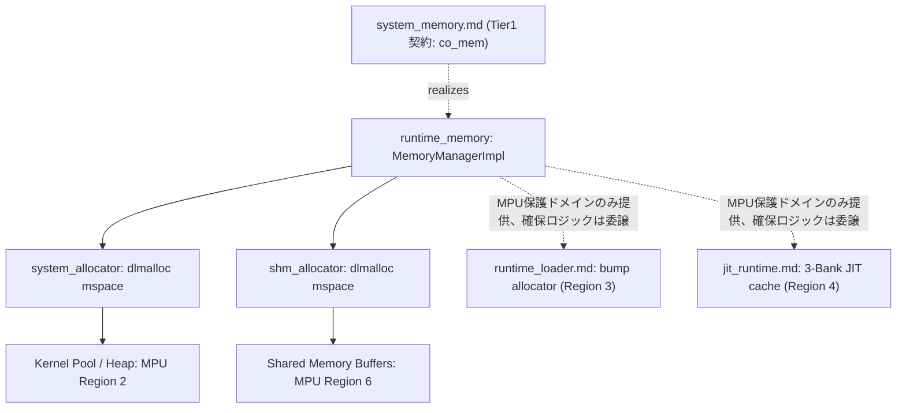

# メモリマネージャ 実装（system_allocator / shm_allocator） コンポーネント設計書 {VERIFY_FORMAL} {VERIFY_LLM}
<!-- evidence:
     formal: ../tier3_jit/formal/jit_cache_model.py
     test: tests/runtime_memory_test_spec.md
     concept: concepts/runtime_memory_concept.py
-->

本コンポーネントは、Tier 1 の抽象契約 [`system_memory.md`](docs/components/tier1_core/system_memory.md)（`co_mem` インターフェース、パーティション貸与ポリシー、独立ヒープ不変条件）の物理実装である。契約と実装の記述に食い違いがあれば `system_memory.md` を正とする（`{META_ContractImplSplit}` 契約/実装分割パターン）。

## 1. コンセプト
<!-- traceability: {System_Allocator} {Shm_Allocator} {ConsolidatedHeap} -->
[`system_memory.md`](docs/components/tier1_core/system_memory.md) が定義する5プール契約（ホスト用ヒープ・タスクヒープ・共有メモリ用ヒープ・ランタイム用バンプアロケータ・JITキャッシュアロケータ）のうち、ホスト用ヒープ・タスクヒープ・共有メモリ用ヒープの3プールを直接実装する。システム基盤向けシステムコンテナの動的確保・個別解放を担う**システム用アロケータ (`system_allocator` / `{System_Allocator}`、ホスト用ヒープの実装)**、タスク起動時に貸与する固定長パーティション（タスクヒープの実装）、およびタスク間ゼロコピー IPC 転送用の共有メモリ領域（MPU Region 6）から可変長バッファを切り出す**SHM用アロケータ (`shm_allocator` / `{Shm_Allocator}`、共有メモリ用ヒープの実装)** を dlmalloc（`create_mspace_with_base`）により運用する。残る2プール（ランタイム用バンプアロケータ・JITキャッシュアロケータ）は、それぞれ `{Runtime_BumpAllocator}`（[`runtime_loader.md`](docs/components/tier2_runtime/runtime_loader.md)）および `{JIT_MultiBuffer_Cache}`（[`jit_runtime.md`](docs/components/tier3_jit/jit_runtime.md)）が物理的に実現し、本コンポーネントは本書の「Cortex-M33 PMSAv8 MPU リージョン配分」を正本として、それらの保護ドメインを提供する。 `{System_Allocator}` `{Shm_Allocator}` `{ConsolidatedHeap}`

## 2. アーキテクチャ分類
<!-- traceability: {META_3TierSeparation} -->
本コンポーネントは **Tier 2 (分解されたサブコンポーネント: Decomposed Subcomponent)** に属し、Tier 1 の `system_memory.md` 契約を dlmalloc ベースのアロケータ群として物理実装する。 `{META_3TierSeparation}`

## 3. 静的モデル

### 3.1 データ構造
- **`system_allocator`**: dlmalloc（`create_mspace_with_base`）を基盤とする固定長システムヒープアリーナ管理アロケータ。システムコンテナストレージの動的割り当てと個別解放を担当。 `{System_Allocator}`
- **`shm_allocator`**: dlmalloc（`create_mspace_with_base`）を基盤とする共有メモリ（MPU Region 6）アリーナ管理アロケータ。可変長共有ブロック（`shared_block`）の切り出しと RAII 解放時の合体を担当。 `{Shm_Allocator}`

### 3.2 内部ブロック図

## 4. インターフェース実装
[`system_memory.md`](docs/components/tier1_core/system_memory.md) のインターフェース設計節で定義された公開APIを、以下のアロケータ群を用いて実現する。

- 起動時初期化: `system_allocator`/`shm_allocator` それぞれに対応する `create_mspace_with_base` を実行する（`system_config.md` の `FB_CONF_*` 静的構成に基づく）。
- `host-alloc`/`host-free`: `system_allocator` の mspace 上で有界レイテンシの動的確保・個別解放を行う（ホスト用ヒープ）。
- `acquire-task-heap`/`release-task-heap`/`acquire_slot`/`release_slot`: `system_allocator` の mspace 上で固定長パーティション・型付きスロットを貸与・返却する（タスクヒープ）。
- `allocate-shared`/`claim`/`release`: `shm_allocator` の mspace 上で可変長 `shared_block` を切り出し、RAII 解放時に `mspace_free` へ返却・自動合体する（共有メモリ用ヒープ）。
- `acquire-runtime-arena`/`bump-alloc`/`reset-runtime-arena`/`release-runtime-arena`: `{Runtime_BumpAllocator}`（[`runtime_loader.md`](docs/components/tier2_runtime/runtime_loader.md) 正本）へ委譲する（ランタイム用バンプアロケータ）。
- `acquire-jit-cache`: 本書の「Cortex-M33 PMSAv8 MPU リージョン配分」で定義する固定長リージョンハンドルを返す。バンク分割・世代交代は `{JIT_MultiBuffer_Cache}`（[`jit_runtime.md`](docs/components/tier3_jit/jit_runtime.md) 正本）が管轄する（JITキャッシュアロケータ）。

## 5. 制約達成の方策
<!-- traceability: {GLOBAL_Policy_Memory} {GLOBAL_StrictMemoryLimit} {WasmPageAlignment} {META_BumpAllocator} {META_FaultIsolation} {OneRuntimeOneGuest} {Runtime_BumpAllocator} {System_Allocator} {Shm_Allocator} -->

### 5.1 性能制約と不変条件
- **目標**: `system_memory.md` が要求する決定論的 $O(1)$ または有界 $O(\log n)$ のメモリ割り当て・解放および高速な境界判定を実現する。
- **方策**:
  - `{META_BumpAllocator}`: 固定長パーティションおよび型付きプールスロットによる断片化なき高速貸与。
  - `{Runtime_BumpAllocator}`: 1ランタイム1ゲスト（`{OneRuntimeOneGuest}`）の実行モデルにおいて、各ランタイムに対して固定長 RAM パーティション（データアリーナ: `RW + XN`）を一括貸与する。ランタイム内部のシステムコンテナストレージ確保はすべてこのアリーナから順次切り出され、アンロード時は個別オブジェクトの破棄なしに $O(1)$ でアリーナ全体が回収・リセットされる。なお、JIT ネイティブコードキャッシュ（3-Bank）は MPU の `W^X`（ライト・実行権限排他）制御が適用された専用の実行可能セクションから専用の JIT コードアロケータによって確保され、データ用バンプアロケータ（RAM/XN）とはハードウェア保護ドメインが厳格に分離される。
  - `{System_Allocator}`: システム層（カーネル、vMMIO、IPC ルータ等）のシステムコンテナストレージ向けに、固定長システムヒープアリーナを dlmalloc（`mspace`）により運用する。システム稼働中の動的な登録・破棄に柔軟対応し、$O(\log n)$ の有界レイテンシで個別解放と断片化の自動合体を提供する。
  - `{Shm_Allocator}`: 共有メモリ領域（MPU Region 6）を固定長アリーナとして dlmalloc（`mspace`）により運用し、可変長 `allocate_shared(size)` 要求に即座に応じる。RAII 解放時の自動合体により、長時間のゼロコピー IPC 通信下でも断片化を最小化する。
  - `{WasmPageAlignment}`: ゲスト RAM（Region 3）を WASM ページサイズである **64KB アライメント**（`0x10000` 境界）に配置し、単一の比較命令による $O(1)$ 高速境界検査（`FastAddressCheck`）と PMSAv8 リージョン境界を完全一致させる。

### 5.2 メモリ制約と方策
<!-- traceability: {GLOBAL_StrictMemoryLimit} {GLOBAL_IndependentHeap} {OneRuntimeOneGuest} {System_Allocator} {Shm_Allocator} -->
- **目標**: 総メモリ消費を有界化し、タスク間のヒープ干渉を完全に防止。
- **方策**:
  - `{GLOBAL_StrictMemoryLimit}`: システム全体の総割当量をコンパイル時定数 `FB_CONF_MEMORY_POOL_SIZE` 以内に厳格制限。
  - `{GLOBAL_IndependentHeap}` `{OneRuntimeOneGuest}`: 各タスク・各ランタイムに独立した静的パーティション（アリーナ）を割り当て、ヒープ干渉を物理的に排除する。共有メモリは 4KB ページ単位で完全に分離する。
  - `{System_Allocator}` `{Shm_Allocator}`: システムヒープおよび共有メモリヒープの容量を `FB_CONF_SYSTEM_HEAP_SIZE` および `FB_CONF_SHM_POOL_SIZE` でコンパイル時静的確定し、無制限な動的拡張（OS からの再確保）を禁止。

### 5.3 安全性制約と方策
<!-- traceability: {META_FaultIsolation} {PageGranularPermissionIsolation} -->
- **目標**: ハードウェア MPU および vMMIO による不正アクセス・二重解放の完全排除。
- **方策**:
  - `{PageGranularPermissionIsolation}`: 4KB 物理ページ単位で所有権と権限を分離し、異種タスクの同一ページ相乗りを禁止。
  - `{META_FaultIsolation}`: 非所有タスクからの操作をトラップで即座に拒絶。

## 6. 物理ページマッピングと共有メモリライフサイクルの物理実装
<!-- traceability: {GLOBAL_Policy_Memory} {META_FaultIsolation} {OwnershipTransfer} {PageGranularPermissionIsolation} {VmmioShmDelegation} -->

[`system_memory.md`](docs/components/tier1_core/system_memory.md) の `{OwnershipTransfer}` 契約（所有権追跡・イベント通知インターフェース・ライフサイクルフェーズ）を、以下のとおり物理実装する。

### 6.1 所有権追跡の物理実装
各メモリブロックは `memory-info.owner` で割り当て元 task-id を追跡する。`acquire-task-heap`/`acquire_slot`/`release-task-heap`/`release_slot` や `RAII`/`drop` による解放は、用途別に事前確保された独立パーティション（固定長アリーナ）から `shm_allocator`/`system_allocator` を用いて有界に切り出し、使用後にアリーナへ返却・合体する。

### 6.2 共有メモリマッピングと仮想化リスナーへのコールバック委譲（物理実装）
<!-- traceability: {VmmioShmDelegation} {OwnerMismatchTrap} -->
物理メモリマネージャは、クリーンアーキテクチャ（依存性逆転の原則: DIP）に従い、特定の上位仮想化ハードウェア（vMMIO 等）の内部シンボルや特定の仮想アドレス体系（`0xE000_0000`）に直接依存しない。これは Tier 1 契約（[`system_memory.md`](docs/components/tier1_core/system_memory.md)）が要求する事項ではなく、本コンポーネント自身が DIP を維持するために自発的に採用する物理実装上の設計である。物理メモリマネージャは `{VmmioShmDelegation}` が定義するイベント通知インターフェース（リスナー機構）を提供し、仮想化層（vMMIO コントローラ等）がこれを購読・登録する。 `{VmmioShmDelegation}`

物理メモリマネージャは物理ページ（4KB）のライフサイクル変化時にこの通知を発火し、仮想化層側が自身の仮想アドレス空間（VPN）に対応するページテーブル（PTE）更新や TLB エントリフラッシュを自律的に実施する。 `{OwnerMismatchTrap}`

### 6.3 ページ単位権限分離仕様（Page-Granular Permission Isolation）
<!-- traceability: {PageGranularPermissionIsolation} {META_FaultIsolation} -->
Cortex-M33 MPU および vMMIO のハードウェア保護機構において、マッピングおよびアクセス権限（読み書き許可ビット）は **4KB 物理ページ（`FB_PAGE_SIZE = 4096`）単位**でのみ設定可能である。
したがって、システム全体のメモリ保護を完全にするため、**「権限（所有タスク ID およびアクセス権限）ごとに物理ページを完全に分離する」** ことを不変条件として強制する。 `{PageGranularPermissionIsolation}`

1. **他タスクとのページ混在の禁止**:
   - 異なるタスクに属する共有メモリスロットを同一 4KB 物理ページ内に共存（相乗り）させることは厳格に禁止される。
   - `allocate_shared(caller_task_id, size)` は、`shm_allocator`（dlmalloc `create_mspace_with_base`）を介して可変長バッファを切り出す際、既に `caller_task_id` が所有し十分な空き容量のある 4KB 物理ページ内の領域から割り当てる。存在しない場合は必ず新規の 4KB 物理ページを `caller_task_id` 専用として払い出し、そのページ境界内でメモリを切り出す。これにより、dlmalloc による可変長アロケーションの柔軟性と、4KB ページ単位の unmap ハードウェア保護（`{PageGranularPermissionIsolation}`）を両立させる。 `{Shm_Allocator}`
2. **ページ単位の所有権移譲**:
   - IPC 転送時、所有権の移譲（Revoke $\to$ Grant）はページ全体を単位として連動する。
   - ページ内の全スロットは常に同一の所有者（または移譲中アンマップ状態）であり、一部のスロットのみが別タスクへ移譲されてページ内で所有者が分裂する状態は生じない。

### 6.4 共有メモリライフサイクルと権限遷移プロトコル（物理実装）
<!-- traceability: {OwnershipTransfer} {META_FaultIsolation} -->
[`system_memory.md`](docs/components/tier1_core/system_memory.md) の `{OwnershipTransfer}` ライフサイクルフェーズ遷移表に対応する、物理メモリマネージャ自身の動作を以下に示す。依存性逆転（DIP）の設計方針に従い、各フェーズでのページテーブル（PTE）更新・TLB フラッシュの実行は仮想化層（vMMIO コントローラ）の自律的な責務であり、本コンポーネントはライフサイクル通知の発火のみを行う。vMMIO 側の具体的な PTE/TLB 挙動は [`runtime_vmmio.md`](docs/components/tier2_runtime/runtime_vmmio.md) を正本とする。

| ステップ | フェーズ | 送信元(Task A) | 受信先(Task B) | 物理メモリマネージャの動作 |
| :---: | :--- | :--- | :--- | :--- |
| 1 | 確保 | 所有 (`TaskA`) | - | 専用 4KB 物理ページを確保し `owner=TaskA` を記録、マッピング通知を発火 |
| 2 | 書込 | 書込可能 | - | 正常アクセス（本コンポーネントの関与なし） |
| 3 | 送信開始 | **無効化** (ハンドル返却) | - | `owner` を in-flight 状態へ更新し、アンマップ通知を発火 (Revoke) |
| 4 | メッセージ化 | - | - | スコープ: `RESOURCE` |
| 5 | ランデブー | サスペンド待機 | - | 送受信マッチング待ち (Rendezvous、IPC ルータの責務) |
| 6 | 認可・受信 | 待機解除 | 受信完了 | 受信タスクへのハンドオフ確約 |
| 7 | 所有権取得 | - | **所有** (`TaskB`) | `owner=TaskB` を記録し、マッピング通知を発火 (Grant) |
| 8 | 読出 | - | 読出可能 | 正常アクセス（本コンポーネントの関与なし） |
| 9 | 自動解放 | - | **解放** | ページをプールへ返却し、アンマップ通知を発火 |

- **非所有タスク操作の完全遮断 (`GOTCHA-MEM-02`)**: 共有メモリブロックの操作時、ブロックの所有タスク ID を厳格に照合する。物理的な遮断機構は、所有権未取得（未マッピング）状態のページへのアクセスを未登録ページフォルト（`TRAP_UNREGISTERED_PAGE`）として検出する、アドレスベースの検知方式で実現する。具体的な検知経路は `runtime_vmmio.md` を正本とする。
- **送信中ブロックの保護状態 (`GOTCHA-MEM-03`)**: 送信開始（`release()`）から受信完了（`claim()`）までの間、送信元タスクからの旧アドレスアクセスは未登録ページフォルト（`TRAP_UNREGISTERED_PAGE`）として確実に遮断され、TOCTOU 競合や不正アクセスを構造的に排除する。具体的な遮断メカニズム（PTE アンマップ・TLB 即時フラッシュ）は `runtime_vmmio.md` を正本とする。
- **障害時回復**: Rendezvous中に通信が中断された場合、`rollback_transfer(original_sender_id, shm_id)` により送信元タスクへ所有権を復元し、リソースのダングリングを防止する。物理的なマッピング復元手順は `runtime_vmmio.md` を正本とする。

## 7. ハードウェアメモリ保護 (MPU) & W^X 設計
<!-- traceability: {META_FaultIsolation} {WasmPageAlignment} {LowLatencyJIT} {System_Allocator} {Shm_Allocator} -->

### 7.1 Cortex-M33 PMSAv8 MPU リージョン配分
Cortex-M33 (ARMv8-M Mainline) の PMSAv8 (Protected Memory System Architecture) に準拠し、ハードウェア MPU の 8 リージョン（最小標準構成）を以下のように静的に配分・構成する。 `{META_FaultIsolation}`

| Region # | 対象領域 | 物理メモリ種別 | デフォルト属性 | 特権アクセス | ユーザーアクセス | 役割と保護目的 |
| :---: | :--- | :--- | :---: | :---: | :---: | :--- |
| **0** | Flash / Kernel Code | Flash (ROM) | `RO + X` | RO, Exec | なし | カーネルテキスト・不変定数の改ざん防止 |
| **1** | Kernel Data & BSS | SRAM (Internal) | `RW + XN` | RW, NoExec | なし | カーネル静的変数・スタック領域 |
| **2** | Kernel Pool / Heap | SRAM (Internal) | `RW + XN` | RW, NoExec | なし | `system_allocator`（dlmalloc）によるシステムコンテナおよびタスク管理構造体の動的確保 `{System_Allocator}` |
| **3** | Guest WASM RAM | SRAM (Internal) | `RW + XN` | RW, NoExec | RW, NoExec | ゲスト WASM リニアメモリ（64KB 境界配置） |
| **4** | **JIT Code Cache** | SRAM (Internal) | **`RO + X`** | **RO, Exec** (パッチ時 `RW+XN`) | なし | JIT 生成ネイティブコード（W^X 保護対象。詳細管理は [`jit_compiler.md`](docs/components/tier3_jit/jit_compiler.md) / [`jit_runtime.md`](docs/components/tier3_jit/jit_runtime.md) を正本とする） |
| **5** | Peripheral MMIO | Device Memory | `RW + XN` | RW, NoExec | なし | ペリフェラルレジスタ（Device 属性） |
| **6** | Shared Memory Buffers | SRAM (Internal) | `RW + XN` | RW, NoExec | RW, NoExec | `shm_allocator`（dlmalloc）による可変長 shared_block バッファ管理（4KBページ分離） `{Shm_Allocator}` |
| **7** | Stack Guard Band | - | `No Access` | 不可 | 不可 | スタックオーバーフロー検出用ガードバンド |

### 7.2 JIT W^X (Write XOR Execute) 切替プロトコル
JIT コードキャッシュ（Region 4）は、実行可能（Execute）と書き込み可能（Write）が同時に有効化される状態（`RWX`）をハードウェアレベルで恒常的に排除する。本領域は、データ用バンプアロケータ（`{Runtime_BumpAllocator}`）が管理する通常のデータ RAM パーティション（Region 3: `RW + XN`）とはハードウェア保護ドメインが厳格に分離された専用セクションであり、専用の JIT コードアロケータによって管理される。本コンポーネントは `begin_jit_patch()`/`commit_jit_patch()` という MPU 属性切替プリミティブを提供するのみであり、いつ・どの単位（トレース／基本ブロック）でこれらを呼び出すかという JIT コンパイル手順は [`jit_compiler.md`](docs/components/tier3_jit/jit_compiler.md) を正本とする。 `{LowLatencyJIT}` `{Runtime_BumpAllocator}`

#### 属性切替シーケンス
`begin_jit_patch()`/`commit_jit_patch()` 呼び出し時のレジスタ操作を示す。

| ステップ | 操作名 | レジスタ設定内容 | 属性 / バリア | 目的と安全性不変条件 |
| :---: | :--- | :--- | :--- | :--- |
| 1 | パッチ生成開始 (`begin_jit_patch`) | `RNR = 4` `RLAR.EN = 0` `RBAR.AP = RW`, `RBAR.XN = 1` `RLAR.EN = 1` | `RW + XN` `__DSB(); __ISB();` | リージョン4を書き込み可能・実行不可へ移行し、パイプラインを同期。実行を禁止して改ざん時暴走を防止。 |
| 2 | パッチ生成完了 (`commit_jit_patch`) | `RNR = 4` `RLAR.EN = 0` `RBAR.AP = RO`, `RBAR.XN = 0` `RLAR.EN = 1` | `RO + X` `__DSB(); __ISB();` | リージョン4を読み取り専用・実行可能へ復元し、命令キャッシュ・プリフェッチをフラッシュしてネイティブ実行を有効化。 |

#### トランザクションバッチ化によるレイテンシ両立 (`GOTCHA-MEM-04`)
<!-- traceability: {GOTCHA-MEM-04} {GLOBAL_Policy_Memory} {META_RestrictedPhysicalAccess} -->
命令パッチごとに個別 MPU 切替を行うとバリアオーバーヘッドが増大するため、`begin_jit_patch()`/`commit_jit_patch()` は 1 コンパイル単位（トレースまたは基本ブロック）につき 1 回ずつのみ呼び出される契約とする。1 命令ごとに切り替えを行うと、その都度 ARM D-Cache クリーン、I-Cache インバリデート、および DSB/ISB メモリバリア命令の発行が必要になり、パイプラインフラッシュの累積により JIT コンパイル性能が致命的に悪化するためである。具体的な呼び出しタイミング・トレース生成手順は [`jit_compiler.md`](docs/components/tier3_jit/jit_compiler.md) を正本とする。

### 7.3 アライメントおよび境界制約 (PMSAv8)
- **PMSAv8 アライメント**: PMSAv7 と異なり、$2^n$ 乗サイズ境界制約は存在しない。Base アドレス（`RBAR`）および Limit アドレス（`RLAR`）は **32 バイトアライメント**（下位 5 ビットが `0`）を満たせば任意サイズで設定可能。
- **WASM ページ境界**: ゲスト RAM (Region 3) は WASM ページサイズである **64KB アライメント**（`0x10000` 境界）に配置し、vMMIO 高速アドレス判定 (`FastAddressCheck`) と PMSAv8 リージョン境界を完全一致させる。 `{WasmPageAlignment}`

## 8. 形式検証・テスト仕様との対応

### 8.1 検証対象の不変条件
- **ページ単位権限分離**: 4KB 物理ページ内に異種タスクのスロットが共存しないこと（`TEST-MEM-14`, `GOTCHA-MEM-01`）。専用の形式モデルは現時点で存在せず、[`runtime_memory_test_spec.md`](docs/components/tier2_runtime/tests/runtime_memory_test_spec.md) のテストケースのみで検証される。
- **非所有者アクセストラップ**: 所有権未取得（未マッピング）スロットへのアクセスが `TRAP_UNREGISTERED_PAGE` で拒絶されること（`TEST-MEM-16`, `GOTCHA-MEM-02`）。専用の形式モデルは現時点で存在せず、テストケースのみで検証される。
- **W^X 不変条件**: JIT キャッシュ領域で `RWX` が同時に許可される状態が存在しないこと（[`jit_cache_model.py`](docs/components/tier3_jit/formal/jit_cache_model.py), `TEST-MEM-23`）。この形式モデルが証明する残り4命題（3面バンク回転・2ビットホットスポットFSM・遅延チェイニング）は [`jit_compiler.md`](docs/components/tier3_jit/jit_compiler.md)/[`jit_runtime.md`](docs/components/tier3_jit/jit_runtime.md) が対象であり、本コンポーネントの評価対象外である。

### 8.2 テスト仕様書との連携
本コンポーネントのテストケース（TEST-MEM-01〜TEST-MEM-25, GOTCHA-MEM-01〜04）は、[`runtime_memory_test_spec.md`](docs/components/tier2_runtime/tests/runtime_memory_test_spec.md) を正本として定義する。

## 9. 設計判断 (ADR)
<!-- traceability: {ADR_PageGranularPermissionIsolation} -->
このコンポーネントのADRは `{ADR_PageGranularPermissionIsolation}` のキーワードで参照される。公開API設計に関する `{ADR_SharedBlockRaii}` / `{ADR_MemoryManagerMinimalSurface}` は契約側 [`system_memory.md`](docs/components/tier1_core/system_memory.md) を正本とする。

- **決定事項**: `{ADR_PageGranularPermissionIsolation}` (2026-09-02)
  - **背景**: vMMIO FC=14 の PTE および MPU は 4KB ページ単位でしかマッピング・権限（RW許可）を設定できない。同一ページ内に異なるタスクのスロットが混在すると、タスク間のメモリ隔離が破綻し、他タスクのデータが読み書きされる危険があった。
  - **選択肢と評価**:
    - 案1: 単一ページ内に複数タスクのスロットを混在させ、メモリアクセス時にソフトウェアでスロット境界とタスクIDを毎回検査する。チェックのオーバーヘッドが大きく、vMMIO のハードウェア PTE / TLB 高速ディスパッチの恩恵を損なう。
    - 案2: 権限（所有タスクID）ごとに独立した 4KB 物理ページを割り当て、同一ページ内には同一所有者のスロットのみを配置する。メモリ消費はページ単位に量子化されるが、ページ単位のマッピング有無による教科書的な仮想記憶保護が完全に成立し、ゼロコストでタスク間隔離が担保される。
  - **結論**: 案2を採用する。
  - **理由**: Fireball の最重要方針である `{META_FaultIsolation}`（障害隔離）および `{META_ZeroCostAbstraction}` を実現するため。PTE に余計な `owner_id` フィールドを持たせず、マッピング有無による未登録ページ遮断としてアクセスパスを最速に保つ。

## 10. 参考実装リスト
なし
