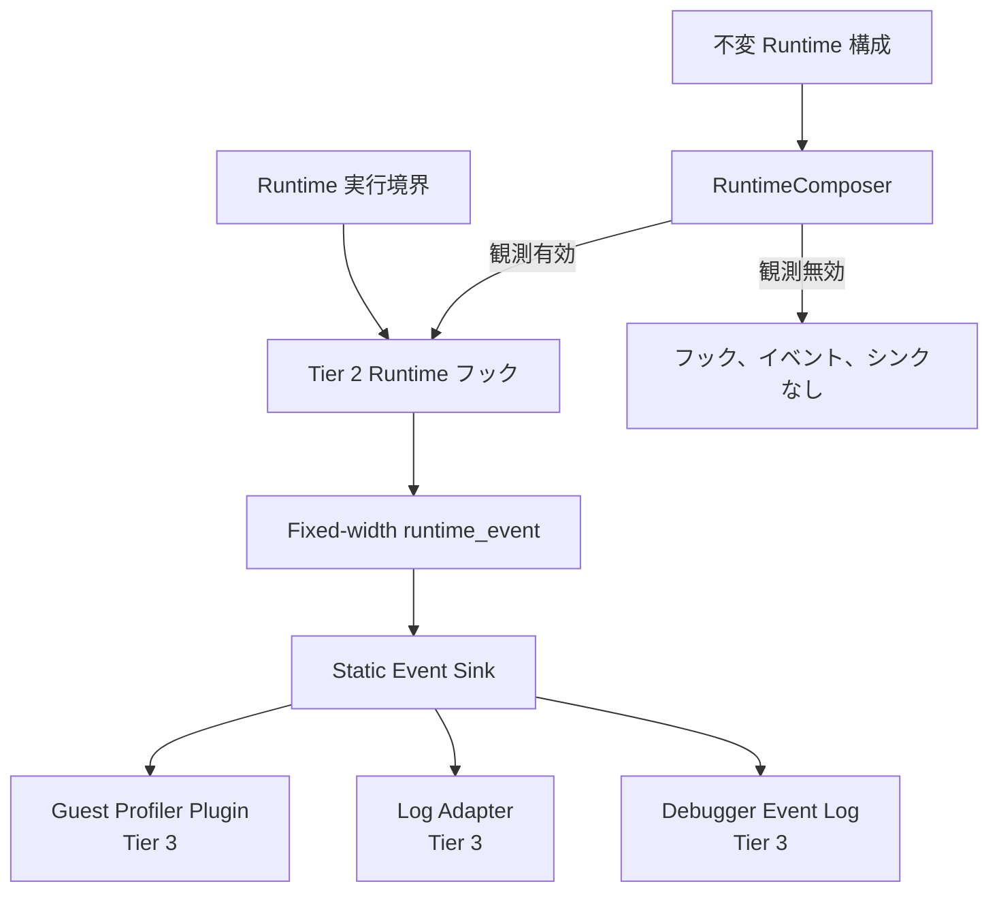

# Runtime 観測フック契約 コンポーネント設計書
<!-- evidence:
     contract-only: true
-->

## 1. コンセプト
<!-- traceability: {META_3TierSeparation} {META_ContractImplSplit} {META_StaticDI} {GLOBAL_ComponentHarness} {ZeroRuntimeOverhead} -->
本コンポーネントは、Runtime が実行経路を観測するための Tier 2 契約を定義する。観測対象はゲスト関数の開始・終了、ホスト呼出、JIT 境界、トラップ、停止点である。ゲストプロファイラはこの契約を利用する Tier 3 プラグインとして実装する。

本契約は観測イベントの意味と生成位置だけを定義する。イベントの集計、ログ形式、固定長リング、外部搬送は Tier 3 プラグインが担当する。Tier 2 は特定のログ形式や物理接続へ依存しない。

Profiler と Debugger は目的を分離する。Profiler は Runtime 状態を読み取るだけの観測者であり、実行を停止、再開、書き換えない。具体的な集計は [`guest_profiler.md`](docs/components/tier3_plugins/guest_profiler.md) が担う。Debugger は別の `ExecutionControl` 契約を利用して実行状態を変更する。Debugger の停止通知を観測イベントとして発行することは許可するが、Profiler が停止処理を代行することは禁止する。

## 2. アーキテクチャ分類
<!-- traceability: {META_3TierSeparation} {META_ContractImplSplit} -->
本コンポーネントは **Tier 2 (分解されたサブコンポーネント: Decomposed Subcomponent)** に属する。VM の実行境界に依存しない共通イベント契約を定義し、Tier 3 のプロファイラ、デバッガアダプタ、外部ログ接続を受け入れる。

## 3. 静的モデル

### 3.1 観測境界
<!-- traceability: {META_StaticDI} {GLOBAL_ComponentHarness} -->
- **`runtime_observer`**: Runtime から固定形式イベントを受け取る読み取り専用契約である。
- **`runtime_event`**: 1 件の観測を表す固定幅レコードである。イベント種別、Runtime 識別子、ゲスト関数識別子、ゲスト PC、時刻、呼出相関、状態フラグ、補助値を持つ。
- **`event_sink`**: `runtime_observer` へイベントを届ける静的結線である。RuntimeComposer は有効な ProfilerSink または LogSink だけを合成する。観測無効は観測 weave の不在を表す構成である。
- **`execution_control`**: Debugger が停止、再開、ステップ、メモリ書込みを要求する独立契約である。観測シンクからは参照できない。
- **`observation_budget`**: イベント容量、搬送容量、欠落許容数、時刻源の分解能を静的に定義する構成情報である。

### 3.2 イベントレコード契約
| フィールド | 意味 | 制約 |
| :--- | :--- | :--- |
| イベント種別 | `module_load`、`function_enter`、`function_exit`、`interpreter_boundary`、`jit_enter`、`jit_exit`、`host_call_enter`、`host_call_exit`、`coos_boundary`、`trap`、`debug_stop` のいずれか | 固定幅の整数値。文字列を持たない |
| Runtime 識別子 | 発行元 Runtime を識別する | 一実行中は不変 |
| モジュール識別子 | ゲストモジュールを識別する | ロード時に確定 |
| 関数識別子 | ゲスト関数を識別する | 関数イベントでは必須 |
| ゲスト PC | 命令位置または JIT 対応位置 | イベント種別ごとの未設定値を定義する |
| 時刻 | 単調増加する VM 時刻 | 壁時計を使用しない |
| 呼出相関 | 呼出フレームまたはホスト呼出を追跡する | 固定幅整数。再利用時は世代を更新する |
| 状態フラグ | JIT、Interpreter、トラップ、欠落、推定値を示す | 未定義ビットを予約する |
| 補助値 | 終了理由、命令数、ホスト呼出識別子等 | 種別ごとに意味を固定する |

### 3.3 内部ブロック図

## 4. 動的モデル

### 4.1 フックポイントと発行条件
| フック | 発行条件 | 必須フィールド | 目的 |
| :--- | :--- | :--- | :--- |
| `module_load` | ゲストモジュールのロードが完了した直後 | モジュール識別子、関数数、時刻 | 関数番号とモジュール世代を確定する |
| `function_enter` | Interpreter または JIT がゲスト関数へ入る直前 | 関数識別子、PC、呼出相関、時刻 | コールグラフの頂点とスタックを開始する |
| `function_exit` | 正常復帰、トラップ、停止のいずれかで関数を離れる直後 | 関数識別子、終了理由、呼出相関、時刻 | 自己時間と包括時間を確定する |
| `interpreter_boundary` | 共通呼出境界から Interpreter 本体へ移るとき | PC、呼出相関、時刻 | 実行方式の比較とフォールバックを識別する |
| `jit_enter` | JIT コードへ制御を渡す直前 | 関数識別子、PC、時刻 | ネイティブ実行時間を区別する |
| `jit_exit` | JIT コードから共通終了処理へ戻るとき | 関数識別子、終了理由、時刻 | JIT 実行区間を閉じる |
| `host_call_enter` / `host_call_exit` | ゲストとホスト契約の境界を越えるとき | ホスト呼出識別子、呼出相関、時刻 | WASI・HAL 等の待ち時間を区別する |
| `coos_boundary` | COOSへ制御を返して割込みイベント、yield、実行状態を処理する協調境界 | PC、時刻、状態フラグ | COOS協調境界での応答性を確認する |
| `trap` | ゲストトラップが確定したとき | PC、トラップ理由、呼出相関、時刻 | 未完了フレームを確定する |
| `debug_stop` | Debugger が停止を確定したとき | PC、停止理由、時刻 | 実行停止と観測記録を対応付ける |

命令ごとのイベントは標準フックに含めない。命令単位の観測が必要な Tier 3 実装は、構成で明示した専用フックまたはサンプリング機構を使用し、通常の Runtime ホットパスへ常時コストを追加してはならない。

RuntimeComposer は観測アスペクトを静的 DI で weave する。観測無効時は、`constexpr` 条件を偽に特殊化する。この構成ではフック呼出し、イベントレコード構築、時刻取得、観測シンクの状態、Null 判定を生成してはならない。

### 4.2 イベント搬送と過負荷
イベント生成側は動的メモリ確保、ブロッキング、文字列整形、外部 I/O を行わない。Tier 3 の固定長リングまたは直接シンクへ固定幅レコードを渡す。

- 通常イベントは、容量不足時にイベントを破棄し、欠落カウンタを増加させる。
- `trap`、`debug_stop` は、通常イベントと別の予約容量を持つ。予約容量が尽きた場合は Runtime の完了結果へ記録する。
- イベント搬送が遅い場合に VM を停止するかどうかは Tier 3 の構成値とする。ただし既定値は非ブロッキングとする。
- 観測無効構成はイベント内容を読み取らない。RuntimeComposer はイベント生成自体をコンパイル時に除去する。

## 5. インターフェース定義

### 5.1 イベント発行
| 項目 | 内容 |
| :--- | :--- |
| 機能概要 | Runtime 実行境界で固定幅 `runtime_event` を観測シンクへ発行する。 |
| 引数と役割 | イベント種別、ゲスト位置、呼出相関、時刻、状態フラグ、補助値を受け取る。 |
| 期待する結果 | 発行成功、通常イベント欠落、予約イベント欠落を区別して返す。 |
| 事前条件 | イベント種別に必要なフィールドが設定され、時刻が単調である。 |
| 事後条件 | シンクが受理した場合は一つのイベントとして観測でき、欠落時は欠落数が増える。 |
| 不変条件 | 発行処理は VM の実行状態、スタック、メモリ、PC を変更しない。 |
| エラー時の挙動 | シンクの過負荷は通常実行を停止させず、欠落状態を次の予約イベントまたは終了要約へ反映する。 |

## 6. 制約達成の方策
<!-- traceability: {GLOBAL_Policy_Memory} {ZeroRuntimeOverhead} {META_StaticDI} -->

### 6.1 性能制約と方策
- 有効な通常フックは固定幅レコードの書込みだけを行い、コールグラフ探索やログ文字列生成を行わない。
- `function_enter` と `function_exit` は共通 `call` テンプレート境界から発行し、Interpreter と JIT の両方へ同じ意味を適用する。
- RuntimeComposer は `constexpr` 条件で観測 weave を特殊化する。観測無効時はイベントペイロード計算だけでなく、フック呼出し、Null 判定、観測状態を除去する。

### 6.2 メモリ制約と方策
- イベントリング、予約容量、搬送バッファを `observation_budget` へ登録する。
- Tier 3 の集計表と搬送バッファは Runtime の実行スタックと分離する。

### 6.3 安全性制約と方策
- 観測イベントはゲストメモリへのポインタを保持しない。識別子、値、固定長スパンだけを記録する。
- Profiler と Log Adapter は実行状態を変更できない。Debugger の制御契約を注入しない。
- タイムスタンプは単調時計を使い、ラップアラウンドを世代または明示的なオーバーフローとして扱う。

## 7. 形式検証（pyModelChecking / 直交表）

### 7.1 検証対象の不変条件
| 不変条件 | 説明 | 範囲 | 検証方法 |
| :--- | :--- | :--- | :--- |
| 入退出対応 | 正常復帰、トラップ、停止のいずれでも開いた関数フレームが終了理由付きで閉じる。 | イベント列 | TODO(未決): CTL 状態モデル |
| 観測 weave 除去 | 観測無効構成では、フック、イベント、シンク、観測状態が合成結果に存在しない。 | 構成・生成物 | TODO(未決): 生成物検査と map file 検査 |
| 時刻単調性 | 同一 Runtime の観測時刻が単調増加する。 | イベント列 | TODO(未決): 形式モデルと境界値検査 |
| 誤結合禁止 | Profiler が観測イベントから実行制御を呼び出さない。 | 依存方向 | TODO(未決): DocGraph と静的検査 |
| 欠落通知 | イベント欠落が発生したことを後続の観測結果へ通知できる。 | イベント列 | TODO(未決): 直交表 |
| 予約イベント保護 | トラップ、停止、終了要約が通常イベント過負荷で不可視にならない。 | 搬送バッファ | TODO(未決): CTL 変異検査 |

### 7.2 既知の制限や仮定
本仕様は Runtime フックとイベント意味論を定義する。Profiler のコールグラフ集計、時間計算、外部ログ形式、物理搬送は [`guest_profiler.md`](docs/components/tier3_plugins/guest_profiler.md) へ委譲する。サンプリングプロファイラ、命令単位トレーサ、ホスト OS の外部プロファイラは本契約の必須機能ではない。

## 8. 設計上の未決事項
- 固定幅 `runtime_event` のビット幅と時刻単位を対象 MCU の最小構成へ合わせて確定する。
- イベントシンクの予約容量と、欠落を Runtime の完了結果へ反映する最小フィールドを確定する。
