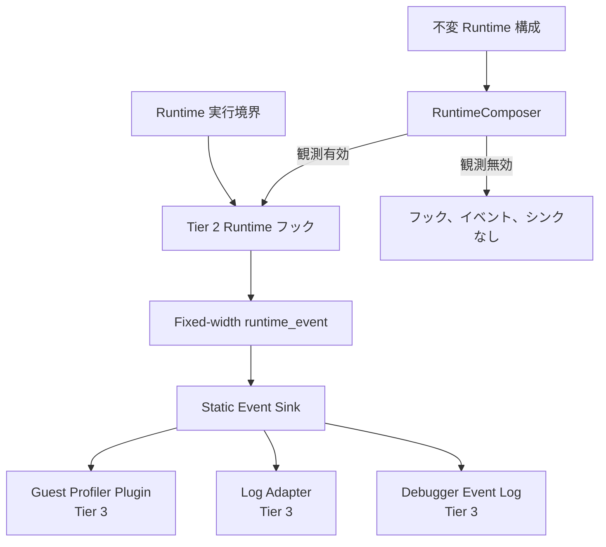

# Runtime 観測フック契約 コンポーネント設計書
<!-- evidence:
     implementation: experiments/pysim/tier2_runtime/runtime_events.py
     reference: experiments/pysim/tier2_runtime/runtime_composer.py
     test: docs/qa/tier2_runtime/runtime_observability_test_spec.md
-->

## 1. コンセプト
<!-- traceability: {META_3TierSeparation} {META_ContractImplSplit} {META_StaticDI} {GLOBAL_ComponentHarness} {ZeroRuntimeOverhead} -->
本コンポーネントは、Runtime が実行経路を観測するための Tier 2 契約を定義する。観測対象はゲスト関数の開始・終了、ホスト呼出、JIT 境界、トラップ、停止点である。ゲストプロファイラはこの契約を利用する Tier 3 プラグインとして実装する。

現行の pysim 参照実装が生成するイベントは、`RuntimeWithPlugins.call` の公開呼出境界における `FUNCTION_ENTER` / `FUNCTION_EXIT`、`RuntimeExecutionError.GUEST_TRAP` による `TRAP`、および `HOST_FAILURE` による推定 `FUNCTION_EXIT` である。Interpreter 内部の関数呼出やJIT・ホストコール・COOS境界はまだ観測せず、この Composer は `System.runtime_engine` へ結線されていない。以下の他イベントは将来の実行エンジン統合に向けた契約値である。

本契約は観測イベントの意味と生成位置だけを定義する。イベントの集計、ログ形式、固定長リング、外部搬送は Tier 3 プラグインが担当する。Tier 2 は特定のログ形式や物理接続へ依存しない。

Profiler と Debugger は目的を分離する。Profiler は Runtime 状態を読み取るだけの観測者であり、実行を停止、再開、書き換えない。具体的な集計は [`guest_profiler.md`](docs/components/tier3_plugins/guest_profiler.md) が担う。Debugger は別の `ExecutionControl` 契約を利用して実行状態を変更する。Debugger の停止通知を観測イベントとして発行することは許可するが、Profiler が停止処理を代行することは禁止する。

## 2. アーキテクチャ分類
<!-- traceability: {META_3TierSeparation} {META_ContractImplSplit} -->
本コンポーネントは **Tier 2 (分解されたサブコンポーネント: Decomposed Subcomponent)** に属する。VM の実行境界に依存しない共通イベント契約を定義し、Tier 3 のプロファイラ、デバッガアダプタ、外部ログ接続を受け入れる。

## 3. 静的モデル

### 3.1 観測境界
<!-- traceability: {META_StaticDI} {GLOBAL_ComponentHarness} -->
- **`runtime_observer`**: Runtime から固定形式イベントを受け取る読み取り専用契約である。
- **`runtime_event`**: 1 件の観測を表す固定幅レコードである。イベント種別、Runtime 識別子、ゲスト関数識別子、ゲスト PC、時刻、呼出相関、状態フラグ、補助値を持つ。
- **`event_sink`**: `runtime_observer` へイベントを届ける静的結線である。RuntimeComposer は有効な ProfilerSink または LogSink だけを合成する。観測無効は観測 weave の不在を表す構成である。
- **`execution_control`**: Debugger が停止、再開、ステップ、メモリ書込みを要求する独立契約である。観測シンクからは参照できない。
- **`observation_budget`**: イベント容量、搬送容量、欠落許容数、時刻源の分解能を静的に定義する構成情報である。

### 3.2 イベントレコード契約
| フィールド | 意味 | 制約 |
| :--- | :--- | :--- |
| イベント種別 | `module_load`、`function_enter`、`function_exit`、`interpreter_boundary`、`jit_enter`、`jit_exit`、`host_call_enter`、`host_call_exit`、`coos_boundary`、`trap`、`debug_stop` のいずれか | 固定幅の整数値。文字列を持たない |
| Runtime 識別子 | 発行元 Runtime を識別する | 一実行中は不変 |
| モジュール識別子 | ゲストモジュールを識別する | ロード時に確定 |
| 関数識別子 | ゲスト関数を識別する | 関数イベントでは必須 |
| ゲスト PC | 命令位置または JIT 対応位置 | イベント種別ごとの未設定値を定義する |
| 時刻 | 単調増加する時刻 | pysim 参照実装では `time.monotonic_ns()` を使う。VM 命令数やMCU cycle数とは同一視しない |
| 呼出相関 | 呼出フレームまたはホスト呼出を追跡する | 固定幅整数。再利用時は世代を更新する |
| 状態フラグ | JIT、Interpreter、トラップ、欠落、推定値、異常終了を示す | 未定義ビットを予約する |
| 補助値 | 終了理由、命令数、ホスト呼出識別子等 | 種別ごとに意味を固定する |

### 3.3 内部ブロック図

```mermaid
graph TD
    Config[不変 Runtime 構成] --> Composer[RuntimeComposer]
    Composer -->|観測有効| Hook[Tier 2 Runtime フック]
    Composer -->|観測無効| Elided[フック、イベント、シンクなし]
    Runtime[Runtime 実行境界] --> Hook
    Hook --> Record[Fixed-width runtime_event]
    Record --> Sink[Static Event Sink]
    Sink --> Profiler[Guest Profiler Plugin<br/>Tier 3]
    Sink --> Log[Log Adapter<br/>Tier 3]
    Sink --> DebugLog[Debugger Event Log<br/>Tier 3]
```

## 4. 動的モデル

### 4.1 フックポイントと発行条件
| フック | 発行条件 | 必須フィールド | 目的 |
| :--- | :--- | :--- | :--- |
| `module_load` | ゲストモジュールのロードが完了した直後 | モジュール識別子、関数数、時刻 | 関数番号とモジュール世代を確定する |
| `function_enter` | Interpreter または JIT がゲスト関数へ入る直前 | 関数識別子、PC、呼出相関、時刻 | コールグラフの頂点とスタックを開始する |
| `function_exit` | 正常復帰、トラップ、停止のいずれかで関数を離れる直後 | 関数識別子、終了理由、呼出相関、時刻 | 自己時間と包括時間を確定する |
| `interpreter_boundary` | 共通呼出境界から Interpreter 本体へ移るとき | PC、呼出相関、時刻 | 実行方式の比較とフォールバックを識別する |
| `jit_enter` | JIT コードへ制御を渡す直前 | 関数識別子、PC、時刻 | ネイティブ実行時間を区別する |
| `jit_exit` | JIT コードから共通終了処理へ戻るとき | 関数識別子、終了理由、時刻 | JIT 実行区間を閉じる |
| `host_call_enter` / `host_call_exit` | ゲストとホスト契約の境界を越えるとき | ホスト呼出識別子、呼出相関、時刻 | WASI・HAL 等の待ち時間を区別する |
| `coos_boundary` | COOSへ制御を返して割込みイベント、yield、実行状態を処理する協調境界 | PC、時刻、状態フラグ | COOS協調境界での応答性を確認する |
| `trap` | ゲストトラップが確定したとき | PC、トラップ理由、呼出相関、時刻 | 未完了フレームを確定する |
| `debug_stop` | Debugger が停止を確定したとき | PC、停止理由、時刻 | 実行停止と観測記録を対応付ける |

命令ごとのイベントは標準フックに含めない。命令単位の観測が必要な Tier 3 実装は、構成で明示した専用フックまたはサンプリング機構を使用し、通常の Runtime ホットパスへ常時コストを追加してはならない。

契約上、実機 RuntimeComposer は観測アスペクトを静的 DI で weave し、C++ の観測無効構成からフック、イベント、状態を除去する。pysim 参照実装は構成時に有効なObserverだけを生成し、全Observer無効時は観測状態と時計呼出しを持たないことをテストする。これはC++生成物や翻訳単位の除去を証明するものではない。

### 4.2 イベント搬送と過負荷
イベント生成側は動的メモリ確保、ブロッキング、文字列整形、外部 I/O を行わない。pysim 参照実装は選択されたObserverへ同期的に直接レコードを渡し、イベントリング、予約容量、バックプレッシャーは実装していない。

- 現行 pysim 参照実装ではObserver呼出しの欠落応答を契約化していない。Profiler は別の入力元から `DROPPED` が通知された場合と、自身の固定容量集計表の超過を記録できる。
- `trap`、`debug_stop` 用の予約容量は未実装である。Observerが同期処理できない場合のバックプレッシャー方針も未定義とする。
- 観測無効構成ではPythonのComposerがObserverを生成せず、イベント内容を読み取らない。コンパイル時コード除去の保証は実機C++実装を対象とする。

## 5. インターフェース定義

### 5.1 イベント発行
| 項目 | 内容 |
| :--- | :--- |
| 機能概要 | pysim参照実装では `RuntimeWithPlugins.call` の外側で固定幅相当の `runtime_event` をObserverへ同期配送する。 |
| 引数と役割 | イベント種別、関数識別子、Runtime識別子、呼出相関、単調時刻、状態フラグを設定する。未提供のmodule/PCには明示sentinelを使う。 |
| 期待する結果 | `RuntimeObserver.on_runtime_event` が配送されたイベントを受け取る。戻り値はなく、欠落応答は行わない。 |
| 事前条件 | Observerが1個以上選択されている。時刻源は整数を返す。 |
| 事後条件 | 選択Observerが同一イベント値を同期的に受信する。 |
| 不変条件 | 発行処理は VM の実行状態、スタック、メモリ、PC を変更しない。 |
| エラー時の挙動 | Observer例外は呼出元へ伝播する。キュー超過・予約イベント・終了要約は未実装である。 |

## 6. 制約達成の方策
<!-- traceability: {GLOBAL_Policy_Memory} {ZeroRuntimeOverhead} {META_StaticDI} -->

### 6.1 性能制約と方策
- 有効な通常フックは固定幅レコードの書込みだけを行い、コールグラフ探索やログ文字列生成を行わない。
- pysim 参照実装は `RuntimeWithPlugins.call` の外側だけに `function_enter` と `function_exit` を発行する。Interpreter と JIT 内部を共通計測してはいない。
- Python Composer は観測無効時に Observer を生成せず、時計も呼ばない。C++ コンパイル時特殊化と生成物の除去はこのモデルの検証範囲外である。

### 6.2 メモリ制約と方策
- 実機統合ではイベントリング、予約容量、搬送バッファを `observation_budget` へ登録する。
- 現行pysim参照モデルにはイベントリングもRuntime/Profilerを分離した実機領域もない。Tier 3集計表はPythonの固定容量コンテナで保持する。

### 6.3 安全性制約と方策
- 観測イベントはゲストメモリへのポインタを保持しない。識別子、値、固定長スパンだけを記録する。
- Profiler と Log Adapter は実行状態を変更できない。Debugger の制御契約を注入しない。
- pysim参照Composerは `time.monotonic_ns()` を基準に、直前イベントより小さい値を受けた場合もtickを1ずつ進める。MCUのtick幅とラップアラウンド処理は実機統合時に定義する。

## 7. 形式検証・テスト仕様との対応

### 7.1 実装範囲の検証

#### 7.1.1 検証対象の不変条件
| 不変条件 | 説明 | 範囲 | 検証方法 |
| :--- | :--- | :--- | :--- |
| 入退出対応 | 正常終了は exit、明示的ゲストトラップは trap、ホスト実装例外は推定 aborted exit を発行する。 | 公開呼出境界 | [`runtime_observability_test_spec.md`](docs/qa/tier2_runtime/runtime_observability_test_spec.md) `TEST-OBS-03` |
| 観測無効時の合成 | 全プラグイン無効時は Observer が生成されず、呼出イベントも時計取得も発生しない。 | pysim 構成モデル | `test_runtime_composer.py` `test_disabled_plugins_are_not_constructed_or_retained` |
| 時刻単調性 | 同じ時刻値が続いても呼出順でイベント時刻が単調増加する。 | イベント列 | `runtime_observability_test_spec.md` `TEST-OBS-02` |
| 欠落明示 | Profiler が `DROPPED` 通知と集計表超過を欠落・推定値として記録する。 | 集計状態 | [`guest_profiler_test_spec.md`](docs/qa/tier3_plugins/guest_profiler_test_spec.md) `TEST-PROF-04` |
| 予約イベント保護 | trap/debug-stop 用予約容量を持たないため、性質を保証しない。 | 搬送バッファ | 未実装としてスコープ外にする |

#### 7.1.2 既知の制限や仮定
本仕様はRuntimeフックとイベント意味論を定義する。Profilerの集計は [`guest_profiler.md`](docs/components/tier3_plugins/guest_profiler.md) へ委譲する。現行pysim参照実装は汎用Composerの単体モデルに限り、`System` 統合やInterpreter内部イベント、予約イベントキューを提供しない。これらの機能は実機Runtime統合時に実装とテストを追加する。

## 8. 設計判断と参考実装

### 8.1 設計上の未決事項
- 対象MCUで使う固定幅イベントのビット幅、時刻源、イベントキュー容量は実機 Runtime 統合前に確定する。

特記すべき独立したADRはない。採用方針は本書の各契約節に記載する。
