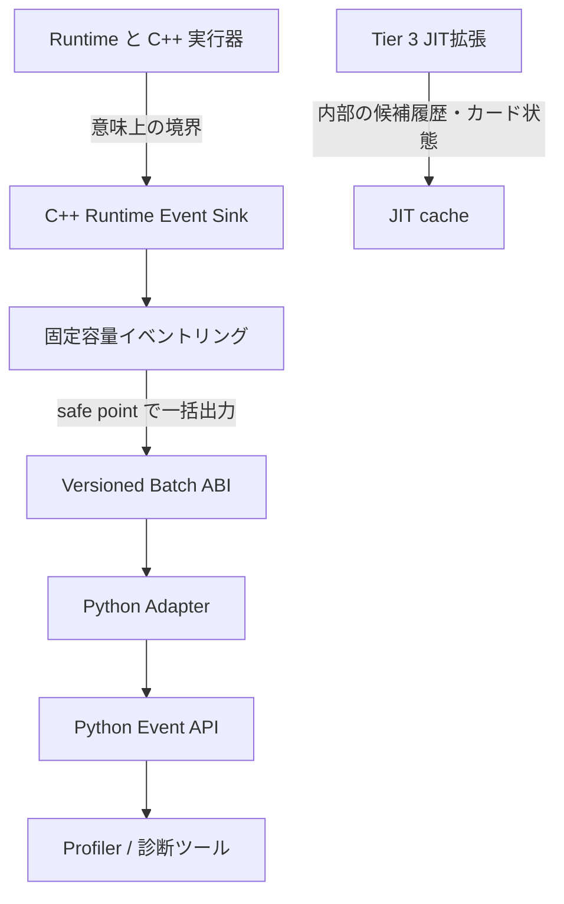

# Runtime 観測イベント・ABI契約 コンポーネント設計書
<!-- evidence:
     reference: docs/requires/requirement_list.md
     test: docs/qa/tier2_runtime/runtime_observability_test_spec.md
     benchmark: docs/components/tier3_plugins/benchmarks/jit_runtime_bench_spec.md
-->

## 1. コンセプト
<!-- traceability: {META_3TierSeparation} {META_ContractImplSplit} {RuntimeEventSink} {ZeroRuntimeOverhead} -->

本契約は Runtime の意味上のイベントを C++ で記録し、停止点で Python へ渡す契約を定める。C++ と Python
で同じイベント型やメモリ配置を共有せず、境界で明示的に変換する。Runtime Event Sink は
Guest Profiler 向けの関数・実行境界イベントだけを記録する。

この分割により、Interpreter と JIT のホットパスは C++ 内で完結させる。通常のイベント経路は
関数・ホスト呼出・実行方式の境界など意味上の境界だけを扱い、WASM 命令ごとのイベントを発行しない。
JIT拡張のホットスポット履歴とカード状態はRuntime Event Sinkに含めず、Tier 3 JIT拡張の内部状態とする。

イベント機能は Runtime の型構成で選び、イベント有効・無効の Runtime を同じ実行ファイル内に別々の
インスタンスとして生成できるようにする。無効構成にはイベントシンク、計数状態、時計読出し、および
イベント発行経路を持たせない。マクロやプロセス全体のビルド設定で有効・無効を切り替えない。

Profiler は受け取ったデータを読み取るだけであり、実行状態を変更しない。Debugger の停止・再開・ステップ制御は独立した実行制御契約に置く。

## 2. アーキテクチャ分類
<!-- traceability: {META_3TierSeparation} {META_ContractImplSplit} {RuntimeEventSink} -->

本契約は Tier 2 Runtime が所有する観測契約である。C++ 内のイベント生成境界と Python へ公開する転送
ABI を定める。集計ポリシーおよび表示は Tier 3 の Profiler が担い、Python 側イベント API は
ホスト上の計測・診断ツールが利用する。

| 項目 | 内容 |
| :--- | :--- |
| Tier | Tier 2 Runtime |
| 役割 | C++ Runtime Event Sink と Python への転送 ABI の契約 |
| 依存先 | Runtime の実行境界、Interpreter、JIT、Profiler |
| 被依存側 | Guest Profiler、ホスト上の観測・診断ツール |
| 正本 | 本書 |

## 3. 静的モデル

### 3.1 責務とデータの流れ
<!-- traceability: {META_StaticDI} {GLOBAL_ComponentHarness} {ConceptHarnessDI} -->

| 層 | 責務 | データ形式 | 実行時の制約 |
| :--- | :--- | :--- | :--- |
| C++ Runtime Event Sink | 意味上の実行境界イベントを記録する | 固定幅レコードの固定長リング | C++ 内で記録し、Python を呼ばない |
| C++/Python 転送 ABI | Runtime イベント履歴を出力する | Versioned little-endian batch | 停止点で呼び出し、バッファを保持しない |
| Python イベント API | バッチを Profiler 用 Python 値へ変換する | Enum、dataclass、Protocol | C++ レコード配置を直接公開しない |

```mermaid
graph TD
    Runtime[Runtime と C++ 実行器] -->|意味上の境界| CppEvents[C++ Runtime Event Sink]
    CppEvents --> CppState[固定容量イベントリング]
    CppState -->|safe point で一括出力| Bridge[Versioned Batch ABI]
    Bridge --> Adapter[Python Adapter]
    Adapter --> PythonAPI[Python Event API]
    PythonAPI --> Profiler[Profiler / 診断ツール]
    JITRuntime[Tier 3 JIT拡張] -->|内部の候補履歴・カード状態| JITCache[JIT cache]
```

### 3.2 C++ Runtime イベントレコード案

C++ 内の標準レイアウトレコードは 32 バイト、8 バイト境界とする。Runtime インスタンスごとにシンクを
所有するため、レコードには Runtime 識別子を重複して持たせない。イベント種別ごとの補助値は `value` に
格納し、意味はイベント種別表で固定する。

| オフセット | サイズ | フィールド | 意味 |
| ---: | ---: | :--- | :--- |
| 0 | 2 | `kind` | イベント種別。固定値は下表のとおり |
| 2 | 2 | `flags` | 有効な識別子・時刻・推定値・JIT 実行を示すビット |
| 4 | 4 | `module_id` | Runtime 内で安定したモジュール識別子 |
| 8 | 4 | `function_id` | モジュール内関数識別子 |
| 12 | 4 | `guest_pc` | WASM コード内の PC |
| 16 | 4 | `correlation_id` | 関数呼出・ホスト呼出の対応付け |
| 20 | 4 | `value` | 終了理由、ホスト関数番号等の種別固有値 |
| 24 | 8 | `timestamp_ticks` | 選択された単調時計の tick 値 |

識別子または PC が適用されない場合は `0xFFFFFFFF` を格納する。時刻を収集しない構成では
`timestamp_ticks` を 0 とし、`flags` の `TICK_VALID` を落とす。C++ 定義は固定幅整数型を使い、
`sizeof`、`alignof`、各 `offsetof` を静的検査する。

| `kind` | 名称 | 発行境界 | `value` |
| ---: | :--- | :--- | :--- |
| 1 | `module_loaded` | モジュール登録完了 | 登録された関数数 |
| 2 | `function_enter` | Interpreter または JIT が関数へ入る直前 | 0 |
| 3 | `function_exit` | 正常復帰または中断による関数離脱 | 終了理由 |
| 4 | `jit_enter` | JIT コードへの移行直前 | 0 |
| 5 | `jit_exit` | JIT コードから共通実行境界へ戻るとき | 終了理由 |
| 6 | `host_call_enter` | ホスト関数へ移る直前 | ホスト関数番号 |
| 7 | `host_call_exit` | ホスト関数から戻った直後 | 結果コード |
| 8 | `yield` | Runtime の協調実行境界で制御を返すとき | yield 理由 |
| 9 | `trap` | ゲストトラップが確定したとき | トラップ理由 |
| 10 | `debug_stop` | Debugger が停止を確定したとき | 停止理由 |

`kind` の 0 は無効値、11 以降は将来用に予約する。`flags` は bit 0 を `TICK_VALID`、bit 1 を
`ESTIMATED`、bit 2 を `JIT` とし、bit 3〜15 を予約する。未定義 bit は 0 を書く。終了理由と
ホスト関数番号の名前空間は本契約の承認時に確定する。

### 3.3 Runtime Event Sink の内部構造

Runtime Event Sink は C++ Runtime 構成の型スロットとして選ぶ。実行境界の発行箇所は、選択された具象
Sink の `record(event)` を静的に呼び出す。Sink は関数ポインタ表、仮想関数、イベント種別別handler表を
持たず、受け取ったレコードを次の固定長リングへコピーする。

| 保持状態 | 内容 | 更新箇所 |
| :--- | :--- | :--- |
| `records[N]` | 32 バイト `RuntimeEventV1` の配列。領域は `32 * N` バイト | C++ イベント発行箇所 |
| `read_index` | 次に出力するレコード位置 | 停止点での export と満杯時の上書き |
| `write_index` | 次に書き込むレコード位置 | C++ イベント発行箇所 |
| `count` | 未出力レコード数。0 から `N` まで | 発行と export |
| `dropped_count` | リング満杯で上書きした最古レコードの累積件数 | C++ イベント発行箇所 |

`N` は Runtime 構成で与える 2 の冪の固定容量とする。`read_index` と `write_index` は
`[0, N)` のリング内位置であり、`count` によりN件すべてを保持できる。`count == N`のとき最古イベントを新しいイベントで上書きして`dropped_count`を増やす。読出位置を1件進め、保持件数はNを維持する。通常書込みはレコード1件のコピー、`write_index`の巡回、および容量未満の場合の`count`加算だけを行う。

イベントは Runtime 実行コンテキストから直列に書き込む。Python 側の読出しは Runtime 停止点でのみ許可し、
実行中の同時読書き、atomic、mutex は要求しない。時刻取得は Runtime Event Sink
の時計方針で選び、時刻不要構成では時計型と読出しを具象型から除く。

観測無効型は空の型であり、対応する発行箇所を具象 Runtime から除去する。Profiler 有効型を別の
Runtime インスタンスと同じバイナリへ配置できる。したがってイベントなしの通常実行経路には、無効性を
調べる分岐、レコード構築、リング領域、時計取得を残さない。

### 3.4 ホットスポット契約との分離

Runtime Event Sink は Guest Profiler が必要とする粗粒度イベントだけを運ぶ。基本ブロックごとのPC履歴、
ホットスポット分析、JITカード更新はこのリングへ記録しない。これらはTier 3 JIT拡張の内部処理であり、
本書のイベント契約には含めない。

### 3.5 C++ と Python の型境界

| 項目 | C++ 側 | Python 側 |
| :--- | :--- | :--- |
| Runtime イベント | 固定幅レコードと Concept 制約を満たす型付きシンク | `RuntimeEvent` 値オブジェクトと `EventKind` |
| Runtime イベント状態 | 固定長 C++ リング | 変換後に Python 側で所有する値 |
| メモリ所有権 | C++ Runtime または呼出側バッファ | Python Adapter が生成した Python オブジェクト |
| 型互換性 | C++ ABI の固定レイアウト | Python ABI は C++ のサイズ・オフセットと独立 |

C++ Runtime イベントシンクは `record(event)` を受けて固定長リングへ記録する。仮想関数表、関数ポインタ表、
opcode 別のイベント関数テーブルを設けない。シンクは Runtime の実行状態を変更せず、渡されたレコードの
アドレスを呼出し後に保持しない。

## 4. 動的モデル

### 4.1 構成の選択
<!-- traceability: {GLOBAL_ComponentHarness} {ConceptHarnessDI} -->

Runtime Event Sink の有効・無効と時計方針は Runtime の型構成から選択する。各構成は個別の具象 Runtime
型として同一プログラム内に存在できる。無効構成を含め、実行中のフラグ分岐やグローバルなビルド切替は
用いない。ホットスポットプロファイラの構成と寿命は別契約で定義する。

観測無効の構成ではイベントシンク、イベント用状態、時計取得、発行呼出しを具象型から除去する。
Runtime Event Sink の通常イベントには基本ブロックごとの通知を含めない。

### 4.2 発行契約

| イベント | 必須フィールド | 発行契約 |
| :--- | :--- | :--- |
| `module_loaded` | `module_id`、関数数 | モジュール登録が成功した後に一度発行する |
| `function_enter` / `function_exit` | 関数識別子、相関 ID、PC | 正常・異常を問わず対を維持し、`value` に終了理由を設定する |
| `jit_enter` / `jit_exit` | 関数識別子、PC、実行方式フラグ | JIT への移行・復帰の対を記録する |
| `host_call_enter` / `host_call_exit` | ホスト関数番号、呼出相関 | ゲストとホストの境界を記録する |
| `yield` | PC、yield 理由 | Runtime が実行制御を返す境界で発行する |
| `trap` / `debug_stop` | PC、理由 | 終了・停止が確定した地点で発行する |

一般イベントは選択された C++ シンクに同期配送する。イベント配送は非ブロッキング、`noexcept` とし、
ログ整形、外部 I/O、Python 呼出しを行わない。観測シンクは Runtime を停止・再開・変更できない。

トラップでは `trap` を一度発行した後、巻き戻す関数フレームごとに `function_exit` を内側から外側の順に
発行する。JIT 内でトラップが起きた場合は、関数フレームを閉じる前に `jit_exit` を発行する。

モジュールは Runtime の寿命中に登録されたままとする。個別の `module_unloaded` イベントは設けない。
観測データの有効期間は Runtime の破棄までとし、アンロード通知や再利用世代の管理を要求しない。

### 4.3 C++/Python 転送バッチ

C++ から Python へ値を渡す操作は、Runtime の安全な停止点で呼出側が用意したバッファへ一括出力する。
C++ はバッファを保持せず、Python オブジェクトの生成やコールバックを実行ホットパスで行わない。

バッチは little-endian のバイト列とし、ヘッダは 32 バイトに固定する。レコード種別 1 は Runtime
イベント履歴である。後続レコードはすべて 32 バイトとする。

| オフセット | サイズ | フィールド | 契約 |
| ---: | ---: | :--- | :--- |
| 0 | 4 | `magic` | ASCII `FBEO` |
| 4 | 2 | `abi_major` | 初版は 1 |
| 6 | 2 | `abi_minor` | 初版は 0 |
| 8 | 2 | `header_size` | 32 |
| 10 | 2 | `record_size` | 32 |
| 12 | 2 | `record_kind` | 1: Runtime イベント |
| 14 | 2 | `flags` | 時刻・overflow 等の有効状態 |
| 16 | 4 | `record_count` | 後続レコード数 |
| 20 | 4 | `dropped_count` | Runtime イベントリングで記録できなかった件数 |
| 24 | 4 | `clock_frequency_hz` | tick の周波数。時刻なしの場合は 0 |
| 28 | 4 | `clock_domain` | tick の時計源 ID。時刻なしの場合は 0 |

Runtime イベントレコードは前節の 32 バイト配置を little-endian で符号化する。

ホスト側 Python Adapter が使う C ABI の関数案は次のとおりとする。

| 項目 | 型・意味 |
| :--- | :--- |
| 関数 | `fb_runtime_event_export` |
| 引数 1 | `void* runtime_handle`。Runtime が生存中だけ有効な不透明ハンドル |
| 引数 2 | `uint16_t abi_major`。初版要求値は 1 |
| 引数 3 | `uint8_t* destination`。呼出側所有の出力バッファ |
| 引数 4 | `uint32_t capacity`。出力バッファ容量 |
| 引数 5 | `uint32_t* required_size`。成功時の出力長、不足時の必要長 |
| 戻り値 | `int32_t` の状態コード |

C ABI はホスト側 Adapter との境界だけに用い、組み込み Runtime は Python またはこの ABI に依存しない。
C++ 標準ライブラリ型や C++ オブジェクトの値渡し、Python オブジェクト、生ポインタの保持は境界へ出さない。
出力バッファは呼出し中だけ借用し、C++ は返却後に保持しない。

状態コードは `OK=0`、`BUFFER_TOO_SMALL=1`、`INVALID_HANDLE=2`、`UNSUPPORTED_VERSION=3`、
`NOT_AT_SAFE_POINT=4` とする。イベント履歴は十分な容量での `OK` 時だけリングから消費する。
`BUFFER_TOO_SMALL` では必要サイズだけを返してリング状態を変えない。成功時は `count` 件を出力した後、
`read_index = write_index` として `count` を 0 にする。`dropped_count` は Runtime 寿命中の累積値とする。
C 呼出規約はホストの C ABI に従う。

イベントリングは Runtime 実行コンテキストだけが更新する。エクスポートは実行が停止した安全点から
だけ許可し、同時アクセス用のロックや atomic 操作を実行ホットパスへ追加しない。
安全点は Runtime の呼出しが戻った時点、協調 yield、trap、または実行完了とする。

### 4.4 過負荷と欠落

イベント生成側は動的確保、ブロッキング、Python 遷移を行わない。C++ の Runtime イベントリング容量は
Runtime 構成から与える。リングが満杯の場合は最古の履歴レコードを上書きし、`dropped_count` を増やす。エクスポートは保持した最新履歴を発行順に返す。
Runtime の実行結果には影響させない。

## 5. インターフェース定義

### 5.1 C++ イベントシンク

| 項目 | 内容 |
| :--- | :--- |
| 機能概要 | C++ Runtime から意味上の境界イベントを受け取り、固定長リングへ記録する |
| 引数 | 32 バイト固定幅の `RuntimeEventV1` への const 参照 |
| 事前条件 | Runtime 構成にシンクが静的に含まれ、イベント値が種別契約を満たす |
| 期待する結果 | シンクの固定長イベントリングだけが更新される |
| 事後条件 | Runtime の実行状態を変えず、レコード参照を保持しない |
| エラー時の挙動 | シンクは例外を送出しない。リング満杯は最古レコードを上書きして欠落カウンタへ反映する |

### 5.2 Python イベント API

Python 側は `EventKind`、`RuntimeEvent`、`RuntimeEventBatch` を値オブジェクトとして公開する。
`RuntimeEvent` の値は `kind`、`flags`、`module_id`、`function_id`、`guest_pc`、`correlation_id`、
`value`、任意の `timestamp_ticks` とする。Python API の列挙値やオブジェクト配置は C++ ABI と独立して変更できるが、
バッチ変換の意味はこの契約と一致させる。`RuntimeEventBatch` はイベント列に加えて、時計周波数、時計 ID、
累積 dropped count を保持する。

Python の sink/consumer はイベントまたは集計レコードを受け取る。C++ 呼出中に Python callback を使う
経路は提供しない。Python callback が必要な場合は ABI 読出し完了後に Adapter が呼び出す。

## 6. 制約達成の方策
<!-- traceability: {ZeroRuntimeOverhead} {LowOverhead} {GLOBAL_Policy_Memory} -->

### 6.1 性能制約と方策

- イベント無効の Runtime にはイベント分岐・呼出し・時計取得・状態領域を含めない。
- 通常イベントは命令ごとに発行せず、関数、JIT、ホスト呼出、yield、trap 等の意味上の境界に限る。
- 通常イベント有効時の追加コストは、イベントレコード書込みと、選択した場合だけ時計読出しである。
- Runtime Event Sink の無効構成と有効構成を同一バイナリ内に生成し、追加 cycles と ROM/RAM を比較する。
- 無効構成のコード除去と有効構成の増分コストはベンチマークで別々に測る。未計測の段階では
  ゼロコストを達成済みと扱わない。

### 6.2 メモリ制約と方策

- C++ のイベントリングは固定容量で、Runtime の構成予算から確保する。
- Python Adapter のオブジェクト生成はバッチ読出し後に限定し、C++ 実行時アロケータへ依存させない。
- Runtime に属する C++ の観測状態は Runtime と同じ寿命とし、個別モジュールアンロードや独立した寿命管理を設けない。

### 6.3 安全性・決定性制約と方策

- Runtime イベントレコードにはゲストメモリへのポインタを含めない。
- バッチ ABI は長さ、バージョン、レコードサイズ、レコード数を検証し、範囲外の読取りを行わない。
- Profiler と Python Adapter は観測データだけを受け取り、Debugger の実行制御契約を保持しない。
- Runtime イベントリングは実行停止点で出力し、同じ Runtime の実行状態を同時に変更しない。

## 7. 形式検証・テスト仕様との対応

Runtimeイベントの意味、リング容量超過、バッチABIの境界検証は、対応するテスト仕様で検証する。独立したイベント保持順序の形式モデルは設定されていない。

### 7.1 検証対象の不変条件

| 不変条件 | 検証方法 | 状態 |
| :--- | :--- | :--- |
| 無効構成の除去 | 型構成と生成コードを比較し、無効構成にシンク状態とイベント発行経路がないことを確認する | 対応するC++ビルド検査 |
| Runtime イベントの意味的一致 | Interpreter/JIT の同一入力で関数境界・終了理由・呼出相関を比較する | Runtimeイベントテスト |
| ABI 配置一致 | C++ `sizeof`/`alignof`/`offsetof` 検査と little-endian の固定バイト列照合を行う | ABIテスト |
| バッチ境界安全性 | 不正version、record size、count、capacity、handleを入力し拒否を確認する | ABIテスト |
| 欠落の可視性 | イベントリング満杯を注入し、累積欠落数を照合する | Runtimeイベントテスト |
| 観測の非干渉 | Sink有効/無効でゲスト状態・戻り値・trap結果が一致することを確認する | Runtimeイベントテスト |

### 7.2 既知の制限・対象外

- 最新N件を保持する採用契約に対し、現行C++リングと容量超過テストは新規レコード破棄の動作である。上書きと保持順序の実装・検証は未完了である。独立したイベント保持順序の形式モデルは設定されていない。

- C ABI はホスト側 Adapter との境界に限定し、組み込み Runtime は Python やホスト用 ABI に依存しない。
- 時刻source、周波数、時計IDはRuntime構成で固定し、時刻なし構成は時計状態と読出しを持たない。
- ホットスポット履歴とカード更新は、Tier 3 JIT拡張の責務であり、本契約の対象外とする。
- Debugger の停止要求検出機構、ログ形式、通信 transport は本契約の対象外とする。

## 8. 設計判断

本契約の中心判断は、Guest Profiler が必要とする Runtime の粗粒度イベントだけを C++ の型付き Sink に
記録し、停止点で一括 ABI 変換することである。ホットスポット履歴とカード更新はイベント Sink に混ぜず、
Tier 3 JIT拡張が内部状態として所有する。

Runtime Event Sink の比較は「Sink 無効」「Sink 有効」の具象 Runtime を同じ実行ファイルへ生成する。
同じ WASM 入力と反復数を用い、動的命令あたりの cycles、実行時間、イベント数、リング欠落数を記録する。
プロファイラ UI や外部サンプリング器の実行時間は速度比較から分離し、ROM/RAM の増分も報告する。

以下の設計判断を本契約で固定する。

1. Runtime Event Sink は単一 producer の固定長イベントリングを保持する。
2. Sink 満杯時は最古イベントを上書きし、最新履歴を発行順に保持する。
3. Runtime イベントは関数、JIT、ホスト呼出、yield、trap、debug の意味上の境界に限定する。
4. C++ レコード 32 バイト、batch header 32 バイト、little-endian export ABI の初版レイアウト。
5. イベント履歴は成功した export で消費し、容量不足時は状態を変えない。
6. Event Sink 有効・無効の具象 Runtime を同一プログラムで生成できる。

### 8.1 満杯時の履歴保持
<!-- traceability: {ADR_RuntimeEventRetention} {RuntimeEventSink} -->

- **ステータス**: 採用。C++リングと容量超過テストの追従が必要である。
- **背景**: 固定容量ではすべての履歴を保持できない。停止点に近い動作を調べるため、保持する履歴の範囲を選ぶ必要がある。
- **選択肢**: 初期の履歴を残して新規イベントを捨てる方式と、最古を上書きして最新履歴を残す方式を比較する。
- **結論**: 最古イベントを上書きする。欠落を許容し、累積件数を公開する。
- **理由と影響**: 停止点に近い履歴を保持できる。過去の開始イベントや対応する終了イベントが失われる場合がある。欠落への対応は分析側の責務とし、Guest Profilerの処理は維持する。
