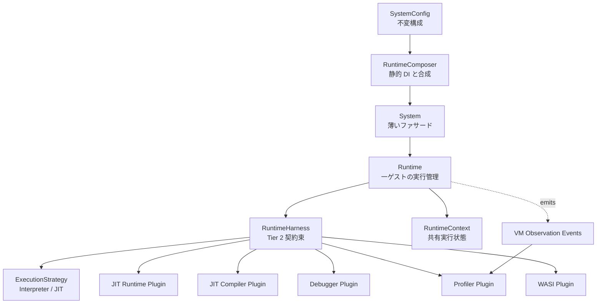
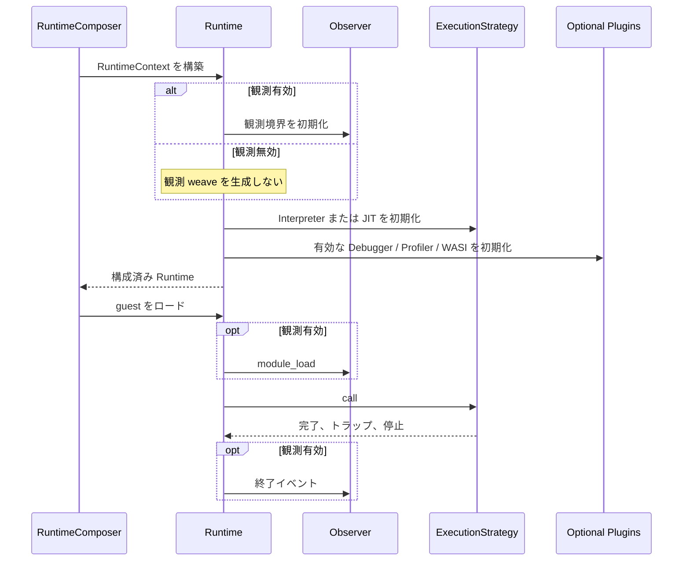

# ランタイムプラグイン構成契約 コンポーネント設計書
<!-- evidence:
     contract-only: true
-->

## 1. コンセプト
<!-- traceability: {META_3TierSeparation} {META_ContractImplSplit} {META_StaticDI} {GLOBAL_ComponentHarness} {ZeroRuntimeOverhead} -->
本コンポーネントは、WASM ランタイムを構成する実行エンジンと補助エンジンの交換契約を定義する。System は不変な構成情報を保持する。Runtime は構成情報から実装を静的に合成する。Tier 3 のプラグインは個別の実行方式、観測方式、物理接続を実装する。

本契約は、インタープリタ、JIT ランタイム、JIT コード生成器、デバッガ、ゲストプロファイラ、WASI バックエンドを同じランタイムへ混在させることを目的としない。Runtime は各機能を独立したスロットへ静的に結線する。無効な機能は Null オブジェクトとして実行時に保持せず、構成合成時に除外する。これにより、Runtime が実装方式の詳細と不要な weave 処理を抱え込むことを防止する。

インタープリタと JIT は同じ公開 `call` 境界を共有する。基底実行契約が呼出前処理、引数検証、トラップ確定、結果検証、呼出後処理を担当し、実行方式固有の処理だけをテンプレートフックへ委譲する。JIT はこのフックをオーバーライドして実行経路を差し替えるが、呼出状態の所有権と失敗時の意味は変更しない。

## 2. アーキテクチャ分類
<!-- traceability: {META_3TierSeparation} {META_ContractImplSplit} -->
本コンポーネントは **Tier 2 (分解されたサブコンポーネント: Decomposed Subcomponent)** に属する。Tier 2 は安定したライフサイクル、実行境界、プラグインスロット、依存方向を定義する。インタープリタ、JIT、デバッガ、プロファイラ、WASI の具体的なデータ構造とアルゴリズムは Tier 3 が担う。

System と Runtime の責務は次のように分離する。

| 要素 | 責務 | 保持してよい情報 | 保持してはならない情報 |
| :--- | :--- | :--- | :--- |
| `SystemConfig` | 構成値と資源予算の定義 | メモリ領域、機能選択、容量上限 | 実行中の PC、JIT キャッシュ状態、プロファイル結果 |
| `System` | 起動、停止、ゲスト登録の薄いファサード | `SystemConfig` への不変参照、構成済み Runtime | 命令デコード、JIT 判定、イベント集計 |
| `RuntimeComposer` | 静的 DI による実装合成と初期化順序の確定 | 選択済みの具体型、合成済みハーネス、初期化結果 | 実行ループ、ゲスト状態の更新 |
| `Runtime` | 一ゲストの実行ライフサイクルと共有状態の管理 | 実行コンテキスト、合成済み契約、観測境界 | Tier 3 のキャッシュ・ログ・物理ドライバの内部状態 |
| Tier 3 plugin | 交換可能な具体機能の実装 | 自身の固定長状態と専用領域 | 他プラグインの内部データ、System の再構成 |

## 3. 静的モデル

### 3.1 構成要素
<!-- traceability: {META_StaticDI} {GLOBAL_ComponentHarness} -->
- **`system_config`**: 起動前に確定する不変構成である。実行時のプラグイン交換を提供しない。
- **`runtime_composer`**: `system_config` とコンパイル時のプラグイン型から、Runtime のハーネスを構築する Tier 2 の合成ルートである。pysim の参照実装は [`runtime_composer.py`](experiments/pysim/tier2_runtime/runtime_composer.py)、C++ の構成合成は [`runtime_composer.hxx`](experiments/pysim/tier2_runtime/runtime_composer.hxx) に置く。
- **`runtime_harness`**: Runtime が利用する実行、JIT、デバッグ、観測、WASI の契約参照をまとめた静的ハーネスである。
- **静的 weave**: `runtime_composer` が有効なアスペクトだけを `runtime_harness` へ合成する。無効なアスペクトの状態、フック、WIT 境界、翻訳単位は合成結果に含めない。
- **`runtime_context`**: 一ゲストに専有される可変状態である。実行コンテキスト、メモリ境界、トラップ、停止理由、観測統計の所有権を保持する。
- **`execution_strategy`**: 命令列を実行する Tier 3 実装の契約である。Interpreter と JIT の共通呼出境界から利用する。
- **`jit_lookup_policy`**: JIT 有効構成で使うキャッシュ検索実装の選択である。選択責務は Tier 2 `RuntimeComposer`、検索アルゴリズムは選択された Tier 3 実装が担う。
- **`jit_runtime_plugin`**: JIT 有効構成にだけ存在し、ホットスポット検出、選択済み検索実装、コードキャッシュ、コンパイル要求、ネイティブ実行可否を担当する契約である。
- **`jit_compiler_plugin`**: WASM の実行単位を対象アーキテクチャのコードへ変換する契約である。
- **`debugger_plugin`**: 停止、再開、ブレークポイント、レジスタ・メモリ観測を担当する契約である。実行状態を変更できる唯一の補助プラグインとする。
- **`profiler_plugin`**: Runtime 観測イベントを読み取り、関数コールグラフと実行時間を集計する契約である。実行状態を変更しない。
- **`wasi_plugin`**: ゲストの WASI 呼出をホスト契約へ変換する契約である。WASI ABI の具体的な実装方式は Tier 3 が選択する。

### 3.2 内部ブロック図

### 3.3 プラグインスロット
<!-- traceability: {META_ContractImplSplit} {META_StaticDI} -->
| スロット | Tier 2 が定義する契約 | Tier 3 が実装する責務 | 無効構成の意味 |
| :--- | :--- | :--- | :--- |
| Execution | 共通 `call` と実行ステップの完了結果 | インタープリタまたは JIT 実行 | 許可しない。必ず一つを結線する |
| JIT lookup | JIT キャッシュ検索契約と構成選択 | 選択された固定容量キャッシュ検索 | JIT 無効構成では契約、検索処理、キャッシュ状態を合成しない |
| JIT runtime | コンパイル要求、選択済み検索、フォールバック、無効化 | ホットスポット管理とコードキャッシュ | JIT 無効構成ではスロット自体を持たない |
| JIT compiler | 実行単位のコード生成結果 | x64コード生成（検証済み）。ARMv8-M物理生成はTBD | コンパイル要求を未対応として返す |
| Debugger | 停止、再開、観測、書込みの境界 | GDB RSP 等のプロトコルと停止処理 | デバッグ要求を無効化する |
| Profiler | VM イベントの受信と終了通知 | コールグラフ、実行時間、ログ出力 | フック、イベント生成、状態、呼出しを合成しない |
| WASI | ゲスト呼出とホスト結果の変換境界 | Preview 1、Component Model、uvwasi 等 | WASI import を未対応として返す |

Python の `RuntimeComposer` は参照シミュレータとして起動時に生成器を選ぶ。Python の実行ファイルから未選択コードを除去する保証には使わない。C++ の構成除去は `FB_CONF_JIT_ENABLED` を翻訳単位共通のビルド定義として固定し、`runtime_composer.hxx` の前処理分岐で行う。JIT 無効ビルドでは JIT 型と lookup 契約を宣言しない。JIT 有効ビルドでは Tier 2 が選んだlookup型だけを `runtime_composer` のテンプレート引数に渡し、JIT executorへ静的に結線する。現行のC++ build probeはこの型選択と呼出経路を検証する。Python pysimのキャッシュ検索自体は引き続きTier 3 managerの実装である。

## 4. 動的モデル

### 4.1 初期化と終了
`runtime_composer` は、RuntimeContext、観測シンク、実行戦略、JIT 補助、デバッガ、WASI の順に有効な実装だけを構築する。失敗時は逆順で終了する。C++ 構成では不変構成をテンプレート引数または同等の生成済み型として固定し、Interpreter 構成には JIT lookup 契約と実装を参照させない。JIT 構成では Tier 2 が選んだ検索実装を一つだけ結線する。無効なスロットは初期化せず、Runtime の実行経路へ Null オブジェクト、有効性分岐、未選択検索実装への参照を残さない。

### 4.2 共通呼出テンプレート
`call` の共通処理は次の順序を保証する。Tier 3 の実装は `execute_body` に相当する実行フックだけを差し替える。

1. 実行可能状態、関数番号、引数型、スタック容量を検証する。
2. 呼出フレームを作成し、関数開始イベントを発行する。
3. 構成済み実行器を呼び出す。Interpreter 構成はインタープリタだけを実行する。JIT 構成は選択済みキャッシュ検索、コンパイル要求、ネイティブ実行を行い、トレース終端命令は C++ Interpreter の対応ハンドラへ渡す。
4. 戻り値、トラップ、停止要求を共通形式へ変換する。
5. 呼出フレームを確定し、関数終了イベントを発行する。
6. 呼出元へ結果を返す。

共通処理は JIT のキャッシュ状態、コンパイラの命令エンコーディング、デバッガの通信形式を参照してはならない。JIT の実行経路が共通契約を再実装することも禁止する。

### 4.3 プラグインの置換規則
- 置換単位はスロット単位とする。一つの Tier 3 実装が別スロットの内部状態を兼務してはならない。
- 実装選択と weave は Tier 2 `RuntimeComposer` が行う。ゲスト実行中の型差し替えは行わない。
- C++ の `RuntimeComposer` は静的 DI で選択済みの具体型をテンプレートまたは生成済みハーネスへ結線する。実行ホットパスに構成判定を置かず、選択条件は `if constexpr` で特殊化する。
- JIT 有効時の lookup 方針も Tier 2 が構成で選び、該当する Tier 3 実装だけを参照する。Interpreter 構成の生成物に JIT lookup シンボルが現れないことをビルド検証する。
- 無効なアスペクトに対応する `constexpr` 条件は偽でなければならない。このとき、イベントペイロード計算、フック呼出し、Null 判定、状態領域を翻訳単位へ生成してはならない。
- JIT runtime と JIT compiler は別スロットとする。JIT runtime 内のコンパイル失敗やキャッシュミスは、選択済みの C++ Interpreter ハンドラへフォールバックする。JIT 無効構成には JIT runtime の代わりに Null オブジェクトを置かない。
- Profiler は `RuntimeObserver` としてイベントを読む。Profiler から Runtime の実行メソッドを呼び出してはならない。
- Debugger の停止・再開・メモリ書込みは `ExecutionControl` 契約を使う。Profiler の観測契約へ書込み操作を追加してはならない。
- WASI のホスト呼出は `HostCallBoundary` を通す。製品ターゲットのWASI実装はこの境界の下位プラットフォーム実装を選択し、uvwasiはホスト上の評価構成だけで使用する。Runtimeはuvwasiを直接参照しない。

## 5. インターフェース定義

### 5.1 ランタイム生成
| 項目 | 内容 |
| :--- | :--- |
| 機能概要 | RuntimeComposer が不変構成と静的 DI から、一ゲスト専用 Runtime を合成する。 |
| 事前条件 | 全プラグインの資源上限、実行方式、メモリ領域が構成済みである。 |
| 期待する結果 | 必須スロットが具象実装で満たされ、無効スロットを含まない Runtime が得られる。 |
| エラー時の挙動 | 必須スロット不足、資源予算超過、依存不整合を初期化失敗として返す。部分初期化は終了処理後に破棄する。 |
| 不変条件 | Runtime 生成後にプラグイン型と資源領域は変更されない。 |

### 5.2 実行呼出
| 項目 | 内容 |
| :--- | :--- |
| 機能概要 | Interpreter または JIT による実行を共通の呼出境界で開始する。 |
| 引数と役割 | ゲスト関数識別子、引数領域、実行コンテキスト、実行予算を受け取る。 |
| 期待する結果 | 成功、ゲストトラップ、デバッガ停止、資源不足を区別した完了結果を返す。 |
| 事前条件 | Runtime がロード済みで、呼出フレーム容量が確保されている。 |
| 事後条件 | 呼出フレーム、観測イベント、実行コンテキストが同じ完了理由を示す。 |
| 不変条件 | 実行方式を変更しても引数検証、トラップ分類、結果検証の意味は変わらない。 |

### 5.3 プラグイン終了
| 項目 | 内容 |
| :--- | :--- |
| 機能概要 | Runtime を停止し、各プラグインの固定長状態と専用領域を終了する。 |
| 事前条件 | 実行中のゲストが停止またはトラップ確定している。 |
| 期待する結果 | 開いている観測フレームが終了理由付きで閉じられ、所有領域が返却可能になる。 |
| エラー時の挙動 | 終了処理の失敗は最初の失敗理由を保持し、後続プラグインの終了を継続する。 |

## 6. 制約達成の方策
<!-- traceability: {GLOBAL_Policy_Memory} {ZeroRuntimeOverhead} {META_StaticDI} -->

### 6.1 性能制約と方策
- RuntimeComposer は静的 DI で実装を合成する。実行ホットパスのプラグイン選択を実行時に行ってはならない。
- Interpreter 構成では JIT lookup の関数、状態、初期化、インポート、翻訳単位を生成物へ含めない。JIT 構成では選択された lookup 実装だけを含める。
- 構成済み Interpreter と JIT のホットパスに `jit_runtime != nullptr` 相当の判定を置かない。選択は Tier 2 の合成時に完了させる。
- 実行中の文字列検索、動的レジストリ検索、仮想関数による全称ディスパッチを要求しない。
- weave 箇所は `constexpr` 条件で特殊化する。条件が偽のアスペクトでは、フック本体だけでなく呼出し、引数評価、ペイロード構築、状態領域を除去する。
- リンカの未参照コード除去や LTO は補助に留める。RuntimeComposer は、不要な実装を参照せず翻訳単位へ含めないことで除去を保証する。

### 6.2 メモリ制約と方策
- 全プラグインの状態容量、イベントリング容量、JIT コード領域、デバッガバッファを `SystemConfig` の予算へ登録する。
- Runtime はゲスト単位の固定領域だけを所有し、プラグイン間で可変長の共有所有権を作らない。
- Tier 3 の実装が追加のヒープや暗黙のスレッドを要求する場合は、構成検査で拒否する。

### 6.3 安全性制約と方策
- Plugin は自分のスロットに対応する状態だけを変更する。
- Debugger の状態変更は `ExecutionControl` へ限定し、Profiler と観測イベントを介して実行状態を変更できないようにする。
- JIT のコード領域、Runtime のデータ領域、外部ログの搬送領域を物理的に分離する。

## 7. 形式検証（pyModelChecking / 直交表）

### 7.1 検証対象の不変条件
| 不変条件 | 説明 | 範囲 | 検証方法 |
| :--- | :--- | :--- | :--- |
| スロット完全性 | 必須スロットが必ず具象実装で満たされ、無効スロットが実行経路に存在しない。 | 構成 | TODO(未決): 構成モデルの CTL 検証 |
| weave 除去 | 無効アスペクトのフック、状態、呼出し、WIT 境界、翻訳単位が合成結果に存在しない。 | 構成・生成物 | TODO(未決): 生成物検査と map file 検査 |
| 依存方向 | Tier 2 契約が Tier 3 の内部型を参照しない。 | 文書・型 | TODO(未決): DocGraph と静的検査 |
| 共通呼出同値性 | Interpreter と JIT の完了理由、トラップ、結果検証が同じ意味を持つ。 | 実行 | TODO(未決): 直交表と状態モデル |
| 終了完全性 | 初期化済みの全プラグインが終了処理を一度だけ受ける。 | ライフサイクル | TODO(未決): CTL 変異検査 |

### 7.2 既知の制限や仮定
本仕様はプラグイン境界とライフサイクルを定義する。各プラグインのキャッシュアルゴリズム、WASI ABI、デバッグパケット形式、イベント集計アルゴリズムは本仕様の検証対象外であり、対応する Tier 3 仕様へ委譲する。

## 8. 設計上の未決事項
- JIT runtime と JIT compiler のコンパイル要求を同期呼出だけにするか、固定長要求キューを許可するかの選択。
- プロファイラの観測損失を構成エラーにする厳密モードと、欠落数をログへ残して継続する計測モードの選択。
