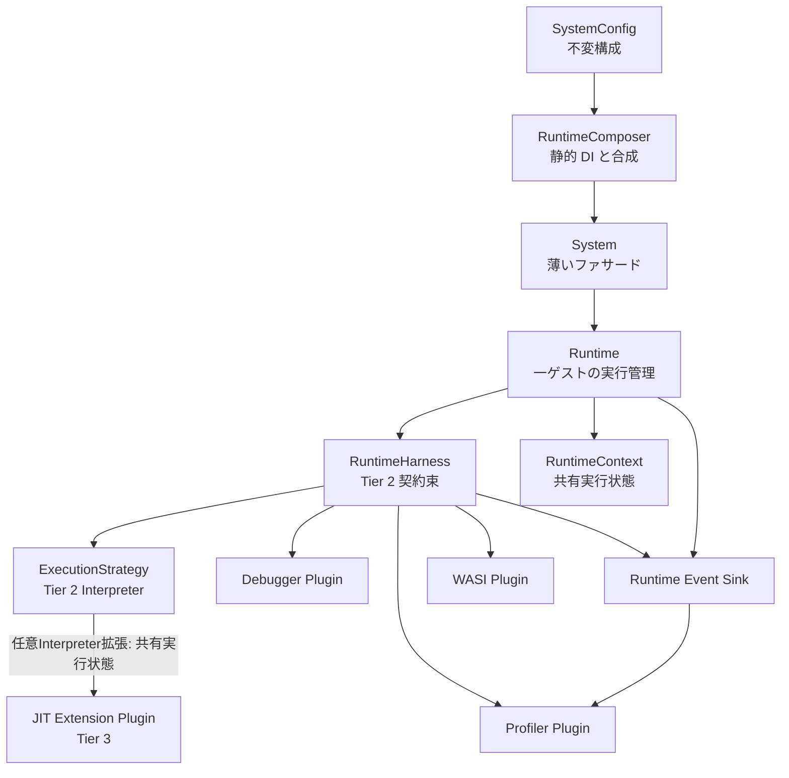
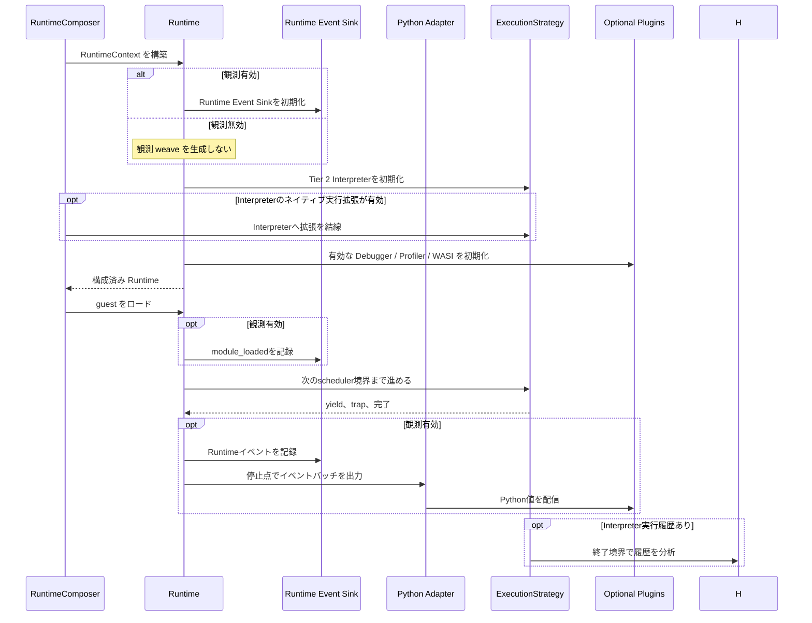

# ランタイムプラグイン構成契約 コンポーネント設計書
<!-- evidence:
     contract-only: true
     test: docs/qa/tier2_runtime/runtime_plugin_architecture_test_spec.md
-->

## 1. コンセプト
<!-- traceability: {META_3TierSeparation} {META_ContractImplSplit} {META_StaticDI} {GLOBAL_ComponentHarness} {RuntimeEventSink} {ZeroRuntimeOverhead} -->
本コンポーネントは、WASM ランタイムを構成する実行エンジンと補助エンジンの交換契約を定義する。System は不変な構成情報を保持する。Runtime は構成情報から実装を静的に合成する。Tier 3 のプラグインは個別の実行方式、観測方式、物理接続を実装する。

本契約は、Interpreter、Debugger、Guest Profiler、WASIバックエンドをRuntimeへ必要に応じて結線する。JIT拡張はInterpreterの任意プラグインであり、Runtimeの独立スロットにしない。無効な機能はNullオブジェクトとして実行時に保持せず、Interpreter構成時に除外する。

Interpreterは常に実行エンジンとして存在する。JIT有効構成では、Interpreterが汎用のネイティブ実行拡張を保持し、同じ実行状態でnative dispatchを行う。RuntimeはInterpreterを次のscheduler境界まで進め、境界結果をSystemへ返す。RuntimeはJIT選択、キャッシュ検索、本体実行を行わない。

## 2. アーキテクチャ分類
<!-- traceability: {META_3TierSeparation} {META_ContractImplSplit} -->
本コンポーネントは **Tier 2 (分解されたサブコンポーネント: Decomposed Subcomponent)** に属する。Tier 2 は安定したライフサイクル、実行境界、プラグインスロット、依存方向を定義する。インタープリタ、JIT、デバッガ、プロファイラ、WASI の具体的なデータ構造とアルゴリズムは Tier 3 が担う。

System と Runtime の責務は次のように分離する。

| 要素 | 責務 | 保持してよい情報 | 保持してはならない情報 |
| :--- | :--- | :--- | :--- |
| `SystemConfig` | 構成値と資源予算の定義 | メモリ領域、機能選択、容量上限 | 実行中の PC、JIT キャッシュ状態、プロファイル結果 |
| `System` | 起動、停止、ゲスト登録の薄いファサード | `SystemConfig` への不変参照、構成済み Runtime | 命令デコード、JIT 判定、イベント集計 |
| `RuntimeComposer` | 静的 DI による実装合成と初期化順序の確定 | 選択済みの具体型、合成済みハーネス、初期化結果 | 実行ループ、ゲスト状態の更新 |
| `Runtime` | 一ゲストの実行ライフサイクルと共有状態の管理 | 実行コンテキスト、合成済み契約、観測境界 | Tier 3 のキャッシュ・ログ・物理ドライバの内部状態 |
| Tier 3 plugin | 交換可能な具体機能の実装 | 自身の固定長状態と専用領域 | 他プラグインの内部データ、System の再構成 |

## 3. 静的モデル

### 3.1 構成要素
<!-- traceability: {META_StaticDI} {GLOBAL_ComponentHarness} -->
- **`system_config`**: 起動前に確定する不変構成である。実行時のプラグイン交換を提供しない。
- **`runtime_composer`**: `system_config` とコンパイル時のプラグイン型から、Runtime のハーネスを構築する Tier 2 の合成ルートである。構成選択と依存の結線はコンパイル時に確定する。
- **`runtime_harness`**: Runtimeが利用するInterpreter、Debugger、観測、WASIの契約参照をまとめた静的ハーネスである。
- **静的 weave**: `runtime_composer` が有効なアスペクトだけを `runtime_harness` へ合成する。無効なアスペクトの状態、フック、WIT 境界、翻訳単位は合成結果に含めない。
- **`runtime_context`**: 一ゲストに専有される可変状態である。実行コンテキスト、メモリ境界、トラップ、停止理由、観測統計の所有権を保持する。
- **`execution_strategy`**: WASM命令を実行する必須のTier 2 Interpreterである。
- **`interpreter_execution_plugin`**: Interpreter構成時に任意接続する汎用ネイティブ実行拡張の契約である。Tier 3 JITはこの契約を実装し、ホットスポット履歴、コードキャッシュ、コンパイル待ち列、コンパイラを所有する。
- **`runtime_event_sink`**: 意味上のRuntimeイベントを固定長リングへ記録し、安全点でABIバッチとして出力する契約である。ホットスポット履歴を記録しない。
- **`debugger_plugin`**: 停止、再開、ブレークポイント、レジスタ・メモリ観測を担当する契約である。実行状態を変更できる唯一の補助プラグインとする。
- **`profiler_plugin`**: Runtime 観測イベントを読み取り、関数コールグラフと実行時間を集計する契約である。実行状態を変更しない。
- **`wasi_plugin`**: ゲストの WASI 呼出をホスト契約へ変換する契約である。WASI ABI の具体的な実装方式は Tier 3 が選択する。

### 3.2 内部ブロック図

```mermaid
graph TD
    Config[SystemConfig<br/>不変構成] --> Composer[RuntimeComposer<br/>静的 DI と合成]
    Composer --> System[System<br/>薄いファサード]
    System --> Runtime[Runtime<br/>一ゲストの実行管理]
    Runtime --> Harness[RuntimeHarness<br/>Tier 2 契約束]
    Harness --> Exec[ExecutionStrategy<br/>Tier 2 Interpreter]
    Harness --> Debugger[Debugger Plugin]
    Harness --> Profiler[Profiler Plugin]
    Harness --> EventSink[Runtime Event Sink]
    Harness --> Wasi[WASI Plugin]
    Runtime --> Context[RuntimeContext<br/>共有実行状態]
    Runtime --> EventSink
    EventSink --> Profiler
    Exec -->|任意Interpreter拡張: 共有実行状態| JitRuntime[JIT Extension Plugin<br/>Tier 3]
```

### 3.3 プラグインスロット
<!-- traceability: {META_ContractImplSplit} {META_StaticDI} -->
| スロット | Tier 2 が定義する契約 | Tier 3 が実装する責務 | 無効構成の意味 |
| :--- | :--- | :--- | :--- |
| Execution | 共通 `call` とInterpreter実行の完了結果 | Tier 2 Interpreter | 許可しない。必ずInterpreterを結線する |
| Interpreter native extension | Interpreter dispatcherへの接続 | Tier 2が汎用接続契約を定め、Tier 3 JITが本体実行、ホットスポット状態、コードキャッシュ、コンパイラを実装 | Interpreter構成時に拡張を接続しない |
| Debugger | 停止、再開、観測、書込みの境界 | GDB RSP 等のプロトコルと停止処理 | デバッグ要求を無効化する |
| Profiler | VM イベントの受信と終了通知 | コールグラフ、実行時間、ログ出力 | フック、イベント生成、状態、呼出しを合成しない |
| Runtime Event Sink | 意味上のRuntimeイベントを記録し、停止点でABIバッチを出力する | 固定長イベントリング | 観測無効構成ではSink、リング、発行経路を合成しない |
| WASI | ゲスト呼出とホスト結果の変換境界 | Preview 1、Component Model、uvwasi 等 | WASI import を未対応として返す |

構成は翻訳単位共通のマクロで切り替えない。
`runtime_configuration<Interpreter, Debugger, Profiler, RuntimeEventSink>`の型で表す。
Runtime Event Sinkは独立した型スロットで選択する。JIT拡張の選択はInterpreterの構成に属する。
無効なスロットの型には`void`を指定する。
`runtime_harness<Configuration>`は選択済みコンポーネントへの参照だけを保持する。
`runtime_composer<Configuration>`はそのハーネスを値として保持する。
構成にはJIT拡張なしのInterpreter、JIT拡張付きInterpreter、Debugger/Profiler付きInterpreter、イベント有効・無効などがある。
これらは同一プログラム内で別々にインスタンス化できる。
各インスタンスの実行経路に構成選択分岐を置かない。

## 4. 動的モデル

### 4.1 初期化と終了
`runtime_composer`は、RuntimeContext、Runtime Event Sink、Interpreter、Debugger、Profiler、WASIのうち選択された具象実装をハーネスへ結線する。JITが有効な場合はInterpreterの生成時にネイティブ実行拡張を結線する。各要素は所有者の初期化・終了順に従う。失敗時は初期化済み要素を逆順で終了する。C++構成では不変構成をテンプレート引数または同等の生成済み型として固定する。無効な機能をRuntimeの実行経路へ残さない。

```mermaid
sequenceDiagram
    participant C as RuntimeComposer
    participant R as Runtime
    participant O as Runtime Event Sink
    participant A as Python Adapter
    participant E as ExecutionStrategy
    participant P as Optional Plugins
    C->>R: RuntimeContext を構築
    alt 観測有効
        R->>O: Runtime Event Sinkを初期化
    else 観測無効
        Note over R: 観測 weave を生成しない
    end
    R->>E: Tier 2 Interpreterを初期化
    opt Interpreterのネイティブ実行拡張が有効
        C->>E: Interpreterへ拡張を結線
    end
    R->>P: 有効な Debugger / Profiler / WASI を初期化
    R-->>C: 構成済み Runtime
    C->>R: guest をロード
    opt 観測有効
        R->>O: module_loadedを記録
    end
    R->>E: 次のscheduler境界まで進める
    E-->>R: yield、trap、完了
    opt 観測有効
        R->>O: Runtimeイベントを記録
        R->>A: 停止点でイベントバッチを出力
        A->>P: Python値を配信
    end
    opt Interpreter実行履歴あり
        E->>H: 終了境界で履歴を分析
    end
```

### 4.2 実行境界の進行
Interpreterは呼出し状態を作り、native dispatcherを完了、trap、またはyield境界まで進める。接続済みのネイティブ実行拡張はInterpreter dispatcher内で呼び出す。

RuntimeEngineはInterpreterを一度進め、scheduler境界の結果をSystemへ返す。JITの候補判定、trace検索、本体実行、compile queue処理はInterpreter拡張の責務である。

### 4.3 プラグインの置換規則
- 置換単位はスロット単位とする。一つの Tier 3 実装が別スロットの内部状態を兼務してはならない。
- 実装選択と weave は構成時に行う。ゲスト実行中の型差し替えは行わない。
- C++ の `RuntimeComposer` は静的 DI で選択済みの具体型をテンプレートまたは生成済みハーネスへ結線する。実行ホットパスに構成判定を置かず、選択条件は `if constexpr` で特殊化する。
- JIT 有効時はInterpreter構成に単一のネイティブ実行拡張を結線する。キャッシュ検索方針とコンパイラ選択はTier 3拡張内部に置き、RuntimeへJIT管理スロットを追加しない。
- 無効なアスペクトに対応する `constexpr` 条件は偽でなければならない。このとき、イベントペイロード計算、フック呼出し、Null 判定、状態領域を翻訳単位へ生成してはならない。
- JIT拡張はInterpreterから見た単一プラグイン境界とする。コンパイラはその内部実装であり、別スロットやC++ Runtime操作APIを増やさない。コンパイル失敗やキャッシュミスは同じInterpreter dispatcherのCPS handlerへフォールバックする。JIT無効構成には代替Nullオブジェクトを置かない。
- Runtime Event Sink は C++ Runtime 内で固定長レコードを記録し、C++実行中にPython callbackを呼び出さない。Python Adapterは停止点で変換したイベント値をProfilerへ渡す。
- Runtime Event Sinkは意味上のイベントだけを記録し、基本ブロック履歴を受けない。JIT履歴はTier 3 JIT拡張が内部状態として所有する。
- Profiler から Runtime の実行メソッドを呼び出してはならない。
- Debugger の停止・再開・メモリ書込みは `ExecutionControl` 契約を使う。Profiler の観測契約へ書込み操作を追加してはならない。
- WASI のホスト呼出は `HostCallBoundary` を通す。製品ターゲットのWASI実装はこの境界の下位プラットフォーム実装を選択し、uvwasiはホスト上の評価構成だけで使用する。Runtimeはuvwasiを直接参照しない。

## 5. インターフェース定義

### 5.1 ランタイム生成
| 項目 | 内容 |
| :--- | :--- |
| 機能概要 | RuntimeComposer が不変構成と静的 DI から、一ゲスト専用 Runtime を合成する。 |
| 事前条件 | 全プラグインの資源上限、実行方式、メモリ領域が構成済みである。 |
| 期待する結果 | 必須スロットが具象実装で満たされ、無効スロットを含まない Runtime が得られる。 |
| エラー時の挙動 | 必須スロット不足、資源予算超過、依存不整合を初期化失敗として返す。部分初期化は終了処理後に破棄する。 |
| 不変条件 | Runtime 生成後にプラグイン型と資源領域は変更されない。 |

### 5.2 実行呼出
| 項目 | 内容 |
| :--- | :--- |
| 機能概要 | RuntimeEngineがInterpreterを次のscheduler境界まで進める。ネイティブ実行拡張はInterpreter dispatcher内で呼び出す。 |
| 引数と役割 | ゲスト関数識別子、引数領域、実行コンテキスト、実行予算を受け取る。 |
| 期待する結果 | 成功、ゲストトラップ、デバッガ停止、資源不足を区別した完了結果を返す。 |
| 事前条件 | Runtime がロード済みで、呼出フレーム容量が確保されている。 |
| 事後条件 | 呼出フレーム、観測イベント、実行コンテキストが同じ完了理由を示す。 |
| 不変条件 | 実行方式を変更しても引数検証、トラップ分類、結果検証の意味は変わらない。 |

### 5.3 プラグイン終了
| 項目 | 内容 |
| :--- | :--- |
| 機能概要 | Runtime を停止し、各プラグインの固定長状態と専用領域を終了する。 |
| 事前条件 | 実行中のゲストが停止またはトラップ確定している。 |
| 期待する結果 | 開いている観測フレームが終了理由付きで閉じられ、所有領域が返却可能になる。 |
| エラー時の挙動 | 終了処理の失敗は最初の失敗理由を保持し、後続プラグインの終了を継続する。 |

## 6. 制約達成の方策
<!-- traceability: {GLOBAL_Policy_Memory} {ZeroRuntimeOverhead} {META_StaticDI} -->

### 6.1 性能制約と方策
- RuntimeComposer は静的 DI で実装を合成する。実行ホットパスのプラグイン選択を実行時に行ってはならない。
- JIT無効構成ではJIT lookupの関数、状態、初期化、インポート、翻訳単位を生成物へ含めない。JIT有効時はInterpreterへ結線したlookup実装だけを含める。
- Interpreterとネイティブ実行拡張の選択は構成時に完了する。命令ホットパスへ拡張の有無を判定する条件を置かない。
- 実行中の文字列検索、動的レジストリ検索、仮想関数による全称ディスパッチを要求しない。
- weave 箇所は `constexpr` 条件で特殊化する。条件が偽のアスペクトでは、フック本体だけでなく呼出し、引数評価、ペイロード構築、状態領域を除去する。
- RuntimeComposer は選択された実装をインスタンスへ静的に結線し、他スロットの状態や呼出しをそのインスタンスへ含めない。別構成のハーネスが同じプログラム内で使われる場合、その構成の実装も同時に存在できる。

### 6.2 メモリ制約と方策
- 全プラグインの状態容量、イベントリング容量、JIT コード領域、デバッガバッファを `SystemConfig` の予算へ登録する。
- Runtime はゲスト単位の固定領域だけを所有し、プラグイン間で可変長の共有所有権を作らない。
- Tier 3 の実装が追加のヒープや暗黙のスレッドを要求する場合は、構成検査で拒否する。

### 6.3 安全性制約と方策
- Plugin は自分のスロットに対応する状態だけを変更する。
- Debugger の状態変更は `ExecutionControl` へ限定し、Profiler と観測イベントを介して実行状態を変更できないようにする。
- JIT のコード領域、Runtime のデータ領域、外部ログの搬送領域を物理的に分離する。

## 7. 形式検証・テスト仕様との対応

### 7.1 形式検証（pyModelChecking / 直交表）

#### 7.1.1 検証対象の不変条件
| 不変条件 | 説明 | 範囲 | 検証方法 |
| :--- | :--- | :--- | :--- |
| 実行器選択 | Interpreter構成に接続する任意のネイティブ実行拡張を固定し、Debuggerと同時に接続する禁止構成を拒否する。 | Runtime構成テスト |
| 観測スロット選択 | Runtime Event Sinkの有効・無効を他の構成から独立して組み合わせる。 | Runtime構成テスト |
| C++ weave除去 | 無効アスペクトのフック、状態、WIT境界、翻訳単位を生成物から除去する。 | 型構成、生成コード、map-file検査 |
| 初期化・終了 | 選択された各Pluginの初期化と逆順終了を一度ずつ行う。 | Runtime lifecycleテスト |

#### 7.1.2 対象外
各プラグインのキャッシュアルゴリズム、WASI ABI、デバッグパケット形式、イベント集計アルゴリズムは対応する Tier 3 仕様へ委譲する。

## 8. 設計判断と参考実装

### 8.1 設計上の未決事項
- 各プラグインの固定容量は `SystemConfig` の資源予算で確定する。

特記すべき独立したADRはない。採用方針は本書の各契約節に記載する。
