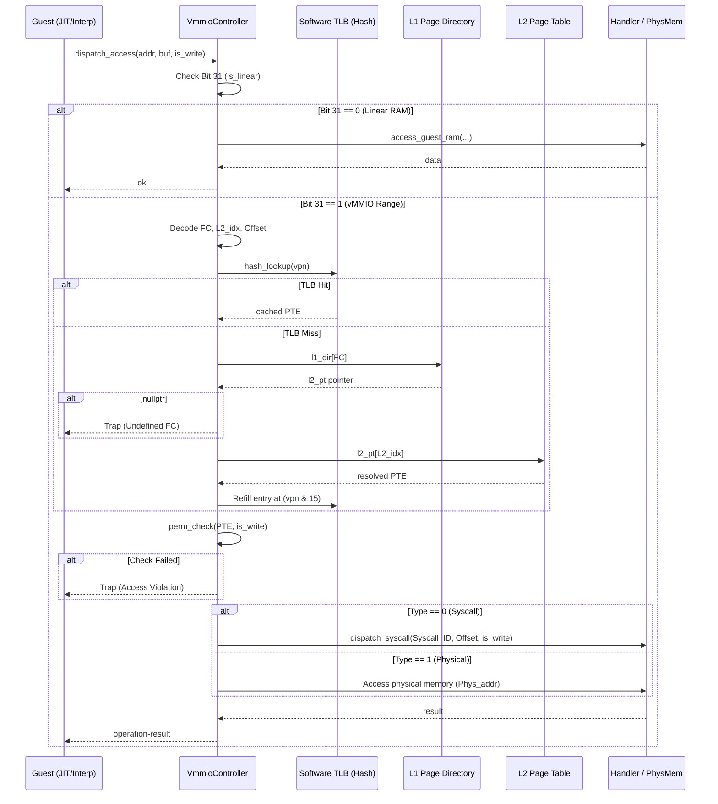
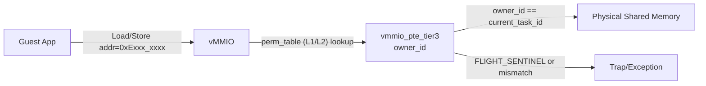

# vMMIO コンポーネント設計書 (改訂版)

## 1. コンセプト
<!-- traceability: {META_RestrictedPhysicalAccess} {vMMIO_TrapAndEmulate} {PhysicalPassthrough} {DynamicMmap} {UnifiedAccessModel} {FastAddressCheck} {Fast_Path_GPIO} -->
vMMIO (Virtual Memory-Mapped I/O) は、WASMゲストとホスト間の**すべてのデータ交換**を仲介する統一的なアクセス層である。物理レジスタ（GPIO等）、共有メモリ、システムコール用バッファなど、ホスト-ゲスト間境界を横切るアクセスはすべてvMMIO空間を経由する。**割り当て単位は1ページ（4KB）**とし、各デバイス領域は4KB境界に配置される。WASMページサイズとは独立した設計。 `{META_RestrictedPhysicalAccess}` `{vMMIO_TrapAndEmulate}` `{PhysicalPassthrough}` `{DynamicMmap}` `{UnifiedAccessModel}`

本アーキテクチャでは、JIT実行などの極めてクリティカルなパスにおいて、探索コストを完全に一定（O(1)）に抑え込むため、従来の `std::flat_map` を用いた $O(\log N)$ 二分探索および線形探索TLBを全面的に廃止し、OS/MMUハードウェアの基本原則に忠実な**「2段階ダイレクトインデックス式ページテーブル（L1/L2）」**および**「ダイレクトマップ方式のソフトウェアTLB」**を採用する。

RAM < 64KB の極小資源に適合するため、本設計ではL2ページテーブルサイズを標準の256エントリから**16エントリ**にスケールダウンし、1テーブルあたりのメモリフットプリントをわずか 64 バイト（$16 \times 4 \text{ bytes} = 64 \text{ bytes}$）に抑え込む。これにより、システム全体で必要な定数・動的テーブル群の総メモリを 192 バイト（3テーブル分）以内に圧縮する。

1. **リニアアドレス空間フィルタ（高速バイパス）**:
   32ビットゲストアドレスの最上位ビット（Bit 31）が `0` の場合、そのアドレスは vMMIO 管理対象外として、Tier 1（ゲストRAM）への直接アクセスとして高速バイパス（境界チェックのみの O(1) 処理）を実行する。 `{FastAddressCheck}`
2. **2段階ダイレクトデコード（O(1) テーブルウォーク）**:
   最上位ビット（Bit 31）が `1` のアドレス空間を vMMIO 領域（`0x8000_0000` – `0xFFFF_FFFF`）とする。
   - **L1 ページディレクトリ (Page Directory)**:
     アドレス最上位 4 ビット（ビット[31:28]）を **Function Code (FC)** とし、16エントリのポインタ配列 `vmmio_l1_dir`（$16 \times 4 \text{ bytes} = 64 \text{ bytes}$）を直接インデックス参照する。これによりルートテーブルの O(1) 選択を行う。未マッピングの FC の場合は `nullptr` であり、アクセス時に即時トラップを発生させる。 `{FastAddressCheck}`
   - **L2 ページテーブル (Page Table)**:
     ビット[15:12]（4 bits）を **L2 インデックス**とし、L1 エントリが指す 16 エントリの固定長 PTE 配列 `vmmio_l2_pt` をインデックス参照する。これにより 64KB のアドレス領域（4KB × 16ページ）を O(1) にマッピングする。
   - インデックスとして使用されないビット[27:16]（12 bits）は、FC=12 (静的デバイス) では Device Type や Syscall ID などのデバイス情報やサービスIDの特定に利用する。
3. **ダイレクトマップ方式ソフトウェアTLB（完全O(1)キャッシュ）**:
   ホットパス高速化のため、線形検索を行う TLB キャッシュを廃止し、一発でインデックスが決まるダイレクトマッピング（ハッシュ方式、16エントリ固定サイズ）を採用する。
   - 仮想ページ番号 (VPN = `raw >> 12`) から、ハッシュ値 `tlb_idx = vpn & 15` を算出し、TLBに一撃でアクセスする。ヒット時は権限チェックを通過した後に即時実行する。 `{META_RestrictedPhysicalAccess}`

セキュリティモデルは**PTEに埋め込まれた権限フィールドが唯一のゲート**である。アクセス権限は PTE に保持され、ルックアップと権限チェックを1パスで完結させる。アクセス特性に応じてセキュリティゲートを以下の3層に階層化する。 `{META_RestrictedPhysicalAccess}`

1. **Tier 1 (ゲストRAM)**: ゲスト専用RAM領域（Bit 31 == 0）。コンパイル時または実行時の単純な境界チェック（加算/比較）のみで処理。
2. **Tier 2 (静的vMMIO, FC=12)**: コンパイル時にアドレスが確定するコアデバイス（SYSCTL, IPCR, VDMA等）。アドレス `0xC000_0000` は FC=12 に位置する。JIT生成時に許可チェックを行い、許可済みならネイティブコードに直接デバイスキー（Syscall ID を含む）を埋め込む。
3. **Tier 3 (動的vMMIO, FC=14-15)**: SHM（FC=14, `0xE000_0000`）、PASSTHROUGH（FC=15, `0xF000_0000`）領域のアクセス。実行時に 2段階ページテーブルを経由して PTE を解決し、エントリの権限フィールドで可否を判定する。

IPC経由のデータ交換は行わない — GPIOのようなsub-µs応答が必要な周辺機器はIPCレイテンシに耐えられないため、このダイレクトアクセスモデルが採用されている。 `{Fast_Path_GPIO}`

## 2. アーキテクチャ分類
<!-- traceability: {META_3TierSeparation} -->
本コンポーネントは **Tier 2 (分解されたサブコンポーネント: Decomposed Subcomponent)** に属し、vSoC (`runtime_vsoc.md`) から分解された仮想MMIO・デバイスレジスタアクセスおよびメモリ空間マッピングを担当する。 `{META_3TierSeparation}`

## 3. 静的モデル

### 3.1 データ構造
<!-- traceability: {META_Static_Resolution} -->

リソース制約上、構造体は **ROM（不変）** と **RAM（可変）** に明確に分離する。L2テーブルサイズを16エントリに抑えることでRAM浪費を根本排除する。

| 配置 | 構造体 | 概要 |
| :--- | :--- | :--- |
| ROM | `vmmio_address` | アドレスビットフィールド定義（C++23 ヘルパー構造体、実体なし） |
| ROM | `vmmio_l1_dir[16]` | FC (4 bits) → L2 ページテーブルポインタへの O(1) 定数/静的ディレクトリ |
| RAM/ROM | `vmmio_l2_pt_static[16]` | FC=12 (Static Device) 用。L2 Index (4 bits) → 32bit Static Device PTE 配列 (64 bytes) |
| RAM | `vmmio_l2_pt_shm[16]` | FC=14 (SHM) 用。L2 Index (4 bits) → 32bit Tier 3 PTE 配列（動的、64 bytes） |
| RAM/ROM | `vmmio_l2_pt_pass[16]` | FC=15 (PASSTHROUGH) 用。L2 Index (4 bits) → 32bit Tier 3 PTE 配列 (64 bytes) |
| RAM | ソフトウェアTLB配列 | `vmmio_tlb_cache[16]` 16エントリのダイレクトマップ型高速TLBキャッシュ配列 |

- **`VmmioController`**: アドレス境界デコード、L1/L2テーブルウォーク、TLBキャッシュ管理、動的マッピング管理を担う主要クラス。
- **`vmmio_config`**: 静的な領域定義 (`vmmio_static_region`) の不変なテーブル。 `{META_Static_Resolution}`

### 3.2 内部ブロック図
<!-- traceability: {META_Static_Resolution} -->
```mermaid
graph TD
    subgraph vMMIO_Layer
        Filter[MSB Address Filter\nBit 31 == 0 vs 1]
        Decoder[Address Decoder\nFC[31:28] + L2[15:12] + L3/Sys[27:16] + Offset[11:0]]
        L1Dir["vmmio_l1_dir [16]\nIndexed by FC"]
        L2Table["vmmio_l2_pt [16]\nIndexed by L2 Index"]
        TLB["Direct-Mapped TLB [16]\nIndex = (vpn) & 15"]
        Controller[VmmioController]
    end

    Controller -- checks addr --> Filter
    Filter -- Bit 31 == 0 --> Bypass[Linear RAM Bypass\nTier 1 RAM Access]
    Filter -- Bit 31 == 1 --> Decoder
    Controller -- checks Cache --> TLB
    TLB -- Host Hit (O(1)) --> Handler["PTE Handler\n(Syscall or Phys)"]
    TLB -- Cache Miss --> Walk[L1/L2 Table Walk]
    Walk -- index FC --> L1Dir
    L1Dir -- points to --> L2Table
    L2Table -- lookup L2_idx --> WalkResult[Resolved PTE]
    WalkResult -- refills --> TLB
    WalkResult --> Handler
```

### 3.3 主要なクラス・構造体・配列・定数
<!-- traceability: {META_Static_Resolution} -->
vMMIO

#### アドレスフィールド定義 (vmmio_address)
<!-- traceability: {META_Static_Resolution} -->
32ビットゲストアドレスを5つのフィールドに分割する。1ページ(4KB)ごとの連続アドレスが L2 ページテーブルの各スロットにダイレクト展開される。

| 項目名 | 機能と役割 | 備考（制約、型など） |
| :--- | :--- | :--- |
| RAM Bypass Flag | Bit 31 が 0 のときはゲストRAMアクセス（Tier 1）とし、vMMIOを高速バイパス。 | ビット[31]（1 bit） |
| Function Code | vMMIO 領域時の配列インデックス。L1 ページディレクトリで使用。 | ビット[31:28]（4 bits）、16種別 |
| L3 Sub / Metadata | 静的デバイスでは Syscall ID や Device Type などの付加情報を、それ以外では共有メモリ等の補足キーを保持。 | ビット[27:16]（12 bits） |
| L2 Page Index | L2 ページテーブル（16エントリ）へのダイレクトインデックス。連続ページで連続増分。 | ビット[15:12]（4 bits）、最大16ページ（64KB空間） |
| Offset | 4KBページ内でのバイトオフセット。L1/L2 解決後に相対アドレスとして使用。 | ビット[11:0]（12 bits）、4KB |

**アドレスデコード + PTE アクセス擬似コード例**:
```python
class VmmioAddress:
    def __init__(self, raw: int):
        self.raw = raw
        
    def is_linear(self) -> bool:
        # 最上位ビット(Bit 31)が0ならゲストRAM
        return (self.raw & 0x80000000) == 0
        
    def fc(self) -> int:
        # Function Code: [31:28]
        return (self.raw >> 28) & 0xF
        
    def l3_metadata(self) -> int:
        # L3 Sub / Metadata: [27:16]
        return (self.raw >> 16) & 0xFFF
        
    def l2_idx(self) -> int:
        # L2 Index: [15:12] (4 bits, 16ページ空間に直結)
        return (self.raw >> 12) & 0xF
        
    def offset(self) -> int:
        # Offset: [11:0]
        return self.raw & 0xFFF
        
    def vpn(self) -> int:
        # Virtual Page Number (VPN) for TLB Key
        return self.raw >> 12

# 2段階ページテーブルの定義
# vmmio_l1_dir = [None] * 16  # L1 ページディレクトリ
# vmmio_tlb_cache = [{'vpn': 0xFFFFFFFF, 'pte': 0} for _ in range(16)]  # ダイレクトマップ方式TLB

def lookup_tlb(addr: VmmioAddress) -> int:
    vpn = addr.vpn()
    tlb_idx = vpn & 15  # ダイレクトマップハッシュ: vpn % 16
    
    if vmmio_tlb_cache[tlb_idx]['vpn'] == vpn:
        return vmmio_tlb_cache[tlb_idx]['pte']  # TLB Hit!
        
    # TLB Miss: 2段階テーブルウォークを実行
    fc = addr.fc()
    l2_table = vmmio_l1_dir[fc]
    if l2_table is None:
        raise Exception("UNDEFINED_FC")
        
    l2_idx = addr.l2_idx()
    pte = l2_table[l2_idx]
    
    # TLB をリフィル
    vmmio_tlb_cache[tlb_idx] = {'vpn': vpn, 'pte': pte}
    return pte

def access_vmmio(addr: VmmioAddress, is_write: bool):
    # 1. リニアアドレスフィルタ
    if addr.is_linear():
        # Tier 1 ゲストRAMアクセス（vMMIOバイパス）
        access_guest_ram(addr.raw, is_write)
        return
        
    # 2. TLB / ページテーブルルックアップ
    pte = lookup_tlb(addr)
    
    # 3. 権限チェック (共通)
    read_allowed = pte & 0x1
    write_allowed = pte & 0x2
    if is_write and not write_allowed:
         raise Exception("ACCESS_VIOLATION")
    if not is_write and not read_allowed:
         raise Exception("ACCESS_VIOLATION")
    
    # 4. タイプ別アクセス実行
    type_flag = (pte >> 23) & 1  # [23] Type: 0 = Syscall, 1 = Physical
    if type_flag == 0:
        # Tier 2 (Static Device) - Syscall モード
        # L3 Metadata [27:16] や詳細ビットから Syscall ID / コマンド情報を抽出可能
        syscall_id = (addr.raw >> 12) & 0xFF  # 歴史的整合：アドレス[19:12]から抽出
        dispatch_syscall(syscall_id, addr.offset(), is_write)
    else:
        # Tier 3 (SHM / PASSTHROUGH) - 物理アクセスモード
        # SHMの場合はさらに所有者チェックを走らせる
        if addr.fc() == 14:  # SHM
            owner_id = pte & 0xFF  # [7:0] Owner ID
            if owner_id != current_task_id:
                raise Exception("ACCESS_VIOLATION")
                
        phys_page = (pte >> 12) & 0xFFFFF  # [31:12]
        phys_addr = (phys_page << 12) | addr.offset()
        access_memory(phys_addr, is_write)
```

**アドレス分解の対応関係**

| アドレス範囲 | MSB | FC | 割り当て用途 |
| :--- | :--- | :--- | :--- |
| `0x0000_0000` – `0x7FFF_FFFF` | 0 | - | ゲスト RAM（WASM線形メモリ）— Tier 1 |
| `0xC000_0000` – `0xC000_FFFF` | 1 | 12 (`0xC`) | Static Devices（SYSCTL, IPCR, VDMA）— Tier 2 |
| `0xD000_0000` – `0xD000_FFFF` | 1 | 13 (`0xD`) | （予約） |
| `0xE000_0000` – `0xE000_FFFF` | 1 | 14 (`0xE`) | SHM（共有メモリ、16スロット）— Tier 3 |
| `0xF000_0000` – `0xF000_FFFF` | 1 | 15 (`0xF`) | PASSTHROUGH（物理アドレス直結、16ページ）— Tier 3 |

#### コントローラ群 (VmmioController)
<!-- traceability: {META_Static_Resolution} -->
アドレスデコード・L1/L2 ページテーブルインデックス選択・PTE ルックアップ・TLBキャッシュ管理をカプセル化する。

| 項目名 | 機能と役割 | 備考（制約、型など） |
| :--- | :--- | :--- |
| L1 ページディレクトリ | FC（4 bits）から該当する L2 ページテーブルヘの参照ポインタ。O(1) アクセス。 | `vmmio_l1_dir[16]`（FC数分、不変ROM） |
| ソフトウェアTLB（グローバル） | 仮想ページ番号 (VPN) → PTE マッピングをダイレクトマップハッシュでキャッシュ。ホットパスを完全 O(1) に高速化する。 | `vmmio_tlb_cache[16]`（固定16エントリ、ハッシュ結合） |

#### 静的デバイスページテーブルエントリ (vmmio_pte_static)
<!-- traceability: {META_Static_Resolution} -->
Static Devices (Tier 2) 向け。Syscall ID はアドレス [19:12] から抽出するため、PTE には Device Type やフラグのみを保持。Static Devices は常にシステムコール経由であり、Type フラグは FC に応じた値を持つ（FC=12 では 0）。

```
32-bit Static Device PTE:
[31:24] Reserved
[23:20] Flags (4 bits):
        [3] Type (FC に対応した値 — FC=12 では 0 = Syscall)
        [2] CACHEABLE (JIT キャッシュ可能)
        [1] WRITE_ENABLED
        [0] READ_ENABLED
[19:16] Device Type (4 bits) — {SYSCTL=0, IPCR=1, VDMA=2, ...}
[15:0]  Reserved
```

**フラグ定義**:

| Bit | 名前 | 値 | 説明 |
|---|---|---|---|
| [3] | Type | FC依存 | FC=12 では 0（Syscall モード）。Syscall ID はアドレス [19:12] から取得。 |
| [2] | CACHEABLE | 0/1 | JIT コンパイル時にコード埋め込み可能か |
| [1] | WRITE | 0/1 | 書き込み許可 |
| [0] | READ | 0/1 | 読み取り許可 |

#### 動的デバイスページテーブルエントリ (vmmio_pte_tier3)
<!-- traceability: {vMMIO_Isolation} -->
Tier 3 (共有メモリ・パススルー) 向け。物理ページアドレスと所有権を管理。配列によるインデックス参照で O(1) ルックアップ。フラグは Static Device PTE と共通。

```
32-bit Tier 3 PTE Structure:
[31:12] Physical Page Number (20 bits)     — 4GB アドレス空間対応 (4KB × 2^20)
[23:20] Flags (4 bits — Static Device PTE と共通):
        [3] Type (FC に対応した値 — FC=14/15 では 1 = Physical Address)
        [2] CACHEABLE (JIT キャッシュ可能)
        [1] WRITE_ENABLED
        [0] READ_ENABLED
[9:8]   Reserved (2 bits)
[7:0]   Owner ID (8 bits)                  — 256 タスク対応
```

**Owner ID の状態定義**（型・予約値の正規定義は [`system_config_details.md`](../tier1_core/system_config_details.md#27-型定義予約値) 参照）:

| 値 | 状態 | 意味 |
| :--- | :--- | :--- |
| `0` | 未割り当て | アクセス不可（FC=14 でのみ有効） |
| `0xFF` (FLIGHT_SENTINEL) | In-flight | 所有権移譲中。送受信タスク双方アクセス不可（FC=14 のみ） |
| `1` 〜 `254` | 所有タスク | 当該タスク ID がアクセス権を持つ |

**FC=14 (SHM) エントリへの書き込みは IPCルータのみが行う。vMMIO は読み取り・チェック・実行のみ。**

#### L1/L2 ページテーブル定義
<!-- traceability: {META_FlatMapIndexed} {vMMIO_Isolation} -->
アドレスの各パートでダイレクトにインデックス参照する。システム全体の共通ポリシー（`{META_FlatMapIndexed}`）では `std::flat_map` による $O(\log N)$ 探索が採用されるが、vMMIOは極めて高いパフォーマンス（$O(1)$）を要求されるため、例外的に `std::flat_map` を排除し、2段階ページテーブルによるダイレクトインデックス参照で最適化する。 `{vMMIO_Isolation}`

```python
# L1 ページディレクトリ配列 (ROM/RAM)
# vmmio_l1_dir = [None] * 16

# FC=12 (Static Device — Tier 2) — L2 固定テーブル (16 entries, 64 bytes)
# vmmio_l2_pt_static = [0] * 16

# FC=14 (SHM — Tier 3) — L2 静的ページテーブル (16 entries, 64 bytes - 静的確保)
# vmmio_l2_pt_shm = [0] * 16

# FC=15 (PASSTHROUGH — Tier 3) — L2 静的ページテーブル (16 entries, 64 bytes - 静的確保)
# vmmio_l2_pt_passthrough = [0] * 16
```

#### ハンドラ定義 (vmmio_handler)
読み書きアクセス発生時に呼び出される関数の共通インターフェイス。

| 項目名 | 機能と役割 | 備考（制約、型など） |
| :--- | :--- | :--- |
| アクセス形式定義 | 相対オフセットとデータ列（可変バイナリビュー）を引数に取る関数の形式 | `status(offset, span, is_write)` |

## 4. 動的モデル

### 4.1 アルゴリズム: アクセスディスパッチ

ゲストのアドレスアクセスは以下のロジックで解決される。

```
1. [リニアアドレス分離]
   アドレスの最上位ビット（Bit 31）が 0 であれば、即座に Tier 1 ゲストRAMアクセスとしてバイパスし、境界チェックのみで O(1) に処理。

2. [アドレスデコード]
   Bit 31 == 1 の場合、アドレスフィールドから FC (ビット[31:28])、L2インデックス (ビット[15:12])、L3/メタデータ[27:16]、Offset (ビット[11:0]) を抽出する。

3. [TLB ルックアップ（最速ホットパス）]
   - VPN = upper 20 bits of address
   - TLB Index = vpn & 15 (16エントリのダイレクトマップ)
   - vmmio_tlb_cache[tlb_idx].vpn == vpn でヒット判定。
   - ヒットした場合、PTEを即時抽出し、デシリアライズやマルチレベル探索を全数スキップして手順5（権限チェック）へ直接進む。

4. [L1/L2 ページテーブルウォーク（TLBミス時）]
   - vmmio_l1_dir[FC] をインデックス参照し、L2ページテーブル l2_pt ポインタを取得。nullptr の場合は即時トラップ（未定義FC）。
   - l2_pt[L2_idx] をインデックス参照し、32ビットの PTE を取得。存在しない場合は即時トラップ（未登録デバイスページ）。
   - 取得した PTE と vpn を用いて、Software TLB エントリ vmmio_tlb_cache[tlb_idx] に登録（ダイレクトマップ更新、ハッシュが重複した場合は押し出し方式で上書き）。

5. [権限チェック]
   全 FC 共通フラグ (PTE[23:20]) を確認：
   - PTE[1] (WRITE_ENABLED) と is_write を照合。不一致時は即時アクセス違反トラップ。
   - PTE[0] (READ_ENABLED) と is_write (== false) を照合。
   
   **FC=14 (SHM) 追加チェック**:
   - PTE[7:0] (Owner ID) == current_task_id を検証する。

6. [アクセス実行]
   - PTE[23] (Type フラグ) == 0 (Syscallモード、FC=12):
     Syscall ID = アドレス[19:12] から抽出 → dispatch_syscall(syscall_id, offset, is_write)
   - PTE[23] (Type フラグ) == 1 (物理アクセスモード、FC=14/15)：
     物理アドレス = (PTE[31:12] << 12) | offset を算出し、アクセス対象の物理メモリを操作。
```

### 4.2 性能分析（Tier別）

| アクセス | パス | 計算量 | 説明 |
|---|---|---|---|
| **ゲスト RAM (Tier 1)** | 直接 | O(1) | 最上位ビット判定による即時バイパス、範囲境界チェック。最速。 |
| **Static Devices (FC=12)** | JIT embed | O(0) | ネイティブコード直接埋め込み。JITコンパイル時に確定しているためディスパッチ自体不要。 |
| **Tier 3 TLB Hit** | キャッシュ | O(1) | ダイレクトマップ方式TLB（ハッシュ演算1回、配列参照1回、比較1回）。極めて低遅延。 |
| **Tier 3 TLB Miss** | L1/L2 ウォーク | O(1) | 2段階ダイレクトインデクス参照のみの定数時間テーブルウォーク。 |
| **期待ヒット率** | - | 95%+ | 局所性に基づき大半のホットパスがTLBキャッシュにヒット。 |

**ソフトウェア TLB キャッシュ（vMMIO インスタンスグローバル）**:

```python
# ソフトウェア TLB エントリー構造の定義
# {
#     "vpn": 0,  # 仮想ページ番号 [31:12] (20-bit キー、有効判定用)
#     "pte": 0   # キャッシュされた32ビットPTE
# }

# 16エントリ固定（ダイレクトマップハッシュ）
# vmmio_tlb_cache = [{"vpn": 0xFFFFFFFF, "pte": 0} for _ in range(16)]
```

**目的**: 各 FC ごとに L2 ページテーブルは完全に独立しているが、高速なルックアップを実現する TLB エントリは VmmioController 内の単一配列にキャッシュされる。

**キャッシュ置換戦略**: ダイレクトマッピング（ハッシュ競合時の自動上書き）。線形探索ループを伴わない、最も低レイテンシかつ RAM < 64KB 環境に最適な仕組み。

**注**: FC=12 (Static Devices) へのアクセスは JIT / インタプリタ実行で高頻度だが、多くが静的埋め込みで解決され、またホットパスの高速化は主に動的領域（FC=14/15）の TLB キャッシュが担う。

**ディスパッチシーケンス**


### 4.2 アルゴリズム: 仮想DMA (VDMA)
<!-- traceability: {VDMA} -->
ゲストリニアメモリと vMMIO 空間（または他のメモリ領域）間の高速転送を実現する。 `{VDMA}`

**アクセス方式**: 純粋MMIOトラップ。直接vMMIOアドレスにアクセス可能なゲストはVDMAレジスタへ直接書き込み、アクセス不可なゲスト言語は `fireball_call(VDMA_START)` 経由でホストが代理実行。

1. **転送設定**: ゲストが `REG_VDMA_SRC`, `REG_VDMA_DST`, `REG_VDMA_COUNT` にパラメータを書き込む。
2. **トリガー**: `REG_VDMA_CTRL` の `START` ビットを `1` に書き込む。
3. **実行**: 
   - vMMIO ハンドラが物理アドレスを解決（2段階テーブルウォーク及び境界チェックを適用）。
   - `std::memcpy` または HAL経由のDMAを用いて一括転送を実行。
4. **完了**: 転送完了後、必要に応じてゲストに仮想割り込み（`IRQ_VDMA_DONE`）を通知する。


### 4.3 仮想デバイスマップ
<!-- traceability: {VDMA} -->
各領域は 4KB 単位で割り当てられる。`vMMIO_BASE = 0x8000_0000` 以上の領域を対象とする。

| アドレス範囲                        | FC | L2インデックス | デバイス名 | 説明 |
|:------------------------------| :--- | :--- | :--- | :--- |
| `0xC000_0000`                 | `12` (`0xC`) | `0x0` | **SYSCTL** | システム制御（Yield, Halt, Syscall等） |
| `0xC000_1000`                 | `12` (`0xC`) | `0x1` | **IPCR** | IPCルータ連携レジスタ |
| `0xC000_2000`                 | `12` (`0xC`) | `0x2` | **VDMA** `{VDMA}` | 仮想DMA（バルク転送） |
| `0xE000_0000` – `0xE000_FFFF` | `14` (`0xE`) | `0x0`–`0xF` | **SHM** | 共有メモリ（1領域=1ページ, L2インデックスで選択） |
| `0xF000_0000` – `0xF000_FFFF` | `15` (`0xF`) | `0x0`–`0xF`| **PASSTHROUGH** | 物理アドレス直結 |

PASSTHROUGH アドレス変換（O(1) ダイレクト変換）:
`物理アドレス = pte.phys_page << 12 | Offset`
各 L2 エントリの `phys_page` は `vsoc_config` から L2 テーブル初期化時に注入される。

### 4.4 SYSCTL レジスタ詳細 (FC=12, L2=0)
<!-- traceability: {VDMA} -->
| オフセット | レジスタ名 | R/W | 説明 |
| :--- | :--- | :--- | :--- |
| `0x00` | `REG_SYS_CONTROL` | W | `1`: Reset, `2`: Yield, `3`: Halt, `4`: Syscall |
| `0x04` | `REG_SYS_STATUS` | R | システム状態フラグ |
| `0x08` | `REG_IRQ_FLAGS` | R/W | 仮想割り込みフラグ |
| `0x10` | `REG_SYSCALL_ID` | R/W | サービスID |
| `0x14` | `REG_SYSCALL_CMD` | R/W | コマンドID |
| `0x18` | `REG_SYSCALL_ARG0` | R/W | 第1引数 / 戻り値 |
| `0x1C` | `REG_SYSCALL_ARG1` | R/W | 第2引数 |
| `0x20` | `REG_SYSCALL_ARG2` | R/W | 第3引数 |
| `0x24` | `REG_SYSCALL_ARG3` | R/W | 第4引数 |
| `0x28` | `REG_SYSCALL_ARG4` | R/W | 第5引数 |
| `0x2C` | `REG_SYSCALL_ARG5` | R/W | 第6引数 |

### 4.5 VDMA レジスタ詳細 (FC=12, L2=2)
<!-- traceability: {VDMA} -->
| オフセット | レジスタ名 | R/W | 説明 |
| :--- | :--- | :--- | :--- |
| `0x00` | `REG_VDMA_SRC` | R/W | 転送元アドレス |
| `0x04` | `REG_VDMA_DST` | R/W | 転送先アドレス |
| `0x08` | `REG_VDMA_COUNT` | R/W | 転送バイト数 |
| `0x0C` | `REG_VDMA_CTRL` | W | 制御（Bit0: START） |

`REG_VDMA_SRC` / `REG_VDMA_DST` に指定できるアドレスはゲストRAM（Tier 1）および vMMIO空間（FC=14/15）。SHMアドレス（FC=14）を転送先/元に指定した場合、VDMAハンドラが `dispatch_access` と同一の権限チェック（`owner_id` 検証を含む）を実施する。

### 4.6 共有メモリマッピング (FC=14)
<!-- traceability: {OwnershipTransfer} -->
SHM へのアクセスは **IPCルータ経由でのみ許可される**。ゲストは IPCルータからハンドルを受け取ることによってのみ FC=14 アドレス空間にアクセスできる。SHM の所有権状態は IPCルータが一元管理し（`ipc_router.md` §4.1 所有権移譲モデル準拠）、vMMIO はその状態を執行するのみ。 `{OwnershipTransfer}`

- **SHMハンドル**: `(L2_idx << 8) | L3_idx` の 16bit 値。L2_idx ≤ 15、L3_idx ≤ 255 を IPCルータが生成時に保証する。
- **アクセスアドレス**: `0xE000_0000 | (L2_idx << 12) | offset_in_page`。



#### ライフサイクル（ipc_router.md §4.1 に従属）
<!-- traceability: {OwnershipTransfer} -->

1. **Alloc**: COOS が SHM 物理ページを確保し、IPCルータに登録する。`owner_id` = 送信タスクID。
2. **Revoke**: IPCルータが送信タスクの権限を無効化する。`owner_id` を `FLIGHT_SENTINEL` にセットし、TLB の該当エントリを無効化する。
3. **Enqueue**: IPCルータが受信チャネルへハンドルを含むメッセージを Push する。キュー満杯時は Rollback し、`owner_id` を送信タスクIDに復元する。
4. **Grant**: 受信タスクがデキューした瞬間、IPCルータが `owner_id` を受信タスクIDにセットする。
5. **Drop**: 受信先が Kill された場合、Drop Handler が IPCルータに通知し、`owner_id` をクリアしてリソースを回収する。

### 4.7 仮想割り込みマッピング
<!-- traceability: {META_ConfigurableSystem} -->
物理割り込みから仮想割り込みIDへのマッピングは**静的1:1**とし、別コンフィグ（`irq_mapping_config`）で定義される。 `{META_ConfigurableSystem}`

- **マッピング方式**: 物理IRQ 1: 仮想IRQ 1。集約しない。
- **ゲスト側確認方式**: ポーリング。ゲストがstep再開時に `REG_IRQ_FLAGS` をチェック。
- **コールバック登録**: Phase1+で検討。
- **設定ファイル**: `vsoc_config` とは分離。`irq_mapping_config` として独立管理。

@see `system_syscall.md` §8.1

### 4.8 ソフトウェアTLB
<!-- traceability: {VDMA} {OwnershipTransfer} {META_ConfigurableSystem} -->
Tier 3 アクセス（FC=14/15）において毎回2段階ページテーブルのウォークを走らせる遅延を排除するため、仮想ページ番号（VPN = `raw >> 12`）に基づくマッピングを16エントリのダイレクトマップキャッシュに保持する。

- **キャッシュ構造**: ダイレクトマップ構造（Direct-Mapped Hashed Structure）
  - キー（VPN）: `raw >> 12`（20-bit）
  - HASH / インデックス計算: `tlb_idx = VPN & 15` (16エントリサイズ)
  - 値 (Value): 32-bit PTE エントリ
  
- **キャッシュ更新 & 押し出し (Eviction & Refill)**:
  TLBミス時にダイレクトウォークして取得した PTEを `vmmio_tlb_cache[tlb_idx]` に上書き（同一ハッシュに別のアドレスが割り当てられた場合は以前のエントリを自動無効化・上書きする完全O(1)方式）。
  
- **権限チェック**:
  TLBは2段階探索ルートのスキップのみをキャッシュする。権限の検証（PTEの読み書きパーミッション、Owner IDなど）は、TLBヒット時も含めて毎回インラインで実施され、TLBヒットが安全性の検査をバイパスすることはない。

## 5. インターフェイス定義

### 5.1 公開API
外部から利用可能なオブジェクト指向APIを定義する。


#### フック登録 (`register-hook`)

<!-- traceability: {vMMIO_TrapAndEmulate} -->

| 項目 | 内容 |
| :--- | :--- |
| 機能概要 | 既に定義（ROM）されている領域に対して、ホスト側のハンドラの実装アドレスを紐づける。 |
| シグネチャ | `register-hook(hook-id: hook-category, handler-addr: mem-address) -> operation-result` |
| 引数と役割 | `hook-id`: 対象の領域カテゴリ（FC/L2インデックス等の組み合わせを識別）<br>`handler-addr`: ハンドラ関数の物理アドレス |
| 事前条件 | `hook-id` が `vsoc.wit` で定義された有効なIDであること。未登録であること。 |
| 事後条件 | フックレジストリにエントリが追加される。 |
| 不変条件 | アドレスマップ定義（L1テーブル構造）自体は変更されない。 |
| エラー時の挙動 | 無効なIDの場合はエラーを返す。二重登録は拒否する。 |
| 期待する結果 | 正常：フックが登録され、以降のアクセスで呼び出される。 |

#### アクセスディスパッチ (`dispatch-access`)

| 項目 | 内容 |
| :--- | :--- |
| 機能概要 | vSoC 実行エンジンからトラップされたメモリアクセスを高速RAMバイパス判定し、vMMIOアドレスの場合はL1/L2及びTLBでPTEを解決しつつ権限検証の上でハンドラや物理レイヤへディスパッチする。 |
| シグネチャ | `dispatch-access(addr: mem-address, buffer: list<u8>, is-write: bool) -> operation-result` |
| 引数と役割 | `addr`: アクセス先アドレス（vmmio_address として分解）<br>`buffer`: データバッファ (read時out, write時in)<br>`is-write`: 書き込みフラグ |
| 事前条件 | リニアRAMまたは vMMIO領域（制限空間内）への正常な境界内アクセスであること。 |
| 事後条件 | 許可アドレス：ハンドラ実行完了 / メモリアクセス完了。非許可アドレス：アクセス違反トラップ。 |
| 不変条件 | アドレスデコードおよびルックアップの結果は決定論的である。 |
| エラー時の挙動 | 非許可アドレス、未登録ハンドラへのアクセスはトラップを発生させる。 |
| 期待する結果 | 正常：エントリの権限チェックを通過し、登録された物理マッピングまたはハンドラが実行され、結果がゲストに反映される。 |
| 補足 | Software TLB ヒット時はL1/L2のダイレクトデコードを省略する。 |

## 6. 制約達成の方策

### 6.1 性能制約と方策
<!-- traceability: {META_ConfigurableSystem} {FastAddressCheck} {vMMIO_TLB} -->
- **目標**: MMIOアクセスのオーバーヘッドを最小化する。
- **方策1**: `{META_ConfigurableSystem}` コアデバイス（SYSCTL等）をFC=12/L2=0に配置し、配列参照のみで即時解決できるようにする。
- **方策2**: `{FastAddressCheck}` アドレス空間を RAM Bypass（最上位ビット=0）と vMMIO領域（最上位ビット=1）に分割し、探索とデコードのホットパス探索コストを削減する。
- **方策3**: `{vMMIO_TLB}` ダイレクトマップ型 Software TLB により、Tier 3 の繰り返しアクセスを完全 O(1) で超高速キャッシュ解決する。

### 6.2 メモリ制約と方策
<!-- traceability: {META_ConfigurableSystem} -->
- **目標**: マップ管理用のメモリを最小化する。
- **方策**: `{META_ConfigurableSystem}` L1ページディレクトリ（16エントリポインタ）および L2ページテーブル（16エントリ配列、必要なFCにのみ静的または初期設定時の固定バッファから切り出し割り当て）を固定サイズとし、動的ツリーや `flat_map` などの余分なメタループレベルを排除する。

### 6.3 安全性制約と方策
<!-- traceability: {META_RestrictedPhysicalAccess} {OwnershipTransfer} -->
- **目標**: ゲストが許可されていない物理アドレスにアクセスできないことを保証する。
- **方策**: `{META_RestrictedPhysicalAccess}` `{OwnershipTransfer}` 権限チェックを解決された PTE フラグで行い、TLBヒット時も含めてすべてのアクセスパスで必ず実行する。TLBはページテーブルウォークのスキップのみを担い、権限チェックをバイパスしない。FC=14 (SHM) の所有権は IPCルータが唯一の書き込み権限を持ち、Revoke 時に該当マッピングの TLB エントリを即時無効化する。
