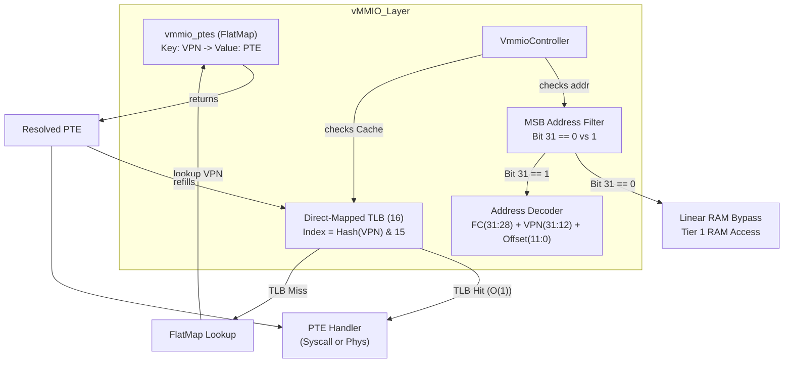
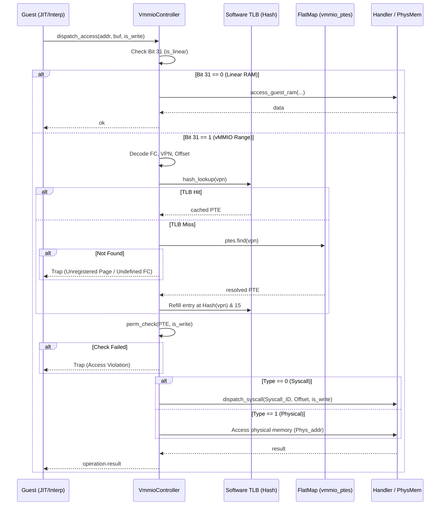
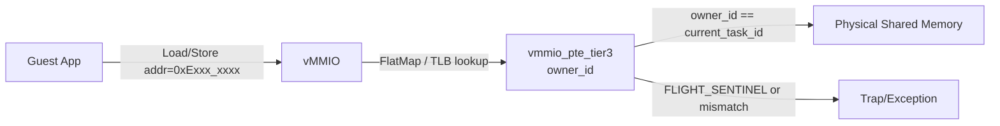

# vMMIO コンポーネント設計書
<!-- traceability: {VERIFY_FORMAL} -->

## 1. コンセプト
<!-- traceability: {META_RestrictedPhysicalAccess} {vMMIO_TrapAndEmulate} {PhysicalPassthrough} {DynamicMmap} {UnifiedAccessModel} {FastAddressCheck} {Fast_Path_GPIO} {META_FlatMapIndexed} -->
vMMIO (Virtual Memory-Mapped I/O) は、WASMゲストとホスト間の**すべてのデータ交換**を仲介する統一的なアクセス層である。物理レジスタ（GPIO等）、共有メモリ、システムコール用バッファなど、ホスト-ゲスト間境界を横切るアクセスはすべてvMMIO空間を経由する。

WASM ゲストのリニアメモリは、WebAssembly 標準仕様に準拠して **64KB ページ単位 (65,536 bytes)** を基本とする。ただし、RAM < 64KB の極小組込み環境（Cortex-M 等）に適合するため、物理実装としては **64KB に満たない部分ページ（Sub-64KB / Partial Page: 例 8KB, 16KB）** の割り当てを許容し、境界超過アクセスを即座にトラップする設計をとる。一方、ホスト/デバイス側の vMMIO 領域は **1ページ（4KB）** 単位で管理される。 `{META_RestrictedPhysicalAccess}` `{vMMIO_TrapAndEmulate}` `{PhysicalPassthrough}` `{DynamicMmap}` `{UnifiedAccessModel}`

本アーキテクチャでは、PTE（Page Table Entry）の保存にシステム全体の設計規約（`{META_FlatMapIndexed}`）に準拠した **FlatMap（`std::flat_map` / 静的ソート済み配列）** を採用し、仮想ページ番号（VPN）から PTE へのマッピングをフラットに保持・管理する。

FlatMap 単体での探索は $O(\log N)$（またはハッシュ探索）となるが、本アーキテクチャでは手前に **「ダイレクトマップ方式のソフトウェアTLB（16エントリ、完全 $O(1)$ キャッシュ）」** を配置する。JIT 実行やホットな共有メモリ操作などのクリティカルパスでは、大半のアクセス（目標 90% 以上）が TLB キャッシュヒット（$O(1)$）で高速解決されるため、FlatMap 化に伴うテーブル探索の遅延は十分に吸収・容認される。

1. **リニアアドレス空間フィルタ（高速バイパス & 64KB/部分ページ境界チェック）**:
   32ビットゲストアドレスの最上位ビット（Bit 31）が `0` の場合、そのアドレスは vMMIO 管理対象外として、Tier 1（ゲストRAM）への直接アクセスとして高速バイパス（O(1) 処理）を実行する。 `{FastAddressCheck}`
   - **完全 64KB ページ時**: ゲストアドレスが 64KB 境界内にあるかを `(addr & ~0xFFFF) == 0` のビットマスク 1 命令で超高速判定。
   - **部分ページ時（例: 8KB）**: 実際の割り当てサイズに対して `addr < guest_ram_size`（または $2^N$ アライメントマスク `(addr & ~0x1FFF) == 0`）で O(1) 判定。境界外アクセスは即座に `ERR_OUT_OF_BOUNDS` トラップを発生させる。
2. **FlatMap PTE 管理**:
   最上位ビット（Bit 31）が `1` のアドレス空間を vMMIO 領域（`0x8000_0000` – `0xFFFF_FFFF`）とする。
   - 仮想ページ番号（VPN = `raw >> 12`）をキーとして、FlatMap（`vmmio_ptes`）に PTE を格納する。
   - 動的 SHM ページや物理パススルーページをフラットに登録・管理できる。
3. **ダイレクトマップ方式ソフトウェアTLB（完全O(1)キャッシュ）**:
   ホットパス高速化のため、一発でインデックスが決まるダイレクトマッピング（ハッシュ方式、16エントリ固定サイズ）を採用する。
   - 仮想ページ番号（20-bit: `vpn = raw >> 12`）の全ビットを 4-bit（16スロット）に均等拡散する Folding XOR Hash `tlb_idx = (vpn ^ (vpn >> 4) ^ (vpn >> 8) ^ (vpn >> 12) ^ (vpn >> 16)) & 15` を算出し、TLBに一撃でアクセスする。ヒット時は権限チェックを通過した後に即時実行する。 `{META_RestrictedPhysicalAccess}`
   - **全ビット拡散**: FC[31:28] や中間ページ番号ビット、下位ページ番号ビットのすべてが 4-bit 幅で折り畳まれるため、FC 間やページ番号の変動に対して TLB スロットが均等に分散する。

セキュリティモデルは**PTEに埋め込まれた権限フィールドが唯一のゲート**である。アクセス権限は PTE に保持され、ルックアップと権限チェックを1パスで完結させる。アクセス特性に応じてセキュリティゲートを以下の3層に階層化する。 `{META_RestrictedPhysicalAccess}`

1. **Tier 1 (ゲストRAM)**: ゲスト専用RAM領域（Bit 31 == 0）。コンパイル時または実行時の 64KB マスクおよび部分ページ境界チェック（`FastAddressCheck`）のみで高速処理。
2. **Tier 2 (静的vMMIO, FC=12)**: コンパイル時にアドレスが確定するコアデバイス（SYSCTL, IPCR, VDMA等）。アドレス `0xC000_0000` は FC=12 に位置する。JIT生成時に許可チェックを行い、許可済みならネイティブコードに直接デバイスキーを埋め込む。
3. **Tier 3 (動的vMMIO, FC=14-15)**: SHM（FC=14, `0xE000_0000`）、PASSTHROUGH（FC=15, `0xF000_0000`）領域のアクセス。TLB または FlatMap を経由して PTE を解決し、エントリの権限フィールドで可否を判定する。

IPC経由のデータ交換は行わない — GPIOのようなsub-µs応答が必要な周辺機器はIPCレイテンシに耐えられないため、このダイレクトアクセスモデルが採用されている。 `{Fast_Path_GPIO}`

## 2. アーキテクチャ分類
<!-- traceability: {META_3TierSeparation} -->
本コンポーネントは **Tier 2 (分解されたサブコンポーネント: Decomposed Subcomponent)** に属し、vSoC (`runtime_vsoc.md`) から分解された仮想MMIO・デバイスレジスタアクセスおよびメモリ空間マッピングを担当する。 `{META_3TierSeparation}`

## 3. 静的モデル

### 3.1 データ構造
<!-- traceability: {META_Static_Resolution} {META_FlatMapIndexed} -->

リソース制約上、構造体は **ROM（不変）** と **RAM（可変）** に明確に分離する。PTE は FlatMap（ソート済みキー・バリュー配列）で管理し、手前の TLB キャッシュにより高速アクセスを担保する。

| 配置 | 構造体 | 概要 |
| :--- | :--- | :--- |
| ROM | `vmmio_address` | アドレスビットフィールド定義（C++23 ヘルパー構造体、実体なし） |
| ROM/RAM | `vmmio_ptes` | 仮想ページ番号 (VPN) → 32bit PTE の FlatMap（`std::flat_map<uint32_t, uint32_t>`） |
| RAM | ソフトウェアTLB配列 | `vmmio_tlb_cache[16]` 16エントリのダイレクトマップ型高速TLBキャッシュ配列 |

- **`VmmioController`**: アドレス境界デコード、FlatMap PTE ルックアップ、TLBキャッシュ管理、動的マッピング管理を担う主要クラス。
- **`vmmio_config`**: 静的な領域定義 (`vmmio_static_region`) の不変なテーブル。 `{META_Static_Resolution}`

### 3.2 内部ブロック図
<!-- traceability: {META_Static_Resolution} -->


### 3.3 主要なクラス・構造体・配列・定数
<!-- traceability: {META_Static_Resolution} -->
vMMIO

#### アドレスフィールド定義 (vmmio_address)
<!-- traceability: {META_Static_Resolution} -->
32ビットゲストアドレスをフィールドに分割する。

| 項目名 | 機能と役割 | 備考（制約、型など） |
| :--- | :--- | :--- |
| RAM Bypass Flag | Bit 31 が 0 のときはゲストRAMアクセス（Tier 1）とし、vMMIOを高速バイパス。 | ビット[31]（1 bit） |
| Function Code | vMMIO 領域時の機能種別（FC）。`vpn >> 16` でも抽出可能。 | ビット[31:28]（4 bits）、16種別 |
| Syscall Metadata / ID | 静的デバイス・Syscall 領域（FC=12）における Syscall ID / サービス識別メタデータ。 | ビット[27:16]（12 bits: `0..4095`） |
| VPN (Virtual Page Number) | 仮想ページ番号（FC + Syscall Metadata + Page Index を包含）。FlatMap のキーおよび TLB のマッチタグ。 | ビット[31:12]（20 bits: `raw >> 12`） |
| Offset | 4KBページ内でのバイトオフセット。PTE 解決後に相対アドレスとして使用。 | ビット[11:0]（12 bits）、4KB |

**アドレスデコード + PTE アクセス擬似コード例**:
```python
class VmmioAddress:
    def __init__(self, raw: int):
        self.raw = raw & 0xFFFFFFFF
        
    def is_linear(self) -> bool:
        # 最上位ビット(Bit 31)が0ならゲストRAM
        return (self.raw & 0x80000000) == 0
        
    def fc(self) -> int:
        # Function Code: [31:28]
        return (self.raw >> 28) & 0xF

    def syscall_metadata(self) -> int:
        # Syscall Metadata / Syscall ID: [27:16]
        return (self.raw >> 16) & 0xFFF
        
    def offset(self) -> int:
        # Offset: [11:0]
        return self.raw & 0xFFF
        
    def vpn(self) -> int:
        # 20-bit Virtual Page Number (VPN) for TLB and FlatMap Key
        return self.raw >> 12

def lookup_tlb(addr: VmmioAddress) -> int:
    vpn = addr.vpn()
    # 20-bit VPN の Folding XOR Hash（全ビットを4ビット幅に拡散）
    tlb_idx = (vpn ^ (vpn >> 4) ^ (vpn >> 8) ^ (vpn >> 12) ^ (vpn >> 16)) & 15
    
    if vmmio_tlb_cache[tlb_idx]['vpn'] == vpn:
        return vmmio_tlb_cache[tlb_idx]['pte']  # TLB Hit!
        
    # TLB Miss: FlatMap ルックアップを実行
    pte = vmmio_ptes.get(vpn)
    if pte is None:
        raise Exception("UNREGISTERED_PAGE")
        
    # TLB をリフィル
    vmmio_tlb_cache[tlb_idx] = {'vpn': vpn, 'pte': pte}
    return pte

def access_vmmio(addr: VmmioAddress, is_write: bool):
    # 1. リニアアドレスフィルタ
    if addr.is_linear():
        # Tier 1 ゲストRAMアクセス（vMMIOバイパス）
        access_guest_ram(addr.raw, is_write)
        return
        
    # 2. TLB / ページテーブルルックアップ
    pte = lookup_tlb(addr)

    # 3. 権限チェック (PTE [11:8])
    is_valid = (pte >> 11) & 1
    if not is_valid:
        raise Exception("PAGE_FAULT_INVALID")

    read_allowed = (pte >> 10) & 1
    write_allowed = (pte >> 9) & 1
    if is_write and not write_allowed:
        raise Exception("ACCESS_VIOLATION_WRITE")
    if not is_write and not read_allowed:
        raise Exception("ACCESS_VIOLATION_READ")
    
    # 4. タイプ別アクセス実行
    is_passthrough = (pte >> 8) & 1
    if is_passthrough == 0:
        # Tier 2 (Static Device) - Syscall モード
        syscall_id = (addr.raw >> 16) & 0xFFF
        dispatch_syscall(syscall_id, addr.offset(), is_write)
    else:
        # Tier 3 (SHM / PASSTHROUGH) - 物理アクセスモード
        if addr.fc() == 14:
            owner_id = pte & 0xFF
            if owner_id != current_task_id:
                raise Exception("ACCESS_VIOLATION_NOT_OWNED")
                
        phys_page = (pte >> 12) & 0xFFFFF
        phys_addr = (phys_page << 12) | addr.offset()
        access_memory(phys_addr, is_write)
```

**アドレス分解の対応関係**

| アドレス範囲 | MSB | FC | 割り当て用途 |
| :--- | :--- | :--- | :--- |
| `0x0000_0000` – `0x7FFF_FFFF` | 0 | - | ゲスト RAM（WASM線形メモリ）— Tier 1 |
| `0xC000_0000` – `0xC000_FFFF` | 1 | 12 (`0xC`) | Static Devices（SYSCTL, IPCR, VDMA）— Tier 2 |
| `0xE000_0000` – `0xEFFF_FFFF` | 1 | 14 (`0xE`) | SHM（共有メモリ）— Tier 3 |
| `0xF000_0000` – `0xFFFF_FFFF` | 1 | 15 (`0xF`) | PASSTHROUGH（物理アドレス直結）— Tier 3 |

#### コントローラ群 (VmmioController)
<!-- traceability: {META_Static_Resolution} {META_FlatMapIndexed} -->
アドレスデコード・FlatMap PTE ルックアップ・TLBキャッシュ管理をカプセル化する。

| 項目名 | 機能と役割 | 備考（制約、型など） |
| :--- | :--- | :--- |
| FlatMap ページテーブル | 仮想ページ番号 (VPN) → 32bit PTE のマッピング。 | `vmmio_ptes`（`std::flat_map<uint32_t, uint32_t>`） |
| ソフトウェアTLB（グローバル） | 仮想ページ番号 (VPN) → PTE マッピングをダイレクトマップハッシュでキャッシュ。ホットパスを完全 O(1) に高速化する。 | `vmmio_tlb_cache[16]`（固定16エントリ、ハッシュ結合） |

#### 静的デバイスページテーブルエントリ (vmmio_pte_static)
<!-- traceability: {META_Static_Resolution} -->
Static Devices (Tier 2) 向け。PTE には Device Type やパーミッションフラグ、ハンドラ情報を保持する。

```
32-bit Static Device PTE:
[31:24] Reserved
[23:20] Flags (4 bits):
        [3] Type (FC に対応した値 — FC=12 では 0 = Syscall)
        [2] CACHEABLE (JIT キャッシュ可能)
        [1] WRITE_ENABLED
        [0] READ_ENABLED
[19:16] Device Type (4 bits) — {SYSCTL=0, IPCR=1, VDMA=2, ...}
[15:0]  Reserved
```

**FC=14 (SHM) エントリへの書き込みは IPCルータのみが行う。vMMIO は読み取り・チェック・実行のみ。**

#### FlatMap ページテーブル定義
<!-- traceability: {META_FlatMapIndexed} {vMMIO_Isolation} -->
システム全体の共通ポリシー（`{META_FlatMapIndexed}`）に準拠し、PTE の保存には `std::flat_map<uint32_t, uint32_t>`（キー: VPN = `raw >> 12`、値: 32bit PTE）を採用する。 `{vMMIO_Isolation}`

```cpp
// FlatMap ページテーブル定義 (C++23)
using VmmioPteMap = std::flat_map<uint32_t, uint32_t>;
VmmioPteMap vmmio_ptes; // VPN -> PTE
```

#### ハンドラ定義 (vmmio_handler)
読み書きアクセス発生時に呼び出される関数の共通インターフェイス。

| 項目名 | 機能と役割 | 備考（制約、型など） |
| :--- | :--- | :--- |
| アクセス形式定義 | 相対オフセットとデータ列（可変バイナリビュー）を引数に取る関数の形式 | `status(offset, span, is_write)` |

## 4. 動的モデル

### 4.1 アルゴリズム: アクセスディスパッチ

ゲストのアドレスアクセスは以下のロジックで解決される。



#### vMMIO フルセット・コンセプトコード

FlatMap ページテーブル、ダイレクトマップ
ソフトウェアTLB、および PTE 権限・所有権検査を含む実行可能なリファレンス実装は
[`concepts/vmmio_concept.py`](concepts/vmmio_concept.py) を正本とする。
仕様書側に複製は置かない（二重管理を避けるため）。

### 4.2 アルゴリズム: 仮想DMA (VDMA)
<!-- traceability: {VDMA} -->
ゲストリニアメモリと vMMIO 空間（または他のメモリ領域）間の高速転送を実現する。 `{VDMA}`

**アクセス方式**: 純粋MMIOトラップ。直接vMMIOアドレスにアクセス可能なゲストはVDMAレジスタへ直接書き込み、アクセス不可なゲスト言語は `fireball_call(VDMA_START)` 経由でホストが代理実行。

1. **転送設定**: ゲストが `REG_VDMA_SRC`, `REG_VDMA_DST`, `REG_VDMA_COUNT` にパラメータを書き込む。
2. **トリガー**: `REG_VDMA_CTRL` の `START` ビットを `1` に書き込む。
3. **実行**: 
   - vMMIO ハンドラが物理アドレスを解決（境界チェックを適用）。
   - `std::memcpy` または HAL経由のDMAを用いて一括転送を実行。
4. **完了**: 転送完了後、必要に応じてゲストに仮想割り込み（`IRQ_VDMA_DONE`）を通知する。


### 4.3 仮想デバイスマップ
<!-- traceability: {VDMA} -->
各領域は 4KB 単位で割り当てられる。`vMMIO_BASE = 0x8000_0000` 以上の領域を対象とする。

| アドレス範囲 | FC | デバイス名 | 説明 |
|:---| :--- | :--- | :--- |
| `0xC000_0000` | `12` (`0xC`) | **SYSCTL** | システム制御（Yield, Halt, Syscall等） |
| `0xC000_1000` | `12` (`0xC`) | **IPCR** | IPCルータ連携レジスタ |
| `0xC000_2000` | `12` (`0xC`) | **VDMA** `{VDMA}` | 仮想DMA（バルク転送） |
| `0xE000_0000` – `0xEFFF_FFFF` | `14` (`0xE`) | **SHM** | 共有メモリ（1領域=1ページ） |
| `0xF000_0000` – `0xFFFF_FFFF` | `15` (`0xF`) | **PASSTHROUGH** | 物理アドレス直結 |

PASSTHROUGH アドレス変換:
`物理アドレス = pte.phys_page << 12 | Offset`

### 4.4 SYSCTL レジスタ詳細 (FC=12)
<!-- traceability: {VDMA} -->
| オフセット | レジスタ名 | R/W | 説明 |
| :--- | :--- | :--- | :--- |
| `0x00` | `REG_SYS_CONTROL` | W | `1`: Reset, `2`: Yield, `3`: Halt, `4`: Syscall |
| `0x04` | `REG_SYS_STATUS` | R | システム状態フラグ |
| `0x08` | `REG_IRQ_FLAGS` | R/W | 仮想割り込みフラグ |
| `0x10` | `REG_SYSCALL_ID` | R/W | サービスID |
| `0x14` | `REG_SYSCALL_CMD` | R/W | コマンドID |
| `0x18` | `REG_SYSCALL_ARG0` | R/W | 第1引数 / 戻り値 |
| `0x1C` | `REG_SYSCALL_ARG1` | R/W | 第2引数 |
| `0x20` | `REG_SYSCALL_ARG2` | R/W | 第3引数 |
| `0x24` | `REG_SYSCALL_ARG3` | R/W | 第4引数 |
| `0x28` | `REG_SYSCALL_ARG4` | R/W | 第5引数 |
| `0x2C` | `REG_SYSCALL_ARG5` | R/W | 第6引数 |

### 4.5 VDMA レジスタ詳細 (FC=12)
<!-- traceability: {VDMA} -->
| オフセット | レジスタ名 | R/W | 説明 |
| :--- | :--- | :--- | :--- |
| `0x00` | `REG_VDMA_SRC` | R/W | 転送元アドレス |
| `0x04` | `REG_VDMA_DST` | R/W | 転送先アドレス |
| `0x08` | `REG_VDMA_COUNT` | R/W | 転送バイト数 |
| `0x0C` | `REG_VDMA_CTRL` | W | 制御（Bit0: START） |

`REG_VDMA_SRC` / `REG_VDMA_DST` に指定できるアドレスはゲストRAM（Tier 1）および vMMIO空間（FC=14/15）。SHMアドレス（FC=14）を転送先/元に指定した場合、VDMAハンドラが `dispatch_access` と同一の権限チェック（`owner_id` 検証を含む）を実施する。

### 4.6 共有メモリマッピング (FC=14)
<!-- traceability: {OwnershipTransfer} -->
SHM へのアクセスは **IPCルータ経由でのみ許可される**。ゲストは IPCルータからハンドルを受け取ることによってのみ FC=14 アドレス空間にアクセスできる。SHM の所有権状態は IPCルータが一元管理し（`ipc_router.md` §4.1 所有権移譲モデル準拠）、vMMIO はその状態を執行するのみ。 `{OwnershipTransfer}`

- **SHMハンドル**: `(page_idx << 8) | slot_idx` の識別値。
- **アクセスアドレス**: `0xE000_0000 | (page_idx << 12) | offset_in_page`。



#### ライフサイクル（ipc_router.md §4.1 に従属）
<!-- traceability: {OwnershipTransfer} -->

1. **Alloc**: COOS が SHM 物理ページを確保し、IPCルータに登録する。`owner_id` = 送信タスクID。
2. **Revoke**: IPCルータが送信タスクの権限を無効化する。`owner_id` を `FLIGHT_SENTINEL` にセットし、TLB の該当エントリを無効化する。
3. **Enqueue**: IPCルータが受信チャネルへハンドルを含むメッセージを Push する。キュー満杯時は Rollback し、`owner_id` を送信タスクIDに復元する。
4. **Grant**: 受信タスクがデキューした瞬間、IPCルータが `owner_id` を受信タスクIDにセットする。
5. **Drop**: 受信先が Kill された場合、Drop Handler が IPCルータに通知し、`owner_id` をクリアしてリソースを回収する。

### 4.7 仮想割り込みマッピング
<!-- traceability: {META_ConfigurableSystem} -->
物理割り込みから仮想割り込みIDへのマッピングは**静的1:1**とし、別コンフィグ（`irq_mapping_config`）で定義される。 `{META_ConfigurableSystem}`

- **マッピング方式**: 物理IRQ 1: 仮想IRQ 1。集約しない。
- **ゲスト側確認方式**: ポーリング。ゲストがstep再開時に `REG_IRQ_FLAGS` をチェック。
- **コールバック登録**: Phase1+で検討。
- **設定ファイル**: `vsoc_config` とは分離。`irq_mapping_config` として独立管理。

@see `system_syscall.md` §8.1

### 4.8 ソフトウェアTLB
<!-- traceability: {VDMA} {OwnershipTransfer} {META_ConfigurableSystem} -->
Tier 3 アクセス（FC=14/15）において毎回 FlatMap の二分探索を走らせる遅延を排除するため、仮想ページ番号（VPN = `raw >> 12`）に基づくマッピングを16エントリのダイレクトマップキャッシュに保持する。

- **キャッシュ構造**: ダイレクトマップ構造（Direct-Mapped Hashed Structure）
  - キー（VPN）: `raw >> 12`（20-bit）
  - HASH / インデックス計算: 20-bit VPN の Folding XOR Hash `tlb_idx = (vpn ^ (vpn >> 4) ^ (vpn >> 8) ^ (vpn >> 12) ^ (vpn >> 16)) & 15` (16エントリサイズ、全20ビットを拡散)
  - 値 (Value): 32-bit PTE エントリ
  
- **キャッシュ更新 & 押し出し (Eviction & Refill)**:
  TLBミス時に FlatMap から取得した PTE を `vmmio_tlb_cache[tlb_idx]` に上書き（同一ハッシュに別のアドレスが割り当てられた場合は以前のエントリを自動無効化・上書きする完全O(1)方式）。
  
- **権限チェック**:
  TLBは探索ルートのスキップのみをキャッシュする。権限の検証（PTEの読み書きパーミッション、Owner IDなど）は、TLBヒット時も含めて毎回インラインで実施され、TLBヒットが安全性の検査をバイパスすることはない。

## 5. インターフェイス定義

### 5.1 公開API
外部から利用可能なオブジェクト指向APIを定義する。


#### フック登録 (`register-hook`)

<!-- traceability: {vMMIO_TrapAndEmulate} -->

| 項目 | 内容 |
| :--- | :--- |
| 機能概要 | 既に定義（ROM）されている領域に対して、ホスト側のハンドラの実装アドレスを紐づける。 |
| シグネチャ | `register-hook(hook-id: hook-category, handler-addr: mem-address) -> operation-result` |
| 引数と役割 | `hook-id`: 対象の領域カテゴリ（FC/ページ番号等の組み合わせを識別）<br>`handler-addr`: ハンドラ関数の物理アドレス |
| 事前条件 | `hook-id` が `fireball.wit` で定義された有効なIDであること。未登録であること。 |
| 事後条件 | フックレジストリにエントリが追加される。 |
| 不変条件 | アドレスマップ定義自体は変更されない。 |
| エラー時の挙動 | 無効なIDの場合はエラーを返す。二重登録は拒否する。 |
| 期待する結果 | 正常：フックが登録され、以降のアクセスで呼び出される。 |

#### アクセスディスパッチ (`dispatch-access`)

| 項目 | 内容 |
| :--- | :--- |
| 機能概要 | vSoC 実行エンジンからトラップされたメモリアクセスを高速RAMバイパス判定し、vMMIOアドレスの場合はTLB及びFlatMapでPTEを解決しつつ権限検証の上でハンドラや物理レイヤへディスパッチする。 |
| シグネチャ | `dispatch-access(addr: mem-address, buffer: list<u8>, is-write: bool) -> operation-result` |
| 引数と役割 | `addr`: アクセス先アドレス（vmmio_address として分解）<br>`buffer`: データバッファ (read時out, write時in)<br>`is-write`: 書き込みフラグ |
| 事前条件 | リニアRAMまたは vMMIO領域（制限空間内）への正常な境界内アクセスであること。 |
| 事後条件 | 許可アドレス：ハンドラ実行完了 / メモリアクセス完了。非許可アドレス：アクセス違反トラップ。 |
| 不変条件 | アドレスデコードおよびルックアップの結果は決定論的である。 |
| エラー時の挙動 | 非許可アドレス、未登録ハンドラへのアクセスはトラップを発生させる。 |
| 期待する結果 | 正常：エントリの権限チェックを通過し、登録された物理マッピングまたはハンドラが実行され、結果がゲストに反映される。 |
| 補足 | Software TLB ヒット時は FlatMap の二分探索を省略する。 |

## 6. 制約達成の方策

### 6.1 性能制約と方策
<!-- traceability: {META_ConfigurableSystem} {FastAddressCheck} {vMMIO_TLB} -->
- **目標**: MMIOアクセスのオーバーヘッドを最小化する。
- **方策1**: `{META_ConfigurableSystem}` コアデバイス（SYSCTL等）をFC=12に配置し、配列/ハッシュ参照のみで即時解決できるようにする。
- **方策2**: `{FastAddressCheck}` アドレス空間を RAM Bypass（最上位ビット=0）と vMMIO領域（最上位ビット=1）に分割し、探索とデコードのホットパス探索コストを削減する。
- **方策3**: `{vMMIO_TLB}` ダイレクトマップ型 Software TLB により、Tier 3 の繰り返しアクセスを完全 O(1) で超高速キャッシュ解決する。

### 6.2 メモリ制約と方策
<!-- traceability: {META_ConfigurableSystem} {META_FlatMapIndexed} -->
- **目標**: マップ管理用のメモリを最小化する。
- **方策**: `{META_ConfigurableSystem}` `{META_FlatMapIndexed}` `std::flat_map<uint32_t, uint32_t>`（または静的ソート済み配列）によるフラットな PTE 管理に集約し、登録されたページ数に応じた最小限のメモリフットプリントを実現する。

### 6.3 安全性制約と方策
<!-- traceability: {META_RestrictedPhysicalAccess} {OwnershipTransfer} -->
- **目標**: ゲストが許可されていない物理アドレスにアクセスできないことを保証する。
- **方策**: `{META_RestrictedPhysicalAccess}` `{OwnershipTransfer}` 権限チェックを解決された PTE フラグで行い、TLBヒット時も含めてすべてのアクセスパスで必ず実行する。TLBはページテーブル探索のスキップのみを担い、権限チェックをバイパスしない。FC=14 (SHM) の所有権は IPCルータが唯一の書き込み権限を持ち、Revoke 時に該当マッピングの TLB エントリを即時無効化する。
