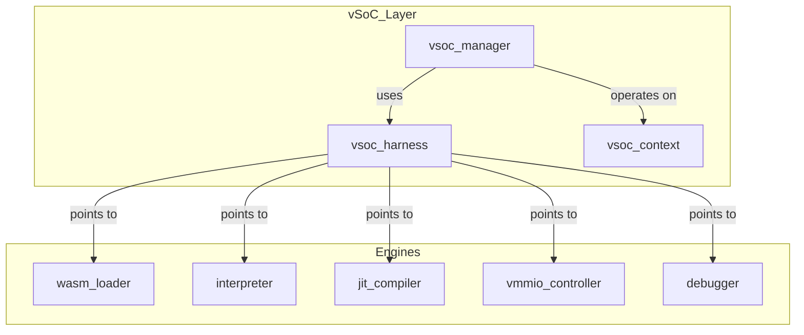
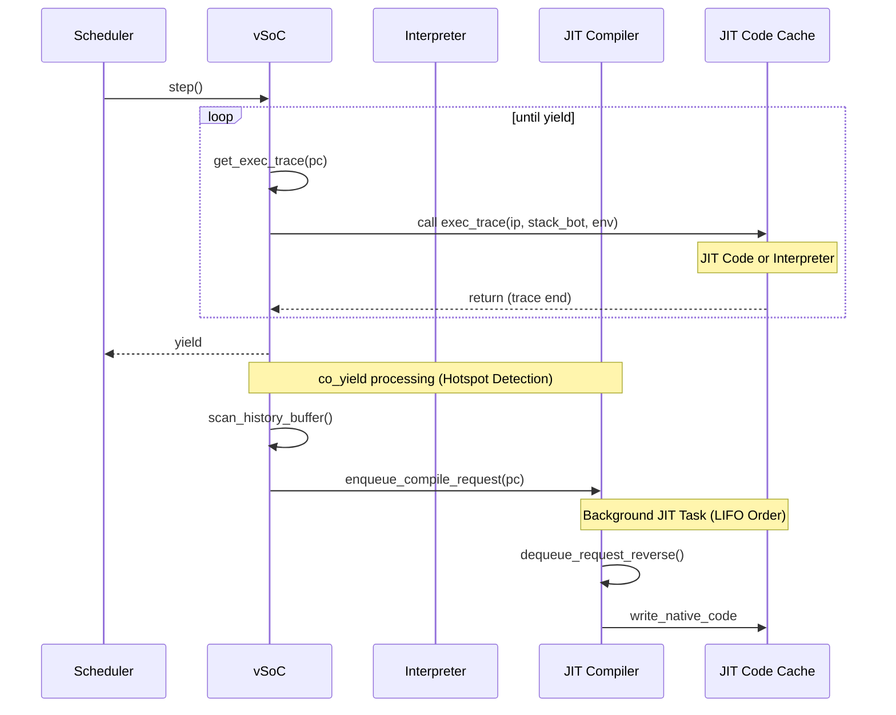

# vSoC コンポーネント設計書 {VERIFY_FORMAL} {VERIFY_LLM}
<!-- evidence:
     formal: formal/vsoc_state_model.py
     wit: wit/vsoc_runtime.wit
     concept: concepts/runtime_engine_concept.py
     test: tests/runtime_vsoc_test_spec.md
-->

## 1. コンセプト
<!-- traceability: {LowLatencyJIT} {MemoryIsolation} {META_FaultIsolation} {EnvironmentPointer} -->
vSoC (Virtual System-on-Chip) は、WASM実行環境の統合マネージャであり、Loader、Interpreter、JIT、vMMIO、Debugger を統括して実行制御を行う。各サブコンポーネントを統合する「環境」としての役割を持ち、`vsoc_runtime` を `execution_context` から参照される Environment として提供する。 `{LowLatencyJIT}` `{MemoryIsolation}` `{META_FaultIsolation}` `{EnvironmentPointer}`

## 2. アーキテクチャ分類
<!-- traceability: {META_3TierSeparation} {GLOBAL_ComponentHarness} {META_StaticDI} -->
本コンポーネントは **Tier 2 (分解されたサブコンポーネント: Decomposed Subcomponent)** に属し、WASM仮想実行環境として Loader, Interpreter (Tier 2), JIT, vMMIO, Debugger などのサブコンポーネント群を**ハーネスパターン（`vsoc_harness`）による静的依存性逆転（Static Dependency Inversion）**によって統合する。組込みベアメタル環境において仮想関数（vtable）や動的ディスパッチによる仮想化オーバーヘッドは一切容認できないため、Tier 2 の vSoC は Tier 3 具象エンジンの内部ヘッダに依存せず、ハーネスに集約された POD 関数ポインタ・インスタンスを介してゼロオーバーヘッドで制御を委譲する。 `{META_3TierSeparation}` `{GLOBAL_ComponentHarness}` `{META_StaticDI}`

## 3. 静的モデル

### 3.1 データ構造
<!-- traceability: {META_StaticDI} -->
- **`vsoc_harness`**: vSoCが依存する各種エンジン（Loader, Interpreter, JIT等）のインターフェイスを集約した構造体。 `{META_StaticDI}`
- **`vsoc_context`**: 現在の実行状態、仮想割り込み、JITキャッシュの管理状態など、可変なランタイム状態。
- **`vsoc_config`**: メモリ割り当てやJIT有効化フラグなどの不変な構成情報。

### 3.2 内部ブロック図
<!-- traceability: {META_StaticDI} -->


### 3.3 主要なクラス・構造体・配列・定数
<!-- traceability: {META_StaticDI} -->

#### vSoCハーネス（vsoc_harness）
各エンジンへのインターフェイスを集約する。PODとして扱い、メンバに末尾アンダースコアは付与しない。

| 項目名 | 機能と役割 | 備考（制約、型など） |
| :--- | :--- | :--- |
| WASMローダ | WASMモジュールのロードと解析を担うコンポーネントへの参照。 | `WasmLoader*` |
| インタープリタ | WASMバイトコードを逐次実行するエンジンへの参照。 | `Interpreter*` |
| JITコンパイラ | ホットスポットをネイティブコードに変換するエンジンへの参照。 | `JitCompiler*` |
| デバッガ | RSPプロトコルを介したデバッグ機能を提供するコンポーネントへの参照。 | `Debugger*` |
| vMMIO | 仮想的なメモリマップドI/Oを制御するコンポーネントへの参照。 | `VmmioController*` |

#### vSoCコンテキスト（vsoc_context）
vSoC全体の可変な実行時状態を保持する構造体。

| 項目名 | 機能と役割 | 備考（制約、型など） |
| :--- | :--- | :--- |
| 実行状態 | 現在のvSoCの実行状態（停止、実行中、ブレークポイント等）。 | `VsocState` 列挙型 |
| 仮想割り込みフラグ | ゲストOSまたはタスクに対する保留中の割り込みビットマップ。 | `uint32_t` |
| JITキャッシュ状態 | 現在アクティブなJITコードキャッシュの管理情報。 | `JitCacheManager` 構造体 |
| WASMモジュール参照 | 現在ロードされているWASMモジュールのインスタンスへのポインタ。 | `WasmModule*` |

#### vSoCランタイム環境（vsoc_runtime）
<!-- traceability: {ContextPointerRegister} {EnvironmentPointer} {MemoryBoundaryCheck} -->
JIT トレース実行時およびインタープリタの各命令ハンドラが最速実行ループ内で **レジスタ `R2`（`env`）** を介して直接間接参照（`[R2, #offset]`）する物理メモリ環境構造体。`execution_context`（R1）とは異なり、`vsoc_runtime` は **`memory.grow` で動的に伸長するリニアメモリの実体や、モジュール横断で共有されるグローバル変数配列など、単一の呼び出しコンテキストを超えて生存する状態** を保持する。 `{EnvironmentPointer}` `{MemoryBoundaryCheck}`

| 項目名 | 機能と役割 | 型分類 | サイズ・制約 |
| :--- | :--- | :--- | :--- |
| リニアメモリ基底 | ゲストリニアメモリ（`memory.grow` で再割当されうる）の開始アドレス | アドレス値 | 32bit符号なし (`+0x00`) |
| リニアメモリサイズ | ゲストリニアメモリの現在の有効バイト数。`{FastAddressCheck}` の境界比較（`CMP addr, mem_size; BHS __trap`）に直接使う——マスクは使わないため2の冪制約もない `{MemoryBoundaryCheck}` | バイト数 | 32bit符号なし (`+0x04`) |
| グローバル変数基底 | WASM `global` 配列（4バイト単位でインデックス付け）の開始アドレス | アドレス値 | 32bit符号なし (`+0x08`) |

`vsoc_runtime` は計12バイト（`+0x00`〜`+0x0B`）。正本は [`wit/vsoc_runtime.wit`](wit/vsoc_runtime.wit)、物理配置は `{VsocRuntime_Layout}`。

> [!NOTE]
> **構造体の役割分離**:
> - **`vsoc_runtime` (R2: env)**: JIT トレースおよびインタープリタハンドラが実行ループ内で直接参照する**極小の物理実行環境（12バイト）**。最速パス上でのレジスタ間接アクセス（`[R2, #0x00]`〜`#0x08`）に特化。
> - **`vsoc_context`**: タスク全体のライフサイクル、仮想割り込みフラグ、WASM モジュール構造体へのポインタを管理する**上位マネージャ層の制御構造体**。実行ループ外でのタスク切り替えやデバッガ連携時に参照される。両者は明確に役割分離して維持する。

#### vSoC構成（vsoc_config）
<!-- traceability: {META_ConfigurableSystem} -->
vSoCの動作パラメータを定義する。 `{META_ConfigurableSystem}`

| 項目名 | 機能と役割 | 備考（制約、型など） |
| :--- | :--- | :--- |
| JIT有効化フラグ | システム全体でJITコンパイル機能を有効にするかどうかを決定する。 | ブール値 (`FB_CONF_JIT_ENABLED`) |
| コードキャッシュサイズ | 生成されたネイティブコードを保存するためのメモリ領域の大きさ（2KB×3面 = 6144B）。 | `FB_CONF_JIT_CACHE_SIZE` |
| RAM開始アドレス | ゲストから見たRAMの仮想アドレス空間上の開始位置。 | `0x0000_0000` (Bit 31 == 0) |
| RAM容量 | ゲストに割り当てられるRAMの有効バイト数（64KBまたは8KB等の部分ページ）。 | `FB_CONF_GUEST_RAM_SIZE` |
| vMMIO基点アドレス | 仮想デバイスレジスタおよび共有メモリ空間の開始位置（2段階ダイレクトデコード）。 | `0x8000_0000` (Bit 31 == 1) |
| パススルー基点アドレス | ゲスト仮想 PASSTHROUGH 領域（FC=15, `0xF000_0000`〜`0xFFFF_FFFF`）がマッピングされるホスト実物理ペリフェラル空間の開始アドレス。`物理addr = passthrough_base + (vmmio_addr - 0xF000_0000)`。 | `FB_CONF_VSOC_PASSTHROUGH_BASE` (Cortex-M デフォルト: `0x4000_0000`) |

## 4. 動的モデル

### 4.1 アルゴリズム
<!-- traceability: {ThreadedInterpreter} {JIT_CopyAndPatch} {Challenge_ApproximateYield} {JIT_Safepoint} {Debugger_Jit_Flush} {ContextPointerRegister} -->
- **実行エンジン委譲 (exec_trace)**: vSoCは `step()` で現在のPCに対応する `exec_trace`（`void __fastcall (const uint8_t* ip, execution_context* stack_bot, vsoc_runtime* env, uint32_t* local_base)`）を呼び出す。 `exec_trace` はインタープリタのディスパッチャまたはJITコードを指し、`__fastcall` 呼び出し規約（R0=IP, R1=stack_bot, R2=ENV, R3=local_base）によってレジスタ上で高速に実行エンジンへ制御を委譲する。呼び出し側は実行エンジンの種別を意識する必要がない。 `{ThreadedInterpreter}` `{JIT_CopyAndPatch}` `{ContextPointerRegister}`
- **概算Yield**: 監視対象の `yield_threshold` を基準に `co_yield` を発行する。閾値のスコープ（タスク単位/グローバル）、精度キャリブレーション、スターベーション対策は `{Challenge_ApproximateYield}` の定義どおり「検討中」の未解決課題である。 `{Challenge_ApproximateYield}`
- **デバッグ連携**: `step()` 前後で Debugger を呼び出し、HAL層からのコマンドを処理する。
- **JIT Safepoint (非同期割込対応)**: `{JIT_Safepoint}`
    - JIT生成されるネイティブコードのループバック点（バックエッジ）に、ソフトウェアフラグ（またはタイマ割込状況）をチェックし、必要に応じて `executor_loop` へ強制フォールバックするフック（Safepoint）を埋め込む。これにより、JIT実行中の非同期ブレークポイント（Ctrl+C等）への応答性を担保する。
- **デバッガ介入時キャッシュ一貫性 (Cache Flush)**: `{Debugger_Jit_Flush}`
    - デバッガがメモリ上の変数を書き換えた場合、該当タスクに関連するJITキャッシュ（Active/Warm/Oldest 全バンク）をすべて無効化（Flush）し、インタープリタ実行からやり直すことで整合性を維持する。

### 4.2 状態遷移図 (SysML SMD: vSoC Engine ライフサイクル)
<!-- traceability: {ThreadedInterpreter} {JIT_CopyAndPatch} {Challenge_ApproximateYield} {JIT_Safepoint} {Debugger_Jit_Flush} -->

vSoC Engine の実行制御と JIT/Interpreter 切り替えの状態遷移を以下に示す。


**vSoC Engine 状態の説明:**

| 状態 | 説明 | 主要アクション |
| :--- | :--- | :--- |
| **Uninitialized** | 初期化前 | - |
| **Loading** | WASM モジュール読み込み・リンク中 | パーサ実行、セクション検証 |
| **Ready** | 実行準備完了 | `step()` で Interpreter または JIT へ遷移 |
| **InterpreterRun** | インタープリタによるバイトコード逐次実行 | オペコード実行、ホットスポット検出 |
| **JitRun** | JIT生成ネイティブコード実行 | ネイティブコード直接実行、Safepoint チェック |
| **SafepointCheck** | JIT 実行中の割り込み確認ポイント | フラグチェック、中断判定 |
| **Debugging** | デバッガによる停止中 | メモリ検査、変数書き換え、キャッシュ flush |
| **Error** | エラー発生（復帰可能） | トラップハンドラ実行、状態リセット |
| **Idle** | 停止・待機状態 | スケジューラに制御戻す |

**遷移の詳細:**

| 遷移 | トリガー | 条件 | アクション | 次状態 |
| :--- | :--- | :--- | :--- | :--- |
| Load → Ready | load_ok() | モジュール有効 | リンク完了、コンテキスト初期化 | Ready |
| Ready → InterpreterRun | step(pc) | exec_trace = interpreter | PC 登録、実行開始 | InterpreterRun |
| Ready → JitRun | step(pc) | exec_trace = compiled code | ネイティブコード実行開始 | JitRun |
| InterpreterRun → Ready | yield() [threshold] | 実行トレース数超過 | ホットスポット検出、JIT キュー投入 | Ready |
| JitRun → SafepointCheck | [loop back edge] | JIT ループバックエッジ | 割り込みフラグ確認 | SafepointCheck |
| SafepointCheck → JitRun | [no interrupt] | フラグなし | JIT 実行継続 | JitRun |
| SafepointCheck → Ready | [interrupt pending] | 割り込みフラグ有り | インタープリタ フォールバック | Ready |
| (any) → Debugging | breakpoint [debugger] | RSP ブレークポイント | デバッガコマンド待ち | Debugging |
| Debugging → InterpreterRun | resume(interp) | 再開要求（インタープリタ） | JIT キャッシュ flush、PC 保持 | InterpreterRun |
| (any) → Error | trap() | ページフォルト / 不正オペコード | トラップハンドラ実行 | Error |
| Error → Ready | recover() | リカバリ可能 | コンテキストリセット | Ready |

**重要な設計ポイント:**

- **JIT Safepoint**: ネイティブコード実行中も、ループバックエッジでソフトウェアフラグをチェックし、非同期割り込みに応答できる仕組み
- **Debugger Flush**: デバッガがメモリを変更した場合、関連するすべての JIT キャッシュを無効化して整合性を保証
- **Approximate Yield**: exec_trace のトレース数をカウントして概算的にタスク切り替えを判定

### 4.2.1 Safepoint と JIT キャッシュ協調モデル
<!-- traceability: {JIT_Safepoint} {Challenge_JITCacheEfficiency} {Debugger_Jit_Flush} -->

JIT実行中の非同期割り込み対応とキャッシュ一貫性を保証するため、以下の協調メカニズムを採用する。

#### Safepoint の動作メカニズム
<!-- traceability: {JIT_Safepoint} {Challenge_InterruptSafety} -->

JIT生成ネイティブコードには、以下のポイントで割り込みチェック（Safepoint）を埋め込む：

| Safepoint位置 | 目的 | 実装 | オーバーヘッド |
| :--- | :--- | :--- | :--- |
| **ループバックエッジ** | 無限ループ検出と割り込み確認 | フラグ確認 + 条件分岐 | ~2-3 機械語命令 |
| **関数呼び出し前** | 外部サービス呼び出し時の割り込み確認 | 割り込みフラグチェック | ~1-2 命令 |
| **メモリアクセス後** | キャッシュ無効化（debugger flush）の確認 | 世代番号（generation cookie）検証 | ~1 命令 |

**フラグの構造:**
```
┌─────────────────────────────────────────┐
│ vsoc_context.interrupt_flags (32-bit)   │
├────────────────────────────────────────┤
│ [0]: Async Break Request (Ctrl+C等)    │
│ [1]: Debugger Intervention              │
│ [2]: JIT Cache Invalid (Flush)          │
│ [3]: Yield Request (Task Switch)        │
│ [4-31]: Reserved                        │
└────────────────────────────────────────┘
```

#### Active/Warm/Oldest 3面マルチバッファとキャッシュローテーション
<!-- traceability: {Challenge_JITCacheEfficiency} {LowLatencyJIT} -->

JIT コードキャッシュ（合計 6KB `FB_CONF_JIT_CACHE_SIZE`）を 2KB x 3 のバッファ（Active / Warm / Oldest）に分割し、Oldest-Only Promotion パターンを採用：

| フェーズ | 状態 | 説明 | アクション |
| :--- | :--- | :--- | :--- |
| **Normal (JitRun)** | Active が書込・実行中、Warm/Oldest が観測 | 新規 JIT コンパイルが Active へ追加 | 既存コードは保持 |
| **co_yield (Rotation)** | 世代ローテーション | Active → Warm → Oldest へスライド | 中間 Warm では無償観測 |
| **Oldest Evaluation** | 最古バッファ到達判定 | 破棄直前の Oldest で Hot コードのみ新 Active へ昇格 | Cold コードは Purge 破棄 |
| **Debugger Flush** | Interrupt Flag[2] 検出 | デバッガメモリ変更を検知 | 全バッファ（Active/Warm/Oldest）を無効化 |

**メモリレイアウト:**
```
JIT Code Cache (6 KB total: FB_CONF_JIT_CACHE_SIZE)
┌──────────────────────┐
│  Active Buffer Bank  │  2 KB (Bank 0: current compiling & execution)
│  - Generation[0]     │  - New hot traces
├──────────────────────┤
│  Warm Buffer Bank    │  2 KB (Bank 1: observation window)
│  - Generation[1]     │  - Retained without copying
├──────────────────────┤
│  Oldest Buffer Bank  │  2 KB (Bank 2: oldest buffer)
│  - Generation[2]     │  - Promoted if hot, else purged
└──────────────────────┘
```

#### Debugger 介入時のキャッシュ一貫性
<!-- traceability: {Debugger_Jit_Flush} {Debug_Integrated} -->

デバッガがゲストメモリを変更した場合の処理フロー：

1. **Debugger Writes Memory**: `gdb_write_memory(addr, data)` → `fireball::vsoc::request_debugger_interrupt(ctx)` を呼び出し、内部のデバッガ割り込みフラグをセット
2. **Safepoint Detection**: JIT実行の SafepointCheck で `fireball::vsoc::has_debugger_interrupt(ctx)` を検査
3. **Cache Flush Trigger**: フラグ検出時、即座に以下を実行：
   - 全バッファ（Active/Warm/Oldest）のメタデータを破棄（generation cookie インクリメント）
   - 登録済みの exec_trace ポインタを無効化
   - 次回 `step()` で Interpreter モードへフォールバック
4. **Resume**: デバッガが再開コマンドを発行 → `InterpreterRun` 状態に遷移 → 新規JITコンパイルの準備開始

#### 形式検証 (pyModelChecking) 検証対象

本節で述べた Safepoint 協調とキャッシュ一貫性の性質は、6.1 の表に列挙したプロパティとして形式検証されている。個々のモデルファイルとプロパティ名の対応は **[6.1 検証対象の不変条件](#61-検証対象の不変条件)** を正本とする。

### 4.3 内部シーケンス
<!-- traceability: {ThreadedInterpreter} {JIT_CopyAndPatch} {Challenge_ApproximateYield} {JIT_Safepoint} {Debugger_Jit_Flush} -->
#### WASM実行およびJIT遷移シーケンス

<!-- traceability: {JIT_CopyAndPatch} {Interpreter_LazyJITSwitch} {Challenge_JITCacheEfficiency} -->


#### マルチモジュール動的リンクシーケンス
<!-- traceability: {MultiModule_Support} -->
複数のWASMモジュール間の依存関係を解決し、関数ポインタを接続する。 `{MultiModule_Support}`


## 5. インターフェイス定義

### 5.1 公開API
外部から利用可能なオブジェクト指向APIを定義する。

#### 準備（prepare）
| 項目 | 内容 |
| :--- | :--- |
| 機能概要 | 指定されたWASMバイナリデータを読み込み、実行準備を完了させる。 |
| シグネチャ | `prepare(wasm: binary-view) -> result<wasm-module-view, sys-recovery-strategy>` |
| 引数 | `ctx`: vsoc_context, `wasm`: バイナリデータとサイズ |
| 期待する結果 | 正常：モジュールがロードされ、内部状態がReadyになる。異常：検証失敗時等のエラー。 |
| 事前条件 | システムが初期化済みであること。 |
| 事後条件 | `ctx->module_view` が構築され、実行可能状態になる。 |
| 不変条件 | 既存の実行コンテキストが破壊されないこと。 |
| エラー時の挙動 | 不正なバイナリの場合はロードを中断し、エラー値を返す。 |
| 補足 | ROM上のデータを直接参照するため、RAMへのコピーは発生しない。 |

#### ステップ実行（step）
<!-- traceability: {META_RecoveryStrategy} -->
| 項目 | 内容 |
| :--- | :--- |
| 機能概要 | ゲストのプログラム実行を再開し、コルーチンの `yield` またはトラップが発生するまで継続する。 |
| シグネチャ | `step() -> result<execution-state-category, sys-recovery-strategy>` |
| 引数 | `ctx`: vsoc_context, `harness`: vsoc_harness |
| 期待する結果 | 正常：一定期間の実行後に制御が戻る。異常：トラップ発生。 |
| 事前条件 | 状態が Ready であること。 |
| 事後条件 | PCやレジスタ状態が更新されていること。 |
| 不変条件 | ゲストRAMの境界外へのアクセスが発生しないこと。 |
| エラー時の挙動 | トラップ（例外）発生時は、トラップ要因を保持してエラーを返す。 `{META_RecoveryStrategy}` |
| 補足 | 内部的にはインタープリタとJITコードを透過的に切り替えて実行する。 |

#### `notify-interrupt`
<!-- traceability: {META_RecoveryStrategy} -->
| 項目 | 内容 |
| :--- | :--- |
| 機能概要 | 物理割り込み等の外部イベントをゲストOS/アプリに通知するための仮想フラグを設定する。 |
| シグネチャ | `notify-interrupt(irq-id: u32) -> void` |
| 引数 | `ctx`: vsoc_context, `irq-id`: 識別子 |
| 期待する結果 | 所定のアドレス（SYSCTLレジスタ）にフラグが反映される。 |
| 事前条件 | なし。 |
| 事後条件 | 公開APIを介して、対象の仮想割り込みフラグがセットされる。 |
| 不変条件 | 他の実行状態に副作用を及ぼさないこと。 |
| エラー時の挙動 | 無効なIDの場合は無視される。 |
| 補足 | ISRから呼び出されることを想定し、排他制御を考慮する。 |

#### `register-hook`
<!-- traceability: {vMMIO_TrapAndEmulate} -->
本APIは vSoC 層の公開ラッパーであり、`harness.vmmio`（vMMIOコントローラへの参照）越しに [`runtime_vmmio.md`](runtime_vmmio.md) の同名APIへそのまま転送する。実際のレジストリ登録・不変条件・エラー処理は vmmio 層の `register-hook`（`vmmio_context` を引数に取る）が正本であり、本節はその薄いラッパーの引数のみを記述する。

| 項目 | 内容 |
| :--- | :--- |
| 機能概要 | ゲストの特定のメモリ範囲（hook_idで識別）へのアクセスに対し、ホスト側の関数をプラガブルに登録する。`harness.vmmio` へ転送するのみ。 |
| シグネチャ | `register-hook(hook-id: hook-category, handler-addr: mem-address) -> operation-result` |
| 引数 | `harness`: vsoc_harness（`harness.vmmio` を通じて転送先を解決）、`hook-id`: 領域識別子, `handler-addr`: ハンドラアドレス |
| 期待する結果 | 指定範囲へのアクセス時に登録したコールバックが実行されるようになる。 |
| 補足 | 転送先の事前条件・事後条件・不変条件・エラー処理は [`runtime_vmmio.md`](runtime_vmmio.md) の `register-hook` を正本とする。 `{vMMIO_TrapAndEmulate}` |

### 5.2 ネイティブAPI エクスポート
<!-- traceability: {NativeAPI_Export} -->

WASMゲストからホストサービスを呼び出すための最小限のインターフェイスを提供する。 `{NativeAPI_Export}`

Fireballでは、ホスト側のコードサイズを極限まで削減するため、標準的なWASIの実装をホストから排除し、単一のトラップ命令とvMMIOレジスタによるサービス提供を行う。

- **トラップ命令**: `uint32_t fireball_call(uint32_t service_id, uint32_t command_id, uint32_t arg0, uint32_t arg1, ... uint32_t arg5)`
  - ゲストはこの関数をインポートし、サービスIDを指定して呼び出す。
  - **この2つは同一階層の代替手段ではなく、層が異なる**。上記シグネチャはゲストから見た WASM インポート関数の ABI であり、ゲストは通常の関数呼び出しとして引数を渡す。トラップを受けたホスト側が、その引数を vMMIO の SYSCALL レジスタ群（`REG_SYSCALL_ARG0` 以降、`runtime_vmmio.md` を正本とする）へ転記してサービスへ渡す。戻り値は逆順に `REG_SYSCALL_ARG0` から読み出してゲストへ返る。ゲスト側コードが vMMIO レジスタを直接操作する必要はない。
- **WASI互換性**: ゲスト側で `wasi-libc` と Fireball専用の Shim ライブラリをリンクすることで実現する。

### 5.3 マルチモジュール対応
<!-- traceability: {MultiModule_Support} -->
複数のWASMモジュール間の依存関係を解決し、動的にリンクする。 `{MultiModule_Support}`

- **Module Registry**: ロード済みのモジュールを名前で管理する。
- **Dynamic Linking**: インポートセクションに基づき、他モジュールのエクスポートを解決する。

### 5.4 URI/IPCインターフェイス
<!-- traceability: {META_RecoveryStrategy} {vMMIO_TrapAndEmulate} {NativeAPI_Export} {MultiModule_Support} -->
- **URI**: `fireball://vsoc/control/<instance_id>`
- **メッセージ形式**: 実行制御、状態取得用のKey-Valueプロトコル。詳細定義は IPCルータの仕様に準ずる。

### 5.5 関連コンポーネントとの連携
<!-- traceability: {META_RecoveryStrategy} {vMMIO_TrapAndEmulate} {NativeAPI_Export} {MultiModule_Support} -->
| コンポーネント | 連携内容 | 参照データ構造 |
| :--- | :--- | :--- |
| **Interpreter** | インタープリタ実行の委譲とホットスポット履歴の取得 | `interpreter`, 履歴バッファ |
| **JIT Compiler** | トレース単位のコンパイル要求とJITコードキャッシュ管理 | `jit_compiler`, `JIT Code Cache` |
| **Wasm Loader** | モジュールロードと `module_view` の管理 | `loader`, `module_view` |
| **Debugger** | デバッグコマンドの処理と実行状態の同期 | `debugger`, `debug_command_queue` |

## 6. 形式検証（pyModelChecking / 直交表）

### 6.1 検証対象の不変条件

<!-- traceability: {JIT_Safepoint} {Challenge_JITCacheEfficiency} {Debugger_Jit_Flush} {GLOBAL_InterruptWakeup} -->

各不変条件は、下表のモデルファイル内の**プロパティ名で特定できる形**で証明されている。すべてのプロパティは `build_model(guards=False)` による変異検査を伴い、「ガードを外すと違反状態が到達可能になる」ことを示すことで、空虚な真（vacuous truth）でないことを保証する。

| 不変条件 | 説明 | 検証モデル / プロパティ名 |
| :--- | :--- | :--- |
| **Safepoint応答性** | 実行中のタスクは必ず Safepoint に到達し、割り込みフラグが検出されること。`{JIT_Safepoint}` | [`formal/vsoc_state_model.py`](formal/vsoc_state_model.py) `safepoint_reachable_definitively` |
| **IRQ/JIT レース不在** | Safepoint 同期を経ずに JIT ネイティブ実行中の割り込み処理が始まらないこと。`{GLOBAL_InterruptWakeup}` | [`formal/vsoc_state_model.py`](formal/vsoc_state_model.py) `irq_jit_race_freedom_proof` |
| **Debugger安全性** | デバッガがメモリを変更した後、キャッシュ flush が完了するまで旧世代コードが実行されないこと。`{Debugger_Jit_Flush}` | [`formal/vsoc_cache_coherency_model.py`](formal/vsoc_cache_coherency_model.py) `no_stale_code_after_debugger_write` |
| **キャッシュ整合性** | generation cookie が全バンク一括で更新され、バンク間で世代が逆行・不一致にならないこと。`{Challenge_JITCacheEfficiency}` | [`formal/vsoc_cache_coherency_model.py`](formal/vsoc_cache_coherency_model.py) `cache_generation_never_regresses` |
| **リソース有界性** | 3面ローテーション時、Purge とエントリ表スロット回収が不可分に行われ、未回収スロットが蓄積しないこと。 | [`formal/vsoc_cache_coherency_model.py`](formal/vsoc_cache_coherency_model.py) `rotation_reclaims_every_bank` |
| **flush 完了性** | デバッガ介入で dirty になったキャッシュの flush は必ず完了すること。`{Debugger_Jit_Flush}` | [`formal/vsoc_cache_coherency_model.py`](formal/vsoc_cache_coherency_model.py) `debugger_flush_completes` |
| **状態一貫性** | vSoC Engine ライフサイクル（4.2）の各遷移後に状態が整合していること。 | 直交表 / レビュー（形式検証対象外） |

### 6.2 モデル分割の理由

実行エンジンの状態機械（`vsoc_state_model.py`）と、キャッシュ寿命の関心事（`vsoc_cache_coherency_model.py`）は**別モデルに分割している**。世代スタンプとリソース回収を実行状態機械に合成すると状態空間が積になって爆発し、`document_structure.md` 2.1「検証可能性 (Verification Tractability) の維持」に反するためである。両モデルは `s_safepoint` / `s_dbg_write` という同一の観測点を共有しており、この点で接続される。

### 6.3 検証モデル概要（vsoc_cache_coherency_model.py）

**状態変数（抽象化）:**
```
phase       : {interp, exec_fresh, rotate, reclaimed, dbg_write, safepoint, flushing, flushed}
gen_status  : {gen_consistent, gen_regressed}          -- 全バンク一括更新か否か
bank_status : {all_banks_accounted, leaked}            -- Purge と回収の不可分性
code_status : {fresh, stale_code}                      -- 実行中コードの世代妥当性
```

**初期状態:** `phase = interp`（キャッシュ参照のみ、世代一致、全バンク回収済み）

**遷移:**
- 通常実行: `interp → exec_fresh → interp`
- ローテーション: `interp → rotate → reclaimed → interp`（Purge と回収は不可分）
- デバッガ介入: `(interp | exec_fresh) → dbg_write → safepoint → flushing → flushed → interp`

**証明される不変式:**
- `AG(¬stale_code)`   — flush 完了前の旧世代コード実行は到達不能
- `AG(¬gen_regressed)` — 世代の逆行・バンク間不一致は到達不能
- `AG(¬leaked)`       — 未回収スロットの蓄積は到達不能
- `AG(dirty → AF(flushed))` — dirty になった flush は必ず完了する

**変異検査（`guards=False`）で到達可能になる違反:** `s_exec_stale`（Safepoint の世代照合を撤去）、`s_gen_regressed`（世代の個別更新化）、`s_leaked_bank`（Purge のみ実行し回収を省略）、`s_flush_stalled`（flush の遅延を許容）。

### 6.4 既知の制限

- **ハードウェアタイマ精度**: Safepoint チェック周期が CPU クロック精度に依存（キャリブレーション必要）。
- **複数コアでのメモリ可視性**: シングルコア仮定。マルチコアではメモリバリア追加が必要。

## 7. 制約達成の方策

### 7.1 性能制約と方策
<!-- traceability: {LowLatencyJIT} {ThreadedInterpreter} -->
- **目標**: WAMRインタープリタを上回る実行速度を実現する。
- **方策**: `{LowLatencyJIT}` `{ThreadedInterpreter}` コピーアンドパッチJITによるネイティブ実行と、スレッドインタープリタによる高速フォールバックを組み合わせる。

### 7.2 メモリ制約と方策
<!-- traceability: {JIT_MultiBuffer_Cache} {GLOBAL_IndependentHeap} {WasmPageAlignment} -->
- **目標**: 64KB RAM環境で動作させる。
- **方策**: `{JIT_MultiBuffer_Cache}` `{GLOBAL_IndependentHeap}` 3面マルチバッファ（Active/Warm/Oldest）による効率的なキャッシュ代謝と、厳密なヒープ分離によりメモリ使用量を制御する。JITキャッシュは `FB_CONF_JIT_CACHE_SIZE`（`{META_ConfigurableSystem}`）を 3領域に均等分割して使用し、各領域の容量は `code_cache_size / 3`（各2048バイト）となる。
- **高速アドレス判定**: ゲストRAMを `0x0` から配置し、単一の比較命令でRAMアクセスを判定することで、インタープリタおよびJITのオーバーヘッドを最小化する。 `{WasmPageAlignment}`

### 7.3 安全性制約と方策
<!-- traceability: {MemoryBoundaryCheck} {META_RestrictedPhysicalAccess} -->
- **目標**: ゲストアプリケーションの暴走を完全に隔離する。
- **方策**: `{MemoryBoundaryCheck}` `{META_RestrictedPhysicalAccess}` JITコードへの境界チェック埋め込みと、vMMIOによる物理アクセスの制限を行う。物理アドレスアクセスの許可範囲は `FB_CONF_VMMIO_ALLOWED_ADDRS`（`{META_ConfigurableSystem}`）に `constexpr` 定義されたテーブルに基づき、vMMIOが検証する。
