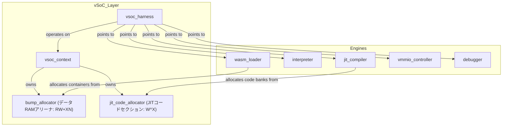
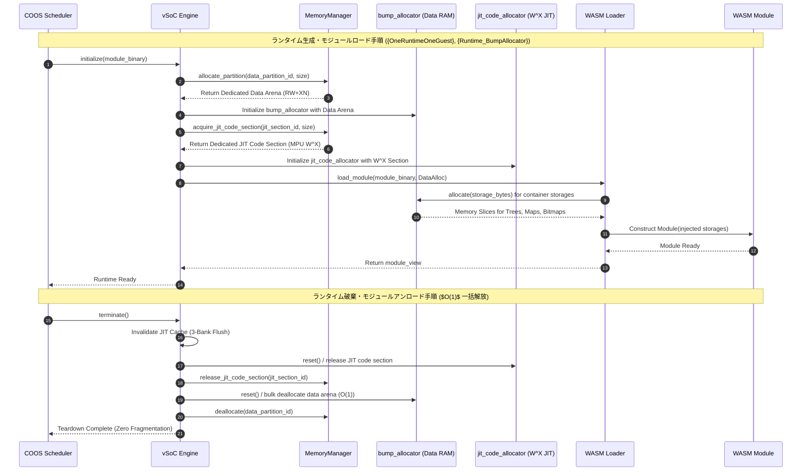
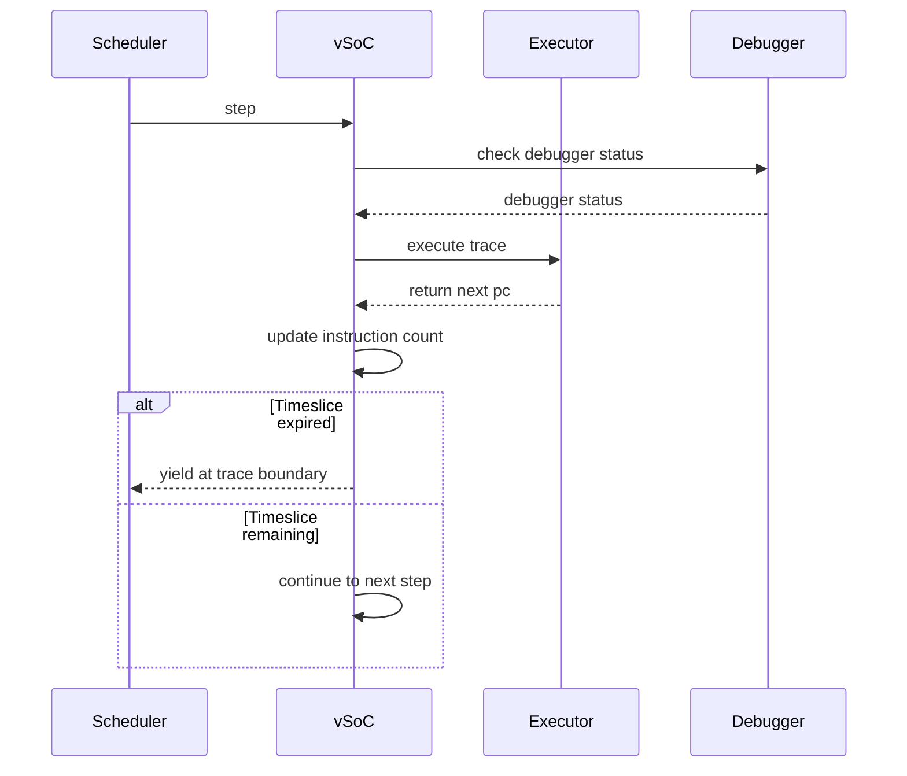
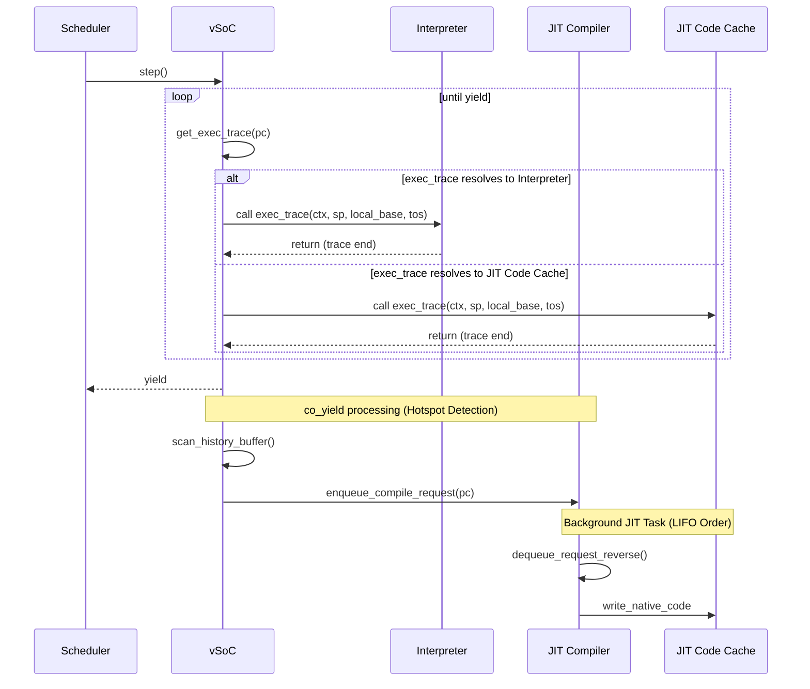
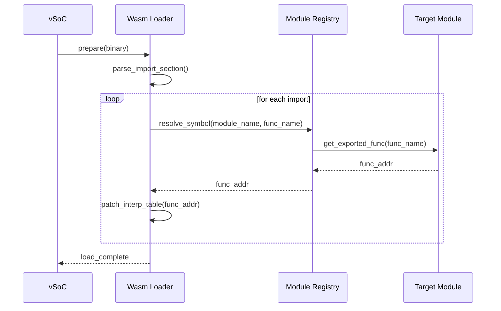

# vSoC コンポーネント設計書 {VERIFY_FORMAL} {VERIFY_LLM}
<!-- evidence:
     formal: formal/vsoc_state_model.py
     formal: formal/vsoc_cache_coherency_model.py
     wit: wit/runtime_vsoc_contract.wit
     concept: concepts/runtime_engine_concept.py
     test: docs/qa/tier2_runtime/runtime_vsoc_test_spec.md
-->

## 1. コンセプト
<!-- traceability: {LowLatencyJIT} {MemoryIsolation} {META_FaultIsolation} {EnvironmentPointer} {OneRuntimeOneGuest} {Runtime_BumpAllocator} -->
vSoC (Virtual System-on-Chip) は WASM 実行環境の統合マネージャである。Loader、Interpreter、JIT、vMMIO、Debugger を統括して実行制御を行う。
各サブコンポーネントを統合する環境としての役割を担う。`execution_context` 内のリニアメモリ情報やグローバル変数テーブル（`vsoc_runtime` 領域）を介して実行環境を提供する。
本システムは **1ランタイム1ゲストの直交分離原則 ()** を採用する。各 vSoC インスタンスは厳密に 1 つのゲストモジュールのみを担当する。
各ランタイムは**自身専用の固定長データバンプアロケータ ()** を所有する。モジュール内の全システムコンテナストレージ（RAM/XN）の確保を一元管理する。アンロード時にはこれらを $O(1)$ で一括リセットし、メモリ断片化を根絶する。
JIT ネイティブコードキャッシュ（3-Bank）は、専用の実行可能セクションから**専用の JIT コードアロケータ**により確保する。このセクションには MPU の W^X（ライト・実行権限排他）制御を適用する。データ用バンプアロケータ（RAM/XN）とはハードウェア保護ドメインを厳格に分離する。

## 2. アーキテクチャ分類
<!-- traceability: {META_3TierSeparation} {GLOBAL_ComponentHarness} {META_StaticDI} {OneRuntimeOneGuest} -->
本コンポーネントは **Tier 2 (分解されたサブコンポーネント: Decomposed Subcomponent)** に属する。WASM 仮想実行環境として Loader、Interpreter、JIT、vMMIO、Debugger などのサブコンポーネント群を統合する。統合には**ハーネスパターン（`vsoc_harness`）による静的依存性逆転（Static Dependency Inversion）**を用いる。
組み込みベアメタル環境では、仮想関数（vtable）や動的ディスパッチによるオーバーヘッドを容認しない。そのため Tier 2 の vSoC は Tier 3 具象エンジンの内部ヘッダに依存しない。ハーネスに集約された POD 関数ポインタやインスタンスを介して、ゼロオーバーヘッドで制御を委譲する。
同一モジュールの複数インスタンス実行は、単一ランタイム内のマルチスレッドでは行わない。独立した別ランタイムの並行起動（）と COOS IPC 通信により直交化する。

## 3. 静的モデル

### 3.1 データ構造
<!-- traceability: {META_StaticDI} {Runtime_BumpAllocator} {GLOBAL_InterruptWakeup} -->
- **`vsoc_harness`**: vSoCが依存する各種エンジン（Loader, Interpreter, JIT等）のインターフェースを集約した構造体。
- **`vsoc_context`**: 現在の実行状態、仮想割り込み、JITキャッシュの管理状態、専用データバンプアロケータおよびJITコードアロケータなど、可変なランタイム状態。
- **`vsoc_config`**: メモリ割り当てやJIT有効化フラグなどの不変な構成情報。

### 3.2 内部ブロック図
<!-- traceability: {META_StaticDI} {Runtime_BumpAllocator} -->


### 3.3 主要なクラス・構造体・配列・定数
<!-- traceability: {META_StaticDI} {Runtime_BumpAllocator} -->

#### vSoCハーネス（vsoc_harness）
各エンジンへのインターフェースを集約する。PODとして扱い、メンバに末尾アンダースコアは付与しない。

| 項目名 | 機能と役割 | 備考（制約、型など） |
| :--- | :--- | :--- |
| WASMローダ | WASMモジュールのロードと解析を担うコンポーネントへの参照。 | `WasmLoader*` |
| インタープリタ | WASMバイトコードを逐次実行するエンジンへの参照。 | `Interpreter*` |
| JITコンパイラ | ホットスポットをネイティブコードに変換するエンジンへの参照。 | `JitCompiler*` |
| デバッガ | RSPプロトコルを介したデバッグ機能を提供するコンポーネントへの参照。 | `Debugger*` |
| vMMIO | 仮想的なメモリマップドI/Oを制御するコンポーネントへの参照。 | `VmmioController*` |

#### vSoCコンテキスト（vsoc_context）
vSoC全体の可変な実行時状態を保持する構造体。

| 項目名 | 機能と役割 | 備考（制約、型など） |
| :--- | :--- | :--- |
| 実行状態 | 現在のvSoCの実行状態（停止、実行中、ブレークポイント等）。 | `VsocState` 列挙型 |
| 割り込みイベント状態 | COOSから受け取った固定5ワードの`interrupt-event`とvIRQ配送状態。 | `interrupt_event` + 固定長状態 |
| JITキャッシュ状態 | 現在アクティブなJITコードキャッシュの管理情報。 | `JitCacheManager` 構造体 |
| JITキャッシュ状態 | 現在アクティブなJITコードキャッシュの管理情報。 | `JitCacheManager` 構造体 |
| WASMモジュール参照 | 現在ロードされているWASMモジュールのインスタンスへのポインタ。 | `WasmModule*` |
| 専用データバンプアロケータ | モジュール内の全システムコンテナストレージ（RAM/XN）を切り出す専用アロケータ。アンロード時に一括リセットされる。 | `bump_allocator` インスタンス |
| JITコードアロケータ | MPU W^X 保護（ライト・実行権限排他）が適用されたセクションから 3-Bank コードキャッシュを切り出す専用アロケータ。 | `jit_code_allocator` 構造体 |

#### vSoCランタイム環境
<!-- traceability: {ContextPointerRegister} {EnvironmentPointer} {MemoryBoundaryCheck} {ExecutionContext_Layout} {VsocRuntime_Layout} {GOTCHA-VSOC-03} -->
vSoCの実行環境情報は `execution_context` の論理フィールドとして保持する。固定ABIではリニアメモリ、グローバル領域、命令ハンドラ表の参照をそれぞれ独立したフィールドに置き、別の環境構造体を特定オフセットへ埋め込まない。JITトレースとインタープリタは同じ論理状態を参照する。境界で渡す第4論理引数はスタック頂点値であり、物理レジスタへの割当は対象ABIで定義する。`memory.grow` で動的に伸長するリニアメモリの実体や、モジュール横断で共有されるグローバル変数配列など、単一の呼び出しコンテキストを超えて生存する状態を保持する。

| 項目名 | 機能と役割 | 型分類 | サイズ・制約 |
| :--- | :--- | :--- | :--- |
| リニアメモリ基底 | ゲストリニアメモリ（`memory.grow` で再割当されうる）の開始アドレス | アドレス値 | 32bit符号なし（`execution_context` の `+0x28`） |
| リニアメモリサイズ | ゲストリニアメモリの現在の有効バイト数。`{FastAddressCheck}` の境界比較（`CMP addr, mem_size; BHS __trap`）に直接使う——マスクは使わないため2の冪制約もない | バイト数 | 32bit符号なし（`execution_context` の `+0x2C`） |
| グローバル変数基底 | WASM `global` 配列（4バイト単位でインデックス付け）の開始アドレス | アドレス値 | 32bit符号なし（`execution_context` の `+0x30`） |
| グローバル変数終端 | WASM `global` 配列の終端アドレス | アドレス値 | 32bit符号なし（`execution_context` の `+0x34`） |

`execution_context` の実体は計64バイト（`+0x00`〜`+0x3F`）である。内訳は16個の32ビットフィールドであり、JITの委譲先関数アドレスと共通呼出し入口の選択値はトレースヘッダへ置く。
オペランド領域、ローカル値領域、制御ブロック復帰情報領域は、それぞれ専用の境界オフセット対を持つ独立領域である。いずれか1本の伸縮が他の記録位置へ影響することはない（ADR-INTERP-03）。
JIT の複雑処理委譲先はトレースヘッダの `helper_target_addr` からトレースごとにロードする。対象ABIの呼出しコードはヘルパー契約ごとに共通コード領域へ配置し、ヘッダの対応入口選択値で呼び出す。JITコード内へ委譲先の絶対アドレスを埋め込まない。型定義の正本は [`runtime_vsoc_contract.wit`](docs/components/tier2_runtime/wit/runtime_vsoc_contract.wit) であり、固定ABIの物理配置は [`jit_abi.md`](docs/components/tier2_runtime/jit_abi.md) に従う。 `{PositionIndependentCode}`

> [!NOTE]
> **構造体の役割分離**:
> - **`execution_context` の環境フィールド**: JITトレースおよびインタープリタハンドラが実行ループ内で参照するリニアメモリとグローバル領域の情報。固定ABIでは各フィールドを実行コンテキスト内に保持する。
> - **`vsoc_context`**: タスク全体のライフサイクル、保留中の`interrupt-event`とvIRQ配送状態、WASM モジュール構造体へのポインタを管理する**上位マネージャ層の制御構造体**。実行ループ外でのタスク切り替えやデバッガ連携時に参照される。両者は明確に役割分離して維持する。

#### vSoC構成（vsoc_config）
<!-- traceability: {META_ConfigurableSystem} -->
vSoCの動作パラメータを定義する。

| 項目名 | 機能と役割 | 備考（制約、型など） |
| :--- | :--- | :--- |
| JIT有効化フラグ | システム全体でJITコンパイル機能を有効にするかどうかを決定する。 | ブール値 (`FB_CONF_JIT_ENABLED`) |
| コードキャッシュサイズ | 連続8KB（4KBページ×2）。共通コード2KBとActive/Warm/Oldest各2KBを含む。 | `FB_CONF_JIT_CACHE_SIZE` |
| RAM開始アドレス | ゲストから見たRAMの仮想アドレス空間上の開始位置。 | `0x0000_0000` (Bit 31 == 0) |
| RAM容量 | ゲストに割り当てられるRAMの有効バイト数（64KBまたは8KB等の部分ページ）。 | `FB_CONF_GUEST_RAM_SIZE` |
| vMMIO基点アドレス | 仮想デバイスレジスタおよび共有メモリ空間の開始位置（2段階ダイレクトデコード）。 | `0x8000_0000` (Bit 31 == 1) |
| パススルー基点アドレス | ゲスト仮想 PASSTHROUGH 領域（FC=15, `0xF000_0000`〜`0xFFFF_FFFF`）がマッピングされるホスト実物理ペリフェラル空間の開始アドレス。`物理addr = passthrough_base + (vmmio_addr - 0xF000_0000)`。 | `FB_CONF_VSOC_PASSTHROUGH_BASE` (Cortex-M デフォルト値: `0x4000_0000`) |

## 4. 動的モデル

### 4.1 アルゴリズム
<!-- traceability: {ThreadedInterpreter} {JIT_CopyAndPatch} {Challenge_ApproximateYield} {JIT_Safepoint} {Debugger_Jit_Flush} {ContextPointerRegister} -->


vSoC コアエンジンの実行委譲、協調イールド、および外部介入制御の基本アルゴリズムを以下に定義する。

| アルゴリズム / 機構 | 契機・条件 | 動作内容 | 目的・安全性不変条件 | 関連キーワード |
| :--- | :--- | :--- | :--- | :--- |
| **実行エンジン委譲とステートレス化** | `step()` 実行時 | `exec_trace`を4論理引数のプレーン関数としてディスパッチ | コルーチン化禁止による `[[clang::musttail]]` 阻害・スタック消費の防止（`GOTCHA-VSOC-01`） | |
| **概算Yield (Approximate Yield)** | トレース境界脱出時 | `yield_threshold` を基準に vSoC が一括して `co_yield` 判定 | 命令ハンドラ内カウンタ埋め込みを排除し最速ホットパスを維持（`GOTCHA-VSOC-02`） | |
| **JIT Safepoint** | ループバック（バックエッジ）到達時 | 保留中の割り込みイベント（原因レコード）・ブレークポイントを確認し、必要時フォールバック | JIT実行中の非同期イベント・Ctrl+Cへの即時応答性担保 | |
| **デバッガ介入時キャッシュフラッシュ** | デバッガによるメモリ/変数書き換え時 | 該当タスクの JIT キャッシュ（Active/Warm/Oldest 全面）を一括無効化 | JIT コードと変更後メモリの整合性完全維持 | |
| **1ランタイム1ゲスト・専用バンプ一括解放（W^Xコード分離）** | ランタイム生成時およびアンロード時 | 専用データアリーナ（RAM/XN）からコンテナストレージを確保し、専用W^XセクションからJITコードを確保。破棄時に $O(1)$ 一括リセット | 完全障害隔離、内部断片化ゼロ、ハードウェア実行保護（W^X/XN分離）の厳格維持 | `{OneRuntimeOneGuest}` `{Runtime_BumpAllocator}` |

- **1ランタイム1ゲストのライフサイクル管理と専用バンプ一括解放 (`{OneRuntimeOneGuest}`, `{Runtime_BumpAllocator}`)**:
  vSoC インスタンス生成時、メモリマネージャから固定長 RAM パーティション（データアリーナ: `RW + XN`）と物理的に連続したJITコード用8KB領域（MPU `W^X` 制御）の貸与を受ける。ここで専用の `bump_allocator`（データ用）と `jit_code_allocator`（コード用）を初期化する。
  WASM ローダはデータ用バンプアロケータを受け取り、モジュール内の全システムコンテナストレージ（`ReadOnlyRadixBinaryTreeStorage`, `MutableBitStorage` 等）を順次切り出す。
  一方、JIT コンパイラは MPU の `W^X` 保護が適用された JIT セクションから専用アロケータを用いてネイティブトレースを確保する。
  モジュール終了・アンロード時は、JIT キャッシュを無効化（3-Bank Flush）する。その上でバンプアロケータのアリーナごと $O(1)$ で一括リセットして返還し、JIT コードセクションも解放する。
  個別の `free()` や複雑なデストラクタ走査は一切行わない。これにより動的メモリ断片化や他モジュールからのダングリング参照を原理的に根絶する。
- **実行エンジン委譲とステートレス化 (`GOTCHA-VSOC-01`, , )**:
  vSoC は `step()` において現在の PC に対応する `exec_trace` を呼び出す。シグネチャは `void __fastcall (execution_context* ctx, uint32_t* sp, uint32_t* local_base, uint32_t tos)` である。
  `exec_trace` はインタープリタのディスパッチャまたは JIT コードを指す。実行コンテキスト、オペランド領域の現在位置、ローカル値領域の開始位置、スタック頂点値を4つの論理引数として渡し、物理レジスタへの割当は対象ABIに従う。
  **設計理由と不変条件**: インタープリタおよび JIT トレース自身を C++20 コルーチン化することは厳禁とする。コルーチン化すると、命令ディスパッチごとにフレームの割り当てや退避・復帰が発生する。さらにコンパイラの末尾呼び出し最適化（`[[clang::musttail]]`）が阻害され、スタックを急速に消費してしまう。
  そのためインタープリタは完全ステートレスな `void` プレーン関数として設計する。次に実行すべき PC は `execution_context.ip`（`R0` の `+0x00`）へ書き戻し、vSoC のメインループへ戻る規約とする。
- **概算Yield と明示的イールド点 (`GOTCHA-VSOC-02`, )**:

#### ランタイム生成とモジュールアンロードのライフサイクル（責務シーケンス図）
<!-- traceability: {OneRuntimeOneGuest} {Runtime_BumpAllocator} {META_FaultIsolation} -->
COOS Scheduler、vSoC Engine、Platform MemoryManager、WASM Loader、WASM Module 間の生成・ストレージ確保と、$O(1)$ 一括解放手順を示す。




#### vSoC 実行エンジン委譲とトレース境界イールド判定（責務シーケンス図）
<!-- traceability: {GOTCHA-VSOC-01} {GOTCHA-VSOC-02} {ADR_TraceBoundaryYield} {ThreadedInterpreter} {JIT_CopyAndPatch} -->
COOS Scheduler、vSoC Engine、Execution Engine（Interpreter / JIT）、HAL/Debugger 間の実行委譲と、トレース境界での一括タイムスライス判定を示す。



### 4.2 状態遷移図 (SysML SMD: vSoC Engine ライフサイクル)
<!-- traceability: {VSOC_Lifecycle} {ThreadedInterpreter} {JIT_CopyAndPatch} {Challenge_ApproximateYield} {JIT_Safepoint} {Debugger_Jit_Flush} -->

vSoC Engine の実行制御と JIT/Interpreter 切り替えの状態遷移（）を以下に示す。


**vSoC Engine 状態の説明:**

| 状態 | 説明 | 主要アクション |
| :--- | :--- | :--- |
| **Uninitialized** | 初期化前 | - |
| **Loading** | WASM モジュール読み込み・リンク中 | パーサ実行、セクション検証 |
| **Ready** | 実行準備完了 | `step()` で Interpreter または JIT へ遷移 |
| **InterpreterRun** | インタープリタによるバイトコード逐次実行 | オプコード実行、ホットスポット検出 |
| **JitRun** | JIT生成ネイティブコード実行 | ネイティブコード直接実行、Safepoint チェック |
| **SafepointCheck** | JIT 実行中の割り込み確認ポイント | フラグチェック、中断判定 |
| **Debugging** | デバッガによる停止中 | メモリ検査、変数書き換え、キャッシュ flush |
| **Error** | エラー発生（復帰可能） | トラップハンドラ実行、状態リセット |
| **Idle** | 停止・待機状態 | スケジューラに制御戻す |

**遷移の詳細:**

| 遷移 | トリガー | 条件 | アクション | 次状態 |
| :--- | :--- | :--- | :--- | :--- |
| Load → Ready | load_ok() | モジュール有効 | リンク完了、コンテキスト初期化 | Ready |
| Ready → InterpreterRun | step(pc) | exec_trace = interpreter | PC 登録、実行開始 | InterpreterRun |
| Ready → JitRun | step(pc) | exec_trace = compiled code | ネイティブコード実行開始 | JitRun |
| InterpreterRun → Ready | yield() [threshold] | 実行トレース数超過 | ホットスポット検出、JIT キュー投入 | Ready |
| JitRun → SafepointCheck | [loop back edge] | JIT ループバックエッジ | 保留中の`interrupt-event`確認 | SafepointCheck |
| SafepointCheck → JitRun | [no event] | 保留イベントなし | JIT 実行継続 | JitRun |
| SafepointCheck → Ready | [interrupt pending] | 原因付きイベント有り | インタープリタ フォールバック | Ready |
| (any) → Debugging | breakpoint [debugger] | RSP ブレークポイント | デバッガコマンド待ち | Debugging |
| Debugging → InterpreterRun | resume(interp) | 再開要求（インタープリタ） | JIT キャッシュをflushし、PCを保持してInterpreter専用で再開 | InterpreterRun |
| (any) → Error | trap() | ページフォルト / 不正オプコード | トラップハンドラ実行 | Error |
| Error → Ready | recover() | リカバリ可能 | コンテキストリセット | Ready |

**重要な設計ポイント:**

- **Approximate Yield (`{ADR_TraceBoundaryYield}`)**: インタープリタ/JITトレース側での命令単位の精密中断は行わず、トレースの切れ目（基本ブロック末尾・ループ境界・関数境界）で制御が戻ってくるたびに、vSoC が概算的にタスク切り替えを判定して `co_yield` を発行する

### 4.2.1 Safepoint と JIT キャッシュ協調モデル
<!-- traceability: {JIT_Safepoint} {Challenge_JITCacheEfficiency} {Debugger_Jit_Flush} -->

JIT実行中の非同期割り込み対応とキャッシュ一貫性を保証するため、以下の協調メカニズムを採用する。

#### Safepoint の動作メカニズム
<!-- traceability: {JIT_Safepoint} {Challenge_InterruptSafety} -->

JIT生成ネイティブコードには、以下のポイントで割り込みチェック（Safepoint）を埋め込む：

| Safepoint位置 | 目的 | 実装 | オーバーヘッド |
| :--- | :--- | :--- | :--- |
| **ループバックエッジ** | 無限ループ検出と割り込み確認 | 保留イベント確認 + 条件分岐 | ~2-3 機械語命令 |
| **関数呼び出し前** | 外部サービス呼び出し時の割り込み確認 | 保留イベントチェック | ~1-2 命令 |
| **メモリアクセス後** | キャッシュ無効化（debugger flush）の確認 | 世代番号（generation cookie）検証 | ~1 命令 |

**保留イベントの構造:**
```
┌─────────────────────────────────────────┐
│ pending interrupt-event                  │
├─────────────────────────────────────────┤
│ vector_id   | source_id                  │
│ cause_code  | payload0 | payload1        │
└─────────────────────────────────────────┘
```

#### Active/Warm/Oldest 3面マルチバッファとキャッシュローテーション
<!-- traceability: {Challenge_JITCacheEfficiency} {LowLatencyJIT} -->

JIT コード領域（合計8KB `FB_CONF_JIT_CACHE_SIZE`）を4KBページ2枚分の連続領域として確保する。先頭2KBは相対ジャンプ用共通コード領域として固定し、残る6KBを2KBずつのActive / Warm / Oldestバンクに分ける。共通コード領域はOldest-Only Promotion、ローテーション、flushの対象外とする。

| フェーズ | 状態 | 説明 | アクション |
| :--- | :--- | :--- | :--- |
| **Normal (JitRun)** | Active が書込・実行中、Warm/Oldest が観測 | 新規 JIT コンパイルが Active へ追加 | 既存コードは保持 |
| **co_yield (Rotation)** | 世代ローテーション | Active → Warm → Oldest へスライド | Warm バンクでは無償観測 |
| **Oldest Evaluation** | Oldest lookup hit または破棄判定 | Oldest で lookup にヒットしたトレースは追加hotness判定なしに新 Active へ即時昇格 | 未ヒット（Cold）コードは Purge 破棄。Warm hitは昇格しない |
| **Debugger Flush** | Interrupt Flag[2] 検出 | デバッガメモリ変更を検知 | Active/Warm/Oldestを無効化し、共通コード領域を保持 |

**可変バンク内レイアウト（共通コード領域の後ろに連続配置）:**
```
JIT Evictable Banks (6 KB of 8 KB total)
┌──────────────────────┐
│  Active Buffer Bank  │  2 KB (Bank 0: current compiling & execution)
│  - Generation[0]     │  - New hot traces
├──────────────────────┤
│  Warm Buffer Bank    │  2 KB (Bank 1: observation window)
│  - Generation[1]     │  - Retained without copying
├──────────────────────┤
│  Oldest Buffer Bank  │  2 KB (Bank 2: oldest bank)
│  - Generation[2]     │  - Promoted if hot, else purged
└──────────────────────┘
```

Region 4全体は`0x2004_0000`から始まる連続8KBであり、共通コード領域は`0x2004_0000–0x2004_07FF`、Activeは`0x2004_0800–0x2004_0FFF`、Warmは`0x2004_1000–0x2004_17FF`、Oldestは`0x2004_1800–0x2004_1FFF`に置く。ローテーションではこの3つの固定物理区画に対する論理役割だけをスライドし、共通コード区画は変更しない。上の図は可変バンクだけを示す。

共通コードへの分岐はターゲット別ステンシルとrelocationで生成し、命令形式の到達範囲をコンパイル時に検査する。RISC-VのB-type条件分岐は偶数変位−4,096〜+4,094バイト、JALは±1MiBであるため、8KB領域内でも遠い条件分岐は近傍のrelay veneerから共通コードへ分岐する（[RISC-V Unprivileged ISA](https://docs.riscv.org/reference/isa/v20240411/unpriv/rv32.html)）。ARMも選択したThumb分岐形式に応じて到達範囲を検査する。

#### Debugger 介入時のキャッシュ一貫性
<!-- traceability: {Debugger_Jit_Flush} {Debug_Integrated} -->

デバッガがゲストメモリを変更した場合の処理フロー：

1. **Debugger Writes Memory**: `gdb_write_memory(addr, data)` → `fireball::vsoc::request_debugger_interrupt(ctx)` を呼び出し、保留中のデバッガイベントを記録
2. **Safepoint Detection**: JIT実行の SafepointCheck で `fireball::vsoc::has_debugger_interrupt(ctx)` を検査
3. **Cache Flush Trigger**: イベント検出時、即座に以下を実行：
   - Active/Warm/Oldestのメタデータを破棄（generation cookie インクリメント）。固定共通コード領域は保持
   - 登録済みの exec_trace ポインタを無効化
   - 次回 `step()` で Interpreter モードへフォールバック
4. **Resume**: デバッガが再開コマンドを発行 → `InterpreterRun` 状態に遷移し、JITを無効化したままInterpreter専用で実行
5. **Debugger Detach**: デバッガ接続が解除された時点でJITを再有効化し、候補ブロックのカードを`UNEXECUTED`として扱い、hotnessを最初から再計測して再コンパイルする

#### 形式検証 (pyModelChecking) 検証対象

本節で述べた Safepoint 協調とキャッシュ一貫性の性質は、6.1 の表に列挙したプロパティとして形式検証されている。個々のモデルファイルとプロパティ名の対応は **[6.1 検証対象の不変条件](#61-検証対象の不変条件)** を正本とする。

### 4.3 内部シーケンス
<!-- traceability: {ThreadedInterpreter} {JIT_CopyAndPatch} {Challenge_ApproximateYield} {JIT_Safepoint} {Debugger_Jit_Flush} -->
#### WASM実行およびJIT遷移シーケンス

<!-- traceability: {JIT_CopyAndPatch} {Interpreter_LazyJITSwitch} {Challenge_JITCacheEfficiency} -->


#### マルチモジュール動的リンクシーケンス
<!-- traceability: {MultiModule_Support} -->
複数のWASMモジュール間の依存関係を解決し、関数ポインタを接続する。



## 5. インターフェース定義

### 5.1 公開API
外部から利用可能なオブジェクト指向APIを定義する。

#### 準備（prepare）
| 項目 | 内容 |
| :--- | :--- |
| 機能概要 | 指定されたWASMバイナリデータを読み込み、実行準備を完了させる。 |
| シグネチャ | `prepare(wasm: binary-view) -> result<wasm-module-view, sys-recovery-strategy>` |
| 引数 | `ctx`: vsoc_context, `wasm`: バイナリデータとサイズ |
| 期待する結果 | 正常：モジュールがロードされ、内部状態がReadyになる。異常：検証失敗時等のエラー。 |
| 事前条件 | システムが初期化済みであること。 |
| 事後条件 | `ctx->module_view` が構築され、実行可能状態になる。 |
| 不変条件 | 既存の実行コンテキストが破壊されないこと。 |
| エラー時の挙動 | 不正なバイナリの場合はロードを中断し、エラー値を返す。 |
| 補足 | ROM上のデータを直接参照するため、RAMへのコピーは発生しない。 |

#### ステップ実行（step）
<!-- traceability: {META_RecoveryStrategy} -->
| 項目 | 内容 |
| :--- | :--- |
| 機能概要 | ゲストのプログラム実行を再開し、コルーチンの `yield` またはトラップが発生するまで継続する。内部で [`interpreter.md`](docs/components/tier3_executer/interpreter.md) の `run_step` または JIT コードへディスパッチする。 |
| シグネチャ | `step() -> result<execution-state-category, sys-recovery-strategy>` |
| 引数 | `ctx`: vsoc_context, `harness`: vsoc_harness |
| 期待する結果 | 正常：一定期間の実行後に制御が戻る。異常：トラップ発生。 |
| 事前条件 | 状態が Ready であること。 |
| 事後条件 | PCやレジスタ状態が更新されていること。 |
| 不変条件 | ゲストRAMの境界外へのアクセスが発生しないこと。 |
| エラー時の挙動 | トラップ（例外）発生時は、トラップ要因を保持してエラーを返す。 |
| 補足 | 内部的にはインタープリタとJITコードを透過的に切り替えて実行する。 |

#### `dispatch-interrupt-event`
<!-- traceability: {META_RecoveryStrategy} -->
| 項目 | 内容 |
| :--- | :--- |
| 機能概要 | COOSが協調境界で取り出した`interrupt-event`をSafepointで受け、vIRQの静的階層をゲスト関数へ配送する。 |
| シグネチャ | `dispatch-interrupt-event(ctx: 可変参照, event: interrupt-event) -> dispatch-result` |
| 引数 | `ctx`: vsoc_context, `event`: `vector_id`、`source_id`、`cause_code`、`payload0`、`payload1`の固定5ワード |
| 期待する結果 | `root → 分類 → デバイス → ゲスト関数`の順に、登録済みノードが必要な場合だけ`call_indirect`で呼び出される。 |
| 事前条件 | `event`の`vector_id`が静的原因源表に登録され、実行がSafepointまたは協調境界にあること。 |
| 事後条件 | `HANDLED`なら配送を終了し、`PASS_THROUGH`だけが子ノードへ進み、`REJECT`は診断記録後に終了する。 |
| 不変条件 | ISRからゲスト関数を直接呼び出さず、REJECTを原因とする再帰的なFAULT配送を行わない。 |
| エラー時の挙動 | 未登録ノード、無効な関数インデックス、WASMシグネチャ不一致は登録または配送を拒否し、下位ノードへ流さない。 |
| 補足 | `fireball_call(VIRQ_REGISTER/VIRQ_UNREGISTER)` の要求を保留表へ書き込み、Safepointで検証済みの関数インデックスを原子的に反映する。イベント本体はCOOS FIFOから受け取り、WASIの`poll-check`/`poll-wait`とは別経路である。 |

#### `register-virq-dispatcher`
<!-- traceability: {META_ConfigurableSystem} -->
| 項目 | 内容 |
| :--- | :--- |
| 機能概要 | `fireball_call` から受けたvIRQ登録要求を検証し、次のSafepointで有効化する。ゲストからvMMIO固定スロットへ直接書き込む経路は存在しない。 |
| シグネチャ | `register-virq-dispatcher(node-id: u32, function-index: u32) -> registration-result`<br>`unregister-virq-dispatcher(node-id: u32) -> registration-result` |
| 引数 | `register`: `node-id` はroot・4分類・静的デバイスのいずれか、`function-index` はWASM関数テーブルのインデックス。`unregister`: `node-id` のみ |
| 事前条件 | `node-id`がホスト設定の静的ノードで、関数が`(u32,u32,u32,u32,u32) -> u32`の期待シグネチャを満たすこと。 |
| 事後条件 | 保留登録として記録され、Safepointで有効表へ原子的に反映される。 |
| 不変条件 | 実行中のゲストからはSafepoint前の登録変更が観測できない。親子関係と原因源表は変更できない。 |
| エラー時の挙動 | 範囲外ノード、未登録ノード、無効関数インデックス、シグネチャ不一致は拒否する。 |

#### `register-hook`
<!-- traceability: {vMMIO_TrapAndEmulate} -->
本APIは vSoC 層の公開ラッパーであり、`harness.vmmio`（vMMIOコントローラへの参照）越しに [`runtime_vmmio.md`](docs/components/tier2_runtime/runtime_vmmio.md) の同名APIへそのまま転送する。実際のレジストリ登録・不変条件・エラー処理は vmmio 層の `register-hook`（`vmmio_context` を引数に取る）が正本であり、本節はその薄いラッパーの引数のみを記述する。

| 項目 | 内容 |
| :--- | :--- |
| 機能概要 | ゲストの特定のメモリ範囲（hook_idで識別）へのアクセスに対し、ホスト側の関数をプラガブルに登録する。`harness.vmmio` へ転送するのみ。 |
| シグネチャ | `register-hook(hook-id: hook-category, handler-addr: mem-address) -> operation-result` |
| 引数 | `harness`: vsoc_harness（`harness.vmmio` を通じて転送先を解決）、`hook-id`: 領域識別子, `handler-addr`: ハンドラアドレス |
| 期待する結果 | 指定範囲へのアクセス時に登録したコールバックが実行されるようになる。 |
| 補足 | 転送先の事前条件・事後条件・不変条件・エラー処理は [`runtime_vmmio.md`](docs/components/tier2_runtime/runtime_vmmio.md) の `register-hook` を正本とする。 |

### 5.2 ネイティブAPI エクスポート
<!-- traceability: {NativeAPI_Export} -->

WASMゲストからホストサービスを呼び出すための最小限のインターフェースを提供する。

Fireballでは、標準WASIのゲスト側アダプタを `libfireball` として提供し、WASM import の host call でホストサービスへ接続する。システムコールとVDMAの要求搬送に vMMIO レジスタは使用しない。

- **host-call import**: `uint32_t fireball_call(uint32_t id, uint32_t arg0, uint32_t arg1, ... uint32_t arg5)`
  - ゲストはこの関数をインポートし、統合システムコールID `id`（上位16bit: `service_id`, 下位16bit: `command_id`）および最大6つの汎用引数を指定して呼び出す（`{Syscall_Mapping}` を正本とする）。
  - **host call は vMMIO レジスタ経路ではない**。上記シグネチャはゲストから見た WASM import ABI であり、ゲストは通常の関数呼び出しとして引数を渡す。実行エンジンは引数をホスト側ハンドラへ直接渡し、戻り値を WASM の結果値へ返す。※整合性検証は [runtime_vsoc_test_spec.md](docs/qa/tier2_runtime/runtime_vsoc_test_spec.md) `TEST-VSOC-40` を参照。
- **WASI互換性**: ゲスト側で `wasi-libc` と Tier 3 のゲストアダプタをリンクし、Tier 2 の `runtime_syscall` と `hal_dispatch` が定義する公開契約へ接続することで実現する。

### 5.3 マルチモジュール対応
<!-- traceability: {MultiModule_Support} -->
複数のWASMモジュール間の依存関係を解決し、動的にリンクする。

- **Module Registry**: ロード済みのモジュールを名前で管理する。
- **Dynamic Linking**: インポートセクションに基づき、他モジュールのエクスポートを解決する。

### 5.4 URI/IPCインターフェース
<!-- traceability: {META_RecoveryStrategy} {vMMIO_TrapAndEmulate} {NativeAPI_Export} {MultiModule_Support} -->
- **URI**: `fireball://vsoc/control/<instance_id>`
- **メッセージ形式**: 実行制御、状態取得用のKey-Valueプロトコル。詳細定義は IPCルータの仕様に準ずる。

### 5.5 関連コンポーネントとの連携
<!-- traceability: {META_RecoveryStrategy} {vMMIO_TrapAndEmulate} {NativeAPI_Export} {MultiModule_Support} -->
| コンポーネント | 連携内容 | 参照データ構造 |
| :--- | :--- | :--- |
| **Interpreter** | インタープリタ実行の委譲とホットスポット履歴の取得 | `interpreter`, 履歴バッファ |
| **JIT Compiler** | トレース単位のコンパイル要求とJITコードキャッシュ管理 | `jit_compiler`, `JIT Code Cache` |
| **Wasm Loader** | モジュールロードと `module_view` の管理 | `loader`, `module_view` |
| **Debugger** | デバッグコマンドの処理と実行状態の同期 | `debugger`, `debug_command_queue` |

## 6. 形式検証（pyModelChecking / 直交表）

### 6.1 検証対象の不変条件

<!-- traceability: {JIT_Safepoint} {Challenge_JITCacheEfficiency} {Debugger_Jit_Flush} {GLOBAL_InterruptWakeup} -->

各不変条件は、下表のモデルファイル内の**プロパティ名で特定できる形**で証明されている。すべてのプロパティは `build_model(guards=False)` による変異検査を伴い、「ガードを外すと違反状態が到達可能になる」ことを示すことで、空虚な真（vacuous truth）でないことを保証する。

| 不変条件 | 説明 | 検証モデル / プロパティ名 |
| :--- | :--- | :--- |
| **Safepoint応答性** | 実行中のタスクは必ず Safepoint に到達し、保留中の`interrupt-event`が検出されること。| [`vsoc_state_model.py`](docs/components/tier2_runtime/formal/vsoc_state_model.py) `safepoint_reachable_definitively` |
| **IRQ/JIT レース不在** | Safepoint 同期を経ずに JIT ネイティブ実行中の割り込み処理が始まらないこと。| [`vsoc_state_model.py`](docs/components/tier2_runtime/formal/vsoc_state_model.py) `irq_jit_race_freedom_proof` |
| **Debugger安全性** | デバッガがメモリを変更した後、キャッシュ flush が完了するまで旧世代コードが実行されないこと。| [`vsoc_cache_coherency_model.py`](docs/components/tier2_runtime/formal/vsoc_cache_coherency_model.py) `debugger_memory_write_invalidates_stale_traces` |
| **キャッシュ整合性** | generation cookie が全バンク一括で更新され、バンク間で世代が逆行・不一致にならないこと。| [`vsoc_cache_coherency_model.py`](docs/components/tier2_runtime/formal/vsoc_cache_coherency_model.py) `generation_monotonicity_across_banks` |
| **リソース有界性** | 3面ローテーション時、Purge とエントリ表スロット回収が不可分に行われ、未回収スロットが蓄積しないこと。 | [`vsoc_cache_coherency_model.py`](docs/components/tier2_runtime/formal/vsoc_cache_coherency_model.py) `bounded_cache_rotation_memory` |
| **flush 完了性** | デバッガ介入で dirty になったキャッシュの flush は必ず完了すること。| [`vsoc_cache_coherency_model.py`](docs/components/tier2_runtime/formal/vsoc_cache_coherency_model.py) `dirty_cache_always_flushes_promptly` |
| **重複コンパイル抑止** | 常駐済みトレースに対する二重コンパイルを抑止しキャッシュを浪費しないこと。| [`vsoc_cache_coherency_model.py`](docs/components/tier2_runtime/formal/vsoc_cache_coherency_model.py) `resident_trace_duplicate_compile_suppression` |
| **状態一貫性** | vSoC Engine ライフサイクル（4.2）の各遷移後に状態が整合していること。 | 直交表 / レビュー（形式検証対象外） |

### 6.2 モデル分割の理由

実行エンジンの状態機械（`vsoc_state_model.py`）と、キャッシュ寿命の関心事（`vsoc_cache_coherency_model.py`）は**別モデルに分割している**。世代スタンプとリソース回収を実行状態機械に合成すると状態空間が積になって爆発し、`document_structure.md` が定めるデコンポジション基準「検証可能性 (Verification Tractability) の維持」に反するためである。両モデルは `s_safepoint` / `s_dbg_write` という同一の観測点を共有しており、この点で接続される。

### 6.3 検証モデル概要（vsoc_cache_coherency_model.py）

**状態変数（抽象化）:**
```
phase       : {interp, exec_fresh, rotate, reclaimed, dbg_write, safepoint, flushing, flushed}
gen_status  : {gen_consistent, gen_regressed}          -- 全バンク一括更新か否か
bank_status : {all_banks_accounted, leaked}            -- Purge と回収の不可分性
code_status : {fresh, stale_code}                      -- 実行中コードの世代妥当性
```

**初期状態:** `phase = interp`（キャッシュ参照のみ、世代一致、全バンク回収済み）

**遷移:**
- 通常実行: `interp → exec_fresh → interp`
- ローテーション: `interp → rotate → reclaimed → interp`（Purge と回収は不可分）
- デバッガ介入: `(interp | exec_fresh) → dbg_write → safepoint → flushing → flushed → interp`

**証明される不変式:**
- `AG(¬stale_code)`   — flush 完了前の旧世代コード実行は到達不能
- `AG(¬gen_regressed)` — 世代の逆行・バンク間不一致は到達不能
- `AG(¬leaked)`       — 未回収スロットの蓄積は到達不能
- `AG(dirty → AF(flushed))` — dirty になった flush は必ず完了する

**変異検査（`guards=False`）で到達可能になる違反:** `s_exec_stale`（Safepoint の世代照合を撤去）、`s_gen_regressed`（世代の個別更新化）、`s_leaked_bank`（Purge のみ実行し回収を省略）、`s_flush_stalled`（flush の遅延を許容）。

### 6.4 既知の制限

- **ハードウェアタイマー精度**: Safepoint チェック周期が CPU クロック精度に依存（キャリブレーション必要）。
- **複数コアでのメモリ可視性**: シングルコア仮定。マルチコアではメモリバリア追加が必要。

## 7. 制約達成の方策

### 7.1 性能制約と方策
<!-- traceability: {LowLatencyJIT} {ThreadedInterpreter} -->
- **目標**: WAMRインタープリタを上回る実行速度を実現する。
- **方策**: コピーアンドパッチJITによるネイティブ実行と、スレッドインタープリタによる高速フォールバックを組み合わせる。

### 7.2 メモリ制約と方策
<!-- traceability: {JIT_MultiBuffer_Cache} {GLOBAL_IndependentHeap} {WasmPageAlignment} -->
- **目標**: 64KB RAM環境で動作させる。
- **方策**: 8KB連続JIT領域のうち、固定共通コード領域2KBとActive/Warm/Oldestの3バンク各2KBを使用する。世代交代とエビクションの対象は3バンクのみであり、共通コード領域は保持する（`{META_ConfigurableSystem}`）。
- **高速アドレス判定**: ゲストRAMを `0x0` から配置し、単一の比較命令でRAMアクセスを判定することで、インタープリタおよびJITのオーバーヘッドを最小化する。

### 7.3 安全性制約と方策
<!-- traceability: {MemoryBoundaryCheck} {META_RestrictedPhysicalAccess} -->
- **目標**: ゲストアプリケーションの暴走を完全に隔離する。
- **方策**: JITコードへの境界チェック埋め込みと、vMMIOによる物理アクセスの制限を行う。物理アドレスアクセスの許可範囲は `FB_CONF_VMMIO_ALLOWED_ADDRS`（`{META_ConfigurableSystem}`）に `constexpr` 定義されたテーブルに基づき、vMMIOが検証する。
