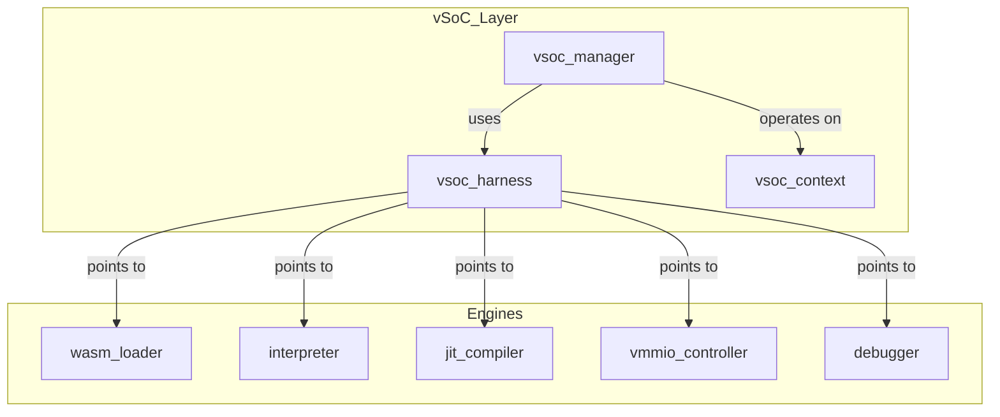
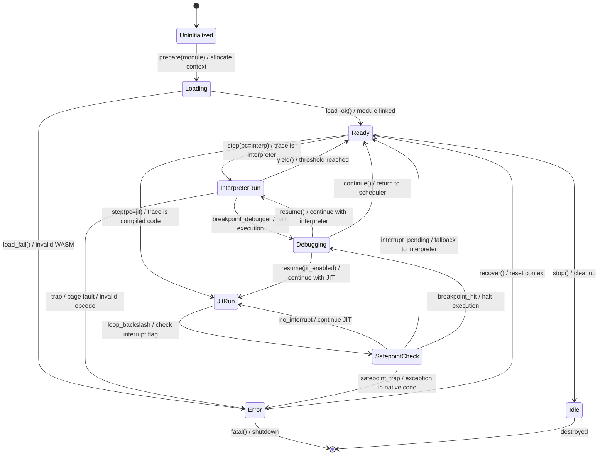
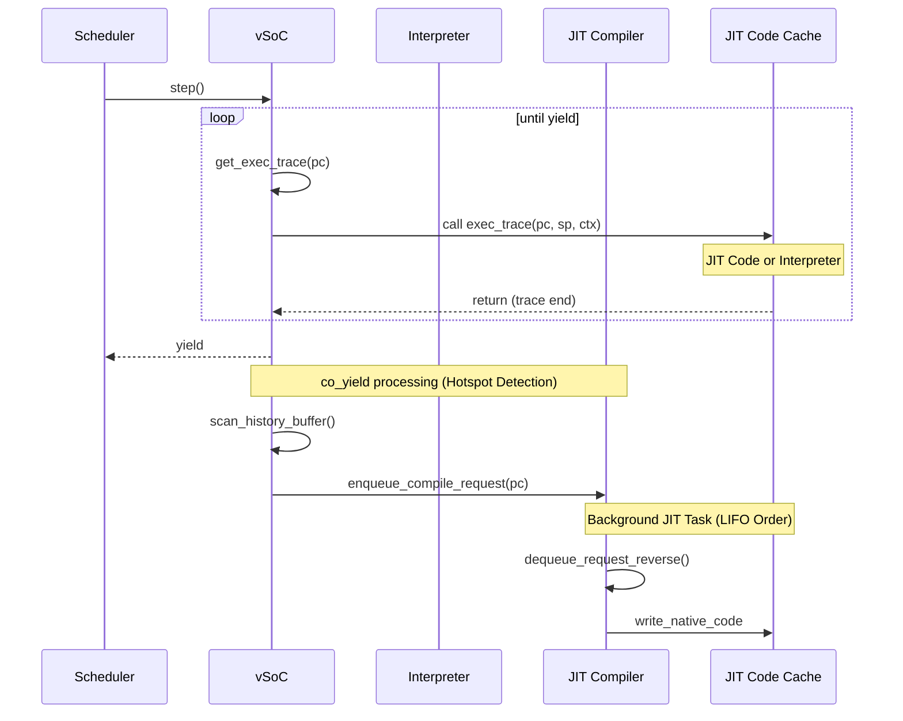

# vSoC コンポーネント設計書 {VERIFY_FORMAL}

## 1. コンセプト
<!-- traceability: {LowLatencyJIT} {MemoryIsolation} {META_FaultIsolation} {EnvironmentPointer} -->
vSoC (Virtual System-on-Chip) は、WASM実行環境の統合マネージャであり、Loader、Interpreter、JIT、vMMIO、Debugger を統括して実行制御を行う。各サブコンポーネントを統合する「環境」としての役割を持ち、`vsoc_runtime` を `execution_context` から参照される Environment として提供する。 `{LowLatencyJIT}` `{MemoryIsolation}` `{META_FaultIsolation}` `{EnvironmentPointer}`

## 2. アーキテクチャ分類
<!-- traceability: {META_3TierSeparation} {GLOBAL_ComponentHarness} -->
本コンポーネントは **Tier 2 (分解されたサブコンポーネント: Decomposed Subcomponent)** に属し、WASM仮想実行環境として Loader, Interpreter, JIT, vMMIO, Debugger などのサブコンポーネント群をハーネスパターンによって統合する。 `{META_3TierSeparation}` `{GLOBAL_ComponentHarness}`

## 3. 静的モデル

### 3.1 データ構造
<!-- traceability: {META_StaticDI} -->
- **`vsoc_harness`**: vSoCが依存する各種エンジン（Loader, Interpreter, JIT等）のインターフェイスを集約した構造体。 `{META_StaticDI}`
- **`vsoc_context`**: 現在の実行状態、仮想割り込み、JITキャッシュの管理状態など、可変なランタイム状態。
- **`vsoc_config`**: メモリ割り当てやJIT有効化フラグなどの不変な構成情報。

### 3.2 内部ブロック図
<!-- traceability: {META_StaticDI} -->


### 3.3 主要なクラス・構造体・配列・定数
<!-- traceability: {META_StaticDI} -->

#### vSoCハーネス（vsoc_harness）
各エンジンへのインターフェイスを集約する。PODとして扱い、メンバに末尾アンダースコアは付与しない。

| 項目名 | 機能と役割 | 備考（制約、型など） |
| :--- | :--- | :--- |
| WASMローダ | WASMモジュールのロードと解析を担うコンポーネントへの参照。 | `WasmLoader*` |
| インタープリタ | WASMバイトコードを逐次実行するエンジンへの参照。 | `Interpreter*` |
| JITコンパイラ | ホットスポットをネイティブコードに変換するエンジンへの参照。 | `JitCompiler*` |
| デバッガ | RSPプロトコルを介したデバッグ機能を提供するコンポーネントへの参照。 | `Debugger*` |
| vMMIO | 仮想的なメモリマップドI/Oを制御するコンポーネントへの参照。 | `VmmioController*` |

#### vSoCコンテキスト（vsoc_context）
可変な実行状態を保持する。

| 項目名 | 機能と役割 | 備考（制約、型など） |
| :--- | :--- | :--- |
| 割り込みフラグ | ゲストに通知された仮想割り込みの状態を保持する。 | 32bitフラグ |
| モジュールビュー | ロード済みWASMモジュールの索引情報への参照。 | `wasm_module_view*` |
| プログラムカウンタ | ゲストの現在のプログラム実行位置（WASMオフセット）。 | `uint32_t` |

#### vSoC構成（vsoc_config）
<!-- traceability: {META_ConfigurableSystem} -->
vSoCの動作パラメータを定義する。 `{META_ConfigurableSystem}`

| 項目名 | 機能と役割 | 備考（制約、型など） |
| :--- | :--- | :--- |
| JIT有効化フラグ | システム全体でJITコンパイル機能を有効にするかどうかを決定する。 | ブール値 |
| コードキャッシュサイズ | 生成されたネイティブコードを保存するためのメモリ領域の大きさ（2KB×3面 = 6144B）。 | `FB_CONF_JIT_CACHE_SIZE` |
| RAM開始アドレス | ゲストから見たRAMの仮想アドレス空間上の開始位置。 | `0x0000_0000` (Bit 31 == 0) |
| RAM容量 | ゲストに割り当てられるRAMの有効バイト数（64KBまたは8KB等の部分ページ）。 | `FB_CONF_GUEST_RAM_SIZE` |
| vMMIO基点アドレス | 仮想デバイスレジスタおよび共有メモリ空間の開始位置（2段階ダイレクトデコード）。 | `0x8000_0000` (Bit 31 == 1) |
| パススルー基点アドレス | PASSTHROUGH領域（FC=15）が参照する物理アドレス空間の開始位置。`物理addr = passthrough_base + offset` | `0xF000_0000` (ARM Cortex-M: 0x4000_0000) |

## 4. 動的モデル

### 4.1 アルゴリズム
<!-- traceability: {ThreadedInterpreter} {JIT_CopyAndPatch} {Challenge_ApproximateYield} {JIT_Safepoint} {Debugger_Jit_Flush} -->
- **実行エンジン委譲 (exec_trace)**: vSoCは `step()` で現在のPCに対応する `exec_trace` を呼び出す。 `exec_trace` はインタープリタのディスパッチャまたはJITコードを指し、呼び出し側は実行エンジンを意識する必要がない。 `{ThreadedInterpreter}` `{JIT_CopyAndPatch}`
- **概算Yield**: 監視対象の `yield_threshold` を基準に `co_yield` を発行する。 `{Challenge_ApproximateYield}`
- **デバッグ連携**: `step()` 前後で Debugger を呼び出し、HAL層からのコマンドを処理する。
- **JIT Safepoint (非同期割込対応)**: `{JIT_Safepoint}`
    - JIT生成されるネイティブコードのループバック点（バックエッジ）に、ソフトウェアフラグ（またはタイマ割込状況）をチェックし、必要に応じて `executor_loop` へ強制フォールバックするフック（Safepoint）を埋め込む。これにより、JIT実行中の非同期ブレークポイント（Ctrl+C等）への応答性を担保する。
- **デバッガ介入時キャッシュ一貫性 (Cache Flush)**: `{Debugger_Jit_Flush}`
    - デバッガがメモリ上の変数を書き換えた場合、該当タスクに関連するJITキャッシュ（Active/Old）をすべて無効化（Flush）し、インタープリタ実行からやり直すことで整合性を維持する。


### 4.2 状態遷移図 (SysML SMD: vSoC Engine ライフサイクル)
<!-- traceability: {ThreadedInterpreter} {JIT_CopyAndPatch} {Challenge_ApproximateYield} {JIT_Safepoint} {Debugger_Jit_Flush} -->

vSoC Engine の実行制御と JIT/Interpreter 切り替えの状態遷移を以下に示す。



**vSoC Engine 状態の説明:**

| 状態 | 説明 | 主要アクション |
| :--- | :--- | :--- |
| **Uninitialized** | 初期化前 | - |
| **Loading** | WASM モジュール読み込み・リンク中 | パーサ実行、セクション検証 |
| **Ready** | 実行準備完了 | `step()` で Interpreter または JIT へ遷移 |
| **InterpreterRun** | インタープリタによるバイトコード逐次実行 | オペコード実行、ホットスポット検出 |
| **JitRun** | JIT生成ネイティブコード実行 | ネイティブコード直接実行、Safepoint チェック |
| **SafepointCheck** | JIT 実行中の割り込み確認ポイント | フラグチェック、中断判定 |
| **Debugging** | デバッガによる停止中 | メモリ検査、変数書き換え、キャッシュ flush |
| **Error** | エラー発生（復帰可能） | トラップハンドラ実行、状態リセット |
| **Idle** | 停止・待機状態 | スケジューラに制御戻す |

**遷移の詳細:**

| 遷移 | トリガー | 条件 | アクション | 次状態 |
| :--- | :--- | :--- | :--- | :--- |
| Load → Ready | load_ok() | モジュール有効 | リンク完了、コンテキスト初期化 | Ready |
| Ready → InterpreterRun | step(pc) | exec_trace = interpreter | PC 登録、実行開始 | InterpreterRun |
| Ready → JitRun | step(pc) | exec_trace = compiled code | ネイティブコード実行開始 | JitRun |
| InterpreterRun → Ready | yield() [threshold] | 実行トレース数超過 | ホットスポット検出、JIT キュー投入 | Ready |
| JitRun → SafepointCheck | [loop backslash] | JIT ループバックエッジ | インタラプト フラグ確認 | SafepointCheck |
| SafepointCheck → JitRun | [no interrupt] | フラグなし | JIT 実行継続 | JitRun |
| SafepointCheck → Ready | [interrupt pending] | 割り込みフラグ有り | インタープリタ フォールバック | Ready |
| (any) → Debugging | breakpoint [debugger] | RSP ブレークポイント | デバッガコマンド待ち | Debugging |
| Debugging → Ready | resume(interp) | 再開要求（インタープリタ） | JIT キャッシュ flush、PC リセット | Ready |
| (any) → Error | trap() | ページフォルト / 不正オペコード | トラップハンドラ実行 | Error |
| Error → Ready | recover() | リカバリ可能 | コンテキストリセット | Ready |

**重要な設計ポイント:**

- **JIT Safepoint**: ネイティブコード実行中も、ループバックエッジでソフトウェアフラグをチェックし、非同期割り込みに応答できる仕組み
- **Debugger Flush**: デバッガがメモリを変更した場合、関連するすべての JIT キャッシュを無効化して整合性を保証
- **Approximate Yield**: exec_trace のトレース数をカウントして概算的にタスク切り替えを判定

### 4.2.1 Safepoint と JIT キャッシュ協調モデル
<!-- traceability: {JIT_Safepoint} {Challenge_JITCacheEfficiency} {Debugger_Jit_Flush} -->

JIT実行中の非同期割り込み対応とキャッシュ一貫性を保証するため、以下の協調メカニズムを採用する。

#### Safepoint の動作メカニズム
<!-- traceability: {JIT_Safepoint} {Challenge_InterruptSafety} -->

JIT生成ネイティブコードには、以下のポイントで割り込みチェック（Safepoint）を埋め込む：

| Safepoint位置 | 目的 | 実装 | オーバーヘッド |
| :--- | :--- | :--- | :--- |
| **ループバックエッジ** | 無限ループ検出と割り込み確認 | フラグ確認 + 条件分岐 | ~2-3 機械語命令 |
| **関数呼び出し前** | 外部サービス呼び出し時の割り込み確認 | 割り込みフラグチェック | ~1-2 命令 |
| **メモリアクセス後** | キャッシュ無効化（debugger flush）の確認 | 世代番号（generation cookie）検証 | ~1 命令 |

**フラグの構造:**
```
┌─────────────────────────────────────────┐
│ vsoc_context.interrupt_flags (32-bit)   │
├────────────────────────────────────────┤
│ [0]: Async Break Request (Ctrl+C等)    │
│ [1]: Debugger Intervention              │
│ [2]: JIT Cache Invalid (Flush)          │
│ [3]: Yield Request (Task Switch)        │
│ [4-31]: Reserved                        │
└────────────────────────────────────────┘
```

#### Active/Old ダブルバッファとキャッシュローテーション
<!-- traceability: {Challenge_JITCacheEfficiency} {LowLatencyJIT} -->

JIT コードキャッシュ（合計 4KB）を 2KB x 2 のバッファに分割し、「移動する窓」パターンを採用：

| フェーズ | 状態 | 説明 | アクション |
| :--- | :--- | :--- | :--- |
| **Normal (JitRun)** | Active が使用中、Old が待機 | 新規 JIT コンパイルが Active へ追加 | 既存コードは保持 |
| **co_yield (Hotspot Scan)** | ホットスポット検出 | 最近のトレース履歴を分析 | Active → Old への昇格判定 |
| **Cache Rotation** | Old が不要に | 新規コンパイル要求を Old へ開始 | Old は次のローテーションで破棄 |
| **Debugger Flush** | Interrupt Flag[2] 検出 | デバッガメモリ変更を検知 | Active/Old 両方を無効化 |

**メモリレイアウト:**
```
JIT Code Cache (4 KB total)
┌──────────────────────┐
│  Active Buffer       │  2 KB (current execution)
│  (PC in [0x0, 2K))   │  - Hot code paths
│  - Generation[0]     │  - Updated on co_yield
│  - Entries: up to 64 │
├──────────────────────┤
│  Old Buffer          │  2 KB (previously active)
│  (PC in [2K, 4K))    │  - Fallback code
│  - Generation[1]     │  - Rotated on refresh
│  - Entries: up to 64 │
└──────────────────────┘
```

#### Debugger 介入時のキャッシュ一貫性
<!-- traceability: {Debugger_Jit_Flush} {Debug_Integrated} -->

デバッガがゲストメモリを変更した場合の処理フロー：

1. **Debugger Writes Memory**: `gdb_write_memory(addr, data)` → `fireball::vsoc::request_debugger_interrupt(ctx)` を呼び出し、内部のデバッガ割り込みフラグをセット
2. **Safepoint Detection**: JIT実行の SafepointCheck で `fireball::vsoc::has_debugger_interrupt(ctx)` を検査
3. **Cache Flush Trigger**: フラグ検出時、即座に以下を実行：
   - Active/Old のメタデータを破棄（generation cookie インクリメント）
   - 登録済みの exec_trace ポインタを無効化
   - 次回 `step()` で Interpreter モードへフォールバック
4. **Resume**: デバッガが再開コマンドを発行 → `InterpreterRun` 状態に遷移 → 新規JITコンパイルの準備開始

#### 形式検証 (pyModelChecking) 検証対象


- **キャッシュ整合性**: どの時点でも、Active/Old 両バッファの generation が単調増加し、矛盾が生じないこと
- **Safepoint応答性**: 割り込みフラグが設定されてから最大 N サイクル以内に Safepoint で検出されること
- **Debugger安全性**: デバッガがメモリを変更してから、キャッシュが flush されるまでの間に、旧コードが実行されないこと
- **リソース有界性**: キャッシュローテーション時に、メモリリークが発生しないこと

### 4.3 内部シーケンス
<!-- traceability: {ThreadedInterpreter} {JIT_CopyAndPatch} {Challenge_ApproximateYield} {JIT_Safepoint} {Debugger_Jit_Flush} -->
#### WASM実行およびJIT遷移シーケンス

<!-- traceability: {JIT_CopyAndPatch} {Interpreter_LazyJITSwitch} {Challenge_JITCacheEfficiency} -->


#### マルチモジュール動的リンクシーケンス
<!-- traceability: {MultiModule_Support} -->
複数学のWASMモジュール間の依存関係を解決し、関数ポインタを接続する。 `{MultiModule_Support}`


## 5. インターフェイス定義

### 5.1 公開API
外部から利用可能なオブジェクト指向APIを定義する。


#### 準備（prepare）
| 項目 | 内容 |
| :--- | :--- |
| 機能概要 | 指定されたWASMバイナリデータを読み込み、実行準備を完了させる。 |
| シグネチャ | `prepare(wasm: binary-view) -> result<wasm-module-view, sys-recovery-strategy>` |
| 引数 | `ctx`: vsoc_context, `wasm`: バイナリデータとサイズ |
| 期待する結果 | 正常：モジュールがロードされ、内部状態がReadyになる。異常：検証失敗時等のエラー。 |
| 事前条件 | システムが初期化済みであること。 |
| 事後条件 | `ctx->module_view` が構築され、実行可能状態になる。 |
| 不変条件 | 既存の実行コンテキストが破壊されないこと。 |
| エラー時の挙動 | 不正なバイナリの場合はロードを中断し、エラー値を返す。 |
| 補足 | ROM上のデータを直接参照するため、RAMへのコピーは発生しない。 |

#### ステップ実行（step）
<!-- traceability: {META_RecoveryStrategy} -->
| 項目 | 内容 |
| :--- | :--- |
| 機能概要 | ゲストのプログラム実行を再開し、コルーチンの `yield` またはトラップが発生するまで継続する。 |
| シグネチャ | `step() -> result<execution-state-category, sys-recovery-strategy>` |
| 引数 | `ctx`: vsoc_context, `harness`: vsoc_harness |
| 期待する結果 | 正常：一定期間の実行後に制御が戻る。異常：トラップ発生。 |
| 事前条件 | 状態が Ready であること。 |
| 事後条件 | PCやレジスタ状態が更新されていること。 |
| 不変条件 | ゲストRAMの境界外へのアクセスが発生しないこと。 |
| エラー時の挙動 | トラップ（例外）発生時は、トラップ要因を保持してエラーを返す。 `{META_RecoveryStrategy}` |
| 補足 | 内部的にはインタープリタとJITコードを透過的に切り替えて実行する。 |

#### `notify-interrupt`
<!-- traceability: {META_RecoveryStrategy} -->
| 項目 | 内容 |
| :--- | :--- |
| 機能概要 | 物理割り込み等の外部イベントをゲストOS/アプリに通知するための仮想フラグを設定する。 |
| シグネチャ | `notify-interrupt(irq-id: u32) -> void` |
| 引数 | `ctx`: vsoc_context, `irq-id`: 識別子 |
| 期待する結果 | 特定位のアドレス（SYSCTLレジスタ）にフラグが反映される。 |
| 事前条件 | なし。 |
| 事後条件 | 公開APIを介して、対象の仮想割り込みフラグがセットされる。 |
| 不変条件 | 他の実行状態に副作用を及ぼさないこと。 |
| エラー時の挙動 | 無効なIDの場合は無視される。 |
| 補足 | ISRから呼び出されることを想定し、排他制御を考慮する。 |

#### `register-hook`
<!-- traceability: {vMMIO_TrapAndEmulate} -->
| 項目 | 内容 |
| :--- | :--- |
| 機能概要 | ゲストの特定のメモリ範囲（hook_idで識別）へのアクセスに対し、ホスト側の関数をプラガブルに登録する。 |
| シグネチャ | `register-hook(hook-id: hook-category, handler-addr: mem-address) -> operation-result` |
| 引数 | `harness`: vsoc_harness, `hook-id`: 領域識別子, `handler-addr`: ハンドラアドレス |
| 期待する結果 | 指定範囲へのアクセス時に登録したコールバックが実行されるようになる。 |
| 事前条件 | 指定された `hook-id` が定義済みであること。 |
| 事後条件 | vMMIOレジストリにエントリが追加される。 |
| 不変条件 | アドレスマップ定義自体は変更されない。 |
| エラー時の挙動 | 無効なIDの場合はエラーを返す。 |
| 補足 | デバイスドライバのエミュレーションを動的に差し替えるために使用される。 `{vMMIO_TrapAndEmulate}` |

### 5.2 ネイティブAPI エクスポート
<!-- traceability: {NativeAPI_Export} -->


WASMゲストからホストサービスを呼び出すための最小限のインターフェイスを提供する。 `{NativeAPI_Export}`

Fireballでは、ホスト側のコードサイズを極限まで削減するため、標準的なWASIの実装をホストから排除し、単一のトラップ命令とvMMIOレジスタによるサービス提供を行う。

- **トラップ命令**: `uint32_t fireball_call(uint32_t service_id, uint32_t command_id, uint32_t arg0, uint32_t arg1, ... uint32_t arg5)`
  - ゲストはこの関数をインポートし、サービスIDを指定して呼び出す。
  - 引数および戻り値の受け渡しは vMMIO レジスタ（`REG_SYSCALL_ARG0`等）を介して行う。
- **WASI互換性**: ゲスト側で `wasi-libc` と Fireball専用の Shim ライブラリをリンクすることで実現する。

### 5.3 マルチモジュール対応
<!-- traceability: {MultiModule_Support} -->
複数のWASMモジュール間の依存関係を解決し、動的にリンクする。 `{MultiModule_Support}`

- **Module Registry**: ロード済みのモジュールを名前で管理する。
- **Dynamic Linking**: インポートセクションに基づき、他モジュールのエクスポートを解決する。

### 5.4 URI/IPCインターフェイス
<!-- traceability: {META_RecoveryStrategy} {vMMIO_TrapAndEmulate} {NativeAPI_Export} {MultiModule_Support} -->
- **URI**: `fireball://vsoc/control/<instance_id>`
- **メッセージ形式**: 実行制御、状態取得用のKey-Valueプロトコル。詳細定義は IPCルータの仕様に準ずる。

### 5.5 関連コンポーネントとの連携
<!-- traceability: {META_RecoveryStrategy} {vMMIO_TrapAndEmulate} {NativeAPI_Export} {MultiModule_Support} -->
| コンポーネント | 連携内容 | 参照データ構造 |
| :--- | :--- | :--- |
| **Interpreter** | インタープリタ実行の委譲とホットスポット履歴の取得 | `interpreter`, 履歴バッファ |
| **JIT Compiler** | トレース単位のコンパイル要求とJITコードキャッシュ管理 | `jit_compiler`, `JIT Code Cache` |
| **Wasm Loader** | モジュールロードと `module_view` の管理 | `loader`, `module_view` |
| **Debugger** | デバッグコマンドの処理と実行状態の同期 | `debugger`, `debug_command_queue` |

## 6. 形式検証（pyModelChecking / 直交表）

### 6.1 検証対象の不変条件

<!-- traceability: {JIT_Safepoint} {Challenge_JITCacheEfficiency} {Debugger_Jit_Flush} -->

| 不変条件 | 説明 | 検証方法 |
| :--- | :--- | :--- |
| **キャッシュ整合性** | Active/Old 両バッファの generation が単調増加し、矛盾が生じないこと。`{Challenge_JITCacheEfficiency}` | pyModelChecking 状態不変式 (`AG(...)`) |
| **Safepoint応答性** | 割り込みフラグが設定されてから最大 N サイクル以内に Safepoint で検出されること。`{JIT_Safepoint}` | pyModelChecking 有界応答性 (CTL) |
| **Debugger安全性** | デバッガがメモリを変更した後、キャッシュ flush が完了するまで旧コードが実行されないこと。`{Debugger_Jit_Flush}` | pyModelChecking 因果的順序付け |
| **リソース有界性** | キャッシュローテーション時にメモリリークが発生しないこと。 | pyModelChecking リソース追跡 |

### 6.2 検証対象のプロパティ

- **Safety**:
  - Safepoint 検出漏れ不在 `{JIT_Safepoint}`
  - デバッガ後の整合性維持 `{Debugger_Jit_Flush}`
  - キャッシュローテーション時のメモリ安全性 `{Challenge_JITCacheEfficiency}`

- **Liveness**:
  - 割り込み要求は有限時間内に Safepoint で処理される
  - デバッガ flush 要求は完了する

### 6.3 検証モデル概要

**状態変数:**
```
jit_cache_state: {ACTIVE, OLD, ROTATING}
generation: {ACTIVE_GEN, OLD_GEN}
interrupt_flags: bitmask
jit_pc: address
```

**初期状態:** jit_cache_state=ACTIVE, generation={0, 0}, interrupt_flags=0

**遷移:** 
- Step (JIT実行)
- SafepointCheck (フラグ確認)
- CacheFlush (debugger 介入)
- RotateCache (co_yield で回転)

**不変式:**
- `generation.ACTIVE ≥ generation.OLD` (単調性)
- `generation.ACTIVE - generation.OLD ≤ 1` (両世代の差は最大1)


### 6.4 既知の制限

- **ハードウェアタイマ精度**: Safepoint チェック周期が CPU クロック精度に依存（キャリブレーション必要）。
- **複数コアでのメモリ可視性**: シングルコア仮定。マルチコアではメモリバリア追加が必要。

## 7. 制約達成の方策

### 6.1 性能制約と方策
<!-- traceability: {LowLatencyJIT} {ThreadedInterpreter} -->
- **目標**: WAMRインタープリタを上回る実行速度を実現する。
- **方策**: `{LowLatencyJIT}` `{ThreadedInterpreter}` コピーアンドパッチJITによるネイティブ実行と、スレッドインタープリタによる高速フォールバックを組み合わせる。

### 6.2 メモリ制約と方策
<!-- traceability: {JIT_DoubleBuffer_Cache} {GLOBAL_IndependentHeap} {WasmPageAlignment} -->
- **目標**: 64KB RAM環境で動作させる。
- **方策**: `{JIT_DoubleBuffer_Cache}` `{GLOBAL_IndependentHeap}` ダブルバッファによる効率的なキャッシュ管理と、厳密なヒープ分離によりメモリ使用量を制御する。JITキャッシュは `FB_CONF_JIT_CACHE_SIZE`（デフォルト4096バイト、`docs/components/core/system_config_details.md`）を Active/Old の2領域に均等分割して使用し、各領域の容量は `code_cache_size / 2`（デフォルト2048バイト）となる。
- **高速アドレス判定**: ゲストRAMを `0x0` から配置し、単一の比較命令でRAMアクセスを判定することで、インタープリタおよびJITのオーバーヘッドを最小化する。 `{WasmPageAlignment}`

### 6.3 安全性制約と方策
<!-- traceability: {MemoryBoundaryCheck} {META_RestrictedPhysicalAccess} -->
- **目標**: ゲストアプリケーションの暴走を完全に隔離する。
- **方策**: `{MemoryBoundaryCheck}` `{META_RestrictedPhysicalAccess}` JITコードへの境界チェック埋め込みと、vMMIOによる物理アクセスの制限を行う。物理アドレスアクセスの許可範囲は `FB_CONF_VMMIO_ALLOWED_ADDRS`（`docs/components/core/system_config_details.md`）に `constexpr` 定義されたテーブルに基づき、vMMIOが検証する。
