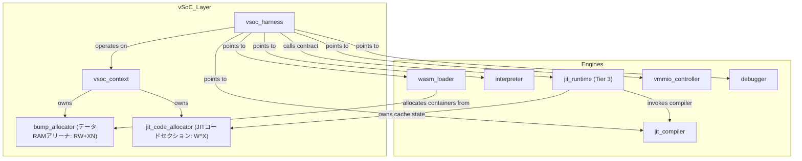
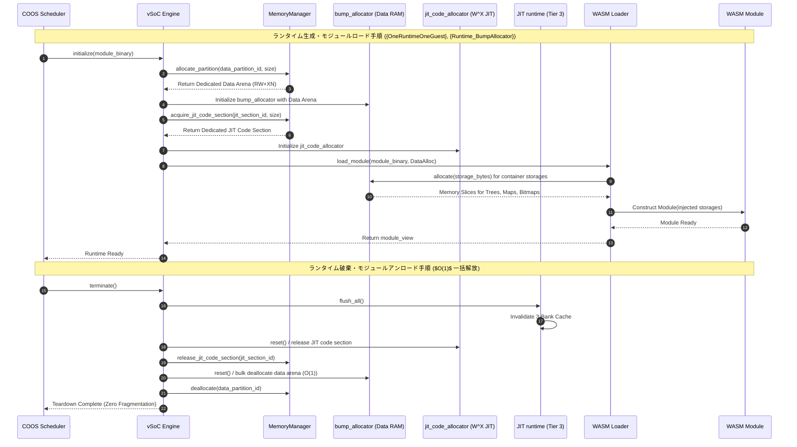
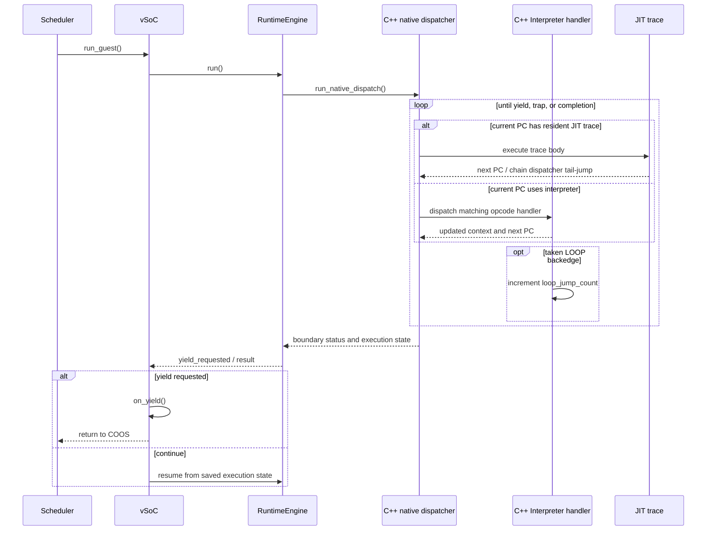
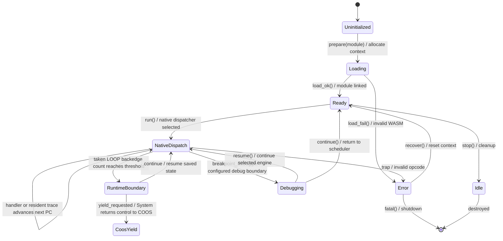
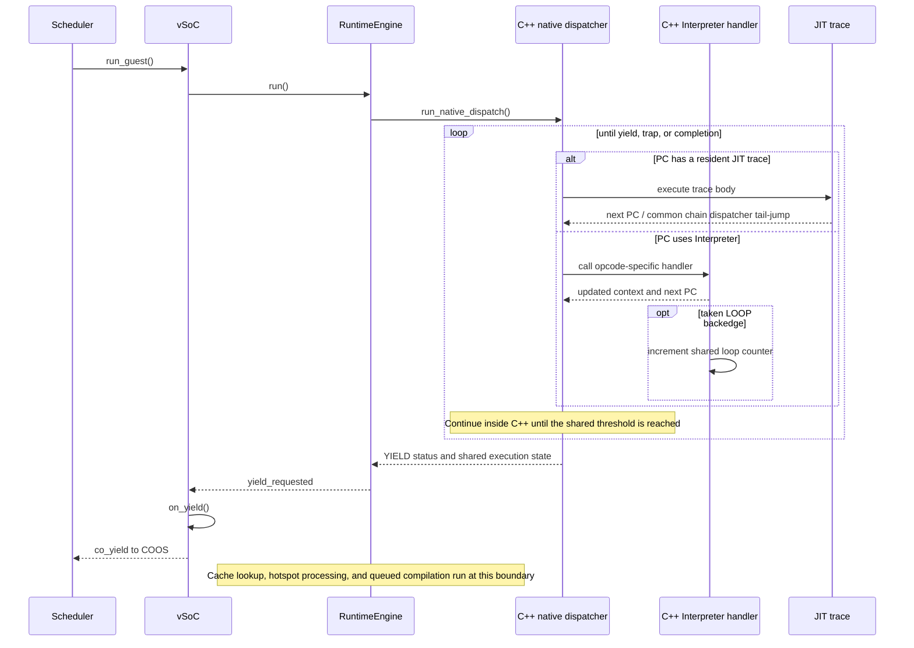
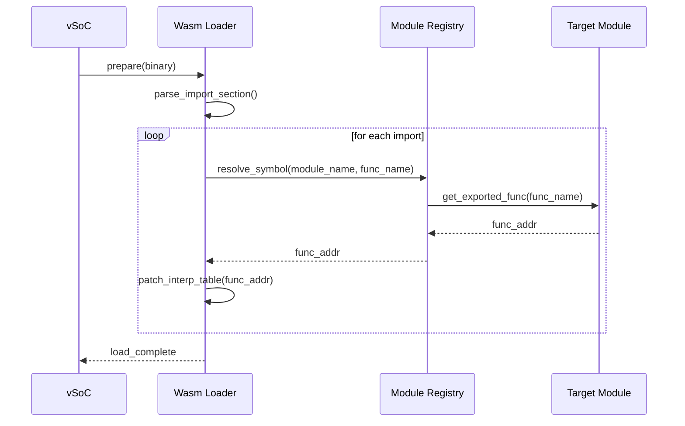

# vSoC コンポーネント設計書 {VERIFY_FORMAL} {VERIFY_LLM}
<!-- evidence:
     formal: formal/vsoc_state_model.py
     formal: formal/vsoc_cache_coherency_model.py
     wit: wit/runtime_vsoc_contract.wit
     test: docs/qa/tier2_runtime/runtime_vsoc_test_spec.md
-->

## 1. コンセプト
<!-- traceability: {LowLatencyJIT} {MemoryIsolation} {META_FaultIsolation} {EnvironmentPointer} {OneRuntimeOneGuest} {Runtime_BumpAllocator} -->
vSoC (Virtual System-on-Chip) は WASM 実行環境の統合マネージャである。Loader、Interpreter、JIT、vMMIO、Debugger を統括して実行制御を行う。
各サブコンポーネントを統合する環境としての役割を担う。`execution_context` 内のリニアメモリ情報やグローバル変数テーブル（`vsoc_runtime` 領域）を介して実行環境を提供する。
本システムは **1ランタイム1ゲストの直交分離原則** を採用する。各 vSoC インスタンスは厳密に 1 つのゲストモジュールのみを担当する。
各ランタイムは**自身専用の固定長データバンプアロケータ**を所有する。モジュール内の全システムコンテナストレージ（RAM/XN）の確保を一元管理する。アンロード時にはこれらを $O(1)$ で一括リセットし、メモリ断片化を根絶する。
JIT ネイティブコードキャッシュ（3-Bank）は、Tier 3のJITランタイムが専用のコード領域から**専用の JIT コードアロケータ**により確保する。Tier 2 vSoCは [`jit_abi.md`](docs/components/tier2_runtime/jit_abi.md) が定義する契約を介してJIT実行サービスを注入する。具体的なInterpreter/JIT切替とWASM継続処理はTier 3 `RuntimeEngine` が担い、キャッシュ・ホットスポット・コンパイル待ち列の状態はTier 3実装が所有する。x64参照構成では実行可能バッファの書込・実行権限を切り替える。ARMv8-Mの物理保護方式、領域配置、同期処理はすべてTBDとする。

## 2. アーキテクチャ分類
<!-- traceability: {META_3TierSeparation} {GLOBAL_ComponentHarness} {META_StaticDI} {OneRuntimeOneGuest} -->
本コンポーネントは **Tier 2 (分解されたサブコンポーネント: Decomposed Subcomponent)** に属する。WASM 仮想実行環境として Loader、Interpreter、JIT、vMMIO、Debugger などのサブコンポーネント群を統合する。統合には**ハーネスパターン（`vsoc_harness`）による静的依存性逆転（Static Dependency Inversion）**を用いる。
組み込みベアメタル環境では、仮想関数（vtable）や動的ディスパッチによるオーバーヘッドを容認しない。そのため Tier 2 の vSoC は Tier 3 具象エンジンの内部ヘッダに依存しない。ハーネスに集約された POD 関数ポインタやインスタンスを介して、ゼロオーバーヘッドで制御を委譲する。
同一モジュールの複数インスタンス実行は、単一ランタイム内のマルチスレッドでは行わない。独立した別ランタイムを並行起動し、COOS IPC 通信で直交化する。

## 3. 静的モデル

### 3.1 データ構造
<!-- traceability: {META_StaticDI} {Runtime_BumpAllocator} {GLOBAL_InterruptWakeup} -->
- **`vsoc_harness`**: vSoCが依存する各種エンジン（Loader, Interpreter, JIT等）のインターフェースを集約した構造体。
- **`vsoc_context`**: 現在の実行状態、仮想割り込み、Tier 3 `JITRuntime` 契約への参照、専用データバンプアロケータおよびJITコードアロケータなど、可変なランタイム状態。JITキャッシュの内部状態は保持しない。
- **`vsoc_config`**: メモリ割り当てやJIT有効化フラグなどの不変な構成情報。

### 3.2 内部ブロック図
<!-- traceability: {META_StaticDI} {Runtime_BumpAllocator} -->


### 3.3 主要なクラス・構造体・配列・定数
<!-- traceability: {META_StaticDI} {Runtime_BumpAllocator} -->

#### vSoCハーネス（vsoc_harness）
各エンジンへのインターフェースを集約する。PODとして扱い、メンバに末尾アンダースコアは付与しない。

| 項目名 | 機能と役割 | 備考（制約、型など） |
| :--- | :--- | :--- |
| WASMローダ | WASMモジュールのロードと解析を担うコンポーネントへの参照。 | `WasmLoader*` |
| インタープリタ | WASMバイトコードを逐次実行するエンジンへの参照。 | `Interpreter*` |
| JITランタイム契約 | Tier 3のホットスポット管理・トレース検索・キャッシュ無効化を呼び出す契約への参照。 | `JitRuntime*` |
| JITコンパイラ | ホットスポットをネイティブコードに変換するTier 3実装への参照。 | `JitCompiler*` |
| デバッガ | RSPプロトコルを介したデバッグ機能を提供するコンポーネントへの参照。 | `Debugger*` |
| vMMIO | 仮想的なメモリマップドI/Oを制御するコンポーネントへの参照。 | `VmmioController*` |

#### vSoCコンテキスト（vsoc_context）
vSoC全体の可変な実行時状態を保持する構造体。

| 項目名 | 機能と役割 | 備考（制約、型など） |
| :--- | :--- | :--- |
| 実行状態 | 現在のvSoCの実行状態（停止、実行中、ブレークポイント等）。 | `VsocState` 列挙型 |
| 割り込みイベント状態 | COOSから受け取った固定5ワードの`interrupt-event`とvIRQ配送状態。 | `interrupt_event` + 固定長状態 |
| JITランタイム契約 | Tier 3のJIT実行サービスへの参照。 | JITランタイム契約型 |
| WASMモジュール参照 | 現在ロードされているWASMモジュールのインスタンスへのポインタ。 | `WasmModule*` |
| 専用データバンプアロケータ | モジュール内の全システムコンテナストレージ（RAM/XN）を切り出す専用アロケータ。アンロード時に一括リセットされる。 | `bump_allocator` インスタンス |
| JITコードアロケータ | 選択されたJIT実行構成のコード領域から3-Bankコードキャッシュを切り出す専用アロケータ。x64参照構成の実行可能バッファ契約は [`jit_abi.md`](docs/components/tier2_runtime/jit_abi.md) に従い、ARMv8-Mの物理割当と保護方式はTBD。 | `jit_code_allocator` 構造体 |

#### vSoCランタイム環境
<!-- traceability: {ContextPointerRegister} {EnvironmentPointer} {MemoryBoundaryCheck} {FastAddressCheck} {ExecutionContext_Layout} {VsocRuntime_Layout} {GOTCHA-VSOC-03} -->
vSoCの実行環境情報は `execution_context` の論理フィールドとして保持する。固定ABIではリニアメモリ、グローバル領域、命令ハンドラ表の参照をそれぞれ独立したフィールドに置き、別の環境構造体を特定オフセットへ埋め込まない。JITトレースとインタープリタは同じ論理状態を参照する。境界で渡す第4論理引数はスタック頂点値であり、物理レジスタへの割当は対象ABIで定義する。`memory.grow` で動的に伸長するリニアメモリの実体や、モジュール横断で共有されるグローバル変数配列など、単一の呼び出しコンテキストを超えて生存する状態を保持する。

| 項目名 | 機能と役割 | 型分類 | サイズ・制約 |
| :--- | :--- | :--- | :--- |
| リニアメモリ基底 | ゲストリニアメモリ（`memory.grow` で再割当されうる）の開始アドレス | アドレス値 | 32bit符号なし（`execution_context` の `+0x28`） |
| リニアメモリサイズ | ゲストリニアメモリの現在の有効バイト数。`FastAddressCheck` の境界比較（`CMP addr, mem_size; BHS __trap`）に直接使う。マスクを使わないため2の冪制約もない | バイト数 | 32bit符号なし（`execution_context` の `+0x2C`） |
| グローバル変数基底 | WASM `global` 配列（4バイト単位でインデックス付け）の開始アドレス | アドレス値 | 32bit符号なし（`execution_context` の `+0x30`） |
| グローバル変数終端 | WASM `global` 配列の終端アドレス | アドレス値 | 32bit符号なし（`execution_context` の `+0x34`） |

`execution_context` の既存状態領域は64バイト（`+0x00`〜`+0x3F`）であり、コードビュー、制御スタックビュー、境界チェックポイント、CallStackビュー、オペランドスタック容量、LOOP後方分岐カウンタとしきい値を含むx86-64の実体は128バイト（`+0x00`〜`+0x7F`）である。JITの委譲先関数アドレスと共通呼出し入口の選択値はトレースヘッダへ置く。
オペランド領域、ローカル値領域、制御ブロック復帰情報領域は、それぞれ専用の境界オフセット対を持つ独立領域である。いずれか1本の伸縮が他の記録位置へ影響することはない（ADR-INTERP-03）。
JIT の複雑処理委譲先はトレースヘッダの `helper_target_addr` からトレースごとにロードする。対象ABIの呼出しコードはヘルパー契約ごとに共通コード領域へ配置し、ヘッダの対応入口選択値で呼び出す。JITコード内へ委譲先の絶対アドレスを埋め込まない。型定義の正本は [`runtime_vsoc_contract.wit`](docs/components/tier2_runtime/wit/runtime_vsoc_contract.wit) であり、固定ABIの物理配置は [`jit_abi.md`](docs/components/tier2_runtime/jit_abi.md) に従う。 `{PositionIndependentCode}`

> [!NOTE]
> **構造体の役割分離**:
> - **`execution_context` の環境フィールド**: JITトレースおよびインタープリタハンドラが実行ループ内で参照するリニアメモリとグローバル領域の情報。固定ABIでは各フィールドを実行コンテキスト内に保持する。
> - **`vsoc_context`**: タスク全体のライフサイクル、保留中の`interrupt-event`とvIRQ配送状態、WASM モジュール構造体へのポインタを管理する**上位マネージャ層の制御構造体**。実行ループ外でのタスク切り替えやデバッガ連携時に参照される。両者は明確に役割分離して維持する。

#### vSoC構成（vsoc_config）
<!-- traceability: {META_ConfigurableSystem} -->
vSoCの動作パラメータを定義する。

| 項目名 | 機能と役割 | 備考（制約、型など） |
| :--- | :--- | :--- |
| JIT有効化フラグ | システム全体でJITコンパイル機能を有効にするかどうかを決定する。 | ブール値 (`FB_CONF_JIT_ENABLED`) |
| コードキャッシュサイズ | x64参照構成の値は `FB_CONF_JIT_CACHE_SIZE` で選択し、共通コード領域とActive/Warm/Oldestバンクに分ける。ARMv8-Mの物理容量はTBD。 | `FB_CONF_JIT_CACHE_SIZE` |
| RAM開始アドレス | ゲストから見たRAMの仮想アドレス空間上の開始位置。 | `0x0000_0000` (Bit 31 == 0) |
| Stage 1アドレス窓サイズ | vMMIOのゲストアドレス境界判定に使うサイズ。WASMリニアメモリのページ数とは別の設定である。ARMv8-Mの物理配置と容量はTBDとする。 | `FB_CONF_GUEST_RAM_SIZE` |
| vMMIO基点アドレス | 仮想デバイスレジスタおよび共有メモリ空間の開始位置（2段階ダイレクトデコード）。 | `0x8000_0000` (Bit 31 == 1) |
| パススルー仮想基点アドレス | ゲスト仮想 PASSTHROUGH 領域（FC=15, `0xF000_0000`〜`0xFFFF_FFFF`）の開始アドレス。物理デバイスへの対応付けは対象プラットフォームで定める。ARMv8-Mの物理アドレスと対応付けはTBD。 | `FB_CONF_VSOC_PASSTHROUGH_BASE` |

## 4. 動的モデル

### 4.1 アルゴリズム
<!-- traceability: {ContextPointerRegister} {GLOBAL_InterruptWakeup} {JIT_CopyAndPatch} {JIT_BackedgeYield} {OneRuntimeOneGuest} {ThreadedInterpreter} {JIT_LazyChaining} {DebuggerInterpreterComposition} {Runtime_BumpAllocator} -->

vSoC コアエンジンの実行委譲、協調イールド、および外部介入制御の基本アルゴリズムを以下に定義する。

| アルゴリズム / 機構 | 契機・条件 | 動作内容 | 目的・安全性不変条件 |
| :--- | :--- | :--- | :--- |
| **C++実行dispatcher** | WASM実行開始時 | C++ dispatch loopがC++ Interpreter handlerと常駐JIT traceを次PCに応じて実行し、yield・trap・完了などの実行境界まで継続する | handler後のlookupで実行境界へ戻らない。handler-mediated遷移をchainと数えない（`GOTCHA-VSOC-01`） |
| **LOOP後方分岐yield** | C++ branch handlerが取得済みLOOP後方辺を処理した時 | handlerが共通contextの回数を増やす。共有しきい値に達するまではC++ dispatcherが続行し、到達時にyield statusを返す | Interpreter単独とHybrid JITが同じ回数条件で協調境界へ戻る。割り込みイベントはCOOS境界で処理する |
| **x64 trace chain** | 互換な直線後続traceがキャッシュ常駐時 | trace末尾が共通コード領域のchain dispatcherへ進み、dispatcherがheaderのtarget bodyへtail-jumpする | chain dispatcherはopcodeを判定せず、C++ Interpreter handlerの分岐処理を迂回しない |
| **デバッガとJITの構成排他** | デバッグ構成の合成時 | Tier 2の構成器は `Interpreter + Debugger` を選択し、`Debugger + JIT` の同時構成を `assert` で拒否する | デバッガがJITキャッシュを管理する経路を生成しない |
| **1ランタイム1ゲスト・専用アリーナ** | ランタイム生成時およびアンロード時 | データと実行可能コード用の領域を別のアロケータで管理し、破棄時に所有する領域を一括返却する | 領域の寿命と所有権をランタイム単位で分離する。ARMv8-Mの物理配置と保護方式はTBD |

- **1ランタイム1ゲストのライフサイクル管理と専用アリーナ (`OneRuntimeOneGuest`)**:
  vSoC インスタンス生成時、メモリマネージャからデータ用領域と実行可能コード用領域を別々に取得し、専用の `bump_allocator` と `jit_code_allocator` を初期化する。具体的な物理配置と保護方式は対象プラットフォームで定める。ARMv8-MはTBDである。
  WASM ローダはデータ用バンプアロケータを受け取り、モジュール内の全システムコンテナストレージ（`ReadOnlyRadixBinaryTreeStorage`, `MutableBitStorage` 等）を順次切り出す。
  一方、JIT コンパイラは実行可能コード領域から専用アロケータを用いてネイティブトレースを確保する。x64では書込み権限と実行権限を同時に付与せず、W^Xを維持する。ARMv8-Mの物理配置と保護方式はTBDである。
  モジュール終了・アンロード時は、JIT キャッシュを無効化（3-Bank Flush）する。その上でバンプアロケータのアリーナごと $O(1)$ で一括リセットして返還し、JIT コードセクションも解放する。
  個別の `free()` や複雑なデストラクタ走査は一切行わない。これにより動的メモリ断片化や他モジュールからのダングリング参照を原理的に根絶する。
- **C++実行dispatcherと4論理引数契約 (`{GOTCHA-VSOC-01}`)**:
  実行入口は `(ctx, sp, local_base, tos)` の4論理引数を受け取る。物理呼出し規約は [`jit_abi.md`](docs/components/tier2_runtime/jit_abi.md) のx64定義に従い、ARMv8-Mの物理配置はTBDとする。
  C++ native dispatch loopはC++ Interpreter handlerと常駐JIT traceを次PCに応じて実行し、yield・trap・完了などの境界でRuntimeEngineへstatusを返す。制御handlerの後もしきい値到達まではC++側に留まり、vSoCへ命令ごとに戻らない。
  共通コード領域のchain dispatcherは別の機械語経路である。直線traceの末尾からdispatcherへ移り、headerのtarget bodyへtail-jumpする。C++ handler後にdispatch loopがtraceをlookupする遷移はchainではない。
#### ランタイム生成とモジュールアンロードのライフサイクル（責務シーケンス図）
<!-- traceability: {OneRuntimeOneGuest} {Runtime_BumpAllocator} {META_FaultIsolation} -->
COOS Scheduler、vSoC Engine、Platform MemoryManager、WASM Loader、WASM Module 間の生成・ストレージ確保と、$O(1)$ 一括解放手順を示す。




#### C++実行dispatcherとLOOP後方分岐yield（責務シーケンス図）
<!-- traceability: {GOTCHA-VSOC-01} {GOTCHA-VSOC-02} {ADR_LoopBackedgeYield} {ThreadedInterpreter} {JIT_CopyAndPatch} -->
COOS Scheduler、System、RuntimeEngine、C++ Interpreter handlerおよびJIT trace間の継続を示す。



### 4.2 状態遷移図 (SysML SMD: vSoC Engine ライフサイクル)
<!-- traceability: {DebuggerInterpreterComposition} {JIT_CopyAndPatch} {JIT_BackedgeYield} {ThreadedInterpreter} {VSOC_Lifecycle} -->

vSoC Engine の実行制御と JIT/Interpreter 切り替えの状態遷移を以下に示す。



**vSoC Engine 状態の説明:**

| 状態 | 説明 | 主要アクション |
| :--- | :--- | :--- |
| **Uninitialized** | 初期化前 | - |
| **Loading** | WASM モジュール読み込み・リンク中 | パーサ実行、セクション検証 |
| **Ready** | 実行準備完了 | `RuntimeEngine.run()`でC++ native dispatchへ入る |
| **NativeDispatch** | C++ Interpreter handlerと常駐JIT traceの実行 | 次PCをC++内でdispatchする。取得したLOOP後方辺だけを数え、handlerごとにはRuntimeEngineへ戻らない |
| **RuntimeBoundary** | yield・trap・完了などのRuntimeEngine境界 | statusと共有実行状態を返す |
| **CoosYield** | SystemがRuntimeEngineのYield要求を受けた状態 | COOSへ制御を返し、割り込みイベントや再スケジュール要求を処理可能にする |
| **Debugging** | デバッガによる停止中 | メモリ検査、変数書き換え。JITキャッシュは管理しない |
| **Error** | エラー発生（復帰可能） | トラップハンドラ実行、状態リセット |
| **Idle** | 停止・待機状態 | スケジューラに制御戻す |

**遷移の詳細:**

| 遷移 | トリガー | 条件 | アクション | 次状態 |
| :--- | :--- | :--- | :--- | :--- |
| Load → Ready | load_ok() | モジュール有効 | リンク完了、コンテキスト初期化 | Ready |
| Ready → InterpreterRun | step(pc) | exec_trace = interpreter | PC 登録、実行開始 | InterpreterRun |
| Ready → JitRun | step(pc) | exec_trace = compiled code | ネイティブコード実行開始 | JitRun |
| Ready → NativeDispatch | run() | 通常実行を開始 | C++ native dispatchへ状態を渡す | NativeDispatch |
| NativeDispatch → NativeDispatch | handlerまたはtrace終了 | LOOPしきい値未到達、trap・完了なし | C++内で次PCをlookupし続ける | NativeDispatch |
| NativeDispatch → RuntimeBoundary | [count >= threshold] | 取得LOOP後方辺が共通しきい値に達した | C++ dispatcherがyield statusを返す | RuntimeBoundary |
| RuntimeBoundary → CoosYield | [yield_requested] | RuntimeEngineがyield statusを受け取る | Systemが`on_yield()`後にCOOSへ制御を返す | CoosYield |
| RuntimeBoundary → NativeDispatch | [continue] | 継続可能な状態 | 保存した状態から同じ実行経路を再開する | NativeDispatch |
| NativeDispatch → Debugging | breakpoint [debugger] | 構成済みdebug境界 | デバッガコマンド待ち | Debugging |
| Debugging → NativeDispatch | resume() | 再開要求 | 選択したRuntimeEngine経路で保存PCから再開 | NativeDispatch |
| (any) → Error | trap() | ページフォルト / 不正オプコード | トラップハンドラ実行 | Error |
| Error → Ready | recover() | リカバリ可能 | コンテキストリセット | Ready |

**重要な設計ポイント:**

- **LOOP後方分岐yield {ADR_LoopBackedgeYield}**: C++ Interpreter handlerが取得後方辺を記録し、C++ dispatcherは共通しきい値到達までC++内で処理する。到達時だけRuntimeEngineへstatusを返し、SystemがCOOSへの協調yieldを行う。

### 4.2.1 LOOP後方分岐とJIT chain
<!-- traceability: {JIT_BackedgeYield} {Challenge_JITCacheEfficiency} {DebuggerInterpreterComposition} {JIT_LazyChaining} -->

`br`、`br_if`、`br_table`および構造終端の意味論は命令別C++ Interpreter handlerが所有する。取得されたLOOP後方辺だけをhandlerが共通contextで数え、共有しきい値に達するまでC++ native dispatch loopが次のC++ handlerまたはJIT traceを実行する。到達時にdispatch loopがyield statusを返し、RuntimeEngineとSystemを経てCOOSへ制御を戻す。Interpreter単独経路も同じしきい値を使う。

handler後のC++ trace lookupはchainではない。chainはx64 trace末尾から共通コード領域のchain dispatcherへ進み、そのdispatcherがtrace headerのresident target bodyへtail-jumpする場合を指す。dispatcherはopcode別handlerや分岐条件を持たない。ARMv8-Mのchain構成、命令列、header、lookup方式、保護方式、物理配置はすべてTBDとする。

この方式は壁時計時間によるプリエンプションを保証しない。しきい値が数えるのは取得したWASM LOOP後方辺であり、割り込みイベントやデバッガ状態を命令ごとにポーリングしない。

**保留イベントの構造:**
```
┌─────────────────────────────────────────┐
│ pending interrupt-event                  │
├─────────────────────────────────────────┤
│ vector_id   | source_id                  │
│ cause_code  | payload0 | payload1        │
└─────────────────────────────────────────┘
```

#### x64参照実装のActive/Warm/Oldestキャッシュ
<!-- traceability: {Challenge_JITCacheEfficiency} {LowLatencyJIT} -->

現在のx64参照構成は `FB_CONF_JIT_CACHE_SIZE` に従ってコード領域を共通コード領域とActive / Warm / Oldestバンクに分ける。容量とoffsetの正本は [`jit_runtime.md`](docs/components/tier3_executer/jit_runtime.md) および [`jit_abi.md`](docs/components/tier2_runtime/jit_abi.md) である。ARMv8-Mの物理容量・領域数・配置はTBDである。

| フェーズ | 状態 | 説明 | アクション |
| :--- | :--- | :--- | :--- |
| **Normal (JitRun)** | Active が書込・実行中、Warm/Oldest が観測 | 新規 JIT コンパイルが Active へ追加 | 既存コードは保持 |
| **co_yield (Rotation)** | 世代ローテーション | Active → Warm → Oldest へスライド | Warm バンクでは無償観測 |
| **Oldest Evaluation** | Oldest lookup hit または破棄判定 | Oldest で lookup にヒットしたトレースは追加hotness判定なしに新 Active へ即時昇格 | 未ヒット（Cold）コードは Purge 破棄。Warm hitは昇格しない |

**可変バンク内レイアウト（共通コード領域の後ろに連続配置）:**
```
JIT Evictable Banks (6 KB of 8 KB total)
┌──────────────────────┐
│  Active Buffer Bank  │  2 KB (Bank 0: current compiling & execution)
│  - Generation[0]     │  - New hot traces
├──────────────────────┤
│  Warm Buffer Bank    │  2 KB (Bank 1: observation window)
│  - Generation[1]     │  - Retained without copying
├──────────────────────┤
│  Oldest Buffer Bank  │  2 KB (Bank 2: oldest bank)
│  - Generation[2]     │  - Promoted if hot, else purged
└──────────────────────┘
```

共通コードのx64命令列はC++ constexpr assemblerで生成し、chain dispatcherは共通領域に一度だけ配置する。ARMv8-M向けの分岐形式、到達範囲、relay配置はすべてTBDである。

#### Debugger と JIT の構成排他
<!-- traceability: {DebuggerInterpreterComposition} {Debug_Integrated} -->

デバッグ実行とJIT実行は同一ランタイムへ同時に構成しない。構成器は次の条件を `assert` で検査する。

1. デバッグ構成は `Interpreter + Debugger` を生成する。
2. JIT実行器を含む構成へデバッガを追加しようとした場合は構成を拒否する。
3. デバッガのアタッチ・デタッチはJITキャッシュを操作せず、実行器の動的切替も行わない。

#### 形式検証 (pyModelChecking) 検証対象

本節で述べたLOOP後方分岐yieldとキャッシュ一貫性の性質は、検証対象の不変条件表に列挙したプロパティとして形式検証されている。個々のモデルファイルとプロパティ名の対応は **[検証対象の不変条件](#61-検証対象の不変条件)** を正本とする。

### 4.3 内部シーケンス
<!-- traceability: {ThreadedInterpreter} {JIT_CopyAndPatch} {JIT_BackedgeYield} {DebuggerInterpreterComposition} -->
#### WASM実行およびJIT遷移シーケンス

<!-- traceability: {JIT_CopyAndPatch} {Interpreter_LazyJITSwitch} {Challenge_JITCacheEfficiency} -->


#### マルチモジュール動的リンクシーケンス
<!-- traceability: {MultiModule_Support} -->
複数のWASMモジュール間の依存関係を解決し、関数ポインタを接続する。



## 5. インターフェース定義

### 5.1 公開API
外部から利用可能なオブジェクト指向APIを定義する。

#### 準備（prepare）
| 項目 | 内容 |
| :--- | :--- |
| 機能概要 | 指定されたWASMバイナリデータを読み込み、実行準備を完了させる。 |
| シグネチャ | `prepare(wasm: binary-view) -> result<wasm-module-view, sys-recovery-strategy>` |
| 引数 | `ctx`: vsoc_context, `wasm`: バイナリデータとサイズ |
| 期待する結果 | 正常：モジュールがロードされ、内部状態がReadyになる。異常：検証失敗時等のエラー。 |
| 事前条件 | システムが初期化済みであること。 |
| 事後条件 | `ctx->module_view` が構築され、実行可能状態になる。 |
| 不変条件 | 既存の実行コンテキストが破壊されないこと。 |
| エラー時の挙動 | 不正なバイナリの場合はロードを中断し、エラー値を返す。 |
| 補足 | ROM上のデータを直接参照するため、RAMへのコピーは発生しない。 |

#### ステップ実行（step）
<!-- traceability: {META_RecoveryStrategy} -->
| 項目 | 内容 |
| :--- | :--- |
| 機能概要 | ゲストのプログラム実行を再開し、C++ native dispatchがyield status、トラップ、または完了を返すまで継続する。C++ dispatchはC++ Interpreter handlerと常駐JIT traceを選択して実行する。 |
| シグネチャ | `step() -> result<execution-state-category, sys-recovery-strategy>` |
| 引数 | `ctx`: vsoc_context, `harness`: vsoc_harness |
| 期待する結果 | 正常：一定期間の実行後に制御が戻る。異常：トラップ発生。 |
| 事前条件 | 状態が Ready であること。 |
| 事後条件 | PCやレジスタ状態が更新されていること。 |
| 不変条件 | ゲストRAMの境界外へのアクセスが発生しないこと。 |
| エラー時の挙動 | トラップ（例外）発生時は、トラップ要因を保持してエラーを返す。 |
| 補足 | C++ InterpreterとHybrid JITは共通のLOOP後方分岐しきい値でCOOS協調境界へ戻る。ARMv8-Mの物理ABIとJIT実装はTBDである。 |

#### `dispatch-interrupt-event`
<!-- traceability: {META_RecoveryStrategy} -->
| 項目 | 内容 |
| :--- | :--- |
| 機能概要 | COOS協調境界で取り出した`interrupt-event`を受け、vIRQの静的階層をゲスト関数へ配送する。 |
| シグネチャ | `dispatch-interrupt-event(ctx: 可変参照, event: interrupt-event) -> dispatch-result` |
| 引数 | `ctx`: vsoc_context, `event`: `vector_id`、`source_id`、`cause_code`、`payload0`、`payload1`の固定5ワード |
| 期待する結果 | `root → 分類 → デバイス → ゲスト関数`の順に、登録済みノードが必要な場合だけ`call_indirect`で呼び出される。 |
| 事前条件 | `event`の`vector_id`が静的原因源表に登録され、COOS協調境界にあること。 |
| 事後条件 | `HANDLED`なら配送を終了し、`PASS_THROUGH`だけが子ノードへ進み、`REJECT`は診断記録後に終了する。 |
| 不変条件 | ISRからゲスト関数を直接呼び出さず、REJECTを原因とする再帰的なFAULT配送を行わない。 |
| エラー時の挙動 | 未登録ノード、無効な関数インデックス、WASMシグネチャ不一致は登録または配送を拒否し、下位ノードへ流さない。 |
| 補足 | `fireball:host/virq` の `register` / `unregister` 要求を保留表へ書き込み、次のCOOS協調境界で検証済みの関数インデックスを原子的に反映する。イベント本体はCOOS FIFOから受け取り、WASIの`poll-check`/`poll-wait`とは別経路である。 |

#### `register-virq-dispatcher`
<!-- traceability: {META_ConfigurableSystem} -->
| 項目 | 内容 |
| :--- | :--- |
| 機能概要 | `fireball:host/virq` から受けたvIRQ登録要求を検証し、次のCOOS協調境界で有効化する。ゲストからvMMIO固定スロットへ直接書き込む経路は存在しない。 |
| シグネチャ | `register-virq-dispatcher(node-id: u32, function-index: u32) -> registration-result`<br>`unregister-virq-dispatcher(node-id: u32) -> registration-result` |
| 引数 | `register`: `node-id` はroot・4分類・静的デバイスのいずれか、`function-index` はWASM関数テーブルのインデックス。`unregister`: `node-id` のみ |
| 事前条件 | `node-id`がホスト設定の静的ノードで、関数が`(u32,u32,u32,u32,u32) -> u32`の期待シグネチャを満たすこと。 |
| 事後条件 | 保留登録として記録され、次のCOOS協調境界で有効表へ原子的に反映される。 |
| 不変条件 | 実行中のゲストからはCOOS協調境界前の登録変更が観測できない。親子関係と原因源表は変更できない。 |
| エラー時の挙動 | 範囲外ノード、未登録ノード、無効関数インデックス、シグネチャ不一致は拒否する。 |

#### `register-hook`
<!-- traceability: {vMMIO_TrapAndEmulate} -->
本APIは vSoC 層の公開ラッパーであり、`harness.vmmio`（vMMIOコントローラへの参照）越しに [`runtime_vmmio.md`](docs/components/tier2_runtime/runtime_vmmio.md) の同名APIへそのまま転送する。実際のレジストリ登録・不変条件・エラー処理は vmmio 層の `register-hook`（`vmmio_context` を引数に取る）が正本であり、本節はその薄いラッパーの引数のみを記述する。

| 項目 | 内容 |
| :--- | :--- |
| 機能概要 | ゲストの特定のメモリ範囲（hook_idで識別）へのアクセスに対し、ホスト側の関数をプラガブルに登録する。`harness.vmmio` へ転送するのみ。 |
| シグネチャ | `register-hook(hook-id: hook-category, handler-addr: mem-address) -> operation-result` |
| 引数 | `harness`: vsoc_harness（`harness.vmmio` を通じて転送先を解決）、`hook-id`: 領域識別子, `handler-addr`: ハンドラアドレス |
| 期待する結果 | 指定範囲へのアクセス時に登録したコールバックが実行されるようになる。 |
| 補足 | 転送先の事前条件・事後条件・不変条件・エラー処理は [`runtime_vmmio.md`](docs/components/tier2_runtime/runtime_vmmio.md) の `register-hook` を正本とする。 |

### 5.2 ネイティブAPI エクスポート
<!-- traceability: {NativeAPI_Export} -->

WASMゲストからホストサービスを呼び出すための最小限のインターフェースを提供する。

Fireballでは、標準WASIのゲスト側アダプタを `libfireball` として提供し、WASM import の host call でホストサービスへ接続する。汎用システムコール、vIRQ、vDMAの要求搬送に vMMIO レジスタは使用しない。

- **host-call import**: `uint32_t fireball_call(uint32_t id, uint32_t arg0, uint32_t arg1, ... uint32_t arg5)`
  - ゲストはこの関数をインポートし、統合システムコールID `id`（上位16bit: `service_id`, 下位16bit: `command_id`）および最大6つの汎用引数を指定して呼び出す（`{Syscall_Mapping}` を正本とする）。
  - **host call は vMMIO レジスタ経路ではない**。上記シグネチャはゲストから見た WASM import ABI であり、ゲストは通常の関数呼び出しとして引数を渡す。実行エンジンは引数をホスト側ハンドラへ直接渡し、戻り値を WASM の結果値へ返す。※整合性検証は [runtime_vsoc_test_spec.md](docs/qa/tier2_runtime/runtime_vsoc_test_spec.md) `TEST-VSOC-40` を参照。
- **専用host-call import**: `fireball:host/virq` と `fireball:host/vdma`
  - vIRQの `register` / `unregister` とvDMAの `start` は、汎用 `fireball_call` のIDディスパッチを経由せず、専用WASM importから対応ハンドラへ直接接続する。
- **WASI互換性**: ゲスト側で `wasi-libc` と Tier 3 のゲストアダプタをリンクし、Tier 2 の `runtime_syscall` と `hal_dispatch` が定義する公開契約へ接続することで実現する。

### 5.3 マルチモジュール対応
<!-- traceability: {MultiModule_Support} -->
複数のWASMモジュール間の依存関係を解決し、動的にリンクする。

- **Module Registry**: ロード済みのモジュールを名前で管理する。
- **Dynamic Linking**: インポートセクションに基づき、他モジュールのエクスポートを解決する。

### 5.4 URI/IPCインターフェース
<!-- traceability: {META_RecoveryStrategy} {vMMIO_TrapAndEmulate} {NativeAPI_Export} {MultiModule_Support} -->
- **URI**: `fireball://vsoc/control/<instance_id>`
- **メッセージ形式**: 実行制御、状態取得用のKey-Valueプロトコル。詳細定義は IPCルータの仕様に準ずる。

### 5.5 関連コンポーネントとの連携
<!-- traceability: {META_RecoveryStrategy} {vMMIO_TrapAndEmulate} {NativeAPI_Export} {MultiModule_Support} -->
| コンポーネント | 連携内容 | 参照データ構造 |
| :--- | :--- | :--- |
| **Interpreter** | インタープリタ実行の委譲とホットスポット履歴の取得 | `interpreter`, 履歴バッファ |
| **JIT Compiler** | トレース単位のコンパイル要求とJITコードキャッシュ管理 | `jit_compiler`, `JIT Code Cache` |
| **Wasm Loader** | モジュールロードと `module_view` の管理 | `loader`, `module_view` |
| **Debugger** | デバッグコマンドの処理と実行状態の同期 | `debugger`, `debug_command_queue` |

## 6. 形式検証（pyModelChecking / 直交表）

### 6.1 検証対象の不変条件

<!-- traceability: {JIT_BackedgeYield} {Challenge_JITCacheEfficiency} {DebuggerInterpreterComposition} {GLOBAL_InterruptWakeup} -->

各不変条件は、下表のモデルファイル内の**プロパティ名で特定できる形**で証明されている。すべてのプロパティは `build_model(guards=False)` による変異検査を伴い、「ガードを外すと違反状態が到達可能になる」ことを示すことで、空虚な真（vacuous truth）でないことを保証する。

| 不変条件 | 説明 | 検証モデル / プロパティ名 |
| :--- | :--- | :--- |
| **JIT LOOP境界の活性** | 取得LOOP後方分岐を続けるJITコードは、有限なしきい値回数でC++分岐ハンドラを通ってCOOS協調境界へ戻ること。イベント検出そのものはモデル化しない。| [`vsoc_state_model.py`](docs/components/tier2_runtime/formal/vsoc_state_model.py) `jit_backedge_yields_to_coos` |
| **IRQ/JIT レース不在** | ネイティブJIT実行中に割り込みハンドラを開始せず、COOS境界から割り込み処理へ遷移すること。| [`vsoc_state_model.py`](docs/components/tier2_runtime/formal/vsoc_state_model.py) `irq_jit_race_freedom_proof` |
| **Debugger構成排他** | デバッガとJITを同時に有効化した構成を生成しないこと。| `RuntimeComposer` の構成時 `assert` |
| **キャッシュ整合性** | generation cookie が全バンク一括で更新され、バンク間で世代が逆行・不一致にならないこと。| [`vsoc_cache_coherency_model.py`](docs/components/tier2_runtime/formal/vsoc_cache_coherency_model.py) `generation_monotonicity_across_banks` |
| **リソース有界性** | 3面ローテーション時、Purge とエントリ表スロット回収が不可分に行われ、未回収スロットが蓄積しないこと。 | [`vsoc_cache_coherency_model.py`](docs/components/tier2_runtime/formal/vsoc_cache_coherency_model.py) `bounded_cache_rotation_memory` |
| **Revoke後のflush完了性** | 共有メモリ権限剥奪で dirty になったキャッシュの flush は必ず完了すること。| [`vsoc_cache_coherency_model.py`](docs/components/tier2_runtime/formal/vsoc_cache_coherency_model.py) `dirty_cache_always_flushes_promptly` |
| **重複コンパイル抑止** | 常駐済みトレースに対する二重コンパイルを抑止しキャッシュを浪費しないこと。| [`vsoc_cache_coherency_model.py`](docs/components/tier2_runtime/formal/vsoc_cache_coherency_model.py) `resident_trace_duplicate_compile_suppression` |
| **状態一貫性** | vSoC Engine ライフサイクル（4.2）の各遷移後に状態が整合していること。 | 直交表 / レビュー（形式検証対象外） |

### 6.2 モデル分割の理由

実行エンジンの状態機械（`vsoc_state_model.py`）とキャッシュ寿命（`vsoc_cache_coherency_model.py`）は、**別モデルに分割している**。世代スタンプとリソース回収を実行状態機械へ統合すると、状態空間が積になり爆発する。これは `document_structure.md` が定める「検証可能性 (Verification Tractability) の維持」に反する。

実行状態モデルとキャッシュ整合性モデルは、COOSへ制御を返す協調境界を共有する。C++ branch handlerはイベントを直接検出せず、LOOP後方分岐数の記録だけを行う。デバッガはキャッシュ整合性モデルの対象外である。

### 6.3 検証モデル概要（vsoc_cache_coherency_model.py）

**状態変数（抽象化）:**
```
phase       : {interp, exec_fresh, rotate, reclaimed, shm_revoke, coos_boundary, flushing, flushed}
gen_status  : {gen_consistent, gen_regressed}          -- 全バンク一括更新か否か
bank_status : {all_banks_accounted, leaked}            -- Purge と回収の不可分性
code_status : {fresh, stale_code}                      -- 実行中コードの世代妥当性
```

**初期状態:** `phase = interp`（キャッシュ参照のみ、世代一致、全バンク回収済み）

**遷移:**
- 通常実行: `interp → exec_fresh → interp`
- ローテーション: `interp → rotate → reclaimed → interp`（Purge と回収は不可分）
- 共有メモリ Revoke: `(interp | exec_fresh) → shm_revoke → coos_boundary → flushing → flushed → interp`

**証明される不変式:**
- `AG(¬stale_code)`   — Revoke 後の flush 完了前に旧世代コードを実行する状態は到達不能
- `AG(¬gen_regressed)` — 世代の逆行・バンク間不一致は到達不能
- `AG(¬leaked)`       — 未回収スロットの蓄積は到達不能
- `AG(dirty → AF(flushed))` — dirty になった flush は必ず完了する

**変異検査（`guards=False`）で到達可能になる違反:** `s_exec_stale`（協調境界の世代照合を撤去）、`s_gen_regressed`（世代の個別更新化）、`s_leaked_bank`（Purge のみ実行し回収を省略）、`s_flush_stalled`（flush の遅延を許容）。

### 6.4 既知の制限

- **時間応答の上限**: LOOP後方分岐の回数しきい値は壁時計時間ではない。実時間の応答上限はCPU速度、分岐間の処理量、COOSの実行状況に依存する。
- **複数コアでのメモリ可視性**: シングルコア仮定。マルチコアではメモリバリア追加が必要。

## 7. 制約達成の方策

### 7.1 性能制約と方策
<!-- traceability: {LowLatencyJIT} {ThreadedInterpreter} -->
- **目標**: WAMRインタープリタを上回る実行速度を実現する。
- **方策**: コピーアンドパッチJITによるネイティブ実行と、スレッドインタープリタによる高速フォールバックを組み合わせる。

### 7.2 メモリ制約と方策
<!-- traceability: {JIT_MultiBuffer_Cache} {GLOBAL_IndependentHeap} {WasmPageAlignment} -->
- **目標**: 構成で定めるメモリ上限内で動作させる。ARMv8-Mの物理容量適合性はTBDとする。
- **方策**: x64参照構成は構成で定めるJITコード領域を使う。容量とバンク分割は [`jit_runtime.md`](docs/components/tier3_executer/jit_runtime.md) に従う。ARMv8-Mの容量と物理配置はTBDとする。
- **高速アドレス判定**: ゲストRAMを `0x0` から配置し、単一の比較命令でRAMアクセスを判定することで、インタープリタおよびJITのオーバーヘッドを最小化する。

### 7.3 安全性制約と方策
<!-- traceability: {MemoryBoundaryCheck} {META_RestrictedPhysicalAccess} -->
- **目標**: ゲストアプリケーションの暴走を完全に隔離する。
- **方策**: JITコードへの境界チェック埋め込みと、vMMIOによる物理アクセスの制限を行う。物理アドレスアクセスの許可範囲は `FB_CONF_VMMIO_ALLOWED_ADDRS`（`{META_ConfigurableSystem}`）に `constexpr` 定義されたテーブルに基づき、vMMIOが検証する。
