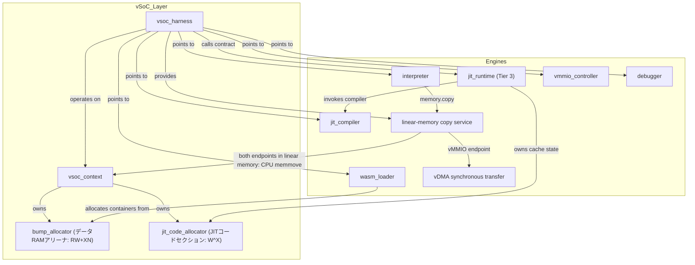
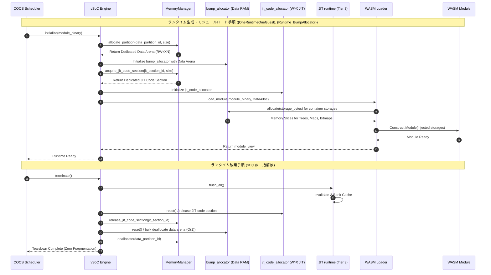
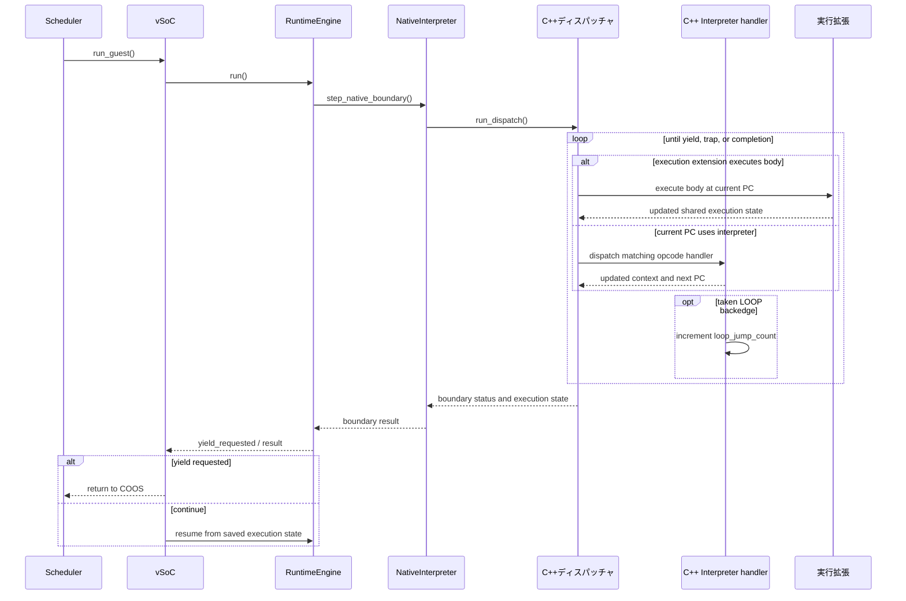
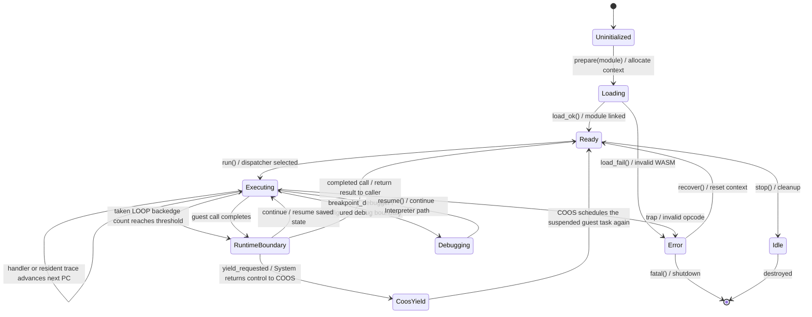
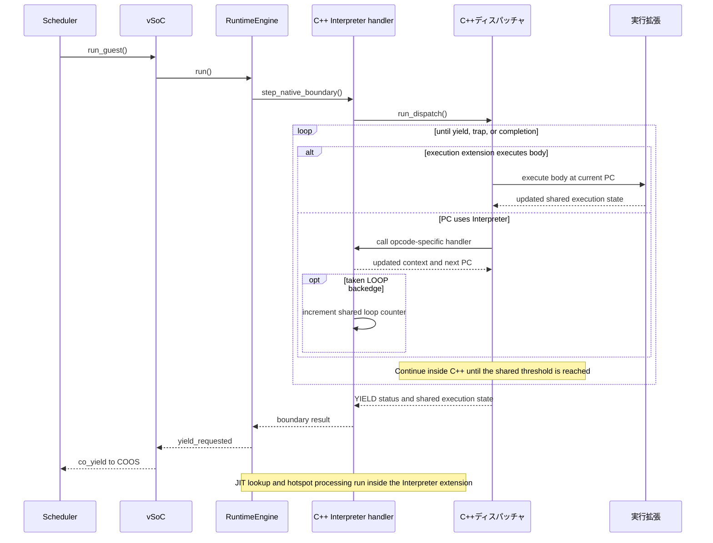
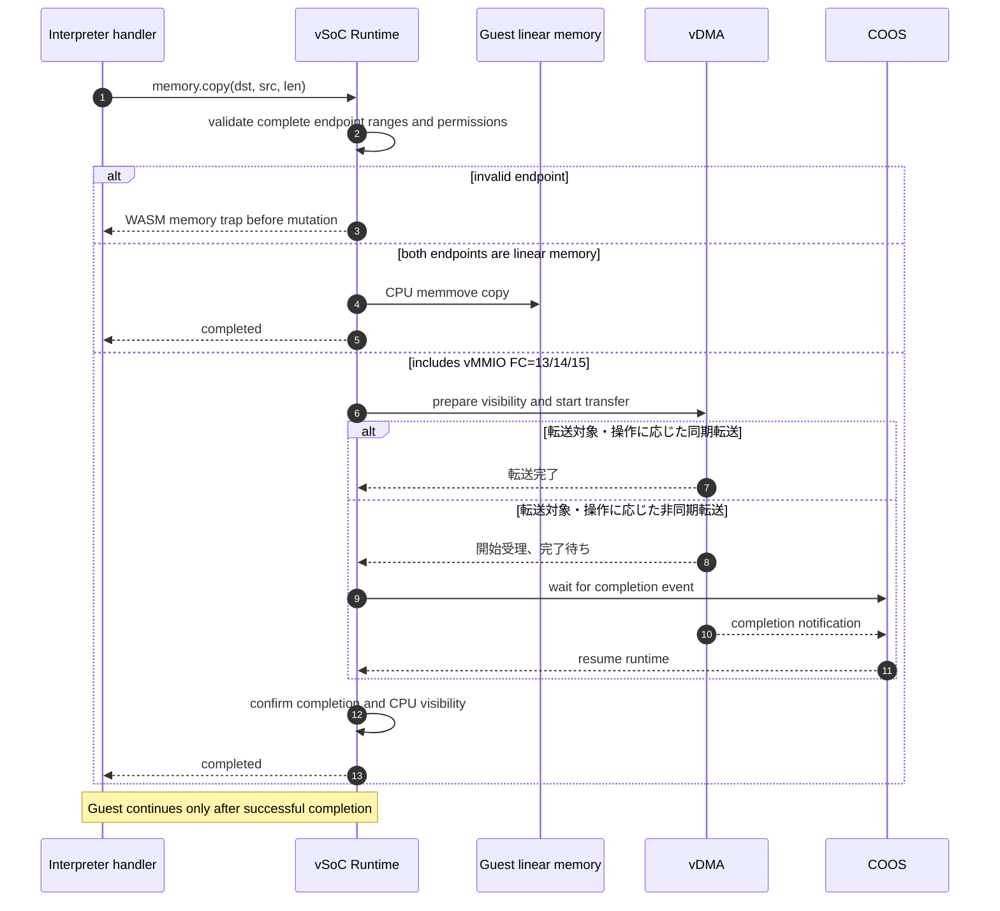
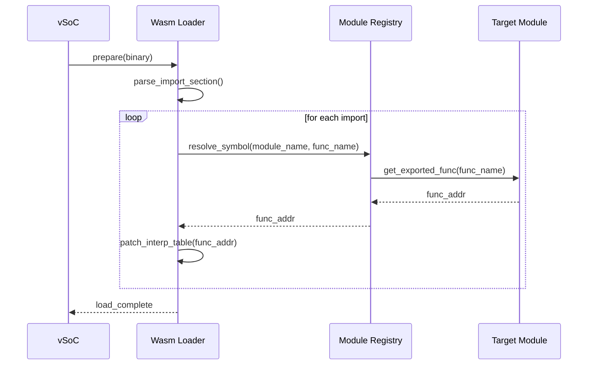

# vSoC コンポーネント設計書 {VERIFY_FORMAL} {VERIFY_LLM}
<!-- evidence:
     implementation: experiments/pysim/tier2_runtime/runtime/engine.py
     formal: formal/vsoc_state_model.py
     formal: formal/vsoc_cache_coherency_model.py
     formal: ../../specs/formal/wasm_bulk_memory_model.py
     wit: wit/runtime_vsoc_contract.wit
     test: docs/qa/tier2_runtime/runtime_vsoc_test_spec.md
     benchmark: benchmarks/linear_memory_bench_spec.md
-->

## 1. コンセプト
<!-- traceability: {LowLatencyJIT} {MemoryIsolation} {META_FaultIsolation} {EnvironmentPointer} {OneRuntimeOneGuest} {Runtime_BumpAllocator} {WasmFCSubset} {VDMA} -->
vSoC (Virtual System-on-Chip) は WASM 実行環境の統合マネージャである。Loader、Interpreter、JIT、vMMIO、Debugger を統括して実行制御を行う。
各サブコンポーネントを統合する環境としての役割を担う。`execution_context` 内のリニアメモリ情報やグローバル変数テーブル（`vsoc_runtime` 領域）を介して実行環境を提供する。
本システムは **1ランタイム1ゲストの直交分離原則** を採用する。各 vSoC インスタンスは厳密に 1 つのゲストモジュールのみを担当する。
各ランタイムは**自身専用の固定長データバンプアロケータ**を所有する。ロードした全モジュールのシステムコンテナストレージ（RAM/XN）の確保を一元管理する。モジュールはランタイムと同じ期間保持し、個別アンロードは行わない。ランタイム破棄時にアリーナ全体を $O(1)$ で一括リセットし、メモリ断片化を根絶する。
JIT機械語キャッシュ（3-Bank）は、Tier 3のJIT拡張が専用のコード領域から**専用の JIT コードアロケータ**により確保する。Tier 2 vSoCは [`jit_abi.md`](docs/components/tier2_runtime/jit_abi.md) が定義する境界で選択済み実行拡張を結線する。RuntimeとInterpreterが実行・yield境界を所有し、JIT拡張がキャッシュ・ホットスポット・コンパイル待ち列を所有する。x64参照構成では実行可能バッファの書込・実行権限を切り替える。ARMv8-Mの物理保護方式、領域配置、同期処理はすべてTBDとする。

## 2. アーキテクチャ分類
<!-- traceability: {META_3TierSeparation} {GLOBAL_ComponentHarness} {META_StaticDI} {OneRuntimeOneGuest} -->
本コンポーネントは **Tier 2 (分解されたサブコンポーネント: Decomposed Subcomponent)** に属する。WASM 仮想実行環境として Loader、Interpreter、JIT、vMMIO、Debugger などのサブコンポーネント群を統合する。統合には型で依存を結線する静的ハーネスパターン（`vsoc_harness`）を用いる。
Tier 2 の vSoC は Tier 3 具象エンジンの内部ヘッダに依存しない。`vsoc_harness` のメンバ型はコンパイル時に固定し、コンポジションルートで具象型を選択する。メンバが非所有ポインタを保持する場合も、実行時の型探索や仮想呼出しは行わない。依存解決による実行時オーバーヘッドは発生しない。
C ABIのコールバック表を境界で使う場合は、静的ハーネス注入とは区別する。間接呼出しの契約とコストは対応するABI仕様へ記述する。
依存性解決の共通方針は [`dependency_resolution.md`](docs/architecture/dependency_resolution.md) に従う。
同一モジュールの複数インスタンス実行は、単一ランタイム内のマルチスレッドでは行わない。独立した別ランタイムを並行起動し、COOS IPC 通信で直交化する。

## 3. 静的モデル

### 3.1 データ構造
<!-- traceability: {META_StaticDI} {Runtime_BumpAllocator} {GLOBAL_InterruptWakeup} -->
- **`vsoc_harness`**: vSoCが依存する各種エンジン（Loader, Interpreter, JIT等）のインターフェースを集約した構造体。
- **`vsoc_context`**: 現在の実行状態、仮想割り込み、Tier 3 `JITRuntime` 契約への参照、専用データバンプアロケータおよびJITコードアロケータなど、可変なランタイム状態。JITキャッシュの内部状態は保持しない。
- **`vsoc_config`**: メモリ割り当てやJIT有効化フラグなどの不変な構成情報。

### 3.2 内部ブロック図
<!-- traceability: {META_StaticDI} {Runtime_BumpAllocator} -->

```mermaid
graph TD
    subgraph vSoC_Layer
        Harness["vsoc_harness"]
        Context["vsoc_context"]
        Alloc["bump_allocator (データRAMアリーナ: RW+XN)"]
        JitAlloc["jit_code_allocator (JITコードセクション: W^X)"]
    end

    subgraph Engines
        Loader["wasm_loader"]
        Interp["interpreter"]
        JIT["jit_compiler"]
        JITRuntime["jit_runtime (Tier 3)"]
        BulkCopy["linear-memory copy service"]
        VDMA["vDMA synchronous transfer"]
        vMMIO["vmmio_controller"]
        Debug["debugger"]
    end

    Harness -- points to --> Loader
    Harness -- points to --> Interp
    Harness -- points to --> JIT
    Harness -- calls contract --> JITRuntime
    Harness -- points to --> vMMIO
    Harness -- points to --> Debug
    Harness -- operates on --> Context
    Harness -- provides --> BulkCopy
    Interp -- memory.copy --> BulkCopy
    BulkCopy -- vMMIO endpoint --> VDMA
    BulkCopy -- both endpoints in linear memory: CPU memmove --> Context
    Context -- owns --> Alloc
    Context -- owns --> JitAlloc
    Loader -- allocates containers from --> Alloc
    JITRuntime -- owns cache state --> JitAlloc
    JITRuntime -- invokes compiler --> JIT
```

### 3.3 主要なクラス・構造体・配列・定数
<!-- traceability: {META_StaticDI} {Runtime_BumpAllocator} -->

#### vSoCハーネス（vsoc_harness）
各エンジンの直接依存型を集約する静的ハーネスである。メンバ型はコンパイル時に固定し、状態を持つ実装への参照を保持する場合は非所有とする。PODとして扱い、メンバに末尾アンダースコアは付与しない。

| 項目名 | 機能と役割 | 備考（制約、型など） |
| :--- | :--- | :--- |
| WASMローダ | WASMモジュールのロードと解析を担うコンポーネントへの参照。 | `WasmLoader*` |
| インタープリタ | WASMバイトコードを逐次実行するエンジンへの参照。 | `Interpreter*` |
| JITランタイム契約 | Tier 3のホットスポット管理・トレース検索・キャッシュ無効化を呼び出す契約への参照。 | `JitRuntime*` |
| JITコンパイラ | ホットスポットを機械語に変換するTier 3実装への参照。 | `JitCompiler*` |
| リニアメモリコピーサービス | `memory.copy`の範囲検査と、端点に応じたCPUコピーまたはvDMA転送を担う内部サービス。 | `LinearMemoryCopyService*` |
| デバッガ | RSPプロトコルを介したデバッグ機能を提供するコンポーネントへの参照。 | `Debugger*` |
| vMMIO | 仮想的なメモリマップドI/Oを制御するコンポーネントへの参照。 | `VmmioController*` |

#### vSoCコンテキスト（vsoc_context）
vSoC全体の可変な実行時状態を保持する構造体。

| 項目名 | 機能と役割 | 備考（制約、型など） |
| :--- | :--- | :--- |
| 実行状態 | 現在のvSoCの実行状態（停止、実行中、ブレークポイント等）。 | `VsocState` 列挙型 |
| 割り込みイベント状態 | COOSから受け取った固定5ワードの`interrupt-event`とvIRQ配送状態。 | `interrupt_event` + 固定長状態 |
| JITランタイム契約 | Tier 3のJIT実行サービスへの参照。 | JITランタイム契約型 |
| WASMモジュール参照 | 現在ロードされているWASMモジュールのインスタンスへのポインタ。 | `WasmModule*` |
| 専用データバンプアロケータ | ランタイム内の全モジュールのシステムコンテナストレージ（RAM/XN）を切り出す専用アロケータ。ランタイム破棄時に一括リセットされる。 | `bump_allocator` インスタンス |
| JITコードアロケータ | 選択されたJIT実行構成のコード領域から3-Bankコードキャッシュを切り出す専用アロケータ。x64参照構成の実行可能バッファ契約は [`jit_abi.md`](docs/components/tier2_runtime/jit_abi.md) に従い、ARMv8-Mの物理割当と保護方式はTBD。 | `jit_code_allocator` 構造体 |

#### vSoCランタイム環境
<!-- traceability: {ContextPointerRegister} {EnvironmentPointer} {MemoryBoundaryCheck} {FastAddressCheck} {ExecutionContext_Layout} -->
vSoCは実行コンテキストとモジュール実行情報を組み合わせてゲスト環境を提供する。`vsoc_runtime` は環境の論理項目をまとめる概念であり、独立した物理構造体や固定オフセットを定義しない。 <!-- definition: {VsocRuntime_Layout} --> {VsocRuntime_Layout} リニアメモリのホスト基点と有効サイズは `execution_context` が保持する。グローバル値と幅情報はモジュール実行情報が保持する。両者のx86-64配置は [`interpreter.md`](docs/components/tier2_runtime/interpreter.md) の `{ExecutionContext_Layout}` に従う。JITとInterpreterは同じ実行状態を参照する。境界で渡す第4論理引数はスタック頂点値であり、物理レジスタ割当は対象ABIで定義する（`{GOTCHA-VSOC-03}`）。 <!-- definition: {GOTCHA-VSOC-03} -->

| 項目名 | 機能と役割 | 型分類 | サイズ・制約 |
| :--- | :--- | :--- | :--- |
| リニアメモリ基点 | リニアメモリ実体の借用ホスト基点。ゲスト論理アドレスとは区別する | 非所有ポインタ | x86-64では `execution_context` の `+0x48` |
| リニアメモリ有効サイズ | 境界検査対象の有効バイト数。ゲスト論理アドレス幅とは区別する | 64bit符号なし | x86-64では `execution_context` の `+0x50` |
| グローバル値と幅 | WASM `global` の値配列と型幅 | モジュール実行情報への非所有ビュー | `execution_context` へ重複配置しない |

確認済みx86-64の `execution_context` は96バイトである。フィールド順とオフセットは [`interpreter.md`](docs/components/tier2_runtime/interpreter.md) を正本とする。物理配置は [`jit_abi.md`](docs/components/tier2_runtime/jit_abi.md) のPIC契約に従う。 `{PositionIndependentCode}`

オペランド領域、ローカル値領域、制御ブロック復帰情報領域は、それぞれ独立した固定容量領域である。各領域の位置と容量はInterpreterが管理する（[interpreter.md](docs/components/tier2_runtime/interpreter.md#adr-interp-03-制御フレームを専用スタックへ分離)）。

> [!NOTE]
> **構造体の役割分離**:
> - **`execution_context` の環境フィールド**: JITトレースおよびインタープリタハンドラが参照するリニアメモリのホスト基点と有効サイズ。
> - **モジュール実行情報**: WASMモジュールのグローバル値と幅を保持する。実行コンテキストに重複格納しない。
> - **`vsoc_context`**: タスク全体のライフサイクル、保留中の`interrupt-event`とvIRQ配送状態、WASM モジュール構造体へのポインタを管理する**上位マネージャ層の制御構造体**。実行ループ外でのタスク切り替えやデバッガ連携時に参照される。両者は明確に役割分離して維持する。

#### vSoC構成（vsoc_config）
<!-- traceability: {META_ConfigurableSystem} -->
vSoCの動作パラメータを定義する。

| 項目名 | 機能と役割 | 備考（制約、型など） |
| :--- | :--- | :--- |
| コードキャッシュサイズ | x64参照構成の値は `FB_CONF_JIT_CACHE_SIZE` で選択し、共通コード領域とActive/Warm/Oldestバンクに分ける。ARMv8-Mの物理容量はTBD。 | `FB_CONF_JIT_CACHE_SIZE` |
| RAM開始アドレス | ゲストから見たRAMの仮想アドレス空間上の開始位置。 | `0x0000_0000` (Bit 31 == 0) |
| Stage 1アドレス窓サイズ | vMMIOのゲストアドレス境界判定に使うサイズ。WASMリニアメモリのページ数とは別の設定である。ARMv8-Mの物理配置と容量はTBDとする。 | `FB_CONF_GUEST_RAM_SIZE` |
| vMMIO基点アドレス | 仮想デバイスレジスタおよび共有メモリ空間の開始位置（2段階ダイレクトデコード）。 | `0x8000_0000` (Bit 31 == 1) |
| パススルー仮想基点アドレス | ゲスト仮想 PASSTHROUGH 領域（FC=15, `0xF000_0000`〜`0xFFFF_FFFF`）の開始アドレス。物理デバイスへの対応付けは対象プラットフォームで定める。ARMv8-Mの物理アドレスと対応付けはTBD。 | `FB_CONF_VSOC_PASSTHROUGH_BASE` |

## 4. 動的モデル

### 4.1 アルゴリズム
<!-- traceability: {ContextPointerRegister} {GLOBAL_InterruptWakeup} {JIT_CopyAndPatch} {JIT_BackedgeYield} {OneRuntimeOneGuest} {ThreadedInterpreter} {JIT_LazyChaining} {DebuggerInterpreterComposition} {Runtime_BumpAllocator} -->

vSoC コアエンジンの実行委譲、協調イールド、および外部介入制御の基本アルゴリズムを以下に定義する。

| アルゴリズム / 機構 | 契機・条件 | 動作内容 | 目的・安全性不変条件 |
| :--- | :--- | :--- | :--- |
| **C++実行dispatcher** | WASM実行開始時 | C++ dispatch loopが次PCで実行拡張を呼び出し、拡張が実行しなかった本体をInterpreter handlerで実行して、yield・trap・完了などの実行境界まで継続する | 本体の選択は実行拡張が所有し、handler後に実行境界へ戻らない。handler-mediated遷移をchainと数えない（`GOTCHA-VSOC-01`） |
| **LOOP後方分岐yield** | C++ branch handlerが取得済みLOOP後方辺を処理した時 | handlerが実行contextの回数を増やす。Interpreter設定のしきい値に達するまではC++ dispatcherが続行し、到達時にyield statusを返す。RuntimeEngineはstatusをSystemへ伝える | Interpreter単独とHybrid JITがInterpreter設定の同じ回数条件で協調境界へ戻る。割り込みイベントはCOOS境界で処理する {GOTCHA-VSOC-02} <!-- definition: {GOTCHA-VSOC-02} --> |
| **x64 trace chain** | 互換な直線後続traceがキャッシュ常駐時 | trace末尾が共通コード領域のchain dispatcherへ進み、dispatcherがheaderのtarget bodyへtail-jumpする | chain dispatcherはopcodeを判定せず、C++ Interpreter handlerの分岐処理を迂回しない |
| **デバッガとInterpreter拡張の接続排他** | Interpreter構成時 | デバッガ付きInterpreterへのネイティブ実行拡張の接続を`assert`で拒否する | 同一InterpreterでDebuggerとJITを同時に実行しない |
| **1ランタイム1ゲスト・専用アリーナ** | ランタイム生成時および破棄時 | データと実行可能コード用の領域を別のアロケータで管理し、ランタイム破棄時に所有する領域を一括返却する | 領域の寿命と所有権をランタイム単位で分離する。ARMv8-Mの物理配置と保護方式はTBD |
| **選択`0xFC`メモリ命令** | `memory.copy` / `memory.fill`実行時 | 全アクセス範囲を先に検査する。copyの両端点がリニアメモリならCPU memmoveで処理する。FC=13/14/15の端点を含む場合はvMMIOの権限・所有権・範囲を検査して内部vDMAへ委譲する。fillはCPUで処理する | 範囲外の部分更新を許さない。vDMAの成功復帰は転送完了とCPU可視性を意味する。リニアメモリ間転送にDMA選択のしきい値を設けない |

- **1ランタイム1ゲストのライフサイクル管理と専用アリーナ (`OneRuntimeOneGuest`)**:
  vSoC インスタンス生成時、メモリマネージャからデータ用領域と実行可能コード用領域を別々に取得し、専用の `bump_allocator` と `jit_code_allocator` を初期化する。具体的な物理配置と保護方式は対象プラットフォームで定める。ARMv8-MはTBDである。
  WASM ローダはデータ用バンプアロケータを受け取り、モジュール内の全システムコンテナストレージ（`ReadOnlyRadixBinaryTreeStorage`, `MutableBitStorage` 等）を順次切り出す。
  一方、JIT コンパイラは実行可能コード領域から専用アロケータを用いて機械語トレースを確保する。x64では書込み権限と実行権限を同時に付与せず、W^Xを維持する。ARMv8-Mの物理配置と保護方式はTBDである。
  ゲスト実行終了後もロード済みモジュールのメタデータはランタイム内に保持する。ランタイム破棄時にJIT キャッシュを無効化（3-Bank Flush）し、データバンプアロケータとJITコードアロケータのアリーナを $O(1)$ で一括リセットして返還する。
  個別の `free()` や複雑なデストラクタ走査は一切行わない。これにより動的メモリ断片化や他モジュールからのダングリング参照を原理的に根絶する。
- **C++実行dispatcherと4論理引数契約 (`{GOTCHA-VSOC-01}`)**: <!-- definition: {GOTCHA-VSOC-01} -->
  実行入口は `(ctx, sp, local_base, tos)` の4論理引数を受け取る。物理呼出し規約は [`jit_abi.md`](docs/components/tier2_runtime/jit_abi.md) のx64定義に従い、ARMv8-Mの物理配置はTBDとする。
  C++ディスパッチループはC++ Interpreter handlerと常駐JIT traceを次PCに応じて実行し、yield・trap・完了などの境界でRuntimeEngineへstatusを返す。Interpreterが所有するしきい値に達するまではC++側に留まり、vSoCへ命令ごとに戻らない。RuntimeEngineはしきい値を保持しない。
  共通コード領域のchain dispatcherは別の機械語経路である。直線traceの末尾からdispatcherへ移り、headerのtarget bodyへtail-jumpする。C++ handler後に実行拡張が次の本体を選ぶ遷移はchainではない。
#### ランタイム生成と破棄のライフサイクル（責務シーケンス図）
<!-- traceability: {OneRuntimeOneGuest} {Runtime_BumpAllocator} {META_FaultIsolation} -->
COOS Scheduler、vSoC Engine、Platform MemoryManager、WASM Loader、WASM Module 間の生成・ストレージ確保と、$O(1)$ 一括解放手順を示す。


```mermaid
sequenceDiagram
    autonumber
    participant Sched as COOS Scheduler
    participant vSoC as vSoC Engine
    participant Mem as MemoryManager
    participant DataAlloc as bump_allocator (Data RAM)
    participant JitAlloc as jit_code_allocator (W^X JIT)
    participant JitRuntime as JIT runtime (Tier 3)
    participant Loader as WASM Loader
    participant Mod as WASM Module

    Note over Sched,Mod: ランタイム生成・モジュールロード手順 ({OneRuntimeOneGuest}, {Runtime_BumpAllocator})
    Sched->>vSoC: initialize(module_binary)
    vSoC->>Mem: allocate_partition(data_partition_id, size)
    Mem-->>vSoC: Return Dedicated Data Arena (RW+XN)
    vSoC->>DataAlloc: Initialize bump_allocator with Data Arena
    vSoC->>Mem: acquire_jit_code_section(jit_section_id, size)
    Mem-->>vSoC: Return Dedicated JIT Code Section
    vSoC->>JitAlloc: Initialize jit_code_allocator
    vSoC->>Loader: load_module(module_binary, DataAlloc)
    Loader->>DataAlloc: allocate(storage_bytes) for container storages
    DataAlloc-->>Loader: Memory Slices for Trees, Maps, Bitmaps
    Loader->>Mod: Construct Module(injected storages)
    Mod-->>Loader: Module Ready
    Loader-->>vSoC: Return module_view
    vSoC-->>Sched: Runtime Ready

    Note over Sched,Mod: ランタイム破棄手順 ($O(1)$ 一括解放)
    Sched->>vSoC: terminate()
    vSoC->>JitRuntime: flush_all()
    JitRuntime->>JitRuntime: Invalidate 3-Bank Cache
    vSoC->>JitAlloc: reset() / release JIT code section
    vSoC->>Mem: release_jit_code_section(jit_section_id)
    vSoC->>DataAlloc: reset() / bulk deallocate data arena (O(1))
    vSoC->>Mem: deallocate(data_partition_id)
    vSoC-->>Sched: Teardown Complete (Zero Fragmentation)
```


#### C++実行dispatcherとLOOP後方分岐yield（責務シーケンス図）
<!-- traceability: {GOTCHA-VSOC-01} {GOTCHA-VSOC-02} {ADR_LoopBackedgeYield} {ThreadedInterpreter} {JIT_CopyAndPatch} -->
COOS Scheduler、System、RuntimeEngine、C++ Interpreter handlerおよびJIT trace間の継続を示す。


```mermaid
sequenceDiagram
    participant S as Scheduler
    participant V as vSoC
    participant R as RuntimeEngine
    participant I as NativeInterpreter
    participant C as C++ディスパッチャ
    participant H as C++ Interpreter handler
    participant J as 実行拡張

    S->>V: run_guest()
    V->>R: run()
    R->>I: step_native_boundary()
    I->>C: run_dispatch()
    loop until yield, trap, or completion
        alt execution extension executes body
            C->>J: execute body at current PC
            J-->>C: updated shared execution state
        else current PC uses interpreter
            C->>H: dispatch matching opcode handler
            H-->>C: updated context and next PC
        end
        opt taken LOOP backedge
            H->>H: increment loop_jump_count
        end
    end
    C-->>I: boundary status and execution state
    I-->>R: boundary result
    R-->>V: yield_requested / result
    alt yield requested
        V-->>S: return to COOS
    else continue
        V->>R: resume from saved execution state
    end
```

### 4.2 状態遷移図 (SysML SMD: vSoC Engine ライフサイクル)
<!-- traceability: {DebuggerInterpreterComposition} {JIT_CopyAndPatch} {JIT_BackedgeYield} {ThreadedInterpreter} -->

vSoC Engine の実行制御と JIT/Interpreter 切り替えの状態遷移を以下に示す。 {VSOC_Lifecycle} <!-- definition: {VSOC_Lifecycle} -->


```mermaid
stateDiagram-v2
    [*] --> Uninitialized

    Uninitialized --> Loading: prepare(module) / allocate context

    Loading --> Ready: load_ok() / module linked
    Loading --> Error: load_fail() / invalid WASM

    Ready --> Executing: run() / dispatcher selected
    Ready --> Idle: stop() / cleanup

    Executing --> Executing: handler or resident trace advances next PC
    Executing --> RuntimeBoundary: taken LOOP backedge count reaches threshold
    Executing --> RuntimeBoundary: guest call completes
    Executing --> Debugging: breakpoint_debugger / configured debug boundary
    Executing --> Error: trap / invalid opcode
    RuntimeBoundary --> CoosYield: yield_requested / System returns control to COOS
    RuntimeBoundary --> Executing: continue / resume saved state
    RuntimeBoundary --> Ready: completed call / return result to caller
    CoosYield --> Ready: COOS schedules the suspended guest task again

    Debugging --> Executing: resume() / continue Interpreter path

    Error --> Ready: recover() / reset context
    Error --> [*]: fatal() / shutdown

    Idle --> [*]: destroyed
```

**vSoC Engine 状態の説明:**

| 状態 | 説明 | 主要アクション |
| :--- | :--- | :--- |
| **Uninitialized** | 初期化前 | - |
| **Loading** | WASM モジュール読み込み・リンク中 | パーサ実行、セクション検証 |
| **Ready** | 実行準備完了 | `RuntimeEngine.run()`でC++ディスパッチへ入る |
| **Executing** | C++ Interpreter handlerと常駐JIT traceの実行 | 次PCで実行拡張またはInterpreter handlerをC++内から呼ぶ。取得したLOOP後方辺だけを数え、handlerごとにはRuntimeEngineへ戻らない |
| **RuntimeBoundary** | yieldまたはゲスト呼出完了時のRuntimeEngine境界 | statusと共有実行状態をSystemへ返す |
| **CoosYield** | SystemがRuntimeEngineのYield要求を受けた状態 | COOSへ制御を返し、割り込みイベントや再スケジュール要求を処理可能にする |
| **Debugging** | デバッガによる停止中 | メモリ検査、変数書き換え。JITキャッシュは管理しない |
| **Error** | エラー発生（復帰可能） | トラップハンドラ実行、状態リセット |
| **Idle** | 停止・待機状態 | スケジューラに制御戻す |

**遷移の詳細:**

| 遷移 | トリガー | 条件 | アクション | 次状態 |
| :--- | :--- | :--- | :--- | :--- |
| Loading → Ready | load_ok() | モジュール有効 | リンク完了、コンテキスト初期化 | Ready |
| Ready → Executing | run() | 通常実行を開始 | C++ディスパッチへ状態を渡す | Executing |
| Executing → Executing | handlerまたはtrace終了 | LOOPしきい値未到達、trap・完了なし | C++内で次PCの本体実行を拡張へ委譲する | Executing |
| Executing → RuntimeBoundary | [count >= interpreter.yield_threshold] | 取得LOOP後方辺がInterpreter設定のしきい値に達した | C++ dispatcherがyield statusを返す | RuntimeBoundary |
| Executing → RuntimeBoundary | call_complete() | ゲスト関数が正常終了した | RuntimeEngineが完了状態と結果をSystemへ返す | RuntimeBoundary |
| RuntimeBoundary → CoosYield | [yield_requested] | RuntimeEngineがyield statusを受け取る | SystemがCOOSへ制御を返す | CoosYield |
| RuntimeBoundary → Executing | [continue] | 継続可能な状態 | 保存した状態から同じ実行経路を再開する | Executing |
| RuntimeBoundary → Ready | [call_complete] | ゲスト関数の呼出しが完了した | 呼出結果を呼出元へ返し、実行状態をReadyへ戻す | Ready |
| CoosYield → Ready | [task scheduled] | COOSが停止中のゲストタスクを再選択した | 保存済みの継続状態から実行を再開できる状態にする | Ready |
| Executing → Debugging | breakpoint [debugger] | 構成済みdebug境界 | デバッガコマンド待ち | Debugging |
| Debugging → Executing | resume() | 再開要求 | `Interpreter + Debugger` 構成の同じInterpreter経路で保存PCから再開 | Executing |
| (any) → Error | trap() | ページフォルト / 不正オプコード | トラップハンドラ実行 | Error |
| Error → Ready | recover() | リカバリ可能 | コンテキストリセット | Ready |

**重要な設計ポイント:**

- **LOOP後方分岐yield {ADR_LoopBackedgeYield}**: C++ Interpreter handlerが取得後方辺を記録し、C++ dispatcherはInterpreterが所有するしきい値到達までC++内で処理する。到達時だけRuntimeEngineへstatusを返し、SystemがCOOSへの協調yieldを行う。 <!-- definition: {ADR_LoopBackedgeYield} -->

### 4.2.1 LOOP後方分岐とJIT chain
<!-- traceability: {JIT_BackedgeYield} {Challenge_JITCacheEfficiency} {DebuggerInterpreterComposition} {JIT_LazyChaining} -->

`br`、`br_if`、`br_table`、構造終端の意味論は命令別C++ Interpreter handlerが所有する。handlerは取得したLOOP後方辺だけを共通contextで数える。協調yield回数しきい値はInterpreter構成で指定する。

Interpreter設定のしきい値に達するまでは、C++ディスパッチループが次のC++ handlerまたはJIT traceを実行する。しきい値へ達すると、dispatch loopはyield statusを返す。

制御はRuntimeEngineとSystemを経てCOOSへ戻る。Interpreter単独経路も同じしきい値を使う。

handler後に実行拡張が次の本体を選ぶ遷移はchainではない。chainはx64 trace末尾から共通コード領域のchain dispatcherへ進む経路を指す。

chain dispatcherはtrace headerのresident target bodyへtail-jumpする。dispatcherはopcode別handlerや分岐条件を持たない。

ARMv8-Mのchain構成、命令列、header、lookup方式、保護方式、物理配置はすべてTBDである。

この方式は壁時計時間によるプリエンプションを保証しない。しきい値が数えるのは取得したWASM LOOP後方辺であり、割り込みイベントやデバッガ状態を命令ごとにポーリングしない。

**保留イベントの構造:**
```
┌─────────────────────────────────────────┐
│ pending interrupt-event                  │
├─────────────────────────────────────────┤
│ vector_id   | source_id                  │
│ cause_code  | payload0 | payload1        │
└─────────────────────────────────────────┘
```

#### JITキャッシュ管理への委譲
<!-- traceability: {Challenge_JITCacheEfficiency} {LowLatencyJIT} {JIT_MultiBuffer_Cache} {JIT_OldestOnly_Promote} -->
JITキャッシュの状態、検索、バンク回転、昇格、および破棄は [`jit_runtime.md`](docs/components/tier3_plugins/jit_runtime.md) を正本とする。対象ABIの物理配置は [`jit_abi.md`](docs/components/tier2_runtime/jit_abi.md) を参照する。

Interpreter dispatcherは接続済みネイティブ実行拡張を呼び出す。RuntimeEngineはInterpreterをscheduler境界まで進める。vSoCは境界結果に従ってyieldを行い、キャッシュの内部状態や回転契機を扱わない。ARMv8-Mの物理容量と配置はTBDである。

#### Debugger と JIT の構成排他
<!-- traceability: {DebuggerInterpreterComposition} {Debug_Integrated} -->

デバッグ実行とJIT実行は同一Interpreterへ同時に接続しない。Interpreterは次の条件を `assert` で検査する。

1. デバッガ接続済みInterpreterへネイティブ実行拡張を接続しようとした場合はassertで拒否する。
2. ネイティブ実行拡張を接続済みのInterpreterへDebuggerをattachしようとした場合もassertで拒否する。
3. デバッガのアタッチ・デタッチはJITキャッシュを操作せず、実行器の動的切替も行わない。

#### 形式検証 (pyModelChecking) 検証対象

本節で述べたLOOP後方分岐yieldとキャッシュ一貫性の性質は、検証対象の不変条件表に列挙したプロパティとして形式検証されている。個々のモデルファイルとプロパティ名の対応は **[検証対象の不変条件](#71-検証対象の不変条件)** を正本とする。

### 4.3 内部シーケンス
<!-- traceability: {ThreadedInterpreter} {JIT_CopyAndPatch} {JIT_BackedgeYield} {DebuggerInterpreterComposition} -->
#### WASM実行およびJIT遷移シーケンス

<!-- traceability: {JIT_CopyAndPatch} {Interpreter_LazyJITSwitch} {Challenge_JITCacheEfficiency} -->

```mermaid
sequenceDiagram
    participant S as Scheduler
    participant V as vSoC
    participant R as RuntimeEngine
    participant I as NativeInterpreter
    participant D as C++ディスパッチャ
    participant I as C++ Interpreter handler
    participant J as 実行拡張

    S->>V: run_guest()
    V->>R: run()
    R->>I: step_native_boundary()
    I->>D: run_dispatch()
    loop until yield, trap, or completion
        alt execution extension executes body
            D->>J: execute body at current PC
            J-->>D: updated shared execution state
        else PC uses Interpreter
            D->>I: call opcode-specific handler
            I-->>D: updated context and next PC
            opt taken LOOP backedge
                I->>I: increment shared loop counter
            end
        end
        Note over D: Continue inside C++ until the shared threshold is reached
    end
    D-->>I: YIELD status and shared execution state
    I-->>R: boundary result
    R-->>V: yield_requested
    V-->>S: co_yield to COOS

    Note over I: JIT lookup and hotspot processing run inside the Interpreter extension
```

#### WASM `memory.copy`の端点別実行
<!-- traceability: {WasmFCSubset} {VDMA} {MemoryBoundaryCheck} -->
ゲストはvDMAの転送完了とCPU可視性を確認した後にだけ成功復帰する。
ランタイム内部の転送は、転送対象と操作に応じて同期または非同期で実行する。
同期転送は、完了とCPU可視性の確認後に直接復帰する。
非同期転送は、既存のCOOS待機と完了通知の経路を使う。
FC=13/14/15はvDMAへの委譲条件であり、内部の完了方式は転送実体と操作から決まる。
ゲストから見た同期性は、CPUのbusy waitを要求しない。
外部デバイスの応答について、無条件の有限完了を保証しない。
タイムアウトだけを根拠に転送停止やバッファ再利用を認めない。


```mermaid
sequenceDiagram
    autonumber
    participant I as Interpreter handler
    participant R as vSoC Runtime
    participant M as Guest linear memory
    participant D as vDMA
    participant C as COOS

    I->>R: memory.copy(dst, src, len)
    R->>R: validate complete endpoint ranges and permissions
    alt invalid endpoint
        R-->>I: WASM memory trap before mutation
    else both endpoints are linear memory
        R->>M: CPU memmove copy
        R-->>I: completed
    else includes vMMIO FC=13/14/15
        R->>D: prepare visibility and start transfer
        alt 転送対象・操作に応じた同期転送
            D-->>R: 転送完了
        else 転送対象・操作に応じた非同期転送
            D-->>R: 開始受理、完了待ち
            R->>C: wait for completion event
            D-->>C: completion notification
            C-->>R: resume runtime
        end
        R->>R: confirm completion and CPU visibility
        R-->>I: completed
    end
    Note over I,R: Guest continues only after successful completion
```

#### マルチモジュール動的リンクシーケンス
<!-- traceability: {MultiModule_Support} -->
複数のWASMモジュール間の依存関係を解決し、関数ポインタを接続する。


```mermaid
sequenceDiagram
    participant V as vSoC
    participant L as Wasm Loader
    participant R as Module Registry
    participant M as Target Module

    V->>L: prepare(binary)
    L->>L: parse_import_section()
    loop for each import
        L->>R: resolve_symbol(module_name, func_name)
        R->>M: get_exported_func(func_name)
        M-->>R: func_addr
        R-->>L: func_addr
        L->>L: patch_interp_table(func_addr)
    end
    L-->>V: load_complete
```

## 5. インターフェース定義

### 5.1 公開API
外部から利用可能なオブジェクト指向APIを定義する。

#### 準備（prepare）
| 項目 | 内容 |
| :--- | :--- |
| 機能概要 | 指定されたWASMバイナリデータを読み込み、実行準備を完了させる。 |
| シグネチャ | `prepare(wasm: binary-view) -> result<wasm-module-view, sys-recovery-strategy>` |
| 引数 | `ctx`: vsoc_context, `wasm`: バイナリデータとサイズ |
| 期待する結果 | 正常：モジュールがロードされ、内部状態がReadyになる。異常：検証失敗時等のエラー。 |
| 事前条件 | システムが初期化済みであること。 |
| 事後条件 | `ctx->module_view` が構築され、実行可能状態になる。 |
| 不変条件 | 既存の実行コンテキストが破壊されないこと。 |
| エラー時の挙動 | 不正なバイナリの場合はロードを中断し、エラー値を返す。 |
| 補足 | ROM上のデータを直接参照するため、RAMへのコピーは発生しない。 |

#### ステップ実行（step）
<!-- traceability: {META_RecoveryStrategy} -->
| 項目 | 内容 |
| :--- | :--- |
| 機能概要 | ゲストのプログラム実行を再開し、C++ディスパッチがyield status、トラップ、または完了を返すまで継続する。C++ dispatchは本体実行を実行拡張へ委譲し、未実行の本体をInterpreter handlerで実行する。 |
| シグネチャ | `step() -> result<execution-state-category, sys-recovery-strategy>` |
| 引数 | `ctx`: vsoc_context, `harness`: vsoc_harness |
| 期待する結果 | 正常：一定期間の実行後に制御が戻る。異常：トラップ発生。 |
| 事前条件 | 状態が Ready であること。 |
| 事後条件 | PCやレジスタ状態が更新されていること。 |
| 不変条件 | ゲストRAMの境界外へのアクセスが発生しないこと。 |
| エラー時の挙動 | トラップ（例外）発生時は、トラップ要因を保持してエラーを返す。 |
| 補足 | C++ InterpreterとHybrid JITはInterpreter構成のLOOP後方分岐しきい値でCOOS協調境界へ戻る。ARMv8-Mの物理ABIとJIT実装はTBDである。 |

#### `dispatch-interrupt-event`
<!-- traceability: {META_RecoveryStrategy} -->
| 項目 | 内容 |
| :--- | :--- |
| 機能概要 | COOS協調境界で取り出した`interrupt-event`を受け、vIRQの静的階層をゲスト関数へ配送する。 |
| シグネチャ | `dispatch-interrupt-event(ctx: 可変参照, event: interrupt-event) -> dispatch-result` |
| 引数 | `ctx`: vsoc_context, `event`: `vector_id`、`source_id`、`cause_code`、`payload0`、`payload1`の固定5ワード |
| 期待する結果 | `root → 分類 → デバイス → ゲスト関数`の順に、登録済みノードが必要な場合だけ`call_indirect`で呼び出される。 |
| 事前条件 | `event`の`vector_id`が静的原因源表に登録され、COOS協調境界にあること。 |
| 事後条件 | `HANDLED`なら配送を終了し、`PASS_THROUGH`だけが子ノードへ進み、`REJECT`は診断記録後に終了する。 |
| 不変条件 | ISRからゲスト関数を直接呼び出さず、REJECTを原因とする再帰的なFAULT配送を行わない。 |
| エラー時の挙動 | 未登録ノード、無効な関数インデックス、WASMシグネチャ不一致は登録または配送を拒否し、下位ノードへ流さない。 |
| 補足 | `fireball:host/virq` の `register` / `unregister` 要求を保留表へ書き込み、次のCOOS協調境界で検証済みの関数インデックスを原子的に反映する。イベント本体はCOOS FIFOから受け取り、WASIの`poll-check`/`poll-wait`とは別経路である。 |

#### `register-virq-dispatcher`
<!-- traceability: {META_ConfigurableSystem} -->
| 項目 | 内容 |
| :--- | :--- |
| 機能概要 | `fireball:host/virq` から受けたvIRQ登録要求を検証し、次のCOOS協調境界で有効化する。ゲストからvMMIO固定スロットへ直接書き込む経路は存在しない。 |
| シグネチャ | `register-virq-dispatcher(node-id: u32, function-index: u32) -> registration-result`<br>`unregister-virq-dispatcher(node-id: u32) -> registration-result` |
| 引数 | `register`: `node-id` はroot・4分類・静的デバイスのいずれか、`function-index` はWASM関数テーブルのインデックス。`unregister`: `node-id` のみ |
| 事前条件 | `node-id`がホスト設定の静的ノードで、関数が`(u32,u32,u32,u32,u32) -> u32`の期待シグネチャを満たすこと。 |
| 事後条件 | 保留登録として記録され、次のCOOS協調境界で有効表へ原子的に反映される。 |
| 不変条件 | 実行中のゲストからはCOOS協調境界前の登録変更が観測できない。親子関係と原因源表は変更できない。 |
| エラー時の挙動 | 範囲外ノード、未登録ノード、無効関数インデックス、シグネチャ不一致は拒否する。 |

#### `register-hook`
<!-- traceability: {vMMIO_TrapAndEmulate} -->
本APIは vSoC 層の公開ラッパーであり、`harness.vmmio`（vMMIOコントローラへの参照）越しに [`runtime_vmmio.md`](docs/components/tier2_runtime/runtime_vmmio.md) の同名APIへそのまま転送する。実際のレジストリ登録・不変条件・エラー処理は vmmio 層の `register-hook`（`vmmio_context` を引数に取る）が正本であり、本節はその薄いラッパーの引数のみを記述する。

| 項目 | 内容 |
| :--- | :--- |
| 機能概要 | ゲストの特定のメモリ範囲（hook_idで識別）へのアクセスに対し、ホスト側の関数をプラガブルに登録する。`harness.vmmio` へ転送するのみ。 |
| シグネチャ | `register-hook(hook-id: hook-category, handler-addr: mem-address) -> operation-result` |
| 引数 | `harness`: vsoc_harness（`harness.vmmio` を通じて転送先を解決）、`hook-id`: 領域識別子, `handler-addr`: ハンドラアドレス |
| 期待する結果 | 指定範囲へのアクセス時に登録したコールバックが実行されるようになる。 |
| 補足 | 転送先の事前条件・事後条件・不変条件・エラー処理は [`runtime_vmmio.md`](docs/components/tier2_runtime/runtime_vmmio.md) の `register-hook` を正本とする。 |

#### 内部ゲストメモリコピーサービス (`memory.copy`)
<!-- traceability: {WasmFCSubset} {VDMA} {MemoryBoundaryCheck} -->
このサービスはInterpreterからの内部呼出しであり、guest-facing WIT import `fireball:host/vdma.start` と別の契約である。vMMIOレジスタ経路も使わない。

| 項目 | 内容 |
| :--- | :--- |
| 機能概要 | 同一ゲストの`memory.copy`をmemmove意味論で同期完了する。 |
| シグネチャ | `copy_guest_memory(dst: u32, src: u32, len: u32) -> result<void, wasm-trap | runtime-error>` |
| 事前条件 | 単一メモリindex `0`。端点は符号なし32-bitゲストアドレス、`len`はbyte数とする。 |
| リニアメモリ端点 | Bit 31が`0`の端点をリニアメモリbyte offsetとして扱い、`offset <= mem_size && len <= mem_size - offset`を検査する。 |
| vMMIO端点 | FC=13（DYNAMIC）、FC=14（SHM）、FC=15（PASSTHROUGH）を受け付ける。PTE、権限、所有権、ページ内範囲は [`runtime_vmmio.md`](docs/components/tier2_runtime/runtime_vmmio.md) の共通アクセスゲートで検査する。FC=12および予約FCは拒否する。 |
| 実行経路 | リニアメモリ端点同士はCPUでmemmoveする。いずれかの端点がvMMIOの場合はvDMAへ委譲する。転送を開始する前に両端点を検査し、成功時は完了後に戻る。 |
| 不変条件 | 不正な端点ではコピーを開始せず、メモリを部分変更しない。`len == 0`でも端点を検査する。 |

### 5.2 ホストAPIエクスポート
<!-- traceability: {NativeAPI_Export} {Syscall_Mapping} {WIT_Interface_Spec} {WIT_First} {VDMA} {GLOBAL_InterruptWakeup} {WASI_Implementation} {HAL_Interface} -->

WASMゲストからホストサービスを呼び出すための最小限のインターフェースを提供する。

Fireballでは、標準WASIのゲスト側アダプタを `libfireball` として提供し、WASM import の host call でホストサービスへ接続する。汎用システムコール、vIRQ、vDMAの要求搬送に vMMIO レジスタは使用しない。

- **host-call import**: 汎用host callのIDと呼出規約は [`runtime_syscall.md`](docs/components/tier2_runtime/runtime_syscall.md) のID対応契約を参照する。ゲスト公開シグネチャは [`fireball_hostcall_contract.wit`](docs/components/tier3_platform/wit/fireball_hostcall_contract.wit) の `trap` を正本とする。
  - vSoCはWASM importをホスト側ハンドラへ接続し、その結果をゲストへ返す。host callはvMMIOレジスタ経路を使用しない。接続の検証は [runtime_vsoc_test_spec.md](docs/qa/tier2_runtime/runtime_vsoc_test_spec.md) の `TEST-VSOC-40` を参照する。
- **専用host-call import**: `fireball:host/virq` と `fireball:host/vdma`
  - vIRQの `register` / `unregister` とvDMAの `start` は、汎用 `fireball_call` のIDディスパッチを経由せず、専用WASM importから対応ハンドラへ直接接続する。
- **WASI互換性**: ゲスト側で `wasi-libc` と Tier 3 のゲストアダプタをリンクし、Tier 2 の `runtime_syscall` と `hal_dispatch` が定義する公開契約へ接続することで実現する。

### 5.3 マルチモジュール対応
<!-- traceability: {MultiModule_Support} -->
複数のWASMモジュール間の依存関係を解決し、動的にリンクする。

- **Module Registry**: ロード済みのモジュールを名前で管理する。
- **Dynamic Linking**: インポートセクションに基づき、他モジュールのエクスポートを解決する。

### 5.4 URI/IPCインターフェース
<!-- traceability: {META_RecoveryStrategy} {vMMIO_TrapAndEmulate} {NativeAPI_Export} {MultiModule_Support} -->
- **URI**: `fireball://vsoc/control/<instance_id>`
- **メッセージ形式**: 実行制御、状態取得用のKey-Valueプロトコル。詳細定義は IPCルータの仕様に準ずる。

### 5.5 関連コンポーネントとの連携
<!-- traceability: {META_RecoveryStrategy} {vMMIO_TrapAndEmulate} {NativeAPI_Export} {MultiModule_Support} -->
| コンポーネント | 連携内容 | 参照データ構造 |
| :--- | :--- | :--- |
| **Interpreter** | インタープリタ実行の委譲とホットスポット履歴の取得 | `interpreter`, 履歴バッファ |
| **JIT Compiler** | トレース単位のコンパイル要求とJITコードキャッシュ管理 | `jit_compiler`, `JIT Code Cache` |
| **Wasm Loader** | モジュールロードと `module_view` の管理 | `loader`, `module_view` |
| **Debugger** | デバッグコマンドの処理と実行状態の同期 | `debugger`, `debug_command_queue` |


## 6. 制約達成の方策

### 6.1 性能制約と方策
<!-- traceability: {LowLatencyJIT} {ThreadedInterpreter} -->
- **目標**: WAMRインタープリタを上回る実行速度を実現する。
- **方策**: コピーアンドパッチJITによる機械語実行と、スレッドインタープリタによる高速フォールバックを組み合わせる。

### 6.2 メモリ制約と方策
<!-- traceability: {JIT_MultiBuffer_Cache} {GLOBAL_IndependentHeap} {WasmPageAlignment} -->
- **目標**: 構成で定めるメモリ上限内で動作させる。ARMv8-Mの物理容量適合性はTBDとする。
- **方策**: x64参照構成は構成で定めるJITコード領域を使う。容量とバンク分割は [`jit_runtime.md`](docs/components/tier3_plugins/jit_runtime.md) に従う。ARMv8-Mの容量と物理配置はTBDとする。
- **高速アドレス判定**: ゲストRAMを `0x0` から配置し、単一の比較命令でRAMアクセスを判定することで、インタープリタおよびJITのオーバーヘッドを最小化する。

### 6.3 安全性制約と方策
<!-- traceability: {MemoryBoundaryCheck} {META_RestrictedPhysicalAccess} -->
- **目標**: ゲストアプリケーションの暴走を完全に隔離する。
- **方策**: JITコードへの境界チェック埋め込みと、vMMIOによる物理アクセスの制限を行う。物理アドレスアクセスの許可範囲は `FB_CONF_VMMIO_ALLOWED_ADDRS`（`{META_ConfigurableSystem}`）に `constexpr` 定義されたテーブルに基づき、vMMIOが検証する。

## 7. 形式検証・テスト仕様との対応

独立コンセプト層は、検証因子・成果物マトリクスの責務判定に従って対象外とする。
現行C++ dispatcherと共通chain dispatcherの実行経路は、参照実装の直接テストと形式モデルで確認する。
この証拠からARMv8-Mの実機適合性を推定しない。

### 7.1 検証対象の不変条件

<!-- traceability: {JIT_BackedgeYield} {Challenge_JITCacheEfficiency} {DebuggerInterpreterComposition} {GLOBAL_InterruptWakeup} -->

各不変条件は、下表のモデルファイル内の**プロパティ名で特定できる形**で証明されている。すべてのプロパティは `build_model(guards=False)` による変異検査を伴い、「ガードを外すと違反状態が到達可能になる」ことを示すことで、空虚な真（vacuous truth）でないことを保証する。

| 不変条件 | 説明 | 検証モデル / プロパティ名 |
| :--- | :--- | :--- |
| **JIT LOOP境界の活性** | 取得LOOP後方分岐を続けるJITコードは、有限なしきい値回数でC++分岐ハンドラを通ってCOOS協調境界へ戻ること。イベント検出そのものはモデル化しない。| [`vsoc_state_model.py`](docs/components/tier2_runtime/formal/vsoc_state_model.py) `jit_backedge_yields_to_coos` |
| **IRQ/JIT レース不在** | JITコード実行中に割り込みハンドラを開始せず、COOS境界から割り込み処理へ遷移すること。| [`vsoc_state_model.py`](docs/components/tier2_runtime/formal/vsoc_state_model.py) `irq_jit_race_freedom_proof` |
| **Debugger構成排他** | デバッガとJITを同時に有効化した構成を生成しないこと。| `RuntimeComposer` の構成時 `assert` |
| **キャッシュ整合性** | generation cookie が全バンク一括で更新され、バンク間で世代が逆行・不一致にならないこと。| [`vsoc_cache_coherency_model.py`](docs/components/tier2_runtime/formal/vsoc_cache_coherency_model.py) `generation_monotonicity_across_banks` |
| **リソース有界性** | 3面ローテーション時、Purge とエントリ表スロット回収が不可分に行われ、未回収スロットが蓄積しないこと。 | [`vsoc_cache_coherency_model.py`](docs/components/tier2_runtime/formal/vsoc_cache_coherency_model.py) `bounded_cache_rotation_memory` |
| **Revoke後のflush完了性** | 抽象遷移モデルで、共有メモリ権限剥奪により dirty になった状態から flush 完了状態へ到達すること。実時間の期限や有限のtick数は証明しない。| [`vsoc_cache_coherency_model.py`](docs/components/tier2_runtime/formal/vsoc_cache_coherency_model.py) `dirty_cache_eventually_flushes` |
| **重複コンパイル抑止** | 常駐済みトレースに対する二重コンパイルを抑止しキャッシュを浪費しないこと。| [`vsoc_cache_coherency_model.py`](docs/components/tier2_runtime/formal/vsoc_cache_coherency_model.py) `resident_trace_duplicate_compile_suppression` |
| **状態一貫性** | vSoC Engine ライフサイクル（4.2）の各遷移後に状態が整合していること。 | 直交表 / レビュー（形式検証対象外） |
| **Bulk Memory境界とDMA完了** | 範囲外部分更新、リニアメモリ間コピーのDMA選択、DMA完了・可視化前の再開を禁止する。飽和変換カテゴリの結果も保持する。 | [`wasm_bulk_memory_model.py`](docs/specs/formal/wasm_bulk_memory_model.py): `oob_copy_never_partially_mutates`, `linear_copy_never_uses_dma`, `guest_never_resumes_while_dma_pending`, `guest_never_resumes_before_dma_visible`, `nan_saturates_to_zero`, `positive_overflow_saturates_to_maximum`, `signed_underflow_saturates_to_minimum`, `unsigned_underflow_saturates_to_zero`, `finite_saturating_conversion_completes` |

### 7.2 モデル分割の理由

実行エンジンの状態機械（`vsoc_state_model.py`）とキャッシュ寿命（`vsoc_cache_coherency_model.py`）は、**別モデルに分割している**。世代スタンプとリソース回収を実行状態機械へ統合すると、状態空間が積になり爆発する。これは `document_structure.md` が定める「検証可能性 (Verification Tractability) の維持」に反する。

実行状態モデルとキャッシュ整合性モデルは、COOSへ制御を返す協調境界を共有する。C++ branch handlerはイベントを直接検出せず、LOOP後方分岐数の記録だけを行う。デバッガはキャッシュ整合性モデルの対象外である。

### 7.3 検証モデル概要（vsoc_cache_coherency_model.py）

このモデルは値を持つ状態変数ではなく、Kripke状態と原子命題で抽象状態を表す。状態名と命題ラベルはモデルファイルの表記を示す。flush完了性はCTLの eventuality であり、実時間の上限や「promptly」のような応答時間保証ではない。

**通常状態:** `s_interp`, `s_exec_fresh`, `s_check_resident`, `s_skip_compile`, `s_rotate`, `s_reclaimed`, `s_shm_revoke`, `s_coos_boundary`, `s_flushing`, `s_flushed`。

**不変条件ラベル:** `gen_consistent` / `gen_regressed`、`all_banks_accounted` / `leaked_bank`、`fresh` / `stale_code`、`dirty` / `flushed`。

**初期状態:** `s_interp`（キャッシュ参照のみ、世代一致、全バンク回収済み）

**遷移:**
- 通常実行: `s_interp → s_exec_fresh → s_interp`
- 常駐確認: `s_interp → s_check_resident → s_skip_compile → s_exec_fresh`
- ローテーション: `s_interp → s_rotate → s_reclaimed → s_interp`（Purge と回収は不可分）
- 共有メモリ Revoke: `(s_interp | s_exec_fresh) → s_shm_revoke → s_coos_boundary → s_flushing → s_flushed → s_interp`

**証明される不変式:**
- `AG(¬stale_code)`   — Revoke 後の flush 完了前に旧世代コードを実行する状態は到達不能
- `AG(¬gen_regressed)` — 世代の逆行・バンク間不一致は到達不能
- `AG(¬leaked_bank)`  — 未回収スロットの蓄積は到達不能
- `AG(dirty → AF(flushed))` — dirty になった flush は必ず完了する
- `AG(¬duplicate_compile)` — 常駐済みトレースを重複コンパイルする状態は到達不能

**変異検査（`guards=False`）で到達可能になる違反:** `s_exec_stale`（協調境界の世代照合を撤去）、`s_gen_regressed`（世代の個別更新化）、`s_leaked_bank`（Purge のみ実行し回収を省略）、`s_flush_stalled`（flush の遅延を許容）、`s_duplicate_compile`（常駐確認を省略）。

### 7.4 既知の制限

- **時間応答の上限**: LOOP後方分岐の回数しきい値は壁時計時間ではない。実時間の応答上限はCPU速度、分岐間の処理量、COOSの実行状況に依存する。
- **複数コアでのメモリ可視性**: シングルコア仮定。マルチコアではメモリバリア追加が必要。


## 8. 設計判断と参考実装

特記すべき独立したADRはない。採用方針は本書の各契約節に記載する。
