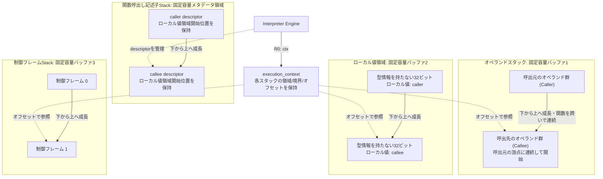
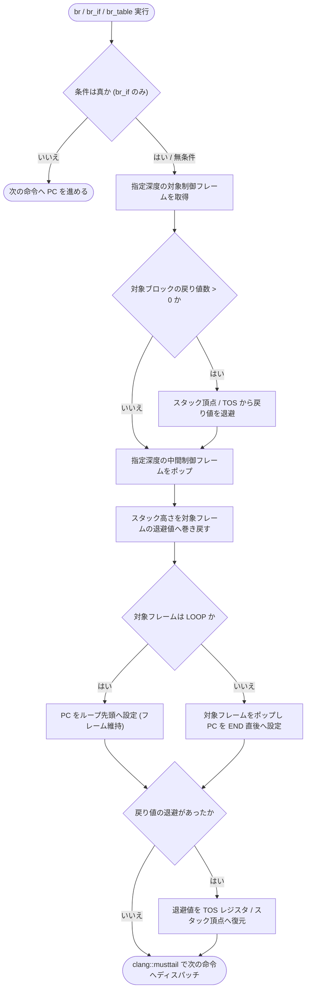
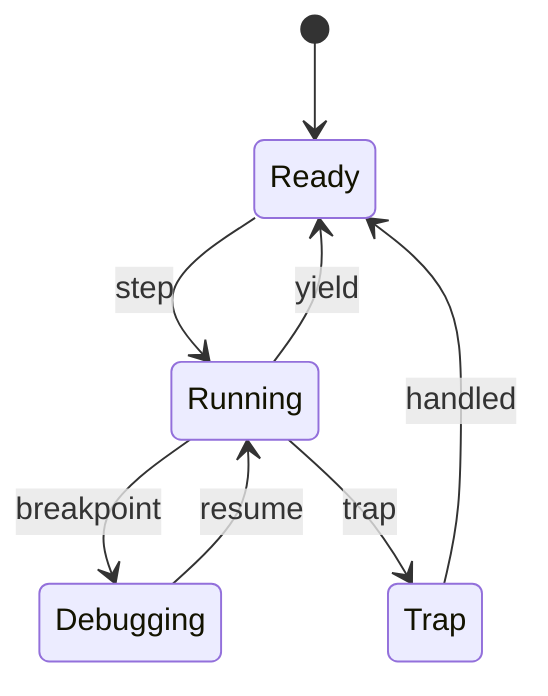
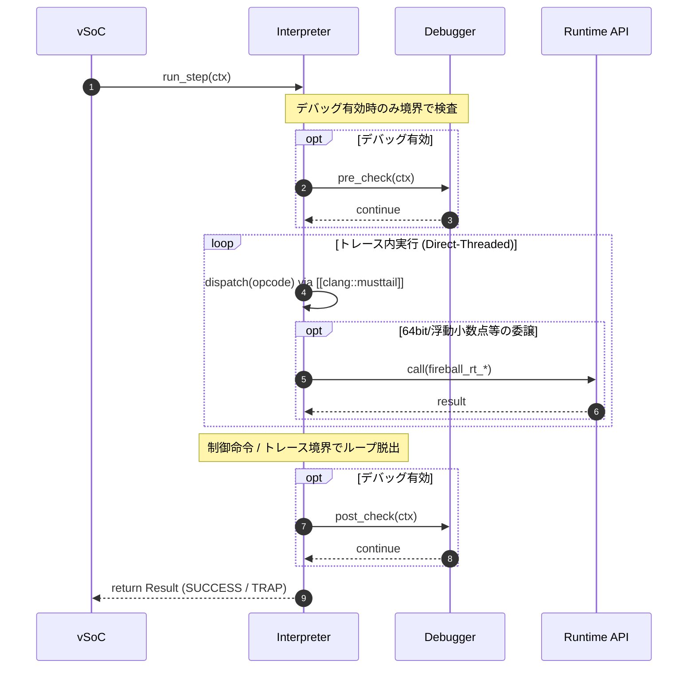

# Interpreter 実行系設計書 {VERIFY_FORMAL} {VERIFY_LLM}
<!-- evidence:
     formal: ../tier2_runtime/formal/vsoc_state_model.py
     formal: formal/interpreter_stack_model.py
     concept: concepts/interpreter_concept.py
     test: docs/qa/tier3_executer/interpreter_test_spec.md
-->

## 1. コンセプト
<!-- traceability: {ThreadedInterpreter} {LowLatencyJIT} {InterpreterContextStackless} {EnvironmentPointer} {DirectBytecodeExecution} -->
Interpreter は、WASM命令をスレッドインタープリタ方式で実行する。低レイテンシかつ小フットプリントでゲストを動作させる。本コンポーネントは Execution Engine (`executor`) の一部として設計する。JITと実行状態を完全に共有する。周辺コンポーネントへの参照は Environment Pointer (`vsoc_runtime* env`) を介して型安全に行う。

組み込み環境の極小メモリ制約（`{GLOBAL_Policy_Memory}`）を遵守する。WASM命令は Flash や ROM 上のバイト列（`const uint8_t* ip`）から直接フェッチ（`*ip++`）する。中間命令オブジェクト（`Instr`）は生成しない。命令ごとの二分探索マップ（`FlatMapView`）も一切使用しない。即値（LEB128 等）はその場でポインタから直接デコードする。次の命令アドレスは単なるポインタ加算（`ip += len`）で決定する。

制御構文（`block`, `loop`, `if`）の飛び先は静的解決された軽量制御表（`control_map`）を参照する。この制御表はモジュールロード時に一度だけ構築される。これにより命令実行に伴うヒープ確保や探索オーバーヘッドを完全ゼロ（$O(1)$）とする（`{GOTCHA-INTP-05}`）。

## 2. アーキテクチャ分類
<!-- traceability: {META_3TierSeparation} -->
本コンポーネントは **Tier 3 (プラグイン・リーフコンポーネント: Plugin Leaf Component)** に属する。Tier 2 のランタイム実行契約を実装し、WASM バイトコードの逐次実行を担当する。JIT との共用実行コンテキストは Tier 2 契約を介して利用する。

## 3. 静的モデル

### 3.1 データ構造
- **`Interpreter`**: WASM命令の実行、コンテキスト管理、外部環境との連携をカプセル化した主要クラスである。
- **`execution_context`**: 仮想CPUレジスタ、3本の値スタック情報、リニアメモリ情報を保持する構造体（計64バイト）である。JIT共通領域とヘルパーはトレースヘッダが保持する。
- **`オペランドスタック`（オペランドスタック）**: WASM のオペランド値のみを保持する固定容量スタックである。コールチェーン全体を貫く1本の連続バッファとして動作する。呼び出しを跨いでもスタックは連続して配置される。
- **`ローカル値領域`（ローカル変数スタック）**: コールチェーン全体で共有する固定容量の、型情報を持たない32ビットワード領域である。型タグ、実行時オブジェクト、関数実行記述子を格納しない。論理ローカル1個につき、そのフレームのスロット幅の固定スロットを割り当てる。スロット幅は、フレーム内で最大の変数サイズで決める。i32/f32だけのフレームは4バイト、i64/f64を含むフレームは8バイトとする。v128を含む場合は16バイトとする。同一フレーム内でスロット幅を混在させない。アクセス先は `local_base + local_index * スロット幅` から直接計算する。
- **制御ブロック復帰情報領域**: `block`/`loop`/`if` の入れ子構造を管理する固定容量領域である。
- **関数実行記述子領域**: 関数ごとの実行メタデータを保持する独立した固定容量領域である。各記述子は`ローカル値領域`内のフレーム開始位置を保持し、`ローカル値領域`にはローカル値だけを置く。
- **`interpreter_config`**: 3本のスタック容量やyield閾値などの不変な構成情報である。

### 3.2 内部ブロック図

3本の値領域は互いに独立した固定容量バッファであり、それぞれ自身の容量に対してオーバーフローを検知する。関数実行記述子領域は値領域とは別に容量を検査する。`オペランドスタック`は関数呼び出しを跨いで連続するため、戻り値を呼出元へコピーする必要がない。呼出先の戻り値は共有`オペランドスタック`に残り、関数復帰処理が記述子を破棄して呼出元の実行を再開する。

### 3.3 主要なクラス・構造体・配列・定数

#### インタープリタ（Interpreter）クラス
依存関係（vSoC環境等）と実行に必要なテーブルをカプセル化する。

公開 `call()` は、呼出状態の生成、実行完了、トラップ確定、および結果検証を所有するテンプレートメソッドである。通常の `Interpreter` は命令ステップ駆動を実装し、Tier 3 の `JITInterpreter` は同じ `call()` 契約を継承して実行ドライバだけを差し替える。これにより、Tier 2 と Tier 3 のベンチマークは同一の公開呼出境界を通る。

| 項目名 | 機能と役割 | 型分類 | サイズ・制約 |
| :--- | :--- | :--- | :--- |
| 統合コンテキスト | 実行コンテキストおよびリニアメモリ情報（ctx） | 構造体への参照 | `execution_context` (非所有) |
| ハンドラテーブル | 命令ハンドラへのジャンプテーブル | テーブルポインタ | 関数ポインタの配列 |

#### 実行コンテキスト（execution_context）
<!-- traceability: {PositionIndependentCode} {ContextPointerRegister} {MemoryBoundaryCheck} {EnvironmentPointer} {AAPCS_FastCall} {GOTCHA-INTP-09} {GOTCHA-INTP-11} -->
WASMゲストの全実行状態を管理する。JIT/Interpreter 共通の仮想CPUレジスタ群として設計する。

**独立した固定構造体としての配置**:
`execution_context` は、単体の固定サイズ構造体（計64バイト）である。オペランド領域、ローカル値領域、制御ブロック復帰情報領域のいずれにもインライン配置されない。ハンドラとJITの境界では、実行コンテキスト、オペランド領域の現在位置、ローカル値領域の開始位置、スタック頂点値を4つの論理引数として渡す。これらの物理レジスタと退避規則は対象ABIで定義する。

複雑命令をCへ委譲する場合の委譲先関数アドレスは、トレースヘッダへトレースごとに置く。対象ABIの呼出しコードはヘルパー契約ごとに共通コード領域へ配置し、トレースはヘッダに保持した対応入口の選択値を用いてそこへ遷移する。したがって、呼出し用のレジスタ変換、スタック領域確保、関数呼出し命令をトレースごとに複製しない。インタープリタの命令ディスパッチはこの共通呼出しコードを直接呼ばない。基本ブロック末尾では、対象ABIが定める値キャッシュの個数だけ共有オペランド領域へ書き戻す。その後、実行コンテキストの `ip`（`+0x00`）および `sp_offset`（`+0x0C`）を更新して状態を同期する。

##### 4論理引数の引渡し（ディスパッチ境界）

| 項目名 | 機能と役割 | 型分類 | 物理レジスタ |
| :--- | :--- | :--- | :--- |
| 実行コンテキスト | `execution_context` 構造体自身へのポインタ | 論理引数 | 第1引数。物理レジスタは対象ABIで定義する |
| オペランド領域の現在位置 | `オペランドスタック` の現在位置を指すポインタ | 論理引数 | 第2引数。物理レジスタは対象ABIで定義する |
| ローカル値領域の開始位置 | 現在の関数呼出しに対応するローカル値領域の先頭 | 論理引数 | 第3引数。物理レジスタは対象ABIで定義する |
| スタック頂点値 | `オペランドスタック` の最上位値 | 論理引数 | 第4引数。物理レジスタは対象ABIで定義する |

##### `execution_context` 物理メモリレイアウト（計64バイト）

`execution_context` 起点の `+0x00`〜`+0x3F` に配置される固定構造体メモリフィールド：

| 項目名 | 機能と役割 | 型分類 | サイズ・オフセット |
| :--- | :--- | :--- | :--- |
| プログラムカウンタ (ip) | 現在または復帰時の WASM PC | 統一オフセット | 4バイト（`execution_context` の `+0x00`） |
| SP領域開始位置 (sp_base) | `オペランドスタック` バッファ先頭アドレス | アドレス | 4バイト（`execution_context` の `+0x04`） |
| SP領域終端位置 (sp_limit) | `オペランドスタック` バッファ終端アドレス（オーバーフロー検知用） | アドレス | 4バイト（`execution_context` の `+0x08`） |
| SPオフセット (sp_offset) | `オペランドスタック` 現在の頂点オフセット/アドレス | 長さ/アドレス | 4バイト（`execution_context` の `+0x0C`） |
| ローカル変数領域開始位置 (local_base_addr) | `ローカル値領域` バッファ先頭アドレス | アドレス | 4バイト（`execution_context` の `+0x10`） |
| ローカル変数領域終端位置 (local_limit_addr) | `ローカル値領域` バッファ終端アドレス（オーバーフロー検知用） | アドレス | 4バイト（`execution_context` の `+0x14`） |
| ローカル変数オフセット (local_offset) | `ローカル値領域`上の次の空き32ビットワード位置 | ワードオフセット | 4バイト（`execution_context` の `+0x18`） |
| 制御フレーム領域開始位置 (cf_base_addr) | 制御ブロック復帰情報領域の先頭アドレス | アドレス | 4バイト（`execution_context` の `+0x1C`） |
| 制御フレーム領域終了位置 (cf_limit_addr) | 制御ブロック復帰情報領域の終端アドレス（オーバーフロー検知用） | アドレス | 4バイト（`execution_context` の `+0x20`） |
| 制御フレームオフセット (cf_offset) | 制御ブロック復帰情報の現在位置または深さ | 長さ/オフセット | 4バイト（`execution_context` の `+0x24`） |
| リニアメモリ開始アドレス (mem_base) | ゲストリニアメモリの開始アドレス | メモリアドレス | 4バイト（`execution_context` の `+0x28`） |
| リニアメモリサイズ (mem_size) | ゲストリニアメモリの有効バイト数（境界チェック比較用） | メモリサイズ | 4バイト（`execution_context` の `+0x2C`） |
| グローバル変数領域開始位置 (globals_base) | WASM global 配列の開始アドレス | メモリアドレス | 4バイト（`execution_context` の `+0x30`） |
| グローバル変数領域終端位置 (globals_limit) | WASM global 配列の終端アドレス | メモリアドレス | 4バイト（`execution_context` の `+0x34`） |
| ハンドラテーブル (handler_table) | 命令ハンドラへのジャンプテーブルポインタ | テーブルポインタ | 4バイト（`execution_context` の `+0x38`） |
| 予約パディング (reserved) | 8バイトアライメント調整用の予約パディング | パディング | 4バイト（`execution_context` の `+0x3C`） |
`execution_context` 構造体の実体は、16個の32ビットフィールドからなる64バイトの固定長メモリである。共通コードの位置とCヘルパーアドレスは実行コンテキストに保持しない。3本の値領域の開始・終端・オフセットを独立したフィールドとして保持する。この設計により、いずれか1本の領域の伸縮が他の記録位置へ影響することを物理的に排除する。JITの複雑処理の委譲先アドレスとヘルパー契約別入口の選択値は、対象ABIのトレースヘッダから参照する。コード領域へ実行時の絶対アドレスを直接埋め込むことはしない。バイトオフセットの物理配置は `{ExecutionContext_Layout}` に従う。

**スタック頂点値の保持と同期不変条件 (`{GOTCHA-INTP-01}`)**:
オペランドスタックの最上位要素は、対象アーキテクチャが定める方式で保持する。ARMv8-MのJITステンシルでは物理レジスタによるキャッシュを用いるが、x64の実行環境では共有オペランド領域へ残余値を書き戻す方式を用いる。関数呼び出し、外部システムコール、JIT遷移などの境界では、対象ABIが定める同期処理を行う。

ARMv8-Mのステンシルで採用するTOSおよびNOSのライトバック・キャッシュは、実行中はレジスタ上の値を正本として扱う。x64の実行環境を含む他の対象では、同じ論理状態を対象ABIの方式で共有領域へ反映する。インタープリタとJITの相互移行、外部呼出し、トラップ処理では、対象ABIが定める順序を保って状態を同期し、キャッシュ値を不当に破棄してはならない。

**統一プログラムカウンタによる複数モジュール線形化 (`{GOTCHA-INTP-04}`)**:
モジュール間を跨ぐ相互関数呼び出しでは、統一 PC（Unified PC: `(func_index << 16) | bytecode_offset`）を採用する。モジュール相対オフセットではなく、システム全体で一意に決定される値とする。これにより複数モジュールが共存する環境下でも、PC の単一比較のみで分岐先コードブロックを特定できる。JIT トレースのモジュール横断インライン化を極低オーバーヘッドで実現する。

#### 関数呼出し記述子
<!-- traceability: {PositionIndependentCode} {ContextPointerRegister} {MemoryBoundaryCheck} {EnvironmentPointer} {AAPCS_FastCall} {GOTCHA-INTP-13} {GOTCHA-INTP-14} -->
関数実行記述子は、関数インデックス、コード、制御マップ、環境、および`ローカル値領域`の開始32ビットワード位置を結び付ける実行時メタデータであり、独立した記述子領域に格納する。ローカル値は現在の空き位置から確保し、記述子に保存した開始位置から参照する。`オペランドスタック`と`ローカル値領域`は型情報を持たない32ビットワード列であり、記述子、戻りPC、型情報を格納しない。論理ローカルは、フレームごとに決まるスロット幅の固定スロットで保持する。スロット幅は、関数のロード時に、ローカルの最大の変数サイズから求める。値の有効ワードは関数シグネチャに従う。i32/f32は1ワード、i64/f64は2ワードを占有する。

`local.get`, `local.set`, `local.tee` は型を解釈しない。local index にフレームのスロット幅を掛けて、アドレスを直接計算する。必要な 1 または 2 ワードをオペランドスタックとの間で生コピーする。型付き演算や ABI 境界の読み書きのみが、既知の型に応じて値を解釈する。オペランドスタックはコール境界を跨いで連続する。`call`, `call_indirect`, import, host call, 関数復帰は、常に Interpreter/RuntimeEngine 境界で処理する。JIT トレースが関数呼出し記述子の積み下ろしや host call helper の呼出しを代行することはない。

**フレームごとのローカルスロット幅 (`{GOTCHA-INTP-22}`)**:
スロット幅は、フレーム内で最大の変数サイズで決める。
i32/f32だけのフレームは4バイト、i64/f64を含むフレームは8バイト、v128を含むフレームは16バイトとする。
同一フレーム内でスロット幅を混在させない。混在させると、ローカルのアドレスがローカル番号だけで決まらなくなる。
幅は、関数のロード時に一度だけ求める。実行中に変更しない。
幅は、ローカルごとに2ビットのビットマップとして保持する。型の配列は保持しない。型はオペコードが決めるためである。
JITは、関数ごとのスロット幅から `local index × スロット幅` を求め、命令生成時に埋め込む。i32のみのフレームに限定しない。
**設計理由**: i32/f32が大半のフレームで、ローカル値領域の使用量を半分にする。固定容量のRAM予算を節約するためである。

| 項目名 | 機能と役割 | 型分類 | サイズ・制約 |
| :--- | :--- | :--- | :--- |
| 関数インデックス | 所有するWASM関数のメタデータを特定 | インデックス | 32bit符号なし |
| コード参照 | 現在実行するWASM命令列 | 非所有参照 | Flash/ROM上のコードを参照 |
| 制御マップ | block/loop/if の静的な飛び先表 | 非所有参照 | ロード時に構築した表を共有 |
| ローカル値領域開始スロット | 当該関数のローカル値の先頭 | 32bitオフセット | 固定長ローカル配列内の物理スロット位置 |
| ローカルスロット | local index ごとの固定領域 | フレームごとに4 / 8 / 16バイト | `local_base + local_index * スロット幅` から直接計算 |

呼出し時は関数呼出し記述子を独立領域へ積み、引数を含むローカル値をローカル値領域の現在位置から確保する。復帰時は呼出し先の記述子を取り除き、ローカル値領域を保存位置まで一括で戻す。ABIへ渡す値配列には記述子、型タグや可変長コンテナを含めない。 `{CallFrame_Layout}`

#### 制御ブロック復帰情報
<!-- traceability: {PositionIndependentCode} {ContextPointerRegister} {MemoryBoundaryCheck} {EnvironmentPointer} {AAPCS_FastCall} {GOTCHA-INTP-19} -->
制御ブロック復帰情報は、`block/loop/if` 命令による入れ子構造とジャンプ先を管理する。専用の固定容量領域へ積む。`loop/block/if` の分岐は JIT トレースが直接解決できる（`{TraceBoundaryInvariant}`, `{JIT_RuntimeAPI_Fallback}`）。そのため、構文の開始や終了に対応する情報の積み下ろしを JIT が代行しない場合がある。この領域は他の領域と物理的に独立している。したがって積み下ろし漏れが生じても、他の領域の記録位置が乱れることはない。

| 項目名 | 機能と役割 | 型分類 | サイズ・制約 |
| :--- | :--- | :--- | :--- |
| 構造種別 | `block`/`loop`/`if` の識別値 | 列挙値 | 32bit符号なし (フレーム先頭 `+0x00`) |
| ブロック開始PC | 構造化ブロックの開始PC | オフセット | 32bit符号なし (`+0x04`) |
| 対応終了PC | 対応する`end`または分岐対応位置 | オフセット | 32bit符号なし (`+0x08`) |
| 保存済みスタック長 | ブロック開始時点の`オペランドスタック`の高さ | 長さ | 32bit符号なし (`+0x0C`) |
| 結果アリティ | このブロックが戻す値の数（スタック pruningに使用） | 整数 | 16bit符号なし (`+0x10`)。`+0x12`〜`+0x13`は末尾パディング |

制御ブロックの復帰情報は計20バイト（`+0x00`〜`+0x13`）である。物理配置は対象ABIのバイナリ配置および `wasm_interop.hxx` と一致し、`{ControlFrame_Layout}` に従う。

#### 制御フレーム整合性とリーク防止不変条件 (Control Frame Integrity Invariant)
<!-- traceability: {InterpreterContextStackless} {PositionIndependentCode} -->
ネスト制御構造においてフレームスタックの不整合を完全に防止するため、以下の不変条件を厳格に保持する：

1. **`IF` 条件不成立時のフレーム整合性とリーク防止 (`{GOTCHA-INTP-03}`)**:
   - `if` 命令でスタック条件が偽（`cond == 0`）かつ `else` 節が存在しない場合、制御フレームスタックに無駄なブロックフレームを積んではならない。
   - 条件偽判定の瞬間に、直ちに対応する `END` 命令の直後へ PC をスキップさせる。
   - これにより、未ポップの不要フレームが残留してスタックオーバーフローを起こすフレームリークを防止する。
2. **分岐脱出時のフレーム Pruning と TOS 復元 (`{GOTCHA-INTP-02}`)**:
   - `br / br_if / br_table` で `depth` 個のフレームを脱出する際、対象フレームより外側のフレームを確実にポップする。
   - オペランドスタック長を、対象フレームの開始時スタック高（`stack_height`）へ巻き戻す。
   - ブロックが戻り値を持つ場合は、分岐命令実行時に最上位に積まれていた戻り値のみを退避する。
   - プルーニング完了後に、正確にスタック頂点（TOS レジスタ）へ復元する。
   - 脱出先が `loop` の場合はループ本体先頭へ巻き戻してフレームを維持する。`block / if` の場合はフレームをポップしてブロック終端直後へ遷移する。
3. **JIT 代行分岐脱出でのフレーム内容不正利用防止 (`{GOTCHA-INTP-06}`, ADR-INTERP-03)**:
   - JIT トレースが分岐条件を直接解決した場合、フレームの積み下ろしは行われない。
   - 以前インタープリタが積んだフレームが回収されずに残留することがある。
   - したがって `br`, `br_if`, `else` の分岐先解決では、フレームスタックの内容（`kind`, ラベルPC, 結果アリティ, 保存済みスタック長）を信用しない。
   - 制御構造の入れ子は静的な性質である。モジュールロード時に各ベーシックブロックの分岐先（`next_pc` / `loops_to`）としてあらかじめ解決しておく。
   - 実行時はその解決済みの値を直接使用する。フレームスタックを都度たどって再計算しない。
   - フレームスタックの深さ切り詰めは安全策としてのみ機能させる。JIT が `END` を代行し続けることでスタックが無制限に伸びるのを防ぐ。
   - `block`, `loop`, `if` 命令で終わるブロックのトレースは、終端トレースとして扱う。この命令はインタープリタが実行し、フレームの積み漏れを起こさない。
   - このトレースは、ネイティブチェインの対象にしない。`if` の条件値は、トレースの残余値としてオペランドスタックに残す。
   - トレースの実行後、再開位置が要求する深さまで制御フレームを切り詰める。再開位置がブロック先頭なら、そのブロックが記録する深さを使う。
   - 再開位置がブロック先頭でない場合は、開始がその位置より前にあり、対応する `END` がその位置以降にある構造命令の数を深さとする。
   - 降ろし漏れで残った古いフレームは、この切り詰めで取り除く。ブロック先頭でない位置には、ブロック先頭での切り詰めが働かないためである。
   - ホットブロックの履歴へ記録する位置は、ブロック先頭に限る。ブロック先頭と同じカードに入る非先頭の位置は、記録しない。

#### 分岐脱出時のフレームプルーニングと TOS 復元手順（手順アクティビティ図）
<!-- traceability: {GOTCHA-INTP-01} {GOTCHA-INTP-02} {GOTCHA-INTP-03} {CallFrame_Layout} {GOTCHA-INTP-16} -->
`br / br_if / br_table` 命令によるネスト脱出時に、中間フレームを破棄しつつ戻り値を TOS レジスタへ復元する手順を示す。フレームスタックが信頼できる純粋インタープリタ実行経路、または静的解析結果がないフォールバック経路で使用する。JIT トレース境界を跨ぐ場面（`{GOTCHA-INTP-06}`）では深さ探索を行わず、事前解決済みのラベルPCや `exec_trace` を直接使用する。

#### インタープリタ構成（interpreter_config）
<!-- traceability: {META_ConfigurableSystem} -->
インタープリタの動作パラメータを定義する。

| 項目名 | 機能と役割 | 型分類 | サイズ・制約 |
| :--- | :--- | :--- | :--- |
| `オペランドスタック` 容量 | `オペランドスタック` バッファの総バイト数 | バイト数 | 32bit符号なし (`FB_CONF_INTERP_OPSTACK_SIZE`) |
| `ローカル値領域` 容量 | `ローカル値領域` バッファの総バイト数 | バイト数 | 32bit符号なし (`FB_CONF_INTERP_LOCALSTACK_SIZE`) |
| 制御ブロック復帰情報領域の容量 | 制御ブロック復帰情報領域の総バイト数 | バイト数 | 32bit符号なし (`FB_CONF_INTERP_CTRLSTACK_SIZE`) |
| Yield 閾値 | 次の yield までに実行を許可する命令（トレース）数 | 回数 | 32bit符号なし |

#### オプコードハンドラ / トレース実行（opcode_handler / exec_trace）
<!-- traceability: {JIT_RuntimeAPI_Fallback} {ContextPointerRegister} {EnvironmentPointer} {JIT_RegisterMapping} {ADR_TosCacheAsymmetry} {AAPCS_FastCall} {GOTCHA-INTP-07} {GOTCHA-INTP-08} -->
命令ハンドラおよびJITトレースは、継続渡しによる同一の4つの論理引数を持つ。実行コンテキスト、オペランド領域の現在位置、ローカル値領域の開始位置、スタック頂点値を渡し、物理レジスタと退避規則は対象ABIで定義する。

インタープリタハンドラは次回呼び出し用の4引数とトラップ状態を結果として返す。次のPCは `ctx` に保持する。JITトレースは末尾ジャンプで継続し、結果レコードを返さない。

命令実行中のWASMトラップは、例外を送出せず、継続引数とトラップ情報を含む結果として返す。トラップを受け取った実行器は全アクティブフレームを破棄して実行結果を確定する。以後の命令は実行しない。同期的な公開APIは、確定済みトラップを正常な戻り値（特に`None`）と混同せず、呼び出し側へ明示する。これはハンドラ内部の実行経路とは分離する。追加仕様の一覧と判定項目は [interpreter_test_spec.md](docs/qa/tier3_executer/interpreter_test_spec.md#追加gotcha一覧マージ判定用) に集約する。

| 項目名 | 機能と役割 | 型分類 | サイズ・制約 |
| :--- | :--- | :--- | :--- |
| 実行シグネチャ | インタープリタ命令ハンドラの継続渡し4論理引数シグネチャ | 関数ポインタ | `handler_result (execution_context*, value_area_position, local_area_position, value) noexcept`。物理呼出し規約は対象ABIで定義する |
| ハンドラ結果 | 次の継続引数とトラップ状態 | 固定結果レコード | `ctx`、`sp`、`local_base`、`tos`、`trap_code`。次のPCは `ctx->ip` に格納し、`trap_code == 0` を正常、非0をトラップとする |
| JITトレース入口 | インタープリタと同一の4つの論理引数を持つ末尾継続 | 関数ポインタ | `void (execution_context*, value_area_position, local_area_position, value) noexcept`。物理呼出し規約は対象ABIで定義する |
| レジスタ割り当て | 対象ABIの引数レジスタマッピング | 対象ABI依存 | ARMv8-MはAAPCS、x64は [`jit_abi.md`](docs/components/tier2_runtime/jit_abi.md) の規約に従う |

WASM オプコードごとのスタック遷移およびハンドラ実装マトリクスは `{ThreadedInterpreter}` を参照する。

**スタック頂点値の引渡しと対称性**:
実行環境情報は `execution_context` に含め、独立した環境引数を追加しない。継続渡しの第4論理引数はスタック頂点値とする。これによりインタープリタとJITは論理的に同じ状態を境界で引き渡せるが、物理レジスタと値の保持方法は対象ABIに従う。

ARMv8-MのJITトレースでは `R4` と `R5` を次段の値のキャッシュに割り当てる。x64の実行環境では対象トレースが共有オペランド領域へ残余値を書き戻す。いずれの場合も、トレース終了時には対象ABIが定める方法で実行コンテキストとオペランド領域を同期する。

## 4. 動的モデル

### 4.1 アルゴリズム
<!-- traceability: {ThreadedInterpreter} {JIT_RuntimeAPI_Fallback} {Interpreter_LazyJITSwitch} {LowLatencyJIT} {SimpleJITArchitecture} {Challenge_ApproximateYield} {ContextPointerRegister} {ADR_TosCacheAsymmetry} {ADR_TraceBoundaryYield} {ADR_InterruptRescheduleGeneration} {GOTCHA-INTP-15} -->
- **Threaded Dispatch with Continuation Passing Style**:
  - 命令ハンドラを連鎖させるテーブルディスパッチ方式で分岐コストを極小化する。
  - ハンドラ関数型は4つの論理引数に統一する。結果レコードで次の継続情報とトラップ状態を返す。
  - JITトレースの関数型は、対象ABIで定める4つの論理引数を受ける `void` 継続とする。
  - 実行コンテキスト、オペランド領域の現在位置、ローカル値領域の開始位置、スタック頂点値の物理的な保持方法は対象ABIに従う。
  - 3本のスタック情報、リニアメモリ情報、ハンドラテーブルを `execution_context` 内で直接管理する。
  - JITが複雑処理をCへ委譲する際の関数ポインタをトレースヘッダ `helper_target_addr` に保持する。
  - 非制御命令では `[[clang::musttail]]` による直接末尾ジャンプ（Direct-Threaded Code）を行う。レジスタ上の引数をそのまま次のハンドラへ継続渡しする。
- **JIT コードとの完全な呼び出し規約整合 (Low-Overhead Interop)**:
  - JIT コンパイラが生成するネイティブトレース（`exec_trace`）も同一の4論理引数シグネチャに従い、物理呼出し規約は対象ABIで定める。
  - **インタープリタから JIT への遷移**: 4つの論理引数を対象ABIの新規入口処理へ渡す。入口処理が必要なレジスタを退避した後にJIT本体へ進む。インタープリタから直接チェイン専用の入口へ入ってはならない。
  - **JIT からインタープリタへのフォールバック (OSR / Exit)**: 未サポート命令やトラップ、トレース終端に達した場合に発生する。対象ABIの終了処理で共有状態を同期し、必要なレジスタを復元してインタープリタへ戻る。
- **WASM命令とRuntime API / Libgcc ヘルパー連携 (`Libgcc_Runtime_Helper`)**:
  - 各命令ハンドラはスタックボトム相対でオペランドとスタック長を更新する。
  - ハードウェア支援がない64ビット整数演算や浮動小数点演算は、専用ランタイムヘルパー（`fireball_rt_*`）経由で実行する。これによりFPUの有無や soft-float 差異を透過的に吸収する。
- **ジャンプの高速化 (exec_trace)**:
  - 制御命令によるジャンプ先を制御ブロック復帰情報内の実行先欄に保持する。
  - この値はロード時の静的解析結果から書き込まれる。
  - 深さ相対の分岐命令はその都度フレームを辿り直さず、事前計算済みの値をそのまま使用する（`{GOTCHA-INTP-06}`）。
- **スタック Pruning (Label Arity対応)**:
  - `br` 命令等の実行時、ジャンプ先の復帰情報に記録された結果個数に基づき、スタック上のオペランドを残してスタック長を保存済みスタック長まで巻き戻す。
- **JIT更新戦略（Interpreterテンプレートの実行ドライバ差し替え）**:
  - `Interpreter.call()` が呼出状態の生成、完了、トラップ確定、および結果検証を共通化する。
  - 通常の `Interpreter` は `_complete_call()` の基底実装で命令ステップを駆動する。
  - `JITInterpreter` は同じ `Interpreter.call()` を使用し、`_complete_call()` だけを `RuntimeEngine` のJIT／Interpreter統合ドライバへオーバーライドする。
  - JITキャッシュ検索、ホットスポット判定、未コンパイル時のInterpreterフォールバックは、差し替えられた実行ドライバ内で行う。Tier 2の公開呼出条件と結果契約は変更しない。
- **関数復帰の番兵**:
  - JITは `return` 命令や専用RETURN sentinelを生成しない。
  - JITトレースは `return` 直前で終了して共有状態を同期する。
  - インタープリタの return ハンドラが callee の `関数呼出し記述子` をポップする。
  - トップレベル復帰のみ専用の RETURN sentinel PC を生成し、RuntimeEngine が実行完了を判定する。
- **Hotspot検知と JIT候補ビットマップによるバイパス (`JIT_CandidateBitmap`)**:
  - インタープリタはトレース開始時の PC を戻り値としてのみ vSoC に伝える。
  - HOT 判定を行うのは vSoC 側の責務である。
  - `jit_candidate_bitmap` において該当ブロック先頭 PC が候補外（`0`）の場合、vSoC は追跡登録をバイパスする。コンパイル効果のないブロックの追跡オーバーヘッドを完全排除する。
- **トレース境界での協調的Yield (`ADR_TraceBoundaryYield`)**:
  - インタープリタは命令ごとの精密なカウンタ評価や中断を行わない。
  - トレースの切れ目でのみインタープリタの命令ハンドラが呼び出し元（vSoC）へ制御を返す。
  - `yield_threshold` の判定と `co_yield` の発行は vSoC 自身が行う。割り込み時の再スケジュール世代が未観測の場合も、vSoCは同じトレース境界で世代観測を完了させてから`co_yield`を発行する。
  - インタープリタはコルーチンではなく単なる関数である。トレース境界での自然なレジスタ・スタック整合によりステート退避を極小化する。
- **VM観測フック**:
  - 命令実行境界で Tier 2 `runtime_observability.md` の観測イベントを発行する。ブレークポイントによる実行制御は Debugger プラグインへ、コールグラフ集計と時間計算は Guest Profiler プラグインへ委譲する。

#### WASM インタープリタのコンセプトコード
実行可能な概念モデルは [`interpreter_concept.py`](docs/components/tier3_executer/concepts/interpreter_concept.py) に分離する。本文書には実装言語のコードを埋め込まず、WASM実行契約と固定レイアウトのみを規定する。

#### 統合 Tiered ランタイムエンジン・コンセプトコード
インタープリタ実行、Hotspot検出、Copy-and-Patch JIT、3面キャッシュ、MPU W^X を統合した自己完結実行シミュレーションは [`runtime_engine_concept.py`](docs/components/tier2_runtime/concepts/runtime_engine_concept.py) を参照する。

### 4.2 状態遷移図
<!-- traceability: {ThreadedInterpreter} {JIT_RuntimeAPI_Fallback} {Interpreter_LazyJITSwitch} {LowLatencyJIT} {SimpleJITArchitecture} {Challenge_ApproximateYield} -->

### 4.3 内部シーケンス
<!-- traceability: {ThreadedInterpreter} {JIT_RuntimeAPI_Fallback} {Interpreter_LazyJITSwitch} {LowLatencyJIT} {SimpleJITArchitecture} {Challenge_ApproximateYield} -->
#### Interpreter 実行シーケンス

## 5. インターフェース定義

### 5.1 公開API
外部から利用可能なオブジェクト指向APIを定義する。

#### 初期化（initialize）

| 項目 | 内容 |
| :--- | :--- |
| 機能概要 | 命令ハンドラテーブルのセットアップやスタック領域の確保等、実行エンジンの初期状態を構築する。 |
| シグネチャ | `initialize(config: const参照) -> 結果型` |
| 引数 | `config`: インタープリタ構成 (`interpreter_config`) への読取専用参照 |
| 戻り値 | 結果型 (成功時は空、失敗時はエラー情報) |
| 事前条件 | 設定値がシステム制限（メモリサイズ等）に適合していること。 |
| 事後条件 | `opcode_handler_table` が正しく配置される。 |
| 不変条件 | 初期化後に設定値を変更できないこと。 |
| エラー時の挙動 | メモリ確保失敗時は初期化を中断し、エラー値を返す。 |
| 補足 | デバッグモードが指定された場合は `debug_handler_table` を使用するように構成する。 |

#### 実行ステップ (`run_step`)
<!-- traceability: {META_RecoveryStrategy} -->

| 項目 | 内容 |
| :--- | :--- |
| 機能概要 | WASM命令を1トレース分実行し、実行コンテキストを更新する。 |
| シグネチャ | `run_step(ctx: 可変参照) -> 結果型` |
| 引数 | `ctx`: 実行コンテキスト (`execution_context`) への可変参照 |
| 戻り値 | 結果型 (正常終了時は SUCCESS、トラップ発生時はリカバリー戦略カテゴリ `recovery-strategy-category` ) |
| 補足 | 必要に応じて内部的に JIT コードへのジャンプを行い、JIT/Interpreter を透過的に切り替える。 |

#### 割り込みイベント同期 (`sync_interrupts`)
<!-- traceability: {META_RecoveryStrategy} -->

| 項目 | 内容 |
| :--- | :--- |
| 機能概要 | Safepointで受け取った汎用 `interrupt-event` を、実行コンテキストの保留イベント領域へ反映する。 |
| シグネチャ | `sync_interrupts(ctx: 可変参照, event: interrupt-event) -> void` |
| 引数 | `ctx`: 実行コンテキスト (`execution_context`) への可変参照 `event`: `vector_id`、`source_id`、`cause_code`、`payload0`、`payload1` の固定5ワード |
| 戻り値 | void (なし) |
| 期待する結果 | `ctx` 内の保留イベントが更新され、vSoCのSafepoint処理で反映される。 |
| 事前条件 | `ctx` が有効な `execution_context` を指していること。 |
| 事後条件 | フラグがアトミックに書き込まれる。 |
| 不変条件 | 実行中の命令ハンドラから安全に参照可能であること。 |
| エラー時の挙動 | 未登録イベントやFIFO満杯はCOOS側でドロップされる。vSoCから渡された不正なイベントは `recovery-strategy: ignore` とし、ゲスト実行コンテキストの破壊を防ぐ。 |
| 補足 | vSoCのSafepoint配送を補助するだけで、ゲスト関数の階層ディスパッチやWASIポーリングは担当しない。 |

#### 継続渡しハンドラの実行境界
<!-- traceability: {ThreadedInterpreter} {ContextPointerRegister} {InterpreterContextStackless} -->

命令意味論はWASM命令ハンドラに保持し、直線的に継続できる命令列だけを同一の4つの論理引数で連鎖させる。`block`、`loop`、`if`、分岐、呼出し、戻り、およびトラップは実行境界として扱い、必要な状態を共有領域と実行コンテキストへ同期して通常の処理へ戻る。連鎖経路を無効にしても、通常経路の命令意味論と状態遷移は変わらない。

### 5.2 URI/IPCインターフェース
<!-- traceability: {META_RecoveryStrategy} -->
本コンポーネントは vSoC の内部ライブラリとして利用され、直接のIPCインターフェースは持たない。

### 5.3 関連コンポーネントとの連携
<!-- traceability: {META_RecoveryStrategy} {GOTCHA-INTP-18} {GOTCHA-INTP-20} {GOTCHA-INTP-21} -->
| コンポーネント | 連携内容 | 参照データ構造 |
| :--- | :--- | :--- |
| **WASM Loader** | WASMバイナリの索引情報（関数、命令、即値）の提供 | [`runtime_loader.md`](docs/components/tier2_runtime/runtime_loader.md#モジュールビューmodule_view) |
| **JIT Compiler** | ホットスポット情報の共有と実行エンジンの切り替え | `execution_context`, 履歴バッファ |
| **Debugger** | ブレークポイント判定と実行状態の可視化 | `debug_handler_table`, `execution_context` |
| **vSoC** | 実行制御（step）と協調型マルチタスク（yield）の管理 | `execution_context` |

## 6. 制約達成の方策

### 6.1 性能制約と方策
<!-- traceability: {ThreadedInterpreter} -->
- **目標**: WAMRインタープリタを上回る実行速度を達成する。
- **方策**: 直接末尾呼び出しによる分岐削減と、ホットスポット検出による JIT 移行を組み合わせる。

### 6.2 メモリ制約と方策
<!-- traceability: {ThreadedInterpreter} {GOTCHA-INTP-12} -->
- **目標**: 64KB RAM環境で動作可能とする。
- **方策**: `execution_context` と関数呼出し記述子を最小化し、スタック領域を固定サイズ化する。

### 6.3 安全性制約と方策
<!-- traceability: {META_FaultIsolation} {MemoryBoundaryCheck} {GOTCHA-INTP-10} {GOTCHA-INTP-17} -->
- **目標**: ゲストの暴走を確実に隔離する。
- **方策**: `sp_boundary` と `memory_size` による境界チェックを実施する。Safepointでの `interrupt-event` 保留処理により安全な割り込み処理を行う。

## 7. 形式検証 (Formal Verification)
<!-- traceability: {ThreadedInterpreter} {InterpreterContextStackless} {PositionIndependentCode} -->
本コンポーネントのスタック整合性および実行状態遷移は、Python `pyModelChecking` を用いた形式検証モデルによって数学的に証明されている。 `{VERIFY_FORMAL}`

### 7.1 スタック境界とプルーニング不変条件モデル (`formal/interpreter_stack_model.py`)
3つの独立領域（オペランド領域、ローカル値領域、制御ブロック復帰情報領域）の境界独立性を検証する。分岐脱出（`br` / `br_if`）時のスタックプルーニング不変条件も検証する。
- **検証特性 (CTL/LTL)**:
  - 相互独立性: いずれか1本のスタックの伸長・収縮が、他スタックの境界やオフセットを侵食しない。
  - プルーニング正当性: 分岐脱出時にスタック高さが対象フレームの退避値へ巻き戻される。かつ結果アリティ分の戻り値が正しく保存される。
  - フレームリーク防止: `if` 条件不成立時に無効なブロックフレームがスタックへ残留しない（`{GOTCHA-INTP-03}`）。
- **変異検査 (`guards=False`)**: ガード条件を意図的に無効化した変異体を作成する。Kripke 構造上で特性式が反証されることを確認済みである。

### 7.2 状態遷移と実行境界モデル ([`vsoc_state_model.py`](docs/components/tier2_runtime/formal/vsoc_state_model.py))
インタープリタ実行、トレース境界での Yield 判定、OSR フォールバック、トラップ処理の決定論的遷移を検証する。
- **検証特性 (CTL/LTL)**:
  - 活性 (Liveness): 実行可能状態から有限ステップでディスパッチまたは Yield へ到達する。
  - 安全性 (Safety): 不正命令や範囲外アクセスが発生した場合、即座に Trap 状態へ遷移し、後続命令を実行しない。
  - レジスタ同期: JIT とインタープリタの境界において、コンテキストレジスタ（R0〜R3）の状態が完全同期される。

## 8. 設計判断 (ADR)

### ADR-INTERP-01: トレース境界での協調的 Yield (`{ADR_TraceBoundaryYield}`)

- **ステータス**: 承認 (Approved)
- **コンテキスト**:
  COOS 協調型マルチタスク環境において、ゲスト WASM のインタープリタ実行を中断する粒度と Safepoint ポーリング頻度を設計する。インタープリタ自身はコルーチンにしない。インタープリタは vSoC から呼ばれ、値を返して終了する関数とする。協調的中断（`co_yield`）を判断・発行する責務は常に呼び出し元の vSoC に置く。
- **決定事項**:
  インタープリタの命令ハンドラは、命令ごとの精密なイベント検査やカウンタ更新を行わない。トレースの切れ目（基本ブロック末尾、ループ境界、関数呼出・復帰、または JIT 脱出境界）でのみ vSoC へ制御を返す。vSoC は戻り値を受け取るたびに Yield 判定と JIT キャッシュ再判定（`{Interpreter_LazyJITSwitch}`）を行う。

### ADR-INTERP-02: 再スケジュール世代の観測境界 (`{ADR_InterruptRescheduleGeneration}`)

- **ステータス**: 承認 (Approved)
- **決定事項**:
  インタープリタはCOOSの再スケジュール世代を命令ハンドラごとに参照しない。vSoCがトレース境界で現在世代とタスクの最終観測世代を比較し、未観測であれば観測済みとして記録した後に`co_yield`を発行する。
- **責務境界**:
  インタープリタはWASM命令の実行とトレース境界への復帰だけを担う。世代の管理、READYキューの一巡判定、および割り込みイベントの配送はCOOSとvSoCの責務とする。
- **保証範囲**:
  この方式は協調境界までの再スケジュールを保証する。命令列がトレース境界へ到達しない場合の強制プリエンプションや、割り込みからの実時間応答上限は保証しない。
- **根拠とトレードオフ**:
  1. **ディスパッチ性能の最大化**: 命令ハンドラ内での条件分岐を排除し、`[[clang::musttail]]` による高速ダイレクトスレッド実行を維持する。
  2. **レジスタ・スタック整合性の保証**: トレース境界では TOS レジスタと3本の独立スタックが自然に整合するため、複雑なステート退避が不要となる。
  3. **有界レイテンシ**: 組み込み WASM の基本ブロック長は通常数命令から数十命令である。トレース境界での yield でリアルタイム応答性を満たす。
  4. **責務の分離**: インタープリタは実行のみを担当する。JIT キャッシュやスケジューリング判断は vSoC の責務とする。
- **影響範囲**:
  - `interpreter.md`, `runtime_vsoc.md`, `os_coos.md`, `jit_compiler.md`

### ADR-INTERP-02: i64 / f32 / f64 の Libgcc ランタイムヘルパー連携 (`{Libgcc_Runtime_Helper}`)

- **ステータス**: 承認 (Approved)
- **コンテキスト**:
  32ビット組み込み CPU において、64ビット整数演算および浮動小数点演算を実行する際、コンパイラ組み込みランタイムライブラリ（`libgcc`）のヘルパー関数を呼び出す必要がある。
- **決定事項**:
  `i64`, `f32`, `f64` 演算命令は、インタープリタおよび JIT の双方で実行する。専用のランタイムヘルパー関数（`fireball_rt_*`）経由で実行する（`{Libgcc_Runtime_Helper}`）。
- **根拠とトレードオフ**:
  1. **JIT ステンシルの軽量化**: 複雑な演算ルーチンを JIT ステンシル内にインライン展開しない。ランタイムヘルパー呼び出しに委譲する。これにより JIT ROM サイズ予算（8KB）を維持する。
  2. **ハードウェア差異の隠蔽**: FPU 搭載環境と非搭載環境のビルド切り替えをヘルパー実装内に局所化する。
  3. **保守性と検証容易性**: `libgcc` との ABI 境界がハンドラ単位で隔離され、テストおよび形式検証が容易になる。
- **影響範囲**:
  - `interpreter.md`, `jit_compiler.md`, `wasm_instruction_set.md`, `jit_stencil_catalog.md`

### ADR-INTERP-03: 制御フレームを専用スタックへ分離

- **ステータス**: 承認 (Approved)
- **コンテキスト**:
  当初の設計では全スタック要素を単一の統合バッファへ混在させていた。しかし制御命令の分岐は JIT トレースがインタープリタを介さずに直接解決できる。このとき制御フレームの積み下ろしは代行されない。同居しているとオペランドスタックの位置関係が壊れる危険があった。
- **決定事項**:
  制御ブロック復帰情報をローカル値領域およびオペランド領域と完全に切り離す。専用の固定容量領域へ配置する。3本の領域の長さは互いに独立して管理する。
- **根拠とトレードオフ**:
  1. **JIT 動作時の物理的安全性**: JIT トレースが制御ブロック復帰情報を操作しなくても、専用領域へ分離されているためオペランド領域の値や位置が乱れることはない。
  2. **静的分岐先解決の採用**: フレームの残留が生じても論理的破綻を防ぐ。分岐先解決はモジュールロード時の静的解析結果（事前計算済みのラベルPC）を直接使用する（`{GOTCHA-INTP-06}`）。
  3. **メモリ管理の明確化**: 3本の固定容量バッファに分離し、それぞれ個別にオーバーフローを検知する。
  4. **コールフレームとの責務差**: 関数呼び出しは常にインタープリタへ戻る境界である。本問題はループやブロック特有のものである。
- **影響範囲**:
  - `interpreter.md`, `jit_runtime.md`

### ADR-INTERP-04: オペランドスタックを ローカル値領域 から分離

- **ステータス**: 承認 (Approved)
- **コンテキスト**:
  関数呼出し記述子とローカル変数、オペランドスタックが同居している場合、関数復帰時に呼び出し先の記述子を飛び越えて戻り値をコピーする必要があった。
- **決定事項**:
  オペランドスタックを独立した固定容量バッファ（`オペランドスタック`）へ分離する。コールチェーン全体を1本の連続スタックとして貫く。
- **根拠とトレードオフ**:
  1. **戻り値コピーの完全排除**: 呼び出し先の頂点は呼び出し元の頂点の直後に位置する。関数復帰時、結果値はすでに呼び出し元が継続すべき位置に存在する。
  2. **コールフレーム構造の縮小**: オフセット計算が静的になり、フレーム構造体を縮小できる。
  3. **独立した境界検査**: 3本のスタックが独立してオーバーフローを検知する。
  4. **メモリ予算のトレードオフ**: バッファが分かれるため個別の容量設計を要するが、安全性を優先する。
- **影響範囲**:
  - `interpreter.md`
