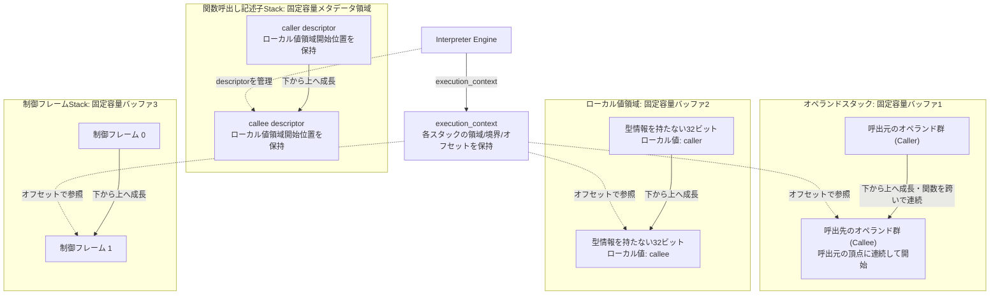
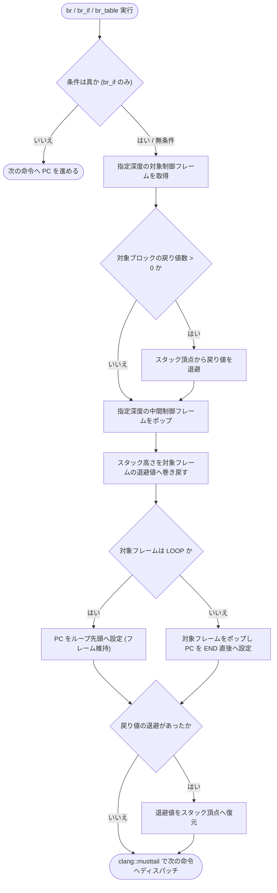
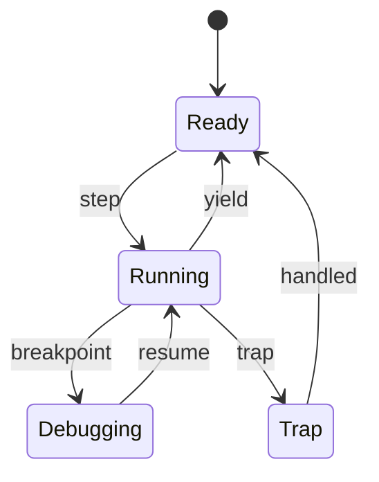
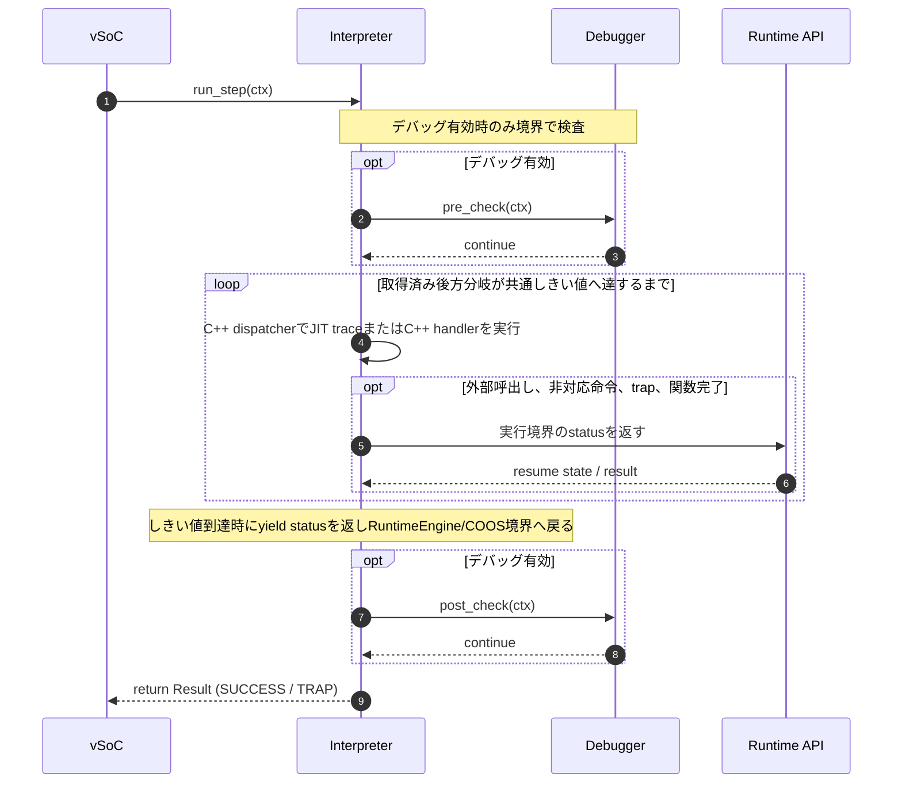
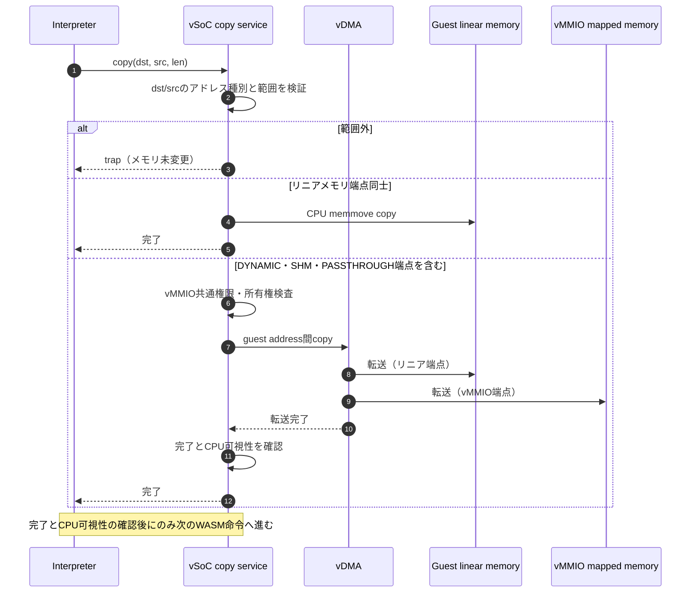

# Interpreter 実行系設計書 {VERIFY_FORMAL} {VERIFY_LLM} {VERIFY_BENCHMARK}
<!-- evidence:
     formal: ../tier2_runtime/formal/vsoc_state_model.py
     formal: formal/interpreter_stack_model.py
     formal: formal/interpreter_control_flow_model.py
     formal: ../../specs/formal/wasm_bulk_memory_model.py
     concept: concepts/interpreter_concept.py
     concept: concepts/bulk_memory_concept.py
     benchmark: ../../../experiments/pysim/benchmarks/interpreter/bench_fc.py
     benchmark_record: ../../../experiments/pysim/benchmarks/BENCHMARK_REPORT.md
     test: docs/qa/tier3_executer/interpreter_test_spec.md
     test: docs/qa/specs/wasm_instruction_set_test_spec.md
-->

## 1. コンセプト
<!-- traceability: {ThreadedInterpreter} {LowLatencyJIT} {InterpreterContextStackless} {RuntimeHotspotProfiler} {RuntimeEventSink} -->
Interpreter は、WASM命令をスレッドインタープリタ方式で実行する。低レイテンシと小フットプリントを設計目標とする。本コンポーネントは Execution Engine (`executor`) の一部として設計する。JITと実行状態を共有する。実行環境は `execution_context` の論理フィールドとして参照する。独立した `vsoc_runtime* env` 引数は設けない。

組み込み環境の極小メモリ制約（`{GLOBAL_Policy_Memory}`）を遵守する。WASM命令はFlashやROM上の関数コードビューから直接フェッチする。デコード中のローカルカーソルと`execution_context.ip`は、いずれもアクティブ関数のコードビュー内オフセットを保持する。RuntimeやDebuggerへ渡すPCは、CallFrameが持つ関数命令開始PCをこの値に加えて得る。中間命令オブジェクト（`Instr`）は生成しない。命令ごとの二分探索マップ（`FlatMapView`）も一切使用しない。即値（LEB128等）はその場でポインタから直接デコードし、次の命令アドレスは単なるポインタ加算（`ip += len`）で決定する。これを {DirectBytecodeExecution} と定義する。 <!-- definition: {DirectBytecodeExecution} -->

制御構文（`block`, `loop`, `if`）の飛び先は静的解決された軽量制御表（`control_map`）を参照する。この制御表はモジュールロード時に一度だけ構築される。命令実行中にヒープ確保や飛び先探索は行わず、制御表の参照を $O(1)$ で行う（`{GOTCHA-INTP-05}`）。 <!-- definition: {GOTCHA-INTP-05} -->

## 2. アーキテクチャ分類
<!-- traceability: {META_3TierSeparation} -->
本コンポーネントは **Tier 3 (プラグイン・リーフコンポーネント: Plugin Leaf Component)** に属する。Tier 2 のランタイム実行契約を実装し、WASM バイトコードの逐次実行を担当する。JIT との共用実行コンテキストは Tier 2 契約を介して利用する。

## 3. 静的モデル

### 3.1 データ構造
- **`Interpreter`**: WASM命令の実行、コンテキスト管理、外部環境との連携をカプセル化した主要クラスである。
- **`execution_context`**: 仮想CPUレジスタ、3本の値スタック情報、コードビュー、制御スタックビュー、CallStackビュー、オペランドスタック論理容量、LOOP後方辺のyieldカウンタを保持する構造体である。既存状態領域は64バイト、x86-64の実体は144バイトである。JIT共通領域とヘルパーはトレースヘッダが保持する。
- **`オペランドスタック`（オペランドスタック）**: WASM のオペランド値のみを保持する固定容量スタックである。コールチェーン全体を貫く1本の連続バッファとして動作する。呼び出しを跨いでもスタックは連続して配置される。
- **`ローカル値領域`（ローカル変数スタック）**: コールチェーン全体で共有する固定容量の、型情報を持たない32ビットワード領域である。型タグ、実行時オブジェクト、関数実行記述子を格納しない。論理ローカル1個につき、そのフレームのスロット幅の固定スロットを割り当てる。スロット幅は、フレーム内で最大の変数サイズで決める。i32/f32だけのフレームは4バイト、i64/f64を含むフレームは8バイトとする。v128を含む場合は16バイトとする。同一フレーム内でスロット幅を混在させない。アクセス先は `local_base + local_index * スロット幅` から直接計算する。
- **制御ブロック復帰情報領域**: `block`/`loop`/`if` の入れ子構造を管理する固定容量領域である。
- **関数実行記述子領域**: 関数ごとの実行メタデータを保持する独立した固定容量領域である。各記述子は`ローカル値領域`内のフレーム開始位置を保持し、`ローカル値領域`にはローカル値だけを置く。
- **`interpreter_config`**: 3本のスタック容量やyield閾値などの不変な構成情報である。

### 3.2 内部ブロック図

```mermaid
graph TD
    Ctx["execution_context<br/>各スタックの領域/境界/オフセットを保持"]

    subgraph Operand_Stack_Memory["オペランドスタック: 固定容量バッファ1"]
        Op0["呼出元のオペランド群 (Caller)"]
        Op1["呼出先のオペランド群 (Callee)<br/>呼出元の頂点に連続して開始"]
    end

    subgraph Local_Stack_Memory["ローカル値領域: 固定容量バッファ2"]
        Loc0["型情報を持たない32ビットローカル値: caller"]
        Loc1["型情報を持たない32ビットローカル値: callee"]
    end

    subgraph Call_Frame_Memory["関数呼出し記述子Stack: 固定容量メタデータ領域"]
        Frame0["caller descriptor<br/>ローカル値領域開始位置を保持"]
        Frame1["callee descriptor<br/>ローカル値領域開始位置を保持"]
    end

    subgraph Control_Frame_Memory["制御フレームStack: 固定容量バッファ3"]
        Ctrl0["制御フレーム 0"]
        Ctrl1["制御フレーム 1"]
    end

    Engine[Interpreter Engine] -- execution_context --> Ctx
    Ctx -. "オフセットで参照" .-> Op1
    Ctx -. "オフセットで参照" .-> Loc1
    Ctx -. "オフセットで参照" .-> Ctrl1
    Engine -. "descriptorを管理" .-> Frame1
    Op0 -- "下から上へ成長・関数を跨いで連続" --> Op1
    Loc0 -- "下から上へ成長" --> Loc1
    Frame0 -- "下から上へ成長" --> Frame1
    Ctrl0 -- "下から上へ成長" --> Ctrl1
```
3本の値領域は互いに独立した固定容量バッファであり、それぞれ自身の容量に対してオーバーフローを検知する。関数実行記述子領域は値領域とは別に容量を検査する。`オペランドスタック`は関数呼び出しを跨いで連続するため、戻り値を呼出元へコピーする必要がない。呼出先の戻り値は共有`オペランドスタック`に残り、関数復帰処理が記述子を破棄して呼出元の実行を再開する。

### 3.3 主要なクラス・構造体・配列・定数

#### インタープリタ（Interpreter）クラス
依存関係（vSoC環境等）と実行状態、命令属性情報をカプセル化する。

公開 `call()` は、呼出状態の生成、実行完了、トラップ確定、および結果検証を所有するテンプレートメソッドである。通常の `Interpreter` は命令ステップ駆動を実装し、Tier 3 の `JITInterpreter` は同じ `call()` 契約を継承して実行ドライバだけを差し替える。これにより、Tier 2 と Tier 3 のベンチマークは同一の公開呼出境界を通る。

実行に必要な `memory`、host function、vMMIO 等の外部資源は呼び出し側が明示的に注入し、インタープリタがJIT専用の初期化経路を持たない（{GOTCHA-INTP-18}）。 <!-- definition: {GOTCHA-INTP-18} --> テスト専用の起動・検査APIを製品側へ追加せず、テストは製品の実行境界を通じて状態を構成する（{GOTCHA-INTP-20}）。 <!-- definition: {GOTCHA-INTP-20} -->

| 項目名 | 機能と役割 | 型分類 | サイズ・制約 |
| :--- | :--- | :--- | :--- |
| 統合コンテキスト | 実行コンテキストおよびリニアメモリ情報（ctx） | 構造体への参照 | `execution_context` (非所有) |
| Opcode属性表 | 処理区分を含む各命令の属性フラグを保持する | 固定長メタデータ | 関数ポインタを保持しない |

#### 実行コンテキスト（execution_context）
<!-- traceability: {PositionIndependentCode} {ContextPointerRegister} {MemoryBoundaryCheck} {EnvironmentPointer} {WasmCodeSectionPC} -->
WASMゲストの全実行状態を管理する。JIT/Interpreter 共通の仮想CPUレジスタ群として設計する（{GOTCHA-INTP-11}）。 <!-- definition: {GOTCHA-INTP-11} -->

**独立した固定構造体としての配置**:
`execution_context` は、単体の固定サイズ構造体（x86-64では計144バイト）である。オペランド領域、ローカル値領域、制御ブロック復帰情報領域、関数呼出し記述子領域のいずれにもインライン配置されない。ハンドラとJITの境界では、実行コンテキスト、オペランド領域の現在位置、ローカル値領域の開始位置、スタック頂点値を4つの論理引数として渡す（{CPS_4Args}）。これらの物理レジスタと退避規則は対象ABIで定義する。

複雑命令をCへ委譲する場合の委譲先関数アドレスは、トレースヘッダへトレースごとに置く。対象ABIの呼出しコードはヘルパー契約ごとに共通コード領域へ配置し、トレースはヘッダに保持した対応入口の選択値を用いてそこへ遷移する。したがって、呼出し用のレジスタ変換、スタック領域確保、関数呼出し命令をトレースごとに複製しない。インタープリタの命令ディスパッチはこの共通呼出しコードを直接呼ばない。基本ブロック末尾では、対象ABIが定める値キャッシュの個数だけ共有オペランド領域へ書き戻す。その後、実行コンテキストの `ip`（`+0x00`）および `sp_offset`（`+0x0C`）を更新して状態を同期する（{GOTCHA-INTP-09}）。 <!-- definition: {GOTCHA-INTP-09} -->

##### 4論理引数の引渡し（ディスパッチ境界）

| 項目名 | 機能と役割 | 型分類 | 物理レジスタ |
| :--- | :--- | :--- | :--- |
| 実行コンテキスト | `execution_context` 構造体自身へのポインタ | 論理引数 | 第1引数。物理レジスタは対象ABIで定義する |
| オペランド領域の現在位置 | `オペランドスタック` の現在位置を指すポインタ | 論理引数 | 第2引数。物理レジスタは対象ABIで定義する |
| ローカル値領域の開始位置 | 現在の関数呼出しに対応するローカル値領域の先頭 | 論理引数 | 第3引数。物理レジスタは対象ABIで定義する |
| スタック頂点値 | `オペランドスタック` の最上位値 | 論理引数 | 第4引数。物理レジスタは対象ABIで定義する |

##### `execution_context` 物理メモリレイアウト（x86-64では計144バイト）

`execution_context` 起点の `+0x00`〜`+0x3F` に配置される固定構造体メモリフィールド：

| 項目名 | 機能と役割 | 型分類 | サイズ・オフセット |
| :--- | :--- | :--- | :--- |
| 命令カーソル (ip) | アクティブ関数コードビュー内の現在または復帰時の命令オフセット。外部へ示すPCは関数命令開始PCを加えて求める | 32bit符号なしオフセット | 4バイト（`execution_context` の `+0x00`） |
| SP領域開始位置 (sp_base) | `オペランドスタック` バッファ先頭アドレス | アドレス | 4バイト（`execution_context` の `+0x04`） |
| SP領域終端位置 (sp_limit) | `オペランドスタック` バッファ終端アドレス（オーバーフロー検知用） | アドレス | 4バイト（`execution_context` の `+0x08`） |
| SPオフセット (sp_offset) | `オペランドスタック` 現在の頂点オフセット/アドレス | 長さ/アドレス | 4バイト（`execution_context` の `+0x0C`） |
| ローカル変数領域開始位置 (local_base_addr) | `ローカル値領域` バッファ先頭アドレス | アドレス | 4バイト（`execution_context` の `+0x10`） |
| ローカル変数領域終端位置 (local_limit_addr) | `ローカル値領域` バッファ終端アドレス（オーバーフロー検知用） | アドレス | 4バイト（`execution_context` の `+0x14`） |
| ローカル変数オフセット (local_offset) | `ローカル値領域`上の次の空き32ビットワード位置 | ワードオフセット | 4バイト（`execution_context` の `+0x18`） |
| 制御フレーム領域開始位置 (cf_base_addr) | 制御ブロック復帰情報領域の先頭アドレス | アドレス | 4バイト（`execution_context` の `+0x1C`） |
| 制御フレーム領域終了位置 (cf_limit_addr) | 制御ブロック復帰情報領域の終端アドレス（オーバーフロー検知用） | アドレス | 4バイト（`execution_context` の `+0x20`） |
| 制御フレームオフセット (cf_offset) | 制御ブロック復帰情報の現在位置または深さ | 長さ/オフセット | 4バイト（`execution_context` の `+0x24`） |
| リニアメモリ開始アドレス (mem_base) | ゲストリニアメモリの開始アドレス | メモリアドレス | 4バイト（`execution_context` の `+0x28`） |
| リニアメモリサイズ (mem_size) | ゲストリニアメモリの有効バイト数（境界チェック比較用） | メモリサイズ | 4バイト（`execution_context` の `+0x2C`） |
| グローバル変数領域開始位置 (globals_base) | WASM global 配列の開始アドレス | メモリアドレス | 4バイト（`execution_context` の `+0x30`） |
| グローバル変数領域終端位置 (globals_limit) | WASM global 配列の終端アドレス | メモリアドレス | 4バイト（`execution_context` の `+0x34`） |
| 予約フィールド (reserved_0) | ABIレイアウトを保つ予約領域 | 32bit値 | 4バイト（`execution_context` の `+0x38`） |
| 実行時フラグ (runtime_flags) | C++ Interpreterのブロック境界停止要求などを表すフラグ | ビット集合 | 4バイト（`execution_context` の `+0x3C`） |
| コードビュー (code) | 現在のWASM命令列の非所有先頭アドレス | ポインタ | 8バイト（`execution_context` の `+0x40`） |
| コードサイズ (code_size) | `code` の有効バイト数 | 32bit符号なし | 4バイト（`execution_context` の `+0x48`） |
| 制御スタック (control_stack) | 制御フレーム配列の非所有アドレス | ポインタ | 8バイト（`execution_context` の `+0x50`） |
| 制御ベース (control_base) | 現在の関数が所有する制御フレーム窓の開始深さ | 32bit符号なし | 4バイト（`execution_context` の `+0x58`） |
| スタックチェックポイント (stack_checkpoint) | 境界フォールバック時に復元するoperand stack高さ | 32bit符号なし | 4バイト（`execution_context` の `+0x5C`） |
| CallStack (call_stack) | CallFrame配列の非所有アドレス | ポインタ | 8バイト（`execution_context` の `+0x60`） |
| CallStackベース (call_base) | 現在の関数が所有するCallFrame窓の開始深さ | 32bit符号なし | 4バイト（`execution_context` の `+0x68`） |
| CallStackオフセット (call_offset) | CallFrame配列の現在の深さ | 32bit符号なし | 4バイト（`execution_context` の `+0x6C`） |
| オペランドスタック容量 (sp_capacity) | オペランドスタックに使用できる32bitワード数 | 32bit符号なし | 4バイト（`execution_context` の `+0x70`） |
| LOOP後方分岐回数 (loop_jump_count) | 取得されたLOOP後方辺の累積回数。yield時にRuntimeEngineが0へ戻す | 32bit符号なし | 4バイト（`execution_context` の `+0x74`） |
| LOOP後方分岐yieldしきい値 (loop_jump_threshold) | RuntimeEngineが設定する協調yieldまでの取得回数 | 32bit符号なし | 4バイト（`execution_context` の `+0x78`） |
| リニアメモリのホスト基点 (linear_memory_host_base) | 実行中に借用するリニアメモリ実体の先頭アドレス | ポインタ | 8バイト（`execution_context` の `+0x80`） |
| リニアメモリの有効サイズ (linear_memory_size) | 実体メモリに対する境界検査のバイト数 | 64bit符号なし | 8バイト（`execution_context` の `+0x88`） |
`execution_context` 構造体のx86-64実体は144バイトである。先頭16個の32bitフィールド、4個のポインタ、残りの32bitフィールド、LOOP状態、64bitのリニアメモリサイズ、およびABIアラインメントで構成する。この配置とサイズを実行コンテキストのABI契約とする。コード、制御スタック、CallStackは非所有ポインタとしてコンテキスト自身から参照する。ハンドラは別の呼出し状態やTLSを参照しない。3本の値領域とCallStackの開始・終端・オフセットは独立したフィールドとして保持する。いずれか1本の領域の伸縮は他の記録位置へ影響しない。JITの複雑処理の委譲先アドレスとヘルパー契約別入口の選択値は、対象ABIのトレースヘッダから参照する。バイトオフセットの物理配置は `{ExecutionContext_Layout}` に従う。

`CallFrame`の`control_map`は、関数コードビュー内オフセットで直接引ける固定配列を指す。各エントリは対応する`end`、`else`、関数内の命令後オフセット、ブロック結果アリティ、および`drop/select`の生ワード幅を保持する。Runtimeから受け取ったCode section PCは関数命令開始PCを引いて制御表を参照し、遷移先の関数内オフセットを`execution_context.ip`へ格納する。外部へPCを返す場合は関数命令開始PCを加える。ローカル幅表と制御表は`CallFrame`から直接参照する。

**スタック頂点値の保持と同期不変条件 (`{GOTCHA-INTP-01}`)**: <!-- definition: {GOTCHA-INTP-01} -->
オペランドスタックの論理状態はInterpreter/JIT境界で共有する。x64では共有オペランド領域を正本とし、インタープリタとJITの相互移行、外部呼出し、トラップ処理で共有状態を同期する。ARMv8-Mでの値キャッシュ、物理レジスタ、境界同期はTBDであり、x64の方式から推定しない。

**WASM Code section 相対PC (`{GOTCHA-INTP-04}`)**: <!-- definition: {GOTCHA-INTP-04} -->
WASM PCは、当該モジュールのCode section payload先頭を0とし、命令の最初のバイトまでのオフセットで表す。payload先頭はsection IDとpayload lengthのLEB128の後であり、payload内の関数数、各body size、locals宣言を含む。PCは関数body内オフセットでも、WASMファイル全体のオフセットでも、ネイティブアドレスでもない。LoaderはCode section payloadのファイル位置を保持し、命令のファイル位置からpayload先頭位置を減じてPCを得る。

この座標はDWARF for WebAssemblyが定めるCode section相対命令位置と一致する。命令アドレスは命令先頭バイトを指す。参照: [WebAssembly tool-conventions: DWARF Code Addresses](https://github.com/WebAssembly/tool-conventions/blob/main/Dwarf.md#code-addresses)、[Wasmtime: DWARF PC lookup](https://docs.wasmtime.dev/api/src/wasmtime/runtime/trap.rs.html)。

PCはモジュール内の座標であり、異なるモジュール間では同じ値を取り得る。PCをキーとしてモジュール横断の状態を保持する場合は`(module_id, pc)`を使う。モジュール内では各命令がCode section payload内の異なるバイト位置を持つため、関数を含めた命令位置を一意に識別できる。

#### 関数呼出し記述子
<!-- traceability: {PositionIndependentCode} {ContextPointerRegister} {MemoryBoundaryCheck} {EnvironmentPointer} {CPS_4Args} -->
関数実行記述子は、関数インデックス、コード、制御マップ、ローカル幅マップ、引数搬送情報、戻り境界、および`ローカル値領域`の開始32ビットワード位置を結び付ける実行時メタデータであり、CallStackへ固定容量で積む。関数メタデータは記述子の生成時に一度取得して紐付け、命令実行中にコードや制御表を再検索しない（{GOTCHA-INTP-14}）。 <!-- definition: {GOTCHA-INTP-14} --> ローカル値は現在の空き位置から確保し、記述子に保存した開始位置から参照する。`オペランドスタック`と`ローカル値領域`は型情報を持たない32ビットワード列であり、記述子、戻りPC、型情報を格納しない。論理ローカルは、フレームごとに決まるスロット幅の固定スロットで保持する。スロット幅は、関数のロード時に、ローカルの最大の変数サイズから求める。値の有効ワードは関数シグネチャに従う。i32/f32は1ワード、i64/f64は2ワードを占有する（{GOTCHA-INTP-13}）。 <!-- definition: {GOTCHA-INTP-13} -->

`local.get`, `local.set`, `local.tee` は型を解釈しない。local index にフレームのスロット幅を掛けて、アドレスを直接計算する。必要な 1 または 2 ワードをオペランドスタックとの間で生コピーする（{GOTCHA-INTP-15}）。 <!-- definition: {GOTCHA-INTP-15} --> 型付き演算や ABI 境界の読み書きのみが、既知の型に応じて値を解釈する。オペランドスタックはコール境界を跨いで連続する。`call`と`call_indirect`はC++ Interpreter handlerが処理し、定義済みゲスト関数ならC++ dispatcherが呼出し先へ継続する。import・host callはInterpreter/RuntimeEngine境界へ戻す。関数復帰はC++ handlerが処理し、最上位の完了をRuntimeEngineへ返す。JIT トレースが関数呼出し記述子の積み下ろしや host call helper の呼出しを代行することはない。Fireball host import の `fireball_call` も実行エンジンからホストハンドラへ直接接続し、SYSCTL/vMMIO syscall vectorを経由しない（{GOTCHA-INTP-21}）。 <!-- definition: {GOTCHA-INTP-21} -->

値スタックは型タグを持たない32ビットワード列とし、型は各命令の操作側で解釈する（{GOTCHA-INTP-12}）。 <!-- definition: {GOTCHA-INTP-12} -->

**フレームごとのローカルスロット幅 (`{GOTCHA-INTP-22}`)**: <!-- definition: {GOTCHA-INTP-22} -->
スロット幅は、フレーム内で最大の変数サイズで決める。
i32/f32だけのフレームは4バイト、i64/f64を含むフレームは8バイト、v128を含むフレームは16バイトとする。
同一フレーム内でスロット幅を混在させない。混在させると、ローカルのアドレスがローカル番号だけで決まらなくなる。
幅は、関数のロード時に一度だけ求める。実行中に変更しない。
幅は、ローカルごとに2ビットのビットマップとして保持する。型の配列は保持しない。型はオペコードが決めるためである。
JITは、関数ごとのスロット幅から `local index × スロット幅` を求め、命令生成時に埋め込む。i32のみのフレームに限定しない。
**設計理由**: i32/f32が大半のフレームで、ローカル値領域の使用量を半分にする。固定容量のRAM予算を節約するためである。

| 項目名 | 機能と役割 | 型分類 | サイズ・制約 |
| :--- | :--- | :--- | :--- |
| 関数インデックス | 所有するWASM関数のメタデータを特定 | インデックス | 32bit符号なし |
| コード参照 | 現在実行するWASM命令列 | 非所有参照 | Flash/ROM上のコードを参照 |
| コードサイズ | コード参照の有効バイト数 | 32bit符号なし | ロード時に確定 |
| 関数命令開始PC | 関数コードビューの先頭命令に対応するCode section payload相対PC | 32bit符号なし | Loaderがbody sizeとlocals宣言を読み飛ばして確定 |
| 制御マップ | block/loop/if の静的な飛び先表 | 非所有参照 | ロード時に構築した表を共有 |
| ローカル値領域開始スロット | 当該関数のローカル値の先頭 | 32bitオフセット | 固定長ローカル配列内の物理スロット位置 |
| ローカル個数・スロット個数 | 引数を含む論理ローカル数と物理スロット数 | 32bit符号なし | `local_slot_count = local_count × slot_words` |
| スロット幅 | フレーム内の固定ストライド | 32bit符号なし | 1 / 2 / 4ワード。`local_base + local_index * slot_words` から直接計算 |
| ローカル幅マップ | 各ローカルの有効ワード幅 | 非所有参照 + 個数 | 2bit/ローカルのロード時固定マップ |
| 引数個数・詰め込み個数 | 呼出し元から搬送する引数の論理数とワード数 | 32bit符号なし | `i64/f64` は2ワード |
| 結果アリティ・制御ベース | 戻り値個数と制御フレーム窓の開始深さ | 32bit符号なし | ABI境界で検査 |
| 戻り境界 | 復帰PCと復帰先関数 | 32bit符号なし | 最上位CallFrameへ保持 |

呼出し時は関数呼出し記述子を独立領域へ積み、引数を含むローカル値をローカル値領域の現在位置から確保する。復帰時は呼出し先の記述子を取り除き、ローカル値領域を保存位置まで一括で戻す。ABIへ渡す値配列には記述子、型タグや可変長コンテナを含めない。 `{CallFrame_Layout}` <!-- definition: {CallFrame_Layout} -->

#### 制御ブロック復帰情報
<!-- traceability: {CPS_4Args} {ContextPointerRegister} {EnvironmentPointer} {MemoryBoundaryCheck} {PositionIndependentCode} {TraceBoundaryInvariant} -->
制御ブロック復帰情報は、`block/loop/if` 命令による入れ子構造とジャンプ先を管理する。専用の固定容量領域へ積む。JIT trace bodyは制御終端命令を実行せず、JIT境界で再開したC++ Interpreter handlerがこの領域を更新する（`TraceBoundaryInvariant`, `{JIT_RuntimeAPI_Fallback}`）。この領域はoperand stackおよびlocal領域から物理的に独立している。

`control_map`参照用キャッシュは、4エントリの固定長とし、32bitキーをXOR畳み込みで2bitへ縮約してスロットを選ぶ。縮約は`temp = v ^ (v >> 16)`、`temp ^= temp >> 8`、`temp ^= temp >> 4`、`temp ^= temp >> 2`、`temp &= 0x3`の順に行う。キャッシュ挿入に失敗した場合は`assert`で検出する（{GOTCHA-INTP-19}）。 <!-- definition: {GOTCHA-INTP-19} -->

| 項目名 | 機能と役割 | 型分類 | サイズ・制約 |
| :--- | :--- | :--- | :--- |
| 構造種別 | `block`/`loop`/`if` の識別値 | 列挙値 | 32bit符号なし (フレーム先頭 `+0x00`) |
| ブロック開始PC | 構造化ブロックの開始PC | オフセット | 32bit符号なし (`+0x04`) |
| 対応終了PC | 対応する`end`または分岐対応位置 | オフセット | 32bit符号なし (`+0x08`) |
| 保存済みスタック長 | ブロック開始時点の`オペランドスタック`の高さ | 長さ | 32bit符号なし (`+0x0C`) |
| 結果アリティ | このブロックが戻す値の数（スタック pruningに使用） | 整数 | 16bit符号なし (`+0x10`)。`+0x12`〜`+0x13`は末尾パディング |

制御ブロックの復帰情報は計20バイト（`+0x00`〜`+0x13`）である。物理配置は対象ABIのバイナリ配置に従う。`{ControlFrame_Layout}` <!-- definition: {ControlFrame_Layout} -->

#### 制御フレーム整合性とリーク防止不変条件 (Control Frame Integrity Invariant)
<!-- traceability: {InterpreterContextStackless} {PositionIndependentCode} -->
ネスト制御構造においてフレームスタックの不整合を完全に防止するため、以下の不変条件を厳格に保持する：

1. **`IF` 条件不成立時のフレーム整合性とリーク防止 (`{GOTCHA-INTP-03}`)**: <!-- definition: {GOTCHA-INTP-03} -->
   - `if` 命令でスタック条件が偽（`cond == 0`）かつ `else` 節が存在しない場合、制御フレームスタックに無駄なブロックフレームを積んではならない。
   - 条件偽判定の瞬間に、直ちに対応する `END` 命令の直後へ PC をスキップさせる。
   - これにより、未ポップの不要フレームが残留してスタックオーバーフローを起こすフレームリークを防止する。
2. **分岐脱出時のフレーム Pruning と TOS 復元 (`{GOTCHA-INTP-02}`)**: <!-- definition: {GOTCHA-INTP-02} -->
   - `br / br_if / br_table` で `depth` 個のフレームを脱出する際、対象フレームより外側のフレームを確実にポップする。
   - オペランドスタック長を、対象フレームの開始時スタック高（`stack_height`）へ巻き戻す。
   - ブロックが戻り値を持つ場合は、分岐命令実行時に最上位に積まれていた戻り値のみを退避する。
   - プルーニング完了後に、正確にスタック頂点（TOS レジスタ）へ復元する。
   - 脱出先が `loop` の場合はループ本体先頭へ巻き戻してフレームを維持する。`block / if` の場合はフレームをポップしてブロック終端直後へ遷移する。
   - ローダーが静的なBasicBlock後続PCを設定し、制御handlerが対応する`end`を越えて同じディスパッチ内で実行を続ける場合、そのPCより後ろに終端がある残存フレーム（`match_end < target_pc`）も破棄する。`match_end == target_pc` のフレームは `end` handler に処理させる。
3. **JIT 境界でのC++ handler実行 (`{GOTCHA-INTP-06}`, ADR-INTERP-03)**: <!-- definition: {GOTCHA-INTP-06} -->
   - JIT trace bodyは `block`, `loop`, `if`, `else`, `end`, `br`, `br_if`, `br_table` の終端命令を実行しない。
   - RuntimeEngineは継続PCを終端命令に置き、停止境界を設定して、C++ Interpreter handlerを一度実行する。
   - handlerが条件値を消費し、分岐対象の深さを制御frame stackから解決し、stackとframeを更新して遷移先PCを設定する。
   - RuntimeEngineは条件、分岐先、frame深さを再計算しない。通常の実行では、ディスパッチャがhandler完了後に次PCを参照する。debugger付きのstepwise経路ではRuntimeEngineが次の参照を行う。
   - この復帰処理は新しいtrace chaining対象を増やさず、OSの協調実行境界も移動しない。

#### 分岐脱出時のフレームプルーニングと TOS 復元手順（手順アクティビティ図）
<!-- traceability: {GOTCHA-INTP-01} {GOTCHA-INTP-02} {GOTCHA-INTP-03} {GOTCHA-INTP-06} {CallFrame_Layout} -->
`br / br_if / br_table` 命令によるネスト脱出時に、中間フレームを破棄しつつ戻り値をTOSへ復元する手順を示す。JITトレース境界でも同じC++ Interpreter handlerがこの制御フレーム操作を実行する（`{GOTCHA-INTP-06}`）。オペランドスタックは保存済みの位置まで一括で切り詰め、要素ごとのpopループを使わない（{GOTCHA-INTP-16}）。 <!-- definition: {GOTCHA-INTP-16} -->

```mermaid
flowchart TD
    Start(["br / br_if / br_table 実行"]) --> CheckCond{"条件は真か (br_if のみ)"}
    CheckCond -- "いいえ" --> NextPC(["次の命令へ PC を進める"])
    CheckCond -- "はい / 無条件" --> FetchTarget["指定深度の対象制御フレームを取得"]

    FetchTarget --> CheckArity{"対象ブロックの戻り値数 > 0 か"}
    CheckArity -- "はい" --> SaveVal["スタック頂点から戻り値を退避"]
    CheckArity -- "いいえ" --> Prune["指定深度の中間制御フレームをポップ"]

    SaveVal --> Prune
    Prune --> RewindStack["スタック高さを対象フレームの退避値へ巻き戻す"]
    RewindStack --> CheckLoop{"対象フレームは LOOP か"}

    CheckLoop -- "はい" --> LoopBranch["PC をループ先頭へ設定 (フレーム維持)"]
    CheckLoop -- "いいえ" --> BlockBranch["対象フレームをポップし PC を END 直後へ設定"]

    LoopBranch --> RestoreVal{"戻り値の退避があったか"}
    BlockBranch --> RestoreVal

    RestoreVal -- "はい" --> SetTOS["退避値をスタック頂点へ復元"]
    RestoreVal -- "いいえ" --> Dispatch
    SetTOS --> Dispatch(["clang::musttail で次の命令へディスパッチ"])
```

#### インタープリタ構成（interpreter_config）
<!-- traceability: {META_ConfigurableSystem} -->
インタープリタの動作パラメータを定義する。

| 項目名 | 機能と役割 | 型分類 | サイズ・制約 |
| :--- | :--- | :--- | :--- |
| `オペランドスタック` 容量 | `オペランドスタック` バッファの総バイト数 | バイト数 | 32bit符号なし (`FB_CONF_INTERP_OPSTACK_SIZE`) |
| `ローカル値領域` 容量 | `ローカル値領域` バッファの総バイト数 | バイト数 | 32bit符号なし (`FB_CONF_INTERP_LOCALSTACK_SIZE`) |
| 制御ブロック復帰情報領域の容量 | 制御ブロック復帰情報領域の総バイト数 | バイト数 | 32bit符号なし (`FB_CONF_INTERP_CTRLSTACK_SIZE`) |
| Yield 閾値 | 次の yield までに実行を許可する命令（トレース）数 | 回数 | 32bit符号なし |

#### オプコードハンドラ / トレース実行（opcode_handler / exec_trace）
<!-- traceability: {JIT_RuntimeAPI_Fallback} {ContextPointerRegister} {EnvironmentPointer} {JIT_RegisterMapping} {ADR_TosCacheAsymmetry} {CPS_4Args} -->
命令ハンドラおよびJITトレースは、継続渡しによる同一の4つの論理引数を持つ。実行コンテキスト、オペランド領域の現在位置、ローカル値領域の開始位置、スタック頂点値を渡し、物理レジスタと退避規則は対象ABIで定義する。opcode属性表は処理区分を含む命令属性をフラグで保持し、命令ハンドラの関数ポインタは保持しない（{GOTCHA-INTP-07}）。 <!-- definition: {GOTCHA-INTP-07} -->

インタープリタハンドラは次回呼び出し用の4引数とトラップ状態を結果として返す（{GOTCHA-INTP-08}）。 <!-- definition: {GOTCHA-INTP-08} --> 次のPCは `ctx` に保持する。JITトレースは末尾ジャンプで継続し、結果レコードを返さない。

命令実行中のWASMトラップは、例外を送出せず、継続引数とトラップ情報を含む結果として返す（{GOTCHA-INTP-10}）。 <!-- definition: {GOTCHA-INTP-10} --> トラップを受け取った実行器は全アクティブフレームを破棄して実行結果を確定する。以後の命令は実行しない。同期的な公開APIは、確定済みトラップを正常な戻り値（特に`None`）と混同せず、呼び出し側へ明示する。これはハンドラ内部の実行経路とは分離する。実装上の注意点に対応する検証条件と確認状況は [interpreter_test_spec.md](docs/qa/tier3_executer/interpreter_test_spec.md#継続状態と資源境界の検証) を参照する。

| 項目名 | 機能と役割 | 型分類 | サイズ・制約 |
| :--- | :--- | :--- | :--- |
| 実行シグネチャ | インタープリタ命令ハンドラの継続渡し4論理引数シグネチャ | 関数ポインタ | `handler_result (execution_context*, value_area_position, local_area_position, value) noexcept`。物理呼出し規約は対象ABIで定義する |
| ハンドラ結果 | 次の継続引数とトラップ状態 | 固定結果レコード | `ctx`、`sp`、`local_base`、`tos`、`trap_code`。次のPCは `ctx->ip` に格納し、`trap_code == 0` を正常、非0をトラップとする |
| JITトレース入口 | インタープリタと同一の4つの論理引数を持つ末尾継続 | 関数ポインタ | `void (execution_context*, value_area_position, local_area_position, value) noexcept`。物理呼出し規約は対象ABIで定義する |
| レジスタ割り当て | 対象ABIの引数レジスタマッピング | 対象ABI依存 | x64は [`jit_abi.md`](docs/components/tier2_runtime/jit_abi.md) の規約に従い、ARMv8-MはTBD |

WASM オプコードごとのスタック遷移およびハンドラ実装マトリクスは `{ThreadedInterpreter}` を参照する。

**スタック頂点値の引渡しと対称性**:
実行環境情報は `execution_context` に含め、独立した環境引数を追加しない。継続渡しの第4論理引数はスタック頂点値とする。これによりインタープリタとJITは論理的に同じ状態を境界で引き渡せるが、物理レジスタと値の保持方法は対象ABIに従う。

x64ではトレースが共有オペランド領域へ状態を書き戻す。ARMv8-Mのレジスタ割当とトレース境界同期はTBDである。

## 4. 動的モデル

### 4.1 アルゴリズム
<!-- traceability: {ThreadedInterpreter} {JIT_RuntimeAPI_Fallback} {Interpreter_LazyJITSwitch} {LowLatencyJIT} {SimpleJITArchitecture} {ContextPointerRegister} {ADR_TosCacheAsymmetry} {ADR_LoopBackedgeYield} {ADR_InterruptRescheduleGeneration} {GOTCHA-INTP-06} {GOTCHA-INTP-15} -->
- **Threaded Dispatch with Continuation Passing Style**:
  - opcode属性を参照し、関数ポインタ表を介さず命令に対応するハンドラへ継続する。
  - ハンドラ関数型は4つの論理引数に統一する。結果レコードで次の継続情報とトラップ状態を返す。
  - JITトレースの関数型は、対象ABIで定める4つの論理引数を受ける `void` 継続とする。
  - 実行コンテキスト、オペランド領域の現在位置、ローカル値領域の開始位置、スタック頂点値の物理的な保持方法は対象ABIに従う。
  - opcode属性表は各命令の処理区分と属性フラグを保持する。命令ディスパッチは属性を参照し、関数ポインタ表を介さず命令に対応するhandlerへ継続する。
  - JITが複雑処理をCへ委譲する際の関数ポインタをトレースヘッダ `helper_target_addr` に保持する。
  - 非制御命令では `[[clang::musttail]]` による直接末尾ジャンプ（Direct-Threaded Code）を行う。レジスタ上の引数をそのまま次のハンドラへ継続渡しする。
- **JIT コードとの完全な呼び出し規約整合 (Low-Overhead Interop)**:
  - JIT コンパイラが生成する機械語トレース（`exec_trace`）も同一の4論理引数シグネチャに従い、物理呼出し規約は対象ABIで定める。
  - **インタープリタから JIT への遷移**: 4つの論理引数を対象ABIの新規入口処理へ渡す。入口処理が必要なレジスタを退避した後にJIT本体へ進む。インタープリタから直接チェイン専用の入口へ入ってはならない。
  - **JIT からインタープリタへのフォールバック (OSR / Exit)**: 未サポート命令やトラップ、トレース終端に達した場合に発生する。対象ABIの終了処理で共有状態を同期し、必要なレジスタを復元してインタープリタへ戻る。
- **WASM命令とRuntime API / Libgcc ヘルパー連携 (`Libgcc_Runtime_Helper`)**:
  - 各命令ハンドラはスタックボトム相対でオペランドとスタック長を更新する。
  - ハードウェア支援がない64ビット整数演算や浮動小数点演算は、専用ランタイムヘルパー（`fireball_rt_*`）経由で実行する。これによりFPUの有無や soft-float 差異を透過的に吸収する。
- **C++ handlerの分岐処理**:
  - 深さ相対の分岐命令は、C++ handlerが指定深さの制御frameからloop先頭またはblock終端を得る。
  - handlerはoperand stackを対象frameの保存高さとlabel arityへ合わせてから遷移先PCを設定する（`{GOTCHA-INTP-06}`）。
- **スタック Pruning (Label Arity対応)**:
  - `br` 命令等の実行時、ジャンプ先の復帰情報に記録された結果個数に基づき、スタック上のオペランドを残してスタック長を保存済みスタック長まで巻き戻す。
- **JIT更新戦略（Interpreterテンプレートの実行ドライバ差し替え）**:
  - `Interpreter.call()` が呼出状態の生成、完了、トラップ確定、および結果検証を共通化する。
  - 通常の `Interpreter` は `_complete_call()` の基底実装で命令ステップを駆動する。
  - `JITInterpreter` は同じ `Interpreter.call()` を使用し、`_complete_call()` だけを `RuntimeEngine` のJIT／Interpreter統合ドライバへオーバーライドする。
  - JITキャッシュ検索、ホットスポット判定、未コンパイル時のInterpreterフォールバックは、差し替えられた実行ドライバ内で行う。Tier 2の公開呼出条件と結果契約は変更しない。
- **関数復帰の番兵**:
  - JITは `return` 命令や専用RETURN sentinelを生成しない。
  - JITトレースは `return` 直前で終了して共有状態を同期する。
  - インタープリタの return ハンドラが callee の `関数呼出し記述子` をポップする。
  - トップレベル復帰のみ専用の RETURN sentinel PC を生成し、RuntimeEngine が実行完了を判定する。
- **Hotspot検知と JIT候補ビットマップによるバイパス (`JIT_CandidateBitmap`)**:
  - JIT有効かつホットスポット検出有効のRuntimeでは、候補マスクに適合する基本ブロック先頭の`(module_id, UnifiedPC)`を固定容量履歴へ実行順に記録する。Runtime Event Sinkや時計を通さない。履歴の所有・容量・分析境界はTier 2 [`runtime_hotspot_profiler.md`](docs/components/tier2_runtime/runtime_hotspot_profiler.md) に従う。
  - 定義済みゲスト関数の呼出しではC++ dispatcherが呼出し先フレームを選び、呼出し先の適格ブロックも同じ実行区間の履歴へ記録する。履歴容量の超過では最古の履歴を上書きして実行を続ける。後方分岐のyield条件に達した場合はRuntime実行境界へ戻る。
  - Interpreterがyield、fallback、trap、関数完了のいずれかでRuntime実行境界へ戻るとき、未分析履歴を一度だけ引き渡す。カード更新とコンパイル要求登録は実行境界で行う。JIT trace/chainだけを実行した区間では履歴記録・分析を行わない。
  - JIT cache・候補mask・compile queueの所有者はTier 3 JITランタイムであり、C++ Interpreter handlerやvSoCはそれらを直接参照しない。
  - 候補ビットマップで該当block先頭PCが候補外（`0`）の場合、JITランタイムは追跡登録を省略する。compile効果のないblockの追跡overheadを抑える。
- **トレース境界での協調的Yield (`ADR_LoopBackedgeYield`)**:
  - インタープリタは命令ごとの精密なカウンタ評価や中断を行わない。
  - C++ディスパッチャは常駐JITトレースとC++ Interpreter handlerを連続実行し、取得済み後方分岐数が `FB_CONF_RUNTIME_YIELD_THRESHOLD` に達した境界でRuntimeEngine／vSoCへ制御を返す。C++ InterpreterとHybrid JITは同じカウンタとしきい値を使う。
  - 非対応命令、外部呼出し、トラップ、関数完了など、処理をC++内で続けられない境界では回数条件より先に制御を返す。
  - `co_yield` の発行と割り込み時の再スケジュール世代の観測はvSoCの責務である。vSoCはyield境界で世代観測を完了させてから`co_yield`を発行する。
  - インタープリタはコルーチンではなく単なる関数である。トレース境界での自然なレジスタ・スタック整合によりステート退避を極小化する。
- **VM観測フック**:
  - 関数、JIT、ホスト呼出、yield、trapなど意味上のRuntime境界で、Tier 2 [`runtime_observability.md`](docs/components/tier2_runtime/runtime_observability.md) のイベントをRuntime Event Sinkへ渡す。命令ごとのイベントは発行しない。ブレークポイントによる実行制御はDebuggerプラグインへ、コールグラフ集計と時間計算はGuest Profilerプラグインへ委譲する。

#### WASM インタープリタのコンセプトコード
実行可能な概念モデルは [`interpreter_concept.py`](docs/components/tier3_executer/concepts/interpreter_concept.py) に分離する。本文書には実装言語のコードを埋め込まず、WASM実行契約と固定レイアウトのみを規定する。

#### 選択された`0xFC`命令 ({WasmFCSubset})
<!-- traceability: {WasmFCSubset} {MemoryBoundaryCheck} {JIT_RuntimeAPI_Fallback} -->
Interpreterは`0xFC`の後続サブオペコードを符号なしLEB128で読み、対応表にある`0`〜`7`、`10`、`11`だけを実行する。その他の値はロード時拒否を前提とし、実行時に汎用フォールバック先として扱わない。飽和型数値変換は本書ではなく [`wasm_instruction_set.md`](docs/specs/wasm_instruction_set.md) の規則に従う。JITが同じ変換を直接生成しない場合は同じInterpreter handlerへ委譲する。

`memory.copy`と`memory.fill`は全オペランドを確定した後に端点を検査し、不正ならメモリとオペランドstackを部分更新しない。リニアメモリ端点はサイズ範囲を検査する。`memory.copy`ではBit 31が`1`の端点にFC=13（DYNAMIC）、FC=14（SHM）、FC=15（PASSTHROUGH）を指定でき、vSoCの内部vDMAサービスを使う。転送完了とCPU可視性を確認した後に次命令へ進む。内部の同期・非同期はvSoCの転送対象別契約に従う。リニアメモリ端点同士はCPU memmoveで処理する。vMMIO端点はvMMIO共通のPTE・権限・所有権検査に従う。`memory.fill`はリニアメモリだけを対象とし、値の下位byteをCPUで反復書込みする。概念モデルは [`bulk_memory_concept.py`](docs/components/tier3_executer/concepts/bulk_memory_concept.py) に分離する。

#### 統合 Tiered ランタイムエンジン・コンセプトコード
実行経路の統合検証は、本コンポーネントのテスト仕様書と [`vsoc_state_model.py`](docs/components/tier2_runtime/formal/vsoc_state_model.py) を参照する。ARMv8-Mの物理ABIとメモリ保護はTBDである。

### 4.2 状態遷移図
<!-- traceability: {ThreadedInterpreter} {JIT_RuntimeAPI_Fallback} {Interpreter_LazyJITSwitch} {LowLatencyJIT} {SimpleJITArchitecture} {ADR_LoopBackedgeYield} -->

```mermaid
stateDiagram-v2
    [*] --> Ready
    Ready --> Running: step
    Running --> Ready: yield
    Running --> Debugging: breakpoint
    Debugging --> Running: resume
    Running --> Trap: trap
    Trap --> Ready: handled
```

### 4.3 内部シーケンス
<!-- traceability: {ThreadedInterpreter} {JIT_RuntimeAPI_Fallback} {Interpreter_LazyJITSwitch} {LowLatencyJIT} {SimpleJITArchitecture} {ADR_LoopBackedgeYield} -->
#### Interpreter 実行シーケンス

```mermaid
sequenceDiagram
    autonumber
    participant V as vSoC
    participant I as Interpreter
    participant D as Debugger
    participant R as Runtime API

    V->>I: run_step(ctx)
    Note over I,D: デバッグ有効時のみ境界で検査
    opt デバッグ有効
        I->>D: pre_check(ctx)
        D-->>I: continue
    end
    loop 取得済み後方分岐が共通しきい値へ達するまで
        I->>I: C++ dispatcherでJIT traceまたはC++ handlerを実行
        opt 外部呼出し、非対応命令、trap、関数完了
            I->>R: 実行境界のstatusを返す
            R-->>I: resume state / result
        end
    end
    Note over I: しきい値到達時にyield statusを返しRuntimeEngine/COOS境界へ戻る
    opt デバッグ有効
        I->>D: post_check(ctx)
        D-->>I: continue
    end
    I-->>V: return Result (SUCCESS / TRAP)
```

#### `memory.copy`の内部vDMA委譲
<!-- traceability: {WasmFCSubset} {VDMA} {MemoryBoundaryCheck} -->
内部の同期・非同期とCOOS待機は、[`runtime_vsoc.md`](docs/components/tier2_runtime/runtime_vsoc.md)の転送対象別契約に従う。
本図は、Interpreterが転送完了とCPU可視性の確認を待って次命令へ進む境界を示す。

```mermaid
sequenceDiagram
    autonumber
    participant I as Interpreter
    participant V as vSoC copy service
    participant D as vDMA
    participant M as Guest linear memory
    participant P as vMMIO mapped memory

    I->>V: copy(dst, src, len)
    V->>V: dst/srcのアドレス種別と範囲を検証
    alt 範囲外
        V-->>I: trap（メモリ未変更）
    else リニアメモリ端点同士
        V->>M: CPU memmove copy
        V-->>I: 完了
    else DYNAMIC・SHM・PASSTHROUGH端点を含む
        V->>V: vMMIO共通権限・所有権検査
        V->>D: guest address間copy
        D->>M: 転送（リニア端点）
        D->>P: 転送（vMMIO端点）
        D-->>V: 転送完了
        V->>V: 完了とCPU可視性を確認
        V-->>I: 完了
    end
    Note over I,V: 完了とCPU可視性の確認後にのみ次のWASM命令へ進む
```

## 5. インターフェース定義

### 5.1 公開API
外部から利用可能なオブジェクト指向APIを定義する。

#### 初期化（initialize）

| 項目 | 内容 |
| :--- | :--- |
| 機能概要 | 実行コンテキスト、固定容量スタック、および関数メタデータの初期状態を構築する。 |
| シグネチャ | `initialize(config: const参照) -> 結果型` |
| 引数 | `config`: インタープリタ構成 (`interpreter_config`) への読取専用参照 |
| 戻り値 | 結果型 (成功時は空、失敗時はエラー情報) |
| 事前条件 | 設定値がシステム制限（メモリサイズ等）に適合していること。 |
| 事後条件 | 初期化に成功し、WASM命令の実行を開始できる状態になる。 |
| 不変条件 | 初期化後に設定値を変更できないこと。 |
| エラー時の挙動 | メモリ確保失敗時は初期化を中断し、エラー値を返す。 |
| 補足 | デバッガは実行境界から停止・ステップを制御する。 |

#### 実行ステップ (`run_step`)
<!-- traceability: {META_RecoveryStrategy} -->

| 項目 | 内容 |
| :--- | :--- |
| 機能概要 | WASM命令を1トレース分実行し、実行コンテキストを更新する。 |
| シグネチャ | `run_step(ctx: 可変参照) -> 結果型` |
| 引数 | `ctx`: 実行コンテキスト (`execution_context`) への可変参照 |
| 戻り値 | 結果型 (正常終了時は SUCCESS、トラップ発生時はリカバリー戦略カテゴリ `recovery-strategy-category` ) |
| 補足 | 必要に応じて内部的に JIT コードへのジャンプを行い、JIT/Interpreter を透過的に切り替える。 |

#### 割り込みイベント同期 (`sync_interrupts`)
<!-- traceability: {META_RecoveryStrategy} -->

| 項目 | 内容 |
| :--- | :--- |
| 機能概要 | COOS協調境界で受け取った汎用 `interrupt-event` を、実行コンテキストの保留イベント領域へ反映する。 |
| シグネチャ | `sync_interrupts(ctx: 可変参照, event: interrupt-event) -> void` |
| 引数 | `ctx`: 実行コンテキスト (`execution_context`) への可変参照 `event`: `vector_id`、`source_id`、`cause_code`、`payload0`、`payload1` の固定5ワード |
| 戻り値 | void (なし) |
| 期待する結果 | `ctx` 内の保留イベントが更新され、vSoCのCOOS協調境界で反映される。 |
| 事前条件 | `ctx` が有効な `execution_context` を指していること。 |
| 事後条件 | フラグがアトミックに書き込まれる。 |
| 不変条件 | 実行中の命令ハンドラから安全に参照可能であること。 |
| エラー時の挙動 | 未登録イベントやFIFO満杯はCOOS側でドロップされる。vSoCから渡された不正なイベントは `recovery-strategy: ignore` とし、ゲスト実行コンテキストの破壊を防ぐ。 |
| 補足 | vSoCのCOOS協調境界における配送を補助するだけで、ゲスト関数の階層ディスパッチやWASIポーリングは担当しない。 |

#### 継続渡しハンドラの実行境界
<!-- traceability: {ThreadedInterpreter} {ContextPointerRegister} -->

命令意味論はWASM命令ハンドラに保持し、各命令の処理区分と属性フラグはopcode属性表に保持する。命令ディスパッチはopcode属性を参照し、関数ポインタ表を介さず命令に対応するhandlerへ同一の4つの論理引数で末尾連鎖させる。末尾呼び出しで次のhandlerへ移るため、命令ごとにC++コールスタックを積み増さない（{InterpreterContextStackless}）。 <!-- definition: {InterpreterContextStackless} -->

通常のブロック内命令はC++の命令ハンドラ列で実行する。RuntimeEngineから基本ブロック境界を指定された場合、ディスパッチは指定先PCに到達した時点で共有状態を保存して戻る。命令表にない命令は同じPCとスタック状態を保って実行境界へ戻し、対応するruntime APIへ委譲する。

- 制御・スタック命令: `block`、`loop`、`if`、`br`、`br_if`、`drop`、`select`、`return`。
- ローカル変数命令: `local.get/set/tee`。
- 数値命令: i32/i64の数値命令、およびf32/f64の定数・比較・算術・丸め・平方根・reinterpret/変換。

定義済みゲスト関数への`call`と`call_indirect`はC++ handlerが関数呼出し記述子を積み、C++ dispatcherが呼出し先へ継続する。import/host呼出し、グローバル、リニアメモリの各命令で外部状態を扱う場合は、共有状態を同期してInterpreter/RuntimeEngine境界へ委譲する。RuntimeEngineが要求するブロック境界停止PCはC++ディスパッチが判定し、境界で共有状態を保存する。`sp_capacity` は設定済みの論理容量を32bitワード単位で保持し、物理バッファの大きさまでスタックを伸ばさない。

### 5.2 URI/IPCインターフェース
<!-- traceability: {META_RecoveryStrategy} -->
本コンポーネントは vSoC の内部ライブラリとして利用され、直接のIPCインターフェースは持たない。

### 5.3 関連コンポーネントとの連携
<!-- traceability: {META_RecoveryStrategy} {GOTCHA-INTP-18} {GOTCHA-INTP-20} {GOTCHA-INTP-21} -->
| コンポーネント | 連携内容 | 参照データ構造 |
| :--- | :--- | :--- |
| **WASM Loader** | WASMバイナリの索引情報（関数、命令、即値）の提供 | [`runtime_loader.md`](docs/components/tier2_runtime/runtime_loader.md#モジュールビューmodule_view) |
| **JIT Compiler** | ホットスポット情報の共有と実行エンジンの切り替え | `execution_context`, 履歴バッファ |
| **Debugger** | インタープリタ実行境界でのブレークポイント判定と実行状態の可視化 | `execution_context` |
| **vSoC** | 実行制御（step）と協調型マルチタスク（yield）の管理 | `execution_context` |
| **vSoC** | 選択`0xFC`メモリ命令の境界検査と`memory.copy`同期実行サービス | `memory.copy` / `memory.fill` |

## 6. 制約達成の方策

### 6.1 性能制約と方策
<!-- traceability: {ThreadedInterpreter} -->
- **目標**: WAMRインタープリタを上回る実行速度を達成する。
- **方策**: 直接末尾呼び出しによる分岐削減と、ホットスポット検出による JIT 移行を組み合わせる。

### 6.2 メモリ制約と方策
<!-- traceability: {ThreadedInterpreter} {GOTCHA-INTP-12} -->
- **目標**: 構成で定めるメモリ上限内で動作する。ARMv8-Mの物理容量適合性はTBDとする。
- **方策**: `execution_context` と関数呼出し記述子を最小化し、スタック領域を固定サイズ化する。

### 6.3 安全性制約と方策
<!-- traceability: {META_FaultIsolation} {MemoryBoundaryCheck} {GOTCHA-INTP-10} -->
- **目標**: ゲストの暴走を確実に隔離する。
- **方策**: `sp_boundary` と `memory_size` による境界チェックを実施する。不正な引数、未初期化状態、無効なフレーム、範囲外の内部状態は回復せず `assert` で停止する（{GOTCHA-INTP-17}）。 <!-- definition: {GOTCHA-INTP-17} --> COOS協調境界での `interrupt-event` 保留処理により安全な割り込み処理を行う。

## 7. 形式検証・テスト仕様との対応

### 7.1 形式検証 (Formal Verification)
<!-- traceability: {ThreadedInterpreter} {InterpreterContextStackless} {PositionIndependentCode} -->
本コンポーネントのスタック整合性および実行状態遷移を、Python `pyModelChecking` を用いた形式検証モデルで検証する。モデルは抽象状態の遷移だけを検査し、実装コードやWASM値型の意味論を証明するものではない。検証対象の性質と結果を以下に示す。 `{VERIFY_FORMAL}`

#### 7.1.1 スタック領域と関数復帰モデル ([`interpreter_stack_model.py`](docs/components/tier3_executer/formal/interpreter_stack_model.py))
3つの独立領域（オペランド領域、ローカル値領域、制御ブロック復帰情報領域）の非別名性、関数呼出し記述子とローカル値の抽象的な分離、および関数復帰後の結果値保持を抽象状態モデルで検証する。このモデルはアドレス範囲、容量、オフセット計算、実装コードの境界アクセスを検査しない。x86-64のコンテキストサイズとフィールドオフセットは `{ExecutionContext_Layout}` に従う。
- **検証特性 (CTL/LTL)**:
  - 相互独立性: いずれか1本のスタックの伸長・収縮が、他スタックの境界やオフセットを侵食しない。
  - 関数復帰: ローカル値領域を解放しても結果値がオペランド領域に残る。
- **変異検査 (`guards=False`)**: ガード条件を無効化した統合変異モデルへ、値領域の別名化、記述子とローカル値の混在、復帰値の消失を表す違反遷移を追加する。Kripke 構造上で3つの特性式がすべて反証されることを確認する。

#### 7.1.2 分岐時の制御フレーム復元モデル ([`interpreter_control_flow_model.py`](docs/components/tier3_executer/formal/interpreter_control_flow_model.py))
<!-- traceability: {GOTCHA-INTP-03} -->
この抽象状態モデルは`loop`分岐時に対象loop frameを維持すること、`block`分岐時に対象frameを除去すること、どちらもオペランド高さを復元して宣言アリティ分の値を保持することを検証する。else節を持たない`if`の偽条件がフレームを積まずに対応ENDの次へ進むことも検査する。実命令列や値型の意味論は実行可能テストが担い、このモデルは状態遷移の制御不変条件に限定する。
- **変異検査 (`guards=False`)**: 分岐復元を飛ばす遷移と、偽条件の`if` frameを残す遷移を加える。各性質が反証されることを確認する。

#### 7.1.3 状態遷移と実行境界モデル ([`vsoc_state_model.py`](docs/components/tier2_runtime/formal/vsoc_state_model.py))
インタープリタ実行、トレース境界での Yield 判定、OSR フォールバック、トラップ処理の決定論的遷移を検証する。
- **検証特性 (CTL/LTL)**:
  - 活性 (Liveness): 実行可能状態から有限ステップでディスパッチまたは Yield へ到達する。
  - 安全性 (Safety): 不正命令や範囲外アクセスが発生した場合、即座に Trap 状態へ遷移し、後続命令を実行しない。
  - 境界状態同期: JIT とインタープリタの境界で4つの論理引数と共有実行状態が同期される。物理レジスタ配置は対象ABIに従い、ARMv8-MはTBDとする。

## 8. 設計判断と参考実装

### 8.1 設計判断 (ADR)

#### ADR-INTERP-01: LOOP後方分岐回数による協調yield
<!-- traceability: {ADR_LoopBackedgeYield} -->

- **ステータス**: 承認 (Approved)
- **コンテキスト**:
  COOS協調型マルチタスク環境で、命令ディスパッチループがRuntimeEngineへyield statusを返す条件を定める。インタープリタ自身はコルーチンにせず、取得LOOP後方辺の共通しきい値まで命令handlerとディスパッチャが実行を続ける。
- **決定事項**:
  取得されたLOOP後方分岐はC++ Interpreterの命令別handlerが処理し、共通contextの回数を更新する。C++ dispatcherは常駐JIT traceまたはC++ handlerを継続実行し、共有しきい値へ達した時点でRuntimeEngineへyield statusを返す。RuntimeEngineはJIT runtime処理を行い、Systemは協調境界で`co_yield`を発行する。各handler後にvSoC境界へ戻ってcacheを再判定してはならない。

#### ADR-INTERP-02: 再スケジュール世代の観測境界 (`{ADR_InterruptRescheduleGeneration}`)

- **ステータス**: 承認 (Approved)
- **決定事項**:
  インタープリタとJIT handlerはCOOSの再スケジュール世代を命令ごとに参照しない。SystemはC++ dispatcherがyield statusを返した後の協調境界で現在世代とタスクの最終観測世代を比較し、未観測なら記録して`co_yield`を発行する。
- **責務境界**:
  C++ InterpreterはWASM命令を処理し、C++ dispatcherはLOOP後方分岐しきい値到達時にRuntimeEngineへ戻る。世代の管理、READYキューの一巡判定、および割り込みイベントの配送はCOOSとSystemの責務とする。
- **保証範囲**:
  この方式は取得後方辺しきい値に応じた協調yieldを保証する。LOOP後方辺へ到達しない命令列の強制プリエンプションや、割り込みからの実時間応答上限は保証しない。
- **根拠とトレードオフ**:
  1. **ディスパッチ性能の維持**: C++ handlerはopcode固有の状態更新だけを行い、vSoCへの復帰・イベント走査を挟まない。C++ dispatcherは後方分岐しきい値まで継続する。
  2. **レジスタ・スタック整合性の保証**: C++ handlerとJIT traceの境界で共有実行コンテキストと3本の独立領域を同期する。
  3. **有界な協調間隔**: 取得後方分岐回数のしきい値でdispatcherがRuntimeEngineへ戻る。これは時間ベースのプリエンプションや実時間応答上限を保証しない。
  4. **責務の分離**: 命令handlerは命令意味論を担当し、ディスパッチャは実行遷移と後方辺回数を担当する。JIT cacheとCOOS schedulingの管理はRuntimeEngineとSystemが担う。
- **影響範囲**:
  - `interpreter.md`, `runtime_vsoc.md`, `os_coos.md`, `jit_compiler.md`

#### ADR-INTERP-02: i64 / f32 / f64 の Libgcc ランタイムヘルパー連携 (`{Libgcc_Runtime_Helper}`)
<!-- definition: {Libgcc_Runtime_Helper} -->

- **ステータス**: 承認 (Approved)
- **コンテキスト**:
  32ビット組み込み CPU において、64ビット整数演算および浮動小数点演算を実行する際、コンパイラ組み込みランタイムライブラリ（`libgcc`）のヘルパー関数を呼び出す必要がある。
- **決定事項**:
  `i64`, `f32`, `f64` 演算命令は、インタープリタおよび JIT の双方で実行する。専用のランタイムヘルパー関数（`fireball_rt_*`）経由で実行する（`{Libgcc_Runtime_Helper}`）。
- **根拠とトレードオフ**:
  1. **JIT ステンシルの軽量化**: 複雑な演算ルーチンを JIT ステンシル内にインライン展開しない。ランタイムヘルパー呼び出しに委譲する。JITコード容量は対象構成で定め、ARMv8-Mの物理容量はTBDとする。
  2. **ハードウェア差異の隠蔽**: FPU 搭載環境と非搭載環境のビルド切り替えをヘルパー実装内に局所化する。
  3. **保守性と検証容易性**: `libgcc` との ABI 境界がハンドラ単位で隔離され、テストおよび形式検証が容易になる。
- **影響範囲**:
  - `interpreter.md`, `jit_compiler.md`, `wasm_instruction_set.md`, `jit_stencil_catalog.md`

#### ADR-INTERP-03: 制御フレームを専用スタックへ分離

- **ステータス**: 承認 (Approved)
- **コンテキスト**:
  当初の設計では全スタック要素を単一の統合バッファへ混在させていた。JIT trace bodyは制御終端命令を実行せず、C++ Interpreter handlerが専用制御フレームを積み下ろす。領域を分離しない場合、制御frame操作がoperand stackの位置関係を壊す危険がある。
- **決定事項**:
  制御ブロック復帰情報をローカル値領域およびオペランド領域と完全に切り離す。専用の固定容量領域へ配置する。3本の領域の長さは互いに独立して管理する。
- **根拠とトレードオフ**:
  1. **JIT 動作時の物理的安全性**: JIT trace bodyは制御終端命令を実行せず、C++ Interpreter handlerが専用制御frameだけを更新する。各領域を分離することで、オペランド値や位置が乱れることを防ぐ。
  2. **終端命令の一元処理**: JIT境界でもC++ Interpreter handlerが分岐とstack pruningを実行する。分岐の再計算とInterpreterの状態遷移を二重化しない。
  3. **メモリ管理の明確化**: 3本の固定容量バッファに分離し、それぞれ個別にオーバーフローを検知する。
  4. **コールフレームとの責務差**: 関数呼び出しは常にインタープリタへ戻る境界である。本問題はループやブロック特有のものである。
- **影響範囲**:
  - `interpreter.md`, `jit_runtime.md`

#### ADR-INTERP-04: オペランドスタックを ローカル値領域 から分離

- **ステータス**: 承認 (Approved)
- **コンテキスト**:
  関数呼出し記述子とローカル変数、オペランドスタックが同居している場合、関数復帰時に呼び出し先の記述子を飛び越えて戻り値をコピーする必要があった。
- **決定事項**:
  オペランドスタックを独立した固定容量バッファ（`オペランドスタック`）へ分離する。コールチェーン全体を1本の連続スタックとして貫く。
- **根拠とトレードオフ**:
  1. **戻り値コピーの完全排除**: 呼び出し先の頂点は呼び出し元の頂点の直後に位置する。関数復帰時、結果値はすでに呼び出し元が継続すべき位置に存在する。
  2. **コールフレーム構造の縮小**: オフセット計算が静的になり、フレーム構造体を縮小できる。
  3. **独立した境界検査**: 3本のスタックが独立してオーバーフローを検知する。
  4. **メモリ予算のトレードオフ**: バッファが分かれるため個別の容量設計を要するが、安全性を優先する。
- **影響範囲**:
  - `interpreter.md`
