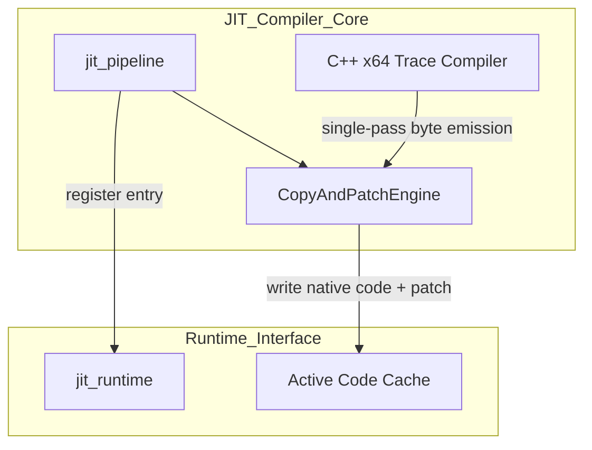
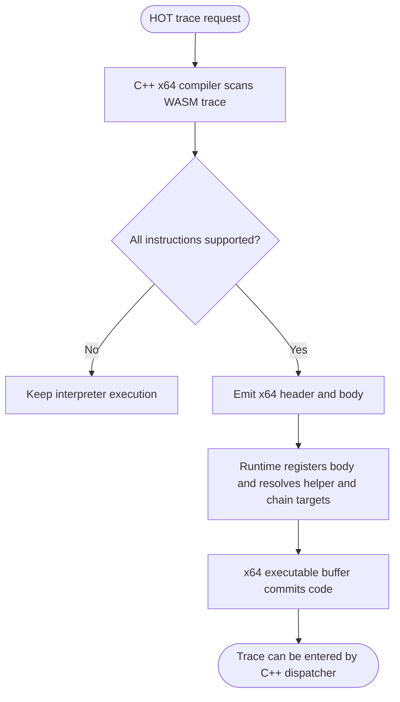
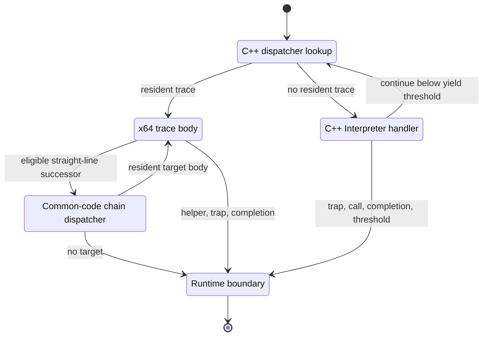
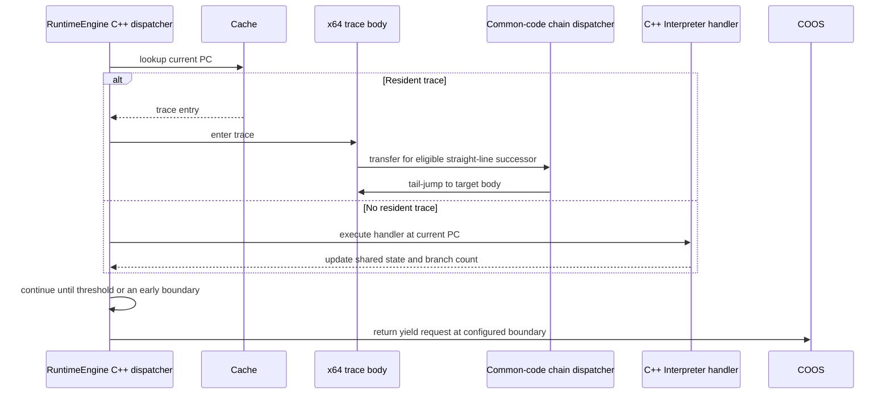

# JIT コンパイラ コンポーネント設計書 {VERIFY_FORMAL} {VERIFY_LLM} {VERIFY_BENCHMARK}
<!-- evidence:
     formal: formal/jit_cache_model.py
     benchmark: experiments/pysim/benchmarks/jit/bench_jit.py
     test: docs/qa/tier3_executer/jit_compiler_test_spec.md
-->

## 1. コンセプト
<!-- traceability: {LowLatencyJIT} {JIT_CopyAndPatch} {JIT_ZeroCompileCostTheorem} {SimpleJITArchitecture} {JIT_Encoder} {PositionIndependentCode} {SinglePassCompilation} -->
JIT Compiler は、WASMバイトコードを実行時にネイティブコードへ変換し、実行速度を向上させる。Execution Engine (`executor`) の一部として機能する。「Zero Compile Cost」方針に基づき、最適化を省いた **Copy-and-Patch** 方式を採用する。確認済みのx64トレース本体生成は `native_trace_call.cxx` のC++実装が担当し、命令バイト列、レジスタ配置、スタック退避、ランタイムヘルパー境界を単一パスで確定する。生成結果はトレースdescriptorと実行可能コード領域へ登録する。ARMv8-Mの物理実装と資源予算はTBDである。

## 2. アーキテクチャ分類
<!-- traceability: {META_3TierSeparation} {JIT_CopyAndPatch} -->
本コンポーネントは **Tier 3 (詳細リーフコンポーネント: Leaf Component)** に属する。vSoC (`runtime_vsoc.md`) から分解された JIT コンパイルパイプラインを担当し、Copy-and-Patchによるネイティブコード生成と生成結果のキャッシュ登録を行う。ランタイム側のエントリ検索・キャッシュ管理・ホットスポット検出は [`jit_runtime.md`](docs/components/tier3_executer/jit_runtime.md) が担当する。

### 2.1 JIT サブシステムのデコンポジション
<!-- traceability: {JIT_Encoder} {JIT_CopyAndPatch} {SimpleJITArchitecture} {JIT_MultiBuffer_Cache} -->
JITサブシステムは、以下の2つの独立した設計書に責務を分離して構成される。

- **[jit_compiler.md](docs/components/tier3_executer/jit_compiler.md)**: C++ネイティブ実装による命令バイト列生成（Copy-and-Patch Engine）およびトレース登録を担当する。
- **[jit_runtime.md](docs/components/tier3_executer/jit_runtime.md)**: 実行履歴監視・ホットスポット判定、PC-アドレス変換検索、および 3面キャッシュローテーションを担当する。

## 3. 静的モデル

### 3.1 データ構造
- **`native_trace_call.cxx`**: C++で実装したx64トレースコンパイラである。WASM命令列とABIメタデータを一度走査し、固定長バッファへネイティブ命令を生成する。未対応命令、型混在、ABI不整合はコンパイル失敗として返し、実行器が規定のインタープリタ経路を選ぶ。
- **`CopyAndPatchEngine`**: C++コンパイラが生成したネイティブ命令列をキャッシュへ配置し、即値・分岐先・APIポインタをパッチ適用する責務を表す論理コンポーネントである。
- **共通コード領域**: x64 JIT領域では開始処理、終了処理、helper契約別入口、chain dispatcherを共通領域へ配置する。命令別条件評価やhandler呼出しを単一dispatcherへ集約しない。x64の領域サイズと各offsetは [`jit_abi.md`](docs/components/tier2_runtime/jit_abi.md) および [`jit_runtime.md`](docs/components/tier3_executer/jit_runtime.md) を正本とする。ARMv8-Mのサイズと配置はTBDである。 `{JIT_MultiBuffer_Cache}`
- **`constexpr_assembler`**: C++の `constexpr` 機能を活用し、opcodeを判定しない共通chain dispatcherの固定命令列をビルド時に生成する。命令別handlerはC++ interpreter内で直接選択し、この共通dispatcherへ集約しない。
- **命令テンプレート (`jit_template`)**: パッチスロットを含むネイティブ命令列の雛形（x64では `native_trace_call.cxx` のC++実装が生成する。ARMv8-Mの物理仕様はTBD）。
- **JIT トレースヘッダ (`jit_trace_header`)**: キャッシュに書き込まれる各ネイティブトレースの先頭に配置される実行時メタデータ構造体。x64では24バイトで、trace identity、chain target、必要なhelper targetを保持する。共通コードoffsetと論理的な後続PCは重複格納しない。物理欄は対象ABIごとに定義する。

### 3.2 内部ブロック図

### 3.3 主要なクラス・構造体・定数

#### コンパイル単位とインタープリタ協調方針
<!-- traceability: {Libgcc_Runtime_Helper} {LowLatencyJIT} {PositionIndependentCode} {SimpleJITArchitecture} -->
- **関数/モジュール一括コンパイルの完全禁止**: 極小リソース環境におけるコンパイル遅延とメモリ消費をゼロ化する。関数全体やモジュール全体の事前一括コンパイルは一切行わない。
- **純粋ベーシックブロック/トレース単位コンパイル**: カードマーキング表で HOT（`10`）に達した直線命令列（基本ブロック / トレース）のみを対象とする。スケジューラのアイドル時等に Copy-and-Patch により 1 トレースずつオンデマンド生成する。
- **制御フローとインタープリタ委譲 (`{JIT_RuntimeAPI_Fallback}`)**: 現行x64ランタイムでは、制御終端命令をトレース本体で実行しない。`BR`、`BR_IF`、`BR_TABLE`、`BLOCK`、`LOOP`、`IF`、`ELSE`、`END`、コール、returnは、終端PCから対応するC++ Interpreter handlerへ渡す。handlerが条件、フレーム、遷移先を確定し、C++ dispatcherは設定された後方分岐数まで次の常駐トレースまたはC++ handlerを実行する。通常実行は共通機械語LOOPヘルパーへ移らず、Interpreter handlerを飛ばす直接後方分岐を作らない。
- **ハンドラABI**: JITトレース入口はInterpreter handlerと4論理引数の配置を共有するが、戻り値契約は異なる。Interpreter handlerは`handler_result`、JIT trace entryは`void`を返すため、関数ポインタ型を共有しない。

##### 3.3.1 現行x64の制御終端処理とchain dispatcher
<!-- traceability: {JIT_CopyAndPatch} {JIT_LazyChaining} {PositionIndependentCode} -->

現行x64実行系では、制御終端をトレース本体から除外し、終端PCからC++ Interpreter handlerを実行する。`BR`、`BR_IF`、`BR_TABLE`、`BLOCK`、`LOOP`、`IF`、`ELSE`、`END`、call、returnの条件値、スタック巻き戻し、制御フレーム更新、遷移先決定はhandlerが所有する。取得された後方分岐数もbranch handlerがコンテキストへ記録する。C++ dispatcherは同一関数内の次PCでトレース表を検索し、しきい値到達までC++側で続行する。C++ Interpreter単独実行も同じdispatcherと `FB_CONF_RUNTIME_YIELD_THRESHOLD` を使う。

trace chainは、互換な直線後続traceが常駐する場合に共通コード領域のchain dispatcherがTraceヘッダからtarget bodyを読み、そこへtail-jumpする経路である。C++ handler実行後にC++ dispatcherが次traceを検索・起動する遷移はchainではない。chain dispatcherはopcodeごとのhandlerを共通化せず、分岐条件や制御frameを判定しない。

##### 3.3.2 ARMv8-Mの物理仕様（TBD）

ARMv8-M向け命令Stencil、ABI、Trace header、共通コード領域とchain dispatcher、メモリ保護方式はすべてTBDとする。未確定項目は [`jit_stencil_catalog.md`](docs/specs/jit_stencil_catalog.md) に集約する。

##### 3.3.3 インタープリタ委譲命令台帳（Delegated Opcode Specification）
<!-- traceability: {JIT_RuntimeAPI_Fallback} {Libgcc_Runtime_Helper} -->
JIT トレース内にインライン展開せず、トレース境界でインタープリタハンドラ（`_HANDLERS[opcode]`）またはランタイムヘルパーへフォールバックして実行を委譲する命令群を以下に定める。

| カテゴリ | WASM Opcode (Hex) | 命令名 | 委譲理由・処理モデル |
| :--- | :--- | :--- | :--- |
| **関数呼出・フレーム** | `0x10` | `call` | 関数呼出し記述子の生成、スタック境界検査、引数受け渡しを伴うためインタープリタへ委譲 |
| | `0x11` | `call_indirect` | テーブル索引、型シグネチャ一致検査、動的ターゲット解決を伴うためインタープリタへ委譲 |
| **動的分岐** | `0x0E` | `br_table` | 可変長ジャンプターゲットテーブル（ベクトル）の動的インデックス検索を伴うため委譲 |
| **OS・メモリ管理** | `0x40` | `memory.grow` | 線形メモリ容量変更と実行環境更新を伴うシステムサービス呼出のため委譲 |
| | `0xFC 0x0A` | `memory.copy` | バッファ重なり検査、メモリコピーランタイム呼び出しのため委譲 |
| | `0xFC 0x0B` | `memory.fill` | メモリフィルランタイム呼び出しのため委譲 |
| **Cヘルパー演算** | `0x7C`〜`0x7E` | `i64.add` / `i64.sub` / `i64.mul` | 各命令固有の64ビット整数引数契約へ委譲 |
| | `0x92`〜`0x95` | `f32.add` / `f32.sub` / `f32.mul` / `f32.div` | 各命令固有の32ビット浮動小数点引数契約へ委譲 |
| | `0xA0`〜`0xA3` | `f64.add` / `f64.sub` / `f64.mul` / `f64.div` | 各命令固有の64ビット浮動小数点引数契約へ委譲 |
| | `0x6D`〜`0x70` | `i32.div_s` / `i32.div_u` / `i32.rem_s` / `i32.rem_u` | 2個の32ビット整数引数と結果領域ポインタを持つ関数契約へ委譲 |
| **インタープリタ境界** | - | `i64.div_*`, `rem_*` | ゼロ除算・最小値オーバーフローのトラップ結果を返すABIを定義するまでインタープリタへ委譲 |

**ABI 規約と境界チェック・バックパッチング (`GOTCHA-JITC-01`, `03`〜`05`)**:
- **スタック状態の同期**: JITトレース内では対象ABIが定める値保持方法を正本として演算する。基本ブロック終端、インタープリタ境界、トラップ時には共有オペランド領域と実行コンテキストを対象ABIの順序で同期する。キャッシュ値の破棄やダミー退避は禁止する。 `{ADR_TosCacheAsymmetry}` `{ExecutionContext_Layout}`
- **呼出し境界 (`GOTCHA-JITC-01`, `03`)**: JITトレースとインタープリタが共有するのは4つの論理引数である。確認済みx64の物理配置は [`jit_abi.md`](docs/components/tier2_runtime/jit_abi.md) に従う。ARMv8-Mの物理ABI、レジスタ割当、保存・復元、境界同期はTBDとする。
- **ヘルパー選択**: Cヘルパー演算は命令ごとに専用の関数契約を持つ。コンパイラは命令に対応する識別番号と関数アドレスをヘッダへ格納し、入力型・入力個数・結果の返却方法は対象関数ごとに適用する。共通ディスパッチャが演算種別を再判定する方式は採用しない。入力を一律に共有オペランド領域の32ビット列へ変換する規則も設けない。
- **境界チェックとバックパッチング (`GOTCHA-JITC-04`, `05`)**: トレース内ジャンプおよびインタープリタ脱出境界において、PC 境界検証を必ず行う。x64前方参照への相対オフセットはコード生成完了時にバックパッチングで書き込む。ARMv8-Mの命令列と適用方法はTBDとする。

#### コピーアンドパッチエンジン（CopyAndPatchEngine）クラス
<!-- traceability: {JIT_RegisterMapping} {ContextPointerRegister} {EnvironmentPointer} {ADR_TosCacheAsymmetry} {PositionIndependentCode} -->
Interpreter opcode handlerとJIT trace entryは4つの論理引数を共有するが、戻り値契約は異なる。Interpreter handlerは`handler_result`を返し、JIT trace entryは`void`で終了・chainするため、関数ポインタ型を共用しない。x64の物理配置は [`jit_abi.md`](docs/components/tier2_runtime/jit_abi.md) を正本とし、ARMv8-Mの物理ABIはTBDとする。

論理引数は `ctx`, `sp`, `local_base`, `tos` の順である。物理引数レジスタ、スタック配置、呼出し保存規則を定義する擬似コードは置かず、対象ABIの正本を参照する。

| 項目名 | 機能と役割 | 型分類 | サイズ・制約 |
| :--- | :--- | :--- | :--- |
| テンプレート辞書 | WASM命令に対応するJITテンプレートの検索索引 | アクセス辞書 | `jit_template_map` |
| 命令テンプレート | WASM命令に対応するネイティブバイナリの雛形 | バイナリビュー | x64はC++ constexpr生成コード。ARMv8-MはTBD |
| 位置独立性 (PIC) | 任意アドレス・キャッシュバンクで再コンパイル不要で動作 | 設計制約 | x64ではプロセス絶対アドレスを命令列へ埋め込まず、トレースヘッダ、共通領域オフセット、基底相対アドレス、`rel32` 分岐を用いる。ARMv8-Mの方式はTBD |

##### 物理レジスタマッピング
<!-- traceability: {JIT_RegisterMapping} {CPS_4Args} -->
JITトレースとインタープリタは境界で4つの論理引数を共有する。x64の物理レジスタ・スタック契約は [`jit_abi.md`](docs/components/tier2_runtime/jit_abi.md) を正本とし、本書では重複定義しない。ARMv8-Mの物理配置とトレース内レジスタ割当はTBDである。

#### トレース境界不変条件とスタックフレーム整合性 (Trace Boundary Invariants)
<!-- traceability: {LowLatencyJIT} {PositionIndependentCode} {JIT_RuntimeAPI_Fallback} {GOTCHA-JITC-03} -->
JIT トレースとインタープリタが共有オペランド領域上で相互運用するため、トレース境界不変条件（`{TraceBoundaryInvariant}`）を含む以下の4つの不変条件を厳格に保持する。

1. **スタック自己完結性不変条件 (Stack Self-Containment Invariant)**:
   - JIT コンパイル対象とする BasicBlock は、**命令走査中の累積スタック深さが 0 未満（`stack_depth < 0`）に落ちない自己完結ブロックのみ**とする。
   - 先頭で `local.set` や二項演算が先行し、呼び出し元のオペランドスタック上の値を前提とするブロックは JIT 化せず、インタープリタがスタック整合性を保持して安全に実行する。
2. **トレース境界でのメモリ同期不変条件 (Memory Synchronization at Trace Boundary)**:
- x64では、後続traceが共通コード領域のchain dispatcher経由で実行される場合、現在traceが確定した共有状態を次traceが引き継ぐ。C++ Interpreter handlerへ戻る境界では共有オペランド領域と実行コンテキストを同期する。ARMv8-Mの値保持方法と同期手順はTBDである。
3. **制御フロー・コール境界のインタープリタ委譲不変条件 (Control & Call Delegation Invariant)**:
- `BR`, `BR_IF`, `BR_TABLE`、構文デリミタ（`BLOCK`, `LOOP`, `ELSE`, `END`）、コール、およびreturnの終端命令は、トレース本体から除外し、境界でC++インタープリタの対応ハンドラへ渡す。ハンドラ実行後にRuntimeEngineが次のトレースを検索する。
- 通常実行では`BR` / `BR_IF` / `BR_TABLE`をC++ Interpreter handlerへ渡し、handler内で制御frameとoperand stackを更新する。C++ dispatcherは後方分岐カウンタが共通yieldしきい値へ届くまで、遷移先の常駐traceまたはC++ handlerを続けて実行する。このhandler後のC++ dispatcher継続はchainではない。
- chainは直線後続traceが常駐する場合に限り、trace末尾から共通コード領域のchain dispatcherへ移り、dispatcherがTraceヘッダのtarget bodyへtail-jumpする経路である。未接続時は共通epilogueから実行境界へ戻る。opcode別の分岐処理を共通dispatcherに持ち込まず、制御handlerを飛ばさない。
- C++ dispatcherはC++ Interpreter単独実行にも使い、Hybrid JITと同じ `FB_CONF_RUNTIME_YIELD_THRESHOLD` を使用する。後方分岐、前方分岐、`BR_TABLE`のいずれも対応handlerを経由し、トラップ・外部呼出し・非対応命令・関数完了は必要な早期境界としてRuntimeEngineへ返す。
4. **押し出し量の申告不変条件 (Spill Declaration Invariant)**:
   - TOSとNOSに載らない3個目以降の値は、共有オペランド領域の `sp` 相対の位置へ押し出す。
   - コンパイラは、トレースが書き込む最大ワード数を `stack_words` としてトレースへ記録する。ヘルパー呼び出しと結果の語数も含める。
   - トレースは、押し出しで `[sp, sp + stack_words)` の外へ書き込まない。

#### JIT トレース物理メモリレイアウト (`jit_trace_header`)
<!-- traceability: {JIT_LazyChaining} {SimpleJITArchitecture} {PositionIndependentCode} -->
物理配置は対象ごとのABI契約へ委譲する。Windows x64およびSystem V AMD64の24バイト配置は [`jit_abi.md`](docs/components/tier2_runtime/jit_abi.md) に定義し、ARMv8-Mの物理配置と命令列はTBDである。これらの配置を一つの共通ヘッダとして扱ってはならない。

#### ネイティブトレースコンパイラ (`native_trace_call.cxx`)
<!-- traceability: {JIT_Encoder} {META_ZeroCostAbstraction} -->
Clang 17+でビルドするC++実装であり、x64 Copy-and-Patchトレースの命令バイト列を単一パスで生成する。固定命令列は `constexpr std::array<std::uint8_t, N>` ステンシルとしてコンパイル時に確定し、実行時はステンシルのコピーと即値・相対オフセットのパッチだけを行う。固定長のネイティブ配列を使用し、実行時のヒープ確保や動的なSTLコンテナを使用しない。入力ビュー、出力buffer、およびコンパイル結果の契約はJIT ABIに従う。

命令エンコーダと命令列はx64実装に限って定義する。ARMv8-M向けエンコーダ、命令列、relocation形式はTBDである。

## 4. 動的モデル

### 4.1 アルゴリズム
<!-- traceability: {JIT_CopyAndPatch} {JIT_RuntimeAPI_Fallback} {SinglePassCompilation} -->
1. **トレース解析とコード生成**: WASM命令をC++ x64コンパイラへ渡し、対応命令を単一パスで固定長出力領域へ生成する。未対応命令や不適格なトレースはコンパイル失敗として返す。
2. **キャッシュ配置とrelocation**: JIT runtimeがtrace headerと生成bodyをキャッシュへ配置する。x64の相対分岐、helper target、chain dispatcher targetを登録時に確定する。
3. **実行可能メモリの確定**: x64の実行可能バッファ管理が書込み・実行権限の切替と必要な同期を行う。ARMv8-Mの権限機構、命令キャッシュ同期、バリア命令はTBDである。
4. **制御終端の処理**: trace bodyは制御終端命令を実行せず、対応するC++ Interpreter handlerへ戻る。handlerが条件、control frame、遷移先を確定する。C++ dispatcherは設定された後方分岐数へ達するまで次の常駐traceまたはhandlerを続ける。
5. **trace chain**: 互換な直線後続traceが常駐する場合だけ、trace末尾から共通コード領域のchain dispatcherへ進む。dispatcherがtrace headerのtarget bodyへtail-jumpする。C++ handler後にC++ dispatcherが別traceを選ぶ遷移はchainではない。

#### JIT トレース検索 & 3面キャッシュ代謝オーケストレーション
<!-- traceability: {JIT_MultiBuffer_Cache} {JIT_OldestOnly_Promote} -->
3段JIT検索および連続8KBキャッシュ領域の管理は[`jit_runtime.md`](docs/components/tier3_executer/jit_runtime.md)を正本とする。コンパイラコアは生成したトレースの登録と命令同期を同コンポーネントへ委譲する。

#### トレース・チェイニング（共通コード領域のchain dispatcher経由）
<!-- traceability: {JIT_LazyChaining} {JIT_RuntimeAPI_Fallback} -->
Interpreter／RuntimeEngineから最初のJIT traceへ入るときは対象ABIの入口処理を通す。互換な直線後続traceが常駐する場合、trace末尾は共通コード領域のchain dispatcherへ移る。dispatcherは現trace headerの `chain_target_addr` を読み、次traceのentry stubを再実行せずbodyへtail-jumpする。次headerを保護レジスタへ設定し直すため、複数traceのchainを継続できる。targetが未接続なら共通epilogueへ戻り、RuntimeEngine／Interpreter境界で処理を続ける。

分岐opcodeのhandler実行とC++ dispatcher内で次の常駐traceを選ぶ遷移は、このmachine-code chainとは別である。共通chain dispatcherはopcodeを検査せず、命令ごとの条件評価とhandler呼出しを集約しない。chain回数を数える指標は共通chain dispatcherからtarget bodyへ移った回数とし、C++ handler後のdispatcher遷移を含めない。

#### ホットスポット検出とコンパイル待ち列
ホットスポット記録、しきい値、コンパイル待ち列、コンパイル時期、キャッシュ登録は [`jit_runtime.md`](docs/components/tier3_executer/jit_runtime.md) が正本である。本コンポーネントは受け取った適格なtraceをx64機械語へ変換し、登録情報を返す。

#### トレース生成と登録
<!-- traceability: {GOTCHA-JITC-01} {JIT_CopyAndPatch} {JIT_LazyChaining} -->

### 4.2 状態遷移図
<!-- traceability: {JIT_LazyChaining} {JIT_ReverseCompilationOrder} {GLOBAL_PeriodicTask} {GLOBAL_IdleDetection} -->

### 4.3 内部シーケンス
<!-- traceability: {JIT_LazyChaining} {JIT_RuntimeAPI_Fallback} -->
#### trace実行と制御終端処理

## 5. インターフェース定義

### 5.1 公開API
外部から利用可能なオブジェクト指向APIを定義する。

#### 初期化（initialize）
<!-- traceability: {META_ConfigurableSystem} -->

| 項目 | 内容 |
| :--- | :--- |
| 機能概要 | コードキャッシュ領域、管理テーブル、およびカードマーキング表の初期化を行う。 |
| シグネチャ | `initialize(ctx: 可変参照, config: const参照) -> 結果型` |
| 引数 | `ctx`: JITコンテキスト (`jit_context`) への可変参照 `config`: JIT構成 (`jit_config`) への読取専用参照 |
| 戻り値 | 結果型 (成功時は空、エラー時はエラーコード) |
| 事前条件 | 設定パラメータが一貫しており、静的に確保されたメモリの範囲を超えていないこと。 |
| 事後条件 | カードマーキング表がクリアされ、キャッシュが空の状態になる。 |
| 不変条件 | 実行中に `config` の値を変更してはならない。 |
| エラー時の挙動 | メモリ割り当ての不備がある場合はエラーを返す。 |
| 補足 | の方針に基づき、基本的にはブート時に一度だけ呼び出される。 |

#### トレース検索（lookup_trace）
<!-- traceability: {META_ConfigurableSystem} -->

| 項目 | 内容 |
| :--- | :--- |
| 機能概要 | 指定されたWASMプログラムカウンタ(PC)に対応する、コンパイル済みのネイティブコードの実行アドレスを高速に検索する。 |
| シグネチャ | `lookup_trace(pc: address) -> result<address, bool>` |
| 補足 | カードマーキング表の状態が `COMPILED` でない場合は即座に失敗を返す。その後、`harness` 経由でエントリ索引を検索する。本機能は、ヘッダファイルで定義されたマクロ（`FB_CONF_JIT_CACHE_SIZE`等）に基づき、システムのメモリマップや検索範囲等のパラメータが固定された状態で動作する。 |

#### カード状態取得（get_card_state）
<!-- traceability: {META_ConfigurableSystem} -->

| 項目 | 内容 |
| :--- | :--- |
| 機能概要 | 指定したPCが属するカードの状態（2-bit）を取得する。 |
| シグネチャ | `get_card_state(pc: address) -> u8` |
| 補足 | 本機能は、コンパイル時に固定されたカード境界シフト値（`FB_CONF_JIT_CARD_SHIFT`等）のマクロ定義に基づき、PC値からカードインデックスへの変換を高速に行う。 |

#### JITエントリ検索（find_entry）
<!-- traceability: {META_ConfigurableSystem} {META_BinarySearch} -->

| 項目 | 内容 |
| :--- | :--- |
| 機能概要 | 指定されたWASM PCをバンク内の `head_pc` 昇順固定容量エントリ配列から二分探索する。エントリ数が少ないためRadix索引は持たない。 |
| シグネチャ | `find_entry(bank_idx: u8, pc: address) -> optional<jit_entry_view>` |
| 計算量 | 1バンクあたり $O(\log n)$。固定配列の容量は2KBバンクの上限で決まる。 |

#### バッチコンパイル処理（process_batch_compile）
<!-- traceability: {META_ConfigurableSystem} -->

| 項目 | 内容 |
| :--- | :--- |
| 機能概要 | vSoC が収集した履歴を基にコンパイルを実行する。 |
| シグネチャ | `process_batch_compile(ctx: 可変参照, harness: 構造体への参照) -> void` |
| 引数 | `ctx`: JITコンテキスト への可変参照 `harness`: JITハーネス への参照 |
| 戻り値 | void |
| 補足 | vSoC が `co_yield` を発行する際に呼び出され、アイドル時間等を活用して処理される（`co_yield` の判定・発行はインタープリタや `executor` 自身ではなく vSoC が行う）。 |

### 5.2 URI/IPCインターフェース
<!-- traceability: {META_ConfigurableSystem} -->
本コンポーネントは vSoC の内部ライブラリであり、直接のIPCインターフェースは持たない。

## 6. 制約達成の方策

### 6.1 性能制約と方策
<!-- traceability: {JIT_CopyAndPatch} {JIT_RegisterMapping} -->
- **目標**: コンパイルレイテンシを最小化し、WAMRインタープリタを上回る実行速度を実現。
- **方策**:
    - **コピー・パッチ方式**: 複雑な最適化を省き、テンプレートコピーのみでコンパイルを完了。
    - **レジスタ割り当て**: x64コード生成で使う物理レジスタと呼出し保存規則は [`jit_abi.md`](docs/components/tier2_runtime/jit_abi.md) で定義する。ARMv8-Mの物理レジスタ割当はTBDである。
    - `Card Marking (O(1)) + Binary Search`: カードマーキング表による $O(1)$ 事前フィルタと二分探索により、高速な検索を実現。

### 6.2 安全性制約と方策
<!-- traceability: {PositionIndependentCode} {MemoryBoundaryCheck} {FastAddressCheck} {SimpleJITArchitecture} -->
- **目標**: 不正なコード実行および W^X 違反の防止。
- **方策**:
    - **位置独立コード**: 生成コードを位置独立とし、配置場所の自由度を確保。
    - `Cache Capacity Check`: コード生成時にキャッシュ溢れを厳密にチェックし、溢れた場合は 3面リングローテーションにより Oldest バンクを破棄して再利用する。これはキャッシュ容量管理であり、（ゲストメモリアクセスの隔離）とは別の関心事である。
    - **メモリ境界検査**: x64の対応済みゲストメモリアクセス命令は、アクセス前に幅を含めた境界を検査し、範囲外をWASM trapへ変換する。具体的な命令列はx64実装テストを正本とする。ARMv8-Mの命令列と検査方式はTBDである。
    - **W^X 保護**: x64の実行可能バッファは書込みと実行を同時許可しない。ARMv8-Mの保護機構、属性遷移、命令キャッシュ同期はTBDである。形式モデル `formal/jit_cache_model.py` は抽象W^X状態遷移を検証し、物理機構は主張しない。

## 7. 形式検証・テスト仕様との対応

### 7.1 検証対象の不変条件
- **位置独立性 (PIC)**: x64コードが任意のキャッシュバンクで再コンパイル不要で動作すること。ARMv8-Mの位置独立性と分岐範囲はTBD（`TEST-INT-40`, `TEST-JITC-40`）。
    - **トレース境界メモリ同期**: ARMv8-Mの値キャッシュと境界同期方式はTBDである。x64では、互換状態の後続traceへ共通コード領域のchain dispatcher経由で移る場合に、実装が書き戻した状態を引き継ぐ。この同期手順を対象ABIごとに分けて検証する（`TEST-INT-41`, `TEST-JITC-52`）。
- **W^X メモリ保護**: 抽象状態モデルとx64の実行可能バッファテストで書込み・実行の排他を確認する。ARMv8-Mの物理実装と実機検証はTBDである。

### 7.2 テスト仕様書との連携
本コンポーネントの単体テストケースは [`jit_compiler_test_spec.md`](docs/qa/tier3_executer/jit_compiler_test_spec.md) を正本として定義する。3面キャッシュの直交表は [`jit_runtime_test_spec.md`](docs/qa/tier3_executer/jit_runtime_test_spec.md) を正本とする。

## 8. 設計判断 (ADR)
<!-- traceability: {ADR_ScalableCodeOffset} {ADR_SafeQueuingOnHotMiss} {ADR_TosCacheAsymmetry} {JIT_LazyChaining} {GOTCHA-JITC-07} -->

- **決定事項**:
  - **背景**: JITトレースとインタープリタは4つの論理引数を共有するが、物理レジスタ、スタック整列、値キャッシュの方式は対象ABIごとに異なる。トレース境界での状態同期を対象ごとに定義する必要がある。
  - **選択肢と評価**:
    - 案1: 継続渡しを 4 論理引数化しつつ、インタープリタ側も TOS をレジスタ保持する。
    - 案2: JIT からもレジスタキャッシュを廃し、両者ともオペランドをメモリ上でのみ扱う。スタックマシンに対する最大最適化を捨てることになり、低レイテンシ目標の達成が困難になる。
    - 案3: 値キャッシュを使う場合でも、キャッシュの物理レジスタ、共有領域への書戻し、および実行コンテキストの更新方法を対象ABIごとに定義する。ARMv8-Mのレジスタやスタック配置はTBDとし、x64の契約から推定しない。
  - **結論**: 論理的な4引数境界と共有状態の同期を共通契約とし、値キャッシュ、SP整列、保護レジスタの扱いは対象ABIで定義する。
  - **トレース境界の2種類のエントリと2種類のエグジット**: 境界の性質は「真の脱出/新規進入」と「共通コード領域のchain dispatcherを介した継続」の2系統に分かれる。混同してはならない。物理的な命令列は対象アーキテクチャの仕様で定める。
     - **新規エントリ / 真の脱出**: インタープリタから初めて呼び出される場合は対象ABIの開始処理を通過する。真の脱出では、共有オペランド領域と実行コンテキストを同期し、対象ABIの終了処理で復帰する。VMの値とCの戻り値は別の契約として扱う。
  - **chain dispatcher経由の継続**: 直線後続traceが常駐し、対象ABIの状態引継ぎ条件を満たす場合、trace末尾から共通コード領域のchain dispatcherへ移り、dispatcherがTraceヘッダのtarget bodyへtail-jumpする。入口保存処理を重ねない。target未接続時は共通epilogueへ進み、C++ dispatcherへ戻る。
  - **固定ローカルスロットの直接アクセス (`ContextPointerRegister`)**: 各論理ローカルは、フレームのスロット幅の固定スロットに配置される。スロット幅は関数ごとに決まり、i32/f32だけの関数は4バイト、i64/f64を含む関数は8バイトである。ローカル領域の基底を起点とする `local index × スロット幅` を、命令生成時に直接埋め込む。実行時のオフセット表参照やベースアドレス再計算は行わない。

- **決定事項**:
  - **背景**: 16ビットの `code_offset` をそのまま使用すると、コードキャッシュが64KBに制限される。将来的に外部メモリ等を活用してキャッシュを拡張（例：512KB）する場合、このビット幅がボトルネックとなる。
  - **選択肢**:
    - 案1: `code_offset` を32ビットにする。エントリは `flat_map_view<u32, code_offset>` である。値が16ビットから32ビットになるとエントリ1件は6バイトから8バイトへ増加する。エントリテーブルのメモリ消費は約33%増加する。
    - 案2: 命令アライメント (`code_align_shift`) を利用してビットシフトして保持する。
  - **結論**: 案2を採用。 `actual_offset >> code_align_shift` を保持する。
  - **評価**: これにより、エントリテーブルのサイズを維持したまま、アライメントに応じたスケーラビリティを確保できる。最大キャッシュサイズは `65535 << code_align_shift` となる。
- **決定事項**:
  - **背景**: `COMPILED` 状態のカードで検索ミスが発生した場合、その場で同期コンパイルを行うか、キューイングするか。
  - **結論**: `Compile Queue` にプッシュし、インタープリタへフォールバックする。
  - **理由**: 同期コンパイルは実行ループ内での予測不可能なレイテンシ（ジッタ）の原因となるため。
