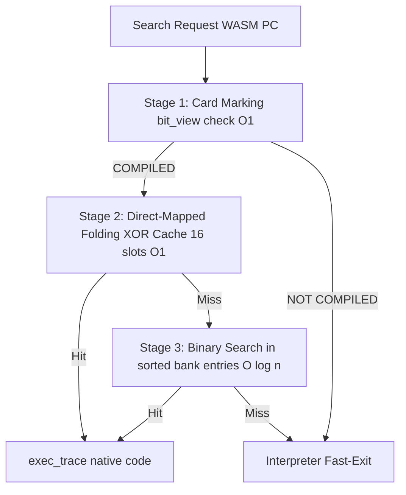
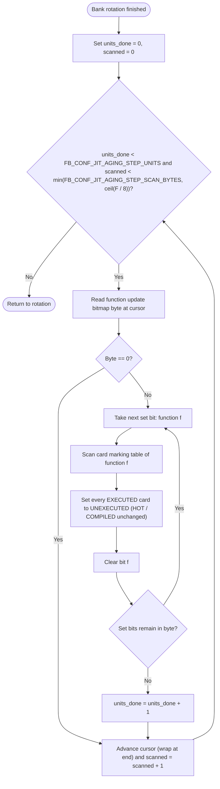
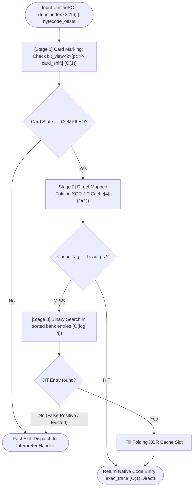
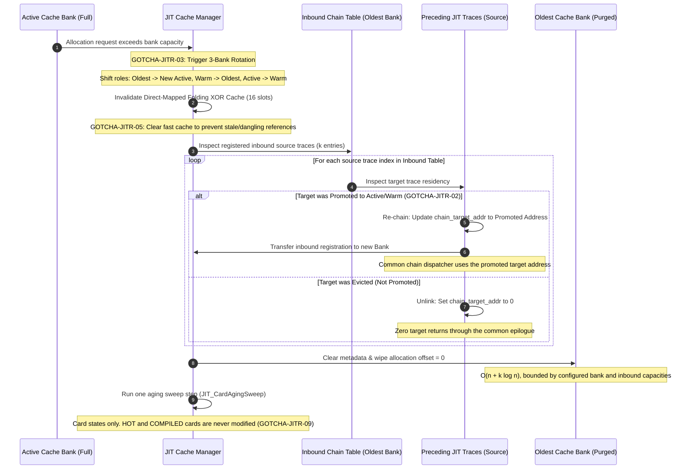
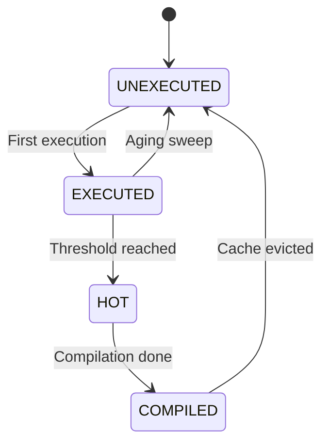
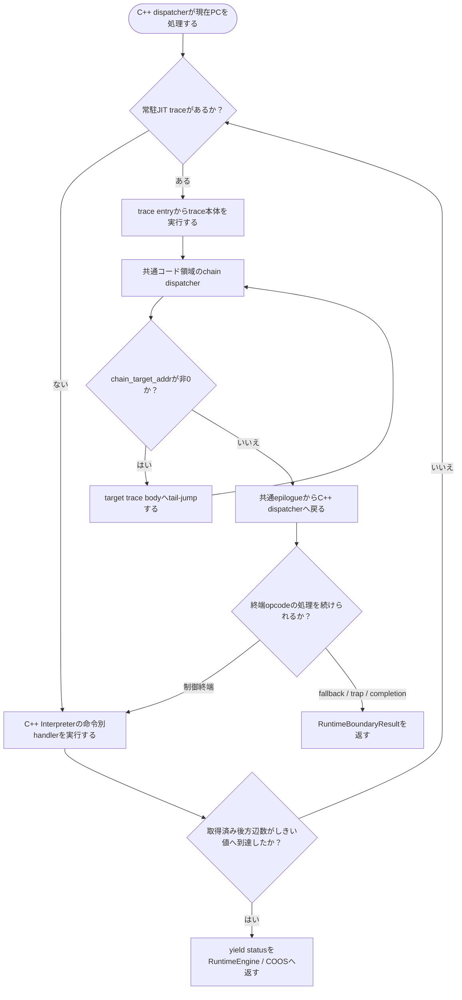

# JIT ランタイム管理 コンポーネント設計書 {VERIFY_FORMAL} {VERIFY_LLM} {VERIFY_BENCHMARK}
<!-- evidence:
     formal: formal/jit_cache_model.py
     benchmark: experiments/pysim/benchmarks/jit/bench_fast_cache.py
     test: docs/qa/tier3_executer/jit_runtime_test_spec.md
-->

## 1. コンセプト
<!-- traceability: {SimpleJITArchitecture} {JIT_MultiBuffer_Cache} {JIT_OldestOnly_Promote} {META_AccessDictionary} {META_BinarySearch} {LowLatencyJIT} {LowOverhead} {HistoryBuffer} {GLOBAL_PeriodicTask} {DirectMappedJIT16} {Runtime_BumpAllocator} -->
JIT ランタイム管理は、WASM PC とネイティブコードの紐付け検索を担当する。3面世代交代コードキャッシュのローテーションも担当する。ホットスポット検出も一括して担う。

実行入口は Tier 3 `Interpreter` のテンプレートメソッド契約と共有する。`JITInterpreter` は `Interpreter.call()` の呼出状態・完了・トラップ・結果検証を継承し、実行ドライバだけを `RuntimeEngine` のJIT／Interpreter統合経路へ差し替える。これにより、Interpreter と JIT の実行経路は同じ公開 `call()` 境界で比較できる。

インタープリタ実行ループ内の検索は3段で構成する。第1段はカードマーキング表 (`bit_view<2>`) による $O(1)$ 事前判定、第2段はDirect-Mapped Folding XORキャッシュ（16スロット）による $O(1)$ 検索、第3段は各バンクのソート済みJITエントリ配列に対する二分探索である。エントリ数が少ないためRadix表は設けず、補助索引のメモリと更新処理を持たない。

3面コードキャッシュはデータ用バンプアロケータとは別に管理する。x64参照構成では、実行可能バッファの書込権限と実行権限を同時に有効にしない。ARMv8-Mの物理配置と保護方式はTBDである。

## 2. アーキテクチャ分類
<!-- traceability: {META_3TierSeparation} {SimpleJITArchitecture} -->
本コンポーネントは **Tier 3 (詳細リーフコンポーネント: Leaf Component)** に属する。JIT サブシステムのうち実行時検索、3面コードキャッシュ管理、局所アンリンク、ホットスポット検出を担当する。コード生成コアは [`jit_compiler.md`](docs/components/tier3_executer/jit_compiler.md) が担当する。

### 2.1 JIT サブシステムのデコンポジション
<!-- traceability: {JIT_CopyAndPatch} {JIT_Encoder} {SimpleJITArchitecture} -->
JITサブシステムは、以下の2つの独立した設計書に責務を分離して構成される。
- **[jit_compiler.md](docs/components/tier3_executer/jit_compiler.md)**: 命令テンプレートを用いたネイティブコード生成および静的命令エンコードを担当する。
- **[jit_runtime.md](docs/components/tier3_executer/jit_runtime.md)**: 実行履歴監視、ホットスポット判定、PC-アドレス変換検索、3面キャッシュローテーションを担当する。 `SimpleJITArchitecture` `{JIT_MultiBuffer_Cache}`

### 2.2 実装責務と依存方向
<!-- traceability: {META_ContractImplSplit} {META_StaticDI} {META_3TierSeparation} -->
Tier 3 の `RuntimeEngine` は、Tier 2 の [`jit_runtime_contract.py`](experiments/pysim/tier2_runtime/jit_runtime_contract.py) が定義する `JITRuntime` 契約を介して、モジュール登録、基本ブロック解決、ホットスポット記録、イールド処理、トレース検索、チェイン解決、およびキャッシュ無効化を呼び出す。Tier 2 契約はカード表、履歴リング、コンパイル待ち列、キャッシュバンク、直接マップ索引の型へ依存しない。

Tier 3 の実装は次の責務に分ける。

| 実装 | 所有する責務 | 依存先 |
| :--- | :--- | :--- |
| [`jit_manager.py`](experiments/pysim/tier3_executer/jit/jit_manager.py) の `JITRuntimeManager` | ホットスポットカード、候補マスク、履歴リング、関数更新表、コンパイル待ち列、ブロック索引、コンパイル起動、トレース検索、チェイン解決 | Tier 2 `JITRuntime` の呼出し形、Loaderの`Module`/`BasicBlock`情報 |
| [`jit_cache.py`](experiments/pysim/tier3_executer/jit/jit_cache.py) | 3面コードキャッシュ、バンク回転、Oldest昇格、局所アンリンク、エントリ索引 | `JITRuntimeManager` からの所有・通知 |
| [`x64_jit.py`](experiments/pysim/tier3_executer/jit/x64_jit.py) | トレースのコード生成とコンパイラ実装 | `JITCompiler` 契約、JIT ABI |
| [`runtime_engine.py`](experiments/pysim/tier3_executer/jit/runtime_engine.py) | Interpreter/JITの実行境界、vIRQ、実行統計、トレース継続 | Tier 2 `JITRuntime`契約、Tier 3 Interpreter |

このPython参照実装では `RuntimeEngine` の生成時に `JITRuntimeManager` を注入する。JIT有効時の検索はTier 3 managerが担う。C++製品構成ではTier 2の [`runtime_composer.hxx`](experiments/pysim/tier2_runtime/runtime_composer.hxx) がビルド構成から実行器とlookup方針を型として選ぶ。現時点のC++ヘッダとビルドprobeは構成の静的合成を検証するものであり、Python製JIT managerのlookup実装をC++へ移植したものではない。

Tier 3内部の依存は `JITInterpreter` → `RuntimeEngine` → `Interpreter` の向きに保つ。JIT実行管理はTier 2の `JITRuntime` 契約を実装し、InterpreterからJIT管理へ戻る依存を作らない。

本コンポーネントには独立した概念モデルを置かない。現在の実行経路はC++ runtime、x64機械語実装、形式モデルおよびpysimテストで確認する。

## 3. 静的モデル

### 3.1 データ構造
<!-- traceability: {JIT_ReverseCompilationOrder} -->
- **統一プログラムカウンタ (`UnifiedPC` / `wasm_pc_t`)**: モジュール全体の全関数・全命令を一意に識別する 32ビット整数である。
  - **構造**: `(func_index << 16) | (bytecode_offset & 0xFFFF)`
    - **上位 16ビット (`func_index`)**: モジュール内の関数インデックス（0 〜 65,535）。
    - **下位 16ビット (`bytecode_offset`)**: 当該関数のバイトコード内オフセット（0 〜 65,535 バイト）。
  - **役割**: 複数関数を含む WASM モジュールにおいて、関数間の PC 衝突を防止する。一意な追跡とディスパッチを保証する。
- **`JitEntryIndex`**: WASMオフセットとネイティブコードの対応付け、および 4 段高速検索ロジックをカプセル化した主要クラスである。
- **カードマーキング表 (Card Marking Table)**: 関数ごとのコード領域を 4 バイト単位のカードで分割管理する 2 ビット状態表である。密ビュー `fireball::bit_view<2>` として参照する。
  - `0: UNEXECUTED` (未実行)
  - `1: EXECUTED` (実行済み)
  - `2: HOT` (コンパイル要求中)
  - `3: COMPILED` (コンパイル済み / オンデマンド許可)
- **コンパイル対象可否マスク (Trackable Mask)**: ブロックの静的適格性を管理する 1 ビット状態表である。ロード時に一度だけマークされる。`next_pc` を持ち、かつバイト長が `min_trace_bytes` 以上のブロックを対象とする。密ビュー `fireball::bit_view<1>` として独立バッファで参照する。実行時のディスパッチはこの 1 ビットのみを参照する。ブロックの静的メタデータを再走査する必要がない。 `{TrackableBlockMask}`
- **関数更新表 (Function Update Bitmap)**: 関数添字ごとの 1 ビット状態表である。前回の巡回以降に、その関数のカードが `UNEXECUTED` から `EXECUTED` へ遷移した関数だけに 1 を立てる。密ビュー `fireball::bit_view<1>` として独立バッファで参照する。
  - サイズは、モジュールの関数数と同じビット数である。
  - 関数添字は、touch した PC の上位 16 ビットから直接決まる。カードや基本ブロックの解決は要らない。
  - 巡回は 8 関数を 1 バイトとして行う。値が 0 のバイトは 1 回の比較で読み飛ばす。
  - コードを持たない関数（import 関数）のビットは立たない。
- **エイジングカーソル**: 関数更新表のバイト位置を保持する整数である。モジュール登録時に 0 で初期化し、表の末尾に達したら先頭へ戻る。
- **JITエントリ表**: 各バンクの `head_pc` 順に並ぶ固定容量配列である。検索は二分探索（$O(\log n)$）とし、削除済み枠は無効項目として扱う。エントリが少ないためRadix索引を設けない。
- **x64参照コード領域 (8KB)**: シミュレータ構成では4KBページ2枚分の領域を使う。先頭2KBは開始処理、終了処理、x64ヘルパー呼出しコード、chain dispatcher、および絶対アドレスプールを置く非エビクション領域とし、残る2KBずつを`Bank 0 (Active)`, `Bank 1 (Warm)`, `Bank 2 (Oldest)`に割り当てる。x64トレースヘッダはtrace identityとchain/helper targetだけを保持する。共通コード領域はflushやバンクローテーションでも維持する。ARMv8-Mの領域容量、物理配置、保護方式、ヘッダ形式はすべてTBDである。
  x64参照共通領域内の固定オフセットは次のとおりである。オフセットはコード領域先頭からの値であり、トレースヘッダのフィールド位置とは別の値である。

  | 共通領域オフセット | 配置物 | 容量・用途 |
  | :--- | :--- | :--- |
  | `0x000` | x64参照開始処理 | 4つの論理引数を受けてトレース本体へ移行する |
  | `0x020` | x64参照終了処理 | 共有状態を同期して呼び出し元へ復帰する |
  | `0x030` | コンテキスト型ヘルパー入口 | トレースヘッダの関数アドレスを共通呼出しコードへ渡す |
  | `0x050` | 絶対アドレスプール | 256バイトの共通アドレス領域 |
  | `0x160` | x64 i32ヘルパー入口群 | 32バイト単位で4入口。2個の32ビット整数引数と結果領域ポインタで関数を呼び出し、終了処理へ戻る |
  | `0x200` | x64 wideヘルパー入口群 | 32バイト単位で11入口。ヘルパー契約ごとの引数を設定して関数を呼び出し、終了処理へ戻る |
  | `0x400` | x64共通chain dispatcher | 32バイト。Traceヘッダのchain targetを読み、次trace bodyへtail-jumpする。未接続時は共通終了処理へ戻る |

  chain dispatcherはopcode別の分岐handlerを共通化しない。分岐条件・control frame更新・後方分岐回数はC++ Interpreterの命令別handlerが処理する。handler実行後にC++ dispatcherが別traceを選ぶ遷移と、共通コードchain dispatcherがtarget bodyへtail-jumpするchainは別の経路である。Pythonはchain機械語を組み立てず、C++ `constexpr` assemblerで生成した固定命令列をx64参照構成の共通領域へ一度だけ配置する。ARMv8-Mの呼出し入口、配置方式、命令列はTBDである。
- **オンデマンドコンパイルキュー (On-demand Compile Queue)**: `HOT` に達した命令オフセットを保持する固定容量 LIFO キューである。容量到達時にバッチコンパイルが即座に実行される。固定容量を上回ることはない。 `JIT_ReverseCompilationOrder` `{GLOBAL_Policy_Memory}`
- **バンク別被チェイン逆引きテーブル (Inbound Chain Index Table)**: 各キャッシュバンクへ向けたchain元のJITエントリを保持する固定長配列である。cache回転・promote時に共通chain dispatcherが参照するtarget addressを更新または解除する。
- **前方chainメタデータ**: Python cache metadataの`chain_next` / `next_pc`は直線後続traceの論理PCを保持する。x64物理ヘッダの`chain_target_addr`は共通chain dispatcherがtail-jumpするresident target bodyを保持する。後方branch linkは作らず、branch handlerへ制御を戻す。
- **実行履歴バッファ**: 短期間の実行履歴を一時的に保持するリングバッファである。 `{HistoryBuffer}`

### 3.2 内部ブロック図

### 3.3 主要なクラス・構造体・配列・定数

#### JITエントリインデックス（JitEntryIndex）クラス
| 項目名 | 機能と役割 | 型分類 | サイズ・制約 |
| :--- | :--- | :--- | :--- |
| 高速スロット配列 | 4-bit スロット選択を行う Folding XOR Hash による Direct-Mapped キャッシュ | 固定長配列 | 16スロット (`{DirectMappedJIT16}`) |
| エントリ配列 | `head_pc` 昇順のJITエントリを保持する | 固定長ソート配列 | 二分探索 $O(\log n)$。Radix索引なし |
| カードマーキング表 | カードごとの 2-bit 状態表 | 密ビュー | `fireball::bit_view<2>` |
| 関数更新表 | 前回の巡回以降に `EXECUTED` のカードが生じた関数の印 | 密ビュー | `fireball::bit_view<1>`、関数数ビット |
| 被チェイン逆引きテーブル | バンクごとの被チェイン元 JIT エントリインデックス配列 | 固定長配列の配列 | `FB_CONF_JIT_MAX_INBOUND_CHAINS_PER_BANK` |
| 履歴バッファ | 判定契機までの一時的な実行記録 | リングバッファ | `offset` の配列 `{HistoryBuffer}` |

## 4. 動的モデル

### 4.1 アルゴリズム
<!-- traceability: {DirectMappedJIT16} -->
1. **カードマーキング確認 ($O(1)$)**: カードマーキング表 (`bit_view<2>`) を $O(1)$ で確認する。状態が `COMPILED` でなければ即座に終了する。
2. **Direct-Mapped Folding XOR キャッシュ確認 ($O(1)$)**:
   - `UnifiedPC` を 32→16→8→4 ビットと3回の XOR で折りたたむ。
   - `slot = temp & 0x0F` を計算して16スロットの高速テーブルを照合する。
   - スロットのタグが `head_pc` と一致（Hit）した場合、バンク検索をバイパスして $O(1)$ でトレースを返す。
3. **バンク内二分探索 ($O(\log n)$)**:
   - キャッシュミス時、Active / Warm / Oldest の順に各バンクの `head_pc` 昇順配列を二分探索する。JITエントリ数が少ないためRadix表は持たない。
   - 固定容量配列内のキーに一致するlive entryがあればトレースを得る。tombstoneまたはキー不一致なら次のバンクを検索する。
   - ヒットした場合はネイティブコードアドレス（`exec_trace`）を返す。
   - 次回用として高速スロットへ格納する。
5. **ホットスポット昇格判定**:
   - yield 時等に履歴バッファを走査する。
   - 実行頻度が閾値に達したカードを`HOT`のままコンパイル待ち列へ登録する。コンパイルとcache挿入の両方が成功した場合にのみ`COMPILED`へ遷移する。
   - コンパイル失敗時は対象bitを解除し、そのブロックを再履歴・再コンパイル対象にしない。cache evictionまたは明示flushでは、対象bitを維持したままカードを`UNEXECUTED`へ戻し、次の閾値までhotnessを再計測する。
6. **最小トレース長フィルタ**:
   - 推定サイズが 1 カード分未満のブロックは、履歴記録やコンパイル登録の対象外とする（TEST-JITR-06）。
7. **3面世代交代ローテーションと局所アンリンク (`{GOTCHA-JITR-03}`, `{JIT_MultiBuffer_Cache}`, `{JIT_OldestOnly_Promote}`)**:
   - Active バンク満杯時、`Oldest` バンクをパージして新 `Active` に再利用する。
   - パージ直前に、被チェイン逆引きテーブルに登録されたソースエントリ（$k$ 件）のみを参照する。
   - 昇格済みなら再チェイニングし、完全破棄なら復帰スタブへアンパッチする。全件走査は行わない。
   - `rotate()` および `flush_all()` 実行時には Folding XOR 高速キャッシュを無効化する。古いバンクへの誤参照を防止する（`{GOTCHA-JITR-05}`）。
   - ローテーションのたびに、エイジングスイープを 1 ステップ実行する（手順10）。`flush_all()` では実行しない。
   - 参照実装のバンク破棄は、破棄対象の$n$項目の消去と被チェイン元$k$件の照合を伴うため、実際の処理量は$O(n + k\log n)$である。固定容量$n_max$と被チェイン件数上限$k_max$により停止量は上限化されるが、$O(k)$とは表現しない。ターゲット実装はバンク破棄の方法を別途定義する。
8. **トレース昇格時のインバウンドソース付け替え (`{GOTCHA-JITR-02}`)**:
   - Oldest バンクのトレースが再実行されて新 Active バンクへ昇格した際、チェイン先アドレスを新バンクへ更新する。
   - 逆引きテーブルの登録先も新バンクへ付け替える。古いバンクがパージされた後のダングリングジャンプを防止する。
9. **キュー処理時のキャッシュ再確認と二重コンパイル抑止 (`{GOTCHA-JITR-01}`)**:
   - コンパイル待ち列から取り出した PC が、既に 3 面キャッシュに常駐済みであれば再コンパイルを行わない。カード状態のみ `COMPILED` へ同期する。
   - **設計理由**: 二重コンパイルによるキャッシュ容量の浪費と CPU 時間の損失を完全に防止する。
10. **エイジングスイープ (`{JIT_CardAgingSweep}`)**:
   - 目的は、`EXECUTED` のまま長く残ったカードを `UNEXECUTED` へ戻すことである。時間的に離れた2回の実行が `HOT` を成立させる状況を防ぐ。
   - 契機は、3 面キャッシュのローテーション（`rotate()`）である。ローテーション 1 回につき 1 ステップを実行する。バンク満杯による自動ローテーションも含む。コンパイルの成否や `flush_all()` では実行しない。
   - ローテーションは、キャッシュ圧迫の直接の指標である。追い出しが起きない間は、エイジングも止めてよい。
   - 1 回の実行では、エイジングカーソルから 8 関数（1 バイト）単位で関数更新表を進める。
   - 値が 0 でないバイトを `FB_CONF_JIT_AGING_STEP_UNITS` 個処理した時点で、1 回の実行を終える。
   - 走査したバイトが `FB_CONF_JIT_AGING_STEP_SCAN_BYTES` 個に達した時点でも、1 回の実行を終える。値が 0 のバイトも走査数に数える。
   - 値が 0 のバイトは処理数に数えず、読み飛ばす。表を 1 周しても終了条件に達しない場合は、1 周した時点で終える。
   - 処理するバイトでは、ビットが立った関数だけを扱う。
   - 処理する関数では、その関数のカードマーキング表を先頭から末尾まで走査し、`EXECUTED` のカードをすべて `UNEXECUTED` へ戻す。その後、当該関数のビットを 0 にする。
   - `HOT` と `COMPILED` のカードには触れない。`HOT` はコンパイル待ち列と対応し、`COMPILED` は常駐トレースと対応するためである。
   - 走査後にカーソルを進める。表の末尾に達したら先頭へ戻る。
   - **ビットを立てる契機**: カードが `UNEXECUTED` から `EXECUTED` へ遷移した時点で、そのカードの関数のビットを立てる。この遷移はカード状態の更新（touch）の中だけで起きる。遷移が起きた場合を除き、ホットパスへ処理を追加しない。
   - **設計理由**: 前回の巡回以降に `EXECUTED` のカードが生じていない関数は、`EXECUTED` のカードを持たない。更新表を持つことで、その関数のカード表の走査を省く。
   - **上限**: 1 回の実行で走査するバイトは最大 $\min(O, \lceil F / 8 \rceil)$ 個である。処理する関数は最大 $8 \times U$ 個である（$F$: 関数数、$U$: `FB_CONF_JIT_AGING_STEP_UNITS`、$O$: `FB_CONF_JIT_AGING_STEP_SCAN_BYTES`）。
   - **処理量**: 1 関数の処理量は、その関数のカードマーキング表の大きさに比例する。1 回の実行の最大処理量は、$8 \times U$ 個の関数のカード表の合計である。
   - **有限性**: ビットが立った関数は、高々 $\lceil \lceil F / 8 \rceil / O \rceil + \lceil \lceil F / 8 \rceil / U \rceil$ 回のローテーションの内に処理される。1 周に要するローテーションは、少なくとも $\lceil \lceil F / 8 \rceil / O \rceil$ 回である。
   - **保持期間**: カーソルが通過する直前に `EXECUTED` になったカードは、ほぼ直後に減衰する。1 周に要するローテーション数の下限は走査上限が決め、値が 0 でないバイトが多いほど 1 周は長くなる。減衰は関数単位なので、同じ関数の `EXECUTED` のカードは同時に減衰する。`HOT` の閾値（2回の実行）はこの範囲で満たす必要がある。

#### エイジングスイープ手順（手順アクティビティ図）
<!-- traceability: {JIT_CardAgingSweep} {TrackableBlockMask} {GOTCHA-JITR-09} -->
ローテーションごとに実行する巡回手順を示す。

#### 3段高速検索パイプライン手順（手順アクティビティ図）
<!-- traceability: {JIT_MultiBuffer_Cache} {LowLatencyJIT} {DirectMappedJIT16} {META_BinarySearch} -->
実行時 PC からネイティブ `exec_trace` アドレスを特定する3段探索パイプラインを示す。

#### 3面世代交代ローテーションと被チェイン局所アンリンク（責務シーケンス図）
<!-- traceability: {GOTCHA-JITR-02} {GOTCHA-JITR-03} {JIT_MultiBuffer_Cache} {JIT_LazyChaining} {JIT_CardAgingSweep} -->
Active バンク満杯時の世代交代において、局所アンリンクと再チェイニングの連携シーケンスを示す。

### 4.2 状態遷移図
<!-- traceability: {GOTCHA-JITR-09} -->

キャッシュ破棄（Eviction）時は `EXECUTED` ではなく `UNEXECUTED` へリセットする（TEST-JITR-04）。

エイジングスイープが `UNEXECUTED` へ戻せる状態は `EXECUTED` だけである。`HOT` と `COMPILED` は変更しない。

コンパイル失敗時はカードを`COMPILED`にせず、独立したTrackable Maskの対象bitを解除する。これはカード状態の遷移ではなく再試行対象の除外であり、eviction後に候補性を保ったままhotnessを取り直す動作とは異なる。

### 4.3 トレース実行時の分岐解決とインタープリタ復帰
<!-- traceability: {JIT_RuntimeAPI_Fallback} {DirectBytecodeExecution} {GOTCHA-JITR-02} -->
制御フロー・コール境界のインタープリタ委譲不変条件を示す。ロード時の静的解析で各基本ブロックに付帯情報を持たせる。これにより実行時の分岐解決を定数時間で行う。

| 付帯情報 | 意味 |
| :--- | :--- |
| 後続アドレス | 分岐条件が不成立だった場合に続くブロックの先頭アドレス |
| 分岐先アドレス | 分岐条件が成立した場合に実際にジャンプする先のアドレス |
| フレーム深さ | 当該ブロック到達時に積まれているべき制御フレームの深さ |
| 命令列長 | 当該ブロック自身が占める命令バイト数（足切り判定用） |

命令列長は、後続アドレスから自分自身の先頭アドレスを引いて求めてはならない。後方分岐ブロックでは差分が負になる。その結果「短すぎる」と誤判定される。命令列長はブロック自身の命令バイト数から直接求める。

JIT trace終端の制御命令はC++ Interpreterの対応ハンドラで実行し、取得された後方分岐をそのハンドラ内で数える。C++ dispatcherは分岐後のPCから常駐トレースを検索し、JIT traceまたはC++ handlerを連続実行する。`FB_CONF_RUNTIME_YIELD_THRESHOLD` 到達時にdispatcherがyield statusを返し、RuntimeEngineからCOOS境界へ制御を戻す。C++ Interpreter単独経路も同じdispatcher・カウンタ・しきい値を使う。後方分岐カウンタは時間ではなく取得した後方分岐の回数である。非対応命令、外部呼出し、trap、関数完了は必要な早期境界となる。

trace chainは直線後続traceが常駐する場合に限り、trace末尾から共通コード領域のchain dispatcherへ移り、dispatcherがTraceヘッダのtarget bodyへtail-jumpする経路を指す。未接続のtargetは0で表し、共通epilogueから実行境界へ戻る。opcode別handlerの呼出しや、C++ handler後にC++ dispatcherが別traceを選ぶ遷移はchainではない。chain dispatcherは命令を判定せず、分岐helperも持たない。

常駐trace表とホットスポット候補PC表は、キャッシュ世代または候補マスク世代が変わったときだけ構築する。通常経路ではC++ dispatcherがこのsnapshotをlookupし、制御handler実行後もしきい値到達まではC++内で次のtraceまたはhandlerを選ぶ。`FB_CONF_RUNTIME_PROFILE_STATS`は既定で無効であり、OFF構成では診断カウンタ処理をC++拡張へ生成しない。`FB_CONF_JIT_HOTSPOT_PROFILING`は未コンパイル領域の動的ホットネス観測を選び、既定値は有効である。OFF構成では観測処理を生成せず、常駐traceのlookupとC++ handlerによる遷移だけを行う。どちらの値を変更した場合もC++拡張を再ビルドする。

`NativeTraceDispatchEntry`はC++ `native_trace_descriptor`と同じフィールド順・アラインメントを持つ`ctypes.Structure`である。Tier 3 managerが固定容量のtrace descriptor、候補PC、観測回数配列を`NativeDispatchSnapshot`として所有し、C++ dispatcherは呼び出し中だけbuffer viewを保持して有効なprefixを直接読む。Python tupleからC++配列への呼び出しごとの変換は行わない。ホストx64の最大容量では従来のローカル配列が19,400バイトのdispatcherスタック枠を使っていたが、この配列領域をmanager所有のctypesバッファへ移し、呼び出し間で再利用する。これはメモリ総量の削減ではなく、dispatcherのホストスタック使用量を減らし、ABIデータをPythonから参照可能にする配置変更である。

#### コンパイル済みトレース実行後の遷移手順（アクティビティ図）

- **分岐条件の扱い**: `BR_IF` はJITトレースが残した条件値をC++ Interpreter handlerが消費する。`IF` も同じハンドラが条件を消費し、必要な制御frameを積む。
- **関数終了の定数時間解決 (`{GOTCHA-JITR-08}`)**: `RETURN` で終わるブロックでは命令列を再走査しない。トレースは戻り値を共有operand stackへ確定した後、C++ Interpreterのreturn handlerを通る。
- **制御フレームの整合 (`{GOTCHA-JITR-06}`)**: JIT trace bodyは制御終端命令（`RETURN`を含む）を実行しない。共通chain dispatcherからepilogue経由でC++ dispatcherへ戻った後、対応するC++ handlerを一度実行する。handlerが条件を消費し、制御frameを更新し、遷移先PCを決める。Python側で分岐を再計算しない。通常実行では同じC++ dispatcherが次PCをlookupし、後方分岐しきい値まで処理を続ける。
- **短小判定の符号 (`{GOTCHA-JITR-07}`)**: ブロックの足切り判定は自身の命令バイト数で行う。後続アドレスとの差分で代用すると、後方分岐ブロックで差分が負になり、高頻度ブロックが永久に除外されてしまう。
- **エイジングと常駐状態の分離 (`{GOTCHA-JITR-09}`)**: エイジングスイープは `EXECUTED` のカードだけを変更する。`COMPILED` まで戻すと、常駐トレースのカードが `UNEXECUTED` になり、lookup が常駐コードを見逃す。`HOT` まで戻すと、コンパイル待ち列の要求とカード状態が食い違う。常駐性の正本はキャッシュ、待ち列の正本は待ち列であり、スイープはどちらも書き換えない。
- **押し出し量の事前確認**: ランタイムは、トレースを呼ぶ前に、連鎖先を含む最大の `stack_words` が空き容量に収まることを確認する。収まらない場合はトレースを使わず、インタープリタが実行する。インタープリタは、容量超過を `assert` で停止する。JITだけが容量外へ書き込む状態を作らないためである。
- **連鎖の再リンク**: 昇格とローテーションの後も、非0のchain targetは常駐トレースbodyの有効なアドレスを指す。Pythonのヘッダとネイティブのヘッダは一致する。後続が退避された場合は`chain_target_addr`を0にし、共通chain dispatcherから共通epilogueへ戻す。制御終端はC++ Interpreter handlerが処理し、通常のlookupはC++ dispatcherが続ける。

## 5. インターフェース定義

### 5.1 公開API

#### Tier 2実行境界（JITRuntime）
| 項目 | 内容 |
| :--- | :--- |
| 機能概要 | Tier 2実行ループへ、Tier 3のブロック解決、履歴記録、トレース検索、チェイン情報、キャッシュ無効化を提供する。 |
| 実装 | Tier 2 `jit_runtime_contract.py` のProtocolとTier 3 `JITRuntimeManager` |
| 構成 | `RuntimeEngine(jit_runtime=JITRuntimeManager(...))` による静的依存性注入 |
| 不変条件 | Tier 2はTier 3のカード表・キュー・キャッシュ実装へ直接アクセスしない。 |

#### RuntimeEngineの実行境界
| 項目 | 内容 |
| :--- | :--- |
| `run(interpreter, call_state)` | C++ dispatcherを取得済み後方分岐数によるyield、fallback、trap、または完了まで進め、継続状態とYield要求を返す。Python側の協調実行ループは持たない。 |
| `call(interpreter, func_index, args)` | `SYNCHRONOUS`構成用の同期アダプター。同じ`run()`を完了まで反復する。 |
| `RuntimeDriveMode.COOS` | System/vSoCが選択する構成。未完了状態を同期アダプターへ渡すことを禁止し、COOSへのYield判定と発行をSystemに限定する。 |
| 不変条件 | COOSと同期呼出しは別の命令実行実装を持たず、同じ`run()`境界を使う。ベンチマーク専用処理はRuntimeEngineに含めない。 |

#### 検索（lookup）
| 項目 | 内容 |
| :--- | :--- |
| 機能概要 | 命令オフセットに対応するネイティブコードアドレス（`exec_trace` 型）を返す。 |
| シグネチャ | `lookup(pc: wasm_pc_t) -> result<exec_trace, jit_lookup_result_t>` |
| 戻り値 | 成功時はネイティブ実行エントリ、失敗時はエラーコードを返す。 |

#### エントリ登録（register_entry）
| 項目 | 内容 |
| :--- | :--- |
| 機能概要 | 命令オフセットとネイティブ実行コードアドレスを登録し、索引を更新する。 |
| シグネチャ | `register_entry(pc: wasm_pc_t, native_entry: exec_trace) -> void` |

## 6. 制約達成の方策

### 6.1 性能制約
- **方策**: カードマーキング表と16スロットFolding XORキャッシュの $O(1)$ 事前検索後、キャッシュミス時に少数のソート済みJITエントリを二分探索する（$O(\log n)$）。Radix索引は設けず、固定容量配列と二分探索を共通の検索契約とする。

### 6.2 メモリ制約
<!-- traceability: {JIT_MultiBuffer_Cache} {JIT_OldestOnly_Promote} -->
- **方策**: 3面循環バッファと Oldest ヒット限定昇格を採用する。Oldestのlookup hitは即時にActiveへ昇格し、Warmのhitは昇格させない。断片化を防ぎつつ、低頻度コードを自然に破棄させる。

## 7. 形式検証・テスト仕様との対応

### 7.1 検証対象の不変条件
<!-- traceability: {GOTCHA-JITR-09} -->
- **3面キャッシュ代謝の有界性**: 循環ローテーションによる Oldest パージと新 Active 再利用を検証する。
- **局所アンリンク安全性**: 被チェインソース$k$件だけを逆引き表から処理する。バンク再利用は全$n$項目の消去とバンク検索を伴い、$O(n + k\log n)$である。固定容量により有界だが$O(k)$のみとは主張しない。
- **カード状態の遷移規則**: 昇格は `UNEXECUTED`、`EXECUTED`、`HOT`、`COMPILED` の順だけで進む。`UNEXECUTED` へ戻す経路は、パージ時のリセットとエイジングスイープの2つに限る。
- **エイジング安全性**: エイジングスイープは `HOT` と `COMPILED` のカードを変更しない。`COMPILED` のカードは常駐トレースと対応し続ける。
- **更新表の包含性**: 関数更新表のビットが 0 の関数は、`EXECUTED` のカードを持たない。`EXECUTED` になる経路は `UNEXECUTED` からの遷移だけである。
- **エイジングの有限性**: 関数更新表のビットが立った関数の `EXECUTED` のカードは、有限回のローテーションの内に、走査されて減衰するか `HOT` へ進む。

### 7.2 テスト仕様書との連携
本コンポーネントのテストケースおよび直交表は、[`jit_runtime_test_spec.md`](docs/qa/tier3_executer/jit_runtime_test_spec.md) を正本として定義する。形式検証モデルは `formal/jit_cache_model.py` を参照する。
