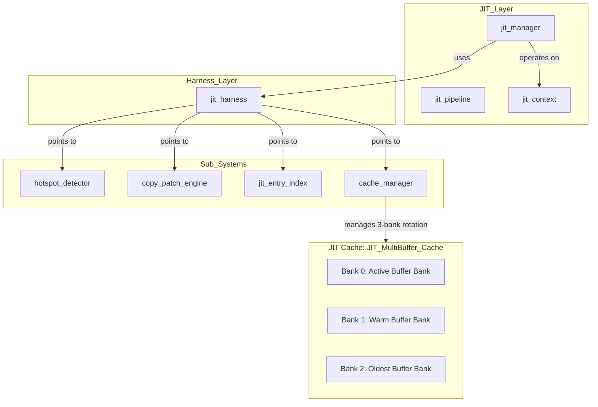
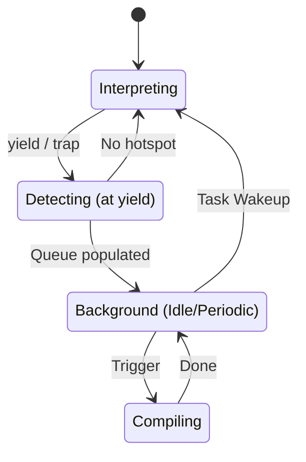
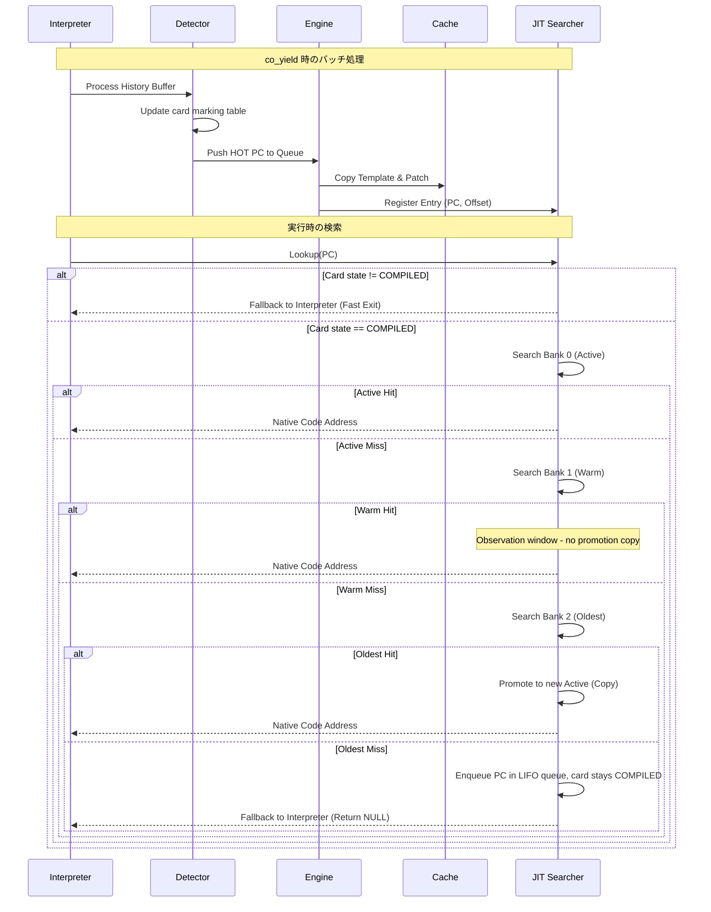

# JIT コンパイラ コンポーネント設計書 {VERIFY_FORMAL} {VERIFY_LLM}

## 1. コンセプト
<!-- traceability: {LowLatencyJIT} {JIT_CopyAndPatch} {JIT_ZeroCompileCostTheorem} {SimpleJITArchitecture} {GLOBAL_PeriodicTask} {GLOBAL_IdleDetection} {JIT_Encoder} {JIT_MultiBuffer_Cache} {JIT_OldestOnly_Promote} -->
JIT Compiler は、WASMバイトコードを実行時にネイティブコードへ変換し、実行速度を向上させる。Execution Engine (`executor`) の一部として、インタープリタと一対の「実行エンジン」として機能する。極小リソース環境（RAM 64KB）において、コンパイルコストを極小化する「Zero Compile Cost 定理」に基づき、最適化を省いた高速な **Copy-and-Patch** 方式を採用する。 `{LowLatencyJIT}` `{JIT_CopyAndPatch}` `{JIT_ZeroCompileCostTheorem}` `{SimpleJITArchitecture}` `{GLOBAL_PeriodicTask}` `{GLOBAL_IdleDetection}` `{JIT_Encoder}` `{JIT_MultiBuffer_Cache}` `{JIT_OldestOnly_Promote}`

## 2. アーキテクチャ分類
<!-- traceability: {META_3TierSeparation} -->
本コンポーネントは **Tier 3 (詳細リーフコンポーネント: Leaf Component)** に属し、vSoC (`runtime_vsoc.md`) から分解された JIT コンパイルパイプラインおよびマルチバッファキャッシュローテーションを統括する。Copy-and-Patchコード生成、Constexprアセンブラ、エントリスタブ、ホットスポット検出の深層責務は、同じく Tier 3 の各リーフコンポーネントへさらに分割して記述する。 `{META_3TierSeparation}`

## 3. 静的モデル

### 3.1 データ構造
<!-- traceability: {JIT_MultiBuffer_Cache} {JIT_OldestOnly_Promote} {SimpleJITArchitecture} -->
- **JITキャッシュ**: ネイティブコードを保持するマルチバッファ (デフォルト 3面: 2KB x 3 = 6144 Bytes `FB_CONF_JIT_CACHE_SIZE`)。Copy-GC方式により、フラグメンテーションを回避しつつ効率的にメモリを再利用する。 `{JIT_MultiBuffer_Cache}`
- **JITエントリテーブル**: WASM PCとキャッシュ内のコードオフセットを紐付けるソート済み管理テーブル。非所有ビュー `fireball::flat_map_view` として参照され、二分探索で検索される。 `{SimpleJITArchitecture}` `{META_FlatMapIndexed}`
- **JITエントリグループインデックス (JIT Entry Group Index)**: JITエントリテーブルの探索区間を $O(1)$ で絞り込むための粗索引（固定長配列）。WASM PCのビットシフトにより、対応するエントリ配列の探索区間 `[first, last]` を $O(1)$ で特定する。
- **カードマーキング表 (Card Marking Table)**: **カード単位**で実行頻度とコンパイル状態を管理する2ビット状態表。密ビュー `fireball::bit_view<2>` として参照し、1バイトあたり4カードを保持する（[静的コンテナ語彙](../tier1_core/system_containers.md)）。
    - `0: UNEXECUTED` (未実行)
    - `1: EXECUTED` (実行済み)
    - `2: HOT` (コンパイル要求中)
    - `3: COMPILED` (Hotカード。いずれかのPCがコンパイル済み、またはオンデマンド・コンパイルが許可された状態)
- **コンパイルキュー**: コンパイル待ちのWASM PCを保持する。即時チェイニングを最大化するため、**後入れ先出し (LIFO)** または **履歴の逆順** で処理される。

### 3.2 内部ブロック図
<!-- traceability: {JIT_MultiBuffer_Cache} {SimpleJITArchitecture} -->

### 3.3 主要なクラス・構造体・配列・定数
<!-- traceability: {JIT_MultiBuffer_Cache} {SimpleJITArchitecture} -->

#### JITハーネス（jit_harness）
サブコンポーネントへのポインタを集約する。

| 項目名 | 機能と役割 | 型分類 | サイズ・制約 |
| :--- | :--- | :--- | :--- |
| ホットスポット検知器 | 命令の実行頻度を監視するサブコンポーネント | 構造体への参照 | [`hotspot_detector`](jit_runtime_hotspot.md) (非所有) |
| パッチエンジン | テンプレートからコードを生成するサブコンポーネント | 構造体への参照 | [`copy_and_patch_engine`](jit_engine_copy_patch.md) (非所有) |
| エントリ索引 | PCと生成コードの対応を管理する索引 | 構造体への参照 | [`jit_entry_index`](jit_runtime_entry.md) (非所有) |
| キャッシュマネージャ | 生成コードのメモリ領域を管理するサブコンポーネント | 構造体への参照 | 独自構造体 (非所有) |

#### JITコンテキスト（jit_context）
可変状態を保持する。

| 項目名 | 機能と役割 | 型分類 | サイズ・制約 |
| :--- | :--- | :--- | :--- |
| バンク配列 | 3面のキャッシュバンク実体。役割は `active_index` からの相対で決まる | データ範囲の配列 | `std::array<std::span<uint8_t>, 3>` |
| アクティブバンク索引 | 現在の Active バンク番号。`(active_index + 1) % 3` が Warm、`(active_index + 2) % 3` が Oldest | 索引 | 8bit符号なし（rotate() で加算） |
| コンパイル待ち列 | 後でコンパイルを行うWASM PC (uint32_t) の格納キュー | 固定長LIFOキュー | `std::array<uint32_t, FB_CONF_JIT_QUEUE_SIZE>` |
| カードマーキング表 | カード単位の 2-bit 実行状態 | 密ビュー | `fireball::bit_view<2>` |

#### JIT構成（jit_config）
<!-- traceability: {META_ConfigurableSystem} {GLOBAL_StaticScalability} -->
JITエンジンの挙動を制御する性能パラメータ。 `{META_ConfigurableSystem}` `{GLOBAL_StaticScalability}`

| 項目名 | 機能と役割 | 型分類 | サイズ・制約 |
| :--- | :--- | :--- | :--- |
| 単一バンク上限 | 各キャッシュ領域（Active/Warm/Oldest）の最大バイト数 | バイト数 | 32bit符号なし（2のべき乗） |
| 最大登録件数 | 1つのバンクに保持可能な最大トレース件数 | エントリ数 | 32bit符号なし |
| カード境界シフト | カード1枚がカバーするWASMサイズ（2のべき乗） | シフト量 | 8bit符号なし |
| 命令境界シフト | 生成コードのアドレスアライメント | シフト量 | 8bit符号なし |

#### JIT トレース実行シグネチャ (`exec_trace`)
<!-- traceability: {JIT_RuntimeAPI_Fallback} {ContextPointerRegister} {EnvironmentPointer} -->
JIT コンパイル済みネイティブトレースの実行エントリポイント。インタープリタの `opcode_handler` と完全同一の `__fastcall` 継続渡し（CPS）3引数シグネチャを持ち、レジスタ再配置オーバーヘッドなしに相互遷移する。 `{JIT_RuntimeAPI_Fallback}` `{ContextPointerRegister}` `{EnvironmentPointer}`

| 項目名 | 機能と役割 | 型分類 | サイズ・制約 |
| :--- | :--- | :--- | :--- |
| トレースシグネチャ | `__fastcall` によるネイティブトレース実行関数 | 関数ポインタ | `void (__fastcall *)(const uint8_t* __restrict__ ip, execution_context* __restrict__ stack_bot, vsoc_runtime* __restrict__ env) noexcept` |
| レジスタ割り当て | ARM AAPCS / `__fastcall` 引数レジスタマッピング | 物理レジスタ | `R0`: `ip` (WASM PC) `R1`: `stack_bot` (スタックボトム基底ポインタ `{ContextPointerRegister}`) `R2`: `env` (環境ポインタ `{EnvironmentPointer}`) `R3`: **`Context Spill` (任意ピン留め: `mem_base`, `local_base`, `scratch` 等)** `R4`/`R5`: スタックトップキャッシュ (TOS, NOS) |

### 3.4 公開API
外部コンポーネント（Executor等）からJITコンパイル機能を利用するためのAPI。

#### JITコンパイル実行 (`jit_compile`)
| 項目 | 内容 |
| :--- | :--- |
| 機能概要 | 指定されたWASM PCから始まる命令トレースをネイティブコードへJITコンパイルし、アクティブ領域へ書き込む。 |
| シグネチャ | `auto jit_compile(jit_context& ctx, const jit_harness& harness, uint32_t pc) noexcept -> jit_compile_result_t` |
| 引数 | `ctx`: JIT可変コンテキスト構造体 `harness`: 各種モジュールへの参照を保持するハーネス `pc`: コンパイル開始位置の WASM PC |
| 戻り値 | `jit_compile_result_t` (成功時は `SUCCESS`、キャッシュフル時は `ERR_CACHE_FULL` などのエラーコード列挙型) |

#### JITコード検索 (`jit_lookup`)
| 項目 | 内容 |
| :--- | :--- |
| 機能概要 | 指定されたWASM PCに対するネイティブコードが既にコンパイル済みであるか検索し、ヒットした場合はその実行開始アドレスを返す。 |
| シグネチャ | `auto jit_lookup(jit_context& ctx, const jit_harness& harness, uint32_t pc) noexcept -> result<uintptr_t, jit_lookup_result_t>` |
| 引数 | `ctx`: JIT可変コンテキスト構造体 `harness`: ハーネス参照 `pc`: 検索対象の WASM PC |
| 戻り値 | 成功時はネイティブ実行開始アドレス（`uintptr_t`、`exec_trace` 型）を返し、未コンパイル時は `ERR_NOT_COMPILED` などのステータスコードを返す `result` 型。 |

## 4. 動的モデル

### 4.1 アルゴリズム

#### Copy-and-Patch コンパイル手順

<!-- traceability: {JIT_CopyAndPatch} {META_AI_Native_Dev} {JIT_RuntimeAPI_Fallback} {ContextPointerRegister} {ADR_TosCacheAsymmetry} -->
1. **トレース解析と R3 スピル変数決定**: コンパイル対象トレース内の命令構成を走査し、翻訳単位として `R3` にピン留めするコンテキスト変数（メモリアクセス主体なら `mem_base`、ローカル変数主体なら `local_base`、セーフポイント監視なら `safepoint_flag`、純粋計算なら `scratch`）を決定する。
2. **テンプレート・バリアント選択**: 決定された `R3` スピル状態およびスタックキャッシュ状態（R4=TOS, R5=NOS）に対応する事前定義済みのネイティブコードテンプレート・バリアントを選択する。トレース先頭では必要に応じて `LDR R3, [R1, #offset]` を 1 度だけ配置する。すべてのテンプレートは `__fastcall` CPS 3引数規約に完全準拠する。 `{ADR_TosCacheAsymmetry}`
3. **コードコピー**: テンプレートをアクティブ・キャッシュ領域の「ベースアドレス + 使用済みサイズ」の位置へコピーする。
4. **パッチ適用 (プレースホルダ埋め)**:
    - 即値（定数）をプレースホルダに書き込む。
    - ランタイムAPIのアドレスを書き込む。
    - 相対ジャンプ先を計算して書き込む。
5. **インタープリタ連携とフォールバック (Zero-Reconstruction Interop)**:
    - JIT トレース末尾、未コンパイル命令、またはトラップ発生時、JIT コードはレジスタ R0〜R2 に最新の `(ip, stack_bot, env)` を保持したまま、インタープリタのオプコードハンドラ（またはディスパッチャ）へ直接末尾ジャンプ（`BX`）する。
    - **コンテキストの再構築（構造体への退避/復元、レジスタ再配置）は発生しない**。ただしスタックトップキャッシュ `R4`/`R5` はインタープリタ側の規約に存在しないため、ダーティであれば統合スタックへ `STR` × 2 で書き戻してから制御を渡す。この 2 命令が JIT ↔ インタープリタ遷移の唯一のコストであり、トレース長で償却される。 `{JIT_RuntimeAPI_Fallback}` `{ADR_TosCacheAsymmetry}`
6. **エントリ登録 & 命令キャッシュ同期**: JITエントリを作成し、命令オフセット（PC）順を維持するようにエントリ配列に挿入する。同時に JIT エントリグループインデックスを更新する。パッチ適用完了後、Cortex-M33 向けにデータキャッシュをクリーンし、`__DSB()`（データ同期バリア）および `__ISB()`（命令同期バリア）を発行して命令キャッシュ（I-Cache）のコヒーレンシを保証する。

#### JITトレース検索 & 3面キャッシュ代謝アルゴリズム
<!-- traceability: {JIT_MultiBuffer_Cache} {JIT_OldestOnly_Promote} -->
1. **事前フィルタ (カードマーキング)**: 命令オフセット（PC）をカードインデックス（`pc >> card_shift`）に変換し、カードマーキング表 (`bit_view<2>`) を $O(1)$ で直接参照する。該当カードの状態が「コンパイル完了」でない場合は即座に終了。
2. **アクティブ領域（Bank 0: Active）検索**:
    - JIT エントリグループインデックスを用いて $O(1)$ で探索区間を絞り込み、得られた `flat_map_view` に対して命令オフセットで二分探索を行う。
    - ヒットした場合は、そのネイティブコードのアドレスを返して終了。
3. **中間領域（Bank 1: Warm）検索**:
    - Active バンクでミスした場合、Warm バンクのエントリを JIT エントリグループインデックス経由で二分探索する。
    - ヒットした場合、無償観測期間（Observation Window）として**昇格コピーを行わず**、そのままネイティブコードのアドレスを返して実行する（無駄な昇格オーバーヘッドを排除）。
4. **最古領域（Bank 2: Oldest）検索と限定昇格 (Oldest-Only Promotion)**: `{JIT_OldestOnly_Promote}`
    - Warm バンクでもミスした場合、破棄直前の Oldest バンクを同様に検索する。
    - Oldest バンクでヒットしたコード（現在も実行され続けている Hot コード）を新 Active バンクへ Promote（昇格コピー）する。昇格しないまま次回のローテーションを迎えた Cold コードはそのまま Eviction（破棄）される。
5. **3面リングバッファローテーション（Swap/Eviction）**:
    - Active バンク（2KB）の残り容量が不足した場合、3面リングローテーションを実行する：
      * `Bank 2 (Oldest)` の全エントリを完全に破棄・クリア（Purge）し、新たな `Bank 0 (Active)` とする。
      * 従来の `Bank 0 (Active)` は `Bank 1 (Warm)` へ、従来の `Bank 1 (Warm)` は `Bank 2 (Oldest)` へと役割をシフトする。
6. **オンデマンド・キューイング (頻出カード・フォールバック)**:
    - 全 3 バンクでミスし、かつ状態が「コンパイル完了」の場合、対象の命令オフセットをコンパイル待ち列（LIFO）へ登録する。実際のコンパイルは次回のバッチ処理（アイドル時等）で行われる。
7. **結果の返却**:
    - ヒット（または昇格成功）時はネイティブコードのアドレスを返す。
    - いずれのバンクでもミスした場合は（たとえ「コンパイル完了」カードであっても） NULL を返し、インタープリタ実行を継続する。カード状態は `COMPILED` のまま変更しない（`{ADR_SafeQueuingOnHotMiss}` に従い、再コンパイル要求はステップ 6 のキュー投入のみで表現する）。 `{ADR_SafeQueuingOnHotMiss}`

#### トレース・チェイニング（連鎖実行）
<!-- traceability: {JIT_LazyChaining} -->
検索オーバーヘッドを排除するため、ネイティブコード同士を直接接続（チェイニング）する。
1. **トレース構造**: 各トレースの末尾に、次に実行すべきネイティブアドレスを保持する「チェイニング・スロット（`chain_next`）」を設ける。
2. **既定状態**: スロットは初期状態で **インタープリタへの復帰** を指す。これにより、不必要な動的検索（ディスパッチャ・スタブ経由）を排除する。 `{JIT_LazyChaining}`
3. **連結（Linking）タイミング**:
    - **新規コンパイル時**: 生成したトレースのフォールスルー先（`next_pc`）が既に **アクティブ領域または Warm 領域** にあれば、スロットをそのアドレスへ書き換える。Warm はまだ rotate() で消去されておらず実行可能なコードとして常駐しているため、Active に限定する必要はない。
      ループの背進辺（`loops_to`）は連結の対象外とする。バックエッジに埋め込まれるのは Safepoint ポーリングのみであり、実際の比較分岐命令ではないため、ループを継続するか抜けるかの判定は依然として WASM スタックをポップする `_next_pc()` に委ねられている。背進辺へ直接チェインすると、その判定とスタック pop の両方を飛ばしてしまい、条件付きループが無条件の無限ループに変質する。
    - **昇格時**: Oldest 領域からアクティブ領域へトレースを移すだけであり、これは既存の有効なリンク集合（アクティブ ∪ Warm）を狭める操作ではないため、追加のリンク再評価は不要である。
4. **ダングリング・チェイン掃引**: Oldest 領域は次の rotate() で即座にパージされ得るため、連結先として採用しない。一方で Warm 領域は rotate() のたびに 1 世代ずつ Oldest へ繰り下がるため、常に最も残存寿命の長い世代（新規挿入直後のアクティブ領域）に生まれるチェイン元より **先に** パージされる場合がある。この非対称性に対処するため、rotate() のたびに全バンクの生存トレースを走査し、`chain_next` の参照先がアクティブ領域・Warm 領域のいずれにも属さなくなっていれば、その場でスタブへフォールバックさせる（Dangling Pointer を作らせない）。

#### 統合 Tiered ランタイムエンジン・コンセプトコード (`../tier2_runtime/concepts/runtime_engine_concept.py`)
インタープリタ実行、2-bit Hotspot 検出、Copy-and-Patch JIT コンパイル、3面マルチバッファキャッシュ（Active/Warm/Oldest）、および MPU W^X 保護プロトコルを統合した自己完結実行シミュレーションは [`../tier2_runtime/concepts/runtime_engine_concept.py`](../tier2_runtime/concepts/runtime_engine_concept.py) を参照。

#### ホットスポット判定 (yield 時)
<!-- traceability: {JIT_LazyChaining} -->
1. **履歴走査**: インタープリタの実行サイクル中に記録、蓄積された「実行履歴バッファ」を走査する。
2. **状態更新**: カードマーキング表の状態が「頻出」に達した命令オフセットを「コンパイル待ち列」（LIFOキュー）に投入する。
3. **遅延チェイニング制御**: ホットスポットと判定されてコンパイルキューへ投入されたトレースは、JITコードの末尾においてインタープリタ実行環境へ正しく復帰（遷移制御）するためのディスパッチャ・スタブが初期値としてチェイニング（連結）され、遅延チェイニングを実現する。 `{JIT_LazyChaining}`

#### バッチコンパイル (周期実行またはアイドル時)
<!-- traceability: {JIT_ReverseCompilationOrder} {GLOBAL_PeriodicTask} {GLOBAL_IdleDetection} -->
1. **キューの取得**: 「コンパイル待ち列」から対象の命令オフセットを**逆順（LIFO）**で取り出す。 `{JIT_ReverseCompilationOrder}`
2. **コンパイル実行**: 後続のトレースを先にコンパイルすることで、先行するトレースのリンク時（Patching 時）にターゲットが既にキャッシュ内に存在する確率を上げ、即時チェイニングを実現する。
3. **補足**: COOSの `register_periodic_callback` または `set_idle_hook` により実行される。これにより、実行スレッドのブロッキング時間を抑える。 `{GLOBAL_PeriodicTask}` `{GLOBAL_IdleDetection}`

### 4.2 状態遷移図
<!-- traceability: {JIT_LazyChaining} {JIT_ReverseCompilationOrder} {GLOBAL_PeriodicTask} {GLOBAL_IdleDetection} -->

### 4.3 内部シーケンス
<!-- traceability: {JIT_LazyChaining} {JIT_ReverseCompilationOrder} {GLOBAL_PeriodicTask} {GLOBAL_IdleDetection} -->
#### JITコンパイルおよび検索シーケンス

## 5. 検証

### 5.1 直交表: 検索・昇格・代謝
<!-- traceability: {JIT_MultiBuffer_Cache} {JIT_OldestOnly_Promote} {ADR_SafeQueuingOnHotMiss} -->
JITトレース検索時の内部状態と期待される挙動を検証する。3面バンク（Active / Warm / Oldest）を独立した列として扱う。

| ケース | カードマーキング状態 | Active | Warm | Oldest | 期待される動作 |
| :--- | :--- | :--- | :--- | :--- | :--- |
| 1 | UNEXECUTED (0) | - | - | - | 事前フィルタで即時終了、インタープリタ実行継続 |
| 2 | EXECUTED (1) | - | - | - | 事前フィルタで即時終了、インタープリタ実行継続 |
| 3 | HOT (2) | - | - | - | インタープリタ継続（コンパイル待ち列に投入済み） |
| 4 | COMPILED (3) | **hit** | - | - | **JITコード実行**（昇格なし） |
| 5 | COMPILED (3) | miss | **hit** | - | **昇格せず** Warm 上のコードをそのまま実行（無償観測期間） `{JIT_OldestOnly_Promote}` |
| 6 | COMPILED (3) | miss | miss | **hit** | **新 Active へ昇格 (Copy)** してから JIT 実行 `{JIT_OldestOnly_Promote}` |
| 7 | COMPILED (3) | miss | miss | miss | NULL 返却 + コンパイル待ち列へ投入。**カード状態は COMPILED のまま変更しない** `{ADR_SafeQueuingOnHotMiss}` |
| 8 | (書き込み時) | **満杯** | - | - | 3面リングローテーション: Oldest を Purge して新 Active に、Active→Warm、Warm→Oldest。同時に `chain_next` のダングリング掃引を行う |

### 5.2 内部コンポーネントのデコンポジション
<!-- traceability: {JIT_Encoder} -->
JITエンジンの責務を、以下の独立したサブコンポーネントに分離して設計する。

- **[JIT Hotspot Detector](jit_runtime_hotspot.md)**: 実行履歴の監視とコンパイル要否の判定。
- **[Copy-and-Patch Engine](jit_engine_copy_patch.md)**: 命令テンプレートを用いたネイティブコード生成。
- **[JIT Entry Index](jit_runtime_entry.md)**: PC-アドレス変換テーブルの管理と検索高速化。
- **[constexpr Assembler](jit_assembler_constexpr.md)**: 静的な命令エンコード DSL。 `{JIT_Encoder}`

**責務の境界**:
- **jit_manager**: ホットスポット判定、コンパイルキュー管理、Active/Warm/Oldestキャッシュ領域の選択、エントリテーブルへの登録を担う調整役。`compile_trace` を介してエンジンに処理を委譲する。
- **Copy-and-Patch Engine** ([jit_engine_copy_patch.md](jit_engine_copy_patch.md)): WASM命令のフェッチ、テンプレート選択、バイナリコピー、プレースホルダへのパッチ適用というバイナリ生成操作に特化。書き込んだバイト数を返すのみで、エントリ管理には関与しない。

## 6. インターフェイス定義

### 6.1 公開API
外部から利用可能なオブジェクト指向APIを定義する。

#### 初期化（initialize）
<!-- traceability: {META_ConfigurableSystem} -->

| 項目 | 内容 |
| :--- | :--- |
| 機能概要 | コードキャッシュ領域、管理テーブル、およびカードマーキング表の初期化を行う。 |
| シグネチャ | `initialize(ctx: 可変参照, config: const参照) -> 結果型` |
| 引数 | `ctx`: JITコンテキスト (`jit_context`) への可変参照 `config`: JIT構成 (`jit_config`) への読取専用参照 |
| 戻り値 | 結果型 (成功時は空、エラー時はエラーコード) |
| 事前条件 | 設定パラメータが一貫しており、静的に確保されたメモリの範囲を超えていないこと。 |
| 事後条件 | カードマーキング表がクリアされ、キャッシュが空の状態になる。 |
| 不変条件 | 実行中に `config` の値を変更してはならない。 |
| エラー時の挙動 | メモリ割り当ての不備がある場合はエラーを返す。 |
| 補足 | `{META_ConfigurableSystem}` の方針に基づき、基本的にはブート時に一度だけ呼び出される。 |

#### トレース検索（lookup_trace）
<!-- traceability: {META_ConfigurableSystem} -->

| 項目 | 内容 |
| :--- | :--- |
| 機能概要 | 指定されたWASMプログラムカウンタ(PC)に対応する、コンパイル済みのネイティブコードの実行アドレスを高速に検索する。 |
| シグネチャ | `lookup_trace(pc: address) -> result<address, bool>` |
| 補足 | カードマーキング表の状態が `COMPILED` でない場合は即座に失敗を返す。その後、`harness` 経由でエントリ索引を検索する。本機能は、ヘッダファイルで定義されたマクロ（`FB_CONF_JIT_CACHE_SIZE`等）に基づき、システムのメモリマップや検索範囲等のパラメータが固定された状態で動作する。 `{META_ConfigurableSystem}` |

#### カード状態取得（get_card_state）
<!-- traceability: {META_ConfigurableSystem} -->

| 項目 | 内容 |
| :--- | :--- |
| 機能概要 | 指定したPCが属するカードの状態（2-bit）を取得する。 |
| シグネチャ | `get_card_state(pc: address) -> u8` |
| 補足 | 本機能は、コンパイル時に固定されたカード境界シフト値（`FB_CONF_JIT_CARD_SHIFT`等）のマクロ定義に基づき、PC値からカードインデックスへの変換を高速に行う。 `{META_ConfigurableSystem}` |

#### 検索範囲取得（get_search_range）
<!-- traceability: {META_ConfigurableSystem} {FlatViewNarrowing} {META_BinarySearch} -->

| 項目 | 内容 |
| :--- | :--- |
| 機能概要 | JITエントリグループインデックスを用いて、指定されたWASM PCに対応する探索区間を $O(1)$ で `fireball::flat_map_view` へ絞り込む。生の添字対ではなくビューを返すことで、呼び出し側が区間を誤った配列と組み合わせる余地をなくす（[静的コンテナ語彙](../tier1_core/system_containers.md) を参照）。該当グループが存在しない場合は空ビューを返す。 `{FlatViewNarrowing}` `{META_BinarySearch}` |
| シグネチャ | `get_search_range(bank_idx: u8, pc: address) -> flat_map_view<u32, code_offset>` |
| 補足 | 本機能は、ヘッダファイルで定義されたJITエントリグループサイズおよび最大登録件数のマクロ定数（`FB_CONF_JIT_ENTRY_GROUP_SHIFT`等）に基づき、二分探索範囲をコンパイル時に静的に制限して計算する。 `{META_ConfigurableSystem}` |

#### バッチコンパイル処理（process_batch_compile）
<!-- traceability: {META_ConfigurableSystem} -->

| 項目 | 内容 |
| :--- | :--- |
| 機能概要 | インタープリタが収集した履歴を基にコンパイルを実行する。 |
| シグネチャ | `process_batch_compile(ctx: 可変参照, harness: 構造体への参照) -> void` |
| 引数 | `ctx`: JITコンテキスト への可変参照 `harness`: JITハーネス への参照 |
| 戻り値 | void |
| 補足 | `executor` 実装内で `co_yield` 発生時に呼び出され、アイドル時間等を活用して処理される。 |

### 6.2 URI/IPCインターフェイス
<!-- traceability: {META_ConfigurableSystem} -->
本コンポーネントは vSoC の内部ライブラリであり、直接のIPCインターフェイスは持たない。

## 7. 制約達成の方策

### 7.1 性能制約と方策
<!-- traceability: {JIT_CopyAndPatch} {JIT_RegisterMapping} -->
- **目標**: コンパイルレイテンシを最小化し、WAMRインタープリタを上回る実行速度を実現。
- **方策**: 
    - `{JIT_CopyAndPatch}`: 複雑な最適化を省き、テンプレートコピーのみでコンパイルを完了。
    - `{JIT_RegisterMapping}`: `Context`, `StackTop`, `WASM_PC` を物理レジスタに固定し、メモリアクセスを削減。
    - `Card Marking (O(1)) + Binary Search`: カードマーキング表による $O(1)$ 事前フィルタと二分探索により、高速な検索を実現。

### 7.2 安全性制約と方策
<!-- traceability: {PositionIndependentCode} {MemoryBoundaryCheck} {FastAddressCheck} {SimpleJITArchitecture} -->
- **目標**: 不正なコード実行および W^X 違反の防止。
- **方策**: 
    - `{PositionIndependentCode}`: 生成コードを位置独立とし、配置場所の自由度を確保。
    - `Cache Capacity Check`: コード生成時にキャッシュ溢れを厳密にチェックし、溢れた場合は 3面リングローテーションにより Oldest バンクを破棄して再利用する。これはキャッシュ容量管理であり、`{MemoryBoundaryCheck}`（ゲストメモリアクセスの隔離）とは別の関心事である。 `{SimpleJITArchitecture}`
    - `{MemoryBoundaryCheck}`: 生成コードに埋め込むゲストメモリアクセスの境界チェック。`FastAddressCheck` のマスク演算により、ゲストリニアメモリ範囲外へのロード/ストアをトラップする。 `{MemoryBoundaryCheck}` `{FastAddressCheck}`
    - `MPU W^X 保護`: Cortex-M33 PMSAv8 MPU を用い、JIT パッチ書き込み時は `RW+XN`、ネイティブ実行時は `RO+X` に切り替え、`__DSB(); __ISB();` メモリ・命令同期バリアを発行する。書き込みと実行の同時許可（RWX）を物理的に排除する。`formal/jit_cache_model.py` により変異検査付き形式モデルとして検証。

## 8. 設計判断 (ADR)
<!-- traceability: {ADR_ScalableCodeOffset} {ADR_SafeQueuingOnHotMiss} {ADR_TosCacheAsymmetry} -->

- **決定事項**: `{ADR_TosCacheAsymmetry}`
  - **背景**: JIT トレースはスタックマシンである WASM のオペランドを `R4`/`R5` に TOS/NOS としてキャッシュすると大きく速くなるが、インタープリタのオプコードハンドラは AAPCS 引数レジスタ `R0`〜`R3` を `(ip, stack_bot, env, scratch)` で使い切っており、TOS を保持する余地がない。両者は `__fastcall` CPS シグネチャを共有するため、この差をどう扱うかを決める必要がある。
  - **選択肢と評価**:
    - 案1: CPS を 4 引数化（`ip, stack_bot, env, tos`）し、インタープリタ側も TOS をレジスタ保持する。遷移コストは真にゼロになるが、`{ContextPointerRegister}` の統合スタック化でせっかく解放した `R3` スクラッチを再び失い、全ハンドラが TOS 不変条件の維持義務を負う。
    - 案2: JIT からも `R4`/`R5` を廃し、両者ともオペランドを統合スタックのメモリ上でのみ扱う。記述は最も単純になるが、スタックマシンに対する唯一かつ最大の最適化余地を捨てることになり、`{LowLatencyJIT}`（WAMR 超え）の達成が困難になる。
    - 案3: 非対称を許容し、JIT トレース内部でのみ `R4`/`R5` を TOS/NOS として使用する。トレース脱出時にダーティ値を統合スタックへ書き戻す。
  - **結論**: 案3を採用する。
  - **評価**: 「ゼロオーバーヘッド」の主張範囲を **コンテキスト再構築がゼロであること** に限定し、トレース脱出時の `STR` × 2 を明示的な有界コストとして仕様に記載する。JIT トレースは複数 WASM 命令にまたがるため、この 2 命令はトレース長で償却され、トレース内部で得られる TOS/NOS キャッシュの利得を下回る。インタープリタは `R4`/`R5` について何の不変条件も負わない（callee-saved として通常どおり扱う）ため、ハンドラ実装の複雑度も増えない。

- **決定事項**: `{ADR_ScalableCodeOffset}`
  - **背景**: 16ビットの `code_offset` をそのまま使用すると、コードキャッシュが64KBに制限される。将来的に外部メモリ等を活用してキャッシュを拡張（例：512KB）する場合、このビット幅がボトルネックとなる。
  - **選択肢**:
    - 案1: `code_offset` を32ビットにする（エントリテーブルのメモリ消費が25%以上増加）。
    - 案2: 命令アライメント (`code_align_shift`) を利用してビットシフトして保持する。
  - **結論**: 案2を採用。 `actual_offset >> code_align_shift` を保持する。
  - **評価**: これにより、エントリテーブルのサイズを維持したまま、アライメントに応じたスケーラビリティを確保できる。最大キャッシュサイズは `65535 << code_align_shift` となる。

- **決定事項**: `{ADR_SafeQueuingOnHotMiss}`
  - **背景**: `COMPILED` 状態のカードで検索ミスが発生した場合、その場で同期コンパイルを行うか、キューイングするか。
  - **結論**: `Compile Queue` にプッシュし、インタープリタへフォールバックする。
  - **理由**: 同期コンパイルは実行ループ内での予測不可能なレイテンシ（ジッタ）の原因となるため。
