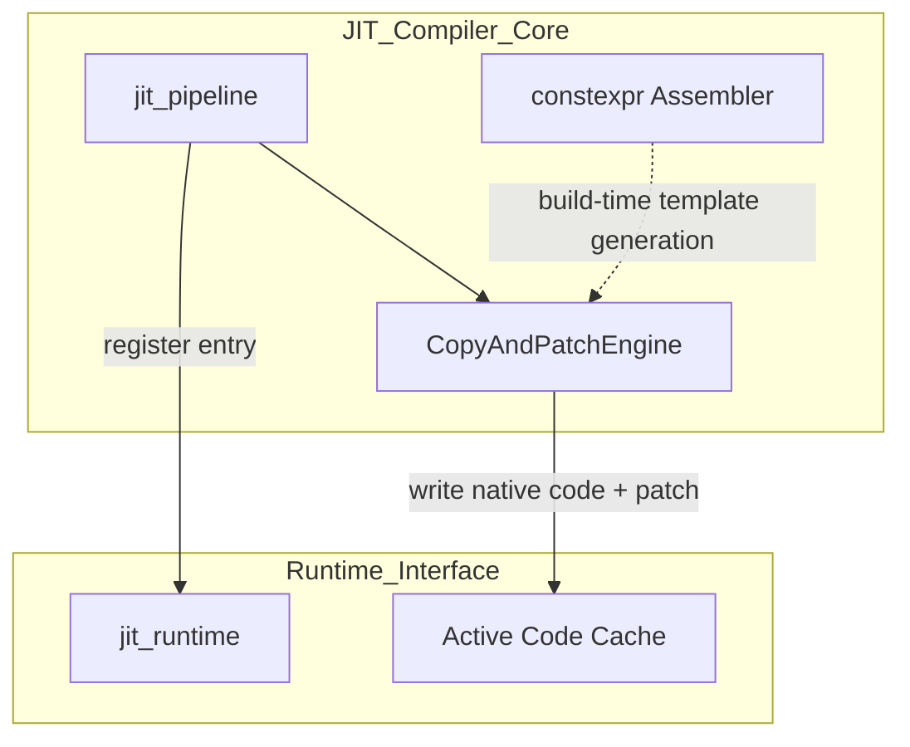
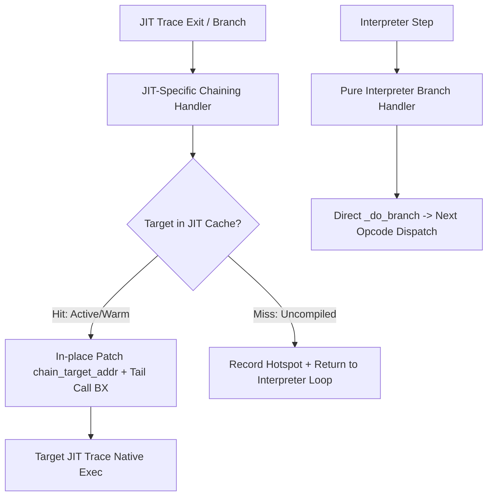
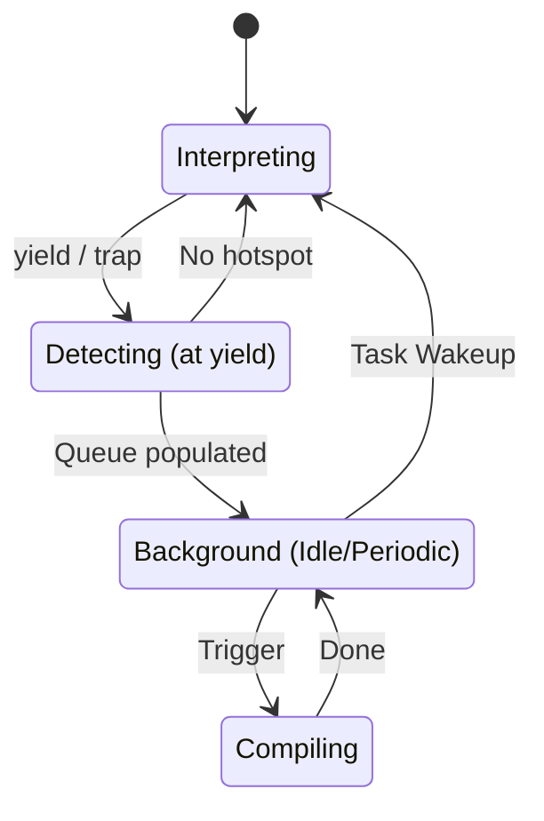
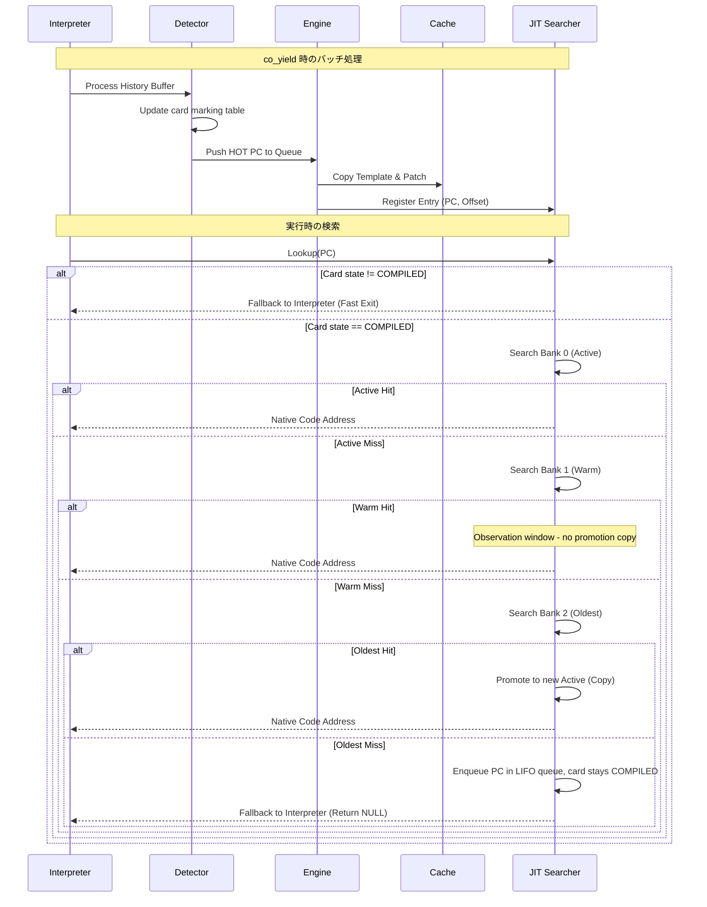

# JIT コンパイラ コンポーネント設計書 {VERIFY_FORMAL} {VERIFY_LLM} {VERIFY_BENCHMARK}
<!-- evidence:
     formal: formal/jit_cache_model.py
     benchmark: benchmarks/zero_runtime_overhead_bench.py
     concept: concepts/jit_copy_patch_concept.py
     test: tests/jit_compiler_test_spec.md
-->

## 1. コンセプト
<!-- traceability: {LowLatencyJIT} {JIT_CopyAndPatch} {JIT_ZeroCompileCostTheorem} {SimpleJITArchitecture} {JIT_Encoder} {PositionIndependentCode} {SinglePassCompilation} -->
JIT Compiler は、WASMバイトコードを実行時にネイティブコードへ変換し、実行速度を向上させる。Execution Engine (`executor`) の一部として、インタープリタと一対の実行エンジンとして機能する。極小リソース環境（RAM 32KB〜64KB）において、コンパイルコストを極小化する「Zero Compile Cost」方針に基づき、最適化を省いた高速な **Copy-and-Patch** 方式を採用する。命令テンプレートは C++ `constexpr` アセンブラによりビルド時に確定され、実行時は単純なメモリコピーと特定箇所への定数書き込み（パッチ）のみを行う。 `{LowLatencyJIT}` `{JIT_CopyAndPatch}` `{JIT_ZeroCompileCostTheorem}` `{SimpleJITArchitecture}` `{JIT_Encoder}` `{PositionIndependentCode}` `{SinglePassCompilation}`

## 2. アーキテクチャ分類
<!-- traceability: {META_3TierSeparation} {JIT_CopyAndPatch} -->
本コンポーネントは **Tier 3 (詳細リーフコンポーネント: Leaf Component)** に属し、vSoC (`runtime_vsoc.md`) から分解された JIT コンパイルパイプライン、事前生成テンプレートのコピー＆パッチ結合、および C++ `constexpr` 命令エンコードを担当する。ランタイム側のエントリ検索・キャッシュ管理・ホットスポット検出は [`jit_runtime.md`](jit_runtime.md) が担当する。 `{META_3TierSeparation}` `{JIT_CopyAndPatch}`

## 3. 静的モデル

### 3.1 データ構造
- **`CopyAndPatchEngine`**: WASM命令に対応するネイティブ命令テンプレートを選択・コピーし、即値・分岐先・APIポインタをパッチ適用するクラス。
- **`constexpr_assembler`**: C++の `constexpr` 機能を活用し、ビルド時に Thumb-2 / RISC-V 命令バイナリを型安全に静的生成する DSL。
- **命令テンプレート (`jit_template`)**: パッチスロットを含むネイティブ命令列の雛形（[JIT ステンシルカタログ](../../specs/jit_stencil_catalog.md) 準拠）。
- **JIT トレースヘッダ (`jit_trace_header`)**: キャッシュに書き込まれる各ネイティブトレースの先頭（`+0x00`）に配置される 16 バイト固定長のメタデータ構造体。

### 3.2 内部ブロック図


### 3.3 主要なクラス・構造体・定数

#### コンパイル単位とインタープリタ協調方針
<!-- traceability: {LowLatencyJIT} {SimpleJITArchitecture} {PositionIndependentCode} -->
- **関数/モジュール一括コンパイルの完全禁止**: 極小リソース環境（RAM 32KB〜64KB）におけるコンパイル遅延とメモリ消費をゼロ化するため、関数全体やモジュール全体の事前一括コンパイルは一切行わない。
- **純粋ベーシックブロック/トレース単位コンパイル**: 2-bit カードテーブル（カードマーキング表）で HOT（`10`）に達した直線命令列（基本ブロック / トレース）のみを、スケジューラのアイドル時（`idle_hook` 等）に Copy-and-Patch により 1 トレースずつオンデマンド生成する。
- **複雑命令のハンドラ直接委譲ポリシー (`{JIT_RuntimeAPI_Fallback}`)**:
  - **インライン展開対象（Primitive Inline Ops）**: `i32.const`, `local.get`, `local.set`, `i32` 算術・論理・シフト・単純比較など、固定長ステンシルで完結する高頻度・低複雑度の直線演算のみを JIT ステンシルとしてキャッシュに展開する。
  - **ハンドラ直接呼び出し/フォールバック対象（Complex Delegated Ops）**:
    1. 制御フロー・フレーム遷移: `BR`, `BR_IF`, `BR_TABLE`, `IF`, `ELSE`, `CALL`, `CALL_INDIRECT`, `RETURN`
    2. メモリ操作・システム連携: `memory.grow`, `memory.copy`, `memory.fill`, WASI/ホストシステムコール
    3. 複雑演算・例外検査: `f32`/`f64` 浮動小数点、64-bit 複雑数学、トラップ検査を伴う境界処理
    これら実装・検証が複雑化する命令は JIT 側で独自生成せず、**インタープリタの命令ハンドラ（`_HANDLERS[opcode]`）を直接呼び出すか、インタープリタへフォールバックして委譲**する。これにより JIT ROM サイズを極小化（数KB）し、保守性と堅牢性を最大化する。
- **ハンドラ互換ディスパッチ**: JIT トレースエントリポイントは、インタープリタの命令ハンドラ（`opcode_handler`）と完全に同一の C/C++ 関数シグネチャを持ち、ディスパッチテーブルから直接呼び出しが可能である。

#### コピーアンドパッチエンジン（CopyAndPatchEngine）クラス
<!-- traceability: {JIT_RegisterMapping} {ContextPointerRegister} {EnvironmentPointer} {ADR_TosCacheAsymmetry} {PositionIndependentCode} -->
テンプレートの解決とバイナリ操作をカプセル化する。インタープリタの `opcode_handler` と完全整合する `__fastcall` CPS 4引数呼び出し規約（`R0: ip`, `R1: stack_bot`, `R2: env`, `R3: local_base`）に基づいて設計される。

```c
// インタープリタ命令ハンドラおよび JIT トレース共通の C 呼び出し規約
typedef int64_t (*opcode_handler_t)(
    uint32_t ip,            // R0 / RCX: WASM プログラムカウンタ (head_pc)
    void*    stack_bot,     // R1 / RDX: 実行コンテキスト (execution_context @ stack bottom)
    void*    env,           // R2 / R8:  ランタイム環境 (vsoc_runtime*, リニアメモリ基底)
    void*    local_base     // R3 / R9:  ローカル変数配列基底ポインタ
);
```

| 項目名 | 機能と役割 | 型分類 | サイズ・制約 |
| :--- | :--- | :--- | :--- |
| テンプレート辞書 | WASM命令に対応するJITテンプレートの検索索引 | アクセス辞書 | `jit_template_map` |
| 命令テンプレート | WASM命令に対応するネイティブバイナリの雛形 | バイナリビュー | ROM参照（[JIT ステンシルカタログ](../../specs/jit_stencil_catalog.md) 準拠） |
| レジスタ規約 | JIT トレースとインタープリタ間で共有される物理レジスタ規約 | 規約定義 | `R0-R3 / RCX,RDX,R8,R9: CPS (ip, stack_bot, env, local_base)`, `R4-R6, R8-R11: assignable pool (R4=TOS, R5=NOS, R6=NNOS, R8=mem_base, R9=mem_size, R10=safepoint)`, `R7 / RBP: FP (不可侵)` |
| 位置独立性 (PIC) | 任意アドレス・キャッシュバンクで再コンパイル不要で動作 | 設計制約 | 絶対アドレス埋め込み禁止。`local_base` 相対、`env` 相対、`rel32` 相対分岐のみ `{PositionIndependentCode}` |

#### トレース境界不変条件とスタックフレーム整合性 (Trace Boundary Invariants)
<!-- traceability: {LowLatencyJIT} {PositionIndependentCode} {JIT_RuntimeAPI_Fallback} -->
JIT トレースとインタープリタが同一の UnifiedStack 上でシームレスに相互運用するため、以下の 3 つの不変条件を厳格に保持する：

1. **スタック自己完結性不変条件 (Stack Self-Containment Invariant)**:
   - JIT コンパイル対象とする BasicBlock は、**命令走査中の累積スタック深さが 0 未満（`stack_depth < 0`）に落ちない自己完結ブロックのみ**とする。
   - 先頭で `local.set` や二項演算が先行し、呼び出し元のオペランドスタック上の値を前提とするブロックは JIT 化せず、インタープリタがスタック整合性を保持して安全に実行する。
2. **トレース境界でのメモリ同期不変条件 (Memory Synchronization at Trace Boundary)**:
   - トレース境界（トレース終了時、分岐時、ハンドラ呼び出し時、Safepoint 到達時）では、レジスタ上のキャッシュされた値（TOS/NOS `R4/R5`）および更新されたローカル変数を確実にメモリ（`stack_bot` / `local_base` 配列）へスピル（書き戻し）し、未確定のレジスタ状態を次のブロックやインタープリタへ持ち越さない。
3. **制御フロー・コール境界のインタープリタ委譲不変条件 (Control & Call Delegation Invariant)**:
   - `BR`, `BR_IF`, `BR_TABLE`, `IF`, `CALL`, `CALL_INDIRECT`, `RETURN` 等の制御命令は JIT トレース内に含めず、その直前で BasicBlock を終端する。スタック巻き戻し（`_do_branch`）やコールフレーム（`call_frame`）生成はインタープリタ（または専用チェイニングハンドラ）に委譲する。

#### JIT トレース物理メモリレイアウト (`jit_trace_header`)
<!-- traceability: {JIT_LazyChaining} {SimpleJITArchitecture} {PositionIndependentCode} -->
JIT キャッシュ内に書き込まれる各トレースは、**先頭に 16 バイト固定長のメタデータヘッダを持ち、直後（`+0x10`）からネイティブ命令列（PIC Code Stream）が展開される**。エントリポイントは `trace_base + 0x10`。

```text
+---------------------------------------------------------------------------------------------------+
| [Trace Header] (固定長 16 Bytes: sizeof(jit_trace_header))                                        |
|  +0x00: uint32_t head_wasm_pc      -- トレース開始 UnifiedPC: (func_index << 16) | bytecode_offset |
|  +0x04: uint16_t trace_byte_size   -- ヘッダ含むトレース全体の総物理バイトサイズ                  |
|  +0x06: uint8_t  flags             -- 状態フラグ (0x01: PROMOTED, 0x02: LOOP_HEADER)              |
|  +0x07: uint8_t  variant_id        -- ステンシルバリアント/TOSレジスタ割り当て状態 ID             |
|  +0x08: uint32_t chain_next_pc     -- 直結チェイン先 UnifiedPC                                     |
|  +0x0C: uint32_t chain_target_addr -- チェイン先ネイティブアドレス (初期値: 復帰スタブ)           |
+---------------------------------------------------------------------------------------------------+
| [Native Thumb-2 Code Stream] (+0x10 〜 trace_byte_size)                                           |
+---------------------------------------------------------------------------------------------------+
```

#### `constexpr_assembler` (DSL)
<!-- traceability: {JIT_Encoder} {META_ZeroCostAbstraction} -->
ビルド時に Thumb-2 / RISC-V 命令バイナリを静的エンコードし、実行時の命令生成オーバーヘッドを完全排除する。

| 構造体 | 機能 | ビット幅 |
| :--- | :--- | :--- |
| `fireball::arm::add_imm` | Thumb-2 即値加算命令エンコーダ | 32bit |
| `fireball::arm::ldr_imm` | Thumb-2 即値ロード命令エンコーダ | 32bit |
| `fireball::riscv::i_type`| RISC-V I-Type 命令エンコーダ | 32bit |

## 4. 動的モデル

### 4.1 アルゴリズム
<!-- traceability: {JIT_CopyAndPatch} {JIT_RuntimeAPI_Fallback} {SinglePassCompilation} -->
1. **トレース解析 & テンプレート選択**: WASM PC から始まる基本ブロックを 1 パス走査し、対応する事前生成ステンシルテンプレートを選択する。
2. **メモリコピー & パッチ適用**: アクティブキャッシュへテンプレート命令列をコピーし、即値オペランドや相対分岐オフセットをインプレースでパッチする。
3. **AAPCS 境界フォールバック**: 複雑な命令やホスト関数呼び出しはランタイム API 呼び出しスタブを生成してフォールバックする。 `{JIT_RuntimeAPI_Fallback}`
4. **命令キャッシュ同期**: パッチ完了後、`__DSB()` および `__ISB()` バリアを発行して命令キャッシュを同期する。
5. **インタープリタ連携とハンドラ直接呼び出し (Low-Overhead Interop & Direct Handler Call)**:
   - JIT トレースとインタープリタの命令ハンドラ（`opcode_handler`）は完全に同一の CPS 4引数呼び出し規約（`R0: ip, R1: stack_bot, R2: env, R3: local_base`）を共有する。
   - JIT トレースは直線的な算術・ローカル変数演算に専念し、複雑な制御フロー（`BR`, `BR_IF`, `BR_TABLE`, `CALL`, `RETURN`, `IF`）やホストシステムコールに達した際は、**JIT 内で複雑なジャンプ処理を重複実装せず、直接インタープリタのハンドラテーブル（`handler_table[opcode]`）へ末尾ジャンプ（Tail Jump / `BX`）するか、戻り値 `next_ip` を返却してインタープリタへ即座にフォールバック**する。
   - レジスタ規約が完全一致しているためコンテキスト再構築コストはゼロであり、JIT の軽量性（Zero Compile Cost）と完全な制御フロー安全性を両立する。 `{JIT_RuntimeAPI_Fallback}` `{ADR_TosCacheAsymmetry}`

#### JIT トレース検索 & 3面キャッシュ代謝オーケストレーション
<!-- traceability: {JIT_MultiBuffer_Cache} {JIT_OldestOnly_Promote} -->
3段直接 JIT 検索および 3面キャッシュローテーションの詳細は、ランタイム管理の正本である `{JIT_MultiBuffer_Cache}` を参照すること。コンパイラコアは生成されたネイティブトレースの登録と命令同期を `{JIT_MultiBuffer_Cache}` に委譲する。

#### トレース・チェイニング（連鎖実行）と専用分岐ハンドラ分離
<!-- traceability: {JIT_LazyChaining} -->
検索オーバーヘッドを排除し、ネイティブコード同士を直接接続（チェイニング）するため、**純粋インタープリタ用のジャンプハンドラと、JIT トレースから呼び出される専用チェイニングハンドラ（`jit_chain_branch_handler`）を明確に分離**する。



1. **ハンドラの責務分離**:
   - **純粋インタープリタ用ハンドラ (`_h_br` 等)**: 単純にスタックを巻き戻して次の WASM PC を算出し、ディスパッチループへ戻る（JIT 探索やパッチのオーバーヘッドが完全ゼロ）。
   - **JIT 専用チェイニングハンドラ (`jit_chain_branch_handler`)**: JIT トレースから呼び出され、分岐先 `UnifiedPC` を解決した上で JIT キャッシュを照会する。
2. **オンデマンド・インプレースパッチ（Lazy Chaining）**:
   - 分岐先が既にコンパイル済みであれば、呼び出し元トレースの末尾スロット（`chain_target_addr`）をターゲットのネイティブアドレスへ書き換え、被チェイン逆引きテーブル（`inbound_chains`）へ登録する。
   - インタープリタディスパッチループを介さず、**そのままターゲットのネイティブトレースへ直接 tail-call（`BX`）してネイティブ実行を継続**する。
3. **未コンパイル時の遅延昇格**:
   - 分岐先が未コンパイルの場合のみ、HistoryRing に分岐先 PC を記録した上でインタープリタ復帰スタブ経由でインタープリタへ戻る。次回以降ホット化してコンパイルされた際にチェイニングが確立される。
4. **局所再チェイニングとアンリンク（O(k) Bounded Re-chaining & Unlinking）**: チェイニング確立時にターゲットの属するバンクの **被チェイン逆引きテーブル（`inbound_chains`）** にソースの JIT エントリインデックスを登録する。ターゲットが Active $\to$ Warm $\to$ Oldest へ推移する間はキャッシュ内のコードは依然として有効に常駐しているため、チェイニングは維持され JIT 実行が継続する。**Oldest バンクがパージされ新 Active へローテートするまさにその瞬間**、破棄される Oldest バンクの `inbound_chains` に登録された被チェインエントリ（$k$ 件）のみを直接参照する。
    - **ターゲットが Oldest-Only Promotion 等により Active/Warm へ昇格（Promote）している場合**: チェインスロットを昇格先のアドレスへ **再チェイニング（Re-chaining）** し、昇格先バンクの `inbound_chains` へ登録を移譲する（インタープリタへフォールバックさせず、ネイティブ直接チェイン実行を維持）。
    - **ターゲットが昇格せず完全にキャッシュアウト（Evict）する場合のみ**: チェインスロットをインタープリタ復帰スタブにアンパッチする。
    これにより、全走査オーバーヘッド $O(N)$ を完全排除しつつ、生存トレース間のネイティブ実行効率を最大化する。 `{JIT_LazyChaining}`

#### 統合 Tiered ランタイムエンジン・コンセプトコード (`../tier2_runtime/concepts/runtime_engine_concept.py`)
インタープリタ実行、2-bit Hotspot 検出、Copy-and-Patch JIT コンパイル、3面マルチバッファキャッシュ（Active/Warm/Oldest）、および MPU W^X 保護プロトコルを統合した自己完結実行シミュレーションは [`../tier2_runtime/concepts/runtime_engine_concept.py`](../tier2_runtime/concepts/runtime_engine_concept.py) を参照。

#### ホットスポット判定 (yield 時)
<!-- traceability: {JIT_LazyChaining} -->
1. **履歴走査**: インタープリタの実行サイクル中に記録、蓄積された「実行履歴バッファ」を走査する。
2. **状態更新**: カードマーキング表の状態が「頻出」に達した命令オフセットを「コンパイル待ち列」（LIFOキュー）に投入する。
3. **遅延チェイニング制御**: ホットスポットと判定されてコンパイルキューへ投入されたトレースは、JITコードの末尾においてインタープリタ実行環境へ正しく復帰（遷移制御）するためのディスパッチャ・スタブが初期値としてチェイニング（連結）され、遅延チェイニングを実現する。 `{JIT_LazyChaining}`

#### バッチコンパイル (周期実行またはアイドル時)
<!-- traceability: {JIT_ReverseCompilationOrder} {GLOBAL_PeriodicTask} {GLOBAL_IdleDetection} -->
1. **キューの取得**: 「コンパイル待ち列」から対象の命令オフセットを**逆順（LIFO）**で取り出す。 `{JIT_ReverseCompilationOrder}`
2. **コンパイル実行**: 後続のトレースを先にコンパイルすることで、先行するトレースのリンク時（Patching 時）にターゲットが既にキャッシュ内に存在する確率を上げ、即時チェイニングを実現する。
3. **補足**: COOSの `register_periodic_callback` または `set_idle_hook` により実行される。これにより、実行スレッドのブロッキング時間を抑える。 `{GLOBAL_PeriodicTask}` `{GLOBAL_IdleDetection}`

### 4.2 状態遷移図
<!-- traceability: {JIT_LazyChaining} {JIT_ReverseCompilationOrder} {GLOBAL_PeriodicTask} {GLOBAL_IdleDetection} -->


### 4.3 内部シーケンス
<!-- traceability: {JIT_LazyChaining} {JIT_ReverseCompilationOrder} {GLOBAL_PeriodicTask} {GLOBAL_IdleDetection} -->
#### JITコンパイルおよび検索シーケンス


## 5. 検証

### 5.1 直交表: 検索・昇格・代謝
<!-- traceability: {JIT_MultiBuffer_Cache} {JIT_OldestOnly_Promote} {ADR_SafeQueuingOnHotMiss} -->
JITトレース検索時の内部状態と期待される挙動を検証する。3面バンク（Active / Warm / Oldest）を独立した列として扱う。

| ケース | カードマーキング状態 | Active | Warm | Oldest | 期待される動作 |
| :--- | :--- | :--- | :--- | :--- | :--- |
| 1 | UNEXECUTED (0) | - | - | - | 事前フィルタで即時終了、インタープリタ実行継続 |
| 2 | EXECUTED (1) | - | - | - | 事前フィルタで即時終了、インタープリタ実行継続 |
| 3 | HOT (2) | - | - | - | インタープリタ継続（コンパイル待ち列に投入済み） |
| 4 | COMPILED (3) | **hit** | - | - | **JITコード実行**（昇格なし） |
| 5 | COMPILED (3) | miss | **hit** | - | **昇格せず** Warm 上のコードをそのまま実行（無償観測期間） `{JIT_OldestOnly_Promote}` |
| 6 | COMPILED (3) | miss | miss | **hit** | **新 Active へ昇格 (Copy)** してから JIT 実行 `{JIT_OldestOnly_Promote}` |
| 7 | COMPILED (3) | miss | miss | miss | NULL 返却 + コンパイル待ち列へ投入。**カード状態は COMPILED のまま変更しない** `{ADR_SafeQueuingOnHotMiss}` |
| 8 | (書き込み時) | **満杯** | - | - | 3面リングローテーション: Oldest を Purge して新 Active に、Active→Warm、Warm→Oldest。同時に `chain_next` のダングリング掃引を行う |

### 5.2 内部コンポーネントのデコンポジション
<!-- traceability: {JIT_Encoder} {JIT_CopyAndPatch} -->
JITサブシステムは、以下の2つの独立した設計書に責務を分離して構成される。

- **[JIT Compiler (コード生成コア)](jit_compiler.md)**: 命令テンプレートを用いたネイティブコード生成（Copy-and-Patch Engine）および静的な命令エンコード DSL（constexpr Assembler）。 `{JIT_Encoder}` `{JIT_CopyAndPatch}`
- **[JIT Runtime (ランタイム管理)](jit_runtime.md)**: 実行履歴監視・ホットスポット判定（Hotspot Detector）、PC-アドレス変換検索（JIT Entry Index）、および 3面キャッシュローテーション。 `{SimpleJITArchitecture}` `{JIT_MultiBuffer_Cache}`

## 6. インターフェイス定義

### 6.1 公開API
外部から利用可能なオブジェクト指向APIを定義する。


#### 初期化（initialize）
<!-- traceability: {META_ConfigurableSystem} -->

| 項目 | 内容 |
| :--- | :--- |
| 機能概要 | コードキャッシュ領域、管理テーブル、およびカードマーキング表の初期化を行う。 |
| シグネチャ | `initialize(ctx: 可変参照, config: const参照) -> 結果型` |
| 引数 | `ctx`: JITコンテキスト (`jit_context`) への可変参照<br>`config`: JIT構成 (`jit_config`) への読取専用参照 |
| 戻り値 | 結果型 (成功時は空、エラー時はエラーコード) |
| 事前条件 | 設定パラメータが一貫しており、静的に確保されたメモリの範囲を超えていないこと。 |
| 事後条件 | カードマーキング表がクリアされ、キャッシュが空の状態になる。 |
| 不変条件 | 実行中に `config` の値を変更してはならない。 |
| エラー時の挙動 | メモリ割り当ての不備がある場合はエラーを返す。 |
| 補足 | `{META_ConfigurableSystem}` の方針に基づき、基本的にはブート時に一度だけ呼び出される。 |

#### トレース検索（lookup_trace）
<!-- traceability: {META_ConfigurableSystem} -->

| 項目 | 内容 |
| :--- | :--- |
| 機能概要 | 指定されたWASMプログラムカウンタ(PC)に対応する、コンパイル済みのネイティブコードの実行アドレスを高速に検索する。 |
| シグネチャ | `lookup_trace(pc: address) -> result<address, bool>` |
| 補足 | カードマーキング表の状態が `COMPILED` でない場合は即座に失敗を返す。その後、`harness` 経由でエントリ索引を検索する。本機能は、ヘッダファイルで定義されたマクロ（`FB_CONF_JIT_CACHE_SIZE`等）に基づき、システムのメモリマップや検索範囲等のパラメータが固定された状態で動作する。 `{META_ConfigurableSystem}` |

#### カード状態取得（get_card_state）
<!-- traceability: {META_ConfigurableSystem} -->

| 項目 | 内容 |
| :--- | :--- |
| 機能概要 | 指定したPCが属するカードの状態（2-bit）を取得する。 |
| シグネチャ | `get_card_state(pc: address) -> u8` |
| 補足 | 本機能は、コンパイル時に固定されたカード境界シフト値（`FB_CONF_JIT_CARD_SHIFT`等）のマクロ定義に基づき、PC値からカードインデックスへの変換を高速に行う。 `{META_ConfigurableSystem}` |

#### 検索範囲取得（get_search_range）
<!-- traceability: {META_ConfigurableSystem} {FlatViewNarrowing} {META_BinarySearch} -->

| 項目 | 内容 |
| :--- | :--- |
| 機能概要 | JITエントリグループインデックスを用いて、指定されたWASM PCに対応する探索区間を $O(1)$ で `fireball::flat_map_view` へ絞り込む。生の添字対ではなくビューを返すことで、呼び出し側が区間を誤った配列と組み合わせる余地をなくす（`{FlatViewNarrowing}` を参照）。該当グループが存在しない場合は空ビューを返す。 `{FlatViewNarrowing}` `{META_BinarySearch}` |
| シグネチャ | `get_search_range(bank_idx: u8, pc: address) -> flat_map_view<u32, code_offset>` |
| 補足 | 本機能は、ヘッダファイルで定義されたJITエントリグループサイズおよび最大登録件数のマクロ定数（`FB_CONF_JIT_ENTRY_GROUP_SHIFT`等）に基づき、二分探索範囲をコンパイル時に静的に制限して計算する。 `{META_ConfigurableSystem}` |

#### バッチコンパイル処理（process_batch_compile）
<!-- traceability: {META_ConfigurableSystem} -->

| 項目 | 内容 |
| :--- | :--- |
| 機能概要 | インタープリタが収集した履歴を基にコンパイルを実行する。 |
| シグネチャ | `process_batch_compile(ctx: 可変参照, harness: 構造体への参照) -> void` |
| 引数 | `ctx`: JITコンテキスト への可変参照<br>`harness`: JITハーネス への参照 |
| 戻り値 | void |
| 補足 | `executor` 実装内で `co_yield` 発生時に呼び出され、アイドル時間等を活用して処理される。 |

### 6.2 URI/IPCインターフェイス
<!-- traceability: {META_ConfigurableSystem} -->
本コンポーネントは vSoC の内部ライブラリであり、直接のIPCインターフェイスは持たない。

## 7. 制約達成の方策

### 7.1 性能制約と方策
<!-- traceability: {JIT_CopyAndPatch} {JIT_RegisterMapping} -->
- **目標**: コンパイルレイテンシを最小化し、WAMRインタープリタを上回る実行速度を実現。
- **方策**: 
    - `{JIT_CopyAndPatch}`: 複雑な最適化を省き、テンプレートコピーのみでコンパイルを完了。
    - `{JIT_RegisterMapping}`: `Context`, `StackTop`, `WASM_PC` を物理レジスタに固定し、メモリアクセスを削減。
    - `Card Marking (O(1)) + Binary Search`: カードマーキング表による $O(1)$ 事前フィルタと二分探索により、高速な検索を実現。

### 7.2 安全性制約と方策
<!-- traceability: {PositionIndependentCode} {MemoryBoundaryCheck} {FastAddressCheck} {SimpleJITArchitecture} -->
- **目標**: 不正なコード実行および W^X 違反の防止。
- **方策**: 
    - `{PositionIndependentCode}`: 生成コードを位置独立とし、配置場所の自由度を確保。
    - `Cache Capacity Check`: コード生成時にキャッシュ溢れを厳密にチェックし、溢れた場合は 3面リングローテーションにより Oldest バンクを破棄して再利用する。これはキャッシュ容量管理であり、`{MemoryBoundaryCheck}`（ゲストメモリアクセスの隔離）とは別の関心事である。 `{SimpleJITArchitecture}`
    - `{MemoryBoundaryCheck}`: 生成コードに埋め込むゲストメモリアクセスの境界チェック。`FastAddressCheck` のサイズ比較命令（`CMP addr, mem_size; BHS.W <trap>`、マスクは使わない）により、ゲストリニアメモリ範囲外へのロード/ストアを検出した時点でインタープリタへのフォールバックへトラップする（境界外アドレスを黙って折り畳んで継続することはない）。 `{MemoryBoundaryCheck}` `{FastAddressCheck}`
    - `MPU W^X 保護`: Cortex-M33 PMSAv8 MPU を用い、JIT パッチ書き込み時は `RW+XN`、ネイティブ実行時は `RO+X` に切り替え、`__DSB(); __ISB();` メモリ・命令同期バリアを発行する。書き込みと実行の同時許可（RWX）を物理的に排除する。`formal/jit_cache_model.py` により変異検査付き形式モデルとして検証。

## 8. 設計判断 (ADR)
<!-- traceability: {ADR_ScalableCodeOffset} {ADR_SafeQueuingOnHotMiss} {ADR_TosCacheAsymmetry} {JIT_LazyChaining} -->

- **決定事項**: `{ADR_TosCacheAsymmetry}`
  - **背景**: JIT トレースはスタックマシンである WASM のオペランドを `R4`/`R5` に TOS/NOS としてキャッシュすると大きく速くなるが、インタープリタのオプコードハンドラは AAPCS 引数レジスタ `R0`〜`R3` を `(ip, stack_bot, env, local_base)` で使い切っており、TOS を保持する余地がない。両者は `__fastcall` CPS シグネチャを共有するため、この差をどう扱うかを決める必要がある。
  - **選択肢と評価**:
    - 案1: CPS を 4 引数化（`ip, stack_bot, env, tos`）し、インタープリタ側も TOS をレジスタ保持する。遷移コストは真にゼロになるが、`{ContextPointerRegister}` の統合スタック化でせっかく解放した `R3` スクラッチを再び失い、全ハンドラが TOS 不変条件の維持義務を負う。
    - 案2: JIT からも `R4`/`R5` を廃し、両者ともオペランドを統合スタックのメモリ上でのみ扱う。記述は最も単純になるが、スタックマシンに対する唯一かつ最大の最適化余地を捨てることになり、`{LowLatencyJIT}`（WAMR 超え）の達成が困難になる。
    - 案3: 非対称を許容し、JIT トレース内部でのみ `R4`/`R5` を TOS/NOS として使用する。トレース脱出時にダーティ値を統合スタックへ書き戻す。
  - **結論**: 案3を採用する。
  - **評価**: 「低オーバーヘッド」の根拠を **コンテキスト再構築がゼロであること** に限定し、トレース脱出時のダーティな TOS/NOS（`R4`/`R5`）の書き戻し（`STR` × 2）を明示的な有界極小コストとして仕様に記載する。JIT トレースは複数 WASM 命令にまたがるため、この 2 命令はトレース長で償却され、トレース内部で得られる TOS/NOS キャッシュの利得を下回る。インタープリタは `R4`/`R5` について何の不変条件も負わない（callee-saved として通常どおり扱う）ため、ハンドラ実装の複雑度も増えない。
  - **トレース境界とチェイニングの安全性**: この設計は現在 `R4-R6, R8-R11`（計7本）のトレース単位任意割当プールへ一般化されているが、境界での扱いは変わらない。トレース境界では、ダーティなスタックキャッシュ（`R4`/`R5`）が `stack_bot` 相対の正準アドレスへ書き戻され、次のトレースまたはインタープリタハンドラは正準アドレスからロードする。したがって `{JIT_LazyChaining}` によって直接連結された2トレースが異なるバリアントを選んでいても、正準アドレスという共通の受け渡し地点を介するため安全である。
  - **ローカル変数アクセスの静的オフセット畳み込み (`ContextPointerRegister`)**: 各関数フレームにおけるローカル変数のアドレスは、スタックボトムから `frame_offset + local_offset + idx * 4` として定まる。JIT コンパイル（Copy-and-Patch）は同一関数フレームのコンテキスト下で行われるため、この合成オフセットはトレース生成時に即値定数としてステンシルにパッチ（`[R1, #offset]`）される。これにより、実行時に追加のベースレジスタ（`local_base`）を消費することなく、固定のスタックボトム基底ポインタ `{ContextPointerRegister}`（`R1: stack_bot`）から直接1命令でアクセスできる。`sp_offset` はトレース内部で独立したレジスタ役割を持たず、トレース脱出時にのみコンテキスト構造体の `sp_offset` フィールドへ書き戻される。

- **決定事項**: `{ADR_ScalableCodeOffset}`
  - **背景**: 16ビットの `code_offset` をそのまま使用すると、コードキャッシュが64KBに制限される。将来的に外部メモリ等を活用してキャッシュを拡張（例：512KB）する場合、このビット幅がボトルネックとなる。
  - **選択肢**:
    - 案1: `code_offset` を32ビットにする。エントリは `flat_map_view<u32, code_offset>`（キー: PC 4バイト + 値: `code_offset`）であるため、値が16ビット(2バイト)から32ビット(4バイト)になるとエントリ1件は6バイトから8バイトへ増加し、エントリテーブルのメモリ消費は約33%増加する。
    - 案2: 命令アライメント (`code_align_shift`) を利用してビットシフトして保持する。
  - **結論**: 案2を採用。 `actual_offset >> code_align_shift` を保持する。
  - **評価**: これにより、エントリテーブルのサイズを維持したまま、アライメントに応じたスケーラビリティを確保できる。最大キャッシュサイズは `65535 << code_align_shift` となる。

- **決定事項**: `{ADR_SafeQueuingOnHotMiss}`
  - **背景**: `COMPILED` 状態のカードで検索ミスが発生した場合、その場で同期コンパイルを行うか、キューイングするか。
  - **結論**: `Compile Queue` にプッシュし、インタープリタへフォールバックする。
  - **理由**: 同期コンパイルは実行ループ内での予測不可能なレイテンシ（ジッタ）の原因となるため。
