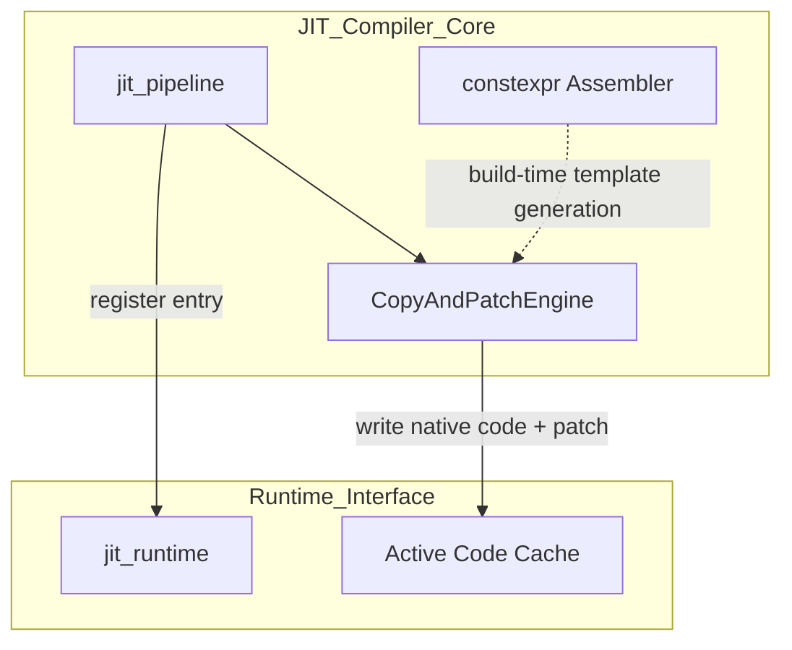
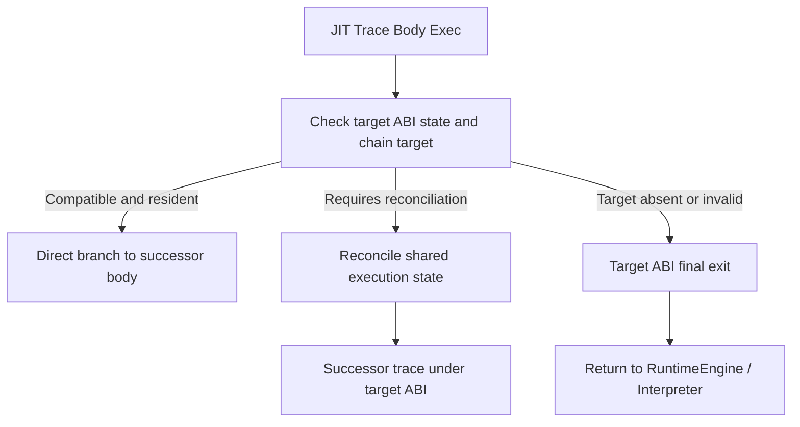
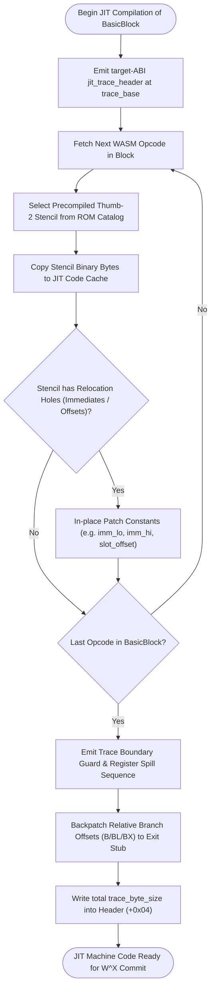
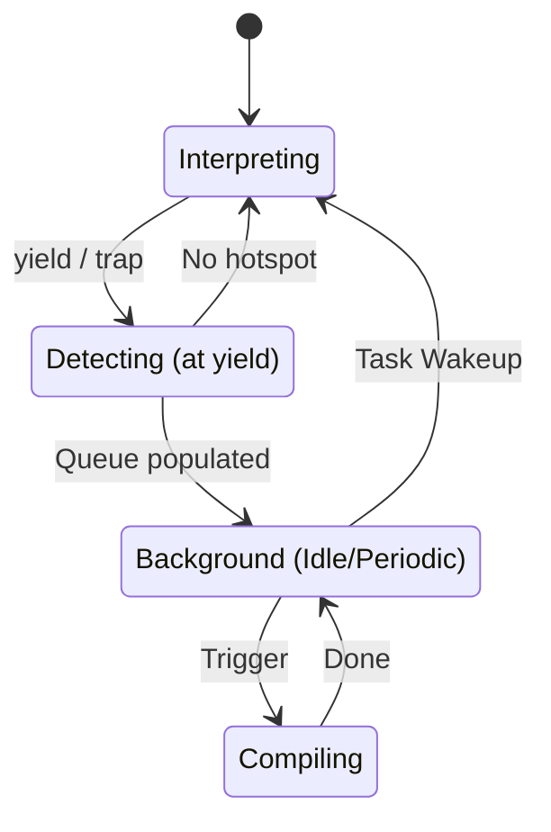
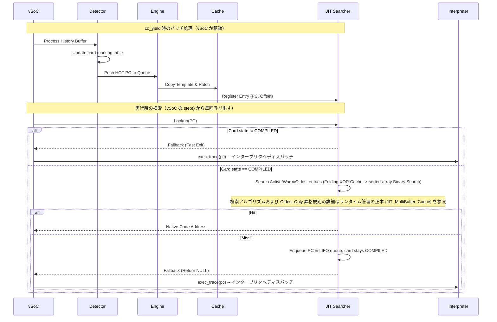

# JIT コンパイラ コンポーネント設計書 {VERIFY_FORMAL} {VERIFY_LLM} {VERIFY_BENCHMARK}
<!-- evidence:
     formal: formal/jit_cache_model.py
     benchmark: benchmarks/zero_runtime_overhead_bench.py
     concept: concepts/jit_copy_patch_concept.py
     test: docs/qa/tier3_jit/jit_compiler_test_spec.md
-->

## 1. コンセプト
<!-- traceability: {LowLatencyJIT} {JIT_CopyAndPatch} {JIT_ZeroCompileCostTheorem} {SimpleJITArchitecture} {JIT_Encoder} {PositionIndependentCode} {SinglePassCompilation} -->
JIT Compiler は、WASMバイトコードを実行時にネイティブコードへ変換し、実行速度を向上させる。Execution Engine (`executor`) の一部として機能する。極小リソース環境（RAM 32KB〜64KB）を対象とする。「Zero Compile Cost」方針に基づき、最適化を省いた高速な **Copy-and-Patch** 方式を採用する。命令テンプレートは C++ `constexpr` アセンブラによりビルド時に確定される。実行時は単純なメモリコピーと特定箇所への定数パッチのみを行う。

## 2. アーキテクチャ分類
<!-- traceability: {META_3TierSeparation} {JIT_CopyAndPatch} -->
本コンポーネントは **Tier 3 (詳細リーフコンポーネント: Leaf Component)** に属する。vSoC (`runtime_vsoc.md`) から分解された JIT コンパイルパイプラインを担当する。事前生成テンプレートのコピー＆パッチ結合、および C++ `constexpr` 命令エンコードを担当する。ランタイム側のエントリ検索・キャッシュ管理・ホットスポット検出は [`jit_runtime.md`](docs/components/tier3_jit/jit_runtime.md) が担当する。

### 2.1 JIT サブシステムのデコンポジション
<!-- traceability: {JIT_Encoder} {JIT_CopyAndPatch} {SimpleJITArchitecture} {JIT_MultiBuffer_Cache} -->
JITサブシステムは、以下の2つの独立した設計書に責務を分離して構成される。

- **[jit_compiler.md](docs/components/tier3_jit/jit_compiler.md)**: 命令テンプレートを用いたネイティブコード生成（Copy-and-Patch Engine）および静的な命令エンコード DSL（constexpr Assembler）を担当する。
- **[jit_runtime.md](docs/components/tier3_jit/jit_runtime.md)**: 実行履歴監視・ホットスポット判定、PC-アドレス変換検索、および 3面キャッシュローテーションを担当する。

## 3. 静的モデル

### 3.1 データ構造
- **`CopyAndPatchEngine`**: WASM命令に対応するネイティブ命令テンプレートを選択・コピーし、即値・分岐先・APIポインタをパッチ適用するクラス。
- **共通コード領域**: 8KB JIT領域の先頭2KBを対象ABIの開始処理、終了処理、ヘルパー契約別入口、および絶対アドレスプールへ固定配置する。ヘルパー呼出しコードは契約ごとに一つずつ配置し、単一の汎用共通入口へ集約しない。x64の共通領域オフセットは開始処理`0x000`、終了処理`0x020`、コンテキスト型入口`0x030`、絶対アドレスプール`0x050`、i32整数ヘルパー入口群`0x160`（32バイト×4）、wideヘルパー入口群`0x200`（32バイト×11）である。絶対アドレスプールは256バイトである。トレース本体の3面ローテーションではこの領域を破棄しない。 `{JIT_MultiBuffer_Cache}`
- **`constexpr_assembler`**: C++の `constexpr` 機能を活用し、ビルド時に Thumb-2 / RISC-V 命令バイナリを型安全に静的生成する DSL。
- **命令テンプレート (`jit_template`)**: パッチスロットを含むネイティブ命令列の雛形（[jit_stencil_catalog.md](docs/specs/jit_stencil_catalog.md) 準拠）。
- **JIT トレースヘッダ (`jit_trace_header`)**: キャッシュに書き込まれる各ネイティブトレースの先頭に配置されるルーティングメタデータ構造体。サイズ、WASM PC、論理的な後続PC、共通領域の参照、および必要なヘルパーアドレスを保持する。物理サイズと欄のオフセットは対象アーキテクチャごとに定義し、共通設計書で一つに固定しない。

### 3.2 内部ブロック図


### 3.3 主要なクラス・構造体・定数

#### コンパイル単位とインタープリタ協調方針
<!-- traceability: {LowLatencyJIT} {SimpleJITArchitecture} {PositionIndependentCode} -->
- **関数/モジュール一括コンパイルの完全禁止**: 極小リソース環境におけるコンパイル遅延とメモリ消費をゼロ化する。関数全体やモジュール全体の事前一括コンパイルは一切行わない。
- **純粋ベーシックブロック/トレース単位コンパイル**: カードマーキング表で HOT（`10`）に達した直線命令列（基本ブロック / トレース）のみを対象とする。スケジューラのアイドル時等に Copy-and-Patch により 1 トレースずつオンデマンド生成する。
- **制御フロー・スタック操作・演算の最適インライン展開方針 (`{JIT_RuntimeAPI_Fallback}`)**:
  - **JIT ネイティブ実行（インライン展開）対象（54命令）**:
    高頻度な直線演算（定数、変数、算術、論理、比較、メモリアクセス）をインライン展開する。**構文デリミタ（0バイト消去・ヘッダ直結）**、および**スタック巻き戻しを伴う多段分岐（`br`, `br_if`）** も JIT ネイティブ命令としてインライン展開する。
  - **インタープリタ委譲・ランタイムヘルパー対象（真のJIT境界命令）**:
    1. 関数間コール・フレーム生成: `call`, `call_indirect` (別フレームアロケーション、シグネチャ照合、WASI/ホスト呼出)
    2. 動的間接ジャンプテーブル: `br_table` (可変長ターゲット探索)
    3. システム・OS連携: `memory.grow`, `memory.copy`, `memory.fill`
    4. ハードウェア非対応演算 (`{Libgcc_Runtime_Helper}`): FPU非搭載時の浮動小数点演算や 64ビット整数除算・剰余は、専用ランタイムヘルパー（`fireball_rt_*`）呼び出しへ委譲する。
    これら制御境界・システムコール・ハードウェア非対応演算のみをインタープリタの命令ハンドラまたはランタイムヘルパーへ委譲する。
- **ハンドラ互換ディスパッチ**: JIT トレースエントリポイントはインタープリタ命令ハンドラと同一のシグネチャを持つ。ディスパッチテーブルから直接呼び出せる。

##### 3.3.1 制御フローおよびスタック巻き戻しの命令別処理モデル
<!-- traceability: {JIT_CopyAndPatch} {JIT_LazyChaining} {PositionIndependentCode} -->
WASM バイトコードにおける制御フロー命令は、その内部動作（スタック操作、フレーム遷移、ジャンプ先解決）の観点から以下の 3 つのモデルに厳密に仕分けられ、JIT ネイティブ展開される。

1. **構文デリミタ・ヘッダ埋め込みモデル（0バイト消去 & トレースヘッダ直結）**:
   - **対象命令**: `block` (`0x02`), `loop` (`0x03`), `else` (`0x05`), `end` (`0x0B`)
   - **構文デリミタ**: 制御命令はネイティブコードとしては 0 バイト（完全消去）とする。後続のフォールスルー先 PC はトレースヘッダ `chain_next_pc`（+0x08）に直接埋め込む。実行時の制御構文オーバーヘッドを完全ゼロ化する。
2. **スタック巻き戻し即値更新 & 直接ジャンプモデル（Inlined SP Adjustment & Relative Branch）**:
   - **対象命令**: `br` (`0x0C`), `br_if` (`0x0D`), `return` (`0x0F`)
   - **スタック巻き戻しの本質**: WASM は検証済み静的型付きバイトコードである。任意の `br depth` / `br_if depth` における巻き戻し量 $\Delta$（スタック差分）は、**JIT コンパイル時に即値定数として完全確定** する。
   - **ネイティブ展開コード**: スタック巻き戻しは単なるスタックポインタ（SP）の即値加算であり、インタープリタ委譲は不要である。
     - `br`: `add sp, #(Δ * 4); b.w <rel_target>` の 2 命令で完結。
     - `br_if`: `cmp r3, #0; it ne; addne sp, #(Δ * 4); bne.w <rel_target>` の 4 命令（多段脱出 `depth > 0` を含む）で完結。
     - `return`: トレース末尾エピローグ（`pop.w {r4-r6, r8-r11, pc}`）を直接インライン展開。
3. **境界トラップモデル（Trap Tail Emission）**:
   - **対象命令**: `unreachable` (`0x00`)
   - **処理モデル**: `bkpt #0x00` を直接展開し、ハードウェアフォールトまたはデバッガトラップへ直結させる。

##### 3.3.2 JIT コンパイル対象命令セット仕様台帳（JIT Supported Opcode Specification）
<!-- traceability: {JIT_CopyAndPatch} {JIT_ZeroCompileCostTheorem} {JIT_RegisterMapping} {PositionIndependentCode} -->
JIT ネイティブ実行対象命令（計 54 命令）の内訳は以下の通りである。スタック 5、デリミタ 4、定数 2、変数 6、32bit算術・論理 17、32bit比較 11、メモリ 9 の計54命令である。

全54命令の展開形式は概念コード [`jit_copy_patch_concept.py`](docs/components/tier3_jit/concepts/jit_copy_patch_concept.py) のテストで検証する。形式モデル `jit_cache_model.py` はキャッシュの W^X やチェイニング不変条件を検証する。

| カテゴリ | WASM Opcode (Hex) | 命令名 | JIT ネイティブ展開形式 (Thumb-2) | スタック/レジスタ効果 | 生成バイト数 |
| :--- | :--- | :--- | :--- | :--- | :--- |
| **制御・スタック** | `0x00` | `unreachable` | `bkpt #0x00` | トラップ | 2 Bytes |
| | `0x01` | `nop` | (0 Byte 消去) | なし | 0 Bytes |
| | `0x0C` | `br` | `add sp, #imm; b.w <target>` | SP巻き戻し + 相対分岐 | 6〜8 Bytes |
| | `0x0D` | `br_if` | `cmp r3, #0; it ne; addne sp, #imm; bne.w <target>` | 条件判定 + SP巻き戻し + 相対分岐 | 8〜10 Bytes |
| | `0x0F` | `return` | `pop.w {r4-r6, r8-r11, pc}` | エピローグ展開・復帰 | 4 Bytes |
| **構文デリミタ** | `0x02` | `block` | (0 Byte 消去・ヘッダ `chain_next_pc` 解決) | なし | 0 Bytes |
| | `0x03` | `loop` | (0 Byte 消去・ヘッダ `chain_next_pc` 解決) | なし | 0 Bytes |
| | `0x05` | `else` | (0 Byte 消去・ヘッダ `chain_next_pc` 解決) | なし | 0 Bytes |
| | `0x0B` | `end` | (0 Byte 消去・ヘッダ `chain_next_pc` 解決) | なし | 0 Bytes |
| **定数ロード** | `0x41` | `i32.const` | `movw r3, #imm16; movt r3, #imm16` | $\to$ R3 (TOS) | 8 Bytes |
| | `0x42` | `i64.const` | `movw/movt r3, #imm; movw/movt r4, #imm` | $\to$ R3:R4 (LO:HI) | 16 Bytes |
| **変数アクセス** | `0x20` | `local.get` | `ldr r3, [r2, #offset]` | $\to$ R3 (TOS) | 2 Bytes |
| | `0x21` | `local.set` | `str r3, [r2, #offset]` | R3 $\to$ Local | 2 Bytes |
| | `0x22` | `local.tee` | `str r3, [r2, #offset]` | R3 $\to$ Local (R3維持) | 2 Bytes |
| | `0x23` | `global.get`| `ldr.w r12, [r0, #0x30]; ldr.w r3, [r12, #offset]` | $\to$ R3 (TOS) | 8 Bytes |
| | `0x24` | `global.set`| `ldr.w r12, [r0, #0x30]; str.w r3, [r12, #offset]` | R3 $\to$ Global | 8 Bytes |
| | `0x1B` | `select` | `cmp r3, #0; it ne; movne r4, r5; mov r3, r4` | 3値選択 $\to$ R3 | 8 Bytes |
| **32bit 算術・論理** | `0x6A` | `i32.add` | `adds r3, r4, r3` | R4 + R3 $\to$ R3 | 2 Bytes |
| | `0x6B` | `i32.sub` | `subs r3, r4, r3` | R4 - R3 $\to$ R3 | 2 Bytes |
| | `0x6C` | `i32.mul` | `mul r3, r4, r3` | R4 * R3 $\to$ R3 | 4 Bytes |
| | `0x6D` | `i32.div_s`| `cbz r3, <trap>; cmp r4, #0x80000000; it eq; cmpeq r3, #-1; beq <trap>; sdiv r3, r4, r3` | 符号付除算 | 14 Bytes |
| | `0x6E` | `i32.div_u`| `cbz r3, <trap>; udiv r3, r4, r3` | 符号無除算 | 6 Bytes |
| | `0x6F` | `i32.rem_s`| `cbz r3, <trap>; sdiv r12, r4, r3; mls r3, r12, r3, r4` | 符号付剰余 (`GOTCHA-JITC-06`) | 10 Bytes |
| | `0x70` | `i32.rem_u`| `cbz r3, <trap>; udiv r12, r4, r3; mls r3, r12, r3, r4` | 符号無剰余 (`GOTCHA-JITC-06`) | 10 Bytes |
| | `0x71` | `i32.and` | `ands r3, r4, r3` | R4 & R3 $\to$ R3 | 2 Bytes |
| | `0x72` | `i32.or` | `orrs r3, r4, r3` | R4 \| R3 $\to$ R3 | 2 Bytes |
| | `0x73` | `i32.xor` | `eors r3, r4, r3` | R4 ^ R3 $\to$ R3 | 2 Bytes |
| | `0x74` | `i32.shl` | `lsl.w r3, r4, r3` | R4 << R3 $\to$ R3 | 4 Bytes |
| | `0x75` | `i32.shr_s`| `asr.w r3, r4, r3` | R4 >> R3 (算術) $\to$ R3 | 4 Bytes |
| | `0x76` | `i32.shr_u`| `lsr.w r3, r4, r3` | R4 >> R3 (論理) $\to$ R3 | 4 Bytes |
| | `0x77` | `i32.rotl` | `rsb r12, r3, #32; ror.w r3, r4, r12` | 左循環シフト $\to$ R3 | 8 Bytes |
| | `0x78` | `i32.rotr` | `ror.w r3, r4, r3` | 右循環シフト $\to$ R3 | 4 Bytes |
| | `0x67` | `i32.clz` | `clz r3, r3` | 先頭ゼロカウント | 4 Bytes |
| | `0x68` | `i32.ctz` | `rbit r3, r3; clz r3, r3` | 末尾ゼロカウント | 8 Bytes |
| **32bit 比較演算** | `0x45` | `i32.eqz` | `cmp r3, #0; it eq; moveq r3, #1; it ne; movne r3, #0` | R3 == 0 | 10 Bytes |
| | `0x46` | `i32.eq` | `cmp r4, r3; it eq; moveq r3, #1; it ne; movne r3, #0` | R4 == R3 | 10 Bytes |
| | `0x47` | `i32.ne` | `cmp r4, r3; it ne; movne r3, #1; it eq; moveq r3, #0` | R4 != R3 | 10 Bytes |
| | `0x48` | `i32.lt_s` | `cmp r4, r3; it lt; movlt r3, #1; it ge; movge r3, #0` | R4 < R3 (符号付) | 10 Bytes |
| | `0x49` | `i32.lt_u` | `cmp r4, r3; it lo; movlo r3, #1; it hs; movhs r3, #0` | R4 < R3 (符号無) | 10 Bytes |
| | `0x4A` | `i32.gt_s` | `cmp r4, r3; it gt; movgt r3, #1; it le; movle r3, #0` | R4 > R3 (符号付) | 10 Bytes |
| | `0x4B` | `i32.gt_u` | `cmp r4, r3; it hi; movhi r3, #1; it ls; movls r3, #0` | R4 > R3 (符号無) | 10 Bytes |
| | `0x4C` | `i32.le_s` | `cmp r4, r3; it le; movle r3, #1; it gt; movgt r3, #0` | R4 <= R3 (符号付) | 10 Bytes |
| | `0x4D` | `i32.le_u` | `cmp r4, r3; it ls; movls r3, #1; it hi; movhi r3, #0` | R4 <= R3 (符号無) | 10 Bytes |
| | `0x4E` | `i32.ge_s` | `cmp r4, r3; it ge; movge r3, #1; it lt; movlt r3, #0` | R4 >= R3 (符号付) | 10 Bytes |
| | `0x4F` | `i32.ge_u` | `cmp r4, r3; it hs; movhs r3, #1; it lo; movlo r3, #0` | R4 >= R3 (符号無) | 10 Bytes |
| **リニアメモリアクセス** | `0x28` | `i32.load` | `cmp r3, r9; bhs.w <trap>; add.w r12, r3, #3; cmp r12, r9; bhs.w <trap>; ldr.w r3, [r8, r3]` | 32bit ロード (`GOTCHA-JITC-04`) | 18 Bytes |
| | `0x2C` | `i32.load8_s` | `cmp r3, r9; bhs.w <trap>; ldrsb.w r3, [r8, r3]`| 8bit 符号付ロード | 10 Bytes |
| | `0x2D` | `i32.load8_u` | `cmp r3, r9; bhs.w <trap>; ldrb.w r3, [r8, r3]` | 8bit 符号無ロード | 10 Bytes |
| | `0x2E` | `i32.load16_s`| `cmp r3, r9; bhs.w <trap>; add.w r12, r3, #1; cmp r12, r9; bhs.w <trap>; ldrsh.w r3, [r8, r3]`| 16bit 符号付ロード | 18 Bytes |
| | `0x2F` | `i32.load16_u`| `cmp r3, r9; bhs.w <trap>; add.w r12, r3, #1; cmp r12, r9; bhs.w <trap>; ldrh.w r3, [r8, r3]` | 16bit 符号無ロード | 18 Bytes |
| | `0x36` | `i32.store` | `cmp r4, r9; bhs.w <trap>; add.w r12, r4, #3; cmp r12, r9; bhs.w <trap>; str.w r3, [r8, r4]` | 32bit ストア (`GOTCHA-JITC-04`) | 18 Bytes |
| | `0x3A` | `i32.store8` | `cmp r4, r9; bhs.w <trap>; strb.w r3, [r8, r4]` | 8bit ストア | 10 Bytes |
| | `0x3B` | `i32.store16`| `cmp r4, r9; bhs.w <trap>; strh.w r3, [r8, r4]` | 16bit ストア | 10 Bytes |
| | `0x3F` | `memory.size`| `ldr.w r3, [r0, #0x2C]; lsrs r3, r3, #16` | リニアメモリのページ数取得（バイト数を64KiB単位へ変換） | 8 Bytes |

##### 3.3.3 インタープリタ委譲命令台帳（Delegated Opcode Specification）
<!-- traceability: {JIT_RuntimeAPI_Fallback} {Libgcc_Runtime_Helper} -->
JIT トレース内にインライン展開せず、トレース境界でインタープリタハンドラ（`_HANDLERS[opcode]`）またはランタイムヘルパーへフォールバックして実行を委譲する命令群を以下に定める。

| カテゴリ | WASM Opcode (Hex) | 命令名 | 委譲理由・処理モデル |
| :--- | :--- | :--- | :--- |
| **関数呼出・フレーム** | `0x10` | `call` | 関数呼出し記述子の生成、スタック境界検査、引数受け渡しを伴うためインタープリタへ委譲 |
| | `0x11` | `call_indirect` | テーブル索引、型シグネチャ一致検査、動的ターゲット解決を伴うためインタープリタへ委譲 |
| **動的分岐** | `0x0E` | `br_table` | 可変長ジャンプターゲットテーブル（ベクトル）の動的インデックス検索を伴うため委譲 |
| **OS・メモリ管理** | `0x40` | `memory.grow` | ページテーブル再割り当て、MPU 領域再設定、vMMIO 更新を行うシステムサービス呼出のため委譲 |
| | `0xFC 0x0A` | `memory.copy` | バッファ重なり検査、メモリコピーランタイム呼び出しのため委譲 |
| | `0xFC 0x0B` | `memory.fill` | メモリフィルランタイム呼び出しのため委譲 |
| **Cヘルパー演算** | `0x7C`〜`0x7E` | `i64.add` / `i64.sub` / `i64.mul` | 各命令固有の64ビット整数引数契約へ委譲 |
| | `0x92`〜`0x95` | `f32.add` / `f32.sub` / `f32.mul` / `f32.div` | 各命令固有の32ビット浮動小数点引数契約へ委譲 |
| | `0xA0`〜`0xA3` | `f64.add` / `f64.sub` / `f64.mul` / `f64.div` | 各命令固有の64ビット浮動小数点引数契約へ委譲 |
| | `0x6D`〜`0x70` | `i32.div_s` / `i32.div_u` / `i32.rem_s` / `i32.rem_u` | 2個の32ビット整数引数と結果領域ポインタを持つ関数契約へ委譲 |
| **インタープリタ境界** | - | `i64.div_*`, `rem_*` | ゼロ除算・最小値オーバーフローのトラップ結果を返すABIを定義するまでインタープリタへ委譲 |

**ABI 規約と境界チェック・バックパッチング (`GOTCHA-JITC-01`〜`05`)**:
- **スタック状態の同期**: JITトレース内では対象ABIが定める値保持方法を正本として演算する。基本ブロック終端、インタープリタ境界、トラップ時には共有オペランド領域と実行コンテキストを対象ABIの順序で同期する。キャッシュ値の破棄やダミー退避は禁止する。 `{ADR_TosCacheAsymmetry}` `{ExecutionContext_Layout}`
- **レジスタ規約 (`GOTCHA-JITC-01`, `02`, `03`)**: JITトレースとインタープリタが共有するのは4つの論理引数であり、物理レジスタ規約は対象ABIごとに異なる。ARMv8-MはAAPCS、x64は [`jit_abi.md`](docs/components/tier2_runtime/jit_abi.md) に従う。基本ブロック終端の状態同期と保護レジスタの保存・復元も対象ABIの規則を適用する。
- **ヘルパー選択**: Cヘルパー演算は命令ごとに専用の関数契約を持つ。コンパイラは命令に対応する識別番号と関数アドレスをヘッダへ格納し、入力型・入力個数・結果の返却方法は対象関数ごとに適用する。共通ディスパッチャが演算種別を再判定する方式は採用しない。入力を一律に共有オペランド領域の32ビット列へ変換する規則も設けない。
- **境界チェックとバックパッチング (`GOTCHA-JITC-04`, `05`)**: トレース内ジャンプおよびインタープリタ脱出境界において、PC 境界検証を必ず行う。前方参照へのジャンプオフセットはコード生成完了時にバックパッチングで不可分に書き込む。不正ジャンプを完全に防止する。
- **ARM MLS 命令のオペランド配置制約 (`GOTCHA-JITC-06`)**: ARM Thumb-2 の積和減算命令 `MLS Rd, Rn, Rm, Ra`（$Rd = Ra - Rn \times Rm$）では、引かれる数が第4オペランド $Ra$ に配置されるハードウェア仕様を遵守する。通常の乗算命令との取り違えを防止する。

#### コピーアンドパッチエンジン（CopyAndPatchEngine）クラス
<!-- traceability: {JIT_RegisterMapping} {ContextPointerRegister} {EnvironmentPointer} {ADR_TosCacheAsymmetry} {PositionIndependentCode} -->
Interpreter opcode handlerと同じ4論理引数の引数レジスタ配置を使うが、戻り値契約は異なる。Interpreter handlerは`handler_result`を返し、JIT trace entryは`void`で終了・chainするため、関数ポインタ型を共用しない。

```c
// Interpreter handlerとJIT trace entryは引数レジスタ配置のみ共有する。
// コメントは「実機 ARM AAPCS レジスタ / 実機 RISC-V ABI レジスタ / x86-64 ホストシミュレータ __fastcall レジスタ」の対応を示す。
// この4本は呼び出し境界でのみ使われ、jit_stencil_catalog.md のトレース本体内 assignable pool
// (ARM R4-R6, R8-R11 / RISC-V s1-s7) とは物理レジスタが重ならない別の割り当てである。
typedef handler_result (*interpreter_opcode_handler_t)(
    execution_context* ctx,        // ARM R0 / RISC-V a0 / x86-64 RCX: 実行コンテキスト (64バイト)
    uint32_t*          sp,         // ARM R1 / RISC-V a1 / x86-64 RDX: オペランドスタックポインタ
    void*              local_base, // ARM R2 / RISC-V a2 / x86-64 R8:  ローカル変数配列基底ポインタ
    uint32_t           tos         // ARM R3 / RISC-V a3 / x86-64 R9:  スタックトップ値 (Top of Stack)
);
typedef void (*jit_trace_entry_t)(
    execution_context* ctx,
    uint32_t*          sp,
    void*              local_base,
    uint32_t           tos
);
```

| 項目名 | 機能と役割 | 型分類 | サイズ・制約 |
| :--- | :--- | :--- | :--- |
| テンプレート辞書 | WASM命令に対応するJITテンプレートの検索索引 | アクセス辞書 | `jit_template_map` |
| 命令テンプレート | WASM命令に対応するネイティブバイナリの雛形 | バイナリビュー | ROM参照（[jit_stencil_catalog.md](docs/specs/jit_stencil_catalog.md) 準拠。Thumb-2 のみを収録し、RISC-V の物理ステンシルは別カタログとして今後定義する） |
| 位置独立性 (PIC) | 任意アドレス・キャッシュバンクで再コンパイル不要で動作 | 設計制約 | 命令列へのプロセス絶対アドレス埋め込み禁止。トレースヘッダの `helper_target_addr` と共通領域オフセット、`local_base` 相対、`R1(sp)` 相対、`rel32` 相対分岐を使用 |

##### 物理レジスタマッピング一覧表
<!-- traceability: {JIT_RegisterMapping} {AAPCS_FastCall} -->
JIT トレースとインタープリタは境界において4つの論理引数を共有する。次表はARMv8-MとRISC-Vの物理レジスタ契約であり、x64の物理配置は [`jit_abi.md`](docs/components/tier2_runtime/jit_abi.md) で定義する。トレース内部の値キャッシュとスクラッチレジスタは対象ABIごとに定める。

| アーキテクチャ | 物理レジスタ | 規約上の役割 / 論理引数 | トレース内部での用途 | 退避・保護責務 |
| :--- | :--- | :--- | :--- | :--- |
| **ARM (Thumb-2)** | `R0` | `ctx` (実行コンテキスト) | 呼び出し境界引数（`mem_base/size` ピン留め・基本ブロック末尾同期起点） | Caller-saved |
| | `R1` | `sp`（オペランド領域の位置） | 呼び出し境界引数（オペランド領域の頂点位置） | Caller-saved |
| | `R2` | `local_base` (ローカル配列基底) | 呼び出し境界引数 | Caller-saved |
| | `R3` | `tos` (Top of Stack) | 呼び出し境界引数（第4論理引数）。スタック最上段オペランド値。基本ブロック末尾でプッシュされた場合は `[R1, #offset]` へフラッシュ | Caller-saved |
| | `R4` | - | `NOS` (Next on Stack 次段キャッシュ。基本ブロック末尾でプッシュされた場合は `[R1, #offset]` へフラッシュ) | Callee-saved |
| | `R5` | - | `NNOS` (Next Next on Stack 第3段キャッシュ。基本ブロック末尾でプッシュされた場合は `[R1, #offset]` へフラッシュ) | Callee-saved |
| | `R6` | - | 一時スクラッチ（トレース末尾でのコンテキストIP書き戻し等） | Callee-saved |
| | `R7` | `FP` (フレームポインタ) | 不可侵 | システム固定 |
| | `R8` | - | `mem_base` (ゲストリニアメモリ基底、`[R0, #0x28]` よりロード) | Callee-saved |
| | `R9` | - | `mem_size` (ゲストリニアメモリ長、`[R0, #0x2C]` よりロード) | Callee-saved |
| | `R10` | - | `safepoint` (ポーリングフラグ) | Callee-saved |
| | `R11` | - | 汎用アサイナブルレジスタ | Callee-saved |
| | `R12` | - | 一時スクラッチ (インタープリタ復帰 `BX r12`) | Caller-saved |
| **RISC-V** | `a0`〜`a3` | `ctx, sp, local_base, tos` | 呼び出し境界引数（4論理引数） | Caller-saved |
| | `s1`〜`s7` | - | トレース内部アサイナブルプール (`s1: NOS`, `s4: mem_base`, `s5: mem_size`) | Callee-saved |
| | `s0/fp` | `FP` (フレームポインタ) | 不可侵 | システム固定 |

#### トレース境界不変条件とスタックフレーム整合性 (Trace Boundary Invariants)
<!-- traceability: {LowLatencyJIT} {PositionIndependentCode} {JIT_RuntimeAPI_Fallback} -->
JIT トレースとインタープリタが共有オペランド領域上で相互運用するため、以下の3つの不変条件を厳格に保持する。

1. **スタック自己完結性不変条件 (Stack Self-Containment Invariant)**:
   - JIT コンパイル対象とする BasicBlock は、**命令走査中の累積スタック深さが 0 未満（`stack_depth < 0`）に落ちない自己完結ブロックのみ**とする。
   - 先頭で `local.set` や二項演算が先行し、呼び出し元のオペランドスタック上の値を前提とするブロックは JIT 化せず、インタープリタがスタック整合性を保持して安全に実行する。
2. **トレース境界でのメモリ同期不変条件 (Memory Synchronization at Trace Boundary)**:
- 基本ブロック末尾では、`TOS, NOS, NNOS` をスタックへフラッシュする。コンテキスト `R0` の `ip` および `sp_offset` を更新して状態を同期する。
3. **制御フロー・コール境界のインタープリタ委譲不変条件 (Control & Call Delegation Invariant)**:
- スタック巻き戻しを伴う分岐（`BR`, `BR_IF`）および構文デリミタ（`BLOCK`, `LOOP`, `ELSE`, `END`）は、JIT トレース内にインライン展開する。
- 一方、`CALL`, `CALL_INDIRECT`, `RETURN` 等の境界命令はインライン展開しない。トレース境界でインタープリタへ制御を返す。

#### JIT トレース物理メモリレイアウト (`jit_trace_header`)
<!-- traceability: {JIT_LazyChaining} {SimpleJITArchitecture} {PositionIndependentCode} -->
物理配置は対象ごとのABI契約へ委譲する。Windows x64およびSystem V AMD64の52バイト配置は [`jit_abi.md`](docs/components/tier2_runtime/jit_abi.md) に定義し、ARMv8-MのThumb-2配置と命令列は [`jit_stencil_catalog.md`](docs/specs/jit_stencil_catalog.md) に定義する。これらの配置を一つの共通ヘッダとして扱ってはならない。

#### `constexpr_assembler` (DSL)
<!-- traceability: {JIT_Encoder} {META_ZeroCostAbstraction} -->
ビルド時に Thumb-2 / RISC-V 命令バイナリを静的エンコードし、実行時の命令生成オーバーヘッドを完全排除する。

| 構造体 | 機能 | ビット幅 |
| :--- | :--- | :--- |
| `fireball::arm::add_imm` | Thumb-2 即値加算命令エンコーダ | 32bit |
| `fireball::arm::ldr_imm` | Thumb-2 即値ロード命令エンコーダ | 32bit |
| `fireball::riscv::i_type`| RISC-V I-Type 命令エンコーダ | 32bit |

## 4. 動的モデル

### 4.1 アルゴリズム
<!-- traceability: {JIT_CopyAndPatch} {JIT_RuntimeAPI_Fallback} {SinglePassCompilation} -->
1. **トレース解析 & テンプレート選択**: WASM PC から始まる基本ブロックを 1 パス走査し、対応する事前生成ステンシルテンプレートを選択する。
2. **メモリコピー & パッチ適用**: アクティブキャッシュへテンプレート命令列をコピーし、即値オペランドや相対分岐オフセットをインプレースでパッチする。
3. **対象ABI境界フォールバック**: 複雑な命令はトレースヘッダで選択したヘルパー契約別の共通コード入口へ委譲し、ホスト関数呼び出しは対象ABIの終了処理を経てランタイムへ戻す。呼出しコードをトレース本体へ複製しない。
4. **命令キャッシュ同期**: パッチ完了後、`__DSB()` および `__ISB()` バリアを発行して命令キャッシュを同期する。
5. **インタープリタ連携とハンドラ直接呼び出し (Low-Overhead Interop & Direct Handler Call)**:
- JIT トレースとインタープリタハンドラは同一の4論理引数を境界で共有し、物理レジスタへの割当は対象ABIで定める。
   - JIT トレースは直線的な算術・ローカル変数演算、構文デリミタ消去、および SP 即値巻き戻しを伴う多段分岐（`br`, `br_if`）をネイティブインライン展開する。
   - コールフレームや同期が必要な境界命令に達した場合、対象ABIの終了処理を経てRuntimeEngine／Interpreterへ戻る。JITトレース間の直接チェインは、対象ABIが定める状態引継ぎ条件を満たす場合だけ許可する。あるアーキテクチャの退避・復元やレジスタ名を他アーキテクチャへ適用してはならない。
   - Cで実装する複雑処理へ委譲する場合は、対象トレースのヘッダ `helper_target_addr` に対象ABIと一致する関数ポインタを保持し、ヘルパー契約に対応する共通コード入口を選択する。引数の型・個数、結果の返却方法、共有オペランド領域との同期方法は、委譲先の関数契約で定義する。呼出しコードはトレース本体へ複製しない。 `{PositionIndependentCode}`
   - 互換状態で直接チェインする場合はコンテキスト再構築を省略できる。真の脱出や非互換状態では対象ABIの同期・再構築を行う。 `{ADR_TosCacheAsymmetry}`

#### JIT トレース検索 & 3面キャッシュ代謝オーケストレーション
<!-- traceability: {JIT_MultiBuffer_Cache} {JIT_OldestOnly_Promote} -->
3段JIT検索および連続8KBキャッシュ領域の管理は[`jit_runtime.md`](docs/components/tier3_jit/jit_runtime.md)を正本とする。コンパイラコアは生成したトレースの登録と命令同期を同コンポーネントへ委譲する。

#### トレース・チェイニング（連鎖実行）と専用分岐ハンドラ分離
<!-- traceability: {JIT_LazyChaining} -->
Interpreter／RuntimeEngineからJITへ入るときは対象ABIの新規入口処理を通す。JITトレース間の直接チェインでは、対象ABIが定める状態引継ぎ条件を満たす場合に限り、後続トレースの入口保存処理を重ねない。RuntimeEngine／Interpreterへ抜けるときは対象ABIの終了処理で必要なレジスタと実行時状態を復元する。



1. **ハンドラの責務分離とヘッダ参照分岐**:
   - **純粋インタープリタ用ハンドラ (`_h_br` 等)**: 単純にスタックを巻き戻して次の WASM PC を算出し、ディスパッチループへ戻る（JIT 探索やパッチのオーバーヘッドが完全ゼロ）。
- **JITトレース末尾のヘッダ参照分岐**: 各基本ブロック末尾で対象ABIが定める共有状態同期を行い、対象ABIのヘッダ欄から直接チェイン先を判定する。ヘッダ欄のオフセットと同期手順は対象ABIの仕様を参照する。
2. **ヘッダ直接リンク（Header-Driven Chaining without Code Patching）**:
   - **初期コンパイル時**: `chain_target_addr`は未解決を表す。トレースチェインエピローグでflush/syncした後、対象ABIの終了処理を実行してRuntimeEngine／Interpreterへ戻る。
   - **後続トレースコンパイル時**: 後続トレースがキャッシュ（Active/Warm）に生成されたとき、先行ヘッダの`chain_target_addr`へ後続のchain entryを登録する。
   - **チェイン実行時**: `chain_target_addr`解決後の状態同期、入口保存処理の省略、およびvariant判定は対象ABIの規則に従う。互換状態は後続本体へ直接分岐し、非互換状態は共有オペランド領域から再構成してから後続トレースへ進む。
3. **未コンパイル時の遅延昇格**:
   - 分岐先が未コンパイル（`chain_target_addr == 0`）の場合、履歴領域へ分岐先PCを記録し、対象ABI準拠の終了処理でRuntimeEngine／Interpreterへ戻る。次回以降ホット化・コンパイルされた後にchainが確立する。
4. **局所再チェイニングとアンリンク（O(k) Bounded Re-chaining & Unlinking）**:
   - チェイニング確立時、ターゲットバンクの被チェイン逆引きテーブル（`inbound_chains`）にソースの JIT エントリインデックスを登録する。
   - ターゲットが Active $\to$ Warm $\to$ Oldest へ推移する間、コードは有効に常駐する。チェイニングは維持され JIT 実行が継続する。
   - Oldestバンクのローテーションは、被チェイン元$k$件の処理に加えて、破棄バンクの$n$個の項目を消去する。バンク検索も含む処理量は$O(n + k\log n)$であり、$O(k)$のみとは主張しない。
   - **ターゲットが昇格（Promote）している場合**: 先行トレースヘッダの `chain_target_addr` を昇格先アドレスへ書き換える。昇格先バンクの `inbound_chains` へ登録を移譲する。ネイティブ直接チェイン実行を維持する。
    - **ターゲットがキャッシュアウト（Evict）する場合**: 先行トレースヘッダの対象ABIのターゲット欄を `0` にリセットする。次回実行時は対象ABIの終了経路へ分岐し、インタープリタへ安全にフォールバックする。
   - 逆引き表によりチェイン解決の対象を$k$件に限定するが、bank全体のclear処理は別途$O(n)$である。MPU W^X切り替え回数は設計上抑制する。
5. **構文デリミタのトレースヘッダ直接埋め込みと直接チェイニング連携**:
   - **制御構文デリミタの読み飛ばし**: WASM 基本ブロック末尾の制御命令（`BLOCK`, `LOOP`, `ELSE`, `END` 等）は、先行ブロックの実行完了と後続ブロックの先頭命令の間に位置する。JIT ネイティブ実行同士を直接チェイニング（`chain_next`）する際、先行ブロック終端 PC（delimiter PC）から制御構文を読み飛ばす。後続のフォールスルー先（fallthrough head PC）を解決する。
   - **ヘッダ直接埋め込み（Inlined Chaining Header）**: JIT コンパイル時に後続のフォールスルー先 PC を静的に先読み解決する。トレースヘッダの `chain_next_pc`（+0x08）に直接埋め込む。これにより実行時の外部索引検索を排除する。メモリオーバーヘッドおよび解決レイテンシを $O(1)$ として直接チェイニングを確立する。
   - **双方向チェイニング解決フロー**:
     - **後方チェイニング (Backward Chaining)**: 新規トレース登録時、トレースヘッダの `succ = trace.chain_next_pc` を参照する。スキップ先が Active/Warm に常駐していれば `trace.chain_target_addr = succ_native_addr` を即座に接続する。
     - **前方チェイニング (Forward Chaining)**: 常駐トレース `resident_t` の `chain_next_pc` が新登録トレースの `head_wasm_pc` と一致するか照合する。一致すれば `resident_t` の分岐先スロットを新トレースのチェインエントリへインプレースパッチする。

#### 統合 Tiered ランタイムエンジン・コンセプトコード (`../tier2_runtime/concepts/runtime_engine_concept.py`)
インタープリタ実行、2-bit Hotspot 検出、Copy-and-Patch JIT、3面キャッシュ、MPU W^X 保護を統合したシミュレーションは [`runtime_engine_concept.py`](docs/components/tier2_runtime/concepts/runtime_engine_concept.py) を参照する。

#### ホットスポット判定 (yield 時)
<!-- traceability: {JIT_LazyChaining} -->
1. **履歴走査**: インタープリタの実行サイクル中に記録、蓄積された「実行履歴バッファ」を走査する。
2. **状態更新**: カードマーキング表の状態が「頻出」に達した命令オフセットを「コンパイル待ち列」（固定容量 LIFO キュー、`{JIT_ReverseCompilationOrder}`）に投入する。容量到達時にバッチコンパイルを即座に実行して空にする。固定容量を上回ることはない。 `{GLOBAL_Policy_Memory}`
3. **遅延チェイニング制御**: コンパイルキューへ投入されたトレースは、JITコード末尾にディスパッチャ・スタブが初期値としてチェイニングされる。インタープリタ環境へ復帰し遅延チェイニングを実現する。

#### バッチコンパイル (周期実行またはアイドル時)
<!-- traceability: {JIT_ReverseCompilationOrder} {GLOBAL_PeriodicTask} {GLOBAL_IdleDetection} -->
1. **キューの取得**: 「コンパイル待ち列」から対象の命令オフセットを**逆順（LIFO）**で取り出す。
2. **コンパイル実行**: 後続トレースを先にコンパイルする。先行トレースのリンク時にターゲットが既にキャッシュ内に存在する確率を上げる。これにより即時チェイニングを実現する。
3. **補足**: COOSの `register_periodic_callback` または `set_idle_hook` により実行される。これにより、実行スレッドのブロッキング時間を抑える。


#### Copy-and-Patch ステンシル結合 & バックパッチング手順（手順アクティビティ図）
<!-- traceability: {GOTCHA-JITC-01} {GOTCHA-JITC-02} {GOTCHA-JITC-05} {JIT_CopyAndPatch} -->
BasicBlock 走査、事前コンパイル済みステンシルのコピー、即値・レジスタパッチ、およびトレース末尾バックパッチングの決定論的手順を示す。



### 4.2 状態遷移図
<!-- traceability: {JIT_LazyChaining} {JIT_ReverseCompilationOrder} {GLOBAL_PeriodicTask} {GLOBAL_IdleDetection} -->


### 4.3 内部シーケンス
<!-- traceability: {JIT_LazyChaining} {JIT_ReverseCompilationOrder} {GLOBAL_PeriodicTask} {GLOBAL_IdleDetection} -->
#### JITコンパイルおよび検索シーケンス
サイクル全体を駆動するのは常に vSoC (V) である。Interpreter (I) はディスパッチされた実行エンジンとして機能する。履歴処理やキャッシュ検索を自ら開始することはない（`{Interpreter_LazyJITSwitch}`）。


## 5. インターフェース定義

### 5.1 公開API
外部から利用可能なオブジェクト指向APIを定義する。

#### 初期化（initialize）
<!-- traceability: {META_ConfigurableSystem} -->

| 項目 | 内容 |
| :--- | :--- |
| 機能概要 | コードキャッシュ領域、管理テーブル、およびカードマーキング表の初期化を行う。 |
| シグネチャ | `initialize(ctx: 可変参照, config: const参照) -> 結果型` |
| 引数 | `ctx`: JITコンテキスト (`jit_context`) への可変参照<br>`config`: JIT構成 (`jit_config`) への読取専用参照 |
| 戻り値 | 結果型 (成功時は空、エラー時はエラーコード) |
| 事前条件 | 設定パラメータが一貫しており、静的に確保されたメモリの範囲を超えていないこと。 |
| 事後条件 | カードマーキング表がクリアされ、キャッシュが空の状態になる。 |
| 不変条件 | 実行中に `config` の値を変更してはならない。 |
| エラー時の挙動 | メモリ割り当ての不備がある場合はエラーを返す。 |
| 補足 | の方針に基づき、基本的にはブート時に一度だけ呼び出される。 |

#### トレース検索（lookup_trace）
<!-- traceability: {META_ConfigurableSystem} -->

| 項目 | 内容 |
| :--- | :--- |
| 機能概要 | 指定されたWASMプログラムカウンタ(PC)に対応する、コンパイル済みのネイティブコードの実行アドレスを高速に検索する。 |
| シグネチャ | `lookup_trace(pc: address) -> result<address, bool>` |
| 補足 | カードマーキング表の状態が `COMPILED` でない場合は即座に失敗を返す。その後、`harness` 経由でエントリ索引を検索する。本機能は、ヘッダファイルで定義されたマクロ（`FB_CONF_JIT_CACHE_SIZE`等）に基づき、システムのメモリマップや検索範囲等のパラメータが固定された状態で動作する。 |

#### カード状態取得（get_card_state）
<!-- traceability: {META_ConfigurableSystem} -->

| 項目 | 内容 |
| :--- | :--- |
| 機能概要 | 指定したPCが属するカードの状態（2-bit）を取得する。 |
| シグネチャ | `get_card_state(pc: address) -> u8` |
| 補足 | 本機能は、コンパイル時に固定されたカード境界シフト値（`FB_CONF_JIT_CARD_SHIFT`等）のマクロ定義に基づき、PC値からカードインデックスへの変換を高速に行う。 |

#### JITエントリ検索（find_entry）
<!-- traceability: {META_ConfigurableSystem} {META_BinarySearch} -->

| 項目 | 内容 |
| :--- | :--- |
| 機能概要 | 指定されたWASM PCをバンク内の `head_pc` 昇順固定容量エントリ配列から二分探索する。エントリ数が少ないためRadix索引は持たない。 |
| シグネチャ | `find_entry(bank_idx: u8, pc: address) -> optional<jit_entry_view>` |
| 計算量 | 1バンクあたり $O(\log n)$。固定配列の容量は2KBバンクの上限で決まる。 |

#### バッチコンパイル処理（process_batch_compile）
<!-- traceability: {META_ConfigurableSystem} -->

| 項目 | 内容 |
| :--- | :--- |
| 機能概要 | vSoC が収集した履歴を基にコンパイルを実行する。 |
| シグネチャ | `process_batch_compile(ctx: 可変参照, harness: 構造体への参照) -> void` |
| 引数 | `ctx`: JITコンテキスト への可変参照<br>`harness`: JITハーネス への参照 |
| 戻り値 | void |
| 補足 | vSoC が `co_yield` を発行する際に呼び出され、アイドル時間等を活用して処理される（`co_yield` の判定・発行はインタープリタや `executor` 自身ではなく vSoC が行う）。 |

### 5.2 URI/IPCインターフェース
<!-- traceability: {META_ConfigurableSystem} -->
本コンポーネントは vSoC の内部ライブラリであり、直接のIPCインターフェースは持たない。

## 6. 制約達成の方策

### 6.1 性能制約と方策
<!-- traceability: {JIT_CopyAndPatch} {JIT_RegisterMapping} -->
- **目標**: コンパイルレイテンシを最小化し、WAMRインタープリタを上回る実行速度を実現。
- **方策**:
    - : 複雑な最適化を省き、テンプレートコピーのみでコンパイルを完了。
    - : `Context`, `StackTop`, `WASM_PC` を物理レジスタに固定し、メモリアクセスを削減。
    - `Card Marking (O(1)) + Binary Search`: カードマーキング表による $O(1)$ 事前フィルタと二分探索により、高速な検索を実現。

### 6.2 安全性制約と方策
<!-- traceability: {PositionIndependentCode} {MemoryBoundaryCheck} {FastAddressCheck} {SimpleJITArchitecture} -->
- **目標**: 不正なコード実行および W^X 違反の防止。
- **方策**:
    - : 生成コードを位置独立とし、配置場所の自由度を確保。
    - `Cache Capacity Check`: コード生成時にキャッシュ溢れを厳密にチェックし、溢れた場合は 3面リングローテーションにより Oldest バンクを破棄して再利用する。これはキャッシュ容量管理であり、（ゲストメモリアクセスの隔離）とは別の関心事である。
    - : 生成コードに埋め込むゲストメモリアクセスの境界チェック。`FastAddressCheck` は `CMP addr, mem_size; BHS.W <trap>` で開始アドレスを検査する。1バイト超のアクセスでは `addr + width - 1` を `mem_size` と比較して末尾境界も検査する（マスク不使用）。境界外アクセスはインタープリタへトラップする。アドレスを暗黙に折り畳んで継続しない。
    - `MPU W^X 保護`: Cortex-M33 PMSAv8 MPU を用いる。JIT パッチ書き込み時は `RW+XN`、ネイティブ実行時は `RO+X` に切り替える。`__DSB(); __ISB();` バリアを発行する。書き込みと実行の同時許可（RWX）を物理的に排除する。形式モデル `formal/jit_cache_model.py` により変異検査付きで検証する。

## 7. 形式検証・テスト仕様との対応

### 7.1 検証対象の不変条件
- **位置独立性 (PIC)**: 生成された Thumb-2 / RISC-V バイナリが絶対アドレスに依存しないこと。任意のキャッシュバンクで再コンパイル不要で動作すること（`TEST-INT-40`, `TEST-JITC-40`）。
    - **トレース境界メモリ同期**: ARMv8-Mではトレースチェインエピローグがキャッシュ中のスタックトップ（`R3: TOS`）・次段（`R4: NOS`）およびローカル変数を共有領域へ同期してから後続状態を判定する。x64では、互換状態で直接チェインする場合に限り、実装が書き戻した状態を引き継ぐ。この同期手順を対象ABIごとに分けて検証する（`TEST-INT-41`, `TEST-JITC-52`）。
- **W^X メモリ保護**: JIT パッチ書き込み時の `RW+XN` と実行時の `RO+X` の分離（`jit_cache_model.py`, `TEST-JITC-42`）。

### 7.2 テスト仕様書との連携
本コンポーネントの単体テストケースは [`jit_compiler_test_spec.md`](docs/qa/tier3_jit/jit_compiler_test_spec.md) を正本として定義する。3面キャッシュの直交表は [`jit_runtime_test_spec.md`](docs/qa/tier3_jit/jit_runtime_test_spec.md) を正本とする。

## 8. 設計判断 (ADR)
<!-- traceability: {ADR_ScalableCodeOffset} {ADR_SafeQueuingOnHotMiss} {ADR_TosCacheAsymmetry} {JIT_LazyChaining} {GOTCHA-JITC-07} -->

- **決定事項**:
  - **背景**: JITトレースとインタープリタは4つの論理引数を共有するが、物理レジスタ、スタック整列、値キャッシュの方式は対象ABIごとに異なる。トレース境界での状態同期を対象ごとに定義する必要がある。
  - **選択肢と評価**:
    - 案1: 継続渡しを 4 論理引数化しつつ、インタープリタ側も TOS をレジスタ保持する。
    - 案2: JIT からもレジスタキャッシュを廃し、両者ともオペランドをメモリ上でのみ扱う。スタックマシンに対する最大最適化を捨てることになり、低レイテンシ目標の達成が困難になる。
    - 案3: 値キャッシュを使う場合でも、キャッシュの物理レジスタ、共有領域への書戻し、および実行コンテキストの更新方法を対象ABIごとに定義する。ARMv8-Mとx64のレジスタやスタック配置を共通仕様として扱わない。
  - **結論**: 論理的な4引数境界と共有状態の同期を共通契約とし、値キャッシュ、SP整列、保護レジスタの扱いは対象ABIで定義する。
  - **トレース境界の2種類のエントリと2種類のエグジット**: 境界の性質は「真の脱出/新規進入」と「直接チェイン」の2系統に分かれる。混同してはならない。物理的な命令列は対象アーキテクチャの仕様で定める。
     - **新規エントリ / 真の脱出**: インタープリタから初めて呼び出される場合は対象ABIの開始処理を通過する。真の脱出では、共有オペランド領域と実行コンテキストを同期し、対象ABIの終了処理で復帰する。VMの値とCの戻り値は別の契約として扱う。
  - **チェイン・エントリ / 直接チェイン分岐**: 後続トレースが常駐し、対象ABIの状態引継ぎ条件を満たす場合だけ後続本体へ直接分岐する。入口保存処理を重ねず、未解決または状態不一致の場合は対象ABIの終了経路からインタープリタへ戻る。
  - **固定ローカルスロットの直接アクセス (`ContextPointerRegister`)**: 各論理ローカルは固定スロットに配置される。ローカル領域の基底を起点とする固定オフセットを命令生成時に直接埋め込む。実行時のオフセット表参照やベースアドレス再計算は行わない。

- **決定事項**:
  - **背景**: 16ビットの `code_offset` をそのまま使用すると、コードキャッシュが64KBに制限される。将来的に外部メモリ等を活用してキャッシュを拡張（例：512KB）する場合、このビット幅がボトルネックとなる。
  - **選択肢**:
    - 案1: `code_offset` を32ビットにする。エントリは `flat_map_view<u32, code_offset>` である。値が16ビットから32ビットになるとエントリ1件は6バイトから8バイトへ増加する。エントリテーブルのメモリ消費は約33%増加する。
    - 案2: 命令アライメント (`code_align_shift`) を利用してビットシフトして保持する。
  - **結論**: 案2を採用。 `actual_offset >> code_align_shift` を保持する。
  - **評価**: これにより、エントリテーブルのサイズを維持したまま、アライメントに応じたスケーラビリティを確保できる。最大キャッシュサイズは `65535 << code_align_shift` となる。
- **決定事項**:
  - **背景**: `COMPILED` 状態のカードで検索ミスが発生した場合、その場で同期コンパイルを行うか、キューイングするか。
  - **結論**: `Compile Queue` にプッシュし、インタープリタへフォールバックする。
  - **理由**: 同期コンパイルは実行ループ内での予測不可能なレイテンシ（ジッタ）の原因となるため。
